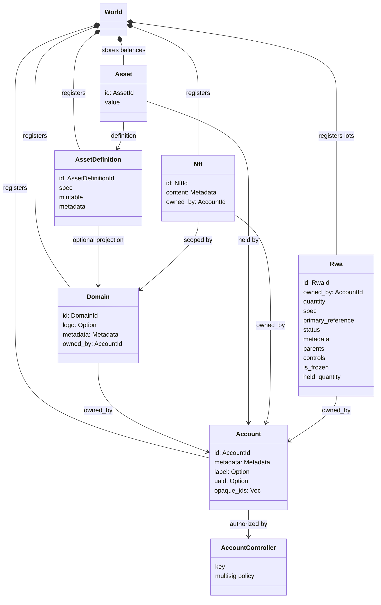
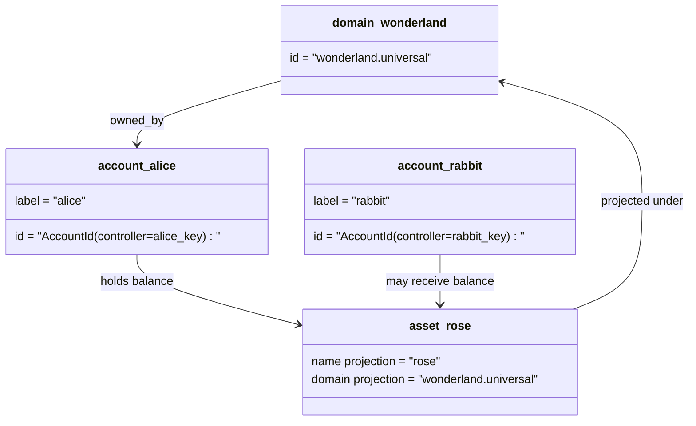

# ဒေတာပုံစံ {#data-model}

Iroha သည် `World` တွင်အုပ်စုစာရင်းအခြေအနေကို သိမ်းဆည်းထားသည်။ ၎င်း၏ပထမဆုံးထုတ်ဝေမှုဒေတာပုံစံသည် အောက်ပါ တရားဝင်ကိုယ်စားလှယ်များနှင့် အဖွဲ့အစည်းများကို အသုံးပြုသည်။

- ဒေတာနေရာအရည်အချင်းရှိသော ဒိုမီနိုင်းများ၊ ဥပမာ `payments.universal`
- အကောင့်များသည် တရားဝင်ဖြစ်ပြီး နယ်ပယ်မရှိပါ။ အကောင့် ID သည် အကောင့်ထိန်းချုပ်သူထံမှ ရယူထားသည်။
- အရင်းအမြစ်အဓိပ္ပါယ်ဖွင့်ဆိုချက်တွေဟာ ဒိုမင်/နာမည် စီမံကိန်းကို ထိန်းထားနိုင်ပေမဲ့ ၎င်းတို့ရဲ့ တရားဝင်စာသားလိပ်စာက ပွင့်လင်းမြင်သာမှုမရှိတဲ့ Base58 အထောက်အထားဖြစ်တယ်။
- အရင်းအမြစ်ဆိုသည်မှာ သီးခြားအရင်းအမြစ်သတ်မှတ်ချက်အတွက်စာရင်းများမှ သိမ်းဆည်းထားသော ငွေကြေးကျန်ရစ်မှုဖြစ်ပါသည်။
- NFTs သည် domain-qualified IDs နှင့် metadata content များနှင့်အတူ သီးသန့်ပိုင်ဆိုင်သော မှတ်တမ်းများဖြစ်သည်။
- RWAs သည် လက်ရှိပိုင်ရှင်၊ အရေအတွက်၊ ဖြစ်စဉ်၊ မီတာဒေတာ၊ ထိန်းသိမ်းမှု၊ အအေးခံခြင်းနှင့် သက်တမ်း စက်ဝန်းထိန်းချုပ်ချက်များဖြင့် ချိတ်ဆက်ထားသော ရှယ်ယာများကို ကိုယ်စားပြုသည့် ID လတ်များဖြစ်ပေါ်သည်။

## နမူနာ {#example}

တစ်ကြိမ်မှာ Iroha 3 ကွန်ရက်၊ `wonderland.universal` အထဲမှာ domain တစ်ခုဖြစ်ပါတယ် `universal` ဒီဥပမာထဲက Canonical Account တွေကို သူတို့ရဲ့ Key (သို့) Policy တွေနဲ့ ထိန်းချုပ်ပြီး Domainless လို့ ကုဒ်ပေးထားပါတယ်။ I105 အကောင့် IDs. စာဖတ်လို့ရတဲ့ လိပ်စာတွေ `alice@wonderland.universal` ဒါတွေကို ချိတ်ဆက်ထားတဲ့ သီးခြား အမည်အမည်တွေပါ။ IDs. စီမံကိန်းအရ အရင်းအမြစ်သတ်မှတ်ချက်ကို ဒိုမင်နဲ့ နာမည်တစ်ခုကနေ တည်ဆောက်နိုင်သေးတယ် `rose` အထဲမှာ `wonderland.universal`, ကြိုးပေါ်မှာ အသုံးပြုတဲ့ Canonic asset definition address ကတော့ generated Base58 address ပါ။

## အမည်မဖော်လိုသူများ {#aliases}

အမည်မဖော်လိုသူများသည်လူသားနှင့်ဆိုင်သောအမည်များဖြစ်ပြီး ကန်နီကလစ်ဂျာအမှတ်တံဆိပ်များအပေါ် layered ဖြစ်ပါသည်။ API, CLI, wallet နှင့် explorer နယ်နိမိတ်များတွင် အသုံးဝင်သော်လည်း ကန္နီကလစ္ဂျာ IDs သည် တင်းကျပ်သည့် ledger fields များတွင် သိမ်းဆည်းထားသော တည်ငြိမ် identifier များဖြစ်နေဆဲဖြစ်သည်။

|ရည်မှန်းချက်|Canonical ပစ်မှတ် |Alias စာလုံးအရ |နောက်ခံပုံစံ |
| -------------- | --------------------------------------------------- | ------------------------------------------------------ | ----------------------------------------------------------------------------- |
|အသုံးပြုသူစာရင်း |domainless `AccountId` ကို I105 လိပ်စာအဖြစ် ကုဒ်သွင်းထား |`name@domain.dataspace` သို့မဟုတ် `name@dataspace` |`AccountAlias`; အဓိက အမည်စာရင်းက `Account.label` ဖြစ်ပြီး ထပ်မံအမည်စာရင်းတွေက ချည်နှောင်မှုပါ။ |
|အရင်းအမြစ် သတ်မှတ်ချက် |`AssetDefinitionId` Base58 လိပ်စာ |`name#domain.dataspace` သို့မဟုတ် `name#dataspace` |`AssetDefinitionAlias` အရင်းအမြစ် သတ်မှတ်ချက်နှင့် ချည်နှောင်နေသည် |
|စာချုပ် |တရားဝင် Bech32m `ContractAddress` |`name::domain.dataspace` သို့မဟုတ် `name::dataspace` |`ContractAlias` စေလွှတ်ထားတဲ့ စာချုပ်လိပ်စာနဲ့ ချည်နှောင်ထားတယ်။ |
|ဒိုမင်နာမည် |`DomainId` ကို `domain.dataspace` ပုံစံမှာ |`domain.dataspace` |SNS `domain` နာမည်နေရာ မှတ်တမ်း |
|ဒေတာနေရာအမည် |Active Nexus စာရင်းထဲက နံပါတ် `DataSpaceId` |`universal`, `paynet`, (သို့) `zk` လို ဒေတာနေရာအမည်များ|SNS `dataspace` နာမည်နေရာ မှတ်တမ်းပေါင်းပြီး တက်ကြွတဲ့ ဒေတာနေရာ စာရင်း |

Account alias တွေက user-facing account နာမည်တွေပါ အကောင့်ပြန်လည်ဖွင့်ခြင်းမှာ ရှင်ကျန်နိုင်ပါတယ် အကြောင်းက alias က Active account ကို ညွှန်ပြလို့ပါ။ ID ကမ္ဘာ့နိုင်ငံများ၏ အညွှန်းကိန်းများနှင့် စာရင်းမှတ်တမ်းများမှတစ်ဆင့် အသုံးပြုပါ။ `SetPrimaryAccountAlias` အကောင့်ရဲ့ အဓိက တံဆိပ်အတွက်၊ `SetAccountAliasBinding` နောက်ထပ် အဓိကမဟုတ်တဲ့ အမည်အမည်များအတွက်၊ `FindAccountByAlias` ဒါမှမဟုတ် `FindAliasesByAccountId` Account aliases တွေအတွက် ပုံမှန်အားဖြင့် Active ကို လိုအပ်ပါတယ်။ SNS ငွေပေးချေမှုအစီအစဉ် `AcquireAccountAliasLease` ပြန်လည်ပြုပြင်ခြင်း `RenewAccountAliasLease`.

Asset aliases are name assets definitions, not individual account balances. asset aliases and contract aliases are direct bindings from a readable name to an existing canonical target. အရင်းအမြစ် အမည်အမည်အမည်များသည် သီးခြားစာရင်းကျန်ရစ်မှုမဟုတ်ဘဲ အရင်းအမြစ်ကိုအမည်သတ်မှတ်ချက်များဖြစ်ပါသည်။ Asset aliases များကို `SetAssetDefinitionAlias` ဖြင့် သတ်မှတ်ထားသည်၊ alias name segment သည် asset definition display name သို့မဟုတ် projected definition name နှင့် ကိုက်ညီရမည်၊ Contract aliases များအား `SetContractAlias` ဖြင့် သတ်မှတ်ရမည်။ alias dataspace သည် contract address တွင် encoded data space နှင့် ကိုက်စပ်ရမည်။ နှစ်ခုစလုံးမှာ `lease_expiry_ms` ကို သယ်ဆောင်နိုင်ပြီး သက်တမ်းကုန်ဆုံးတဲ့အခါ ကရုဏာ ပြတင်းပေါက် ကုန်သွားတဲ့အခါ ဖြေရှင်းခြင်းကို ရပ်ဆိုင်းပြီး ကမ္ဘာ့နိုင်ငံအညွှန်းကိန်းတွေကနေ ဖယ်ရှားခံရတယ်။

Domain တွေမှာ သီးခြား `DomainAlias` အရာဝတ္ထုမရှိပါ။ domain ID သည် `payments.universal` ကဲ့သို့သော dataspace-qualified နာမည်တစ်ခုဖြစ်သည်။ SNS သည် `domain` နာမ်ဇုန်အတွင်းရှိ domain name များအတွက် lease ပိုင်ဆိုင်မှုနှင့် `dataspace` နာမ်ဇုန်းအတွင်းရှိ dataspace aliases များအတွက် ခြေရာခံထားသည်။ ကန့်သတ်ထားသော `universal` ဒေတာနေရာ အမည်မဖော်လိုပါက ဆက်ပြီး သတ်မှတ်ထားရမည်။

## ဆက်စပ်သော စာတမ်းများ {#related-docs}

|အကြောင်းအရာ|ဘယ်ကိုသွားရမလဲ|
| -------------------------------------- | ------------------------------------------- |
|ဒိုမင်များ| [ဒိုမင်များ](/my/blockchain/domains.md) |
|အကောင့်များ | [အကောင့်များ](/my/blockchain/accounts.md) |
|အရင်းအမြစ်များ| [အရင်းအမြစ်များ](/my/blockchain/assets.md) |
|NFTs | [NFTs](/my/blockchain/nfts.md) |
|လက်တွေ့ကမ္ဘာက ပိုင်ဆိုင်မှု | [Real-World Assets ](/my/blockchain/rwas.md) |
|metadata ကို| [metadata](/my/blockchain/metadata.md) |
|မှတ်ပုံတင်ခြင်းနှင့် လွှဲပြောင်းခြင်းဆိုင်ရာ ညွှန်ကြားချက်များ | [ညွှန်ကြားချက်များ ](/my/blockchain/instructions.md) |
|Runtime ခွင့်ပြုချက်များ | [ခွင့်ပြုချက်များ ](/my/blockchain/permissions.md) |
|နာမည်ပေးခြင်း စည်းမျဉ်းများ | [အမည်ပေးခြင်း စည်းမျဉ်းများ ](/my/reference/naming.md) |
