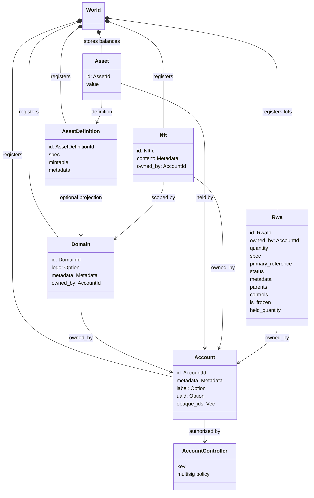
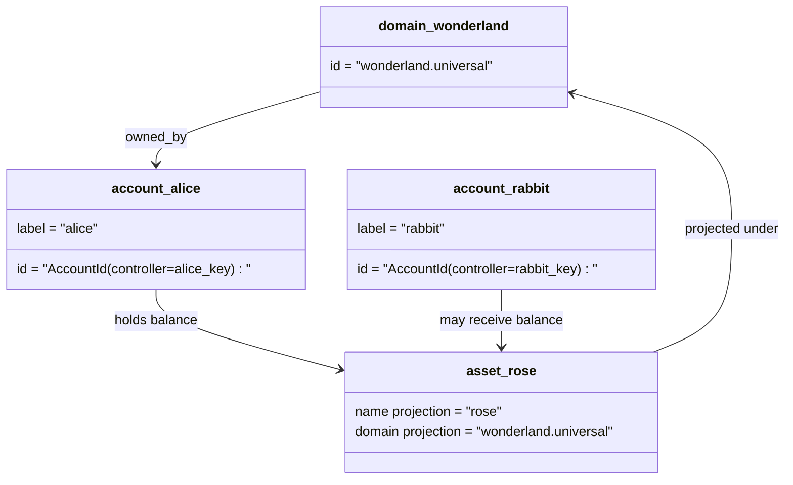

# ဒေတာပုံစံ {#data-model}

Iroha သည် blockchain ledger အခြေအနေကို `World` တွင် သိမ်းဆည်းထားသည်။ ၎င်း၏ပထမဦးဆုံးထုတ်ပြန်မှုဒေတာပုံစံသည် အောက်ပါ တစ်ခုတည်းသော ပရိုတိုကောစံညွှန်းအမည်များနှင့်အဖွဲ့အစည်းများကိုအသုံးပြုသည်:

- ဒေတာနေရာအရည်အချင်းရှိသော ဒိုမီနိုင်းများ၊ ဥပမာ `payments.universal`
- အကောင့်များမှာ Single Protocol Standard နှင့် Domainless ရှိပြီး Account ID ကို Account Controller မှ ရယူထားသည်။
- အရင်းအမြစ်အဓိပ္ပါယ်ဖွင့်ဆိုချက်တွေဟာ ဒိုမင်/နာမည် စီမံကိန်းကို ထိန်းသိမ်းနိုင်ပေမဲ့ ၎င်းတို့ရဲ့ တစ်ခုတည်းသော ပရိုတိုကုတ်စံညွှန်း စာသားလိပ်စာက မရှင်းလင်းတဲ့ Base58 မှတ်သားရေးကိရိယာပါ။
- အရင်းအမြစ်ဆိုသည်မှာ သီးခြားအရင်းအမြစ်သတ်မှတ်ချက်အတွက်စာရင်းများမှ သိမ်းဆည်းထားသော ငွေကြေးကျန်ရစ်မှုဖြစ်ပါသည်။
- NFTs သည် domain-qualified IDs နှင့် metadata content များနှင့်အတူ သီးသန့်ပိုင်ဆိုင်သော မှတ်တမ်းများဖြစ်သည်။
- RWAs သည် လက်ရှိပိုင်ရှင်၊ အရေအတွက်၊ မူလနေရာ၊ မီတာဒေတာ၊ သိမ်းဆည်းမှု၊ အေးဆေးခြင်းနှင့် သက်တမ်းပတ်ဝန်းကျင် ထိန်းချုပ်ချက်များရှိသော ချိတ်ဆက်မှုအပြင် ပိုင်ဆိုင်မှုများကို ကိုယ်စားပြုသည့် ထုတ် generated-ID များဖြစ်သည်။

## နမူနာ {#example}

Iroha 3 ကွန်ယက်တွင်, `wonderland.universal` သည် `universal` ဒေတာနေရာအတွင်းကဒိုမင်တစ်ခုဖြစ်သည်။ ဤဥပမာထဲက တစ်ခုတည်းသော ပရိုတိုကောစံညွှန်းစာရင်းများသည်သူတို့၏သော့များ (သို့မဟုတ်) မူဝါဒများဖြင့်ထိန်းချုပ်ထားပြီးဒိုမိုင်းမဲ့ I105 အကောင့် ID များအဖြစ်ကုဒ်သွင်းထားသည်။ `alice@wonderland.universal` လို ဖတ်လို့ရတဲ့ လိပ်စာတွေဟာ ဒီ ID တွေနဲ့ ချိတ်ဆက်ထားတဲ့ သီးခြား အမည်အမွှားတွေပါ။ စီမံကိန်းအရ အရင်းအမြစ်ဆိုင်ရာ အဓိပ္ပါယ်ဖွင့်ဆိုချက်ကို ဒိုမင်တစ်ခုနဲ့ နာမည်ကနေ တည်ဆောက်နိုင်တုန်းပါ။ `rose` နှင့် `wonderland.universal` တို့ကဲ့သို့သော အချက်အလက်များကို ထုတ်လွှင့်ရာတွင် အသုံးပြုသည့် Single Protocol Standard Asset Definition Address သည် Generated Base58 Address ဖြစ်သည်။

## အမည်မဖော်လိုသူများ {#aliases}

အမည်မဖော်လိုသူများသည် လူသားမျက်နှာစာရင်းအမည်များဖြစ်ပြီး single protocol-standard blockchain ledger identifiers များအပေါ် layered ဖြစ်ပါသည်။ API, CLI, wallet နှင့် explorer နယ်နိမိတ်များတွင် အသုံးဝင်သော်လည်း single protocol-standard IDs သည် တင်းကျပ်သော blockchain ledger ကွင်းများတွင် သိမ်းဆည်းထားသည့် တည်ငြိမ်သော identifier များဖြစ်နေဆဲဖြစ်သည်။

|ရည်မှန်းချက်|တစ်ခုတည်းသော ပရိုတိုကုတ်စံညွှန်း ရည်မှန်းချက် |Alias စာလုံးအရ |နောက်ခံပုံစံ |
| -------------- | --------------------------------------------------- | ------------------------------------------------------ | ----------------------------------------------------------------------------- |
|အသုံးပြုသူစာရင်း |domainless `AccountId` ကို I105 လိပ်စာအဖြစ် ကုဒ်သွင်းထား |`name@domain.dataspace` သို့မဟုတ် `name@dataspace` |`AccountAlias`; အဓိက အမည်စာရင်းက `Account.label` ဖြစ်ပြီး ထပ်မံအမည်စာရင်းတွေက ချည်နှောင်မှုပါ။ |
|အရင်းအမြစ် သတ်မှတ်ချက် |Single protocol-standard `AssetDefinitionId` Base58 အမည် |`name#domain.dataspace` သို့မဟုတ် `name#dataspace` |`AssetDefinitionAlias` အရင်းအမြစ် သတ်မှတ်ချက်နှင့် ချည်နှောင်နေသည် |
|စာချုပ် |Single protocol-standard Bech32m `ContractAddress` |`name::domain.dataspace` သို့မဟုတ် `name::dataspace` |`ContractAlias` စေလွှတ်ထားတဲ့ စာချုပ်လိပ်စာနဲ့ ချည်နှောင်ထားတယ်။ |
|ဒိုမင်နာမည် |`DomainId` ကို `domain.dataspace` ပုံစံမှာ |`domain.dataspace` |SNS `domain` နာမည်နေရာ မှတ်တမ်း |
|ဒေတာနေရာအမည် |Active Nexus စာရင်းထဲက နံပါတ် `DataSpaceId` |`universal`, `paynet`, (သို့) `zk` လို ဒေတာနေရာအမည်များ|SNS `dataspace` နာမည်နေရာ မှတ်တမ်းပေါင်းပြီး တက်ကြွတဲ့ ဒေတာနေရာ စာရင်း |

Account aliases တွေဟာ user-facing account နာမည်တွေပါ။ alias world-state index များနှင့် account rekey မှတ်တမ်းများမှတဆင့် တက်ကြွသော အကောင့် ID ကိုမှတ်ချက်ပေးသည်။ `SetPrimaryAccountAlias` အကောင့်ရဲ့ အဓိက တံဆိပ်အတွက်၊ `SetAccountAliasBinding` နောက်ထပ် အဓိကမဟုတ်တဲ့ အမည်အမည်များအတွက်၊ `FindAccountByAlias` ဒါမှမဟုတ် `FindAliasesByAccountId` Account aliases တွေအတွက် ပုံမှန်အားဖြင့် Active ကို လိုအပ်ပါတယ်။ SNS ငွေပေးချေမှုအစီအစဉ် `AcquireAccountAliasLease` ပြန်လည်ပြုပြင်ခြင်း `RenewAccountAliasLease`.

Asset aliases are name asset definitions, not individual account balances. asset aliases and contract aliases are direct bindings from a readable name to an existing single protocol-standard target. အရင်းအမြစ် အမည်အမည်အမည်များသည် သီးသန့်စာရင်းကျန်ရစ်မှုမဟုတ်ဘဲ အရင်းအမြစ်ကိုအမည်သတ်မှတ်ခြင်းဖြစ်သည်။ Asset aliases များကို `SetAssetDefinitionAlias` ဖြင့် သတ်မှတ်ထားရမည်။ alias name segment သည် asset definition display name သို့မဟုတ် projected definition name နှင့် ကိုက်ညီရမည်ဖြစ်သည်။ Contract aliases များအား `SetContractAlias` ဖြင့် သတ်မှတ်ရပါမည်။ alias dataspace သည်စာချုပ်လိပ်စာတွင်ကုဒ်သွင်းထားသော dataspace နှင့်ကိုက်ညီရမည်ဖြစ်သည်။ နှစ်ခုစလုံးသည် `lease_expiry_ms` ကိုဆောင်နိုင်သည်။ သက်တမ်းကုန်ဆုံးပြီးနောက် Grace ပြတင်းပေါက် ကုန်သွားသောအခါဖြေရှင်းခြင်းကိုရပ်ဆိုင်းပြီးကမ္ဘာနိုင်ငံအညွှန်းကိန်းများမှဖယ်ရှားခြင်းခံရပါသည်။

Domain တွေမှာ သီးခြား `DomainAlias` ပိုင်ဆိုင်မှုမရှိဘူး။ domain ID ဟာ `payments.universal` လို ဒေတာနေရာအတွက် အရည်အချင်းရှိတဲ့ နာမည်တစ်ခုပါ။ SNS သည်ငှားရမ်းပိုင်ခွင့်ကို ခြေရာခံတယ်။ `domain` နာမည်နေရာအတွင်းက ဒိုမင်အမည်များအတွက်နှင့် `dataspace` နာမည်နေရာတွင်ရှိသော ဒေတာနေရာ အမည်မဲ့အမည်များ အတွက်။ ကန့်သတ်ထားသော `universal` ဒေတာနေရာအမည်မဲ့အနက်များသည် သတ်မှတ်ထားရမည်ဖြစ်သည်။

## ဆက်စပ်သော စာတမ်းများ {#related-docs}

|အကြောင်းအရာ|ဘယ်ကိုသွားရမလဲ|
| -------------------------------------- | ------------------------------------------- |
|ဒိုမင်များ|[ဒိုမင်များ](/my/blockchain/domains.md) |
|အကောင့်များ |[အကောင့်များ](/my/blockchain/accounts.md) |
|အရင်းအမြစ်များ|[ပိုက်ဆံများ](/my/blockchain/assets.md) |
|NFTs |[NFTs](/my/blockchain/nfts.md) |
|လက်တွေ့ကမ္ဘာက ပိုင်ဆိုင်မှု |[လက်တွေ့လောကဆိုင်ရာ အရင်းအမြစ်များ](/my/blockchain/rwas.md) |
|မီတာဒေတာ|[မီတာဒေတာ](/my/blockchain/metadata.md) |
|မှတ်ပုံတင်ခြင်းနှင့် လွှဲပြောင်းခြင်းဆိုင်ရာ ညွှန်ကြားချက်များ |[ညွှန်ကြားချက်](/my/blockchain/instructions.md) |
|ဆော့ဝဲ အကောင်အထည်ဖော်ရေး ပတ်ဝန်းကျင် ခွင့်ပြုချက်များ |[ခွင့်ပြုချက်များ](/my/blockchain/permissions.md) |
|နာမည်ပေးခြင်း စည်းမျဉ်းများ |[အမည်ပေးခြင်းဆိုင်ရာ စည်းမျဉ်းများ](/my/reference/naming.md) |
