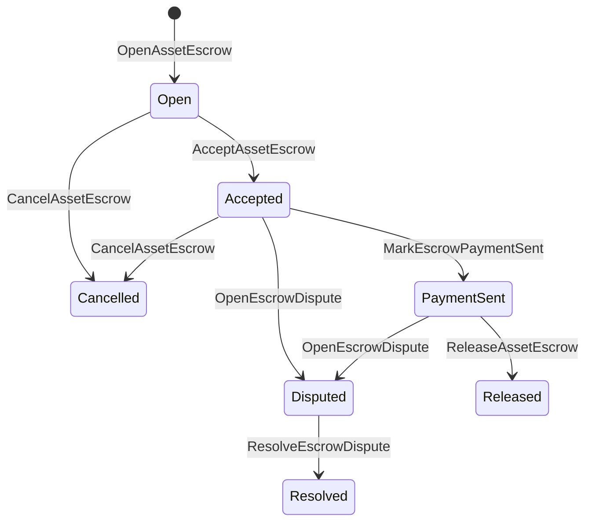

# Native Asset Escrow {#native-asset-escrow}

Native escrow ဆိုသည်မှာ ကိန်းဂဏန်းဆိုင်ရာ အရင်းအမြစ်များအတွက် blockchain ledger ထိန်းသိမ်းမှု ယန္တရားမှ စီမံခန့်ခွဲထားသော Native Escrow ဖြစ်သည်။ အဆိုပါစာရင်းကိုကာကွယ်ရန် လျှောက်လွှာကုဒ်၊ အချုပ်အခြာခံ ISIs တန်ဖိုးကို သတ်မှတ်ချက်ဆိုင်ရာ ပရိုတိုကောလစ် ထိန်းသိမ်းရေးစာရင်းသို့ပြောင်းပြီး ကမ္ဘာ့အခြေအနေတွင် အချုပ်အခမဲ့သက်တမ်းလည်ပတ်မှုကို မှတ်တမ်းတင်ပါ။

စျေးကွက်မှာ ငွေကြေးငွေပေးချေမှုဖြေရှင်းရေးအတွက် Native escrow ကိုသုံးပါ။ Aitai ပုံစံ Off-Chain ပေးချေမှု ညှိနှိုင်းမှု၊ မှတ်တိုင်ပိတ်ခြင်းတွေနဲ့ blockchain ledger ဘဝပတ်ဝန်းကျင်အခြေအနေမှာ မြင်နိုင်ဖို့လိုအပ်တဲ့ ကာကွယ်ထားတဲ့ escrow လုပ်ငန်းခွင်တွေကို သုံးပါ။

## အယူအဆများ {#concepts}

|အယူအဆ|သရုပ်ဖော်ချက် |
| --- | --- |
|`EscrowId` |client က ရွေးချယ်ထားတဲ့ ID ကို cryptographic hash တစ်ခုကို ဖုံးအုပ်ထားဖို့ တောင်းဆိုပါတယ်။ ဒါက ပွင့်လင်းမြင်သာပြီး အမည်မဲ့ escrow တွေကြားမှာ ထူးခြားဖို့လိုတယ်။ |
|`AssetEscrowRecord` |ပွင့်လင်းမြင်သာတဲ့ ကိန်းဂဏန်းအရ အရင်းအမြစ် ဂိုဏ်း (သို့) Lock မှတ်တမ်း။ |
|`AnonymousAssetEscrowRecord` |Nullifiers, cryptographic commitment values နဲ့ proof attachments တွေက ထောက်ပံ့ထားတဲ့ Shielded escrow record တွေပါ။|
|စောင့်ရှောက်မှုစာရင်း |Chain ID၊ escrow ID နဲ့ Asset Definition တွေကနေ ရယူထားတဲ့ Deterministic Protocol account ပါ။ |
|သက်သေခံ cryptographic hashes များ |Evidence cryptographic hashes တွေက ငွေကြေးခွန်တွေ၊ ဆုံးဖြတ်ချက်တွေ၊ သတင်းစကားတွေ၊ သိုလှောင်တဲ့ နည်းပညာ မန်နေဖစ်တွေ (သို့) အခြားအချိတ်ဆက်မထားတဲ့ အထောက်အထားတွေကို ဖော်ထုတ်နိုင်ပါတယ်။ သက်သေပြမှု အသုံးဝင်မှုကိုယ်၌ကို escrow မှတ်တမ်းမှာ သိမ်းဆည်းခြင်းမရှိဘူး။ |

ပွင့်လင်းမြင်သာသော မှတ်တမ်းများတွင် ရောင်းသူ၊ ရွေးချယ်သုံးစွဲသူ၊ အရင်းအမြစ် သတ်မှတ်ချက်၊ စုစုပေါင်းပမာဏ၊ ထိန်းသိမ်းစာရင်း၊ သက်တမ်း စက်ဝန်းအခြေအနေ၊ အပြုအမူအမျိုးအစား၊ ကျန်ငွေကြေး၊ ရွေးချယ်ထုတ်ပြန်ခွင့်ပြုမှု မူဝါဒ၊ ရွေးချယ်သက်တမ်းကုန်ဆုံးသည့် အချိန်တံဆိပ်၊ သက်သေခံ cryptographic hashes များ၊ အချိန်တံဆစ်များနှင့် ရွေးချယ်ဖြေရှင်းရေး အသေးစိတ်များပါဝင်သည်။

Escrow ပမာဏတွေဟာ အပြုသဘော ကိန်းဂဏန်း အရင်းအမြစ်အရေအတွက်တွေ ဖြစ်ပြီး asset အဓိပ္ပါယ်ဖွင့်ဆိုချက်ရဲ့ ကိန်း ဂဏန်း သတ်မှတ်ချက်နဲ့ ကိုက်ညီဖို့လိုပါတယ်။ escrow (သို့) lock က တက်ကြွနေတုန်းမှာ ယေဘုယျအရင်းအမြစ် လွှဲပြောင်းမှုက custody account ကို မဖြုတ်နိုင်ပါဘူး။ custody exit paths တွေက အောက်မှာဖော်ပြထားတဲ့ escrow ISIs ဖြစ်ပါတယ်။

## စျေးကွက် Escrow {#marketplace-escrow}

Marketplace escrow ဟာ ချိတ်ဆက်ထားတဲ့ အရင်းအမြစ်တွေကို ချိတ်ဆက်တဲ့ ချိတ်ဆက်မှုထဲက ငွေပေးချေမှု (သို့) ပို့ဆောင်ရေး လုပ်ငန်းခွင်နဲ့ ညှိနှိုင်းပါတယ်။



|ISI |ဘယ်သူက တင်ပြတာလဲ။|သက်ရောက်မှု |
| --- | --- | --- |
|`OpenAssetEscrow` |ရောင်းသူ |ရောင်းသူရဲ့ ကိန်းဂဏန်းအရင်းအမြစ်ကို ပရိုတိုကောလစ် ထိန်းသိမ်းမှုမှာ ချိတ်ထားပြီး `Open` စျေးကွက်မှတ်တမ်းတစ်ခု ဖန်တီးတယ်။ |
|`AcceptAssetEscrow` |ဝယ်သူ |ဝယ်သူကို မှတ်တမ်းတင်ပြီး `Open` ကို `Accepted` သို့ ရွှေ့ပြောင်းတယ်။ ရောင်းသူက သူ့ကိုယ်ပိုင် အာမခံကို လက်ခံလို့မရဘူး။ |
|`MarkEscrowPaymentSent` |လက်ခံထားရသူ |`Accepted` ကို `PaymentSent` သို့ပြောင်းသည် ဝယ်ယူသူက ကွင်းဆက်ပြင်ပ ငွေပေးချေမှုပို့ပြီးနောက်။ |
|`ReleaseAssetEscrow` |ရောင်းသူ |`PaymentSent` ကို `Released` သို့ ရွှေ့ပေးပြီး အပြည့်အဝ ကမ်းလှမ်းထားသော ပမာဏကို ဝယ်ယူသူအား လွှဲပြောင်းပေးသည်။ |
|`CancelAssetEscrow` |ရောင်းသူ |`Open` (သို့) `Accepted` ကို `Cancelled` သို့ပြောင်းပြီး ငွေပေးချေမှု အမှတ်တံဆိပ်မပါမီ ရောင်းသူအား ပြန်လည်ပေးသွင်းသည်။ |
|`OpenEscrowDispute` |ရောင်းသူ (သို့) လက်ခံဝယ်ယူသူ |`Accepted` (သို့) `PaymentSent` ကို `Disputed` သို့ပြောင်းပြီး အထောက်အထားအတွက် cryptographic hash များကိုထည့်သွင်းသည်။ |
|`ResolveEscrowDispute` |`CanResolveEscrowDispute` နှင့်စာရင်း|`Disputed` ကို `Resolved` သို့ပြောင်းပြီး ဝယ်သူနဲ့ရောင်းသူကြားမှာ ပမာဏကိုခွဲတယ်။ |

အငြင်းပွားမှုဖြေရှင်းရေး ပမာဏများသည် အပျက်သဘောမဟုတ်ဘဲ `buyer_amount + seller_amount` သည် ဂိုဒေါင်ငွေပမာဏနှင့်ညီရမည်။ သုညတန်ဖိုးရှိ ငွေကြေးလွှဲပြောင်းမှုအစိတ်အပိုင်းများကို ခွင့်ပြုထားသော်လည်း ခွဲဝေမှုတစ်ခုလုံးက ပိတ်ထားသော ဆန်လန်ကို ထည့်တွက်ရသည်။

### Rust ဥပမာ {#rust-example}

ဒီဥပမာက ရောင်းသူနဲ့ ဝယ်သူရဲ့ အကောင့်တွေ ရှိပြီးသား၊ အရင်းအမြစ် အဓိပ္ပါယ်ဖွင့်ဆိုချက်ကို ကိန်းဂဏန်းအဖြစ် မှတ်ပုံတင်ထားပြီး ရောင်းသူမှာ လုံလောက်တဲ့ ဟန်ချက်ရှိတယ်လို့ ယူဆတယ်။

```rust
use iroha::{
    client::Client,
    data_model::{
        isi::escrow::{
            AcceptAssetEscrow, MarkEscrowPaymentSent, OpenAssetEscrow,
            ReleaseAssetEscrow,
        },
        prelude::*,
    },
};
use iroha_crypto::Hash;

fn release_marketplace_escrow(
    seller_client: &Client,
    buyer_client: &Client,
    asset_definition_id: AssetDefinitionId,
) -> eyre::Result<()> {
    let escrow_id = EscrowId::new(Hash::new("docs-marketplace-escrow-001"));

    seller_client.submit_blocking(OpenAssetEscrow::with_evidence_hashes(
        escrow_id,
        asset_definition_id,
        Numeric::from(40_u64),
        vec![Hash::new("invoice:2026-001")],
    ))?;

    buyer_client.submit_blocking(AcceptAssetEscrow::new(escrow_id))?;
    buyer_client.submit_blocking(MarkEscrowPaymentSent::new(escrow_id))?;
    seller_client.submit_blocking(ReleaseAssetEscrow::new(escrow_id))?;

    let record = seller_client.query_single(FindAssetEscrowById::new(escrow_id))?;
    assert_eq!(record.status, AssetEscrowStatus::Released);
    assert_eq!(record.remaining_amount, Numeric::zero());

    Ok(())
}
```

## ယေဘုယျ အရင်းအမြစ် Lock များ {#generic-asset-locks}

Asset locks တွေမှာ custody record အမျိုးအစားတစ်ခုတည်းကိုသုံးပေမဲ့ ဝယ်သူနဲ့ရောင်းသူ ကမ်းလှမ်းမှုမဟုတ်ပါဘူး။ ဒါတွေဟာ ရည်ရွယ်ချက်စာရင်းအတွက် ငွေကြေးကိုပိတ်ထားပြီး ရွေးချယ်စရာအနေနဲ့ ငွေကြေးထုတ်ယူဖို့ သီးခြားလွတ်မြောက်ခွင့်လိုင်စင် လိုအပ်ပါတယ်။

|ISI |ဘယ်သူက တင်ပြတာလဲ။|သက်ရောက်မှု |
| --- | --- | --- |
|`OpenAssetLock` |အရင်းအမြစ်စာရင်း|အပြုသဘောဆောင်တဲ့ ပမာဏကို ပိတ်ထားပြီး မှတ်တမ်းဝယ်သူအဖြစ် ရည်ရွယ်ချက်မှတ်တမ်းတင်ထားပြီး အခြေအနေကို `Locked` သို့ သတ်မှတ်တယ်။ |
|`DrawdownAssetLock` |လွတ်မြောက်ခွင့်ပြုမှု မူလစာရင်း (သို့) လွှတ်ထွက်ခွင့်ပြုမှုမူလစာရင်း မသတ်မှတ်ပါက ရည်ရွယ်ချက် |ကျန်ရှိနေသေးတဲ့ ထိန်းသိမ်းမှုကို တစ်စိတ်တစ်ပိုင်း (သို့) အပြည့်အဝ ရည်မှန်းချက်နေရာကို လွှဲပြောင်းတယ်။ |
|`CancelAssetLock` |Lock opener ကို|Active lock ကို ဖျက်ပြီး ကျန်တဲ့ပမာဏကို ဖွင့်သူဆီ ပြန်ပေးပါတယ်။ |
|`ExpireAssetLock` |နောက်ဆုံးအချိန်အပြီးမှာ ငွေပေးချေခွင့်ပြုမှု အရင်းအမြစ်များ|`expires_at_ms` နဲ့ ပိတ်ထားပြီးနောက် ကျန်တဲ့ပမာဏကို ဖွင့်ပေးသူဆီ ပြန်ပို့တယ်။ |

`DrawdownAssetLock` သည် `Locked` တွင် မှတ်တမ်းကို ထိန်းသိမ်းထားပြီး တစ်ချို့ပမာဏများ ကျန်ရှိနေသည်။ ကျန်သောပမာဏက သုညသို့ရောက်တဲ့အခါ အခြေအနေသည် `DrawnDown` ဖြစ်လာပြီး မှတ်တမ်းကို ပိတ်ထားသည်။

```rust
use iroha::{
    client::Client,
    data_model::{
        isi::escrow::{CancelAssetLock, DrawdownAssetLock, ExpireAssetLock, OpenAssetLock},
        prelude::*,
    },
};
use iroha_crypto::Hash;

fn drawdown_and_close_asset_locks(
    opener_client: &Client,
    destination_client: &Client,
    release_authority_client: &Client,
    asset_definition_id: AssetDefinitionId,
    destination: AccountId,
    release_authority: AccountId,
) -> eyre::Result<()> {
    let trusted_lock_id = EscrowId::new(Hash::new("docs-asset-lock-trusted"));

    opener_client.submit_blocking(OpenAssetLock::with_options(
        trusted_lock_id,
        asset_definition_id.clone(),
        destination.clone(),
        Numeric::from(40_u64),
        Some(release_authority),
        None,
        vec![Hash::new("milestone-plan-v1")],
    ))?;

    release_authority_client.submit_blocking(DrawdownAssetLock::new(
        trusted_lock_id,
        Numeric::from(15_u64),
    ))?;

    let partially_drawn =
        opener_client.query_single(FindAssetEscrowById::new(trusted_lock_id))?;
    assert_eq!(partially_drawn.status, AssetEscrowStatus::Locked);
    assert_eq!(partially_drawn.remaining_amount, Numeric::from(25_u64));

    opener_client.submit_blocking(CancelAssetLock::new(trusted_lock_id))?;
    let cancelled = opener_client.query_single(FindAssetEscrowById::new(trusted_lock_id))?;
    assert_eq!(cancelled.status, AssetEscrowStatus::Cancelled);

    let expiring_lock_id = EscrowId::new(Hash::new("docs-asset-lock-expiring"));
    opener_client.submit_blocking(OpenAssetLock::with_options(
        expiring_lock_id,
        asset_definition_id,
        destination,
        Numeric::from(10_u64),
        None,
        Some(0),
        Vec::new(),
    ))?;

    destination_client.submit_blocking(ExpireAssetLock::new(expiring_lock_id))?;
    let expired = opener_client.query_single(FindAssetEscrowById::new(expiring_lock_id))?;
    assert_eq!(expired.status, AssetEscrowStatus::Expired);

    Ok(())
}
```

Python လက်ရှိတွင် အထွေထွေ Lock များအတွက် အဆင့်မြင့် အကူအညီပေးသူများကို ပိတ်ထားသည် `open_asset_lock`, `drawdown_asset_lock`, `cancel_asset_lock`, နှင့် `expire_asset_lock`. စျေးကွက်နှင့် အမည်မသိ အာမခံများအတွက် Python, တစ်ခုတည်းသော ပရိုတိုကောလံကို အသုံးပြုပါ။ `InstructionBox` JSON တစ်လျှောက်လုံး SDK ဒါက JSON escape hatch (သို့မဟုတ်) ပြိုကျမှုတစ်ခုမှတစ်ဆင့် submit SDK ပထမတန်းစား ဂိုဏ်းတည်ဆောက်သူတွေကို ပွင့်လင်းမြင်သာစေပါတယ်။

## အငြင်းပွားမှု {#disputes}

`Accepted` သို့မဟုတ် `PaymentSent` မှ စျေးကွက်အမှတ်တံဆိပ်တစ်ခုက ပဋိပက္ခကိုဝင်ရောက်နိုင်သည်။ မှတ်ပုံတင်ရောင်းသူ (သို့) ဝယ်သူသာပဋိပက္ခဖွင့်နိုင်သည်။ ဖြေရှင်းရန်အတွက် `CanResolveEscrowDispute` ကိုလိုအပ်သည်၊ အဖြေရှာသူစာရင်းသို့ တိုက်ရိုက်ပေးအပ်ထားသည် သို့မဟုတ် အခန်းကဏ္ဍမှတစ်ဆင့် အမွေခံရသည်။

```rust
use iroha::{
    client::Client,
    data_model::{
        isi::escrow::{OpenEscrowDispute, ResolveEscrowDispute},
        prelude::*,
    },
};
use iroha_crypto::Hash;
use iroha_executor_data_model::permission::escrow::CanResolveEscrowDispute;

fn resolve_disputed_escrow(
    admin_client: &Client,
    buyer_client: &Client,
    court_client: &Client,
    court: AccountId,
    escrow_id: EscrowId,
) -> eyre::Result<()> {
    admin_client.submit_blocking(Grant::account_permission(
        Permission::from(CanResolveEscrowDispute),
        court,
    ))?;

    buyer_client.submit_blocking(OpenEscrowDispute::with_evidence_hashes(
        escrow_id,
        vec![Hash::new("buyer-payment-receipt")],
    ))?;

    court_client.submit_blocking(ResolveEscrowDispute::with_evidence_hashes(
        escrow_id,
        Numeric::from(30_u64),
        Numeric::from(10_u64),
        vec![Hash::new("court-judgement-001")],
    ))?;

    let record = admin_client.query_single(FindAssetEscrowById::new(escrow_id))?;
    assert_eq!(record.status, AssetEscrowStatus::Resolved);
    assert_eq!(
        record.resolution.as_ref().map(|resolution| resolution.buyer_amount.clone()),
        Some(Numeric::from(30_u64)),
    );

    Ok(())
}
```

## အမည်မသိ Escrow {#anonymous-escrow}

Anonymous escrow ဟာ တူညီတဲ့ စျေးကွက် သက်တမ်း စက်ဝန်းကို သုံးပေမဲ့ ရင်းနှီးမြှုပ်နှံမှုနဲ့ ပိတ်သိမ်းတဲ့ အရင်းအမြစ် ရွေ့လျားမှုကို ကာကွယ်ထားတယ်။ အများပြည်သူ မှတ်ပုံတင်ကရောင်းသူ၊ ဝယ်သူ၊ အခြေအနေ၊ သက်သေခံအချက်အလက်များ - cryptographic hashes, timestamps နှင့် proof-linked movement records များ။ ကာကွယ်ထားသောမှတ်စုများအတွင်းရှိ ငွေကြေးငွေနှင့် လက်ခံရရှိသူများကို cryptographic commitment တန်ဖိုးများ၊ nullifiers များနှင့် proof attachments များဖြင့် ကိုယ်စားပြုသည်။

|ပွင့်လင်းမြင်သာသော ISI |အမည်မသိ ISI |
| --- | --- |
|`OpenAssetEscrow` |`OpenAnonymousAssetEscrow` |
|`AcceptAssetEscrow` |`AcceptAnonymousAssetEscrow` |
|`MarkEscrowPaymentSent` |`MarkAnonymousEscrowPaymentSent` |
|`ReleaseAssetEscrow` |`ReleaseAnonymousAssetEscrow` |
|`CancelAssetEscrow` |`CancelAnonymousAssetEscrow` |
|`OpenEscrowDispute` |`OpenAnonymousEscrowDispute` |
|`ResolveEscrowDispute` |`ResolveAnonymousEscrowDispute` |

Wallet သို့မဟုတ် prover tooling သည်သက်သေခံ attachment နှင့် အများပြည်သူ input များကို တည်ဆောက်ရန်လိုအပ်သည်။ ဖွင့်ခြင်းသည် escrow cryptographic commitment value တစ်ခုကိုဖန်တီးသည်။ ပြန်လွှတ်ခြင်း၊ ဖျက်သိမ်းခြင်း၊ အမည်မဲ့ငြင်းခုံမှုဖြေရှင်းရေးက Escrow cryptographic commitment တန်ဖိုးတစ်ခုတည်းကိုတိကျစွာသုံးပြီး လုပ်ဆောင်ချက်အတွက်လိုအပ်တဲ့ဝယ်သူ၊ရောင်းသူ (သို့မဟုတ်) ထုတ်ကုန်ကွဲပြားသော cryptographic engagement တန်ဖိုးများကိုဖန်တီးရမည်။

```rust
use iroha::{
    client::Client,
    data_model::{
        isi::escrow::{
            AcceptAnonymousAssetEscrow, MarkAnonymousEscrowPaymentSent,
            OpenAnonymousAssetEscrow,
        },
        prelude::*,
        proof::ProofAttachment,
    },
};
use iroha_crypto::Hash;

fn open_anonymous_escrow(
    seller_client: &Client,
    buyer_client: &Client,
    escrow_id: EscrowId,
    asset_definition_id: AssetDefinitionId,
    funding_nullifiers: Vec<[u8; 32]>,
    escrow_commitment: [u8; 32],
    proof: ProofAttachment,
    root_hint: Option<[u8; 32]>,
) -> eyre::Result<()> {
    seller_client.submit_blocking(OpenAnonymousAssetEscrow::with_evidence_hashes(
        escrow_id,
        asset_definition_id,
        funding_nullifiers,
        escrow_commitment,
        proof,
        root_hint,
        vec![Hash::new("shielded-invoice")],
    ))?;

    buyer_client.submit_blocking(AcceptAnonymousAssetEscrow::new(escrow_id))?;
    buyer_client.submit_blocking(MarkAnonymousEscrowPaymentSent::new(escrow_id))?;

    Ok(())
}
```

အခြေခံကာကွယ်ထားသော ငွေချေးမှုပုံစံအတွက် [အမည်မသိ ငွေပေးချေမှု](/my/blockchain/anonymous-transactions.md) ကိုကြည့်ပါ။

## SDK အသုံးပြုမှု {#sdk-usage}

SDKs တစ်ခုတည်းသော ပရိုတိုကော စံအတိုင်း ရိုက်နှိပ်ထားသော ဒေတာပုံစံကို Rust တွင်ရှိသည်။ Python သည် လက်ရှိတွင် ယေဘုယျ အရင်းအမြစ်ပိတ်ခြင်း အကူအညီများကို ဖွင့်ဟသည်။ JavaScript နှင့်TypeScript တို့သည် Kotodama escrow host function invocations များကို အသုံးပြုသည်။ Kotlin/JVM နှင့် Swift တို့သည် စျေးကွက်နှင့် အမည်မသိ escrow များအတွက် typed payload builders ကိုပေးသည်။

|SDK |ဒီမျက်နှာပြင်ကို သုံးပါ။|ကျယ်ပြန့်မှု|
| --- | --- | --- |
|[Rust](#rust-sdk) |`iroha::data_model::isi::escrow` |Marketplace escrow များ၊ အထွေထွေ Lock များ၊ အမည်မသိ escrow များ, မေးမြန်းချက်များနှင့်ဖြစ်စဉ်များ။ |
|[Python](#python-asset-locks) |`Instruction.open_asset_lock`, `TransactionDraft.open_asset_lock` နဲ့ ဖောက်သည် `*_and_wait` အကူအညီပေးသူ |စျေးကွက်နှင့် အမည်မသိ escrow အကူအညီပေးသူများသည် ပထမတန်းစား Python နည်းစနစ်များ မဟုတ်သေးပါ။ |
|[JavaScript / TypeScript](#javascript-and-typescript-kotodama) |`compileKotodamaProgram` မှ `@iroha/iroha-js/kotodama-compiler` |Kotodama သဘောတူစာချုပ်များအတွင်းက host function invocations များ။ |
|[Kotlin / JVM](#kotlin-and-jvm) |`InstructionTemplate` အတန်းများတွင် `org.hyperledger.iroha.sdk.core.model.instructions` |Marketplace နဲ့ အမည်မသိ escrow ညွှန်ကြားချက် ပုံစံများ။|
|[Swift / iOS](#swift-and-ios) |`NativeEscrowInstructionBuilders` နှင့် `IrohaSDK.build*Escrow*` အကူအညီပေးသူများ |စျေးကွက်နှင့် အမည်မသိ escrow Norito JSON ညွှန်ကြားမှု အသုံးဝင်ပစ္စည်းများ။ |

အောက်ပါဥပမာများသည် ညွှန်ကြားချက် တည်ဆောက်မှုအပေါ် အာရုံစိုက်သည်။ အကောင့်ရင်းနှီးမြှုပ်နှံမှု၊ လက်မှတ်စီမံခန့်ခွဲခြင်း၊ ငွေပေးချေမှုတင်သွင်းခြင်းသည် SDK တစ်ခုချင်းအတွက် ပုံမှန်စီးဆင်းမှုကို လိုက်နာသည်။

### Rust SDK {#rust-sdk}

Rust SDK ကို အသုံးပြုရန် လိုအပ်ပါက အပြည့်အဝ ဒေသခံကာကွယ်မှု (သို့) မေးမြန်းချက်/ဖြစ်ရပ်ထောက်ပံ့မှုလိုအပ်သည်။ အထက်ပါဥပမာများတွင် စျေးကွက်ထုတ်လွှင့်ခြင်း၊ ယေဘုယျ Lockdown ဆွဲယူခြင်း၊ ပဋိပက္ခဖြေရှင်းခြင်းနှင့် `iroha::data_model::isi::escrow` နှင့်အတူမည်မသိ escrow တည်ဆောက်မှုတို့ကို ပြသထားပါသည်။

```rust
use iroha::{
    client::Client,
    data_model::{isi::escrow::OpenAssetEscrow, prelude::*},
};
use iroha_crypto::Hash;

fn open_and_read(
    client: &Client,
    asset_definition_id: AssetDefinitionId,
) -> eyre::Result<AssetEscrowRecord> {
    let escrow_id = EscrowId::new(Hash::new("docs-rust-sdk-escrow"));

    client.submit_blocking(OpenAssetEscrow::new(
        escrow_id,
        asset_definition_id,
        Numeric::from(10_u64),
    ))?;

    client.query_single(FindAssetEscrowById::new(escrow_id))
}
```

### Python အရင်းအမြစ်ပိတ်ခြင်း {#python-asset-locks}

Python SDK သည် ပထမတန်းစား အကူအညီများကို ယေဘုယျအရင်းအမြစ်ပိတ်ခြင်းများအတွက်ဖေါ်ပြသည်။ မှတ်တိုင်ပေးချေမှုများ၊ ဖြန့်ချိခွင့်လိုင်စင်ဖြင့်ထုတ်ယူခြင်း၊ ဖွင့်သူက ဖျက်သိမ်းခြင်းနှင့် သက်တမ်းကုန်ဆုံးသည့် ငွေပြန်လည်ပေးချေမှုတို့အတွက်အသုံးပြုပါ။

```python
client.open_asset_lock_and_wait(
    chain_id="dev-chain",
    authority="<source-account-id>",
    private_key_hex="<source-private-key-hex>",
    escrow_id="merchant-lock-001",
    asset_definition_id="<asset-definition-base58>",
    destination="<destination-account-id>",
    amount="2500",
    release_authority="<trusted-release-account-id>",
    expires_at_ms=1_704_000_000_000,
)

client.drawdown_asset_lock_and_wait(
    chain_id="dev-chain",
    authority="<trusted-release-account-id>",
    private_key_hex="<trusted-release-private-key-hex>",
    escrow_id="merchant-lock-001",
    amount="1000",
)

client.expire_asset_lock_and_wait(
    chain_id="dev-chain",
    authority="<any-account-id>",
    private_key_hex="<any-private-key-hex>",
    escrow_id="merchant-lock-001",
)
```

နှစ်ဖက်ပိတ်ခြင်းအတွက် `release_authority` ကိုချန်ထားပါ။ နောက်ပြီး ရည်မှန်းချက်စာရင်းက `drawdown_asset_lock` ကိုပို့နိုင်သည်။

### JavaScript နှင့် TypeScript Kotodama {#javascript-and-typescript-kotodama}

JavaScript SDK တွင် လက်ရှိတွင် တိုက်ရိုက်ရင်းနှီးမြှုပ်နှံမှု ငွေကြေးပေးချေမှု တည်ဆောက်သူများကို ဖော်ပြခြင်းမရှိပါ။ Kotodama စာချုပ်များ ဖြန့်ဖြူးသော JavaScript သို့မဟုတ် TypeScript အက်ပ်များအတွက် Kotodama စာရေးသူနှင့်အတူ ငွေကြေးထောက်ပံ့မှု အိမ်ရှင် လုပ်ဆောင်ချက်ဖောက်သည်များကို စုစည်းပါ။

Native escrow host function invocations များတွင် explicit access hints များလိုအပ်သည်၊ အကြောင်းက compiler သည် opaque escrow ISIs အတွက် ကျဉ်းမြောင်းသော access sets များကို ထုတ်ယူနိုင်ခြင်းမရှိပါ။ Technical invocation `escrow_*` ကို တည်ဆောက်ထားသည့် ပြည်ပပို့ဆောင်မှုဝင်ပေါက်များတွင် wildcard အညွှန်းများကို အသုံးပြုပါ။

```js
import { compileKotodamaProgram } from "@iroha/iroha-js/kotodama-compiler";

const source = `
seiyaku MarketplaceEscrow {
  meta { abi_version: 1; }

  #[access(read="*", write="*")]
  kotoage fn run() permission(Admin) {
    let asset = asset_definition("62Fk4FPcMuLvW5QjDGNF2a4jAmjM");
    let offer = name("aitai_offer");
    let evidence = norito_bytes("00");

    call escrow_open_offer(offer, asset, 10, evidence);
    call escrow_accept(offer);
    call escrow_mark_payment_sent(offer);
    call escrow_release(offer);
  }
}
`;

const compiled = compileKotodamaProgram(source, {
  sourceName: "escrow.ko",
});

if (compiled.diagnostics.length > 0) {
  throw new Error(compiled.diagnostics.map((item) => item.message).join("\n"));
}
```

အငြင်းပွားမှုအတွက် `escrow_open_dispute(offer, evidence)` နှင့် `escrow_resolve_dispute(offer, buyer_amount, seller_amount, evidence)` ကိုအသုံးပြုပါ။ Anonymous escrow host function invocations သည် Norito request payload bytes များကိုလက်ခံသည်။ ဥပမာ `anonymous_escrow_open_offer(request)`။

### Kotlin နှင့် JVM {#kotlin-and-jvm}

Kotlin/JVM SDK သည် custom instruction templates များအဖြစ် native escrow ကို ပုံစံထုတ်သည်။ Template တစ်ခုစီသည်လိုအပ်သော field များကို validates နှင့် transaction builder မှအသုံးပြုသည့် single protocol-standard argument map ကိုဖေါ်ပြထားပါသည်။

```kotlin
import org.hyperledger.iroha.sdk.core.model.escrow.NativeEscrowPermissions
import org.hyperledger.iroha.sdk.core.model.instructions.AcceptAssetEscrowInstruction
import org.hyperledger.iroha.sdk.core.model.instructions.MarkEscrowPaymentSentInstruction
import org.hyperledger.iroha.sdk.core.model.instructions.OpenAssetEscrowInstruction
import org.hyperledger.iroha.sdk.core.model.instructions.ReleaseAssetEscrowInstruction
import org.hyperledger.iroha.sdk.core.model.instructions.ResolveEscrowDisputeInstruction

val open = OpenAssetEscrowInstruction(
    escrowId = "escrow-hash",
    assetDefinition = "xor#wonderland",
    amount = "42.5",
    evidenceHashes = listOf("invoice-hash"),
)
val accept = AcceptAssetEscrowInstruction("escrow-hash")
val paid = MarkEscrowPaymentSentInstruction("escrow-hash")
val release = ReleaseAssetEscrowInstruction("escrow-hash")
val resolve = ResolveEscrowDisputeInstruction(
    escrowId = "escrow-hash",
    buyerAmount = "30",
    sellerAmount = "12.5",
    evidenceHashes = listOf("judgement-hash"),
)

println(open.arguments)
println(NativeEscrowPermissions.CAN_RESOLVE_ESCROW_DISPUTE)
```

အမည်မဲ့ Template များကို `OpenAnonymousAssetEscrowInstruction`, `AcceptAnonymousAssetEscrowInstruction`, `MarkAnonymousEscrowPaymentSentInstruction`, `ReleaseAnonymousAssetEscrowInstruction`, `CancelAnonymousAssetEscrowInstruction`, `OpenAnonymousEscrowDisputeInstruction`, နှင့် `ResolveAnonymousEscrowDisputeInstruction`. Android Java request client တွေက match ကို အသုံးပြုနိုင်ပါတယ် `NativeEscrowInstructions.*` ဆောက်လုပ်ရေးမှူးများ Android အနုပညာပစ္စည်းပါ။

### Swift နှင့် iOS {#swift-and-ios}

Swift SDK သည် Norito JSON အသုံးဝင်ဝန်ဆောင်မှုများအဖြစ် escrow ညွှန်ကြားချက်များကို တည်ဆောက်သည်။ သင့်အက်ပ်သည် `IrohaSDK` instance ကို ပိုင်ဆိုင်ထားပါက တိုက်ရိုက် `NativeEscrowInstructionBuilders` ကိုအသုံးပြုရန် သို့မဟုတ် ညီမျှသော `IrohaSDK.build*Escrow*` အကူအညီကိုခေါ်ယူပါ။

```swift
import IrohaSwift

let open = try NativeEscrowInstructionBuilders.openAssetEscrow(
    escrowId: "escrow-hash",
    assetDefinition: "xor#wonderland",
    amount: "42.5",
    evidenceHashes: ["invoice-hash"]
)
let accept = try NativeEscrowInstructionBuilders.acceptAssetEscrow(
    escrowId: "escrow-hash"
)
let paid = try NativeEscrowInstructionBuilders.markEscrowPaymentSent(
    escrowId: "escrow-hash"
)
let release = try NativeEscrowInstructionBuilders.releaseAssetEscrow(
    escrowId: "escrow-hash"
)
let resolve = try NativeEscrowInstructionBuilders.resolveEscrowDispute(
    escrowId: "escrow-hash",
    buyerAmount: "30",
    sellerAmount: "12.5",
    evidenceHashes: ["judgement-hash"]
)
```

အမည်မသိ Swift ဆောက်လုပ်သူများသည် nullifier စာရင်းများ၊ output cryptographic commitment တန်ဖိုးစာရင်းများ၊ proof အဘိဓာန်နှင့် optional `rootHint` တန်ဖိုးများကိုယူသည်။ ပဋိပက္ခဖြေရှင်းခွင့်မှတ်တံဆိပ်ကို `NativeEscrowPermissions.canResolveEscrowDispute` အဖြစ်ရရှိနိုင်သည်။

## မေးခွန်းများနှင့် ဖြစ်ရပ်များ {#queries-and-events}

အခြေအနေ စာမျက်နှာများ၊ ညှိနှိုင်းမှု အလုပ်များနှင့် ထောက်ပံ့ရေး ကိရိယာများအတွက် Escrow မေးမြန်းချက်များကို အသုံးပြုပါ။

|မေးခွန်း|ရည်ရွယ်ချက်|
| --- | --- |
|`FindAssetEscrowById` |`EscrowId` မှာ ပွင့်လင်းမြင်သာတဲ့ ဂရိုတစ်ခု (သို့) Lock တစ်ခု ဖတ်ပါ။|
|`FindAssetEscrows` |ပွင့်လင်းမြင်သာတဲ့ ဂိုဏ်းမှတ်တမ်းနဲ့ သော့မှတ်တမ်းတွေကို စာရင်းပေးပါ။ |
|`FindAssetEscrowsBySeller` |ရောင်းသူ (သို့) Lock Opener က ဖွင့်ထားတဲ့ မှတ်တမ်းတွေကို စာရင်းပေးပါ။ |
|`FindAssetEscrowsByBuyer` |ဝယ်သူက လက်ခံတဲ့ စျေးကွက်စာရင်း (သို့) ပန်းတိုင်ကို ပစ်မှတ်ထားသော lock များ။ |
|`FindAssetEscrowsByStatus` |`AssetEscrowStatus` မှ စာရင်းမှတ်တမ်းများ။ |
|`FindAnonymousAssetEscrowById` |`EscrowId` ကနေ အမည်မသိ ဂိုဏ်းတစ်ခု ဖတ်ပါ။ |
|`FindAnonymousAssetEscrows*` |ရောင်းသူ၊ ဝယ်သူ (သို့) အခြေအနေအားလုံးဖြင့် အမည်မသိ ဂိုဏ်းငွေစာရင်းများကို စာရင်းပေးပါ။ |

`EscrowEventFilter` ပွင့်လင်းမြင်သာတဲ့ Native escrow နဲ့ lock events တွေကို escrow ID ဖြင့် subscribe လုပ်လို့ရပါတယ်။ ရောင်းသူ၊ ဝယ်သူ၊ အခြေအနေနဲ့ အဖြစ်အပျက် သတ်မှတ်မှု နှာခေါင်းစည်း။ `Opened`, `Accepted`, `PaymentSent`, `Released`, `Cancelled`, `Expired`, `Disputed`, နှင့် `Resolved`. Anonymous escrow records တွေကို anonymous escrow queries တွေကနေ စစ်ဆေးပါတယ်။

## လုပ်ငန်း မှတ်စုများ {#operational-notes}

- ငွေပေးချေမှု မှတ်တမ်းအပြင်မှာ ကြီးမားတဲ့ ငွေကြေးခွန်တွေ၊ စကားပြောမှတ်တမ်းတွေ၊ အကဲဖြတ်ချက်တွေနဲ့ စာရင်းစစ်ဆေးမှု အစုတွေကို သိမ်းထားပြီး သက်သေအဖြစ် ၎င်းတို့ရဲ့ cryptographic hash ကို ချိတ်ဆက်ပါ။
- အဆိုပြုချက်များတွင် တည်ငြိမ်သော `EscrowId` ရယူမှုများကို အသုံးပြု၍ ထပ်မံစမ်းသပ်ခြင်းဖြင့် တူညီသော ကမ်းလှမ်းချက်အတွက် နှစ်မျိုးစလုံး escrow များကို မဖန်တီးနိုင်ပါ။
- `CanResolveEscrowDispute` ကို ပဋိပက္ခဖြစ်စဉ်ကို စီမံခန့်ခွဲတဲ့ အကောင့်များ (သို့) အခန်းကဏ္ဍများအတွက်သာ ထောက်ပံ့ပါ။
- ချိတ်ဆက်မှုအပြင် ငွေပေးချေမှု စစ်ဆေးမှုကို လျှောက်လွှာ မူဝါဒအဖြစ် သတ်မှတ်ပါ။ Iroha သည် ထိန်းသိမ်းမှုနဲ့ သက်တမ်း စက်ဝန်း ကူးပြောင်းမှုတွေကို မှတ်တမ်းတင်ထားပြီး fiat သို့မဟုတ် ပြင်ပငွေပေးချေရေးလမ်းကြောင်းများကို ကိုယ်တိုင်စစ်ဆေးခြင်းမဟုတ်ပါ။
