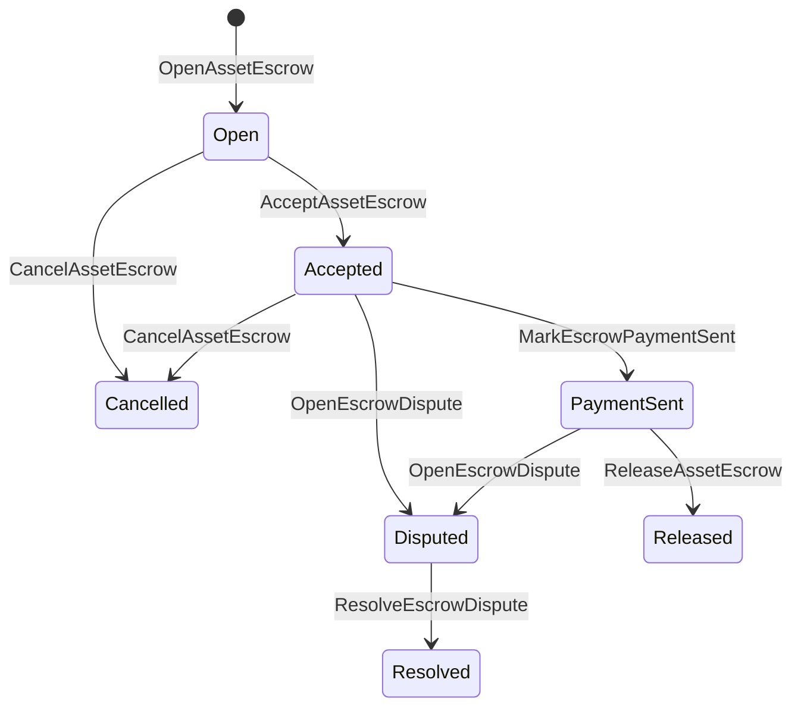

# Native Asset Escrow {#native-asset-escrow}

Native escrow ဆိုတာ ကိန်းဂဏန်းအရင်းအမြစ်တွေအတွက် စာရင်းအင်းမှ စီမံခန့်ခွဲထားတဲ့ ထိန်းသိမ်းမှု ယန္တရားတစ်ခုပါ။
Application ကိုပိုင်ဆိုင်တဲ့ Account တစ်ခုကို Assets ပို့တာအစား
ဒီစာရင်းကို ကာကွယ်ဖို့ လျှောက်လွှာကုဒ်၊ အချုပ်အခြာ ISIs တန်ဖိုးကို a သို့ပြောင်း
Deterministic protocol custody account နဲ့ escrow lifecycle ကို မှတ်တမ်းတင်ပေးပါ
ကမ္ဘာ့နိုင်ငံတော်။

စျေးကွက်ချေမှုတ်ခြင်းအတွက် Native escrow ကိုသုံးပါ Aitai ပုံစံ Off-chain ငွေပေးချေမှု
Coordination, milestone locks နဲ့ Shielded escrow workflows တွေကို လိုအပ်တဲ့
လက်မှတ်ကြီးနဲ့ မြင်ရတဲ့ ဘဝပတ်ဝန်းကျင် အခြေအနေ။

## စိတ်ကူးများ {#concepts}

| အယူအဆ | သရုပ်ဖော်ချက် |
| --- | --- |
| `EscrowId` | ဖုန်းခေါ်သူက ရွေးချယ်ထားတဲ့ ID ကို hash တစ်ခုကို ဖုံးအုပ်ထားပြီး ပွင့်လင်းမြင်သာပြီး အမည်မသိ escrow တွေကြားမှာ ထူးခြားဖို့လိုပါတယ်။ |
| `AssetEscrowRecord` | ပွင့်လင်းမြင်သာတဲ့ ကိန်းဂဏန်းအရ အရင်းအမြစ် အလှူခံ (သို့) Lock မှတ်တမ်း။ |
| `AnonymousAssetEscrowRecord` | အငြင်းပွားမှုတွေ၊ ကတိပေးချက်တွေနဲ့ အထောက်အထား attachments တွေနဲ့ ထောက်ခံထားတဲ့ ကာကွယ်ထားတဲ့ escrow မှတ်တမ်း။ |
| စောင့်ရှောက်မှုစာရင်း | ချိတ်ဆက်မှုမှ ရယူသော သတ်မှတ်ချက်ဆိုင်ရာ ပရိုတိုကောလစာ ID, အလှူခံ ID, အရင်းအမြစ် သတ်မှတ်ချက် |
| အထောက်အထား hashes | ငွေကြေးခွန်၊ တရားစီရင်ချက်များ၊ စာတိုများ၊ သိုလှောင်ရေး မှတ်တမ်းများ သို့မဟုတ် အခြားသော သံစဉ်ပြင်ပ အထောက်အထားများကို သိမ်းဆည်းထားခြင်း။ သက်သေပြမှုအပြည့်အဝသည် အတည်ပြုမှတ်တမ်းတွင် သိမ်းဆည်းခြင်းမရှိပါ။ |

ပွင့်လင်းမြင်သာတဲ့ မှတ်တမ်းတွေမှာ ရောင်းသူ၊ ရွေးချယ်စရာ ဝယ်သူ၊ အရင်းအမြစ် သတ်မှတ်ချက်၊
စုစုပေါင်းငွေကြေး၊ ထိန်းသိမ်းမှုစာရင်း၊ သက်တမ်းပတ်ဝန်းကျင်အခြေအနေ၊ ပြုမူပုံအမျိုးအစား၊ ကျန်ရှိနေဆဲ
အရေအတွက်၊ ရွေးချယ်ခွင့်ရခွင့်ရခွင့်၊ ရွေးချယ်စရာ သက်တမ်းကုန်ဆုံးချိန်စိပ်၊ အထောက်အထား
hashes, timestamps နဲ့ optional resolution အသေးစိတ်တွေပေါ့။

အချုပ်အခြာငွေများသည် အပြုသဘောကိန်းဂဏန်းအရ အရင်းအမြစ်အရေအတွက်များဖြစ်ရမည်ဖြစ်ပြီး
အရင်းအမြစ် သတ်မှတ်ချက်ရဲ့ ကိန်းဂဏန်းသတ်မှတ်ချက်ပါ။
အထွေထွေအရင်းအမြစ်လွှဲပြောင်းမှုများသည် ထိန်းသိမ်းရေးအကောင့်ကို မဖြည့်စွက်နိုင်ပါ။
လမ်းကြောင်းတွေဟာ ကောက်ခံမှုပါ။ ISIs အောက်မှာဖော်ပြထားတာပါ။

## စျေးကွက် အိတ်ချေးငွေ {#marketplace-escrow}

Marketplace escrow သည် ချိတ်ဆက်မှုအတွင်းရှိ အရင်းအမြစ်များကို ချိတ်ဆက်ခြင်းနှင့် ချိတ်ဆက်ချက်အပြင်သို့ ပြန်လည်ထုတ်ပြန်ခြင်းတို့ကို ညှိနှိုင်းပေးသည်။
ငွေပေးချေမှု (သို့) ပို့ဆောင်ရေး အလုပ်ဖြစ်စဉ်။



| ISI | ဘယ်သူက တင်ပြလဲ။ | သက်ရောက်မှု |
| --- | --- | --- |
| `OpenAssetEscrow` | ရောင်းသူ | ရောင်းသူရဲ့ ကိန်းဂဏန်းအရင်းအမြစ်ကို ပရိုတိုကောလစ် ထိန်းသိမ်းမှုမှာ ပိတ်ထားပြီး `Open` စျေးကွက်မှတ်တမ်း။ |
| `AcceptAssetEscrow` | ဝယ်သူ | ဝယ်သူကို မှတ်တမ်းတင်ပြီး ရွေ့ရှားမှု `Open` သို့ `Accepted`. ရောင်းသူဟာ သူ့ကိုယ်ပိုင် ဂိုဏ်းကို လက်မခံနိုင်ဘူး။ |
| `MarkEscrowPaymentSent` | လက်ခံရရှိသူ | ရွေ့ရှားမှု `Accepted` သို့ `PaymentSent` ဝယ်သူက ကွင်းဆက်အပြင်မှာ ငွေပေးချေမှုကို ပို့ပြီးနောက်ပါ။ |
| `ReleaseAssetEscrow` | ရောင်းသူ | ရွေ့ရှားမှု `PaymentSent` သို့ `Released` ငွေအပြည့်ကို ဝယ်သူဆီ လွှဲပြောင်းပေးတယ်။ |
| `CancelAssetEscrow` | ရောင်းသူ | ရွေ့ရှားမှု `Open` ဒါမှမဟုတ် `Accepted` သို့ `Cancelled` ငွေပေးချေမှု မှတ်သားမပြုမီမှာ ရောင်းသူကို ပြန်လည်ပေးချေပါတယ်။ |
| `OpenEscrowDispute` | ရောင်းသူ (သို့) လက်ခံဝယ်သူ | ရွေ့ရှားမှု `Accepted` ဒါမှမဟုတ် `PaymentSent` သို့ `Disputed` ပြီးတော့ သက်သေခံ ဟက်ရှ်တွေကို ထည့်ပေးတယ်။ |
| `ResolveEscrowDispute` | အကောင့်နှင့် `CanResolveEscrowDispute` | ရွေ့ရှားမှု `Disputed` သို့ `Resolved` ဝယ်သူနဲ့ ရောင်းသူကြားမှာ ပမာဏကို ခွဲပေးတယ်။ |

အငြင်းပွားမှုဖြေရှင်းရေးအတွက် ငွေကြေးပမာဏဟာ အပျက်သဘောမဟုတ်ဘဲ
`buyer_amount + seller_amount` ဂိုဏ်းအခွန်ငွေနဲ့ညီရမယ်။ သုညတန်ဖိုး
ခြေထောက်တွေ ခွင့်ပြုထားပေမဲ့ အပိုင်းတစ်ခုလုံးက ပိတ်ထားတဲ့ ဟန်ချက်ညီမှုကို ထည့်တွက်ဖို့လိုပါတယ်။

### Rust ဥပမာ {#rust-example}

ဒီဥပမာက ရောင်းသူနဲ့ ဝယ်သူရဲ့ အကောင့်တွေ ရှိပြီးသား ဖြစ်တယ်လို့ ယူဆတယ်။
အဓိပ္ပါယ်ဖွင့်ဆိုချက်က ကိန်းဂဏန်းအဖြစ် မှတ်ပုံတင်ထားပြီး ရောင်းသူမှာ လုံလောက်တဲ့ ဟန်ချက်ညီမှုရှိတယ်။

```rust
use iroha::{
    client::Client,
    data_model::{
        isi::escrow::{
            AcceptAssetEscrow, MarkEscrowPaymentSent, OpenAssetEscrow,
            ReleaseAssetEscrow,
        },
        prelude::*,
    },
};
use iroha_crypto::Hash;

fn release_marketplace_escrow(
    seller_client: &Client,
    buyer_client: &Client,
    asset_definition_id: AssetDefinitionId,
) -> eyre::Result<()> {
    let escrow_id = EscrowId::new(Hash::new("docs-marketplace-escrow-001"));

    seller_client.submit_blocking(OpenAssetEscrow::with_evidence_hashes(
        escrow_id,
        asset_definition_id,
        Numeric::from(40_u64),
        vec![Hash::new("invoice:2026-001")],
    ))?;

    buyer_client.submit_blocking(AcceptAssetEscrow::new(escrow_id))?;
    buyer_client.submit_blocking(MarkEscrowPaymentSent::new(escrow_id))?;
    seller_client.submit_blocking(ReleaseAssetEscrow::new(escrow_id))?;

    let record = seller_client.query_single(FindAssetEscrowById::new(escrow_id))?;
    assert_eq!(record.status, AssetEscrowStatus::Released);
    assert_eq!(record.remaining_amount, Numeric::zero());

    Ok(())
}
```

## ယေဘုယျ အရင်းအမြစ် Lock များ {#generic-asset-locks}

အရင်းအမြစ် Lock တွေမှာ custody record အမျိုးအစား တစ်ခုတည်းကို သုံးပေမဲ့ ဝယ်သူနဲ့ ရောင်းသူ မဟုတ်ဘူး။
ကမ်းလှမ်းချက်များ။ ၎င်းတို့က ရည်ရွယ်ချက်စာရင်းအတွက် ငွေကြေးကို ပိတ်ထားပြီး ရွေးချယ်မှုအရ
ရင်းနှီးမြှုပ်နှံမှု ထုတ်ယူရန် သီးခြားခွင့်ပြုချက်။

| ISI | ဘယ်သူက တင်ပြလဲ။ | သက်ရောက်မှု |
| --- | --- | --- |
| `OpenAssetLock` | အရင်းအမြစ်စာရင်း | အပြုသဘောဆောင်တဲ့ ပမာဏကို Lock လုပ်ပြီး မှတ်တမ်းဝယ်သူအဖြစ် ရည်ရွယ်ချက်မှတ်တမ်းတင်ပြီး အခြေအနေကို `Locked`. |
| `DrawdownAssetLock` | လွတ်မြောက်ခွင့်ပြုချက် (သို့) ဘယ်လွတ်မြောက်ခွင့်ပြုချက်ကိုမှ သတ်မှတ်မထားသည့် နေရာ | ကျန်တဲ့ ထိန်းသိမ်းမှုကို တစ်စိတ်တစ်ပိုင်း (သို့) အားလုံးကို ရည်မှန်းချက်ဆီ လွှဲပြောင်းပေးတယ်။ |
| `CancelAssetLock` | Lock opener | တက်ကြွတဲ့ Lock ကို ဖျက်သိမ်းပြီး ကျန်တဲ့ ပမာဏကို Opener ကို ပြန်ပေးပါတယ်။ |
| `ExpireAssetLock` | နောက်ဆုံးအချိန်အကြာတွင် ငွေပေးချေမှု အာဏာပိုင်များ | Lock ကို expire လုပ်ပါ `expires_at_ms` အရင်က လုပ်ခဲ့ဖူးပြီး ကျန်တဲ့ ပမာဏကို ဖွင့်သူဆီ ပြန်ပေးတယ်။ |

`DrawdownAssetLock` မှတ်တမ်းကို သိမ်းထားတယ်။ `Locked` တစ်စိတ်တစ်ပိုင်း ကျန်နေတုန်းပါ။
ကျန်တဲ့ ပမာဏ သုညကို ရောက်တဲ့အခါ အခြေအနေဟာ `DrawnDown` နှင့်
မှတ်တမ်းက ပိတ်ထားတယ်။

```rust
use iroha::{
    client::Client,
    data_model::{
        isi::escrow::{CancelAssetLock, DrawdownAssetLock, ExpireAssetLock, OpenAssetLock},
        prelude::*,
    },
};
use iroha_crypto::Hash;

fn drawdown_and_close_asset_locks(
    opener_client: &Client,
    destination_client: &Client,
    release_authority_client: &Client,
    asset_definition_id: AssetDefinitionId,
    destination: AccountId,
    release_authority: AccountId,
) -> eyre::Result<()> {
    let trusted_lock_id = EscrowId::new(Hash::new("docs-asset-lock-trusted"));

    opener_client.submit_blocking(OpenAssetLock::with_options(
        trusted_lock_id,
        asset_definition_id.clone(),
        destination.clone(),
        Numeric::from(40_u64),
        Some(release_authority),
        None,
        vec![Hash::new("milestone-plan-v1")],
    ))?;

    release_authority_client.submit_blocking(DrawdownAssetLock::new(
        trusted_lock_id,
        Numeric::from(15_u64),
    ))?;

    let partially_drawn =
        opener_client.query_single(FindAssetEscrowById::new(trusted_lock_id))?;
    assert_eq!(partially_drawn.status, AssetEscrowStatus::Locked);
    assert_eq!(partially_drawn.remaining_amount, Numeric::from(25_u64));

    opener_client.submit_blocking(CancelAssetLock::new(trusted_lock_id))?;
    let cancelled = opener_client.query_single(FindAssetEscrowById::new(trusted_lock_id))?;
    assert_eq!(cancelled.status, AssetEscrowStatus::Cancelled);

    let expiring_lock_id = EscrowId::new(Hash::new("docs-asset-lock-expiring"));
    opener_client.submit_blocking(OpenAssetLock::with_options(
        expiring_lock_id,
        asset_definition_id,
        destination,
        Numeric::from(10_u64),
        None,
        Some(0),
        Vec::new(),
    ))?;

    destination_client.submit_blocking(ExpireAssetLock::new(expiring_lock_id))?;
    let expired = opener_client.query_single(FindAssetEscrowById::new(expiring_lock_id))?;
    assert_eq!(expired.status, AssetEscrowStatus::Expired);

    Ok(())
}
```

Python လက်ရှိတွင် အထွေထွေ Lock များအတွက် အဆင့်မြင့် အကူအညီများကို ထုတ်လွှင့်နေသည်
`open_asset_lock`, `drawdown_asset_lock`, `cancel_asset_lock`, နှင့်
`expire_asset_lock`. စျေးကွက်နှင့် အမည်မသိ ဂိုဏ်းအထောက်အပံ့အတွက် Python, အသုံးပြုမှု
တရားဝင် `InstructionBox` JSON အပြင် SDK ဒါက JSON escape hatch သို့မဟုတ် submit
တစ်ဆင့် SDK ပထမတန်းစား ဂိုဏ်းတည်ဆောက်သူတွေကို ဖေါ်ထုတ်ပေးတယ်။

## အငြင်းပွားမှု {#disputes}

စျေးကွက်မှာ အချုပ်အခြာခံထားရသူဟာ `Accepted` ဒါမှမဟုတ် `PaymentSent`.
မှတ်တမ်းတင်ရောင်းသူ (သို့) ဝယ်သူသာ အငြင်းပွားမှုကိုဖွင့်နိုင်သည်။
`CanResolveEscrowDispute`, Resolver account ကို တိုက်ရိုက်ပေးချေခြင်း
ဒါမှမဟုတ် အခန်းကဏ္ဍတစ်ခုကနေ အမွေခံရတယ်။

```rust
use iroha::{
    client::Client,
    data_model::{
        isi::escrow::{OpenEscrowDispute, ResolveEscrowDispute},
        prelude::*,
    },
};
use iroha_crypto::Hash;
use iroha_executor_data_model::permission::escrow::CanResolveEscrowDispute;

fn resolve_disputed_escrow(
    admin_client: &Client,
    buyer_client: &Client,
    court_client: &Client,
    court: AccountId,
    escrow_id: EscrowId,
) -> eyre::Result<()> {
    admin_client.submit_blocking(Grant::account_permission(
        Permission::from(CanResolveEscrowDispute),
        court,
    ))?;

    buyer_client.submit_blocking(OpenEscrowDispute::with_evidence_hashes(
        escrow_id,
        vec![Hash::new("buyer-payment-receipt")],
    ))?;

    court_client.submit_blocking(ResolveEscrowDispute::with_evidence_hashes(
        escrow_id,
        Numeric::from(30_u64),
        Numeric::from(10_u64),
        vec![Hash::new("court-judgement-001")],
    ))?;

    let record = admin_client.query_single(FindAssetEscrowById::new(escrow_id))?;
    assert_eq!(record.status, AssetEscrowStatus::Resolved);
    assert_eq!(
        record.resolution.as_ref().map(|resolution| resolution.buyer_amount.clone()),
        Some(Numeric::from(30_u64)),
    );

    Ok(())
}
```

## အမည်မသိ Escrow {#anonymous-escrow}

Anonymous escrow သည် စျေးကွက်သက်တမ်းကာလတစ်ခုတည်းကိုအသုံးပြုသည်
ပွင့်လင်းမြင်သာတဲ့ မှတ်တမ်းက အရောင်းသမားကို သိုလှောင်နေဆဲပါ။
ဝယ်သူ၊ အခြေအနေ၊ အထောက်အထား hashes များ၊ အချိန်တံဆိပ်များနှင့် သက်သေပြမှု ချိတ်ဆက်ထားသော လှုပ်ရှားမှုများ
မှတ်ပုံတင်များ: ပိတ်ထားသော ငွေကြေးစက္ကူအတွင်းရှိ ငွေကြေးငွေနှင့် လက်ခံသူများကို
အမိန့်ချမှတ်ချက်တွေ၊ ဖျက်သိမ်းချက်တွေနဲ့ အထောက်အထား attachments တွေပေါ့။

| ပွင့်လင်းမြင်သာမှု ISI | အမည်မသိ ISI |
| --- | --- |
| `OpenAssetEscrow` | `OpenAnonymousAssetEscrow` |
| `AcceptAssetEscrow` | `AcceptAnonymousAssetEscrow` |
| `MarkEscrowPaymentSent` | `MarkAnonymousEscrowPaymentSent` |
| `ReleaseAssetEscrow` | `ReleaseAnonymousAssetEscrow` |
| `CancelAssetEscrow` | `CancelAnonymousAssetEscrow` |
| `OpenEscrowDispute` | `OpenAnonymousEscrowDispute` |
| `ResolveEscrowDispute` | `ResolveAnonymousEscrowDispute` |

ငွေကြေးအိတ် (သို့) စပ်ပြ ကိရိယာများသည် သက်သေခံပမာဏနှင့် အများပြည်သူဝင်ငွေများကို တည်ဆောက်ရမည်ဖြစ်သည်။
ပွင့်လင်းခြင်းသည် အချုပ်အခြာတစ်ခုတည်းကို ဖန်တီးသည်။ လွတ်မြောက်ခြင်း၊ ဖျက်သိမ်းခြင်းနှင့် အမည်မသိ
အငြင်းပွားမှုဖြေရှင်းရေးအတွက် ငွေကြေးထောက်ခံစာတစ်ခုတည်းကို သုံးပြီး
ရောင်းသူ၊ ဝယ်သူ (သို့) လုပ်ဆောင်ချက်ကြောင့် လိုအပ်တဲ့ ထုတ်ကုန် ကန့်သတ်ချက်တွေကို ခွဲခြားပါ။

```rust
use iroha::{
    client::Client,
    data_model::{
        isi::escrow::{
            AcceptAnonymousAssetEscrow, MarkAnonymousEscrowPaymentSent,
            OpenAnonymousAssetEscrow,
        },
        prelude::*,
        proof::ProofAttachment,
    },
};
use iroha_crypto::Hash;

fn open_anonymous_escrow(
    seller_client: &Client,
    buyer_client: &Client,
    escrow_id: EscrowId,
    asset_definition_id: AssetDefinitionId,
    funding_nullifiers: Vec<[u8; 32]>,
    escrow_commitment: [u8; 32],
    proof: ProofAttachment,
    root_hint: Option<[u8; 32]>,
) -> eyre::Result<()> {
    seller_client.submit_blocking(OpenAnonymousAssetEscrow::with_evidence_hashes(
        escrow_id,
        asset_definition_id,
        funding_nullifiers,
        escrow_commitment,
        proof,
        root_hint,
        vec![Hash::new("shielded-invoice")],
    ))?;

    buyer_client.submit_blocking(AcceptAnonymousAssetEscrow::new(escrow_id))?;
    buyer_client.submit_blocking(MarkAnonymousEscrowPaymentSent::new(escrow_id))?;

    Ok(())
}
```

အခြေခံကာကွယ်ထားသော ငွေကြေးပူးပေါင်းဆောင်ရွက်မှုပုံစံအတွက် ကြည့်ပါ
[အမည်မသိ ငွေပေးချေမှု](/my/blockchain/anonymous-transactions.md).

## SDK အသုံးပြုမှု {#sdk-usage}

ငွေကြေးထောက်ပံ့မှုသည် နိုင်ငံတစ်ဝှမ်းတွင် မတူညီစွာ ဖော်ပြထားသည်။ SDKs. Rust ကနောဂဗေဒ
ရိုက်နှိပ်ထားတဲ့ ဒေတာပုံစံ။ Python လက်ရှိတွင် အရင်းအမြစ်ပိတ်ခြင်းအတွက် အထောက်အကူပြုပစ္စည်းများကို ထုတ်ဖော်ပေးနေသည်။
JavaScript နှင့် TypeScript အသုံးပြုမှု Kotodama Host ခေါ်ဆိုမှုများကို escrow လုပ်ပါ။ Kotlin/JVM နှင့် Swift
စျေးကွက်အတွက် အထောက်အပံ့တင်ဝန်ဆောင်မှု ဆောက်လုပ်သူတွေကို ပေးပို့ပြီး အမည်မသိ ဂိုဏ်းပေးပါ။

| SDK | ဒီမျက်နှာပြင်ကို သုံးပါ။ | သက်ရောက်မှု |
| --- | --- | --- |
| [Rust](#rust-sdk) | `iroha::data_model::isi::escrow` | စျေးကွက်က ကောက်ခံစာ၊ ယေဘုယျ Lock များ၊ အမည်မသိ ကောက်ခံချက်များ၊ မေးမြန်းချက်များနှင့်ဖြစ်ရပ်များ။ |
| [Python](#python-asset-locks) | `Instruction.open_asset_lock`, `TransactionDraft.open_asset_lock`, ဖောက်သည် `*_and_wait` အကူအညီပေးသူများ | ဘဏ္ဍာရေးပိတ်ရက်များ၊ စျေးကွက်နှင့် အမည်မသိ ငွေပေးချေမှုအကူအညီပေးသူများသည် ပထမတန်းစား မဟုတ်ပါ။ Python နည်းစနစ်တွေ ရှိသေးတယ် |
| [JavaScript / TypeScript](#javascript-and-typescript-kotodama) | `compileKotodamaProgram` မှ `@iroha/iroha-js/kotodama-compiler` | အထဲက Escrow host ဖုန်းခေါ်ဆိုမှု Kotodama စာချုပ်များ။ |
| [Kotlin / JVM](#kotlin-and-jvm) | `InstructionTemplate` အတန်းများ `org.hyperledger.iroha.sdk.core.model.instructions` | စျေးကွက်နဲ့ အမည်မသိ escrow custom instruction templates တွေပါ။ |
| [Swift / iOS](#swift-and-ios) | `NativeEscrowInstructionBuilders` နှင့် `IrohaSDK.build*Escrow*` အကူအညီပေးသူများ | စျေးကွက်နှင့် အမည်မသိ ဂိုဏ်း Norito JSON ညွှန်ကြားချက် အသုံးဝင်ပစ္စည်းများ။ |

အောက်ပါဥပမာများသည် သင်ကြားမှု တည်ဆောက်မှုကို အာရုံစိုက်သည်။
လက်မှတ်စီမံခန့်ခွဲမှုနှင့် ငွေကြေးဆိုင်ရာ တင်သွင်းခြင်းသည် ပုံမှန်စီးဆင်းမှုကို လိုက်နာသည်။
တစ်ခုချင်းစီ SDK.

### Rust SDK {#rust-sdk}

သုံးပါ Rust SDK သင့်မှာ အပြည့်အဝ ဒေသခံကာကွယ်မှု (သို့) မေးမြန်း / ဖြစ်ရပ်ထောက်ပံ့မှု လိုအပ်တဲ့အခါပါ။
အထက်ပါဥပမာများတွင် စျေးကွက်ထုတ်လွှင့်ခြင်း၊ ယေဘုယျပိတ်သိမ်းခြင်း၊ ပဋိပက္ခများကို ပြသထားသည်။
ငွေကြေးရှင်းလင်းရေးနှင့် အမည်မသိ escrow တည်ဆောက်မှု
`iroha::data_model::isi::escrow`.

```rust
use iroha::{
    client::Client,
    data_model::{isi::escrow::OpenAssetEscrow, prelude::*},
};
use iroha_crypto::Hash;

fn open_and_read(
    client: &Client,
    asset_definition_id: AssetDefinitionId,
) -> eyre::Result<AssetEscrowRecord> {
    let escrow_id = EscrowId::new(Hash::new("docs-rust-sdk-escrow"));

    client.submit_blocking(OpenAssetEscrow::new(
        escrow_id,
        asset_definition_id,
        Numeric::from(10_u64),
    ))?;

    client.query_single(FindAssetEscrowById::new(escrow_id))
}
```

### Python အရင်းအမြစ် Lock များ {#python-asset-locks}

နိုင်ငံခြားရေး Python SDK ပထမတန်းစား အကူအညီပေးသူတွေကို ယေဘုယျ အရင်းအမြစ်ပိတ်ခြင်းအတွက် ဖေါ်ထုတ်တယ်။
လတ်တလောမှာ ငွေကြေးပေးချေမှုတွေ၊ ပြန်လည်ထုတ်လွှတ်ရေး အာဏာပိုင်က ထုတ်ယူတဲ့ ငွေကြေးကောက်ခံမှု၊
ဖွင့်ပေးသူနဲ့ ကုန်ဆုံးတဲ့ ငွေပြန်ငွေတွေ

```python
client.open_asset_lock_and_wait(
    chain_id="dev-chain",
    authority="<source-account-id>",
    private_key_hex="<source-private-key-hex>",
    escrow_id="merchant-lock-001",
    asset_definition_id="<asset-definition-base58>",
    destination="<destination-account-id>",
    amount="2500",
    release_authority="<trusted-release-account-id>",
    expires_at_ms=1_704_000_000_000,
)

client.drawdown_asset_lock_and_wait(
    chain_id="dev-chain",
    authority="<trusted-release-account-id>",
    private_key_hex="<trusted-release-private-key-hex>",
    escrow_id="merchant-lock-001",
    amount="1000",
)

client.expire_asset_lock_and_wait(
    chain_id="dev-chain",
    authority="<any-account-id>",
    private_key_hex="<any-private-key-hex>",
    escrow_id="merchant-lock-001",
)
```

နှစ်ဖက်ပိတ်ထားမှုအတွက် ရှောင်ရှားပါ။ `release_authority`; ရည်မှန်းချက်စာရင်းကို
ပြီးရင် တင်ပြပါ `drawdown_asset_lock`.

### JavaScript နှင့် TypeScript Kotodama {#javascript-and-typescript-kotodama}

နိုင်ငံခြားရေး JavaScript SDK လက်ရှိတွင် တိုက်ရိုက် Native Escrow Transaction ကို ဖော်ပြခြင်း မရှိပါ။
ဆောက်လုပ်ရေးသမားတွေအတွက် JavaScript ဒါမှမဟုတ် TypeScript အသုံးချတဲ့ အက်ပ်များ Kotodama
စာချုပ်များ၊ ကော်ပိုရေးရှင်းနှင့်အတူ escrow host ခေါ်ဆိုချက် Kotodama compilator ကို

Native escrow host calls တွေမှာ explicit access အညွှန်းတွေလိုအပ်တယ် compiler က
opaque escrow အတွက် ပိုကျဉ်းတဲ့ access set တွေကို ထုတ်ယူလို့မရဘူး။ ISIs. Wildcard အညွှန်းတွေကို သုံးပါ။
ခေါ်ဆိုသည့် တင်ပို့ဝင်ရောက်မှုနေရာများ `escrow_*` အဆောက်အအုံတွေပေါ့။

```js
import { compileKotodamaProgram } from "@iroha/iroha-js/kotodama-compiler";

const source = `
seiyaku MarketplaceEscrow {
  meta { abi_version: 1; }

  #[access(read="*", write="*")]
  kotoage fn run() permission(Admin) {
    let asset = asset_definition("62Fk4FPcMuLvW5QjDGNF2a4jAmjM");
    let offer = name("aitai_offer");
    let evidence = norito_bytes("00");

    call escrow_open_offer(offer, asset, 10, evidence);
    call escrow_accept(offer);
    call escrow_mark_payment_sent(offer);
    call escrow_release(offer);
  }
}
`;

const compiled = compileKotodamaProgram(source, {
  sourceName: "escrow.ko",
});

if (compiled.diagnostics.length > 0) {
  throw new Error(compiled.diagnostics.map((item) => item.message).join("\n"));
}
```

အငြင်းပွားမှုအတွက် အသုံးပြုခြင်း `escrow_open_dispute(offer, evidence)` နှင့်
`escrow_resolve_dispute(offer, buyer_amount, seller_amount, evidence)`.
အမည်မသိ escrow host ဖုန်းခေါ်ဆိုမှုကို လက်ခံ Norito ဥပမာ အသုံးဝင် ဝန်ဆောင်မှု ဘိုက်များကို တောင်းဆိုပါ
`anonymous_escrow_open_offer(request)`.

### Kotlin နှင့် JVM {#kotlin-and-jvm}

နိုင်ငံခြားရေး Kotlin/JVM SDK မူရင်း escrow ကို custom instruction templates အဖြစ် ပုံစံထုတ်ပေးပါ။
Template ကတော့ လိုအပ်တဲ့ field တွေကို validates လုပ်ပြီး အသုံးပြုထားတဲ့ canonical argument map ကို ဖော်ပြပါတယ်။
ငွေပေးချေမှု တည်ဆောက်သူက

```kotlin
import org.hyperledger.iroha.sdk.core.model.escrow.NativeEscrowPermissions
import org.hyperledger.iroha.sdk.core.model.instructions.AcceptAssetEscrowInstruction
import org.hyperledger.iroha.sdk.core.model.instructions.MarkEscrowPaymentSentInstruction
import org.hyperledger.iroha.sdk.core.model.instructions.OpenAssetEscrowInstruction
import org.hyperledger.iroha.sdk.core.model.instructions.ReleaseAssetEscrowInstruction
import org.hyperledger.iroha.sdk.core.model.instructions.ResolveEscrowDisputeInstruction

val open = OpenAssetEscrowInstruction(
    escrowId = "escrow-hash",
    assetDefinition = "xor#wonderland",
    amount = "42.5",
    evidenceHashes = listOf("invoice-hash"),
)
val accept = AcceptAssetEscrowInstruction("escrow-hash")
val paid = MarkEscrowPaymentSentInstruction("escrow-hash")
val release = ReleaseAssetEscrowInstruction("escrow-hash")
val resolve = ResolveEscrowDisputeInstruction(
    escrowId = "escrow-hash",
    buyerAmount = "30",
    sellerAmount = "12.5",
    evidenceHashes = listOf("judgement-hash"),
)

println(open.arguments)
println(NativeEscrowPermissions.CAN_RESOLVE_ESCROW_DISPUTE)
```

အမည်မဲ့ Template များကို
`OpenAnonymousAssetEscrowInstruction`, `AcceptAnonymousAssetEscrowInstruction`,
`MarkAnonymousEscrowPaymentSentInstruction`,
`ReleaseAnonymousAssetEscrowInstruction`,
`CancelAnonymousAssetEscrowInstruction`,
`OpenAnonymousEscrowDisputeInstruction`, နှင့်
`ResolveAnonymousEscrowDisputeInstruction`. Android Java ဖုန်းခေါ်ဆိုသူတွေက
ကိုက်ညီမှု `NativeEscrowInstructions.*` ဆောက်လုပ်ရေးသမားများ Android အနုပညာပစ္စည်းပါ။

### Swift ပြီးတော့ iOS {#swift-and-ios}

နိုင်ငံခြားရေး Swift SDK သွင်းငွေ ညွှန်ကြားချက်များကို Norito JSON အသုံးဝင်ပစ္စည်းများ။
`NativeEscrowInstructionBuilders` တိုက်ရိုက် (သို့) ညီမျှတဲ့ ဖုန်းခေါ်ဆိုပါ။
`IrohaSDK.build*Escrow*` အကူအညီပေးသူက သင့်ရဲ့ app မှာ `IrohaSDK`
ဥပမာ။

```swift
import IrohaSwift

let open = try NativeEscrowInstructionBuilders.openAssetEscrow(
    escrowId: "escrow-hash",
    assetDefinition: "xor#wonderland",
    amount: "42.5",
    evidenceHashes: ["invoice-hash"]
)
let accept = try NativeEscrowInstructionBuilders.acceptAssetEscrow(
    escrowId: "escrow-hash"
)
let paid = try NativeEscrowInstructionBuilders.markEscrowPaymentSent(
    escrowId: "escrow-hash"
)
let release = try NativeEscrowInstructionBuilders.releaseAssetEscrow(
    escrowId: "escrow-hash"
)
let resolve = try NativeEscrowInstructionBuilders.resolveEscrowDispute(
    escrowId: "escrow-hash",
    buyerAmount: "30",
    sellerAmount: "12.5",
    evidenceHashes: ["judgement-hash"]
)
```

အမည်မသိ Swift ဆောက်လုပ်သူတွေက အငြင်းပွားမှု စာရင်းတွေ၊ ထုတ်ကုန် ကတိစာရင်းတွေ၊ အထောက်အထားတွေ ယူတယ်။
အဘိဓာန်၊ ရွေးချယ်စရာ `rootHint` တန်ဖိုးများ။ ပဋိပက္ခဖြေရှင်းခွင့်
token ကို `NativeEscrowPermissions.canResolveEscrowDispute`.

## မေးခွန်းများနှင့် ဖြစ်ရပ်များ {#queries-and-events}

အခြေအနေ စာမျက်နှာများ၊ ညှိနှိုင်းမှု အလုပ်များနှင့် ထောက်ပံ့ရေး ကိရိယာများအတွက် escrow မေးမြန်းချက်များကို အသုံးပြုပါ။

| မေးခွန်း | ရည်ရွယ်ချက် |
| --- | --- |
| `FindAssetEscrowById` | ပွင့်လင်းမြင်သာတဲ့ ဂိုဏ်းစာရင်းကို ဖတ်ပါ။ `EscrowId`. |
| `FindAssetEscrows` | ပွင့်လင်းမြင်သာတဲ့ ကော်ပိုရေးရှင်းနဲ့ Lock မှတ်တမ်းတွေကို စာရင်းပေးပါ။ |
| `FindAssetEscrowsBySeller` | ရောင်းသူ (သို့) Lock Opener က ဖွင့်ထားတဲ့ မှတ်တမ်းတွေကို စာရင်းပေးပါ။ |
| `FindAssetEscrowsByBuyer` | ဝယ်သူက လက်ခံတဲ့ စျေးကွက်စာရင်း (သို့) ပန်းတိုင်ကို ပစ်မှတ်ထားသော lock များ။ |
| `FindAssetEscrowsByStatus` | စာရင်းမှတ်တမ်းများ `AssetEscrowStatus`. |
| `FindAnonymousAssetEscrowById` | အမည်မသိ ဂိုဏ်းကို ဖတ်ပါ။ `EscrowId`. |
| `FindAnonymousAssetEscrows*` | အမည်မသိ ဂိုဏ်းတွေကို မှတ်တမ်း၊ ရောင်းသူ၊ ဝယ်သူ သို့မဟုတ် အခြေအနေအလိုက် စာရင်းပေးပါ။ |

`EscrowEventFilter` ပွင့်လင်းမြင်သာတဲ့ ဒေသခံ escrow နှင့် lock ကို subscribe လုပ်နိုင်သည်
အလှူငွေဖြင့် ပြုလုပ်သော အဖြစ်များ ID, ရောင်းသူ၊ ဝယ်သူ၊ အခြေအနေနဲ့ အဖြစ်အပျက် သတ်မှတ်မှု နှာခေါင်းစည်း
မိသားစုသည် ပါဝင်သည်။ `Opened`, `Accepted`, `PaymentSent`, `Released`,
`Cancelled`, `Expired`, `Disputed`, နှင့် `Resolved`. အမည်မသိ ဂိုဏ်း
မှတ်တမ်းတွေကို အမည်မဲ့ ဂိုဏ်းအထောက်အထား မေးမြန်းမှုတွေကနေ စစ်ဆေးပါတယ်။

## လုပ်ငန်းမှတ်စုများ {#operational-notes}

- ကြီးမားတဲ့ ငွေကြေးခွန်တွေ၊ စကားပြောမှတ်တမ်းတွေ၊ အကဲဖြတ်ချက်တွေနဲ့ စာရင်းစစ်ဆေးမှု အစုတွေကို
  ဂိုဏ်းမှတ်တမ်းကို သိမ်းယူပြီး သက်သေအဖြစ် သူတို့ရဲ့ hashes ကို ချိတ်ဆက်ပါ။
- တည်ငြိမ်စွာ အသုံးပြုပါ။ `EscrowId` ရယူမှု applications များတွင် retries မဖန်တီးနိုင်သောကြောင့်
  တူညီတဲ့ ကမ်းလှမ်းမှုအတွက် နှစ်မျိုးတည်းသော အာမခံချက်များ။
- Grant ကို `CanResolveEscrowDispute` အကောင့်များ သို့မဟုတ် လုပ်ငန်းခွင်များအတွက်သာ
  အငြင်းပွားမှု လုပ်ငန်းစဉ်။
- ချိတ်ဆက်မှုအပြင် ငွေပေးချေမှု စစ်ဆေးမှုကို လျှောက်လွှာ မူဝါဒအဖြစ် သတ်မှတ်ပါ။ Iroha မှတ်တမ်းများ
  စောင့်ရှောက်မှုနှင့် သက်တမ်းပတ်လည် ကူးပြောင်းမှုများအတွက် ငွေကြေးဆိုင်ရာ သို့မဟုတ် ပြင်ပဆိုင်ရာ စစ်ဆေးခြင်းမရှိပါ။
  ငွေပေးချေရေးလမ်းကြောင်းတွေ တစ်ခုတည်းပါ။
