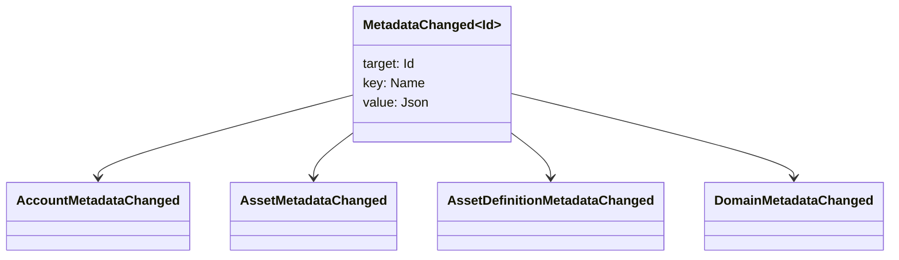

# မီတာဒေတာ {#metadata}

Metadata သည် blockchain ledger အရာဝတ္ထုများနှင့် ချိတ်ဆက်ထားသည့် စစ်ဆေးသော key-value မြေပုံတစ်ခုဖြစ်သည်။ Key များသည် `Name` တန်ဖိုးများဖြစ်ပြီးတန်ဖိုးများသည် JSON (`Json`) အသုံးဝင်ဝန်ဆောင်မှုဖြစ်သည်။

အောက်ပါ အရာဝတ္ထုတွေက metadata ကို သယ်ဆောင်နိုင်ပါတယ်

- နယ်ပယ်များ
- အကောင့်များ
- အရင်းအမြစ်
- အရင်းအမြစ် အဓိပ္ပါယ်ဖွင့်ဆိုချက်
- NFTs
- RWAs
- trigger များ
- ငွေပေးချေမှု

blockchain ledger state ထဲမှာ ပါဝင်တဲ့ သေးငယ်တဲ့ deskriptive (သို့) indexing field တွေအတွက် metadata ကိုသုံးပါ။ ကြီးမားတဲ့ payloads တွေကို WSV အပြင်မှာ သိမ်းဆည်းထားပြီး cryptographic digest value, URI သို့မဟုတ် SoraFS path ဖြင့် ရည်ညွှန်းသင့်ပါတယ်။

မီတာဒေတာ၊ အရင်းအမြစ်များ NFTs၊ RWAs သို့မဟုတ် ချိတ်ဆက်မှုအပြင် သိုလှောင်ခြင်းများကို ရွေးချယ်ရန် လမ်းညွှန်ချက်များအတွက် [Metadata နှင့် blockchain ledger Storage Choices များ](/my/guide/configure/metadata-and-store-assets.md) ကို ကြည့်ပါ။

## Taira တွင် ဤအလုပ်ခွင်ကို run လုပ်ပါ။ {#try-it-on-taira}

metadata ကို ပုံမှန်အရင်းအမြစ်ဖတ်ရှုမှုမှတဆင့်မြင်နိုင်သည်။ ဤအမိန့်မှာ Taira လက်ရှိ metadata ရှိသော asset အဓိပ္ပါယ်ဖွင့်ဆိုချက်များကိုစာရင်းပေးထားသည်

```bash
curl -fsS 'https://taira.sora.org/v1/assets/definitions?limit=100' \
  | jq '.items[]
    | select((.metadata | length) > 0)
    | {id, name, metadata}'
```

ဒိုမင်များနှင့် အကောင့်များအတွက် အလားတူ ပုံစံကို အသုံးပြုပါ။

```bash
curl -fsS 'https://taira.sora.org/v1/domains?limit=20' \
  | jq '.items[] | select((.metadata // {} | length) > 0)'

curl -fsS 'https://taira.sora.org/v1/accounts?limit=20' \
  | jq '.items[] | select((.metadata // {} | length) > 0)'
```

empty output ကို valid result အဖြစ်သုံးပါ။ ဆိုလိုတာက Taira အရာဝတ္ထုတွေရဲ့ လက်ရှိ စာမျက်နှာမှာ metadata မရှိဘူး၊ API အဆုံးအသတ်မှတ်က ကျရှုံးတာမဟုတ်ဘူး။

## Metadata ကို update လုပ်ခြင်း {#updating-metadata}

Metadata ကို Iroha ညွှန်ကြားမှု လုပ်ဆောင်ချက်များဖြင့် ပြောင်းလဲပါသည်

- [`SetKeyValue`](/my/blockchain/instructions.md#setkeyvalue-removekeyvalue) သော့ကိုထည့်သွင်းခြင်း သို့မဟုတ် အစားထိုးခြင်း
- [`RemoveKeyValue`](/my/blockchain/instructions.md#setkeyvalue-removekeyvalue) သော့ကို ဖယ်ရှားတယ်။

Transaction ကိုတင်သွင်းတဲ့ Authorization Principal မှာ Active Software Execution Environment validator က တောင်းဆိုထားတဲ့ ခွင့်ပြုချက်ရှိဖို့လိုပါတယ်။ Default permission surface အတွက် [ခွင့်ပြုချက် လက်မှတ်များ](/my/reference/permissions.md) ကို ကြည့်ပါ။

## ဖြစ်ရပ်များ {#events}

ဒေတာဖြစ်ရပ်များကို metadata ပြောင်းလဲတဲ့အခါ ထုတ်လွှင့်ပါတယ်။ ယေဘုယျဖြစ်ရပ် အကျိုးဆောင်ဝန်ပိုးက `MetadataChanged<Id>`:



[ဒေတာဖြစ်ရပ် စစ်ဆေးချက်များ](/my/blockchain/filters.md#data-event-filters) ကို အသုံးပြုပြီး ပေါင်းစပ်မှုအတွက် အရေးပါတဲ့ Entity Type သို့မဟုတ် Object ID အတွက် metadata ဖြစ်ရပ်တွေကိုသာ လက်မှတ်ထိုးပါ။

## မေးခွန်းများ {#queries}

metadata ကို query object ရဲ့အစိတ်အပိုင်းအဖြစ်ပြန်ပေးပါတယ်။ ဥပမာ, use [`FindAccountById`](/my/reference/queries.md#accounts-and-permissions), [`FindDomainById`](/my/reference/queries.md#domains-and-peers), ဒါမှမဟုတ် [`FindAssetDefinitionById`](/my/reference/queries.md#assets-nfts-and-rwas). အသုံးပြုခြင်း [`FindNfts`](/my/reference/queries.md#assets-nfts-and-rwas) ဒါမှမဟုတ် [`FindNftsByAccountId`](/my/reference/queries.md#assets-nfts-and-rwas) အတွက် NFTs, နှင့် [`FindRwas`](/my/reference/queries.md#assets-nfts-and-rwas) အတွက် RWA object ရဲ့ metadata field ကို ဖတ်ပါ။ NFT မေးမြန်းချက် တုံ့ပြန်မှုတွေက NFT `content` မြေပုံက မှတ်တမ်း metadata အဖြစ်ပါ။

Metadata key တွေဟာ blockchain ledger state ရဲ့ အစိတ်အပိုင်းဖြစ်တာကြောင့် ဒါတွေကို တည်ငြိမ်အောင် ထိန်းထားပြီး JSON တန်ဖိုးက ဒီဗားရှင်းကို တိကျစွာ သယ်ဆောင်နိုင်တဲ့အခါ application-specific version ကို encoding လုပ်ခြင်းကနေ key name ထဲသို့ churn ရှောင်ရှားပါ။
