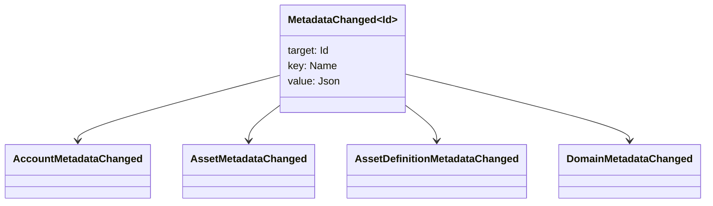

# မီတာဒေတာ {#metadata}

Metadata သည်စာအုပ်အစိတ်အပိုင်းများတွင် ချိတ်ဆက်ထားသော စစ်ဆေးထားသော key-value မြေပုံဖြစ်သည်။
`Name` တန်ဖိုးများနှင့်တန်ဖိုးများ JSON (`Json`) အသုံးဝင်ပစ္စည်းများ။

အောက်ပါအရာဝတ္ထုများတွင် metadata ကို သယ်ဆောင်နိုင်သည်

- နယ်ပယ်များ
- အကောင့်များ
- အရင်းအမြစ်
- အရင်းအမြစ်အနက်ကောက်ချက်များ
- NFTs
- RWAs
- trigger များ
- ငွေပေးချေမှု

စာရင်းအင်းထဲဝင်တဲ့ သရုပ်ဖော်ရေး (သို့) အညွှန်းကိန်းတင်မှု ကွင်းငယ်များအတွက် metadata ကိုသုံးပါ။
ကြီးမားတဲ့ အသုံးဝင် ဝန်ဆောင်မှုများကို WSV A ကို ရည်ညွှန်းထားပြီး
အစာခြေခြင်း URI, ဒါမှမဟုတ် SoraFS လမ်းကြောင်း။

metadata ရွေးချယ်မှုအတွက် လမ်းညွှန်ချက်များ၊ အရင်းအမြစ်များ NFTs, RWAs, သို့မဟုတ် သံကြိုးပြင်ပ
သိုလှောင်ခြင်း၊
[Metadata နှင့် Ledger Storage ရွေးချယ်မှုများ](/my/guide/configure/metadata-and-store-assets.md).

## ဒါကို စမ်းကြည့်ပါ။ Taira {#try-it-on-taira}

metadata ကို ပုံမှန်အရင်းအမြစ်ဖတ်ခြင်းမှတဆင့်မြင်နိုင်သည်။ Taira
လက်ရှိတွင် metadata ရှိသော အရင်းအမြစ်အနက်ကောက်ချက်များ:

```bash
curl -fsS 'https://taira.sora.org/v1/assets/definitions?limit=100' \
  | jq '.items[]
    | select((.metadata | length) > 0)
    | {id, name, metadata}'
```

Domain နဲ့ Account တွေအတွက် အလားတူ ပုံစံကို သုံးပါ။

```bash
curl -fsS 'https://taira.sora.org/v1/domains?limit=20' \
  | jq '.items[] | select((.metadata // {} | length) > 0)'

curl -fsS 'https://taira.sora.org/v1/accounts?limit=20' \
  | jq '.items[] | select((.metadata // {} | length) > 0)'
```

empty output ကို valid result အဖြစ်သုံးပါ။ Taira
object တွေမှာ metadata မပါဘူး၊ endpoint က ကျရှုံးတာမဟုတ်ဘူး။

## Metadata များကို update လုပ်ခြင်း {#updating-metadata}

Metadata ကို Iroha အထူးညွှန်ကြားချက်များ

- [`SetKeyValue`](/my/blockchain/instructions.md#setkeyvalue-removekeyvalue)
  သော့ကိုထည့်သွင်းခြင်း သို့မဟုတ် အစားထိုးခြင်း
- [`RemoveKeyValue`](/my/blockchain/instructions.md#setkeyvalue-removekeyvalue)
  သော့ကို ဖယ်ရှားတယ်။

ငွေပေးချေမှုကို တင်ပြသူက လိုအပ်တဲ့ ခွင့်ပြုချက်ရှိရမည်။
Activated Runtime Validator ကိုသုံးပြီး
[ခွင့်ပြုချက် လက်မှတ်များ](/my/reference/permissions.md).

## ဖြစ်ရပ်များ {#events}

Data event တွေကို metadata တွေ ပြောင်းလဲတဲ့အခါ ထုတ်လွှတ်ပါတယ်။
`MetadataChanged<Id>`:



အသုံးပြုခြင်း [ဒေတာဖြစ်ရပ် စစ်ဆေးချက်များ](/my/blockchain/filters.md#data-event-filters) သို့
Entity type သို့မဟုတ် object အတွက် metadata ဖြစ်ရပ်များအတွက်သာ subscribe လုပ်ပါ။ ID အဲဒီ
ပေါင်းစည်းမှုအတွက် အရေးပါပါတယ်။

## မေးခွန်းများ {#queries}

Metadata ကို query object ရဲ့ အစိတ်အပိုင်းအဖြစ်ပြန်ပေးပါတယ်။ ဥပမာ, use
[`FindAccountById`](/my/reference/queries.md#accounts-and-permissions),
[`FindDomainById`](/my/reference/queries.md#domains-and-peers), ဒါမှမဟုတ်
[`FindAssetDefinitionById`](/my/reference/queries.md#assets-nfts-and-rwas).
အသုံးပြုခြင်း [`FindNfts`](/my/reference/queries.md#assets-nfts-and-rwas) ဒါမှမဟုတ်
[`FindNftsByAccountId`](/my/reference/queries.md#assets-nfts-and-rwas) အတွက်
NFTs, နှင့် [`FindRwas`](/my/reference/queries.md#assets-nfts-and-rwas) အတွက် RWA
object ရဲ့ metadata field ကို ဖတ်ပါ။ NFT မေးမြန်းချက် ဖြေဆိုချက်တွေက
NFT `content` မြေပုံက မှတ်တမ်းတင်တဲ့ metadata အဖြစ်ပါ။

metadata key တွေဟာ ledger state ရဲ့ အစိတ်အပိုင်းတွေဖြစ်တယ် ဒါကြောင့် သူတို့ကို တည်ငြိမ်အောင်ထားပြီး ရှောင်ရှားပါ။
ကိုက်ညီမှုအတွက်အဓိကအမည်ကို churn လုပ်ပါ JSON
value က အဲဒီဗားရှင်းကို တိတိကျကျ သယ်ဆောင်နိုင်ပါတယ်။
