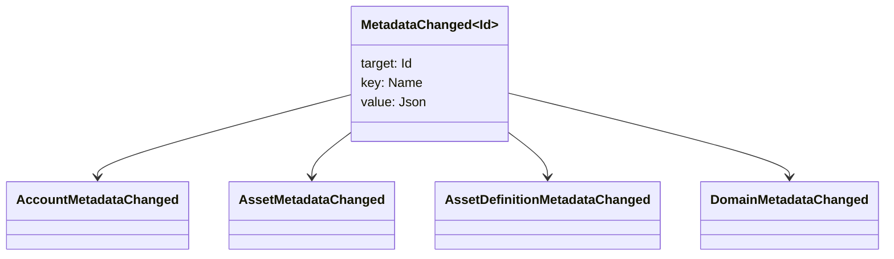

# မီတာဒေတာ {#metadata}

metadata သည် ledger အရာဝတ္ထုများနှင့် ချိတ်ဆက်ထားသော စစ်ဆေးသော key-value မြေပုံတစ်ခုဖြစ်သည်။ key များသည် `Name` တန်ဖိုးများဖြစ်ပြီးတန်ဖိုးများသည် JSON (`Json`) အသုံးဝင်ဝန်ပိုးများဖြစ်သည်။

အောက်ပါ အရာဝတ္ထုတွေက metadata ကို သယ်ဆောင်နိုင်ပါတယ်

- နယ်ပယ်များ
- အကောင့်များ
- အရင်းအမြစ်
- အရင်းအမြစ် အဓိပ္ပါယ်ဖွင့်ဆိုချက်
- NFTs
- RWAs
- trigger များ
- ငွေပေးချေမှု

ကြီးမားသော အသုံးဝင်ဝန်ဆောင်မှုများကို စာရင်းအင်းအခြေအနေတွင် ပါဝင်သည့် သေးငယ်သော သရုပ်ဖော်ရေး (သို့) ညွှန်းကိန်းတင်ကွက်များအတွက် metadata ကိုအသုံးပြုပါ။ WSV နောက်ပြီး အစာအိမ်တစ်ချောင်းနဲ့ ကိုးကားထားတယ်။ URI, ဒါမှမဟုတ် SoraFS လမ်းကြောင်း။

NFTs၊ RWAs သို့မဟုတ် ချိတ်ဆက်မှုအပြင် သိုလှောင်မှုကို ရွေးချယ်ခြင်းဆိုင်ရာ လမ်းညွှန်ချက်များအတွက် [Metadata နှင့် Ledger Storage Choices](/my/guide/configure/metadata-and-store-assets.md) ကိုကြည့်ရှုပါ။

## Taira မှာ စမ်းကြည့်ပါ။ {#try-it-on-taira}

metadata ကို ပုံမှန်အရင်းအမြစ်ဖတ်ရှုမှုမှတဆင့်မြင်နိုင်သည်။ ဤအမိန့်မှာ Taira လက်ရှိ metadata ရှိသော asset အဓိပ္ပါယ်ဖွင့်ဆိုချက်များကိုစာရင်းပေးထားသည်

```bash
curl -fsS 'https://taira.sora.org/v1/assets/definitions?limit=100' \
  | jq '.items[]
    | select((.metadata | length) > 0)
    | {id, name, metadata}'
```

ဒိုမင်များနှင့် အကောင့်များအတွက် အလားတူ ပုံစံကို အသုံးပြုပါ။

```bash
curl -fsS 'https://taira.sora.org/v1/domains?limit=20' \
  | jq '.items[] | select((.metadata // {} | length) > 0)'

curl -fsS 'https://taira.sora.org/v1/accounts?limit=20' \
  | jq '.items[] | select((.metadata // {} | length) > 0)'
```

empty output ကို valid result အဖြစ်သုံးပါ။ ဆိုလိုတာက Taira ပစ္စည်းတွေရဲ့ လက်ရှိ စာမျက်နှာမှာ metadata မရှိဘူး၊ အဆုံးအသတ်မှတ်က ကျရှုံးတာမဟုတ်ဘူး။

## Metadata ကို update လုပ်ခြင်း {#updating-metadata}

မီတာဒေတာကို Iroha အထူးညွှန်ကြားချက်ဖြင့် ပြောင်းလဲပါသည်-

- [`SetKeyValue`](/my/blockchain/instructions.md#setkeyvalue-removekeyvalue) သော့ကိုထည့်သွင်းခြင်း သို့မဟုတ် အစားထိုးခြင်း
- [`RemoveKeyValue`](/my/blockchain/instructions.md#setkeyvalue-removekeyvalue) ကီးကို ဖယ်ရှားတယ်။

ငွေပေးချေမှုကို တင်ပြသူအာဏာပိုင်သည် တက်ကြွသော runtime validator ကတောင်းဆိုသည့် ခွင့်ပြုချက်ရှိရမည်ဖြစ်သည်။ ကြိုတင်ခွင့်ပြုချက် မျက်နှာပြင်အတွက် [ Permission Tokens](/my/reference/permissions.md) ကိုကြည့်ပါ။

## ဖြစ်ရပ်များ {#events}

ဒေတာဖြစ်ရပ်များကို metadata ပြောင်းလဲတဲ့အခါ ထုတ်လွှင့်ပါတယ်။ ယေဘုယျဖြစ်ရပ် အကျိုးဆောင်ဝန်ပိုးက `MetadataChanged<Id>`:



[data event filter](/my/blockchain/filters.md#data-event-filters) ကို အသုံးပြုပြီး ပေါင်းစပ်မှုအတွက် အရေးပါသော entity type သို့မဟုတ် object ID အတွက် metadata events များကိုသာ subscribe လုပ်ပါ။

## မေးခွန်းများ {#queries}

Metadata ကို queryed object ၏အစိတ်အပိုင်းအဖြစ်ပြန်ပေးသည်။ ဥပမာ, [`FindAccountById`](/my/reference/queries.md#accounts-and-permissions), [`FindDomainById`](/my/reference/queries.md#domains-and-peers) သို့မဟုတ် [`FindAssetDefinitionById`](/my/reference/queries.md#assets-nfts-and-rwas) ကိုသုံးပါ။ [`FindNfts`](/my/reference/queries.md#assets-nfts-and-rwas) (သို့) [`FindNftsByAccountId`](/my/reference/queries.md#assets-nfts-and-rwas) ကို NFTs အတွက် အသုံးပြုပြီး [`FindRwas`](/my/reference/queries.md#assets-nfts-and-rwas) ကို RWA အပိုင်းများအတွက် အသုံးပြုပါ။ ထို့နောက် အရာဝတ္ထု၏ metadata ကွင်းကိုဖတ်ပါ။ NFT မေးမြန်းမှုဖြေဆိုချက်များသည် NFT `content` မြေပုံကို မှတ်တမ်း metadata အဖြစ်ဖွင့်ပြသည်။

metadata key တွေဟာ ledger state ရဲ့ အစိတ်အပိုင်းဖြစ်တာကြောင့် ဒါတွေကို တည်ငြိမ်အောင် ထိန်းထားပြီး JSON တန်ဖိုးတစ်ခုက ဒီဗားရှင်းကို တိကျစွာ သယ်ဆောင်နိုင်တဲ့အခါ application-specific version churn ကို encoding လုပ်ခြင်းကနေ ရှောင်ရှားပါ။
