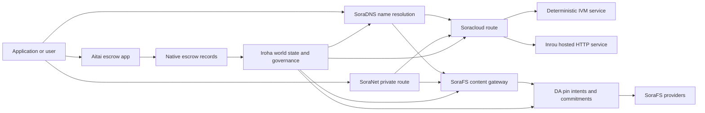

# SORA Nexus ဝန်ဆောင်မှုများ {#sora-nexus-services}

SORA Nexus သည် Iroha 3 အနီးတွင် app-facing service planes ကိုထည့်သွင်းသည်။ ဤဝန်ဆောင်မှုများသည် သီးခြား blockchain ledgers မဟုတ်ပါ။ ၎င်းတို့သည် Iroha ကမ္ဘာ့နိုင်ငံ၊ Norito နည်းပညာ manifest များ၊ အုပ်ချုပ်ရေးမှတ်တမ်းများနှင့် Torii လမ်းကြောင်းမိသားစုများမှချိတ်ဆက်ထားသည်။

အသုံးပြုနိုင်မှုသည် node build နှင့် network profile များအပေါ် မူတည်သည်။ [`/openapi.json`](/my/reference/torii-endpoints.md#app-and-sora-route-families) ဖန်တီးထားတဲ့ app ကို ရှာဖွေဖို့-API ရည်မှန်းချက် အထုံးပေါ်က လမ်းကြောင်းများ SoraFS CID ဖြစ်ပေါ်လာတဲ့ စာရွက်စာတမ်းရဲ့ အပြင်ဘက်မှာ ကျွမ်းကျင်တဲ့ လမ်းကြောင်းတွေ တပ်ဆင်ထားတယ်။ ဒီတော့ ဖြန့်ချိမှုကို စစ်ဆေးတဲ့အခါ ဒီလမ်းကြောင်းတွေကို တိုက်ရိုက် စူးစမ်းပါ။

## အစိတ်အပိုင်း မြေပုံ {#component-map}

|အစိတ်အပိုင်း |ကဏ္ဍ |အဓိက မျက်နှာပြင်များ |
| ---------------------- | ------------------------------------------------------------------------------------------------------------------------------------------- | ---------------------------------------------------------------------------------------- |
|Soracloud |Application deployment, hosted services, private model/ runtime state နဲ့ service lifecycle control တွေကို သုံးနိုင်ဖို့ပါ။ |`/v1/soracloud/*`, `/api/*`, `iroha soracloud service ...`|
|အတွင်းပိုင်း|Soracloud ဟာ တိုက်ရိုက် HTTP လေယာဉ်လိုတဲ့ ဝန်ဆောင်မှု အပြောင်းအလဲတွေအတွက် HTTP ဆော့ဝဲ အကောင်အထည်ဖော်ရေး ပတ်ဝန်းကျင်ကို ဟိုတယ်ပေးထားတယ်။ |Soracloud ဆော့ဝဲ အကောင်အထည်ဖော်ရေး ပတ်ဝန်းကျင် ညွှန်ကြားချက်, host အရည်အသွေး ကြော်ငြာများ, replica software အကောင်အ ထည်ဖော်ရေးပတ်ဝန်းကျင်အခြေအနေ |
|SoraNet |ဘက်ထရီများအတွက် သီးသန့်လွတ်လပ်မှုနှင့် ပို့ဆောင်ရေး overlay, relay traffic, VPN, ချိတ်ဆက်ခြင်းအခမ်းအနားများနှင့် streaming လမ်းကြောင်းများ။ |`/v1/connect/*`, `/v1/vpn/*`, SoraNet လမ်းကြောင်း metadata များ |
|ဒေတာရရှိနိုင်မှု (DA) |Nexus အကောင်အထည်ဖော်ရေးလမ်းကြောင်းများ၊ SoraFS နည်းပညာထုတ်ပြန်ချက်များနှင့် သက်သေပြမှု စီးဆင်းမှုတို့တွင် ရည်ညွှန်းထားသော အသုံးဝင်ဝန်ဆောင်မှုများအတွက် ရင်းနှီးမြှုပ်နှံမှု တန်ဖိုး၊ cryptographic commitment value နှင့် pin-intent layer များ။ |`/v1/da/*`, `FindDaPinIntent*`, `[nexus.da]`|
|SoraFS |Technical manifest များ၊ CAR payload များ၊ pinned content များ၊ gateway fetches များနှင့် proof of recovery flow များအတွက် content-addressed storage fabric များ။ |`/v1/sorafs/*`, `/sorafs/*`, `FindSorafsProviderOwner`|
|SoraDNS |SORA hosted services နှင့် content များအတွက် deterministic naming and resolver-attestation layer များ။ |`/v1/soradns/*`, `/soradns/*`, Resolver directory events များ |
|Aitai |App-level fiat နဲ့ asset financial transaction settlement corridor ကို native escrow records တွေက ထောက်ခံပေးတယ် သီးခြား blockchain ledger ကနေမဟုတ်ဘူး|`OpenAssetEscrow`, `FindAssetEscrow*`, `EscrowEventFilter`, Kotodama `escrow_*` အဆောက်အအုံများ |



## သာမန်စီးဆင်းမှု {#common-flows}

### Hosted Split Application ကို အသုံးပြုခြင်း {#hosted-split-application}

ပုံမှန် Mixed-Plane App မှာ Pieces အားလုံးကို အတူတကွ သုံးပါတယ်။

1. Static frontend အရင်းအမြစ်များကို SoraFS မှတစ်ဆင့် ထုပ်ပိုး၍ ပိတ်ထားသည်။
2. ဥပမာ `<app>.sora` ကိုတော့ SoraDNS မှတဆင့် မှတ်ပုံတင်ထားပါတယ်။
3. Soracloud လမ်းကြောင်းများ `/api/v1/search` သို့မဟုတ် `/api/v1/stream` သို့ Inrou HTTP ဝန်ဆောင်မှုသို့။
4. Soracloud လမ်းကြောင်းများ `/api/auth` နှင့် `/api/v1/user` မှ deterministic IVM ကိုင်တွယ်သူများသို့။
5. ပုဂ္ဂိုလ်ရေးလုံခြုံမှု လိုအပ်တဲ့ ဖောက်သည်တွေဟာ SoraNet ပတ်လမ်းတစ်လျှောက်မှာ တူညီတဲ့ အကြောင်းအရာ (သို့) API လမ်းကြောင်းကို ရောက်ရှိနိုင်ကြပါတယ်။

|လမ်းကြောင်း|နောက်ခံ လေယာဉ် |ဘာကြောင့်လဲ|
| ----------------- | --------------------- | ------------------------------------------------- |
| `/`               |SoraFS တည်ငြိမ်မှု |ပြန်လည်ဖန်တီးနိုင်သော အကြောင်းအရာ root နှင့် gateway ကို cache လုပ်ခြင်း |
|`/assets/*` |SoraFS တည်ငြိမ်မှု |Content-addressed assets and technical manifest proofs  အကြောင်းအရာများနှင့် ပတ်သက်သော အရင်းအမြစ်များ နှင့် နည်းပညာ အထောက်အထားများ|
|`/api/auth*` |Soracloud IVM |ပြန်လည်ကစားရန် လုံခြုံသော စာရင်းအင်းနှင့် ငွေကြေးစွန့်စားမှုအခြေအနေ |
|`/api/v1/user*` |Soracloud IVM |စီမံခန့်ခွဲမှုအတွက် ထိခိုက်လွယ်တဲ့ နိုင်ငံတော် အပြောင်းအလဲ |
|`/api/v1/search*` |Soracloud Inrou |တိုက်ရိုက် HTTP ဝန်ဆောင်မှု, ကေရှ်, SSE, သို့မဟုတ် စုဆောင်းသူအခြေအနေ |

### အကြောင်းအရာ ထုတ်ဝေခြင်း {#content-publication}

SoraFS ထုတ်ဝေမှုမှာ နာမည်တစ်ခုက သူတို့ကို ညွှန်းမပေးခင် သက်တမ်းရှည် ရှေးဟောင်းပစ္စည်းတွေကို ထုတ်လုပ်တယ်။

1. အသုံးဝင်တဲ့ ဝန်ဆောင်မှု (သို့) Directory ကို တည်ဆောက်ပါ။
2. ဒါကို CAR စာရွက်စာတမ်းထဲထည့်ပြီး အစိတ်အပိုင်းအစီအစဉ်ကို လုပ်ပါ။
3. Norito Technical Manifesto ကို pin policy နဲ့ governance data တွေနဲ့ ပြုလုပ်ပါ။
4. Technical manifest ကို Torii သို့ တင်ပြပါ။
5. DA pin intent (သို့) availability cryptographic commitment value ကို မှတ်တမ်းတင်ပါ
6. Technical manifest ကို SoraDNS နာမည် (သို့) Soracloud တည်ငြိမ်တဲ့ ရှေ့ပြေးလမ်းကြောင်းနဲ့ ချိတ်ဆက်ပါ။

### ပုဂ္ဂလိကခေါ်ယူခြင်း (သို့) စီးဆင်းမှု လမ်းကြောင်း {#private-fetch-or-streaming-route}

SoraNet သည် SoraFS သို့မဟုတ် Soracloud ရှေ့မှာ ထိုင်နိုင်သည်-

1. ဖောက်သည်က နာမည် (သို့) Technical Manifesto ကို ဖြေရှင်းတယ်။
2. guard directory (သို့) route technical manifest မှာ entry နဲ့ exit relay တွေကို ရွေးချယ်ပါတယ်။
3. SoraNet ပတ်လမ်းကို ဖြတ်ပြီး ယာဉ်မောင်းတွေ ဖြည့်ပြီး ပို့ပေးတယ်။
4. SoraFS ဂိတ်တံခါး၊ Torii စီးကြောင်း သို့မဟုတ် Soracloud လမ်းကြောင်းသို့ ထွက်ပေါက်ဆက်သွယ်မှု ရောက်ရှိသည်။

## Aitai {#aitai}

Aitai သည် SORA app corridor ဖြစ်ပြီး ဝယ်ယူသူနှင့်ရောင်းသူသည် Iroha တွင်စျေးကွက်ပုံစံ ငွေကြေးငွေပေးချေမှုအတွက် Off-chain payment ကို ညှိနှိုင်းသည်။ ချိတ်ဆက်ထားတဲ့ အရင်းအမြစ် ထိန်းသိမ်းမှုကို ထိန်းချုပ်ပါတယ်။ စာရင်းအင်းပိုင် အာမခံစာရင်းအစား ဒေသခံ အာမခံညွှန်ကြားမှု မိသားစုကို အသုံးပြုပြီး ကိန်းဂဏန်းအရင်းအမြစ်ထိန်းသိမ်းမှု စီးဆင်းမှု အသစ်တွေအတွက် သုံးသင့်တယ်။

Native escrow သည် blockchain ledger တွင် custody ကို ထိန်းသိမ်းထားသည်။ ရောင်းသူသည် `OpenAssetEscrow` ဖြင့် ကမ်းလှမ်းမှုကိုဖွင့်ပြီး ၀ ယ်သူသည် `AcceptAssetEscrow` နှင့် `MarkEscrowPaymentSent` တို့ဖြင့် Off-chain ငွေပေးချေခြင်းကိုလက်ခံကာ အမှတ်တံဆိပ်ပေးသည်။ ရောင်းသူသည် `ReleaseAssetEscrow` ဖြင့်ထုတ်ပေးခြင်း သို့မဟုတ် ပေးချေမှုကို အမှတ်တံဆိပ်မထည့်မီ ဖျက်သိမ်းခြင်း။ ဝယ်သူနှင့်ရောင်းသူ သဘောမတူလျှင် နှစ်ဘက်စလုံးက ပဋိပက္ခဖွင့်နိုင်ပြီး `CanResolveEscrowDispute` နှင့်ဖြေရှင်းသူသည် ပိတ်ထားသောငွေကိုခွဲခြားနိုင်သည်။

Rust အကောင်အထည်ဖော်မှု စက်ဝန်းတစ်ခုလုံး၊ ယေဘုယျအရင်းအမြစ်ပိတ်ခြင်း၊ အမည်မသိဂိုဏ်း၊ မေးမြန်းချက်များ၊ ဖြစ်ရပ်များနှင့် ဥပမာများအတွက် [Native Asset Escrow](/my/blockchain/escrow.md) ကိုကြည့်ရှုပါ။

|Aitai မျက်နှာပြင်|ဒါကို အသုံးပြုပါ။|
| ------------------------------------------------------------------------------------------------------------------------------------------------------------- | ----------------------------------------------------------------------------------------- |
|`OpenAssetEscrow`, `AcceptAssetEscrow`, `MarkEscrowPaymentSent`, `ReleaseAssetEscrow`, `CancelAssetEscrow` |ပွင့်လင်းမြင်သာသော ကိန်းဂဏန်း အရင်းအမြစ် ကမ်းလှမ်းချက်များ၊ XOR သို့ သတ်မှတ်ထားသည့် ငွေကြေးငွေပေးချေမှု ဖြေရှင်းရေး စီးဆင်းမှုများ အပါအဝင်။ |
|`OpenAnonymousAssetEscrow`, `AcceptAnonymousAssetEscrow`, `MarkAnonymousEscrowPaymentSent`, `ReleaseAnonymousAssetEscrow`, `CancelAnonymousAssetEscrow` |Shielded ကမ်းလှမ်းချက်တွေဟာ ငွေကြေးထောက်ပံ့မှုနဲ့ ပိတ်သိမ်းတဲ့ လှုပ်ရှားမှုတွေအတွက် သက်သေခံ အထောက်အထားကို သုံးပါတယ်။ |
|`OpenEscrowDispute`, `ResolveEscrowDispute`, `OpenAnonymousEscrowDispute`၊ `ResolveAnonymousEscrowDispute` |အငြင်းပွားမှုဖြေရှင်းရေးနဲ့ တရားရုံးပုံစံ ဆုံးဖြတ်ချက်ချခြင်း။|
|`FindAssetEscrowById`, `FindAssetEscrowsBySeller`, `FindAssetEscrowsByBuyer`၊ `FindAssetEscrowsByStatus` |App Status စာမျက်နှာများ၊ ညှိနှိုင်းမှု အလုပ်များနှင့် ထောက်ပံ့ရေး ကိရိယာများ။ |
|`EscrowEventFilter` |ပွင့်လင်းမြင်သာတဲ့ escrow subscriptions တွေကို escrow id၊ ရောင်းသူ၊ ဝယ်သူ၊ အခြေအနေ (သို့) အဖြစ်အပျက် အမျိုးအစားဖြင့် တိုက်ရိုက်ပေးသွင်းပါ။ |
| Kotodama `escrow_open_offer`, `escrow_accept`, `escrow_mark_payment_sent`, `escrow_release`, `escrow_cancel`, `escrow_open_dispute`, `escrow_resolve_dispute` |Kotodama သဘောတူစာချုပ်ခေါ်ဆိုမှုများကို V1 ကော်ပိုရေးရှင်းက ထောက်ခံသည်။ |

အများသုံး Taira သို့မဟုတ် Minamoto အသုံးပြုမှုအတွက် off-chain ငွေပေးချေမှုလမ်းကြောင်းနှင့် ပံ့ပိုးကူညီမှု သို့မဟုတ် တရားရုံးဆိုင်ရာ လုပ်ငန်းစဉ်များကို အပလီကေးရှင်းမူဝါဒအဖြစ် သတ်မှတ်ပါ။ Iroha သည် ထိန်းသိမ်းပိုင်ခွင့်အခြေအနေ၊ သက်တမ်းစက်ဝန်းဖြစ်ရပ်များ၊ သက်သေအထောက်အထားဆိုင်ရာ cryptographic hash များနှင့် ပိုင်ဆိုင်မှု၏ နောက်ဆုံးရွှေ့ပြောင်းမှုကို မှတ်တမ်းတင်သည်။ fiat ငွေရှင်းခြင်းကို မိမိဘာသာ အတည်မပြုပါ။

## Target Node ကို စစ်ဆေးပါ {#check-a-target-node}

ဤစာမျက်နှာမှ နမူနာများကို အသုံးပြုရန်မတိုင်မီ သင်ရည်မှန်းနေသည့် node တွင် route မိသားစုရှိသည်ကို စစ်ဆေးပါ-

```bash
export TORII_URL=https://taira.sora.org

curl -fsS "$TORII_URL/openapi.json" \
  | jq '.paths | keys[] | select(test("^/v1/(soracloud|sorafs|soradns|connect|vpn|da)/"))'

curl -fsS -H 'Accept: application/json' "$TORII_URL/status" | jq .
```

`/openapi.json` သည် Single Protocol-Standard OpenAPI API အဆုံးသတ်မှတ်ချက်ဖြစ်သည်။ လမ်းကြောင်းတည်ရှိမှုအတိအကျသည် build features နှင့် network ဖွဲ့စည်းပုံအပေါ်မူတည်သည်။ ဒီစာရွက်စာတမ်းမှာ အများပြည်သူအတွက် ဒေသတွင်း SoraFS CID နဲ့ နာမည်ကြီး လမ်းကြောင်းတွေကို စာရင်းမပေးပါဘူး။ အောက်မှာဖော်ပြထားတဲ့အတိုင်း တိုက်ရိုက် API အဆုံးသတ်မှတ်ချက်တွေကို စစ်ဆေးပါ။

### Taira Read-Only Smoke Checks များကို ဖတ်ရန် {#taira-read-only-smoke-checks}

အများပြည်သူ Taira API အကန့်အသတ်မှတ်ချက်ဟာ စာဖတ်ဘက် စစ်ဆေးမှုအတွက် အသုံးဝင်ပေမဲ့ ခွင့်ပြုထားတဲ့ အကောင့်ကို မောင်းနှင်ပြီး အများပြည်သူ testnet အခြေအနေကို ပြောင်းလဲဖို့ ရည်ရွယ်တာမဟုတ်ရင် ဗီဇပြောင်းတဲ့ နမူနာတွေအတွက်တော့ မသုံးပါနဲ့။

```bash
export TORII_URL=https://taira.sora.org

curl -fsS -H 'Accept: application/json' "$TORII_URL/status" \
  | jq '{version: .build.version, peers, blocks, lanes: (.teu_lane_commit | length)}'

curl -fsS "$TORII_URL/v1/vpn/profile" \
  | jq '{available, relay_endpoint, supported_exit_classes}'

curl -fsS "$TORII_URL/v1/sorafs/storage/peers?limit=4" \
  | jq '{gateway_base_url, pin_torii_urls}'

curl -fsS -H 'Accept: application/json' "$TORII_URL/v1/soracloud/status" \
  | jq '.control_plane | {service_count, services: [.services[] | {service_name, current_version}]}'
```

Taira သည် OpenAPI လမ်းကြောင်းမြေပုံတွင် ဖော်ပြထားခြင်းမရှိသော တပ်ဆင်မှုဆိုင်ရာ ထိန်းချုပ်ရေးလေယာဉ်လမ်းကြောင်းများကို ဖေါ်ပြနိုင်သည်။ ၎င်းပါဝင်သည့် လမ်းကြောင်းများအတွက် `/openapi.json` ကို ထုတ်လုပ်ထားသော စာချုပ်အဖြစ် မှတ်ယူပြီး တပ်ဆင်မှုနှင့် ပတ်သက်၍ ပြည်သူ့နေရာရှိ SoraFS လမ်းကြောင်းများကို လက်ရှိအတိုင်း မှတ်တမ်းတင်ရန် မတိုင်မီ တိုက်ရိုက် အတည်ပြုပါ။

## Soracloud {#soracloud}

Soracloud သည် SORA application control plane ဖြစ်သည်။ ၎င်းသည် deployment bundles, service revisions, routing, rollout state, authoritative config entries, encrypted service secrets, model registry records, private inference sessions နှင့် software execution environment protocol result record များကို ခြေရာခံသည်။

Soracloud ဟာ စီမံခန့်ခွဲရေး လေယာဉ် နှစ်ခုကို သုံးပါတယ်။

|သတ်ဖြတ်ရေး လေယာဉ် |ဆော့ဝဲ အကောင်အထည်ဖော်မှု ပတ်ဝန်းကျင် |ဒါကို အသုံးပြုပါ။|
| ---------------------- | ------- | -------------------------------------------------------------------------------------------- |
|`DeterministicService` |`Ivm` |Author, vault state, certified readings, ordered mailbox handleers, governance-sensitive mutations |
|`HttpService` |`Inrou` |တိုက်ရိုက် HTTP APIs၊ စုဆောင်းရေး အလုပ်များ၊ ကေရှ်ထောက်ပံ့တဲ့ ဝန်ဆောင်မှုတွေ၊ SSE၊ ရှာဖွေရေးကိရိယာကူညီတဲ့ စီးဆင်းမှုတွေ |

ထိန်းချုပ်ရေးအဆင့်က အာဏာရှိသည်။ ဖြန့်ချိခြင်း၊ အဆင့်မြှင့်တင်ခြင်း၊ ပြန်လည်ထည့်သွင်းခြင်း၊ ဖွဲ့စည်းခြင်း၊ လျှို့ဝှက်မှု၊ မော်ဒယ်နှင့်အခြေအနေအမိန့်များကို Torii မှတစ်ဆင့်ပို့ပြီး အဆုံးသတ်သောကမ္ဘာအခြေအနေကိုဖတ်ပါ။ ၎င်းတို့သည် သီးခြား CLI - ဒေသခံ မှန်ပေါ်မူတည်ခြင်းမရှိပါ။ အများပြည်သူ လမ်းညွှန်ခြင်းသည် အမြင့်ဆုံး ကြိုတင်စာရင်းကို အခြေခံထားသောကြောင့် မှတ်ပုံတင်ထားသည့် အိမ်ရှင်တစ်ဦးက တည်းခိုထားသော HTTP လမ်းကြောင်းများနှင့် သတ်မှတ်ထားသော API လမ်းကြောင်းများကြားတွင် ယာဉ်ကြောကို ခွဲခြားနိုင်သည်။

### Generated Starter Structure a Split App ကို {#scaffold-a-split-app}

split-app template က static frontend plus hosted live API နဲ့ deterministic vault/API ဝန်ဆောင်မှု တစ်ခုကို ဖန်တီးပါတယ်။

```bash
iroha soracloud app init \
  --template split-app \
  --app-name solswap_indexer \
  --app-version 0.1.0 \
  --public-host solswap-indexer.sora \
  --output-dir ./apps/solswap-indexer

iroha soracloud app plan \
  --manifest ./apps/solswap-indexer/app_manifest.json

iroha soracloud app doctor \
  --manifest ./apps/solswap-indexer/app_manifest.json
```

`plan` သည် လမ်းကြောင်းခွဲခြားချက်၊ ကလေးဝန်ဆောင်မှု နည်းပညာထုတ်ပြန်ချက်များ၊ အလုပ်ခွင်စာသားလမ်းကြောင်းများနှင့် ကြိုတင်မျှော်မှန်းထားသော ရှေ့ဆုံး ထုတ်ဝေပုံများကို ပုံနှိပ်သည်။ `doctor` သည် Torii ကို ပါဝင်ရန်မတိုင်မီ ဒေသတွင်းထုတ်လွှင့်မှု စာချုပ်ကို အတည်ပြုပေးသည်။

### App State ကို စေလွှတ်ပြီး စစ်ဆေးခြင်း {#deploy-and-inspect-app-state}

ပြန်လည်သုံးပါ SoraFS အနာဂတ်ထိန်းသိမ်းမှုကာလတစ်ခု ထုတ်ဝေခြင်း၏ပြန်လည်ကြိုးစားမှုတိုင်းအတွက်။ split-app နမူနာမှာ Inrou ဝန်ဆောင်မှုရှိသည့်ကြောင့်, အွန်လိုင်းအပြောင်းအလဲမတိုင်မီရွေးချယ်သော offline provider ဆိုင်များတွင်၎င်း၏တိကျသောလက်ရာပစ္စည်းကိုသတ်မှတ်ပါ။

```bash
export SORACLOUD_TORII_URL=https://<soracloud-enabled-torii>
export SORAFS_RETENTION_EPOCH=<future-unix-seconds>

iroha soracloud app preseed \
  --manifest ./apps/solswap-indexer/app_manifest.json \
  --sorafs-retention-epoch "$SORAFS_RETENTION_EPOCH" \
  --inrou-preseed-target <validator-account,peer-id,absolute-store-path> \
  --inrou-preseed-max-capacity-bytes <bytes> \
  --inrou-preseed-helper /absolute/path/to/sorafs-node \
  --inrou-preseed-helper-sha256 <lowercase-sha256> \
  --receipt-out /absolute/path/to/solswap-inrou-preseed.json

iroha soracloud app release \
  --manifest ./apps/solswap-indexer/app_manifest.json \
  --sorafs-retention-epoch "$SORAFS_RETENTION_EPOCH" \
  --inrou-preseed-receipt /absolute/path/to/solswap-inrou-preseed.json \
  --torii-url "$SORACLOUD_TORII_URL"

iroha soracloud app status \
  --manifest ./apps/solswap-indexer/app_manifest.json \
  --torii-url "$SORACLOUD_TORII_URL"
```

`--inrou-preseed-target` ကို ဖြန့်ဖြူးရေး မူဝါဒအရ လိုအပ်တဲ့ ပေးသွင်းသူစတိုးတိုင်းအတွက် ထပ်မံလုပ်ပါ။ `release` က နည်းပညာ manifesto တွေကို တည်ဆောက်ပြီး synchronizes လုပ်ပေးတယ်၊ app doctor ကို run လုပ်တယ်။ protocol-standard app infrastructure တစ်ခုတည်းသော ဗီဇပြောင်းမှုတစ်ခုတင်သွင်းခြင်း၊ အာဏာပိုင်အခြေအနေကို ညှိနှိုင်းခြင်းနှင့် ကြေညာထားသော live target များအား စစ်ဆေးခြင်း။ Inrou artefacts ကိုပါဝင်သည့် app တွင် pre-set protocol ရလဒ်မှတ်တမ်းသည်ရွေးချယ်စရာမဟုတ်ပါ။

အသုံးပြုပြီးသား ဝန်ဆောင်မှုအတွက် Service-scale command ကို သုံးပါ။

```bash
iroha soracloud service status \
  --service-name solswap_indexer_live \
  --torii-url "$SORACLOUD_TORII_URL"

iroha soracloud service rollback \
  --service-name solswap_indexer_live \
  --target-version 0.1.0 \
  --torii-url "$SORACLOUD_TORII_URL"
```

### လျှို့ဝှက်ပစ္စည်းများ {#config-and-secret-material}

Soracloud config နှင့် secret entries တို့သည် authoritative deployment state ၏ အစိတ်အပိုင်းဖြစ်သည်။ လိုအပ်သော config သို့မဟုတ် secret bindings များပျောက်ကွယ်နေသည့် (သို့မဟုတ်) တက်ကြွသော နည်းပညာ manifest များနှင့်မညီသည့်အခါ Deploy, Upgrade နှင့် Rollback ကိုပိတ်နိုင်ခြင်းမရှိပါ။

```bash
iroha soracloud service config-set \
  --service-name solswap_indexer_live \
  --config-name indexer/public_config \
  --value-file ./config/public-config.json \
  --torii-url "$SORACLOUD_TORII_URL"

iroha soracloud service secret-set \
  --service-name solswap_indexer_live \
  --secret-name indexer/api_key \
  --secret-file ./secrets/api-key.envelope.json \
  --torii-url "$SORACLOUD_TORII_URL"
```

CLI အကူအညီကို အသုံးပြုပြီး ကိုယ်ရေးကိုယ်တာအချက်အလက်အတွက် လိုအပ်တဲ့ တိကျတဲ့ မှတ်ပုံတင်အမှတ်တံဆိပ်များကို ရှာဖွေပါ။

```bash
iroha soracloud service config-set --help
iroha soracloud service secret-set --help
```

## Inrou {#inrou}

Inrou က ဧည့်သည်ပါ။ HTTP အသုံးပြုသော software execution environment ကို Soracloud. အန် Iroha embedded node နှင့်အတူ node Soracloud ဆော့ဝဲ အကောင်အထည်ဖော်ရေး ပတ်ဝန်းကျင် စီမံကိန်းများ လက်ခံ Soracloud ဒေသတွင်း ရုပ်လုံးဖေါ်ရေး အစီအစဉ်တစ်ခုထဲ ထည့်သွင်းထားပြီး သတ်မှတ်ထားတဲ့ hosted-service replicas တွေကို loopback services အဖြစ် စတင်ပေးပါတယ်။ အစီရင်ခံစာများနှင့် software execution ပတ်ဝန်းကျင်အခြေအနေကိုအမှန်တကယ်မော်ဒယ်သို့ပြန်ပို့။

Collector-heavy APIs, SSE streams, cache backed handleers သို့မဟုတ် browser assisted services တို့လို live HTTP မျက်နှာပြင်လိုအပ်တဲ့ workload များအတွက် Inrou ကိုအသုံးပြုပါ။

### ဆော့ဝဲ အကောင်အထည်ဖော်ရေး ပတ်ဝန်းကျင် လိုအပ်ချက်များ {#runtime-requirements}

- Container Technical Manifesto software ကို အကောင်အထည်ဖော်တဲ့ ပတ်ဝန်းကျင်က `Inrou` ဖြစ်ရပါမယ်။
- ဝန်ဆောင်မှုနည်းပညာထုတ်ပြန်ချက် အကောင်အထည်ဖော်ရေးစက်က `HttpService` ဖြစ်ရပါမယ်။
- `HttpService + Inrou` အတိအကျ တစ်ခုကို လိုအပ်တယ်။ `PersistentRootLeaseVolume` တပ်ဆင်ထားသည် `/`.
- Inrou ဝန်ဆောင်မှုများကို ပြန်လည်ဖန်တီးခြင်းသည်လည်း ပြောင်းလဲနိုင်သော မျှဝေထားသော အခြေအနေကို ထိန်းသိမ်းထားပါက မျှဝေထားသည့် ဝန်ဆောင်မှု (သို့) လျှို့ဝှက်ငှားစာရင်း သိုလှောင်ရန် လိုအပ်သည်။
- Production hosting node တွေဟာ Inrou အရည်အသွေးကို ပရိုဂျက်အဖြစ်သာ လုပ်ကိုင်မယ့်အစား ကြော်ငြာပေးသင့်ပါတယ်။

### Technical Manifesto Fragment {#manifest-fragment}

အောက်ပါဥပမာမှာ Technical Manifesto နှစ်ခုရဲ့ ပုံစံကို ပြထားပါတယ်။ ဒါက အစိတ်အပိုင်းတစ်ခုဖြစ်ပြီး ဖြန့်ဖြူးမှုအပြည့်အဝမဟုတ်ဘူး။

```jsonc
// container_manifest.json
{
  "schema_version": 1,
  "runtime": { "runtime": "Inrou", "value": null },
  "bundle_path": "/bundles/solswap-indexer.inrou",
  "entrypoint": "/app/bin/launch-indexer.sh",
  "args": [],
  "env": {
    "RUST_LOG": "info",
  },
  "inrou": {
    "schema_version": 1,
    "guest_os": { "guest_os": "DebianSlim", "value": null },
    "guest_images": {
      "x86_64": {
        "kernel_image_path": "/inrou/x86_64/vmlinux",
        "rootfs_image_path": "/inrou/x86_64/rootfs.ext4",
        "initrd_image_path": null,
      },
      "aarch64": {
        "kernel_image_path": "/inrou/aarch64/vmlinux",
        "rootfs_image_path": "/inrou/aarch64/rootfs.ext4",
        "initrd_image_path": null,
      },
    },
  },
  "lifecycle": {
    "start_grace_secs": 60,
    "stop_grace_secs": 30,
    "healthcheck_path": "/api/indexer/v1/health",
  },
}
```

```jsonc
// service_manifest.json
{
  "schema_version": 1,
  "service_name": "solswap_indexer_live",
  "service_version": "0.1.0",
  "execution_plane": { "execution_plane": "HttpService", "value": null },
  "replicas": 2,
  "route": {
    "host": "solswap-indexer.sora",
    "path_prefix": "/api/v1/search",
    "service_port": 8080,
    "visibility": { "visibility": "Public", "value": null },
    "tls_mode": { "tls": "Required", "value": null },
  },
  "lease_volumes": [
    {
      "volume_name": "root_disk",
      "kind": {
        "lease_volume": "PersistentRootLeaseVolume",
        "value": null,
      },
      "storage_class": { "storage_class": "Warm", "value": null },
      "mount_path": "/",
      "max_total_bytes": 8589934592,
    },
    {
      "volume_name": "index_state",
      "kind": { "lease_volume": "ServiceLeaseVolume", "value": null },
      "storage_class": { "storage_class": "Warm", "value": null },
      "mount_path": "/var/lib/solswap-indexer",
      "max_total_bytes": 1073741824,
    },
  ],
}
```

ဆော့ဖ်ဝဲ အကောင်အထည်ဖော်မှု ပတ်ဝန်းကျင်မှာ၊ တပ်ဆင်ထားတဲ့ လိုင်စင်ပမာဏတစ်ခုစီဟာ ပမာဏအမည်မှ ရယူထားသော ပတ်ဝန်းကျင် ကိန်းရှင်များဖြင့် ထုတ်လွှင့်ခြင်းခံနေရသည်။

```text
SORACLOUD_LEASE_VOLUME_ROOT_DISK_DIR
SORACLOUD_LEASE_VOLUME_ROOT_DISK_MOUNT_PATH
SORACLOUD_LEASE_VOLUME_INDEX_STATE_DIR
SORACLOUD_LEASE_VOLUME_INDEX_STATE_MOUNT_PATH
```

## SoraNet {#soranet}

SoraNet ဆိုသည်မှာ ပိုင်ဆိုင်မှုနှင့် သယ်ယူပို့ဆောင်ရေး အပေါ်လွှာခြင်းဖြစ်သည်။ ၎င်းသည် ရည်မှန်းချက်ဂိတ်သို့မဟုတ် ဝန်ဆောင်မှုသို့ တိုက်ရိုက်ဆက်သွယ်ရန် မလိုသော ယာဉ်ကြောအတွက် relay အခြေခံ လမ်းကြောင်းများကိုပေးသည်။ သယ်ယူပို့ဆောင်ရေး ဒီဇိုင်းမှာ ဝင်ရောက်မှု၊ အလယ်ပိုင်းနဲ့ ထွက်ပေါက် Relay Roles များ၊ QUIC ပို့ဆောင်မှုတွေ၊ Noise based hybrid handshake တွေ၊ အရည်အသွေး ညှိနှိုင်းမှု၊ Relay Directory metadata တွေနဲ့ Fixed-size padded cells တွေကို သုံးပါတယ်။

Nexus deployments များတွင်, SoraNet သည် content fetches, gateway traffic, VPN သို့မဟုတ် Connect sessions နှင့် Norito streaming routes များကိုဆောင်ရွက်နိုင်သည်။ directory entries များသည် `norito-stream` ကိုထောက်ပံ့သော relays များကိုမှတ်သားနိုင်ပြီး, ဤသည်မှာဖောက်သည်များအတွက်သင့်တော်သောအရာလမ်းကြောင်းများကိုရွေးချယ်ရန်ခွင့်ပြုသည် Torii RPC သို့မဟုတ် streaming traffic.

### Streaming Configuration ကို {#streaming-configuration}

Nexus ပရိုဖိုင်သည် SoraNet ကို streaming လမ်းကြောင်းများအတွက် ထောက်ပံ့နိုင်စေသည်။

```toml
[streaming]
feature_bits = 0b11

[streaming.soranet]
enabled = true
exit_multiaddr = "/dns/torii/udp/9443/quic"
padding_budget_ms = 25
access_kind = "authenticated"
provision_spool_dir = "./storage/streaming/soranet_routes"
provision_spool_max_bytes = 0
provision_window_segments = 4
provision_queue_capacity = 256
```

`access_kind = "read-only"` ကို ကြည့်ရှုသူအား စစ်ဆေးရန် မလိုသော အကြောင်းအရာလမ်းကြောင်းများအတွက် အသုံးပြုပါ။ `authenticated` ကို သုံးပါ exit relay သည် Torii သို့သို့မဟုတ် ဟိုတယ်ဝန်ဆောင်မှုတစ်ခုသို့ မရောက်မီလက်မှတ်များ (သို့) ကြည့်ရှုသူ၏ ကိုယ်ပိုင်လက္ခဏာကို အကောင်အထည်ဖော်ရမည့်အခါ။

### SoraNet-သိရှိထားသည် SoraFS ခေါ်ယူ {#soranet-aware-sorafs-fetch}

နိုင်ငံတကာ SoraFS ရယူခြင်း CLI ဒေသတွင်းကိုယ်စားလှယ်လက်မှတ်နှင့် spool ထုတ်လွှင့်နိုင်သည် SoraNet browser extension တွေအတွက် route metadata သို့မဟုတ် SDK Adapter တွေ၊ orchestrator JSON သတ်မှတ်ပေးရပါမယ်။ `local_proxy` နှင့်အတူ `"emit_browser_manifest": true`, နောက်ပြီး CLI ဆောက်လုပ်ရမယ်။ `local-quic-proxy` ထောက်ပံ့မှု။ Taira, အများပြည်သူ testnet root မှာ ခွင့်ပြုထားတဲ့ ပေးသွင်းသူ စာရင်းကို စစ်ဆေးပါ။ ထို့နောက် ထိုပေးသွင်းသူအတွက် ထုတ်ဝေသော ကာကွယ်ထားသည့် ပေးသွင်းသူ tuple ကိုဖြည့်ပါ။

```bash
export TAIRA_ROOT=https://taira.sora.org
curl -fsS "$TAIRA_ROOT/v1/sorafs/providers?limit=20" | jq '.providers'

: "${TAIRA_SORAFS_PROVIDER_ID:?set the admitted provider ID from Taira discovery}"
: "${TAIRA_SORAFS_GATEWAY_KEY:?set the provider gateway key}"
: "${TAIRA_SORAFS_PROVIDER_URL:?set the advertised provider base URL}"
: "${TAIRA_SORAFS_STREAM_TOKEN_FILE:?set the issued stream-token file}"

cargo run -p sorafs_orchestrator --features=local-quic-proxy --bin=sorafs_cli -- \
  fetch \
  --plan=artifacts/payload_plan.json \
  --manifest-id=<manifest-digest-hex> \
  --orchestrator-config=artifacts/orchestrator.json \
  --provider=name=taira,provider-id="$TAIRA_SORAFS_PROVIDER_ID",gateway-key="$TAIRA_SORAFS_GATEWAY_KEY",base-url="$TAIRA_SORAFS_PROVIDER_URL",stream-token="$(cat "$TAIRA_SORAFS_STREAM_TOKEN_FILE")" \
  --output=artifacts/payload.bin \
  --json-out=artifacts/fetch_summary.json \
  --local-proxy-manifest-out=artifacts/proxy_manifest.json \
  --local-proxy-mode=bridge \
  --local-proxy-norito-spool=storage/streaming/soranet_routes \
  --local-proxy-kaigi-spool=storage/streaming/soranet_routes \
  --local-proxy-kaigi-policy=authenticated \
  --max-peers=2 \
  --retry-budget=4
```

အနှစ်ချုပ်မှတ်တမ်းပေးသူ အစီရင်ခံစာများ၊ ချပ်ပရိုတိုကော ရလဒ် မှတ်တမ်းများ၊ ဒေသဆိုင်ရာ ကိုယ်စားလှယ် မီတာဒေတာများနှင့် ကောက်ယူမှုအတွက် အသုံးပြုသော ထိရောက်တဲ့ လမ်းကြောင်း သတ်မှတ်ချက်များကို။

### Relay Incentive စစ်ဆေးသူစာရင်း {#relay-incentive-verifier-roster}

`incentives.enable` မှန်ကန်ပါက `incentives.trusted_verifier_ids` တွင် အနည်းဆုံး ပရိုတိုကုတ်စံညွှန်းစာရင်း ID တစ်ခုသာ ပါဝင်ရမည်ဖြစ်သည်။ စာရင်းသည် 64 ကိုမကျော်ရပါ။ ဆော့ဖ်ဝဲ အကောင်အထည်ဖော်မှု ပတ်ဝန်းကျင်က Deterministic Ordered Set အဖြစ် သိမ်းဆည်းထားပြီး Relay startup အတွင်းမှာ invalid roster geometry ကို ပယ်ချလိုက်ပါတယ်။

`RelayBandwidthProofV1` တစ်ခုစီကို Fixed Frame/ Allocation Budget အောက်မှာ decod လုပ်ပြီး အပြည့်အဝ frame ကို စားသုံးရပါမယ်။ proof ရဲ့ verifier account က configured roster ထဲမှာ ရှိနေဖို့လိုပြီး `RelayBandwidthProofV1::verify_signature()` ဟာ relay lock မလုပ်ခင် ဒါမှမဟုတ် performance accumulator ကို ပြောင်းမသွားခင် အောင်မြင်မှုရမှာပါ။ ဒါကြောင့် ယုံကြည်မှုမရှိတဲ့ cryptographic လက်မှတ်ထိုးသူ (သို့) လက်မှတ်လက်မှတ်မမှန် / အတုလုပ်ထားတဲ့ သက်သေက တိုင်းတာမှုကို မကူညီနိုင်ဘူး၊ လှုံ့ဆော်မှု snapshot ကိုထုတ်လုပ်နိုင်မှာမဟုတ်ဘူး။

## ဒေတာရရှိနိုင်မှု (DA) {#data-availability-da}

DA သည် world state တွင် တိုက်ရိုက်ထည့်ရန်အတွက် အလွန်ကြီးမားသော၊ ပုဂ္ဂလိကရေးရာနှင့် စပ်လျဉ်းသည့် (သို့) ဝန်ဆောင်မှုဆိုင်ရာ သီးသန့်ပစ္စည်းများအတွက် အသုံးပြုနိုင်စွမ်းအထောက်အထား အလွှာဖြစ်သည်။ Deterministic cryptographic commitment values နဲ့ retrieval obligations တွေကို မှတ်တမ်းတင်ထားလို့ validator တွေ၊ gateways တွေနဲ့ client တွေက ဘယ် byte ကတိပေးခဲ့လဲ၊ ဘယ်မူဝါဒကို သုံးပြီး ဘယ်သက်သေတွေကို စောင့်ကြည့်ခဲ့တာလဲ ဆိုတာကို သဘောတူနိုင်ကြပါတယ်။

DA သည် Kura သို့မဟုတ် SoraFS ကိုအစားထိုးခြင်းမရှိပါ။

- Kura က နောက်ဆုံးသတ်မှတ်ထားတဲ့ block stream နဲ့ consensus recovery data တွေကို သိမ်းထားတယ်။
- SoraFS က Content Addressed Byte တွေ၊ CAR အသုံးဝင် ဝန်ဆောင်မှုတွေ နဲ့ Technical Manifesto တွေကို သိမ်းပိုက်ပြီး ပို့ပေးပါတယ်။
- DA သည် cryptographic commitment တန်ဖိုးများ၊ proof မူဝါဒများ၊ proof openings များနှင့် pin intent များကို မှတ်တမ်းတင်ထားပြီး ထို byte များကို အစီအစဉ်ချရန်၊ စစ်ဆေးရန်နှင့် blockchain ledger အခြေအနေသို့ ပြန်လည်ဆက်သွယ်ရန်ခွင့်ပြုသည်။

DA ကို အသုံးပြုပါ Application သို့မဟုတ် Nexus Execution Lane သည် blockchain ledger တွင် မြင်နိုင်သော Off-chain ဒေတာများကို ပြန်လည်ရရှိနိုင်ရန် ကတိပြုချက်တစ်ခုလိုအပ်တဲ့အခါမှာ။ သာမန်ဥပမာများမှာ ငွေကြေးလုပ်ငန်းစဉ်ဖြေရှင်းမှု စီးဆင်းမှုအတွက် အသုံးဝင်လမ်းအပြည့်အဝ cryptographic commitment တန်ဖိုးများ၊ ထုတ်ဝေထားသော အကြောင်းအရာအတွက် SoraFS pin intent များဖြစ်သည်။ နောက်ပိုင်း စစ်ဆေးမှုအတွက် ထိန်းသိမ်းထားရမယ့် သက်သေခံအစုတွေနဲ့ အများပြည်သူသိတဲ့ အချက်အလက်ဖြစ်သင့်တဲ့ အက်ပ်လက်ရာတွေဟာ အပြည့်အဝ အသုံးဝင်တဲ့ ဝန်ဆောင်မှုအစား cryptographic digest value ဖြစ်သင့်ပါတယ်။

### သက်တမ်း စက်ဝန်း {#lifecycle}

|အဆင့် |မှတ်တမ်းတင်ထားတာက ဘာလဲ။|
| ---------- | ----------------------------------------------------------------------------------------------------------------------------------------------------- |
|ရည်ရွယ်ချက်|Ticket, technical manifest reference, alias, lane/epoch/sequence reference, retention policy သို့မဟုတ် replication target များကို မှတ်တမ်းတင်ရန်။|
|cryptographic commitment တန်ဖိုး |cryptographic digest value material ဟာ technical manifest, execution lane payload, proof bundle (သို့) content root တွေကို blockchain ledger record ထဲမှာ မြင်ရတဲ့ အရာတွေနဲ့ ချိတ်ဆက်ပေးပါတယ်။ |
|အထောက်အထားများ|Availability votes, proof openings, provider attestations, or other profile-specific evidence accepted by the target network တို့ကို ပံ့ပိုးပေးသူများထံမှ လက်ခံထားရသည့် သက်သေခံချက်များ။|
|မေးခွန်း|`FindDaPinIntentByTicket`, `FindDaPinIntentByManifest`, `FindDaPinIntentByAlias` သို့မဟုတ် `FindDaPinIntentByLaneEpochSequence` မှတစ်ဆင့် Pin-intent ရှာဖွေမှုများ။ |

ပုံမှန် DA ထောက်ပံ့တဲ့ ထုတ်ဝေမှု စီးဆင်းမှုဟာ-

1. WSV အပြင်မှာရှိတဲ့ အသုံးဝင် ဝန်ဆောင်မှုကို တည်ဆောက်ခြင်း (သို့) လက်ခံရရှိခြင်း၊ ဥပမာ SoraFS CAR ဖိုင် သို့မဟုတ် Nexus အကောင်အထည်ဖော်ရေးလမ်းကြောင်း အသုံးဝင်ဝန်ဆောင်မှုပါ။
2. Norito Technical Manifesto (သို့) Route-Specific Cryptographic Engagement Value Record တွင် အသုံးဝင်သော ဝန်ဆောင်မှုကို ဖော်ပြရန်။
3. `/v1/da/*` မှတစ်ဆင့် (သို့) ကွန်ရက်၏ လက်မှတ်ရေးထိုးထားသော ငွေချေးမှုလမ်းကြောင်းမှတဆင့်၊ လမ်းကြောင်းမိသားစုကို ဖွင့်ထားပါက Technical manifest၊ pin intent သို့မဟုတ် cryptographic commitment value ကို တင်ပါ။
4. validator သို့မဟုတ် availability provider တွေကို Active Proof Policy က တောင်းဆိုတဲ့ အထောက်အထားတွေကို စုစည်းခွင့်ပြုပါ။
5. ငွေကြေးလုပ်ငန်း settlement proof (သို့မဟုတ်) payload မှီခိုသော gateway route ကို promote မလုပ်ခင် resulting pin intent သို့မဟုတ် cryptographic commitment value ကို မေးမြန်းပါ။

### အယ်လ်ဂိုရစ်သမ်ပုံစံ {#algorithmic-model}

DA သည် အသုံးဝင်သော ဝန်ဆောင်မှုကို လက်မှတ်ထိုးပြီး ပြန်လည်ကစားကာကွယ်ထားသည့် ဘလော့-အညွှန်းထားတဲ့ cryptographic commitment value အဖြစ်ပြောင်းလဲစေသည်။ အရေးကြီးသော အယ်လ်ဂိုရစ်သမ်များသည် သတ်မှတ်ချက်များဖြစ်သည်၊ ထို့ကြောင့် validators နှင့် gateways တို့သည်တူညီသော byte များမှတူညီသော cryptographic digests ကိုပြန်လည်တွက်နိုင်သည်။

1. Torii သည် `(lane_id, epoch, sequence)` နှင့်အတူ ၀ ယ်ယူမှုတောင်းဆိုချက်ကိုလက်ခံသည်၊ အသုံးဝင်ဘိုက်များ, ဖိနှိပ်ခြင်း metadata များ, အပိုင်းအရွယ်အစား, ဖျက်ပစ်ရေးပရိုဖိုင်, ထိန်းသိမ်းရေးမူဝါဒနှင့်ပို့သူ၏ လက်မှတ်. node က request လုပ်တဲ့အခါ gzip, deflate (သို့) Zstandard payload တွေကို decompress လုပ်ပြီး protocol တစ်ခုတည်းရဲ့ standard byte length ကို `total_size` နဲ့ညီတယ်ဆိုတာကို စစ်ဆေးပါတယ်။
2. အကောင်အထည်ဖော်ရေးလမ်းကြောင်းနှင့် အပိုင်းသတ်မှတ်ချက်များကို ခိုင်ခံ့စေရန်။ အကောင်အ ထည်ဖော်ရေး လမ်းကြောင်းသည် Nexus အကောင်အတန့်လမ်းကြောင်းစာရင်းတွင် တည်ရှိရမည်ဖြစ်သည်။ `chunk_size` သည် သုညမဟုတ်သော စွမ်းအား ၂, အနည်းဆုံး ၂ ဘိုက်တာဖြစ်ရမည်။ ပြင်ဆင်ထားသော အမြင့်ဆုံးထက်မကြီးပါ။ ဖျက်ပစ်ရေးပရိုဖိုင်မှာ ဒေတာအပိုင်းအစများနှင့် အနည်းဆုံး parity shards နှစ်ခုပါဝင်ရမည်။ အကောင်အထည်ဖော်မှုလမ်းကြောင်းစာရင်းတွင် သက်သေခံစနစ် `merkle_sha256` သို့မဟုတ် `kzg_bls12_381` ကိုရွေးချယ်သည်။
3. Network Policy ကို Apply လုပ်ပါ။ node သည် blob class အတွက် configured replication နှင့် retention baseline ကို နှိုးဆွပေးသည်။ အများပြည်သူ metadata များသည် plaintext ဖြစ်နေရန်လိုအပ်သည်။ အုပ်ချုပ်မှုသာရှိသော metadata တွေကို technical manifest သို့ရေးသားမတင်မီ node ၏ configured governance metadata key ဖြင့် encrypt လုပ်ထားသည်။
4. အစိတ်အပိုင်းနှင့် ပရိုတိုကောလ်အဆုံးသတ်ခြင်း။ Single protocol-standard payload ကို fixed size profile ကနေထုတ်ယူထားသော `chunk_size`. Torii အသုံးဝင် ဝန်ဆောင်မှုအတွက် cryptographic digest value ကို တွက်ချက်ပြီး ပြန်လည်ရှာဖွေနိုင်စွမ်းကို သက်သေပြတဲ့ tree root ကို တွက်ချက်ပါတယ်။ ဒေတာအစိတ်အပိုင်းများတွင် သွင်းယူထားသော အချက်အလက် BLAKE3 ဘိုင်က်တွေထက် cryptographic commitment values တွေကိုပါ။
5. `data_shards` ၏ strips များသို့စုစည်းထားသည်။ နောက်ဆုံး stripe တွင်ပျောက်ဆုံးဆဲလ်များသည် parity တွက်ချက်ရန် သုည padded ဖြစ်ပါသည်။ RS(16) parity သည် row/global parity shards များကိုဖန်တီးသည်; ရွေးချယ်စရာ `row_parity_stripes` သည် matrix တစ်လျှောက်တွင် column-style stripe parity ကိုထည့်သွင်းသည်။ parity shard cryptographic commitment တန်ဖိုးများမှာ BLAKE3 သေးငယ်သော endiaine `u16` သင်္ကေတများ၏ cryptographic digests ဖြစ်သည်။
6. Technical Manifesto ကိုတည်ဆောက်ပါ။ `DaManifestV1` က အကောင်အထည်ဖော်ရေးလမ်းကြောင်း၊ ခေတ်ကာလ၊ ဘလော့ဘ်တန်းအစား၊ ကွန်ဒက်၊ အသုံးဝင်ဝန်ဆောင်မှု cryptographic digest တန်ဖိုး၊ chunk root, chunk size, erasure profile, retention policy, rent quote, chunk cryptographic commitment values, optional IPA cryptographic engagement value ကို မှတ်တမ်းတင်တယ်။ metadata နှင့် issue time တို့။ သိုလှောင်မှုလက်မှတ်သည် deterministic ဖြစ်သည်- node သည်ပထမဦးဆုံးအလွတ်လက်မှတ်နှင့်အတူ နည်းပညာ manifest နမူနာကို cryptographic hashs လုပ်ပြီးနောက် နောက်ဆုံး `storage_ticket` အဖြစ် လက်ဗွေဆစ်ကိုပြန်ရေးသားသည်။
7. Replay ပဋိပက္ခကိုငြင်းပယ်ပါ။ replay key က `(lane_id, epoch, sequence, manifest_fingerprint)` ဖြစ်သည်။ လက်ဗွေရာတစ်ခုတည်းရှိ duplicate သည် idempotent ဖြစ်သည်။ သက်တမ်းမပြည့်မီသော အစဉ်တစ်ခုသို့မဟုတ် အခြားလက်ဗွေရာ တစ်ခုနှင့်အတူတူသော အစဉ်တစ်ခုကိုငြင်းဆန်သည်။
8. လက်မှတ်ထိုးလက်ရာများကို ထုတ်ပေးပါ။ Torii သည် PDP cryptographic commitment တန်ဖိုးကို တွက်ချက်ပြီး `DaIngestReceipt` ကို လက်မှတ်ရေးထိုးကာ `DaCommitmentRecord` ကို တည်ဆောက်ပြီး နည်းပညာထုတ်ပြန်ချက်အတွက် spool artefacts များ၊ PDP cryptographic engagement value, cryptographic commit value record တို့ကို ရေးသားသည်။ cryptographic commitment value schedule, pin intent, protocol result record file, and protocol result record log. protocol result record cursor ကို `(lane_id, epoch)` အတိုင်း monotonously advance လုပ်ပေးတယ်။

cryptographic commitment value record တွေကို blocks တွေက သယ်ဆောင်ပါတယ်။ မှတ်တမ်းတစ်ခုက

- အကောင်အထည်ဖော်မှုလမ်းကြောင်း၊ ခေတ်ကာလနှင့် အစဉ်
- Caller blob ID နဲ့ Single Protocol Standard Technical Manifesto ကို cryptographic hash လုပ်ထားတယ်။
- အကောင်အထည်ဖော်ရေးလမ်းကြောင်း သက်သေခံစနစ်
- အစိတ်အပိုင်း အမြစ်
- KZG အကောင်အထည်ဖော်ရေးလမ်းကြောင်းများအတွက် ရွေးချယ်စရာ KZG လျှို့ဝှက်ချေးငွေတန်ဖိုး။
- PDP/အထောက်အထားသော cryptographic digest value
- ထိန်းသိမ်းမှုတန်းအစားနဲ့ သိုလှောင်ရေးလက်မှတ်
- Torii DA မှတ်ပုံတင်လက်မှတ်

Block တစ်ခုမှာ DA မှတ်တမ်းတွေ ထည့်သွင်းမထားခင်၊ block assembly path က bundle ကို validates:

- `(lane_id, epoch, sequence)` ဟာ အိတ်အတွင်းမှာ ထူးခြားဖို့လိုတယ်။
- Technical manifest cryptographic hashs တွေဟာ အစုအတွင်းမှာ သုညမဟုတ်ဘဲ တစ်ကိုယ်ရေဖြစ်ဖို့လိုပါတယ်။
- Cryptographic commitment value proof scheme ကတော့ configured execution lane policy နဲ့ ကိုက်ညီဖို့လိုပါတယ်။
- Merkle သတ်ဖြတ်မှုလမ်းကြောင်းများ ငြင်းပယ် KZG cryptographic commitment values များ၊ KZG အကောင်အထည်ဖော်မှုလမ်းကြောင်းများအတွက် သုညမဟုတ်သော KZG cryptographic commitment value ကို သတ်မှတ်ပေးပါ။
- Pin ရည်ရွယ်ချက်များကို အကောင်အထည်ဖော်မှုလမ်းကြောင်း၊ နည်းပညာ manifest cryptographic hash, သိုလှောင်ရေးလက်မှတ်၊ ပိုင်ရှင်စာရင်းနှင့် alias တိုက်မိမှု စည်းမျဉ်းများဖြင့် ကန်နိုနီကာစီ၊ အမျိုးအစားခွဲခြားပြီး စစ်ဆေးသည်။

Block header သည် DA သက်သေခံမူဝါဒများအတွက် cryptographic hash များ၊ cryptographic commitment တန်ဖိုးများနှင့် pin intent များကို သိမ်းဆည်းထားသည်။ အဖွဲ့ဝင်မှုအထောက်အထားများအတွက်, cryptographic engagement value bundle သည် Merkle root ကိုလည်းဖွင့်လှစ်ထားသည် Norito-encoded `DaCommitmentRecord` values. parent nodes cryptographic hash the concatenation of left and right children; a odd leaf is promoted unchanged to the next layer (ဘယ်ဘက်နှင့်ညာဘက်ကလေးများ၏ ချိတ်ဆက်မှု)

### အထောက်အထား စစ်ဆေးခြင်း {#proof-verification}

`/v1/da/commitments/prove` သည် block တစ်ခုတွင် cryptographic commitment တန်ဖိုးတစ်ခုအတွက် သက်သေပြနိုင်သည်။ သက်သေပြချက်မှာ cryptographic engagement တန်ဖိုး၊ block အမြင့်၊ bundle ထဲက index, bundle cryptographic hash, bundle length, Merkle root နှင့် sibling path တို့ပါဝင်သည်။ စစ်ဆေးမှုစစ်ဆေးမှုများ:

1. proof bundle cryptographic hash သည် block header ၏ DA binding value ၏ cryptographic Hash ကိုက်ညီသည်။
2. proof block height က referenced block header နဲ့ ကိုက်ညီပါတယ်။
3. အညွှန်းကိန်းသည် ကန့်သတ်ချက်များတွင်ရှိပြီး cryptographic commitment value သည် ထိုအညွှန်းကိန်း၏ bundle entry ကိုညီမျှသည်။
4. အကောင်အထည်ဖော်မှုလမ်းကြောင်း သက်သေခံမူဝါဒသည် cryptographic commitment value ကိုလက်ခံသည်။
5. cryptographic commitment value sheet ကနေ ညီအစ်ကိုချင်းလမ်းကြောင်းကို ခေါက်လိုက်ရင် ပေးထားတဲ့ အမြစ်ကို ပြန်လည်တည်ဆောက်ပါတယ်။
6. ပြန်လည်တည်ဆောက်ထားတဲ့ အမြစ်က အစုအမြစ်နဲ့ညီတယ်။

ဤအချက်သည် သတ်မှတ်သော ဘလော့က အသုံးဝင်မှုတွင် သီးသန့်ရရှိနိုင်သည့် cryptographic commitment value ကို ထည့်သွင်းထားကြောင်း သက်သေပြနေသော်လည်း လက်ရှိမှာ replica တစ်ခုစီသည် အွန်လိုင်းတွင် ရှိသည်ကို သက်သေမပြပါ။ Live retrievability ကို SoraFS ဝန်ဆောင်မှုပေးသူများထံမှ ရယူခြင်း၊ PDP/PoTR စစ်ဆေးခြင်း သို့မဟုတ် ပရိုဖိုင်းအတွက် သီးသန့်ရရှိမှု အထောက်အထားများဖြင့် သီးခြားစစ်ဆေးသည်။

### သဘောတူညီချက် တုံ့ပြန်ဆက်သွယ်မှု {#consensus-interaction}

သဘောတူညီချက်အထောက်အပံ့ ဝန်ဆောင်မှုရရှိမှုက အမိန့်ချမှတ်ထားပေမဲ့ ဒါက ဒုတိယ အဆုံးသတ် ပရိုတိုကောမဟုတ်ဘူး။ ခေါင်းဆောင်က လက်မှတ်ထိုးထားတဲ့ `PayloadManifest` ကို `3f + 1` ကော်မတီတစ်ခုလုံးသို့ ထုတ်လွှင့်တယ်။ ပထမအဖွဲ့နှင့် RS16 အစိတ်အပိုင်းဖြစ်ပွားမှုရည်မှန်းချက်များက Set A ဖြစ်သည်။ ၎င်း၏ `2f + 1` အဖွဲ့ဝင်များသည် ခေါင်းဆောင်နှင့် ကိုယ်စားလှယ်အနောက်ကိုပါ ၀ င်သည်။ ကန့်သတ်ထားသော တူညီသောအမြင်ပြန်လည်လွှင့်တင်ခြင်းသည် ခန္ဓာကိုယ်နှင့် အစိတ်အပိုင်း ဝန်ဆောင်မှုကို ကော်မတီတစ်ခုလုံးသို့ ကျယ်ပြန့်စေသည်။

Technical Manifesto (သို့) Partial Shard Set ကို မဲပေးဖို့ လုံလောက်တာမဟုတ်ဘူး။ Prepare မတိုင်ခင် validator တစ်ခုချင်းစီဟာ chunks တွေကို စစ်ဆေးဖို့လိုပြီး တစ်ကိုယ်လုံး single protocol-standard body ကို ပြန်လည်တည်ဆောက်ဖို့လိုတယ်။ ၎င်းရဲ့အလျား၊ chunk root နဲ့ body cryptographic hash ကို စစ်ဆေးပြီး အဲဒီ body ကို persist လုပ်ပြီး deterministic block validation ကို ပြီးစီးပါ။ validator က CommitQC application သို့မဟုတ် certified recovery မှတစ်ဆင့် တိကျတဲ့ body ကို ထိန်းသိမ်းထားတယ်။

Network peer တစ်ခုဟာ ကိုယ်ခန္ဓာကို မပိုင်ဆိုင်ခင်မှာ လက်မှတ်တစ်ခုကို သင်ယူတဲ့အခါ ပထမဦးဆုံး စစ်ဆေးထားတဲ့ အပိုင်းအစတွေ (သို့) Single Protocol Standard Body ကို လက်မှတ်ရေးထိုးသူတွေကနေ တောင်းဆိုပြီး ဒီနောက် ပြန်လည်ရှာဖွေမှုကို အေးခဲတဲ့ ကော်မတီဆီ တိုးချဲ့တယ်။ တုံ့ပြန်မှုတိုင်းဟာ တိကျတဲ့ အမြင့် အခြေအနေ၊ အဆိုပြုချက် ပတ်ဝန်းကျင်၊ နည်းပညာထုတ်ပြန်ချက်နဲ့ ကိုယ်ခန္ဓာ အကြောင်းအရာကို ဆက်စပ်နေဆဲပါ။ ဒေသတွင်း ပြန်လည်တည်ဆောက်ထားတဲ့ ကိုယ်ခန္ဓာက လက်မှတ်နဲ့ ကိုက်ညီပြီးနောက်ပဲ ဘလော့က သုံးတာပါ။

### လုပ်ငန်းရှင် မှတ်စုများ {#operator-notes}

Iroha 3 သဘောတူညီချက် ပရိုဖိုင်များတွင် အမြဲတမ်း လက်မှတ်ရေးထိုးထားသော နည်းပညာထုတ်ပြန်ချက်နှင့် RS16 အသုံးဝင်ဝန်ဆောင်မှု ပျံ့နှံ့ခြင်း၊ ပြင်ဆင်မတိုင်မီ တစ်ကိုယ်လုံးအတည်ပြုခြင်း၊ DA ဘက်ဒယ်အတည်ပြုခြင်းနှင့် ကန့်သတ်ထားတဲ့ ပြန်လည်ထူထောင်ရေး တယ်လီမီထရီတို့ ပါဝင်ပါသည်။ Layout နှင့် protocol နယ်နိမိတ်များကို လက်မှတ်ထိုးထားသော အမြင့် အခြေအနေသို့ အေးခဲစေသည်၊ ၎င်းတို့ကိုပိတ်နိုင်သည့် (သို့) ပြန်လည်သတ်မှတ်နိုင်သော ဒေသတွင်း switch သို့မဟုတ် timeout profile မရှိပါ။ Node-local block နှင့် queue boundaries တို့သည် deployment ၏ လက်မှတ်ထိုးထားတဲ့ layout နှင့် workload ကိုအံဝင်သင့်သည်။

လမ်းကြောင်းရှာဖွေရေးအတွက် node ရဲ့ OpenAPI စာရွက်စာတမ်းနဲ့စပါ။

```bash
curl -fsS "$TORII_URL/openapi.json" \
  | jq '.paths | keys[] | select(startswith("/v1/da/"))'
```

လက်ရှိ DA မေးမြန်းချက်အမည်များအတွက် [မေးမြန်းချက် အချက်အလက်များ](/my/reference/queries.md#nexus-data-availability-and-packages) ကိုအသုံးပြုပြီး လျှောက်ထားမှုအဆင့် `[nexus.da]` သောက်သုံးမှု၊ နမူနာယူခြင်း၊ စစ်ဆေးခြင်းနှင့် ပြန်လည်ထူထောင်ရေး အကန့်အသတ်များ၊ ဒေသတွင်း Sumeragi ဘလော့နဲ့ တန်းအကန့်အသတ်များကို [Network peer configuration template ကို အသုံးပြုရန်](/my/reference/peer-config/) ကို အသုံးပြုပါ။

## SoraFS {#sorafs}

SoraFS သည် decentralized content-addressed storage fabric ဖြစ်သည်။ ၎င်းသည် bytes များကို deterministic chunks, CAR archives နှင့် Norito technical manifest များသို့ထည့်သွင်းပြီး content roots, chunking profile များ၊ pin policy များနှင့် governance attestations တို့ကို ချိတ်ဆက်ပေးသည်။ သိုလှောင်မှုပေးသွင်းသူများက အရည်အသွေးနှင့် အကြောင်းအရာရရှိနိုင်မှုကို ကြော်ငြာကြပြီး ဂိတ်ဝက်ဆိုဒ်များအနေဖြင့် အကြောင်းအရာများကို ဖြန့်ဖြူးရန်မတိုင်မီတွင် နည်းပညာထုတ်ပြန်ချက်များနှင့် cryptographic commitment values များကို အစိတ်အပိုင်းများအဖြစ် စစ်ဆေးကြသည်။

သာမန် SoraFS အသုံးပြုမှုများမှာ static application assets များ၊ documentation builds များ၊ zone များ ပါဝင်သည်။ အုပ်ချုပ်မှု အထောက်အထားများ၊ မော်ဒယ် (သို့) လက်ရာအကိုးအကားများ။ Iroha ဒေတာပုံစံ ထုတ်ပြန်ချက်များ SoraFS Gateway ဖြစ်ရပ်များနှင့် [`FindSorafsProviderOwner`](/my/reference/queries.md#nexus-data-availability-and-packages) ပေးသွင်းသူပိုင်ခွင့်ဖြေရှင်းမှုအတွက် မေးမြန်းချက်။

### Taira Testnet Profile {#taira-testnet-profile}

Taira တစ်ခုတည်းသော ပရိုတိုကုတ်စံညွှန်း အများပြည်သူ SoraFS testnet. ၎င်းရဲ့ check-in validator profile မှာ chain ကို သုံးပါတယ်။ `fc56984b-2be7-431d-840e-21514d1883f0` သံကြိုးခွဲခြားမှု `369`. နိုင်ငံတကာ `NetworkId` အောက်မှာ ပိုက်ထားတဲ့ current ရဲ့ တိကျတဲ့ လက္ခဏာပါ။ Taira ဘလော့ခ်ချ်ကို ဖန်တီးခြင်း။ Taira Reset က Chain Label ကို ထိန်းထားရင်း အဲဒီ cryptographic hash ကို ပြောင်းလဲနိုင်ပါတယ်။ ဒီတော့ လက်ရှိလက်မှတ်ထိုးထားတဲ့ ဖြန့်ချိမှု ပရိုဖိုင်ကနေ ပြန်လည်ဆန်းသစ်ပြီး အစဉ်အတန်းကနေ ဘယ်တော့မှ မထုတ်ယူပါ။ UUID. Taira ထိရောက်မှုရှိပါတယ် SoraFS setting တွေက:

- ကွန်ရက် ID: `hash:82531CE8EAE8BFF6BEECA4698BFD13A3BC8BEC5F0EE0D23D428C97FC17AB0F3B#3E94`
- Gateway Base URL: `https://taira.sora.org`
- ခေါက်ဆွဲ Torii URLs: `https://taira-validator-1.sora.org` ဖြတ်သန်း `https://taira-validator-4.sora.org`
- တွေ့ရှိနိုင်စွမ်းများ: `torii_gateway`, `chunk_range_fetch`, နှင့် `potr_mldsa`
- သီးခြားပါဝင်မှု မူရင်း: `https://{cid}.sorafs.taira.sora.org/{path}`
- အများပြည်သူ PIN မူဝါဒ - ခွင့်ပြုချက်မရှိ၊ အခွန်မပေးဘဲ `require_council_signatures = false`

```toml
[sorafs.storage]
enabled = false
max_capacity_bytes = 13743895347

[sorafs.discovery]
discovery_enabled = true
known_capabilities = ["torii_gateway", "chunk_range_fetch", "potr_mldsa"]

[sorafs.discovery.admission]
envelopes_dir = "configs/soranexus/taira/sorafs_admission"
trusted_council_keys = ["REPLACE_WITH_TAIRA_SORAFS_COUNCIL_PUBLIC_KEY"]
signature_threshold = "REPLACE_WITH_TAIRA_SORAFS_COUNCIL_SIGNATURE_THRESHOLD"

[sorafs.discovery.publish]
gateway_base_url = "https://taira.sora.org"
pin_torii_urls = [
  "https://taira-validator-1.sora.org",
  "https://taira-validator-2.sora.org",
  "https://taira-validator-3.sora.org",
  "https://taira-validator-4.sora.org",
]

[sorafs.gateway]
require_manifest_envelope = true
enforce_admission = true
enforce_capabilities = true

[sorafs.gateway.untrusted_hosting]
enabled = true
path_gateway_redirect = true
redirect_html_only = true

[sorafs.gateway.untrusted_hosting.cid_host_suffixes]
live = "sorafs.sora.org"
taira = "sorafs.taira.sora.org"

[sorafs.repair]
enabled = false
claim_ttl_secs = 900
heartbeat_interval_secs = 60
max_attempts = 3
worker_concurrency = 4

[sorafs.gc]
enabled = false
interval_secs = 900
max_deletions_per_run = 500
retention_grace_secs = 86400

[gov.sorafs_pin_policy]
require_council_signatures = false
```

အဆင့်မြင့်ဂိတ်ဝေ့ (gateway) တန်ဖိုးသုံးခုဟာ အမွေခံရတဲ့ ကျရှုံးမှုပိတ်ထားတဲ့ ကြိုတင်အဓိပ္ပာယ်သတ်မှတ်ချက်တွေဖြစ်ပြီး အပိုဒ်ထဲက အခြားတန်ဖိုးအားလုံးက Taira ရဲ့ စစ်ဆေးထားတဲ့ ပရိုဖိုင်မှာ ရှင်းလင်းပါတယ်။ လုပ်ငန်းရှင်တစ်ဦးသည် ရှာဖွေတွေ့ရှိမှု-လက်မှတ်ထိုးနေရာပိုင်ရှင်များကို လက်မှတ်ရေးထိုးထားသော ဖြန့်ချိမှုပစ္စည်းဖြင့် အစားထိုးရမည်ဖြစ်သည်။ ပေးပို့သည့် တောင်းဆိုချက်တိုင်းတွင် နည်းပညာပြဌာန်းချက် အချက်အလက် ကွန်တိန်နာတစ်ခု၊ လက်မှတ်ပေးသွင်းသူလက်မှတ်ထိုးခြင်းနှင့် ကြော်ငြာပြုလုပ်ထားသော အရည်အသွေးကို အသုံးပြုရမည်။

Taira validator တွေမှာ SoraFS storage, repair, and garbage collection disabled ကို embedded လုပ်ထားပြီး ၎င်းတို့ရဲ့ configured capacity က validator ရဲ့ တစ်စိတ်တစ်ပိုင်း ဖြစ်နေဆဲပါ။ disk-budget စစ်ဆေးခြင်းသည် validator သည် storage provider ဖြစ်သည်ဟု မဆိုလိုပါ။ စမ်းသပ်မှုမတိုင်မီတွင် လက်ရှိ configured gateway နှင့် pin destinations ကိုဖတ်ရန် `GET /v1/sorafs/storage/peers?limit=4` ကိုအသုံးပြုပါ။

Taira ရဲ့ schema configuration မှာ `live` နဲ့ `taira` CID - host suffix keys နှစ်ခုစလုံးကို လက်ခံပါတယ်။ အများသုံး testnet နည်းပညာ manifesto တွေ၊ မူရင်း စစ်ဆေးမှုတွေနဲ့ browser စမ်းသပ်မှုတွေမှာ `sorafs.taira.sora.org` ကို အသုံးပြုသင့်တယ်ဆိုတော့ ၎င်းတို့ရဲ့ မူရင်းဟာ Taira နဲ့ ထင်ရှားစွာ ချိတ်ဆက်ထားရမှာပါ။ လက်ခံထားတဲ့ `live` ခလုတ်ကို ထုတ်လုပ်မှုဆိုင်ရာ မူရင်းတစ်ခုအောက်မှာ စမ်းသပ်ရေးကွန်ရက် အကြောင်းအရာကို ထုတ်ဝေဖို့ အကြံပြုချက်အဖြစ် မယူဆရပါ။ အခြားဖြန့်ချိမှုက ၎င်းတို့ရဲ့ ကိုယ်ပိုင်ကွန်ယက်အမည်၊ အုပ်ချုပ်ရေးခလုတ်များ၊ ပေးသွင်းသူဝင်ခွင့်ပစ္စည်း၊ pin API အဆုံးသတ်မှတ်ချက်များနှင့် အရည်အသွေး/ပြင်ဆင်ရေးမူဝါဒကို အသုံးပြုရပါမယ်။

### Public Local CID နှင့် Site Gateways များ {#public-local-cid-and-site-gateways}

SoraFS အားသွင်းထားသော Torii node တစ်ခုစီသည် API ရွေးချယ်စရာ app ကို မတည်ဆောက်ပါကတောင်မှ ဤမည်မသိ အများသုံးလမ်းကြောင်းများကို တပ်ဆင်သည်။

|Method နဲ့ API အဆုံးသတ်မှတ်ချက် |ရည်ရွယ်ချက်|
| ---------------------------------- | -------------------------------------------------------------------- |
|`GET /.well-known/sorafs/manifest` |Single Protocol Standard request host က ရွေးချယ်ထားတဲ့ Technical Manifesto ကို ပြန်ပို့ပါ။ |
|`GET /v1/sorafs/cid/{cid}` |ကန့်သတ်ထားတဲ့ ဒေသတွင်း နည်းပညာထုတ်ပြန်ချက် metadata နဲ့ CID တစ်ခုအတွက် file entry တွေကို ပြန်ပေးပါ။ |
|`GET /sorafs/cid/{cid}` |ဒေသတွင်း အကြောင်းအရာများနှင့် ပတ်သက်သော ဝက်ဘ်ဆိုဒ်တစ်ခုအတွက် Root စာရွက်စာတမ်းကို ဖြည့်စွက်ပေးရန် |
|`GET /sorafs/cid/{cid}/{*path}` |CID အောက်မှာ ပုံမှန်လမ်းကြောင်းတစ်ခု (သို့) အကန့်အသတ်ထားတဲ့ ဘိုက်တာအကွာအဝေး တစ်ခုကို ဖွင့်ပါ။ |

ဤလမ်းကြောင်းများသည် `x-sorafs-stream-token` သို့မဟုတ် `x-sorafs-token-id` ကို ဘယ်တော့မှ လက်မခံပါ။ ခေါင်းစဉ်နှစ်ခုစလုံးရှိခြင်းသည်မကောင်းသောတောင်းဆိုချက်တစ်ခုဖြစ်သည်။ node ၏အာဏာပိုင် ဒေသတွင်းတွင်အခုပင်ရှိနေသည့် single protocol-standard technical manifest တစ်ခုတည်း။ သိုလှောင်သည် အများပြည်သူဖတ်နိုင်စွမ်းဖြစ်သည်; ကေရှ်ပျောက်ကွယ်မှုကဝေးလံပေးသွင်းသူ hydration ကိုခွင့်မပြုပါ။ ကာကွယ်သောပေးသွင်းသူ CAR နှင့် chunk လမ်းကြောင်းများသည် သီးခြားအတည်ပြုထားတဲ့ ပရိုတိုကောမျက်နှာပြင်များအဖြစ်ကျန်ရစ်သည်။

Torii သည် byte များကို ဖတ်ရှုရန်မတိုင်မီ ဒေသဆိုင်ရာ နည်းပညာထုတ်ပြန်ချက်၏ တစ်ခုတည်းသော ပရိုတိုကောစံညွှန်းကုဒ်၊ အဓိပ္ပာယ်သတ်မှတ်မှု ကန့်သတ်ချက်များ၊ cryptographic digest value နှင့် root CID ကို validates။ ထို့နောက် CID နှင့် ပေးသွင်းသူအတွက် အာဏာရ ဒေသတွင်းပေးသွင်းသူရဲ့ ကိုယ်ပိုင်လက္ခဏာ၊ အုပ်ချုပ်မှု အသိအမှတ်ပြုချက်နှင့် စည်းကမ်းထားသော လိုက်နာမှုကို တောင်းဆိုသည်။ Gateway rate/ban policy သည် client address ကိုအသုံးပြုပြီး forwarded address များကို configured trusted proxies မှတစ်ဆင့်သာ honor လုပ်ပေးသည်။ ပျောက်နေသော policy၊ compliance, identity သို့မဟုတ် admission state ကိုပိတ်နိုင်ခြင်းမရှိပါ။

တောင်းဆိုချက်တစ်ခုမှာ အဆုံးမှ အဆုံးအထိ အများသုံးဂိတ်ခွင့်ရှိပြီး လုပ်ငန်းစဉ်တစ်ခုလုံးအတွက် ကန့်သတ်ချက်က တစ်ပြိုင်နက်ဖတ်ခြင်း ၆၄ ခုပါ။ အလွန်အကျွံတောင်းဆိုချက်များ ပြန်ပို့ခြင်း `503 Service Unavailable` နှင့် `Retry-After: 1`. Technical manifest response တွေကို ၁၆ အထိ သတ်မှတ်ထားတယ်။ MiB, file listings default to 50 entries and return at most 500, and a full file or single byte range is capped at 8 (ဖိုင်စာရင်းစာရင်းအမှတ် ၅၀ နှင့် အများဆုံး ၅၀၀) သို့ပြန်လာပြီးတစ်ခုတည်းသောဖိုင် (သို့မဟုတ်) တစ်ဘက်တာအကွာအဝေးကို ၈ တွင်သတ်မှတ်ထားသည်။ MiB. မေးမြန်းမှု ဆောက်လုပ်မှုအပေါ် မူတည်တယ်။ ပို့ဆောင်ရေးပါ။ `app_api` build သည် decoded unsigned 32-bit ကိုလက်ခံသည် `limit`, အခြား query keys တွေကို လျစ်လျူရှုပြီး နောက်ဆုံး key ကို ထပ်လုပ်ခွင့်ပြုတယ်။ `limit` win နဲ့ value ကို clamps `1..=500`. မပါဘဲ အနည်းဆုံး feature build တစ်ခု `app_api` တစ်ခုတည်းသော ပရိုတိုကောလံကိုသာ လက်ခံသည်။ `limit=1..500` မသိတဲ့၊ အထပ်ထပ်၊ ရာခိုင်နှုန်းကုဒ်ထားတဲ့ (သို့) တစ်ခုတည်းမဟုတ်တဲ့ ပရိုတိုကုတ်စံညွှန်း ပုံစံတွေကို ပယ်ချပါ။ `limit=<1..500>` အဆောက်အအုံတစ်ခုလုံးမှာ သယ်ဆောင်နိုင်တဲ့ အပြုအမူအတွက် စုံတွဲပါ။ CIDs, host များ၊ paths များနှင့် range headers တို့သည် build နှစ်ခုစလုံးတွင် single protocol-standard နှင့် single-value ဖြစ်နေသည်။ Active HTML, CSS, JavaScript, SVG, XML, PDF, (သို့) Wasm content ကို configured ကနေသာ ၀ န်ဆောင်ပေးသည်။ CID- ရယူထားသော သီးခြားရင်းမြစ် (သို့မဟုတ် အဲဒီကို ပြန်ညွှန်းထားသည်) သည် မျှဝေသော လမ်းကြောင်း-ဂိတ်ပေါက်ရင်းမြစ်မှ မယုံနိုင်စရာ အကြောင်းအရာများကို အကောင်အထည်ဖော်ခြင်းကို တားဆီးပေးသည်။

### စုစည်းခြင်း၊ တည်ဆောက်ခြင်းနှင့် တင်ပြခြင်း {#pack-build-and-submit}

အောက်ပါ အပြောင်းအလဲဥပမာမှာ လက်ရှိ pinned Taira `NetworkId`, pin API အဆုံးမှတ်, replication floor နဲ့ အုပ်ချုပ်ရေး မူဝါဒကို သုံးပါတယ်။ ငွေကြေးထောက်ပံ့တဲ့ testnet account နဲ့ disposable owner-only key file တစ်ခုပါ။ Taira ကောင်စီလက်မှတ်မပါဘဲ ခွင့်ပြုချက်မရှိတဲ့ pin တွေကို လက်ခံပေမဲ့ စည်းကမ်းထားတဲ့ အခကြေးကိုပဲ စရိတ်ပေးတယ်။

```bash
cargo run -p sorafs_orchestrator --bin sorafs_cli -- \
  car pack \
  --input=./dist \
  --car-out=artifacts/site.car \
  --plan-out=artifacts/site.chunk-plan.json \
  --summary-out=artifacts/site.car-summary.json

: "${TAIRA_AUTHORITY:?set a funded Taira I105 account}"
export TAIRA_NETWORK_ID='hash:82531CE8EAE8BFF6BEECA4698BFD13A3BC8BEC5F0EE0D23D428C97FC17AB0F3B#3E94'
export TAIRA_PIN_TORII_URL=https://taira-validator-1.sora.org
export TAIRA_PRIVATE_KEY_FILE="${TAIRA_PRIVATE_KEY_FILE:-./secrets/taira-authority.ed25519}"
export TAIRA_RETENTION_EPOCH=$(( $(date -u +%s) + 86400 ))

cargo run -p sorafs_orchestrator --bin sorafs_cli -- \
  manifest build \
  --summary=artifacts/site.car-summary.json \
  --manifest-out=artifacts/site.manifest.to \
  --manifest-json-out=artifacts/site.manifest.json \
  --pin-min-replicas=1 \
  --pin-storage-class=warm \
  --pin-retention-epoch="$TAIRA_RETENTION_EPOCH"

cargo run -p sorafs_orchestrator --bin sorafs_cli -- \
  manifest submit \
  --manifest=artifacts/site.manifest.to \
  --chunk-plan=artifacts/site.chunk-plan.json \
  --torii-url="$TAIRA_PIN_TORII_URL" \
  --network-id="$TAIRA_NETWORK_ID" \
  --authority="$TAIRA_AUTHORITY" \
  --private-key-file="$TAIRA_PRIVATE_KEY_FILE" \
  --summary-out=artifacts/site.manifest.submit.json \
  --response-out=artifacts/site.manifest.submit.body
```

`manifest submit` သည် `/v1/sorafs/pin/register` ကိုလိုအပ်သည်။ ရည်မှန်းချက် node က ၎င်းကို လမ်းညွှန်မပေးပါက အမိန့်သည် ကျရှုံးသွားလိမ့်မည်။ ပထမဆုံးထုတ်ပြန်မှု CLI သည် ယေဘုယျ `/transaction` API အဆုံးသတ်မှတ်တိုင်သို့ ပြန်မဝင်ပါ။

### စစ်ဆေးပြီး ယူလာပါ {#verify-and-fetch}

Taira ၏ Provider Catalogue မှ Provider ID နှင့် ကြော်ငြာထားသော Base URL ကိုရယူပြီး Gateway Key နှင့် Stream Token ကို ထို Provider ၏ ဌာနမှတစ်ဆင့်ရရှိပါ။ Admission flow. ဤတန်ဖိုးများသည် validator-storage setting များမဟုတ်ပါ။ စစ်ဆေးထားသော Taira validators များတွင် storing disabled ကိုထည့်သွင်းထားသည်၊ ထို့ကြောင့် validator pin URL ကို Provider URL အတွက် အစားထိုးမပေးပါ။

```bash
export TAIRA_ROOT=https://taira.sora.org
curl -fsS "$TAIRA_ROOT/v1/sorafs/providers?limit=20" | jq '.providers'

: "${TAIRA_SORAFS_PROVIDER_ID:?set the admitted provider ID from Taira discovery}"
: "${TAIRA_SORAFS_GATEWAY_KEY:?set the provider gateway key}"
: "${TAIRA_SORAFS_PROVIDER_URL:?set the advertised provider base URL}"
: "${TAIRA_SORAFS_STREAM_TOKEN_FILE:?set the issued stream-token file}"

cargo run -p sorafs_orchestrator --bin sorafs_cli -- \
  proof verify \
  --manifest=artifacts/site.manifest.to \
  --car=artifacts/site.car \
  --chunk-plan=artifacts/site.chunk-plan.json \
  --summary-out=artifacts/site.verify.json

cargo run -p sorafs_orchestrator --bin sorafs_cli -- \
  fetch \
  --plan=artifacts/site.chunk-plan.json \
  --manifest-id=<manifest-digest-hex> \
  --provider=name=taira,provider-id="$TAIRA_SORAFS_PROVIDER_ID",gateway-key="$TAIRA_SORAFS_GATEWAY_KEY",base-url="$TAIRA_SORAFS_PROVIDER_URL",stream-token="$(cat "$TAIRA_SORAFS_STREAM_TOKEN_FILE")" \
  --output=artifacts/site.fetch.tar \
  --json-out=artifacts/site.fetch.json
```

### ပြန်လည်ရရှိနိုင်မှု သက်သေပြချက် စစ်ဆေးမှုများ {#proof-of-retrievability-checks}

Operators များသည် proof-of-retrievability ရလဒ်များကို စစ်ဆေး၊ တင်ပို့၍ အစီရင်ခံနိုင်သည်။ စိန်ခေါ်မှုများအား ကွန်ရက်၏ proof software processing workflow မှစီစဉ်ထားပြီး CLI သည် ရလဒ်များကို မျက်နှာပြင်ပေါ်တွင် ဖော်ပြပေးသည်။

```bash
cargo run -p sorafs_orchestrator --bin sorafs_cli -- \
  por status \
  --torii-url="$TAIRA_PIN_TORII_URL" \
  --manifest=<manifest-digest-hex> \
  --status=failed \
  --limit=20

cargo run -p sorafs_orchestrator --bin sorafs_cli -- \
  por report \
  --torii-url="$TAIRA_PIN_TORII_URL" \
  --week=<YYYY-Www> \
  --format=json
```

## SoraDNS {#soradns}

SoraDNS သည် SORA ဝန်ဆောင်မှုများနှင့် အကြောင်းအရာများအတွက် သတ်မှတ်ချက်ဆိုင်ရာ နာမည်သတ်မှတ်မှု အလွှာဖြစ်သည်။ ၎င်းသည်အမည်များကို ပုံမှန်ပြုပြင်ခြင်း၊ Iroha တွင် resolver directory update များကိုချိတ်ဆက်ခြင်း။ SoraFS မှတစ်ဆင့် လက်မှတ်ရေးထိုးထားတဲ့ဇုန် (သို့) Resolver ဘူးတွေကို ဖြန့်ဝေပေးတယ်။ Resolvers နဲ့ gateways တွေက Discovery metadata ကို ယုံကြည်ခင် Resolver attestation documents တွေကို စစ်ဆေးပါတယ်။

Browser access အတွက် SoraDNS သည် မှတ်ပုံတင်ထားသော FQDN မှ gateway host များကို ထုတ်ယူသည်။ မှတ်ပုံတင်ထားတဲ့ vanity host သည် single protocol-standard application origin ဖြစ်နေဆဲဖြစ်ပြီး ဖြန့်ဖြူးထားသော gateway profile များတွင် browser နှင့် Torii ၏ fallback routes များကို ထို Origin အတွက် ဖော်ပြထားသည်။

### ဧည့်သည်ပုံစံများ {#host-forms}

|ပုံစံ|ဥပမာ|ရည်ရွယ်ချက်|
| ---------------------- | ---------------------------------------------- | --------------------------------------------------------- |
|အချည်းနှီးမှု မူရင်း|`https://<fqdn>/<path>` |Single protocol-standard app URL ကို Technical Manifesto များနှင့် ထုတ်ပြန်ချက်များတွင် မှတ်တမ်းတင်ထားပါသည်။ |
|Taira browser gateway ကို |`https://<fqdn>.mon.taira.sora.net/<path>` |Active alias အတွက် အများသုံး Browser gateway ကို |
|Torii ကျောပြန်လမ်းကြောင်း|`https://taira.sora.org/soradns/<fqdn>/<path>` |Torii Active alias အတွက် Debug နဲ့ Fallback လမ်းကြောင်း |
|Single protocol-standard cryptographic hash gateway ကို ချိတ်ဆက်ပေးရန်|`<base32(blake3(name))>.gw.sora.id` |Deterministic gateway identity နှင့် GAR စစ်ဆေးခြင်း |

`/soradns/<alias>/...` fallback သည် အများပြည်သူအကြိုက်ဆုံးမဟုတ်သည် URL. tooling, app နည်းပညာ manifest များနှင့် frontend ဖွဲ့စည်းပုံသည် vanity host ကိုယ်တိုင်ကိုသာ ကြိုက်သင့်သည်။ Taira မှာ အမည်မဖော်လိုရင် browser gateway (သို့) fallback path က application routing မစခင် `404` ကိုပြန်ပို့နိုင်တယ် (သို့မဟုတ်) TLS ပျက်ကွက်နိုင်ပါတယ်။

### Derive Gateway Host များ {#derive-gateway-hosts}

```ts
import {
  deriveSoradnsGatewayHosts,
  hostPatternsCoverDerivedHosts,
} from '@iroha/iroha-js'

const derived = deriveSoradnsGatewayHosts('docs.sora')
console.log(derived.canonicalHost)
console.log(derived.prettyHost)

const taira = deriveSoradnsGatewayHosts('solswap-indexer.sora', {
  prettySuffix: 'mon.taira.sora.net',
})
console.log(taira.prettyHost)

const patterns = [
  derived.canonicalHost,
  derived.canonicalWildcard,
  derived.prettyHost,
]
console.log(hostPatternsCoverDerivedHosts(patterns, derived))
```

GAR အသုံးဝင် ဝန်ဆောင်မှုတွေက Single Protocol-standard cryptographic hash host ကို ဖုံးအုပ်သင့်တယ်၊ Single protocol-standard wildcard နဲ့ ရွေးချယ်ထားတဲ့ pretty host ကိုပါ။

### Resolver Directory point-in-time ဒေတာအမြင်ကိုယူပါ။ {#fetch-a-resolver-directory-snapshot}

```bash
curl -i "$TORII_URL/v1/soradns/directory/latest"

soradns_resolver directory fetch \
  --record-url "$TORII_URL/v1/soradns/directory/latest" \
  --directory-url https://gateway.example.org/soradns/directory/latest.car \
  --output ./state/soradns-directory

soradns_resolver rad verify \
  --rad ./state/soradns-directory/rad/resolver-a.norito
```

Gateways သည် Resolver attestation စာရွက်စာတမ်းပျောက်ဆုံး၊ သက်တမ်းကုန်ဆုံး၊ လက်မှတ်မထိုးထား၊ သို့မဟုတ် နောက်ဆုံး Merkle root directory တွင် ချိတ်ဆက်ခြင်းမရှိသော resolvers များကို ပယ်ချသင့်သည်။ Resolver directory မထုတ်ဝေသေးသည့်ကွန်ရက်တွင်, `/v1/soradns/directory/latest` သည်လမ်းကြောင်းဖွင့်ထားသော်လည်း `404` ကိုပြန်လည်ပို့နိုင်ပါသည်။

### ပြည်သူ့ DNS ကိုယ်စားလှယ်အဖွဲ့ {#public-dns-delegation}

SoraDNS host derivation က သာမန် အင်တာနက်ကို အစားထိုးမပေးနိုင်ပါ။ DNS ကိုယ်စားလှယ်အဖွဲ့။ DNS အမည်က A ကို ညွှန်ပြသင့်ပါတယ်။ SoraDNS ဂိတ်:

- subdomains အတွက် ရွေးချယ်ထားတဲ့ pretty host မှာ CNAME ကို ထုတ်ဝေပါ။
- အမြင့်ဆုံးအမည်များအတွက် ALIAS/ANAME သို့မဟုတ် A/AAAA မှတ်တမ်းများကို gateway anycast IPs သို့အသုံးပြုပါ။
- GAR စစ်ဆေးချက်များအတွက် SoraDNS gateway domain အောက်တွင် single protocol-standard cryptographic hash host ကို သိမ်းထားပါ။

## FHE နှင့် UAID {#fhe-and-uaid}

FHE နှင့်စပ်လျဉ်း၍ Nexus ဝန်ဆောင်မှုများတွင်ရရှိနိုင်သော မျက်နှာပြင်များမှာ အောက်ပါအတိုင်းဖြစ်သည်။

- `iroha_crypto::fhe_bfv` သည် scalar ciphertext evaluation အတွက် deterministic BFV support ကို အကောင်အထည်ဖော်သည်။ Identifier resolution က `BfvIdentifierPublicParameters` နှင့် `BfvIdentifierCiphertext` တို့ကို အသုံးပြုပြီး slot 0 သည် input byte အလျားကို သိမ်းဆည်းထားပြီး နောက်ပိုင်း slots များသည် encrypted byte တစ်ခုစီကို သိမ်းဆိုက်ထားသည်။
- Soracloud state and job schemes model FHE governance-managed parameter sets, execution policies, ciphertext cryptographic commitment values, query data containers, and disclosure requests များနှင့်အတူ encryption text workloads ကို စီမံခန့်ခွဲမှုစီမံခန့်ခွဲထားသော parameters set များ၊ အကောင်အထည်ဖော်ရေး မူဝါဒများ၊ encrypted text cryptographic engagement value များ၊ query data ကွန်တိန်နာများနှင့် ထုတ်ပြန်ခြင်းတောင်းဆိုချက်များ။

BFV identifier path ကို Privacy-preserving enrollment အတွက်အသုံးပြုသည်။ Client သည် Torii resolver သို့ encrypted identifier တစ်ခုကိုတင်ပြနိုင်ပါသည်။ resolver က၎င်းကို Active identifier policy ကိုသုံးပြီး `OpaqueAccountId` ကို ထုတ်ယူပြီး protocol result record တစ်ခုထုတ်ပေးပါတယ်။ `ClaimIdentifier` ကတော့ အဲဒီ protocol result record ကို target account နဲ့ ချိတ်ဆက်ထားတဲ့ UAID ကို ချိတ်ဆက်တယ်။

နိုင်ငံတကာ UAID ဒီစီးဆင်းမှုအနီးမှာ ကိုယ်ပိုင်လက္ခဏာနဲ့ အရည်အသွေးကို ခိုင်မာစွာ ချမှတ်ထားတာပါ။ `UniversalAccountId` hash နဲ့ backed ဖြစ်ပြီး `uaid:<hash>`. Parsers တွေက နှစ်ခုစလုံးကို လက်ခံကြတယ်။ `uaid:<hash>` (သို့) ရိုးရိုး ၆၄ hex cryptographic digest value ကို `Account` နှင့် `NewAccount` ရွေးချယ်မှုပါ `uaid` နှင့် `opaque_ids` နယ်ပယ်များ။ ဆော့ဖ်ဝဲ အကောင်အထည်ဖော်ရေး ပတ်ဝန်းကျင် မှတ်ပုံတင်သည် တစ်-တစ်-တစ် UAID- အကောင့်အလိုက် အညွှန်းကိန်း၊ duplicate (သို့) colliding opaque identifiers ကိုငြင်းပယ်ပြီး opaque identifier တွေကို UAID. ဘယ်အချိန်မဆို UAID Account binding changes ကို software execution environment က space directory database bindings တွေကို ပြန်လည်တည်ဆောက်ပေးတယ် UAID.

Space Directory Technical Manifests သည် UAID ကိုအတတ်နိုင်စွမ်းများကိုချိတ်ဆက်သည်။ `AssetPermissionManifest` တွင် UAID၊ ဒေတာနေရာ၊ တက်ကြွမှုနှင့် ရွေးချယ်စရာ သက်တမ်းကုန်ဆုံးသည့် ကာလကိုအမည်ပေးထားပြီးဒေတာနေရာ၊ အစီအစဉ်၊ နည်းစနစ်၊ အရင်းအမြစ်နှင့် AMX အခန်းကဏ္ဍမှတစ်ဆင့် သတ်မှတ်ထားသော ခွင့်ပြု / ငြင်းပယ်ခြင်း စာရင်းများကိုစီစဉ်ထားသည်။ အကဲဖြတ်ခြင်းသည် ငြင်းပယ်မှု-အနိုင်ဖြစ်သည်: ပထမညီမျှသော ငြင်းပယ်ချက်ကတောင်းဆိုချက်ကိုငြင်းပယ်သည်၊ မဟုတ်လျှင်နောက်ဆုံးညီမျှခွင့်ပြုသူကိုပမာဏသတ်မှတ်ချက်တစ်ခုခုနှင့် စစ်ဆေးသည်။ ဤနည်းပညာထုတ်ပြန်ချက်များကို ထုတ်ဝေခြင်း၊ သက်တမ်းကုန်ကျခြင်း၊ ရုပ်သိမ်းခြင်းတို့ကို `CanPublishSpaceDirectoryManifest` ဖြင့်ကာကွယ်ထားသည်။

Soracloud FHE အခြေအနေအတွက် အကောင်အထည်ဖော်ထားသော အစီအစဉ်များမှာ:

|အစီအစဉ်|ဒါက ဘာကို ထိန်းချုပ်လဲ။|
| ----------------------------------------- | --------------------------------------------------------------------------------------------------------------------------- |
|`SoraStateBindingV1` နှင့် `FheCiphertext` |State key prefix အောက်က values တွေဟာ FHE encrypted text တွေဖြစ်တယ်လို့ ကြေညာပါတယ်။|
|`FheParamSetV1` |Scheme, backend, modulus chain, polynomial degree, slot count, security target, lifecycle နဲ့ parameter cryptographic digest value တွေကို အမည်ပေးထားပါတယ်။ |
|`FheExecutionPolicyV1` |စာလုံးဝှက်စာသားအရွယ်အစား၊ သာမန်စာလုံးအရွယ်အစား၊ input/output အရေအတွက်၊ မြှောက်ခြင်း နက်ရှိုင်းမှု၊ လည်ပတ်မှုတွေ၊ bootstraps နဲ့ rounding mode ကို ကန့်သတ်ပါတယ်။ |
|`FheGovernanceBundleV1` |Admission validation အတွက် အကောင်အထည်ဖော်မှု မူဝါဒတစ်ခုနဲ့ သတ်မှတ်ထားတဲ့ parameter တစ်ခုကို စုံတွဲပါ။ |
|`FheJobSpecV1` |`Add`, `Multiply`, `RotateLeft` သို့မဟုတ် `Bootstrap` တို့ကို သွယ်ဝှက်စာသားအခြေအနေသော့များနှင့် cryptographic commitment တန်ဖိုးများအပေါ် သတ်မှတ်မှုဆိုင်ရာ အလုပ်ကိုဖော်ပြသည်။ |
|`CiphertextQuerySpecV1` |Queries များသည် service, binding, key prefix, result limit, metadata level နှင့် optional inclusion proof တို့ဖြင့်စာလုံးဝှက်စာသားကိုသာ ဖော်ပြသည်။ |
|`DecryptionRequestV1` |စာလုံးဝှက်စာသားတစ်ခုအတွက် decryption authority မူဝါဒအောက်မှာ cryptographic commitment value တစ်ခုကို ဖော်ပြဖို့ တောင်းဆိုတယ်။ |

`FheJobSpecV1::validate_for_execution` သည် အလုပ်၊ အကောင်အထည်ဖော်ရေး မူဝါဒနှင့် ပမာဏ သတ်မှတ်ချက်သည် လက်ခံခြင်းမတိုင်မီ သဘောတူညီမှုရှိသည်ကို စစ်ဆေးသည်။ ၎င်းသည်လည်း လုပ်ဆောင်မှုဆိုင်ရာ သီးသန့်စည်းမျဉ်းများကို ချိုးဖောက်ပေးသည်- ပေါင်းထည့်ခြင်း၊ မြှောက်ခြင်းသည် အနည်းဆုံး input နှစ်ခုလိုအပ်သည် rotate နှင့် bootstrap တို့သည်အတိအကျတစ်ခုတည်းသော input ကိုလိုအပ်ပြီး requested depth, rotation count, bootstrap count, input count, payload bytes နှင့် deterministic output size များသည်မူဝါဒကန့်သတ်ချက်များအတွင်းတွင်နေရမည်ဖြစ်သည်။ ciphertext query ရလဒ်များသည် plaintext အတန်းများကိုပြန်မပို့ရ။

UAID သည် ciphertext မဟုတ်ဘဲ FHE မူဝါဒကိုယ်တိုင်မဟုတ်ပါ။ ၀ န်ဆောင်မှု (သို့) ဒေတာနေရာစီးဆင်းမှုကို ခွင့်ပြုသည့် အကောင့်ရှာဖွေရေးအတွက်အသုံးပြုသော တည်ငြိမ်သောစာရင်းအရည်အသွေး အာကာသ၊ မရှင်းလင်းတဲ့အမှတ်တံဆိပ်တောင်းဆိုချက်များနှင့် Space Directory ချိတ်ဆက်ချက်များဖြစ်သည်။ FHE အစီအစဉ်များသည် parameters set များ၊ execution policies များ၊ ciphertext cryptographic commitment တန်ဖိုးများနှင့် decryption authorization မူလမူဝါဒများမှတဆင့် encrypted payload admit and execution တို့ကို သီးခြားစီအုပ်ချုပ်သည်။

သက်ဆိုင်သော Torii မျက်နှာပြင်များမှာ အောက်ပါအတိုင်း ပါဝင်သည်။

- `/v1/identifier-policies`
- `/v1/identifiers/resolve`
- `/v1/accounts/{account_id}/identifiers/claim-receipt`
- `/v1/identifiers/receipts/{receipt_hash}`
- `/v1/accounts/{uaid}/portfolio`
- `/v1/space-directory/uaids/{uaid}`
- `/v1/space-directory/uaids/{uaid}/manifests`
- `/v1/soracloud/fhe/job/run`
- `/v1/soracloud/ciphertext/query`
- `/v1/soracloud/decrypt/request`

အများပိုင် metadata နယ်နိမိတ်ကို schema များတွင်ရှင်းလင်းစွာဖော်ပြထားသည်- UAID bindings, opaque identifier records, technical manifest lifecycle, state key cryptographic digests, ciphertext size, cipher text cryptographic commitment values, policy names, parameter set versions, job operations များ၊ output state keys များနှင့် Disclosure request metadata တို့ကို မြင်နိုင်ပါသည်။ Identifier plaintext များ၊ decrypted state များ၊ model inputs နှင့် outputs များနှင့် FHE လျှို့ဝှက်သော့များသည် အများပြည်သူ၏ query မှတ်တမ်းများအပြင်တွင်ရှိသည်။

## စီမံခန့်ခွဲမှု စစ်ဆေးစာရင်း {#operational-checklist}

- Torii node တွင် `/openapi.json` နှင့်အတူထုတ်လုပ်ထားသော ၀ န်ဆောင်မှုမိသားစုများအား အတည်ပြုပြီး ပြည်သူ့ဒေသတွင်း SoraFS CID နှင့် နာမည်ကြီး လမ်းကြောင်းများကို တိုက်ရိုက်စစ်ဆေးပါ။
- Soracloud deployment technical manifest များ၊ SoraFS technical manifest များ، SoraDNS resolver directory records များ၊ SoraNet relay directory record များနှင့် DA pin intent များ သို့မဟုတ် availability cryptographic commitment values များကို governance-sensitive artefacts များအဖြစ် ပြုစုပါ။
- SORA Nexus ပရိုဖိုင်တစ်ခုတည်းကို ကွန်ရက်တစ်ခုအတွင်းရှိ validator များအကြား တစ်ချိန်လုံး အသုံးပြုပါ။
- Ad hoc node-local paths ကို အားကိုးတာအစား Inrou root နဲ့ Shared lease volumes တွေကို Technical Manifesto ထဲမှာ သိမ်းထားပါ။
- အကြောင်းအရာ အမည်မဖော်လိုခင် SoraFS အထောက်အထား စစ်ဆေးမှု အသုံးပြုပါ။
- SoraNet လက်ဆွဲမှု ပျက်ကွက်မှု၊ Sumeragi ကိုယ်ခန္ဓာအခြေအနေနှင့် ပျောက်နေတဲ့ အသုံးဝင်ဝန်ဆောင်မှု ပြန်လည်ထူထောင်ရေး၊ SoraFS ဂိတ်တံခါး ငြင်းပယ်ချက်များ၊ SoraDNS RAD အသစ်အဆန်းဖြစ်ခြင်းနှင့် Soracloud ဖြန့်ဖြူးမှု ကျန်းမာရေးကို စောင့်ကြည့်ပါ။
- အများပြည်သူ testnet အသုံးပြုမှုအတွက် Taira profile ကိုသုံးပြီး [SORA Nexus ဒေတာနေရာများနှင့် ချိတ်ဆက်ခြင်း](/my/get-started/sora-nexus-dataspaces.md) နဲ့စပါ။

အောက်ပါအတိုင်းလည်း ကြည့်ပါ။

- [Torii API အဆုံးသတ်မှတ်ချက်များ](/my/reference/torii-endpoints.md)
- [ဒေတာဖြစ်ရပ် စစ်ဆေးချက်များ](/my/blockchain/filters.md#data-event-filters)
- [မေးမြန်းချက် အကိုးအကား](/my/reference/queries.md#nexus-data-availability-and-packages)
- [Single protocol-standard Taira validator configuration at the pinned source code revision (ပိတ်ထားတဲ့ အရင်းအမြစ်ကုဒ် ပြင်ဆင်ချက်)](https://github.com/hyperledger-iroha/iroha/blob/0010c5a70039eac101a4846499ba9ceaf43eb65c/configs/soranexus/taira/config.toml)
