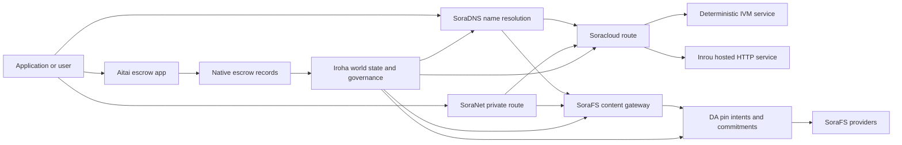

# SORA Nexus ဝန်ဆောင်မှုများ {#sora-nexus-services}


SORA Nexus သည် Iroha 3 အနီးတွင် app ကို ဦးတည်သော ၀ န်ဆောင်မှု လေယာဉ်များကိုထည့်သွင်းသည်။ ဤဝန်ဆောင်မှုများသည် သီးခြားစာရင်းများမဟုတ်ပါ။ ၎င်းတို့သည် Iroha ကမ္ဘာ့နိုင်ငံတော်၊ Norito မော်နီဖစ်များ, အုပ်ချုပ်ရေးမှတ်တမ်းများနှင့် Torii လမ်းကြောင်းမိသားစုများမှချိတ်ဆက်ထားသည်။

အသုံးပြုနိုင်မှုသည် node build နှင့် network profile များအပေါ် မူတည်သည်။ ရည်မှန်းချက် node တွင်ထုတ်လုပ်သော app-API လမ်းကြောင်းများကိုရှာဖွေရန် [ `/openapi`](/my/reference/torii-endpoints.md#app-and-sora-route-families) ကိုအသုံးပြုပါ။ ပြည်သူ့ ဒေသဆိုင်ရာ SoraFS CID နှင့် နာမည်ကြီး လမ်းကြောင်းများကို ထုတ်ပေးထားသော စာရွက်စာတမ်းအပြင်ဘက်တွင် တပ်ဆင်ထားသည်၊ ထို့ကြောင့် ဖြန့်ချိမှုကို စစ်ဆေးရာတွင် ထိုလမ်းကြောင်းများကို တိုက်ရိုက်စစ်ဆေးပါ။

## အစိတ်အပိုင်း မြေပုံ {#component-map}

|အစိတ်အပိုင်း |ကဏ္ဍ |အဓိက မျက်နှာပြင်များ |
| ---------------------- | ------------------------------------------------------------------------------------------------------------------------------------------- | ---------------------------------------------------------------------------------------- |
|Soracloud |Application deployment, hosted services, private model/ runtime state နဲ့ service lifecycle control တွေကို သုံးနိုင်ဖို့ပါ။ |`/v1/soracloud/`, `/api/`, `iroha app soracloud ...`|
|အတွင်းပိုင်း|Soracloud တိုက်ရိုက် HTTP လေယာဉ်လိုအပ်တဲ့ ဝန်ဆောင်မှု အပြောင်းအလဲအတွက် HTTP လည်ပတ်ချိန်ကို တည်းခိုထားတယ်။ |Soracloud Runtime Configuration, host အရည်အသွေး ကြော်ငြာများ, replica runtime အခြေအနေ |
|SoraNet |ဘက်ထရီများအတွက် သီးသန့်လွတ်လပ်ခွင့်နှင့် သယ်ယူပို့ဆောင်ရေး overlay, relay traffic, VPN, Connect session များနှင့် streaming လမ်းကြောင်းများ။ |`/v1/connect/`, `/v1/vpn/`, SoraNet လမ်းကြောင်း metadata များ |
|ဒေတာရရှိနိုင်မှု (DA) |Nexus လမ်းကြောင်းများ၊ SoraFS ထုတ်ပြန်ချက်များနှင့် သက်သေပြမှု စီးဆင်းမှုများဖြင့် ရည်ညွှန်းထားသော အသုံးဝင်ဝန်ဆောင်မှုများအတွက် ရင်းနှီးမှု အထောက်အထားများ၊ ကတိပြုချက်များနှင့် ပိတ်ပင်ချက်အဆင့်များ။ |`/v1/da/`, `FindDaPinIntent`, `[sumeragi.da]`|
|SoraFS |ထုတ်ပြန်ချက်များ၊ CAR အသုံးဝင် ဝန်ဆောင်မှုများ၊ ပိတ်ထားသော အကြောင်းအရာများ၊ ဂိတ်ဂိတ်များနှင့် ပြန်လည်ရှာဖွေနိုင်မှု သက်သေပြမှု စီးဆင်းမှုများအတွက် Content-addressed storage fabric များ။ |`/v1/sorafs/`, `/sorafs/`, `FindSorafsProviderOwner`|
|SoraDNS |SORA hosted services နှင့် content များအတွက် deterministic naming and resolver-attestation layer များ။ |`/v1/soradns/`, `/soradns/`, Resolver directory events များ |
|Aitai |App-level fiat နှင့် asset settlement corridor ကို သီးခြားစာရင်းမဟုတ်ဘဲ native escrow မှတ်တမ်းများမှထောက်ပံ့ထားသည်။ |`OpenAssetEscrow`, `FindAssetEscrow*`, `EscrowEventFilter`, Kotodama `escrow_*` အဆောက်အအုံများ |



## သာမန်စီးဆင်းမှု {#common-flows}

### Hosted Split Application ကို အသုံးပြုခြင်း {#hosted-split-application}

ပုံမှန် Mixed-Plane App မှာ Pieces အားလုံးကို အတူတကွ သုံးပါတယ်။

1. Static frontend အရင်းအမြစ်များကို SoraFS မှတစ်ဆင့် ထုပ်ပိုး၍ ပိတ်ထားသည်။
2. ဥပမာ `<app>.sora` ကိုတော့ SoraDNS မှတဆင့် မှတ်ပုံတင်ထားပါတယ်။
3. Soracloud လမ်းကြောင်းများ `/api/v1/search` သို့မဟုတ် `/api/v1/stream` သို့ Inrou HTTP ဝန်ဆောင်မှုသို့။
4. Soracloud လမ်းကြောင်းများ `/api/auth` နှင့် `/api/v1/user` မှ deterministic IVM ကိုင်တွယ်သူများသို့။
5. ပုဂ္ဂိုလ်ရေးလုံခြုံမှု လိုအပ်တဲ့ ဖောက်သည်တွေဟာ SoraNet ပတ်လမ်းတစ်လျှောက်မှာ တူညီတဲ့ အကြောင်းအရာ (သို့) API လမ်းကြောင်းကို ရောက်ရှိနိုင်ကြပါတယ်။

|လမ်းကြောင်း|နောက်ခံ လေယာဉ် |ဘာကြောင့်လဲ|
| ----------------- | --------------------- | ------------------------------------------------- |
| `/`               |SoraFS တည်ငြိမ်မှု |ပြန်လည်ဖန်တီးနိုင်သော အကြောင်းအရာ root နှင့် gateway ကို cache လုပ်ခြင်း |
|`/assets/*` |SoraFS တည်ငြိမ်မှု |Content-addressed assets and manifest proofs  အကြောင်းအရာများနှင့်အဓိပ္ပာယ်ဖွင့်ထားသောလက်မှတ်များ|
|`/api/auth*` |Soracloud IVM |ပြန်လည်ကစားရန် လုံခြုံသော စာရင်းအင်းနှင့် ငွေကြေးစွန့်စားမှုအခြေအနေ |
|`/api/v1/user*` |Soracloud IVM |အုပ်ချုပ်မှုအတွက် ထိခိုက်လွယ်တဲ့ နိုင်ငံတော် အပြောင်းအလဲများ |
|`/api/v1/search*` |Soracloud Inrou |တိုက်ရိုက် HTTP ဝန်ဆောင်မှု, ကေရှ်, SSE, သို့မဟုတ် စုဆောင်းသူအခြေအနေ |

### အကြောင်းအရာ ထုတ်ဝေခြင်း {#content-publication}

SoraFS ထုတ်ဝေမှုမှာ နာမည်တစ်ခုက သူတို့ကို ညွှန်းမပေးခင် သက်တမ်းရှည် ရှေးဟောင်းပစ္စည်းတွေကို ထုတ်လုပ်တယ်။

1. အသုံးဝင်တဲ့ ဝန်ဆောင်မှု (သို့) Directory ကို တည်ဆောက်ပါ။
2. ဒါကို CAR စာရွက်စာတမ်းထဲထည့်ပြီး အစိတ်အပိုင်းအစီအစဉ်ကို လုပ်ပါ။
3. PIN မူဝါဒနဲ့ အုပ်ချုပ်မှု ဒေတာတွေနဲ့ Norito မန်နေဖစ်ကို တည်ဆောက်ပါ။
4. စာရွက်စာတမ်းကို Torii သို့ တင်ပြပါ။
5. DA ပိုက်ရည်ရွယ်ချက် (သို့) အရင်းအမြစ်ရရှိနိုင်မှု ကတိကို မှတ်တမ်းတင်ပါ
6. SoraDNS အမည်သို့မဟုတ် Soracloud တည်ငြိမ်သော ရှေ့ဆုံးလမ်းကြောင်းနှင့် လိပ်စာကို ချိတ်ဆက်ပါ။

### သီးသန့်ခေါ်ယူခြင်း (သို့) စီးဆင်းမှု လမ်းကြောင်း {#private-fetch-or-streaming-route}

SoraNet သည် SoraFS သို့မဟုတ် Soracloud ရှေ့မှာ ထိုင်နိုင်သည်-

1. ဖောက်သည်က နာမည် (သို့) မှတ်ပုံတင်ကို ဖြေရှင်းတယ်။
2. guard directory (သို့) route manifest မှာ entry နဲ့ exit relay တွေကို ရွေးချယ်ပါတယ်။
3. SoraNet ပတ်လမ်းကို ဖြတ်ပြီး ယာဉ်မောင်းတွေ ဖြည့်ပြီး ပို့ပေးတယ်။
4. SoraFS ဂိတ်တံခါး၊ Torii စီးကြောင်း သို့မဟုတ် Soracloud လမ်းကြောင်းသို့ ထွက်ပေါက်ဆက်သွယ်မှု ရောက်ရှိသည်။

## Aitai {#aitai}

Aitai သည် SORA app corridor ဖြစ်ပြီး ဝယ်ယူသူနှင့် ရောင်းသူသည် ဈေးကွက်ပုံစံပေးဆပ်မှုအတွက် ကွင်းဆက်အပြင်မှ ငွေပေးချေမှုကို ညှိနှိုင်းထားရာမှာ Iroha သည် ဈေးကွက် ပုံစံကို ထိန်းချုပ်နေသည်။ ချိတ်ဆက်ထားသော အရင်းအမြစ် ထိန်းသိမ်းမှုအတွက် စာချုပ်ပိုင် အာမခံစာရင်းအစား ဒေသခံ escrow instruction မိသားစုကို အသုံးပြုသင့်သည်။

Native escrow ကစာအုပ်မှာ ထိန်းသိမ်းထားတယ်။ ရောင်းသူက `OpenAssetEscrow` နဲ့ တင်ဒါဖွင့်တယ်၊ ဝယ်သူက လက်ခံပြီး `AcceptAssetEscrow` နဲ့ `MarkEscrowPaymentSent` တို့နဲ့ ချိတ်ဆက်မှုအပြင် ငွေပေးချေမှုကို အမှတ်တံဆိပ်ထိုးပါတယ်။ ရောင်းသူသည် `ReleaseAssetEscrow` ဖြင့်ထုတ်ပေးခြင်း သို့မဟုတ် ပေးချေမှုကို အမှတ်တံဆိပ်မထည့်မီ ဖျက်သိမ်းခြင်း။ ဝယ်သူနှင့်ရောင်းသူ သဘောမတူလျှင် နှစ်ဘက်စလုံးက ပဋိပက္ခဖွင့်နိုင်ပြီး `CanResolveEscrowDispute` နှင့်ဖြေရှင်းသူသည် ပိတ်ထားသောငွေကိုခွဲခြားနိုင်သည်။

သက်တမ်းတစ်လျှောက်လုံးအတွက် အထွေထွေလက်နက်ပိတ်ခြင်း၊ အမည်မသိအထောက်အထား၊ မေးမြန်းချက်များ၊ ဖြစ်ရပ်များနှင့် Rust နမူနာများကို [ Native Asset Escrow ](/my/blockchain/escrow.md) ကိုကြည့်ပါ။

|Aitai မျက်နှာပြင်|ဒါကို အသုံးပြုပါ။|
| ------------------------------------------------------------------------------------------------------------------------------------------------------------- | ----------------------------------------------------------------------------------------- |
|`OpenAssetEscrow`, `AcceptAssetEscrow`, `MarkEscrowPaymentSent`, `ReleaseAssetEscrow`, `CancelAssetEscrow` |ပွင့်လင်းမြင်သာသော ကိန်းဂဏန်း အရင်းအမြစ် ကမ်းလှမ်းချက်များ၊ XOR ဖြင့် သတ်မှတ်ထားသော စာရင်းပေးချေမှု စီးဆင်းမှုများပါ ၀ င်သည်။ |
|`OpenAnonymousAssetEscrow`, `AcceptAnonymousAssetEscrow`, `MarkAnonymousEscrowPaymentSent`, `ReleaseAnonymousAssetEscrow`, `CancelAnonymousAssetEscrow` |Shielded ကမ်းလှမ်းချက်တွေဟာ ငွေကြေးထောက်ပံ့မှုနဲ့ ပိတ်သိမ်းတဲ့ လှုပ်ရှားမှုတွေအတွက် သက်သေခံ အထောက်အထားကို သုံးပါတယ်။ |
|`OpenEscrowDispute`, `ResolveEscrowDispute`, `OpenAnonymousEscrowDispute`၊ `ResolveAnonymousEscrowDispute` |အငြင်းပွားမှုဖြေရှင်းရေးနဲ့ တရားရုံးပုံစံ ဆုံးဖြတ်ချက်ချခြင်း|
|`FindAssetEscrowById`, `FindAssetEscrowsBySeller`, `FindAssetEscrowsByBuyer`၊ `FindAssetEscrowsByStatus` |App Status စာမျက်နှာများ၊ ညှိနှိုင်းမှု အလုပ်များနှင့် ထောက်ပံ့ရေး ကိရိယာများ။ |
|`EscrowEventFilter` |ပွင့်လင်းမြင်သာတဲ့ escrow subscriptions တွေကို escrow id၊ ရောင်းသူ၊ ဝယ်သူ၊ အခြေအနေ (သို့) အဖြစ်အပျက် အမျိုးအစားဖြင့် တိုက်ရိုက်ပေးသွင်းပါ။ |
| Kotodama `escrow_open_offer`, `escrow_accept`, `escrow_mark_payment_sent`, `escrow_release`, `escrow_cancel`, `escrow_open_dispute`, `escrow_resolve_dispute` |Kotodama သဘောတူစာချုပ်ခေါ်ဆိုမှုများကို V1 ကော်ပိုရေးရှင်းက ထောက်ခံသည်။ |

အများပြည်သူအတွက် Taira သို့မဟုတ် Minamoto အသုံးပြုမှုအတွက်၊ အပြင်က ငွေပေးချေရေး ရထားနှင့် မည်သည့်ထောက်ပံ့မှု (သို့) တရားရုံး အလုပ်ဖြစ်စဉ်ကိုမဆို လျှောက်လွှာမူဝါဒအဖြစ် සලකාကြည့်ပါ။ Iroha သည် ထိန်းသိမ်းမှုအခြေအနေ၊ သက်တမ်း စက်ဝန်းဖြစ်ရပ်များ၊ အထောက်အထား ဟက်ရှ်များနှင့် နောက်ဆုံး အရင်းအမြစ် ရွေ့ရှားမှုကို မှတ်တမ်းတင်ထားသည်၊ ၎င်းသည် fiat ပေးဆပ်မှုကို ကိုယ်တိုင်မစစ်ဆေးပါ။

## Target Node ကို စစ်ဆေးပါ {#check-a-target-node}

ဤစာမျက်နှာမှ နမူနာများကို အသုံးပြုရန်မတိုင်မီ သင်ရည်မှန်းနေသည့် node တွင် route မိသားစုရှိသည်ကို စစ်ဆေးပါ-

```bash
export TORII_URL=https://taira.sora.org

curl -fsS "$TORII_URL/openapi.json" \
  | jq '.paths | keys[] | select(test("^/v1/(soracloud|sorafs|soradns|connect|vpn|da)/"))'

curl -fsS -H 'Accept: application/json' "$TORII_URL/status" | jq .
```

`/openapi.json` ကို Profile က ဖော်ပြမထားဘူးဆိုရင် `/openapi` ကို စမ်းကြည့်ပါ။ လမ်းကြောင်းရဲ့ တိကျတဲ့ရရှိနိုင်မှုက build features နဲ့ network ဖွဲ့စည်းမှုအပေါ် မူတည်ပါတယ်။ စာရွက်စာတမ်းမှာ အများပြည်သူ ဒေသခံ SoraFS CID နှင့် နာမည်ကြီးလမ်းကြောင်းတွေကို မဖော်ပြပါဘူး။ အောက်ပါအတိုင်း တိုက်ရိုက်အဆုံးသတ်မှတ်ချက်တွေကို စစ်ဆေးပါ။

### Taira Read-Only Smoke Checks များကို ဖတ်ရန် {#taira-read-only-smoke-checks}

အများပြည်သူ Taira အဆုံးမှတ်ကို ဖတ်-side စစ်ဆေးမှုအတွက် အသုံးဝင်ပေမဲ့ ခွင့်ပြုထားတဲ့ အကောင့်တစ်ခု မောင်းနှင်ပြီး အများပြည်သူ testnet အခြေအနေကို ပြောင်းလဲဖို့ ရည်ရွယ်တာမဟုတ်ရင် ဗီဇပြောင်းတဲ့ နမူနာတွေမှာတော့ မသုံးပါနဲ့။

```bash
export TORII_URL=https://taira.sora.org

curl -fsS -H 'Accept: application/json' "$TORII_URL/status" \
  | jq '{version: .build.version, peers, blocks, lanes: (.teu_lane_commit | length)}'

curl -fsS "$TORII_URL/v1/connect/status" | jq '{enabled, sessions_active}'

curl -fsS "$TORII_URL/v1/vpn/profile" \
  | jq '{available, relay_endpoint, supported_exit_classes}'

curl -fsS "$TORII_URL/v1/sorafs/storage/peers?limit=4" \
  | jq '{gateway_base_url, pin_torii_urls}'

curl -fsS -H 'Accept: application/json' "$TORII_URL/v1/soracloud/status" \
  | jq '.control_plane | {service_count, services: [.services[] | {service_name, current_version}]}'
```

Taira သည် OpenAPI လမ်းကြောင်းမြေပုံတွင် ဖော်ပြထားခြင်းမရှိသော တပ်ဆင်မှုဆိုင်ရာ ထိန်းချုပ်ရေးလေယာဉ်လမ်းကြောင်းများကို ဖေါ်ပြနိုင်သည်။ ၎င်းပါဝင်သည့် လမ်းကြောင်းများအတွက် `/openapi` ကို ထုတ်လုပ်ထားသော စာချုပ်အဖြစ် မှတ်ယူပြီး တပ်ဆင်မှုနှင့် ပတ်သက်၍ ပြည်သူ့နေရာရှိ SoraFS လမ်းကြောင်းများကို လက်ရှိအတိုင်း မှတ်တမ်းတင်ရန် မတိုင်မီ တိုက်ရိုက် အတည်ပြုပါ။

## Soracloud {#soracloud}

Soracloud သည် SORA application control plane ဖြစ်သည်။ ၎င်းသည် deployment bundles, service revisions, routing, rollout state, authoritative configuration entries, encrypted service secrets, model registry records, private inference sessions နှင့် runtime receipts များကို ခြေရာခံသည်။

Soracloud ဟာ စီမံခန့်ခွဲရေး လေယာဉ် နှစ်ခုကို သုံးပါတယ်။

|သတ်ဖြတ်ရေး လေယာဉ် |Runtime ကို |ဒါကို အသုံးပြုပါ။|
| ---------------------- | ------- | -------------------------------------------------------------------------------------------- |
|`DeterministicService` |`Ivm` |Author, vault state, certified readings, ordered mailbox handleers, governance-sensitive mutations |
|`HttpService` |`Inrou` |တိုက်ရိုက် HTTP APIs၊ စုဆောင်းရေး အလုပ်များ၊ ကေရှ်ထောက်ပံ့တဲ့ ဝန်ဆောင်မှုတွေ၊ SSE၊ ရှာဖွေရေးကိရိယာကူညီတဲ့ စီးဆင်းမှုတွေ |

ထိန်းချုပ်မှုအဆင့်က အာဏာရှိသည်။ ဖြန့်ချိခြင်း၊ အဆင့်မြှင့်တင်ခြင်း၊ ပြန်လည်ထည့်သွင်းခြင်း၊ ညှိနှိုင်းခြင်း၊ လျှို့ဝှက်မှု၊ ပုံစံနှင့်အခြေအနေ အမိန့်များကို Torii မှတစ်ဆင့်ပို့ပြီး ကတိပြုထားသော ကမ္ဘာ့အခြေအနေကိုဖတ်ပါ။ ၎င်းတို့သည် သီးခြား CLI - ဒေသခံ မှန်ပေါ် မမှီခိုပါ။ အများပြည်သူ လမ်းညွှန်ခြင်းသည် အမြင့်ဆုံး ကြိုတင်စာရင်းကို အခြေခံထားသောကြောင့် မှတ်ပုံတင်ထားသည့် အိမ်ရှင်တစ်ဦးသည် တည်းခိုထားသော HTTP လမ်းကြောင်းများနှင့် သတ်မှတ်ထားသော API လမ်းကြောင်းများကြားတွင် ယာဉ်ကြောကို ခွဲခြားနိုင်သည်။

### Split App ကို စက္ဖုန္းထဲထည့္ {#scaffold-a-split-app}

split-app template က static frontend plus hosted live API နဲ့ deterministic vault/API ဝန်ဆောင်မှု တစ်ခုကို ဖန်တီးပါတယ်။

```bash
iroha app soracloud app init \
  --template split-app \
  --app-name solswap_indexer \
  --app-version 0.1.0 \
  --public-host solswap-indexer.sora \
  --output-dir ./apps/solswap-indexer

iroha app soracloud app local-plan \
  --manifest ./apps/solswap-indexer/app_manifest.json

iroha app soracloud app doctor \
  --manifest ./apps/solswap-indexer/app_manifest.json
```

`local-plan` သည် လမ်းကြောင်းခွဲခြားချက်၊ ကလေးဝန်ဆောင်မှု မန်နေစတာများ၊ အလုပ်ခွင်စာသားလမ်းကြောင်းများနှင့် ကြိုတင်မျှော်လင့်ထားသော ရှေ့ဆုံး ထုတ်ဝေမှုပုံစံကို ပုံနှိပ်သည်။ `doctor` သည် သင် Torii ကို ပါဝင်ရန်မတိုင်မီ ဒေသတွင်းထုတ်လွှင့်ခြင်း စာချုပ်ကို validates။

### App State ကို စေလွှတ်ပြီး စစ်ဆေးခြင်း {#deploy-and-inspect-app-state}

```bash
export SORACLOUD_TORII_URL=https://<soracloud-enabled-torii>

iroha app soracloud app deploy \
  --manifest ./apps/solswap-indexer/app_manifest.json \
  --torii-url "$SORACLOUD_TORII_URL"

iroha app soracloud app status \
  --manifest ./apps/solswap-indexer/app_manifest.json \
  --torii-url "$SORACLOUD_TORII_URL"
```

အသုံးပြုပြီးသား ဝန်ဆောင်မှုအတွက် Service-scale command ကို သုံးပါ။

```bash
iroha app soracloud status \
  --service-name solswap_indexer_live \
  --torii-url "$SORACLOUD_TORII_URL"

iroha app soracloud rollback \
  --service-name solswap_indexer_live \
  --target-version 0.1.0 \
  --torii-url "$SORACLOUD_TORII_URL"
```

### လျှို့ဝှက်ပစ္စည်းများ {#config-and-secret-material}

Soracloud config နှင့် secret entries တို့သည် authoritative deployment state ၏ အစိတ်အပိုင်းဖြစ်သည်။ လိုအပ်သော config သို့မဟုတ် secret bindings များပျောက်ကွယ်နေသည့် (သို့) Active manifest များနှင့်မညီသည့်အခါ Deploy၊ Upgrade နှင့် Rollback ကိုပိတ်နိုင်ခြင်းမရှိပါ။

```bash
iroha app soracloud config-set \
  --service-name solswap_indexer_live \
  --config-name indexer/public_config \
  --value-file ./config/public-config.json \
  --torii-url "$SORACLOUD_TORII_URL"

iroha app soracloud secret-set \
  --service-name solswap_indexer_live \
  --secret-name indexer/api_key \
  --secret-file ./secrets/api-key.envelope.json \
  --torii-url "$SORACLOUD_TORII_URL"
```

CLI အကူအညီကို အသုံးပြုပြီး ကိုယ်ရေးကိုယ်တာအချက်အလက်အတွက် လိုအပ်တဲ့ တိကျတဲ့ မှတ်ပုံတင်အမှတ်တံဆိပ်များကို ရှာဖွေပါ။

```bash
iroha app soracloud config-set --help
iroha app soracloud secret-set --help
```

## Inrou {#inrou}

Inrou က ဧည့်သည်ပါ။ HTTP အသုံးပြုသော runtime Soracloud. အန် Iroha embedded node နှင့်အတူ node Soracloud လက်မှတ်ထိုးထားသော runtime စီမံကိန်းများ Soracloud ဒေသတွင်း ရုပ်လုံးဖေါ်ရေး အစီအစဉ်တစ်ခုထဲ ထည့်သွင်းထားပြီး သတ်မှတ်ထားတဲ့ hosted-service replicas တွေကို loopback services အဖြစ် စတင်ပေးပါတယ်။ နောက်ပြီး အတည်ပြုတဲ့ ပုံစံထဲ ပြန်ဝင်လာတဲ့ Runtime State ကို ပုံတူထုတ်ပြန်ပါတယ်။

Collector-heavy APIs, SSE streams, cache backed handleers သို့မဟုတ် browser assisted services တို့လို live HTTP မျက်နှာပြင်လိုအပ်တဲ့ workload များအတွက် Inrou ကိုအသုံးပြုပါ။

### ပြေးဆွဲရန် လိုအပ်ချက်များ {#runtime-requirements}

- Container manifest runtime က `Inrou` ဖြစ်ရပါမယ်။
- ဝန်ဆောင်မှုထုတ်ပြန်ချက် အကောင်အထည်ဖော်စက်က `HttpService` ဖြစ်ရပါမယ်။
- `HttpService + Inrou` အတိအကျ တစ်ခုကို လိုအပ်တယ်။ `PersistentRootLeaseVolume` တပ်ဆင်ထားသည် `/`.
- Inrou ဝန်ဆောင်မှုများကို ပြန်လည်ဖန်တီးခြင်းသည်လည်း ပြောင်းလဲနိုင်သော မျှဝေထားသော အခြေအနေကို ထိန်းသိမ်းထားပါက မျှဝေထားသည့် ဝန်ဆောင်မှု (သို့) လျှို့ဝှက်ငှားစာရင်း သိုလှောင်ရန် လိုအပ်သည်။
- Production hosting node တွေဟာ Inrou အရည်အသွေးကို ပရိုဂျက်အဖြစ်သာ လုပ်ကိုင်မယ့်အစား ကြော်ငြာပေးသင့်ပါတယ်။

### ထင်ရှားသော အပိုင်းအစ {#manifest-fragment}

အောက်ပါဥပမာက manifest နှစ်ခုရဲ့ ပုံစံကို ပြသပေးပါတယ်။ ဒါက အပိုင်းတစ်ခုဖြစ်ပြီး ဖြန့်ဖြူးမှုအပြည့်အဝမဟုတ်ဘူး။

```jsonc
// container_manifest.json
{
  "schema_version": 1,
  "runtime": { "runtime": "Inrou", "value": null },
  "bundle_path": "/bundles/solswap-indexer.inrou",
  "entrypoint": "/app/bin/launch-indexer.sh",
  "args": [],
  "env": {
    "RUST_LOG": "info",
  },
  "inrou": {
    "schema_version": 1,
    "guest_os": { "guest_os": "DebianSlim", "value": null },
    "guest_images": {
      "x86_64": {
        "kernel_image_path": "/inrou/x86_64/vmlinux",
        "rootfs_image_path": "/inrou/x86_64/rootfs.ext4",
        "initrd_image_path": null,
      },
      "aarch64": {
        "kernel_image_path": "/inrou/aarch64/vmlinux",
        "rootfs_image_path": "/inrou/aarch64/rootfs.ext4",
        "initrd_image_path": null,
      },
    },
  },
  "lifecycle": {
    "start_grace_secs": 60,
    "stop_grace_secs": 30,
    "healthcheck_path": "/api/indexer/v1/health",
  },
}
```

```jsonc
// service_manifest.json
{
  "schema_version": 1,
  "service_name": "solswap_indexer_live",
  "service_version": "0.1.0",
  "execution_plane": { "execution_plane": "HttpService", "value": null },
  "replicas": 2,
  "route": {
    "host": "solswap-indexer.sora",
    "path_prefix": "/api/v1/search",
    "service_port": 8080,
    "visibility": { "visibility": "Public", "value": null },
    "tls_mode": { "tls": "Required", "value": null },
  },
  "lease_volumes": [
    {
      "volume_name": "root_disk",
      "kind": {
        "lease_volume": "PersistentRootLeaseVolume",
        "value": null,
      },
      "storage_class": { "storage_class": "Warm", "value": null },
      "mount_path": "/",
      "max_total_bytes": 8589934592,
    },
    {
      "volume_name": "index_state",
      "kind": { "lease_volume": "ServiceLeaseVolume", "value": null },
      "storage_class": { "storage_class": "Warm", "value": null },
      "mount_path": "/var/lib/solswap-indexer",
      "max_total_bytes": 1073741824,
    },
  ],
}
```

ပြေးဆွဲချိန်တွင်၊ တပ်ဆင်ထားသောငှားရမ်းမှု ပမာဏတိုင်းကို ပမာဏအမည်မှ ရယူထားသည့် ပတ်ဝန်းကျင် ကိန်းရှင်များဖြင့် ဖေါ်ထုတ်ပေးသည်။

```text
SORACLOUD_LEASE_VOLUME_ROOT_DISK_DIR
SORACLOUD_LEASE_VOLUME_ROOT_DISK_MOUNT_PATH
SORACLOUD_LEASE_VOLUME_INDEX_STATE_DIR
SORACLOUD_LEASE_VOLUME_INDEX_STATE_MOUNT_PATH
```

## SoraNet {#soranet}

SoraNet ဆိုသည်မှာ ပိုင်ဆိုင်မှုနှင့် သယ်ယူပို့ဆောင်ရေး အပေါ်လွှာခြင်းဖြစ်သည်။ ၎င်းသည် ရည်မှန်းချက်ဂိတ်သို့မဟုတ် ဝန်ဆောင်မှုသို့ တိုက်ရိုက်ဆက်သွယ်ရန် မလိုသော ယာဉ်ကြောအတွက် relay အခြေခံ လမ်းကြောင်းများကိုပေးသည်။ သယ်ယူပို့ဆောင်ရေး ဒီဇိုင်းမှာ ဝင်ရောက်မှု၊ အလယ်ပိုင်းနဲ့ ထွက်ပေါက် Relay Roles များ၊ QUIC ပို့ဆောင်မှုတွေ၊ Noise based hybrid handshake တွေ၊ အရည်အသွေး ညှိနှိုင်းမှု၊ Relay Directory metadata တွေနဲ့ Fixed-size padded cells တွေကို သုံးပါတယ်။

Nexus deployments များတွင်, SoraNet သည် content fetches, gateway traffic, VPN သို့မဟုတ် Connect sessions နှင့် Norito streaming routes များကိုဆောင်ရွက်နိုင်သည်။ directory entries များသည် `norito-stream` ကိုထောက်ပံ့သော relays များကိုမှတ်သားနိုင်ပြီး, ဤသည်မှာဖောက်သည်များအတွက်သင့်တော်သောအရာလမ်းကြောင်းများကိုရွေးချယ်ရန်ခွင့်ပြုသည် Torii RPC သို့မဟုတ် streaming traffic.

### Streaming Configuration ကို {#streaming-configuration}

Nexus ပရိုဖိုင်သည် SoraNet ကို streaming လမ်းကြောင်းများအတွက် ထောက်ပံ့နိုင်စေသည်။

```toml
[streaming]
feature_bits = 0b11

[streaming.soranet]
enabled = true
exit_multiaddr = "/dns/torii/udp/9443/quic"
padding_budget_ms = 25
access_kind = "authenticated"
provision_spool_dir = "./storage/streaming/soranet_routes"
provision_spool_max_bytes = 0
provision_window_segments = 4
provision_queue_capacity = 256
```

`access_kind = "read-only"` ကို ကြည့်ရှုသူရဲ့ စစ်ဆေးမှုကို မလိုအပ်တဲ့ အကြောင်းအရာလမ်းကြောင်းများအတွက် အသုံးပြုပါ။ `authenticated` ကို သုံးပါ exit relay က Torii သို့ (သို့) hosted service တစ်ခုကို ချိတ်ဆက်ခြင်းမပြုမီမှာ ထီလက်စ် သို့မဟုတ် ကြည့်ရှုသူ၏ ကိုယ်ပိုင်လက္ခဏာကို အကောင်အထည်ဖော်ရန် လိုအပ်တဲ့အခါမှာ။

### SoraNet-သိရှိထားသည် SoraFS ခေါ်ယူ {#soranet-aware-sorafs-fetch}

နိုင်ငံတကာ SoraFS ရယူခြင်း CLI local proxy manifest နဲ့ spool ကို ထုတ်လွှင့်နိုင်ပါတယ် SoraNet browser extension တွေအတွက် route metadata သို့မဟုတ် SDK Adapter တွေ၊ orchestrator JSON သတ်မှတ်ပေးရပါမယ်။ `local_proxy` နှင့်အတူ `"emit_browser_manifest": true`, နောက်ပြီး CLI ဆောက်လုပ်ရမယ်။ `local-quic-proxy` ထောက်ပံ့မှု။ Taira, အများပြည်သူ testnet root မှာ ခွင့်ပြုထားတဲ့ ပေးသွင်းသူ စာရင်းကို စစ်ဆေးပါ။ ထို့နောက် ထိုပေးသွင်းသူအတွက် ထုတ်ဝေသော ကာကွယ်ထားသည့် ပေးသွင်းသူ tuple ကိုဖြည့်ပါ။

```bash
export TAIRA_ROOT=https://taira.sora.org
curl -fsS "$TAIRA_ROOT/v1/sorafs/providers?limit=20" | jq '.providers'

: "${TAIRA_SORAFS_PROVIDER_ID:?set the admitted provider ID from Taira discovery}"
: "${TAIRA_SORAFS_GATEWAY_KEY:?set the provider gateway key}"
: "${TAIRA_SORAFS_PROVIDER_URL:?set the advertised provider base URL}"
: "${TAIRA_SORAFS_STREAM_TOKEN_FILE:?set the issued stream-token file}"

cargo run -p sorafs_orchestrator --features=local-quic-proxy --bin=sorafs_cli -- \
  fetch \
  --plan=artifacts/payload_plan.json \
  --manifest-id=<manifest-digest-hex> \
  --orchestrator-config=artifacts/orchestrator.json \
  --provider=name=taira,provider-id="$TAIRA_SORAFS_PROVIDER_ID",gateway-key="$TAIRA_SORAFS_GATEWAY_KEY",base-url="$TAIRA_SORAFS_PROVIDER_URL",stream-token="$(cat "$TAIRA_SORAFS_STREAM_TOKEN_FILE")" \
  --output=artifacts/payload.bin \
  --json-out=artifacts/fetch_summary.json \
  --local-proxy-manifest-out=artifacts/proxy_manifest.json \
  --local-proxy-mode=bridge \
  --local-proxy-norito-spool=storage/streaming/soranet_routes \
  --local-proxy-kaigi-spool=storage/streaming/soranet_routes \
  --local-proxy-kaigi-policy=authenticated \
  --max-peers=2 \
  --retry-budget=4
```

အကျဉ်းချုပ်မှတ်တမ်းပေးသူရဲ့ အစီရင်ခံစာတွေ၊ လက်ခံရရှိချက် အပိုင်းအစတွေ၊ ဒေသဆိုင်ရာ ကိုယ်စားလှယ် မီတာဒေတာတွေနဲ့ ကောက်ယူဖို့ အသုံးပြုတဲ့ ထိရောက်တဲ့ လမ်းကြောင်း ညွှန်ကြားချက်တွေပါ။

### Relay Incentive စစ်ဆေးသူစာရင်း {#relay-incentive-verifier-roster}

Relay incentive intake ကတော့ လိုအပ်တဲ့ စစ်ဆေးမှုတိုင်း အောင်မြင်မှလွဲရင် သက်သေတွေကို ပယ်ချပါတယ်။ `incentives.enable` ဒါက အမှန်ပါ။ `incentives.trusted_verifier_ids` အနည်းဆုံး တစ်ပုဒ်တည်းသော သာသနာဝင်စာရင်းကို ထည့်သွင်းထားရမည်။ ID. ဒီစာရင်းဟာ လှုံ့ဆော်ချက်တွေကို ပိတ်ထားတဲ့အချိန်တောင်မှ စာရင်းဝင်မှု ၆၄ ခုထက် မမြင့်နိုင်ပါ။ Runtime က ၎င်းကို deterministic ordered set အဖြစ် သိမ်းထားပြီး Relay startup အတွင်းမှာ invalid roster geometry ကို ပယ်ချပါတယ်။

`RelayBandwidthProofV1` တစ်ခုစီကို Fixed Frame/ Allocation Budget အောက်မှာ decod လုပ်ပြီး အပြည့်အဝ frame ကို စားသုံးရပါမယ်။ proof ရဲ့ verifier account က configured roster ထဲမှာ ရှိနေဖို့လိုပြီး `RelayBandwidthProofV1::verify_signature()` ဟာ relay lock မလုပ်ခင် (သို့) performance accumulator မပြောင်းခင်အောင်မြင်ရမှာပါ။ Relay က မယုံကြည်တဲ့ လက်မှတ်ရေးထိုးသူ (သို့) လက်မှတ်လက်မှတ်အမှား / အတုလုပ်ထားတဲ့ သက်သေကို လျစ်လျူရှုတယ်။ ဒီလို အထောက်အထားက တိုင်းတာမှုတစ်ခုမှ မဖြည့်ပေးဘူး၊ လှုံ့ဆော်မှု snapshot တစ်ခုလည်း ထုတ်မပေးနိုင်ဘူး။

## ဒေတာရရှိနိုင်မှု (DA) {#data-availability-da}

DA သည် world state တွင် တိုက်ရိုက်ထည့်ရန်အတွက် အလွန်ကြီးမားသော၊ ပုဂ္ဂလိကရေးရာနှင့် စပ်လျဉ်းသည့် (သို့) ဝန်ဆောင်မှုဆိုင်ရာ သီးသန့်ပစ္စည်းများအတွက် အသုံးပြုနိုင်စွမ်းအထောက်အထား အလွှာဖြစ်သည်။ ၎င်းသည် deterministic commitments နှင့် retrieval obligations များကို မှတ်တမ်းတင်ထားသည်၊ ထို့ကြောင့် validators များ၊ gateways များနှင့် ဖောက်သည်များက မည်သည့် byte များကို ကတိပေးခဲ့ကြောင်း၊ မည်သည့်မူဝါဒကို သက်ရောက်ပြီး မည်သည့်သက်သေများကို စောင့်ကြည့်ထားကြောင်း သဘောတူနိုင်သည်။

DA သည် Kura သို့မဟုတ် SoraFS ကိုအစားထိုးခြင်းမရှိပါ။

- Kura က နောက်ဆုံးသတ်မှတ်ထားတဲ့ block stream နဲ့ consensus recovery data တွေကို သိမ်းထားတယ်။
- SoraFS သည် content-addressed byte များ၊ CAR အသုံးအဆောင်များနှင့် manifest များကို သိမ်းဆည်းပေးခြင်း။
- DA ကတိတွေ မှတ်တမ်းတင်တယ်၊ သက်သေပြ မူဝါဒတွေ၊ သက်သေပြ ပွင့်လင်းမှုတွေနဲ့ ဒီဘိုက်တာတွေကို အစီအစဉ်ချဖို့၊ စစ်ဆေးဖို့နဲ့ စာရင်းအင်းအခြေအနေကို ပြန်လည်ဆက်သွယ်ဖို့ ခွင့်ပြုတဲ့ pin intent တွေပါ။

DA ကိုအသုံးပြုပါ Application တစ်ခု (သို့) Nexus lane တစ်ခုအတွက် Ledger-visible ကတိတစ်ခုလိုအပ်တဲ့အခါ ချိတ်ဆက်မှုအပြင်က ဒေတာကို ပြန်လည်ရှာဖွေနိုင်အောင် ဆက်လုပ်ပါ။ ပုံမှန်ဥပမာများမှာ settlement flows အတွက် lane payload commitments များ၊ ထုတ်ဝေထားသော content အတွက် SoraFS pin intentions တို့ပါဝင်ပါတယ်။ နောက်ပိုင်း စစ်ဆေးမှုအတွက် သိမ်းထားရမယ့် အထောက်အထားအစုတွေနဲ့ အများပြည်သူသိတဲ့ အခြေအနေက အပြည့်အဝ အသုံးဝင်တဲ့ ဝန်ဆောင်မှုအစား သွင်းချက်ဖြစ်သင့်တဲ့ လျှောက်လွှာ လက်ရာတွေပေါ့။

### သက်တမ်း စက်ဝန်း {#lifecycle}

|အဆင့် |မှတ်တမ်းတင်ထားတာက ဘာလဲ။|
| ---------- | ----------------------------------------------------------------------------------------------------------------------------------------------------- |
|ရည်ရွယ်ချက်|Ticket, manifest reference, alias, lane/epoch/sequence reference, retention policy, or replication target တွေကို မှတ်တမ်းတင်ပါ။ |
|ကတိပေးခြင်း|Manifesto, lane payload, proof bundle (သို့) content root တွေကို ledger-visible record နဲ့ ချိတ်ဆက်တဲ့ material ကို digest လုပ်ပါ။ |
|အထောက်အထားများ|Availability votes, proof openings, provider attestations, or other profile-specific evidence accepted by the target network တို့ကို ပံ့ပိုးပေးသူများထံမှ လက်ခံထားရသည့် သက်သေခံချက်များ။|
|မေးခွန်း|`FindDaPinIntentByTicket`, `FindDaPinIntentByManifest`, `FindDaPinIntentByAlias` သို့မဟုတ် `FindDaPinIntentByLaneEpochSequence` မှတစ်ဆင့် Pin-intent ရှာဖွေမှုများ။ |

ပုံမှန် DA ထောက်ပံ့တဲ့ ထုတ်ဝေမှု စီးဆင်းမှုဟာ-

1. WSV အပြင်မှာရှိတဲ့ အသုံးဝင် ဝန်ဆောင်မှုကို တည်ဆောက် (သို့) လက်ခံပါ၊ ဥပမာ SoraFS CAR ဖိုင်တစ်ခု (သို့) Nexus လမ်းကြောင်း အသုံးဝင် ဝန်ထမ်းပါ။
2. Norito manifest သို့မဟုတ် route-specific commitment record တွင် အသုံးဝင်သော ဝန်ဆောင်မှုများကို ဖော်ပြပါ။
3. `/v1/da/*` မှတစ်ဆင့် လမ်းကြောင်းအမျိုးအစားဖွင့်ထားသည့်အခါ သို့မဟုတ် ကွန်ရက်၏ လက်မှတ်ထိုးသော ငွေချေးမှုလမ်းကြောင်းမှတဆင့် manifest၊ pin intent (သို့) commitment ကိုတင်ပါ။
4. validator သို့မဟုတ် availability provider တွေကို Active Proof Policy က တောင်းဆိုတဲ့ အထောက်အထားတွေကို စုစည်းခွင့်ပြုပါ။
5. အမည်မဖော်လိုခင်၊ ငွေပေးချေမှု အထောက်အထား (သို့) အသုံးဝင်ဝန်ဆောင်မှုအပေါ် မူတည်တဲ့ ဂိတ်ဂိတ်လမ်းကြောင်းကို မဖြန့်မီမှာ ရလဒ် pin ရည်ရွယ်ချက် (သို့) ကတိပြုမှုကို မေးမြန်းပါ။

### အယ်လ်ဂိုရစ်သမ်ပုံစံ {#algorithmic-model}

DA ဟာ အသုံးဝင်တဲ့ ဝန်ထုပ်ကို လက်မှတ်ထိုးထားတဲ့၊ ပြန်လည်ကစားကာကွယ်ထားပြီး ဘလော့ကဒ်အညွှန်းထားတဲ့ ကတိတစ်ခုအဖြစ် ပြောင်းလဲပါတယ်။ အရေးကြီးတဲ့ အယ်လ်ဂိုရစ်သမ်တွေဟာ သတ်မှတ်ချက်ဖြစ်တာကြောင့် validators တွေနဲ့ gateways တွေဟာ တူညီတဲ့ byte တွေကနေတူညီတဲ့ digests ကိုပြန်တွက်နိုင်တာပါ။

1. Torii ကမ်းလှမ်းထားသော အသုံးဝင် ဝန်ဆောင်မှုကို Canonical လုပ်ပါ။ `(lane_id, epoch, sequence)`, အသုံးဝင်ဝန်ဆောင်မှု ဘိုက်များ၊ ဖိနှိပ်ခြင်း မီတာဒေတာများ၊ အပိုင်းအရွယ်အစား၊ ဖျက်ပစ်ရေး ပရိုဖိုင်နှင့်အတူ ၀ ယ်ယူမှုတောင်းဆိုချက်ကို လက်ခံသည်။ gzip, deflate (သို့) Zstandard သုံးစွဲမှုများကို တောင်းဆိုပါက node က decompress လုပ်ပြီး canonical byte length သည် `total_size` ဖြစ်သည်ကို စစ်ဆေးသည်။
2. Nexus လမ်းကြောင်းစာရင်းမှာ ရှိဖို့လိုတယ်။ `chunk_size` ဟာ သုညမဟုတ်တဲ့ စွမ်းအား ၂, အနည်းဆုံး ၂ ဘိုက်တာ ဖြစ်ဖို့လိုပါတယ်။ ပြင်ဆင်ထားသော အမြင့်ဆုံးထက်မကြီးပါ။ ဖျက်ပစ်ရေးပရိုဖိုင်မှာ ဒေတာခြစ်များနှင့် အနည်းဆုံး parity ခြစ်နှစ်ခုပါဝင်ရမည်။ လိုင်းစာရင်းတွင် သက်သေခံစနစ် `merkle_sha256` သို့မဟုတ် `kzg_bls12_381` ကိုရွေးချယ်သည်။
3. Network Policy ကို Apply လုပ်ပါ။ node က blob class အတွက် configured replication နဲ့ retention baseline ကို နှိုးဆွပေးတယ်။ အများပြည်သူ metadata တွေဟာ plaintext ဖြစ်နေရပါမယ်၊ အုပ်ချုပ်မှုသာ ရှိတဲ့ metadata များကို manifest ထဲမှာ ရေးမသွင်းခင် node ရဲ့ configured governance metadata key နဲ့ encrypt လုပ်ထားတာပါ။
4. `chunk_size` မှထုတ်ယူသော fixed-sized profile တစ်ခုနှင့်အတူ canonical payload ကို chunk လုပ်ထားသည်။ Torii သည် payload digest၊ proof of retrievability tree root နှင့် per-chunk commits တို့ကို တွက်ချက်သည်။ ဒေတာ chunks များသည် ၎င်းတို့၏ byte များအပေါ်မှာ BLAKE3 commits ကို သယ်ဆောင်သည်။
5. ဖျက်ပစ်ရန် ကတိပေးချက်များ ထည့်သွင်းပါ။ `data_shards`. နောက်ဆုံး stripe ထဲက ပျောက်နေတဲ့ ဆဲလ်တွေဟာ parity တွက်ချက်ဖို့ သုညကို padded လုပ်ထားတယ်။ RS(၁၆) parity က row/global parity shards ကို ဖန်တီးတယ်။ `row_parity_stripes` column-style stripe parity ကို matrix တစ်ခုလုံးမှာထည့်ပါ။ parity shard commits တွေက BLAKE3 သေးငယ်တဲ့ အန်ဒီယန်းရဲ့ အရည်အသွေး `u16` သင်္ကေတတွေပါ။
6. `DaManifestV1` သည်လမ်းကြောင်း၊ ခေတ်ကာလ၊ ဘလော့ဘ်အတန်းအစား၊ ကော်ဒက်၊ အသုံးဝင်ဝန်ဆောင်မှု သွင်းချက်၊ အပိုင်းအမြစ်၊ အပိုင်းအရွယ်အစား၊ ဖျက်ပစ်ရေး ပရိုဖိုင်၊ ထိန်းသိမ်းရေး မူဝါဒ၊ ငှားရမ်းငွေပေးချေမှု၊ အစိတ်အပိုင်းဆိုင်ရာ တာဝန်ယူမှုများ၊ ရွေးချယ်စရာ IPA တာဝန်ယူမှု၊ မီတာဒေတာများနှင့် ထုတ်ဝေချိန်ကို မှတ်တမ်းတင်သည်။ Storage ticket က deterministic ဖြစ်ပါတယ် node ကပထမဦးဆုံး empty ticket နဲ့ manifest template ကို hash လုပ်ပြီး နောက်တော့ fingerprint ကို final `storage_ticket` အဖြစ် ပြန်ရေးပေးတယ်
7. Replay ပဋိပက္ခကိုငြင်းပယ်ပါ။ replay key က `(lane_id, epoch, sequence, manifest_fingerprint)` ဖြစ်သည်။ လက်ဗွေရာတစ်ခုတည်းရှိ duplicate သည် idempotent ဖြစ်သည်။ သက်တမ်းမပြည့်မီသော အစဉ်တစ်ခုသို့မဟုတ် အခြားလက်ဗွေရာ တစ်ခုနှင့်အတူတူသော အစဉ်တစ်ခုကိုငြင်းဆန်သည်။
8. လက်မှတ်ရေးထိုးထားတဲ့ အနုပညာပစ္စည်းတွေကို ထုတ်ပေးပါ။ Torii ဟာ PDP ကတိစာချုပ်ကို တွက်ချက်ပြီး `DaIngestReceipt` ကို လက်မှတ်ထိုးတယ်၊ `DaCommitmentRecord` ကို ဆောက်လုပ်ကာ manifesto အတွက် spool artefacts တွေ ရေးသားတယ်။ PDP ကတိပေးချက်၊ ကတိပြုချက် မှတ်တမ်း၊ ကတိပေးမှု အစီအစဉ်၊ ပင်းရည်ရွယ်ချက်၊ လက်ခံစာရွက်နဲ့ လက်ခံစာရင်းမှတ်တမ်း။ လက်ခံစာချွန်သည် `(lane_id, epoch)` ကို တစ်ကြိမ်လျှင် တချိန်တည်းတိုးတက်နေသည်။

ကတိပြုချက် မှတ်တမ်းတွေက ဘလော့ကမ်းတွေ သယ်ဆောင်တဲ့ အရာတွေပါ။ မှတ်တမ်းတစ်ခုက ချည်နှောင်တယ်။

- လမ်းကြောင်း၊ ခေတ်ကာလနဲ့ အစဉ်
- caller blob ID နဲ့ canonical manifest hash
- လမ်းကြောင်းအတားအဆီး အစီအစဉ်
- အစိတ်အပိုင်း အမြစ်
- KZG လမ်းကြောင်းအတွက် ရွေးချယ်စရာ KZG ကတိပေးချက်။
- PDP/အထောက်အထား သန္ဓေသား
- ထိန်းသိမ်းမှုတန်းအစားနဲ့ သိုလှောင်ရေးလက်မှတ်
- Torii DA မှတ်ပုံတင်လက်မှတ်

Block တစ်ခုမှာ DA မှတ်တမ်းတွေ ထည့်သွင်းမထားခင်၊ block assembly path က bundle ကို validates:

- `(lane_id, epoch, sequence)` ဟာ အိတ်အတွင်းမှာ ထူးခြားဖို့လိုတယ်။
- ထင်ရှားတဲ့ hash တွေဟာ အစုအတွင်းမှာ သုညမဟုတ်ဘဲ တစ်ကိုယ်ရေဖြစ်ဖို့လိုပါတယ်။
- ချုပ်ကိုင်မှု သက်သေပြချက် အစီအစဉ်ဟာ သတ်မှတ်ထားတဲ့ လမ်းကြောင်း မူဝါဒနဲ့ ကိုက်ညီဖို့လိုပါတယ်။
- KZG ကတိပေးချက်များကို Merkle လမ်းကြောင်းများက ပယ်ချသည်၊ KZG လမ်းကြောင်းများသည် သုညမဟုတ်သော KZG ကတိပေးချက်ကို တောင်းဆိုသည်။
- Pin intent တွေကို lane, manifest hash, storage ticket, owner account နဲ့ alias-collision စည်းမျဉ်းတွေအလိုက် canonicalized, sorted, and filtered လုပ်တယ်။

Block header တွင် DA proof policy များ၊ commitments များနှင့် pin intent များအတွက် hash များကို သိမ်းဆည်းထားသည်။ membership proof များအတွက် engagement bundle သည် Merkle root ကိုလည်း ဖွင့်ပြပေးသည်။ Norito-encoded `DaCommitmentRecord` တန်ဖိုးများ၏ hash များဖြစ်သည်။ မိဘ node များသည် ဘယ်နှင့် ညာကလေးများ၏ concatenation ကို hash လုပ်ကြသည်။ ထူးဆန်းသောစာရွက်ကို နောက်လွှာသို့ပြောင်းလဲခြင်းမရှိဘဲ တိုးမြှင့်ပေးသည်။

### အထောက်အထား စစ်ဆေးခြင်း {#proof-verification}

`/v1/da/commitments/prove` သည် block တစ်ခုတွင် commitment တစ်ခုအတွက် သက်သေပြနိုင်သည်။ သက်သေပြချက်မှာ engagement, block height, bundle ထဲက index, bundle hash, bundle length, Merkle root နှင့် sibling path ပါရှိသည်။ စစ်ဆေးမှုစစ်ဆေးခြင်း:

1. proof bundle hash က block header ရဲ့ DA commitment hash နဲ့ ကိုက်ညီပါတယ်။
2. proof block height က referenced block header နဲ့ ကိုက်ညီပါတယ်။
3. အညွှန်းကိန်းမှာ ကန့်သတ်ချက်ရှိပြီး ကတိကဝတ်ဟာ အဲဒီအညွှန်းကိန်းရဲ့ ကန့်သတ်စာရင်းနဲ့ တူပါတယ်။
4. Lane proof မူဝါဒက ကတိပေးချက်ကို လက်ခံပါတယ်။
5. ရည်စူးမှု အရွက်ကနေ ညီအစ်ကိုချင်း လမ်းကြောင်းကို ခေါက်လိုက်ရင် ပေးထားတဲ့ အမြစ်ကို ပြန်လည်တည်ဆောက်တယ်။
6. ပြန်လည်တည်ဆောက်ထားတဲ့ အမြစ်က အစုအမြစ်နဲ့ညီတယ်။

ဒါကတော့ သတ်မှတ်ထားတဲ့ ဘလော့က အသုံးဝင်တဲ့ ဝန်ဆောင်မှုတစ်ခုမှာ သီးသန့်ရရှိနိုင်မှု ကတိပေးချက် ထည့်သွင်းထားတာကို သက်သေပြနေပေမဲ့ လက်ရှိမှာ ပုံတူတိုင်းဟာ အွန်လိုင်းမှာ ရှိတယ်ဆိုတာကို သက်သေမပြပါဘူး။ Live retrievability ကို SoraFS ဝန်ဆောင်မှုပေးသူများထံမှ ယူယူခြင်း၊ PDP/PoTR စစ်ဆေးမှုများ သို့မဟုတ် ပရိုဖိုင်းအတွက် သီးသန့်ရရှိနိုင်မှု အထောက်အထားများဖြင့် သီးခြားစစ်ဆေးသည်။

### သဘောတူညီချက် တုံ့ပြန်ဆက်သွယ်မှု {#consensus-interaction}

DA ကို ယုံကြည်စိတ်ချရတဲ့ ထုတ်လွှင့်မှု (RBC) မှတစ်ဆင့် Sumeragi သို့ ချိတ်ဆက်ထားသော်လည်း ဒုတိယအဆုံးသတ် ပရိုတိုကောတစ်ခုမဟုတ်ပါ။ RBC က အဆိုပြုချက်များ၏ အသုံးဝင်ဝန်ဆောင်မှုကို ဖြန့်ဝေပြီး ပြန်လည်ရရှိစေသည်။ အဆိုပြုသူက `(height, view, payload_hash)` အတွက် အစည်းအဝေးကို ကြေညာတယ်၊ အချိုးအစားပြောင်းတဲ့ အပိုင်းတွေ၊ `READY`/`DELIVER` အချက်ပြမှုတွေဟာ လုံလောက်တဲ့ validators တွေဟာ တူညီတဲ့ အသုံးဝင် ဝန်ဆောင်မှုကို စောင့်ကြည့်တာလားလို့ ခြေရာခံတယ်။

Iroha 3 တွင် peer သည် pending block payload ကို အောက်ပါအတိုင်းဖြစ်ပါကရရှိနိုင်သည်ဟုယူဆသည်။

- ဒေသတွင်း pending block က expected payload hash ကို hash လုပ်ပေးတယ်။ ဒါမှမဟုတ်
- RBC က ဘလော့က ဟက်ရှ်၊ အမြင့်၊ ရှုထောင့်နဲ့ အသုံးဝင် ဝန်ဆောင်မှု ဟတ်ရှ်နဲ့ ကိုက်ညီတဲ့ အသုံးဝင်ဝန်ပိုးတစ်ခုကို ပြန်လည်ရရှိခဲ့တယ်။

အခြေအနေတစ်ခုမှ မတည်ငြိမ်ပါက peer record `missing_local_data` သည် RBC သို့မဟုတ် block sync မှတစ်ဆင့် အသုံးဝင်ဝန်ဆောင်မှုကိုပြန်လည်ရှာဖွေရန် ဆက်လက်ကြိုးပမ်းပြီး DA gate ကို status နှင့် telemetry တွင် အစီရင်ခံပေးသည်။ လက်ရှိ အကောင်အထည်ဖော်မှုမှာ DA အချက်ပြချက်တွေဟာ အဆုံးသတ်မှုအတွက် အကြံပြုချက်ပါ။ ဘလော့က ကော်မတီသက်သေခံစာနဲ့ ကိုက်ညီတဲ့ ဒေသတွင်း အသုံးဝင်ဝန်ပိုးကနေပြီး အဆုံးသတ်နေတုန်းပဲ၊ သီးခြား DA ကော်မိတ်သက်သေခံ စာရင်းကနေမဟုတ်ပါဘူး။

DA အချိန်ဆွဲခြင်းသည် ပြန်လည်ထူထောင်ရေး ပြတင်းပေါက်များကို ကျယ်ပြန့်စေသည်။ ထိရောက်သော DA ကော်မရွ်အချိန်ဆွဲခြင်းကို သတ်မှတ်ထားသော ဘလော့ကဒ်နှင့် commit timings မှထုတ်ယူပြီး `sumeragi.advanced.da.quorum_timeout_multiplier` ဖြင့် မြှောက်ပေးပါသည်။ အသုံးပြုနိုင်မှု အချိန်ဆွဲခြင်းမှာ `max(quorum_timeout, availability_timeout_floor_ms) * availability_timeout_multiplier` ဖြစ်သည်။ အဲဒီရရှိနိုင်မှု အချိန်ကာလ ကုန်ဆုံးမီမှာ node က အသုံးဝင် ဝန်ဆောင်မှု ပြန်လည်ထူထောင်ရေးကို ထောက်ခံပြီး ကြိုတင်ပြင်ဆင်ခြင်းကို ရှောင်ရှားပေးတယ်။ ပြီးရင် ပုံမှန်ပြန်လည်ထူထောင်ခြင်းနဲ့ အမြင်ပြောင်းတဲ့ လမ်းကြောင်းတွေကို ဆက်လုပ်နိုင်ပါတယ်။

### လုပ်ငန်းရှင် မှတ်စုများ {#operator-notes}

Iroha 3 သဘောတူညီချက်များတွင် ပါဝင်သည် RBC- ထောက်ပံ့တဲ့ အသုံးဝင် ဝန်ဆောင်မှု ပျံ့နှံ့ရေး၊ လိပ်ပြာစောင့်ရှောက်မှု၊ DA ဘန်ဒယ်အတည်ပြုမှုနှင့် ပြန်လည်ထူထောင်ရေး တယ်လီမထရီ။ peer template က `[sumeragi.da]` ဘလော့တစ်ခုစီအတွက် ကတိပေးချက်များနှင့် အထောက်အထားဖွင့်ပွဲများအတွက် ကန့်သတ်ချက်များ၊ ဒါ့အပြင် `[sumeragi.advanced.da]` Quorum နှင့် Availability အပြုအမူအတွက် Timeout မြှောက်ကိန်းများ။ ဤ settings များကို Network တစ်ခုအတွင်း validators များတွင်ညီညွတ်စွာထားပါ။ သရုပ်ဖော်ချက်။

လမ်းကြောင်းရှာဖွေရေးအတွက် node ရဲ့ OpenAPI စာရွက်စာတမ်းနဲ့စပါ။

```bash
curl -fsS "$TORII_URL/openapi.json" \
  | jq '.paths | keys[] | select(startswith("/v1/da/"))'
```

လက်ရှိ DA မေးမြန်းချက်အမည်များအတွက် [ မေးမြန်းမှု ရည်ညွှန်းချက်](/my/reference/queries.md#nexus-data-availability-and-packages) ကိုအသုံးပြုပြီး build ကဖွင့်ထားသော ဒေသခံ `[sumeragi.da]` ခလုတ်များအတွက် [ peer configuration template ](/my/reference/peer-config/) ကိုသုံးပါ။

## SoraFS {#sorafs}

SoraFS သည် decentralized content-addressed storage fabric ဖြစ်သည်။ ၎င်းသည် bytes ကို deterministic chunks, CAR archives များသို့ထည့်သွင်းထားပြီး content roots များကို ချိတ်ဆက်ပေးသော Norito manifest များ၊ Storage Provider တွေက Content ကို ထုတ်လွှင့်မပေးခင်မှာ Capacity နဲ့ Content Availability တွေကို ကြော်ငြာကြပြီး Gateways တွေကတော့ Manifesto တွေနဲ့ Commitments တွေကို စစ်ဆေးကြတယ်။

သာမန် SoraFS အသုံးပြုမှုများမှာ static application assets, documentation builds, zone bundles, model or artifact references, and governance evidence bundles တို့ပါဝင်သည်။ Iroha ဒေတာမော်ဒယ်သည် ၀ န်ဆောင်သူပိုင်ဆိုင်မှုကို ဖြေရှင်းရန် [`FindSorafsProviderOwner`](/my/reference/queries.md#nexus-data-availability-and-packages) မေးမြန်းချက်အတွက် SoraFS gateway ဖြစ်ရပ်များကိုဖေါ်ပြသည်။

### Taira Testnet Profile {#taira-testnet-profile}

Taira သည် တရားဝင် အများပြည်သူစစ်ဆေးရေးကွန်ရက်ဖြစ်သည် SoraFS. ၎င်း၏ စစ်ဆေးထားသော validator profile တွင်ချိတ်ဆက် `fc56984b-2be7-431d-840e-21514d1883f0` နှင့်ချိတ်ဆက်ခြားနားမှု `369` ကိုအသုံးပြုသည်။ ၎င်း၏ထုတ်ဝေထားသော SoraFS သတ်မှတ်ချက်များသည်:

- Network ID: `hash:82531CE8EAE8BFF6BEECA4698BFD13A3BC8BEC5F0EE0D23D428C97FC17AB0F3B#3E94`
- Gateway Base URL: `https://taira.sora.org`
- ခေါက်ဆွဲ Torii URLs: `https://taira-validator-1.sora.org` ဖြတ်သန်း `https://taira-validator-4.sora.org`
- တွေ့ရှိနိုင်စွမ်းများ: `torii_gateway`, `chunk_range_fetch`, နှင့် `potr_mldsa`
- သီးခြားပါဝင်မှု မူရင်း: `https://{cid}.sorafs.taira.sora.org/{path}`
- အများပြည်သူ PIN မူဝါဒ - ခွင့်ပြုချက်မရှိ၊ အခွန်မပေးဘဲ `require_council_signatures = false`

```toml
[sorafs.storage]
enabled = false
max_capacity_bytes = 13743895347

[sorafs.discovery]
discovery_enabled = true
known_capabilities = ["torii_gateway", "chunk_range_fetch", "potr_mldsa"]

[sorafs.discovery.publish]
gateway_base_url = "https://taira.sora.org"
pin_torii_urls = [
  "https://taira-validator-1.sora.org",
  "https://taira-validator-2.sora.org",
  "https://taira-validator-3.sora.org",
  "https://taira-validator-4.sora.org",
]

[sorafs.gateway.untrusted_hosting]
enabled = true
path_gateway_redirect = true
redirect_html_only = true

[sorafs.gateway.untrusted_hosting.cid_host_suffixes]
taira = "sorafs.taira.sora.org"

[sorafs.repair]
enabled = false

[sorafs.gc]
enabled = false

[gov.sorafs_pin_policy]
require_council_signatures = false
```

Taira validator တွေမှာ SoraFS storage, repair, and garbage collection disabled ကို embedded လုပ်ထားပြီး ၎င်းတို့ရဲ့ configured capacity က validator ရဲ့ အစိတ်အပိုင်းအဖြစ် ကျန်ရှိနေပါသေးတယ်။ disk-budget စစ်ဆေးခြင်းသည် validator သည် storage provider ဖြစ်သည်ဟု မဆိုလိုပါ။ စမ်းသပ်မှုမတိုင်မီတွင် လက်ရှိ configured gateway နှင့် pin destinations ကိုဖတ်ရန် `GET /v1/sorafs/storage/peers?limit=4` ကိုအသုံးပြုပါ။

`sorafs.sora.org` CID နောက်ဆက်တွဲသည် Taira မဟုတ်ဘဲ တိုက်ရိုက်/ထုတ်လုပ်မှု ပရိုဖိုင်ဖြစ်သည်၊ Taira ထုတ်ပြန်ချက်များ၊ မူလနေရာ စစ်ဆေးမှုများ သို့မဟုတ် ရှာဖွေရေးကိရိယာ စမ်းသပ်မှုများတွင် မထည့်ပါနှင့်။ Production deployments တွေဟာ သူတို့ ကိုယ်ပိုင် network identity, governance keys, provider admission material, pin endpoints နဲ့ capacity/repair policy တွေကို သုံးရမှာပါ။ Taira ခွင့်ပြုချက်တွေနဲ့ endpoint အယူအဆတွေကို ဘယ်တော့မှ production configuration ထဲမှာ copy မလုပ်ပါနဲ့။

### Public Local CID နှင့် Site Gateways များ {#public-local-cid-and-site-gateways}

SoraFS အားသွင်းထားသော Torii node တစ်ခုစီသည် API ရွေးချယ်စရာ app ကို မတည်ဆောက်ပါကတောင်မှ ဤမည်မသိ အများသုံးလမ်းကြောင်းများကို တပ်ဆင်သည်။

|နည်းစနစ်နဲ့ အဆုံးသတ်ချက် |ရည်ရွယ်ချက် |
| ---------------------------------- | -------------------------------------------------------------------- |
|`GET /.well-known/sorafs/manifest` |Canonical request host က ရွေးချယ်ထားတဲ့ manifesto ကို ပြန်ပို့ပါ။|
|`GET /v1/sorafs/cid/{cid}` |CID တစ်ခုအတွက် ကန့်သတ်ထားတဲ့ ဒေသတွင်း မန်နေစတာက metadata နဲ့ file entry တွေကို ပြန်ပေးပါ။ |
|`GET /sorafs/cid/{cid}` |ဒေသတွင်း အကြောင်းအရာများနှင့် ပတ်သက်သော ဝက်ဘ်ဆိုဒ်တစ်ခုအတွက် Root စာရွက်စာတမ်းကို ဖြည့်စွက်ပေးရန် |
|`GET /sorafs/cid/{cid}/{*path}` |CID အောက်မှာ ပုံမှန်လမ်းကြောင်းတစ်ခု (သို့) အကန့်အသတ်ထားတဲ့ ဘိုက်တာအကွာအဝေး တစ်ခုကို ဖွင့်ပါ။ |

ဤလမ်းကြောင်းများသည် `x-sorafs-stream-token` သို့မဟုတ် `x-sorafs-token-id` ကို ဘယ်တော့မှလက်ခံခြင်းမရှိပါ။ ခေါင်းစဉ်နှစ်ခုစလုံးရှိသည်ဆိုသည်မှာ ဆိုးသောတောင်းဆိုချက်တစ်ခုဖြစ်သည်။ node ၏အာဏာပိုင် ဒေသတွင်းသိုလှောင်ခန်းတွင်အခုပင်ရှိနေသော ကန်နီကလစ်ထုတ်ပြန်ချက်သည် အများပြည်သူ ဖတ်နိုင်စွမ်း၊ cache ပျက်ကွက်မှုကြောင့် ဝေးလံပေးသွင်းသူ hydration ကို ခွင့်မပြုပါ။ ကာကွယ်ပေးသူ CAR နှင့် chunk routes တို့ဟာ သီးခြား စစ်ဆေးထားတဲ့ ပရိုတိုကောမျက်နှာပြင်တွေ ဖြစ်နေဆဲဖြစ်သည်။

ဘိုက်တွေ မဖတ်ခင် Torii local manifest ရဲ့ canonical encoding, semantic constraints, digest နဲ့ root တွေကို validates လုပ်တယ်။ CID. အဲဒီနောက်မှာ အာဏာရ ဒေသတွင်း ပေးသွင်းသူရဲ့ ကိုယ်ပိုင်လက္ခဏာ၊ အုပ်ချုပ်မှု အသိအမှတ်ပြုချက်နဲ့ မော်နီဖစ်အတွက် စည်းကမ်းထားတဲ့ လိုက်နာမှုကို လိုအပ်ပါတယ်။ CID, Gateway rate/ban policy မှာ client လိပ်စာကို သုံးပါတယ်။ ရှေ့ဆက်ပို့တဲ့လိပ်စာတွေကို configured trusted proxies တွေကနေပဲ ဂုဏ်ပြုတာပါ။ မူဝါဒ၊ လိုက်နာမှု၊ ကိုယ်ပိုင်လက္ခဏာ (သို့) လက်ခံရေးအခြေအနေ ပျောက်နေရင် Torii တောင်းဆိုချက်ကို ပယ်ချလိုက်ပါတယ်။

တောင်းဆိုချက်တစ်ခုမှာ အဆုံးမှ အဆုံးအထိ အများသုံးဂိတ်ခွင့်ရှိပြီး လုပ်ငန်းစဉ်တစ်ခုလုံးအတွက် ကန့်သတ်ချက်က တစ်ပြိုင်နက်ဖတ်ခြင်း ၆၄ ခုပါ။ အလွန်အကျွံတောင်းဆိုချက်များ ပြန်ပို့ခြင်း `503 Service Unavailable` နှင့် `Retry-After: 1`. ပြင်းထန်တဲ့ တုံ့ပြန်မှုတွေဟာ ၁၆ အထိထိပါ။ MiB, file listings default to 50 entries and return at most 500, and a full file or single byte range is capped at 8 (ဖိုင်စာရင်းစာရင်းအမှတ် ၅၀ နှင့် အများဆုံး ၅၀၀) သို့ပြန်လာပြီးတစ်ခုတည်းသောဖိုင် (သို့မဟုတ်) တစ်ဘက်တာအကွာအဝေးကို ၈ တွင်သတ်မှတ်ထားသည်။ MiB. မေးမြန်းမှု ဆောက်လုပ်မှုအပေါ် မူတည်တယ်။ ပို့ဆောင်ရေးပါ။ `app_api` build သည် decoded unsigned 32-bit ကိုလက်ခံသည် `limit`, အခြား query keys တွေကို လျစ်လျူရှုပြီး နောက်ဆုံး key ကို ထပ်လုပ်ခွင့်ပြုတယ်။ `limit` win နဲ့ value ကို clamps `1..=500`. မပါဘဲ အနည်းဆုံး feature build တစ်ခု `app_api` တစ်ပါးကိုသာ လက်ခံတယ်။ `limit=1..500` မသိတဲ့၊ ထပ်ကျော့နေတဲ့၊ ရာခိုင်နှုန်းကုဒ်ထားတဲ့ (သို့) မတရားတဲ့ ပုံစံတွေကို ပယ်ချပါတယ်။ `limit=<1..500>` အဆောက်အအုံတစ်ခုလုံးမှာ သယ်ဆောင်နိုင်တဲ့ အပြုအမူအတွက် စုံတွဲပါ။ CIDs, host များ၊ paths များနှင့် range headers တို့သည် build နှစ်ခုစလုံးတွင် canonical နှင့် single-value ဖြစ်နေဆဲဖြစ်သည်။ Active HTML, CSS, JavaScript, SVG, XML, PDF, (သို့) Wasm content ကို configured ကနေသာ ၀ န်ဆောင်ပေးသည်။ CID- ရယူထားသော သီးခြားရင်းမြစ် (သို့မဟုတ် အဲဒီကို ပြန်ညွှန်းထားသည်) သည် မျှဝေသော လမ်းကြောင်း-ဂိတ်ပေါက်ရင်းမြစ်မှ မယုံနိုင်စရာ အကြောင်းအရာများကို အကောင်အထည်ဖော်ခြင်းကို တားဆီးပေးသည်။

### စုစည်းခြင်း၊ တည်ဆောက်ခြင်းနှင့် တင်ပြခြင်း {#pack-build-and-submit}

အောက်ပါအပြောင်းအလဲဥပမာသည် စစ်ဆေးထားသော Taira `NetworkId`, pin endpoint, replication floor နှင့် အုပ်ချုပ်ရေးမူဝါဒကိုအသုံးပြုသည်။ ငွေကြေးထောက်ပံ့သည့် testnet အကောင့်နှင့် disposable ပိုင်ရှင်သာ key ဖိုင်ကို အသုံးပြုပါ။ Taira ကောင်စီလက်မှတ်များမရှိဘဲ ခွင့်ပြုချက်မဲ့ pin များကိုလက်ခံသော်လည်း ထိန်းချုပ်မှုခများကိုစရိတ်ယူသည်။

```bash
cargo run -p sorafs_orchestrator --bin sorafs_cli -- \
  car pack \
  --input=./dist \
  --car-out=artifacts/site.car \
  --plan-out=artifacts/site.chunk-plan.json \
  --summary-out=artifacts/site.car-summary.json

: "${TAIRA_AUTHORITY:?set a funded Taira I105 account}"
export TAIRA_NETWORK_ID='hash:82531CE8EAE8BFF6BEECA4698BFD13A3BC8BEC5F0EE0D23D428C97FC17AB0F3B#3E94'
export TAIRA_PIN_TORII_URL=https://taira-validator-1.sora.org
export TAIRA_PRIVATE_KEY_FILE="${TAIRA_PRIVATE_KEY_FILE:-./secrets/taira-authority.ed25519}"
export TAIRA_RETENTION_EPOCH=$(( $(date -u +%s) + 86400 ))

cargo run -p sorafs_orchestrator --bin sorafs_cli -- \
  manifest build \
  --summary=artifacts/site.car-summary.json \
  --manifest-out=artifacts/site.manifest.to \
  --manifest-json-out=artifacts/site.manifest.json \
  --pin-min-replicas=1 \
  --pin-storage-class=warm \
  --pin-retention-epoch="$TAIRA_RETENTION_EPOCH"

cargo run -p sorafs_orchestrator --bin sorafs_cli -- \
  manifest submit \
  --manifest=artifacts/site.manifest.to \
  --chunk-plan=artifacts/site.chunk-plan.json \
  --torii-url="$TAIRA_PIN_TORII_URL" \
  --network-id="$TAIRA_NETWORK_ID" \
  --authority="$TAIRA_AUTHORITY" \
  --private-key-file="$TAIRA_PRIVATE_KEY_FILE" \
  --summary-out=artifacts/site.manifest.submit.json \
  --response-out=artifacts/site.manifest.submit.body
```

`manifest submit` သည် `/v1/sorafs/pin/register` ကိုလိုအပ်သည်။ ရည်မှန်းချက် node က ၎င်းကို လမ်းညွှန်မပေးပါက အမိန့်သည် ကျရှုံးသွားသည်၊ ပထမထုတ်ပြန်မှု CLI သည် ယေဘုယျ `/transaction` အဆုံးသတ်မှတ်တိုင်သို့ ပြန်မဝင်ပါ။

### စစ်ဆေးပြီး ယူလာပါ {#verify-and-fetch}

ID နှင့် ကြော်ငြာပြုလုပ်ထားသောအခြေခံ URL ကို Taira ၏ပေးသွင်းသူစာရင်းမှရယူပြီး gateway key နှင့် stream token ကို ထိုကနေရယူပါ။ အဆိုပါတန်ဖိုးများသည် validator-storage setting များမဟုတ်ပါ။ စစ်ဆေးထားသော Taira validators များတွင် storage disabled ကိုထည့်သွင်းထားသည်၊ ထို့ကြောင့် validator pin URL ကို provider URL အတွက် အစားထိုးမပေးပါ။

```bash
export TAIRA_ROOT=https://taira.sora.org
curl -fsS "$TAIRA_ROOT/v1/sorafs/providers?limit=20" | jq '.providers'

: "${TAIRA_SORAFS_PROVIDER_ID:?set the admitted provider ID from Taira discovery}"
: "${TAIRA_SORAFS_GATEWAY_KEY:?set the provider gateway key}"
: "${TAIRA_SORAFS_PROVIDER_URL:?set the advertised provider base URL}"
: "${TAIRA_SORAFS_STREAM_TOKEN_FILE:?set the issued stream-token file}"

cargo run -p sorafs_orchestrator --bin sorafs_cli -- \
  proof verify \
  --manifest=artifacts/site.manifest.to \
  --car=artifacts/site.car \
  --chunk-plan=artifacts/site.chunk-plan.json \
  --summary-out=artifacts/site.verify.json

cargo run -p sorafs_orchestrator --bin sorafs_cli -- \
  fetch \
  --plan=artifacts/site.chunk-plan.json \
  --manifest-id=<manifest-digest-hex> \
  --provider=name=taira,provider-id="$TAIRA_SORAFS_PROVIDER_ID",gateway-key="$TAIRA_SORAFS_GATEWAY_KEY",base-url="$TAIRA_SORAFS_PROVIDER_URL",stream-token="$(cat "$TAIRA_SORAFS_STREAM_TOKEN_FILE")" \
  --output=artifacts/site.fetch.tar \
  --json-out=artifacts/site.fetch.json
```

### ပြန်လည်ရရှိနိုင်မှု သက်သေပြချက် စစ်ဆေးမှုများ {#proof-of-retrievability-checks}

လုပ်ငန်းရှင်များသည် ပြန်လည်ရရှိနိုင်မှု သက်သေပြချက် ရလဒ်များကို စစ်ဆေး၊ တင်ပို့ပြီး အစီရင်ခံနိုင်သည်။ စိန်ခေါ်မှုများအား ကွန်ရက်၏ သက်သေပြချက် pipeline မှစီစဉ်ထားပြီး CLI သည် ၎င်းတို့၏ ရလဒ်များကို မျက်နှာပြင်သို့ ထုတ်လွှင့်ပေးသည်။

```bash
cargo run -p sorafs_orchestrator --bin sorafs_cli -- \
  por status \
  --torii-url="$TAIRA_PIN_TORII_URL" \
  --manifest=<manifest-digest-hex> \
  --status=failed \
  --limit=20

cargo run -p sorafs_orchestrator --bin sorafs_cli -- \
  por report \
  --torii-url="$TAIRA_PIN_TORII_URL" \
  --week=<YYYY-Www> \
  --format=json
```

## SoraDNS {#soradns}

SoraDNS သည် SORA ဝန်ဆောင်မှုများနှင့် အကြောင်းအရာများအတွက် သတ်မှတ်ချက်ဆိုင်ရာ နာမည်သတ်မှတ်မှု အလွှာဖြစ်သည်။ ၎င်းသည်အမည်များကို ပုံမှန်ပြုပြင်ခြင်း၊ Iroha တွင် resolver directory update များကိုချိတ်ဆက်ခြင်း။ SoraFS မှတစ်ဆင့် လက်မှတ်ရေးထိုးထားတဲ့ဇုန် (သို့) Resolver ဘူးတွေကို ဖြန့်ဝေပေးတယ်။ Resolvers နဲ့ gateways တွေက Discovery metadata ကို ယုံကြည်ခင် Resolver attestation documents တွေကို စစ်ဆေးပါတယ်။

Browser Access အတွက် SoraDNS သည် မှတ်ပုံတင်ထားသော FQDN မှ gateway host များကို ထုတ်ယူသည်။ မှတ်ပုံတင်ထားတဲ့ vanity host သည် Canonical application origin ဖြစ်နေဆဲဖြစ်ပြီး ဖြန့်ဖြူးထားသော gateway profile များတွင် browser နှင့် Torii ၏ fallback routes များကို ထို Origin အတွက် ဖော်ပြထားသည်။

### ဧည့်သည်ပုံစံများ {#host-forms}

|ပုံစံ|ဥပမာ|ရည်ရွယ်ချက်|
| --- | --- | --- |
|အချည်းနှီးမှု မူရင်း|`https://<fqdn>/<path>` |မန်နီဖတ်များနှင့် ထုတ်ပြန်ချက်များတွင် မှတ်တမ်းတင်ထားသော Canonical App URL |
|Taira browser gateway ကို |`https://<fqdn>.mon.taira.sora.net/<path>` |Active alias အတွက် အများပြည်သူ Browser Gateway |
|Torii ကျောပြန်လမ်းကြောင်း|`https://taira.sora.org/soradns/<fqdn>/<path>` |Torii Active alias အတွက် Debug နဲ့ Fallback လမ်းကြောင်း |
|Canonical hash gateway ကို|`<base32(blake3(name))>.gw.sora.id` |Deterministic gateway identity နှင့် GAR စစ်ဆေးခြင်း |

`/soradns/<alias>/...` fallback သည် အများပြည်သူအကြိုက်ဆုံးမဟုတ်သည် URL. Tooling, app manifests နှင့် frontend ဖွဲ့စည်းပုံက vanity host ကိုယ်တိုင်ကိုသာ ကြိုက်သင့်သည်။ Taira မှာ အမည်မဖော်လိုရင် browser gateway (သို့) fallback path က application routing မစခင် `404` ကိုပြန်ပို့နိုင်တယ် (သို့မဟုတ်) TLS ပျက်ကွက်နိုင်ပါတယ်။

### Derive Gateway Host များ {#derive-gateway-hosts}

```ts
import {
  deriveSoradnsGatewayHosts,
  hostPatternsCoverDerivedHosts,
} from '@iroha/iroha-js'

const derived = deriveSoradnsGatewayHosts('docs.sora')
console.log(derived.canonicalHost)
console.log(derived.prettyHost)

const taira = deriveSoradnsGatewayHosts('solswap-indexer.sora', {
  prettySuffix: 'mon.taira.sora.net',
})
console.log(taira.prettyHost)

const patterns = [
  derived.canonicalHost,
  derived.canonicalWildcard,
  derived.prettyHost,
]
console.log(hostPatternsCoverDerivedHosts(patterns, derived))
```

GAR အသုံးဝင်ဝန်ဆောင်မှုတွေက Canonical hash host၊ Canonical wildcard နဲ့ ရွေးချယ်ထားတဲ့ pretty host တွေကို ဖုံးအုပ်သင့်ပါတယ်။

### Resolver Directory snapshot ကိုယူပါ {#fetch-a-resolver-directory-snapshot}

```bash
curl -i "$TORII_URL/v1/soradns/directory/latest"

soradns_resolver directory fetch \
  --record-url "$TORII_URL/v1/soradns/directory/latest" \
  --directory-url https://gateway.example.org/soradns/directory/latest.car \
  --output ./state/soradns-directory

soradns_resolver rad verify \
  --rad ./state/soradns-directory/rad/resolver-a.norito
```

Gateways သည် Resolver attestation စာရွက်စာတမ်းပျောက်ဆုံး၊ သက်တမ်းကုန်ဆုံး၊ လက်မှတ်မထိုးထား၊ သို့မဟုတ် နောက်ဆုံး Merkle root directory တွင် ချိတ်ဆက်ခြင်းမရှိသော resolvers များကို ပယ်ချသင့်သည်။ Resolver directory မထုတ်ဝေသေးသည့်ကွန်ရက်တွင်, `/v1/soradns/directory/latest` သည်လမ်းကြောင်းဖွင့်ထားသော်လည်း `404` ကိုပြန်လည်ပို့နိုင်ပါသည်။

### ပြည်သူ့ DNS ကိုယ်စားလှယ်အဖွဲ့ {#public-dns-delegation}

SoraDNS host derivation က သာမန် အင်တာနက်ကို အစားထိုးမပေးနိုင်ပါ။ DNS ကိုယ်စားလှယ်အဖွဲ့။ DNS အမည်က A ကို ညွှန်ပြသင့်ပါတယ်။ SoraDNS ဂိတ်:

- subdomains အတွက် ရွေးချယ်ထားတဲ့ pretty host မှာ CNAME ကို ထုတ်ဝေပါ။
- အမြင့်ဆုံးအမည်များအတွက် ALIAS/ANAME သို့မဟုတ် A/AAAA မှတ်တမ်းများကို gateway anycast IPs သို့အသုံးပြုပါ။
- GAR စစ်ဆေးချက်များအတွက် SoraDNS gateway ဒိုမင်အောက်တွင် Canonical hash host ကို ထိန်းသိမ်းပါ။

## FHE နှင့် UAID {#fhe-and-uaid}

FHE နှင့်စပ်လျဉ်း၍ Nexus ဝန်ဆောင်မှုများတွင်ရရှိနိုင်သော မျက်နှာပြင်များမှာ အောက်ပါအတိုင်းဖြစ်သည်။

- `iroha_crypto::fhe_bfv` သည် scalar ciphertext evaluation အတွက် deterministic BFV support ကို အကောင်အထည်ဖော်သည်။ Identifier resolution က `BfvIdentifierPublicParameters` နှင့် `BfvIdentifierCiphertext` တို့ကို အသုံးပြုပြီး slot 0 သည် input byte အလျားကို သိမ်းဆည်းထားပြီး နောက်ပိုင်း slots များသည် encrypted byte တစ်ခုစီကို သိမ်းဆိုက်ထားသည်။
- Soracloud state and job schemes model FHE governance-managed parameter sets, execution policies, ciphertext commitments, query envelopes, and disclosure requests များနှင့်အတူ encrypted text workloads ကို စီမံခန့်ခွဲမှုစီမံခန့်ခွဲထားသော parameters set များ၊ အကောင်အထည်ဖော်ရေး မူဝါဒများ၊ encrypting text commitments၊ query envelope များနှင့် ထုတ်ပြန်ခြင်းတောင်းဆိုချက်များဖြင့်။

BFV မှတ်သားရေးလမ်းကြောင်းကို ပုဂ္ဂလိကလွတ်လပ်မှု ထိန်းသိမ်းခြင်းအတွက် အသုံးပြုသည်။ ဖောက်သည်သည်သည် Torii ဖြေရှင်းသူသို့ လျှို့ဝှက်မှတ်သားတင်နိုင်ပါသည်။ ဖြေရှင်းသူက ၎င်းသည် Active Identifier မူဝါဒအရ `OpaqueAccountId` ကို ရယူပြီး လက်မှတ်တစ်စောင် ထုတ်ပေးသည်။ `ClaimIdentifier` သည် ထိုလက်မှတ်ကို ရည်မှန်းချက်စာရင်းနှင့် ချိတ်ဆက်ထားသော UAID သို့ ချိတ်ဆက်ပေးသည်။

နိုင်ငံတကာ UAID ဒီစီးဆင်းမှုအနီးမှာ ကိုယ်ပိုင်လက္ခဏာနဲ့ အရည်အသွေးကို ခိုင်မာစွာ ချမှတ်ထားတာပါ။ `UniversalAccountId` hash နဲ့ backed ဖြစ်ပြီး `uaid:<hash>`. Parsers တွေက နှစ်ခုစလုံးကို လက်ခံကြတယ်။ `uaid:<hash>` (သို့) ဆန်တဲ့ ၆၄ Hex သန္ဓေသားပါ။ `Account` နှင့် `NewAccount` ရွေးချယ်မှုပါ `uaid` နှင့် `opaque_ids` Fields. Runtime မှတ်ပုံတင်က တစ်-တစ် UAID- အကောင့်အလိုက် အညွှန်းကိန်း၊ duplicate (သို့) colliding opaque identifiers ကိုငြင်းပယ်ပြီး opaque identifier တွေကို UAID. ဘယ်အချိန်မဆို UAID Account binding ကိုပြောင်းလဲ, runtime က Space Directory ဒေတာဇယားဘောင်ကိုပြန်လည်တည်ဆောက် UAID.

Space Directory က UAID ကို ချိတ်ဆက်နိုင်စွမ်းများကို ဖော်ပြသည်။ `AssetPermissionManifest` သည် UAID၊ ဒေတာနေရာ၊ တက်ကြွမှုနှင့် ရွေးချယ်စရာ သက်တမ်းကုန်ဆုံးသည့် ကာလကိုအမည်ပေးပြီး ဒေတာနေရာ, အစီအစဉ်, နည်းစနစ်, အရင်းအမြစ်နှင့် AMX အခန်းကဏ္ဍမှတစ်ဆင့် သတ်မှတ်ထားသော ခွင့်ပြု / ငြင်းပယ်ခြင်း စာရင်းများကိုစီစဉ်ထားပါသည်။ အကဲဖြတ်ခြင်းသည် ငြင်းပယ်မှု-အနိုင်ဖြစ်သည် - ပထမညီမျှသော ငြင်းပယ်ချက်သည်တောင်းဆိုချက်ကိုငြင်းပယ်သည်၊ မဟုတ်လျှင်နောက်ဆုံးညီမျှခွင့်ပြုသူကိုပမာဏသတ်မှတ်ချက်တစ်ခုခုနှင့် စစ်ဆေးသည်။ ဤထုတ်ပြန်ချက်များကို ထုတ်ဝေခြင်း၊ သက်တမ်းကုန်ကျခြင်း၊ ပြန်လည်သိမ်းဆည်းခြင်းကို `CanPublishSpaceDirectoryManifest` ဖြင့်ကာကွယ်ထားပါသည်။

Soracloud FHE အခြေအနေအတွက် အကောင်အထည်ဖော်ထားသော အစီအစဉ်များမှာ:

|အစီအစဉ်|ဒါက ဘာကို ထိန်းချုပ်လဲ။|
| ----------------------------------------- | --------------------------------------------------------------------------------------------------------------------------- |
|`SoraStateBindingV1` နှင့် `FheCiphertext` |State key prefix အောက်က values တွေဟာ FHE encrypted text တွေဖြစ်တယ်လို့ ကြေညာပါတယ်။|
|`FheParamSetV1` |Scheme, backend, modulus chain, polynomial degree, slot count, security target, lifecycle နဲ့ parameter digest တွေကို အမည်ပေးထားပါတယ်။ |
|`FheExecutionPolicyV1` |စာလုံးဝှက်စာသားအရွယ်အစား၊ သာမန်စာလုံးအရွယ်အစား၊ input/output အရေအတွက်၊ မြှောက်ခြင်း နက်ရှိုင်းမှု၊ လည်ပတ်မှုတွေ၊ bootstraps နဲ့ rounding mode ကို ကန့်သတ်ပါတယ်။ |
|`FheGovernanceBundleV1` |Admission validation အတွက် အကောင်အထည်ဖော်မှု မူဝါဒတစ်ခုနဲ့ သတ်မှတ်ထားတဲ့ parameter တစ်ခုကို စုံတွဲပါ။ |
|`FheJobSpecV1` |`Add`, `Multiply`, `RotateLeft` သို့မဟုတ် `Bootstrap` တို့ကို သွယ်ဝှက်စာသားအခြေအနေကီးများနှင့် ကတိပေးချက်များအပေါ် သတ်မှတ်မှုဆိုင်ရာ လုပ်ဆောင်ချက်ကို ဖော်ပြသည်။ |
|`CiphertextQuerySpecV1` |Queries များသည် service, binding, key prefix, result limit, metadata level နှင့် optional inclusion proof တို့ဖြင့်စာလုံးဝှက်စာသားကိုသာ ဖော်ပြသည်။ |
|`DecryptionRequestV1` |သွယ်ဝှက်စာသားတစ်ပုဒ်အတွက် decryption-အာဏာပိုင် မူဝါဒအောက်မှာ ထုတ်ဖော်ပြောဆိုမှုကို တောင်းဆိုတယ်။ |

`FheJobSpecV1::validate_for_execution` သည် အလုပ်၊ အကောင်အထည်ဖော်ရေး မူဝါဒနှင့် ပမာဏ သတ်မှတ်ချက်သည် လက်ခံခြင်းမတိုင်မီ သဘောတူညီမှုရှိသည်ကို စစ်ဆေးသည်။ ၎င်းသည်လည်း လုပ်ဆောင်မှုဆိုင်ရာ သီးသန့်စည်းမျဉ်းများကို ချိုးဖောက်ပေးသည်- ပေါင်းထည့်ခြင်း၊ မြှောက်ခြင်းသည် အနည်းဆုံး input နှစ်ခုလိုအပ်သည် rotate နှင့် bootstrap တို့သည်အတိအကျတစ်ခုတည်းသော input ကိုလိုအပ်ပြီး requested depth, rotation count, bootstrap count, input count, payload bytes နှင့် deterministic output size များသည်မူဝါဒကန့်သတ်ချက်များအတွင်းတွင်နေရမည်ဖြစ်သည်။ ciphertext query ရလဒ်များသည် plaintext အတန်းများကိုပြန်မပို့ရ။

UAID သည် ciphertext မဟုတ်ဘဲ FHE မူဝါဒကိုယ်တိုင်မဟုတ်ပါ။ ၀ န်ဆောင်မှု (သို့) ဒေတာနေရာစီးဆင်းမှုကို ခွင့်ပြုသည့် အကောင့်ရှာဖွေရေးအတွက်အသုံးပြုသော တည်ငြိမ်သောစာရင်းအရည်အသွေး အာကာသ၊ မရှင်းလင်းတဲ့အမှတ်တံဆိပ်တောင်းဆိုချက်များနှင့် Space Directory ချိတ်ဆက်ချက်များဖြစ်သည်။ FHE အစီအစဉ်များသည် parameters set များ၊ execution policies များ၊ ciphertext commitments များနှင့် decryption authority policy များမှတဆင့် encrypted payload admit and execution တို့ကို သီးခြားစီ စီမံခန့်ခွဲသည်။

သက်ဆိုင်သော Torii မျက်နှာပြင်များမှာ အောက်ပါအတိုင်း ပါဝင်သည်။

- `/v1/identifier-policies`
- `/v1/identifiers/resolve`
- `/v1/accounts/{account_id}/identifiers/claim-receipt`
- `/v1/identifiers/receipts/{receipt_hash}`
- `/v1/accounts/{uaid}/portfolio`
- `/v1/space-directory/uaids/{uaid}`
- `/v1/space-directory/uaids/{uaid}/manifests`
- `/v1/soracloud/model/run-private`
- `/v1/soracloud/model/run-private/finalize`
- `/v1/soracloud/model/decrypt-output`

အများပြည်သူ metadata နယ်နိမိတ်ကို schema များတွင် ရှင်းလင်းစွာဖော်ပြထားသည်- UAID bindings, opaque identifier records, manifest lifecycle, state key digests, ciphertext size, cipher text commitments, policy names, parameter set versions, job operations, output state keys တို့။ အမည်ဖော်ထုတ်မှုတောင်းဆိုချက် metadata တွေကို မြင်နိုင်ပါသည်။ Identifier plaintexts, decrypted state, model inputs and outputs နှင့် FHE လျှို့ဝှက်သော့တွေဟာ အများပြည်သူ မေးမြန်းချက် မှတ်တမ်းများအပြင်မှာရှိသည်။

## စီမံခန့်ခွဲမှု စစ်ဆေးစာရင်း {#operational-checklist}

- Torii node တွင် `/openapi` နှင့်အတူထုတ်လုပ်ထားသော ၀ န်ဆောင်မှုမိသားစုများအား အတည်ပြုပြီး ပြည်သူ့ဒေသတွင်း SoraFS CID နှင့် နာမည်ကြီး လမ်းကြောင်းများကို တိုက်ရိုက်စစ်ဆေးပါ။
- Soracloud deployment manifest များ၊ SoraFS manifest များ၊SoraDNS resolver directory မှတ်တမ်းများ၊ SoraNet relay directory မှတ်ပုံများနှင့် DA pin intent သို့မဟုတ် availability commitments တို့ကို အုပ်ချုပ်မှုဆိုင်ရာ ထိခိုက်လွယ်သော လက်ရာများအဖြစ် ပြုပြင်ပါ။
- SORA Nexus ပရိုဖိုင်တစ်ခုတည်းကို ကွန်ရက်တစ်ခုအတွင်းရှိ validator များအကြား တစ်ချိန်လုံး အသုံးပြုပါ။
- Ad hoc node-local paths ကို အားကိုးတာအစား Inrou root နဲ့ Shared lease volumes တွေကို manifest တွေမှာ ထားပါ။
- အကြောင်းအရာ အမည်မဖော်လိုခင် SoraFS အထောက်အထား စစ်ဆေးမှု အသုံးပြုပါ။
- SoraNet လက်ဆွဲမှု ကျရှုံးမှုတွေ၊ DA ကော်မရှင် (သို့) ရယူနိုင်မှု အချိန်ကာလ၊ SoraFS ဂိတ်ဝိတ် ငြင်းပယ်မှု၊ SoraDNS RAD အသစ်အဆန်းနဲ့ Soracloud ဖြန့်ဖြူးခြင်း ကျန်းမာရေးကို စောင့်ကြည့်ပါ။
- အများပြည်သူ testnet အသုံးပြုမှုအတွက် Taira profile ကိုသုံးပြီး [Connect to SORA Nexus data domains](/my/get-started/sora-nexus-dataspaces.md) ဖြင့်စတင်ပါ။

နောက်တစ်ချက်ကြည့်ပါ-

- [Torii အဆုံးသတ်မှတ်ချက်များ](/my/reference/torii-endpoints.md)
- [ဒေတာဖြစ်ရပ် စစ်ဆေးချက်များ ](/my/blockchain/filters.md#data-event-filters)
- [မေးမြန်းချက် မှတ်တမ်း ](/my/reference/queries.md#nexus-data-availability-and-packages)
- [Canonical Taira validator configuration at the pinned commit](https://github.com/hyperledger-iroha/iroha/blob/0010c5a70039eac101a4846499ba9ceaf43eb65c/configs/soranexus/taira/config.toml)
