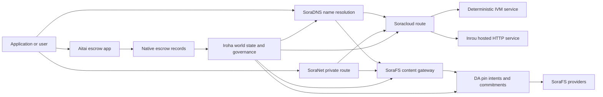

# SORA Nexus ဝန်ဆောင်မှု {#sora-nexus-services}

SORA Nexus App ကို ဦးတည်ပြီး Service လေယာဉ်များအနီးတွင်ထည့်သွင်း Iroha 3. ဤဝန်ဆောင်မှုများ
၎င်းတို့ဟာ သီးခြားစာရင်းများ မဟုတ်ဘဲ Iroha ကမ္ဘာ့နိုင်ငံ၊ Norito
မော်နီဖစ်များ၊ အုပ်ချုပ်ရေး မှတ်တမ်းများနှင့် Torii လမ်းကြောင်းမိသားစုတွေ။

အသုံးပြုနိုင်မှုသည် node build နှင့် network profile များအပေါ် မူတည်သည်။
[`/openapi`](/my/reference/torii-endpoints.md#app-and-sora-route-families) အပေါ်
Target node ကတော့ ခွင့်ပြုထားတဲ့ လမ်းကြောင်းတွေရဲ့ အတည်ပြုစာရင်းအဖြစ်ပါ။

## အစိတ်အပိုင်း မြေပုံ {#component-map}

| အစိတ်အပိုင်း              | ကဏ္ဍ                                                                                                                                        | အဓိက မျက်နှာပြင်များ                                                                            |
| ---------------------- | ------------------------------------------------------------------------------------------------------------------------------------------- | ---------------------------------------------------------------------------------------- |
| Soracloud              | Application deployment, hosted services, private model/runtime state နဲ့ service lifecycle control တွေကို သုံးနိုင်ဖို့ပါ။                                        | `/v1/soracloud/*`, `/api/*`, `iroha app soracloud ...`                                   |
| အိုင်အို                  | Soracloud အိမ်ရှင်များ HTTP တိုက်ရိုက်စစ်ဆေးမှု လိုအပ်တဲ့ ဝန်ဆောင်မှု အပြောင်းအလဲအတွက် ပြေးဆွဲချိန် HTTP လေယာဉ်ပါ။                                                            | Soracloud Runtime configuration, host capability ကြော်ငြာများ, replica runtime အခြေအနေ                 |
| SoraNet                | ပတ်လမ်းများအတွက် ပုဂ္ဂလိကနှင့် သယ်ယူပို့ဆောင်ရေး အပေါ်လွှာ၊ ရေလွှမ်းမိုးမှု VPN, အစည်းအဝေးတွေကို ချိတ်ဆက်ပေးပြီး လမ်းကြောင်းတွေကို ဖြန့်ဝေပေးပါ။                                     | `/v1/connect/*`, `/v1/vpn/*`, SoraNet လမ်းကြောင်း metadata                                     |
| ဒေတာရရှိမှု (DA) | အသုံးပြုနိုင်မှု သက်သေခံချက်များ၊ တာဝန်ယူမှုများနှင့် အသုံးဝင်သော ဝန်ဆောင်မှုများကို ရည်ညွှန်းထားသည့် pin-intent layer များ Nexus လမ်းကြောင်းများ၊ SoraFS ထင်ရှားပြီး သက်သေပြချက်တွေ စီးဆင်းပါတယ်။ | `/v1/da/*`, `FindDaPinIntent*`, `[sumeragi.da]`                                          |
| SoraFS                 | စာရွက်စာတမ်းများအတွက် Content Addressed Storage Fabric များ CAR အသုံးဝင်ပစ္စည်းများ၊ ပိတ်ထားသော အကြောင်းအရာများ၊ gateway ကိုယူခြင်းများနှင့် ပြန်လည်ရှာဖွေနိုင်မှု သက်သေပြမှု စီးဆင်းမှုများ။           | `/v1/sorafs/*`, `/sorafs/*`, `FindSorafsProviderOwner`                                   |
| SoraDNS                | Deterministic naming နဲ့ resolver-attestation layer တွေကို SORA- ဟိုတယ် ဝန်ဆောင်မှုတွေနဲ့ အကြောင်းအရာတွေ                                                   | `/v1/soradns/*`, `/soradns/*`, resolver directory ဖြစ်ရပ်များ                                 |
| အိုင်းတာ                  | အက်ပ်အဆင့် Fiat နဲ့ Asset Settlement Corridor ကို သီးခြားစာရင်းနဲ့မဟုတ်ဘဲ ဒေသခံ escrow မှတ်တမ်းတွေက ထောက်ပံ့ပါတယ်။                                     | `OpenAssetEscrow`, `FindAssetEscrow*`, `EscrowEventFilter`, Kotodama `escrow_*` အဆောက်အအုံများ |



## ပုံမှန် စီးဆင်းမှု {#common-flows}

### အစုလိုက်အပြုံလိုက် အသုံးပြုမှု {#hosted-split-application}

ပုံမှန် Mixed-plane app မှာ အစိတ်အပိုင်းတွေ အားလုံးကို အတူတကွ သုံးပါတယ်။

1. Static frontend assets တွေကို packaged နဲ့ pinned လုပ်ထားပါတယ် SoraFS.
2. ဥပမာ အများပြည်သူ ကြိုဆိုသူ `<app>.sora`, မှတ်ပုံတင်ထားသည်
   SoraDNS.
3. Soracloud လမ်းကြောင်းများ `/api/v1/search` ဒါမှမဟုတ် `/api/v1/stream` Inrou သို့ HTTP
   ဝန်ဆောင်မှု။
4. Soracloud လမ်းကြောင်းများ `/api/auth` နှင့် `/api/v1/user` အချိုးသတ်ချက် IVM
   လက်ကိုင်သမားတွေ။
5. ပုဂ္ဂိုလ်ရေးကို လိုအပ်တဲ့ ဖောက်သည်တွေဟာ တူညီတဲ့ အကြောင်းအရာကို ရယူနိုင်တယ်၊ ဒါမှမဟုတ် API လမ်းကြောင်း
   a မှတစ်ဆင့် SoraNet ပတ်လမ်း။

| လမ်းကြောင်း              | နောက်ခံလေယာဉ်         | ဘာကြောင့်လဲ                                               |
| ----------------- | --------------------- | ------------------------------------------------- |
| `/`               | SoraFS တည်ငြိမ်မှု | ပြန်လည်ဖန်တီးနိုင်သော အကြောင်းအရာ root နှင့် gateway ကို cache လုပ်ခြင်း     |
| `/assets/*`       | SoraFS တည်ငြိမ်မှု | Content-addressed assets နှင့် manifest proof များ      |
| `/api/auth*`      | Soracloud IVM         | ပြန်လည်ကစားရန် လုံခြုံသော စာရင်းအင်းနှင့် ငွေကြေးစက္ကူ စိန်ခေါ်မှုအခြေအနေ       |
| `/api/v1/user*`   | Soracloud IVM         | အုပ်ချုပ်မှုအတွက် ထိခိုက်လွယ်တဲ့ နိုင်ငံတော် ဗီဇပြောင်းခြင်း              |
| `/api/v1/search*` | Soracloud အိုင်အို       | အသက်ရှင်ပါ HTTP ဝန်ဆောင်မှု၊ ကေရှ် SSE, သို့မဟုတ် စုဆောင်းသူနိုင်ငံ |

### အကြောင်းအရာ ထုတ်ဝေခြင်း {#content-publication}

SoraFS ထုတ်ဝေမှုက နာမည်တစ်ခုက သူတို့ကို ညွှန်းမပေးခင် သက်တမ်းရှည်ပစ္စည်းတွေကို ထုတ်လုပ်တယ်။

1. အသုံးဝင်တဲ့ ဝန်ဆောင်မှု (သို့) စာရင်းကို တည်ဆောက်ပါ။
2. ဒါကို A ထဲမှာထည့်လိုက်ပါ CAR မှတ်တမ်းနဲ့ အစိတ်အပိုင်း အစီအစဉ်။
3. A ကို တည်ဆောက်ပါ။ Norito PIN မူဝါဒနဲ့ အုပ်ချုပ်ရေး အချက်အလက်တွေနဲ့ ထုတ်ပြန်ထားတယ်။
4. မော်နီဖေးကို Torii.
5. မှတ်တမ်းတင်ပါ DA ရည်ရွယ်ချက် (သို့) ပံ့ပိုးမှု ကတိပေးချက်
   ကိုယ်စားလှယ်လောင်းဟာ ရှင်းလင်းတဲ့ သက်သေတွေ လိုအပ်တယ်။
6. စာရွက်စာတမ်းကို A နဲ့ ချိတ်ဆက်ပေးပါ။ SoraDNS အမည် သို့မဟုတ် Soracloud တည်ငြိမ်တဲ့ ရှေ့ဆုံးလမ်းကြောင်းပါ။

### ပုဂ္ဂလိက ယူဆောင်ခြင်း (သို့) စီးဆင်းမှု လမ်းကြောင်း {#private-fetch-or-streaming-route}

SoraNet ရှေ့မှာ ထိုင်နိုင်တယ် SoraFS ဒါမှမဟုတ် Soracloud:

1. ဖောက်သည်က နာမည် (သို့) မော်နီဖစ်ကို ဖြေရှင်းတယ်။
2. guard directory (သို့) route manifest မှာ entry နဲ့ exit relay တွေကို ရွေးချယ်ပါတယ်။
3. ယာဉ်ကြောကို အပြည့်အဝ ဖြည့်ပြီး SoraNet ပတ်လမ်း။
4. ထွက်ခွာရေး Relay က SoraFS ဂိတ်တံခါး Torii ရေစီးကြောင်း သို့မဟုတ် Soracloud
   လမ်းကြောင်း။

## အိုင်းတာ {#aitai}

Aitai က SORA စျေးကွက်ပုံစံ settlement အတွက် app corridor where a
ဝယ်သူနဲ့ ရောင်းသူဟာ ချိတ်ဆက်မှုအပြင်မှာ ငွေပေးချေမှုကို ညှိနှိုင်းပြီး Iroha ထိန်းချုပ်
ချိတ်ဆက်ထားတဲ့ အရင်းအမြစ် ထိန်းသိမ်းမှုမှာ မူရင်း escrow instruction မိသားစုကို သုံးသင့်ပါတယ်။
စာရင်းအင်းအရင်းအမြစ်များကို ထိန်းသိမ်းရန်အတွက် သဘောတူစာချုပ်ပိုင် ဂိုဏ်းစာရင်းအစား
စီးဆင်းပါတယ်။

Native escrow ကတော့ အုပ်ချုပ်မှုစာရင်းမှာ ထိန်းသိမ်းထားတယ်။ ရောင်းသူက
`OpenAssetEscrow`, ဝယ်ယူသူက လက်ခံပြီး ကွင်းဆက်ပြင်ပ ငွေပေးချေမှုကို အမှတ်တံဆိပ်နဲ့ မှတ်သားထားတယ်။
`AcceptAssetEscrow` နှင့် `MarkEscrowPaymentSent`, ရောင်းသူက ထုတ်ပေးတယ်
နှင့်အတူ `ReleaseAssetEscrow` သို့မဟုတ် ငွေပေးချေမှု အမှတ်တံဆိပ်မပါမီ ဖျက်သိမ်းပါ။
ရောင်းသူ သဘောမတူရင် နှစ်ဘက်စလုံးက ပဋိပက္ခဖွင့်ပြီး ဖြေရှင်းနိုင်တယ်
`CanResolveEscrowDispute` ပိတ်ထားတဲ့ပမာဏကို ခွဲနိုင်တယ်။

သက်တမ်းတစ်လျှောက်လုံးအတွက် အထွေထွေ အရင်းအမြစ်ပိတ်ခြင်း၊ အမည်မဲ့ ဂိုဏ်း၊ မေးမြန်းချက်တွေ၊
ဖြစ်ရပ်များ၊ Rust နမူနာများ၊ ကြည့်ပါ
[Native Asset Escrow](/my/blockchain/escrow.md).

| Aitai မျက်နှာပြင်                                                                                                                                                 | ဒါကို အသုံးပြုပါ။                                                                                |
| ------------------------------------------------------------------------------------------------------------------------------------------------------------- | ----------------------------------------------------------------------------------------- |
| `OpenAssetEscrow`, `AcceptAssetEscrow`, `MarkEscrowPaymentSent`, `ReleaseAssetEscrow`, `CancelAssetEscrow`                                                    | ပွင့်လင်းမြင်သာသော ကိန်းဂဏန်းအရင်းအမြစ် ကမ်းလှမ်းမှုများ၊ XOR- သတ်မှတ်ထားတဲ့ ရင်းနှီးမြှုပ်နှံမှု စီးဆင်းမှုတွေ။             |
| `OpenAnonymousAssetEscrow`, `AcceptAnonymousAssetEscrow`, `MarkAnonymousEscrowPaymentSent`, `ReleaseAnonymousAssetEscrow`, `CancelAnonymousAssetEscrow`       | ငွေကြေးထောက်ပံ့မှုနှင့် ပိတ်သိမ်းရေး လှုပ်ရှားမှုများအား သက်သေခံအတည်ပြုချက်များဖြင့် ဆောင်ရွက်သည့် ကာကွယ်ထားသော ကမ်းလှမ်းမှုများ။ |
| `OpenEscrowDispute`, `ResolveEscrowDispute`, `OpenAnonymousEscrowDispute`, `ResolveAnonymousEscrowDispute`                                                    | အငြင်းပွားမှုဖြေရှင်းရေးနဲ့ တရားရုံးပုံစံ ဖြေရှင်းရေး။                                                 |
| `FindAssetEscrowById`, `FindAssetEscrowsBySeller`, `FindAssetEscrowsByBuyer`, `FindAssetEscrowsByStatus`                                                      | App Status စာမျက်နှာများ၊ ညှိနှိုင်းမှု အလုပ်များနှင့် ထောက်ပံ့ရေး ကိရိယာများ။                               |
| `EscrowEventFilter`                                                                                                                                           | သွယ်ဝိုက်တဲ့ ငွေကြေးထောက်ပံ့မှု စာရင်းအင်းတွေကို ငွေကြေး ထောက်ပံ့ရေး ID၊ ရောင်းသူ၊ ဝယ်သူ၊ အခြေအနေ (သို့) ဖြစ်ရပ်အမျိုးအစားဖြင့် တိုက်ရိုက်တင်သွင်းပေးပါ။ |
| Kotodama `escrow_open_offer`, `escrow_accept`, `escrow_mark_payment_sent`, `escrow_release`, `escrow_cancel`, `escrow_open_dispute`, `escrow_resolve_dispute` | Kotodama စာချုပ်ခေါ်ဆိုမှု V1 Syscalls ကို အငှားပေးပါ။                                 |

အများပြည်သူအတွက် Taira ဒါမှမဟုတ် Minamoto သုံးစွဲမှု၊ ချိတ်ဆက်မှုအပြင် ငွေပေးချေရေး ရထားကို ကုသခြင်းနှင့်
လျှောက်ထားမှု မူဝါဒအဖြစ် ထောက်ပံ့မှု (သို့) တရားရုံး အလုပ်ဖြစ်စဉ်တစ်ခုခု။ Iroha မှတ်တမ်းတင်
ထိန်းသိမ်းမှုအခြေအနေ၊ သက်တမ်း စက်ဝန်းဖြစ်စဉ်များ၊ သက်သေခံ hashes များနှင့် နောက်ဆုံး အရင်းအမြစ် လှုပ်ရှားမှုများ။
၎င်းဟာ Fiat Settlement ကို ကိုယ်တိုင် မစစ်ဆေးဘူး။

## Target Node ကို စစ်ဆေးပါ {#check-a-target-node}

ဤစာမျက်နှာမှ ဥပမာများကို မသုံးခင်တွင် လမ်းကြောင်းမိသားစုရှိသည်ကို အတည်ပြုပါ။
ကိုယ်ရည်မှန်းနေတဲ့ node မှာ

```bash
export TORII_URL=https://taira.sora.org

curl -fsS "$TORII_URL/openapi.json" \
  | jq '.paths | keys[] | select(test("^/v1/(soracloud|sorafs|soradns|connect|vpn|da)/"))'

curl -fsS "$TORII_URL/status" | jq .
```

(သို့) `/openapi.json` Profile က မဖေါ်ပြဘူးဆိုရင် စမ်းကြည့်ပါ။ `/openapi`. အတိအကျ
လမ်းကြောင်းရရှိနိုင်မှုက build features နဲ့ network configuration ကို မှီခိုပါတယ်။

### Taira Read Only Smoke Checks များ {#taira-read-only-smoke-checks}

အများပြည်သူ Taira endpoint ကို read-side checks အတွက် အသုံးဝင်ပေမဲ့ မသုံးပါနဲ့
အပြောင်းအလဲဖြစ်နေတဲ့ ဥပမာတွေအတွက် သင်က ခွင့်ပြုထားတဲ့ အကောင့်ကို မောင်းနှင်ဘူးဆိုရင်နဲ့
အသက်ရှင်နေတဲ့ အခြေအနေကို ပြောင်းလဲဖို့ ရည်ရွယ်တယ်။

```bash
export TORII_URL=https://taira.sora.org

curl -fsS "$TORII_URL/status" \
  | jq '{version: .build.version, peers, blocks, lanes: (.teu_lane_commit | length)}'

curl -fsS "$TORII_URL/v1/connect/status" | jq '{enabled, sessions_active}'

curl -fsS "$TORII_URL/v1/vpn/profile" \
  | jq '{available, relay_endpoint, supported_exit_classes}'

curl -fsS "$TORII_URL/v1/sorafs/storage/state" \
  | jq '{bytes_capacity, bytes_used, pin_queue_depth, por_inflight}'

curl -fsS -H 'Accept: application/json' "$TORII_URL/v1/soracloud/status" \
  | jq '.control_plane | {service_count, services: [.services[] | {service_name, current_version}]}'
```

Taira တပ်ဆင်မှုအတွက် သီးသန့် ထိန်းချုပ်ရေး လေယာဉ်လမ်းကြောင်းများကို မဖွင့်လှစ်နိုင်ပါ။
စာရင်းထဲတွင် ဖော်ပြထားသည် OpenAPI လမ်းကြောင်း မြေပုံ။ ကုသမှု `/openapi` အဓိက ထုတ်ကုန်အဖြစ်
API လက်မှတ်ထိုးပြီးနောက် တပ်ဆင်မှုဆိုင်ရာ လမ်းကြောင်းတစ်ခုခုကို တိုက်ရိုက်မတိုင်ခင်မှာ အတည်ပြုပါ။
ဒါကို တိုက်ရိုက် မှတ်တမ်းတင်နေတာပါ။

## Soracloud {#soracloud}

Soracloud အဲဒါက SORA အသုံးချမှု ထိန်းချုပ်ရေး လေယာဉ်။ ၎င်းက တပ်ဆင်မှုကို ခြေရာခံတယ်။
ဘက်ဂျက်များ၊ ဝန်ဆောင်မှု ပြင်ဆင်မှုများ၊ လမ်းညွှန်ခြင်း၊ ဖြန့်ချိရေးအခြေအနေ၊ ခွင့်ပြုချက်ရှိသော ကွန်ဖူဂေးရှင်း
မှတ်ပုံတင်များ၊ လျှို့ဝှက်သော ဝန်ဆောင်မှုလျှို့ဝှက်ချက်များ၊ ပုံစံစာရင်းမှတ်တမ်းများ၊ သီးသန့်
ဟောကိန်းထုတ်မှု အစည်းအဝေးများ၊ ပြေးဆွဲချိန် လက်မှတ်များ။

Soracloud စီမံခန့်ခွဲမှု လေယာဉ် နှစ်ခုကို သုံးပါတယ်။

| သတ်ဖြတ်ရေး လေယာဉ်        | ပြေးချိန် | ဒါကို အသုံးပြုပါ။                                                                                   |
| ---------------------- | ------- | -------------------------------------------------------------------------------------------- |
| `DeterministicService` | `Ivm`   | စာရေးသူ၊ အလှူခံအခြေအနေ၊ အသိအမှတ်ပြုစာဖတ်ခြင်း၊ စာတိုက်သေတ္တာကိုင်တွယ်သူများ၊ အုပ်ချုပ်မှုအတွက် အာရုံစိုက်တဲ့ ဗီဇပြောင်းခြင်း |
| `HttpService`          | `Inrou` | အသက်ရှင်ပါ HTTP APIs, စုဆောင်းသူ အလုပ်များ၊ ကေရှ်ထောက်ပံ့မှုရှိတဲ့ ဝန်ဆောင်မှုများ၊ SSE, Browser အကူအညီဖြင့် စီးဆင်းမှု     |

ထိန်းချုပ်ရေး လေယာဉ်က ခိုင်မာပါတယ်။ ဖြန့်ချိခြင်း၊ အဆင့်မြှင့်တင်ခြင်း၊ ပြန်လည်ဖြုတ်ချခြင်း၊ ဖွဲ့စည်းခြင်း
လျှို့ဝှက်, ပုံစံ, နှင့်အခြေအနေအမိန့်များက Torii စာဖတ်ပြီး ကျင့်သုံး
နိုင်ငံတကာနိုင်ငံတစ်ခုဖြစ်သည်၊ ၎င်းတို့ဟာ သီးခြား CLI- ဒေသခံ မှန်၊ အများပြည်သူ
Routing ဟာ Longest Prefix ကို အခြေခံထားလို့ မှတ်ပုံတင်ထားတဲ့ host တစ်ခုက Traffic ကို ခွဲခြားနိုင်တယ်
အိမ်ရှင်ကြား HTTP လမ်းကြောင်းများနှင့် သတ်မှတ်ချက်များ API လမ်းကြောင်းတွေပေါ့။

### Split App ကို စက္ဖုန္းထဲထည့္ပါ {#scaffold-a-split-app}

Split-app နမူနာက Static Frontend Plus ကို Live host လုပ်ပေးတယ်။ API
ပြီးတော့ deterministic vault တစ်ခုပါAPI ဝန်ဆောင်မှု

```bash
iroha app soracloud app init \
  --template split-app \
  --app-name solswap_indexer \
  --app-version 0.1.0 \
  --public-host solswap-indexer.sora \
  --output-dir ./apps/solswap-indexer

iroha app soracloud app local-plan \
  --manifest ./apps/solswap-indexer/app_manifest.json

iroha app soracloud app doctor \
  --manifest ./apps/solswap-indexer/app_manifest.json
```

`local-plan` လမ်းကြောင်းခွဲစိတ်ချက်၊ ကလေးဝန်ဆောင်မှု မှတ်တမ်းများ၊ အလုပ်ခွင်ကို ပုံနှိပ်ထားသည်
script paths နဲ့ မျှော်လင့်ထားတဲ့ frontend ထုတ်ဝေမှု mode ကိုပါ။ `doctor`
သင် ပါဝင်မစခင် ဒေသတွင်း လွတ်မြောက်ရေး စာချုပ်ကို အတည်ပြုပေးတယ်။ Torii.

### App အခြေအနေကို စေလွှတ်ပြီး စစ်ဆေးခြင်း {#deploy-and-inspect-app-state}

```bash
export SORACLOUD_TORII_URL=https://<soracloud-enabled-torii>

iroha app soracloud app deploy \
  --manifest ./apps/solswap-indexer/app_manifest.json \
  --torii-url "$SORACLOUD_TORII_URL"

iroha app soracloud app status \
  --manifest ./apps/solswap-indexer/app_manifest.json \
  --torii-url "$SORACLOUD_TORII_URL"
```

အသုံးပြုပြီးသား ဝန်ဆောင်မှုအတွက် Service-scale command တွေကို သုံးပါ။

```bash
iroha app soracloud status \
  --service-name solswap_indexer_live \
  --torii-url "$SORACLOUD_TORII_URL"

iroha app soracloud rollback \
  --service-name solswap_indexer_live \
  --target-version 0.1.0 \
  --torii-url "$SORACLOUD_TORII_URL"
```

### လျှို့ဝှက်ပစ္စည်းများ {#config-and-secret-material}

Soracloud config နဲ့ secret entries တွေဟာ authoritative deployment ရဲ့ အစိတ်အပိုင်းပါ။
Deploy, upgrade, and rollback fail close when required configuration or
လျှို့ဝှက် ချိတ်ဆက်မှု မရှိတာ (သို့) တက်ကြွတဲ့ manifest တွေနဲ့ မညီဘူးဆိုတာပါ။

```bash
iroha app soracloud config-set \
  --service-name solswap_indexer_live \
  --config-name indexer/public_config \
  --value-file ./config/public-config.json \
  --torii-url "$SORACLOUD_TORII_URL"

iroha app soracloud secret-set \
  --service-name solswap_indexer_live \
  --secret-name indexer/api_key \
  --secret-file ./secrets/api-key.envelope.json \
  --torii-url "$SORACLOUD_TORII_URL"
```

သုံးပါ CLI သင့်ရဲ့ profile ကလိုအပ်တဲ့ တိကျတဲ့ မှတ်ပုံတင်အမှတ်တံဆိပ်တွေအတွက် အကူအညီ

```bash
iroha app soracloud config-set --help
iroha app soracloud secret-set --help
```

## အိုင်အို {#inrou}

Inrou ဟာ အိမ်ရှင်ပါ။ HTTP အသုံးပြုသော runtime Soracloud. အန် Iroha node ကို
embedded Soracloud လက်ခံထားရသည့် ပြေးဆွဲမှုကာလ စီမံကိန်းများ Soracloud ပြည်နယ်ကို ဒေသတွင်း
သရုပ်ဖော်မှု အစီအစဉ်, loopback အဖြစ်ကဏ္ဍမှာသတ်မှတ်ထားသော hosted-service replicas ကိုစတင်
ဝန်ဆောင်မှုများနှင့် အစီရင်ခံစာများ runtime state ကိုအတည်ပြု
မော်ဒယ်ပါ။

Inrou ကို Live လိုတဲ့ Workload တွေအတွက် အသုံးပြုပါ။ HTTP မျက်နှာပြင်၊ ဥပမာ
စုဆောင်းသူလေးများ APIs, SSE stream တွေ၊ cache backed handle တွေ၊ ဒါမှမဟုတ်
Browser အကူအညီပေးသော ဝန်ဆောင်မှုများ။

### အလုပ်ချိန် လိုအပ်ချက်များ {#runtime-requirements}

- Container Manifesto Runtime ကို `Inrou`.
- ဝန်ဆောင်မှု မော်နီဖောင်း အကောင်အထည်ဖော်ရေး လေယာဉ်ကို `HttpService`.
- `HttpService + Inrou` တစ်ခုကို အတိအကျ လိုအပ်တယ်။ `PersistentRootLeaseVolume`
  ကို တပ်ဆင်ထားသည် `/`.
- Inrou ဝန်ဆောင်မှုများကို ပြန်လည်ဖန်တီးရန်အတွက်လည်း Shared Service သို့မဟုတ် Confidential Lease လိုသည်။
  အပြောင်းအလဲရှိတဲ့ မျှဝေထားတဲ့ အခြေအနေကို ထိန်းထားတဲ့အခါ သိုလှောင်ပါ။
- ထုတ်လုပ်ရေး hosting node တွေဟာ Inrou ရဲ့ အစစ်အမှန် အရည်အသွေးကို ကြော်ငြာသင့်ပါတယ်။
  ကိုယ်စားလှယ်အဖြစ်သာ လုပ်ဆောင်တာပါ။

### ထင်ရှားသော အပိုင်းအစ {#manifest-fragment}

အောက်ပါ ဥပမာက ဒီ manifest နှစ်ခုရဲ့ ပုံသဏ္ဍာန်ကို ပြပါတယ်။
အပြည့်အဝ တပ်ဆင်မှု ပိတ်ပင်ချက် မဟုတ်ဘူး။

```jsonc
// container_manifest.json
{
  "schema_version": 1,
  "runtime": { "runtime": "Inrou", "value": null },
  "bundle_path": "/bundles/solswap-indexer.inrou",
  "entrypoint": "/app/bin/launch-indexer.sh",
  "args": [],
  "env": {
    "RUST_LOG": "info",
  },
  "inrou": {
    "schema_version": 1,
    "guest_os": { "guest_os": "DebianSlim", "value": null },
    "guest_images": {
      "x86_64": {
        "kernel_image_path": "/inrou/x86_64/vmlinux",
        "rootfs_image_path": "/inrou/x86_64/rootfs.ext4",
        "initrd_image_path": null,
      },
      "aarch64": {
        "kernel_image_path": "/inrou/aarch64/vmlinux",
        "rootfs_image_path": "/inrou/aarch64/rootfs.ext4",
        "initrd_image_path": null,
      },
    },
  },
  "lifecycle": {
    "start_grace_secs": 60,
    "stop_grace_secs": 30,
    "healthcheck_path": "/api/indexer/v1/health",
  },
}
```

```jsonc
// service_manifest.json
{
  "schema_version": 1,
  "service_name": "solswap_indexer_live",
  "service_version": "0.1.0",
  "execution_plane": { "execution_plane": "HttpService", "value": null },
  "replicas": 2,
  "route": {
    "host": "solswap-indexer.sora",
    "path_prefix": "/api/v1/search",
    "service_port": 8080,
    "visibility": { "visibility": "Public", "value": null },
    "tls_mode": { "tls": "Required", "value": null },
  },
  "lease_volumes": [
    {
      "volume_name": "root_disk",
      "kind": {
        "lease_volume": "PersistentRootLeaseVolume",
        "value": null,
      },
      "storage_class": { "storage_class": "Warm", "value": null },
      "mount_path": "/",
      "max_total_bytes": 8589934592,
    },
    {
      "volume_name": "index_state",
      "kind": { "lease_volume": "ServiceLeaseVolume", "value": null },
      "storage_class": { "storage_class": "Warm", "value": null },
      "mount_path": "/var/lib/solswap-indexer",
      "max_total_bytes": 1073741824,
    },
  ],
}
```

Runtime မှာ တပ်ဆင်ထားတဲ့ လေလံဝယ်ယူမှု ပမာဏတိုင်းဟာ ပတ်ဝန်းကျင်ကနေ ထိတွေ့နေတာပါ။
အရွယ်အစားအမည်မှ ရယူသော ကိန်းရှင်များ:

```text
SORACLOUD_LEASE_VOLUME_ROOT_DISK_DIR
SORACLOUD_LEASE_VOLUME_ROOT_DISK_MOUNT_PATH
SORACLOUD_LEASE_VOLUME_INDEX_STATE_DIR
SORACLOUD_LEASE_VOLUME_INDEX_STATE_MOUNT_PATH
```

## SoraNet {#soranet}

SoraNet အလွတ်လပ်ရေးနဲ့ သယ်ယူပို့ဆောင်ရေးအလွှာပါ။
ရည်မှန်းချက်ဂိတ်သို့ တိုက်ရိုက် ဆက်သွယ်မသင့်သော ယာဉ်လမ်းကြောင်းများ
သယ်ယူပို့ဆောင်ရေး ဒီဇိုင်းမှာ ဝင်၊ အလယ်နဲ့ ထွက်ခွာ ရေလွှေ့တာဝန်တွေ သုံးတယ်။
QUIC သယ်ယူပို့ဆောင်ရေး၊ ဆူညံသံအခြေခံ ဟိုက်ဘရစ် လက်ဆွဲခြင်း၊ စွမ်းဆောင်ရည် ညှိနှိုင်းခြင်း
Relay directory metadata တွေနဲ့ fixed size padded cells တွေပေါ့။

အတွင်းမှာ Nexus တပ်ဆင်မှုတွေ၊ SoraNet အကြောင်းအရာတွေ ယူလာနိုင်တယ်၊ ဂိတ်ဂိတ် Traffic တွေ၊
VPN (သို့) Connect အစည်းအဝေးများ Norito တိုက်ရိုက်လမ်းကြောင်းများ။ Directory entry များကို
အမှတ်တံဆိပ်က ဒီထောက်ပံ့မှုကို ဆက်ပေးတယ်။ `norito-stream`, ဒါက ဖောက်သည်တွေကို လမ်းကြောင်းတွေကို ပိုနှစ်သက်စေတာပါ။
အတွက် သင့်တော်တဲ့ Torii RPC (သို့) ယာဉ်ကြောစီးဆင်းမှုပါ။

### Streaming Configuration ကို {#streaming-configuration}

နိုင်ငံခြားရေး Nexus Profile လုပ်နိုင်တယ် SoraNet သယ်ယူပို့ဆောင်ရေး လမ်းကြောင်းများအတွက် ထောက်ပံ့မှု:

```toml
[streaming]
feature_bits = 0b11

[streaming.soranet]
enabled = true
exit_multiaddr = "/dns/torii/udp/9443/quic"
padding_budget_ms = 25
access_kind = "authenticated"
provision_spool_dir = "./storage/streaming/soranet_routes"
provision_spool_max_bytes = 0
provision_window_segments = 4
provision_queue_capacity = 256
```

အသုံးပြုခြင်း `access_kind = "read-only"` လိုအပ်တဲ့ အကြောင်းအရာလမ်းကြောင်းများအတွက်
viewer authentication ကို အသုံးပြုပါ။ `authenticated` ထွက်ခွာရေး Relay က အာဏာပေးဖို့လိုတဲ့အခါ
လက်မှတ်တွေ (သို့) ကြည့်ရှုသူရဲ့ ကိုယ်ပိုင်လက္ခဏာ Torii (သို့) အိမ်ထောင်ပြုတဲ့ ဝန်ဆောင်မှုတစ်ခုပေါ့။

### SoraNet- သတိထားမိတယ်။ SoraFS ယူလာပါ {#soranet-aware-sorafs-fetch}

နိုင်ငံခြားရေး SoraFS ရယူခြင်း CLI ဒေသခံ proxy manifest နဲ့ spool ကို ထုတ်လွှင့်နိုင်ပါတယ် SoraNet
browser extension များအတွက် route metadata သို့မဟုတ် SDK adapters:

```bash
sorafs_cli fetch \
  --plan artifacts/payload_plan.json \
  --manifest-id 7bb2...9d31 \
  --provider name=alpha,provider-id=9f5c...73aa,base-url=https://gw-alpha.example.org/,stream-token="$(cat alpha.token)" \
  --output artifacts/payload.bin \
  --json-out artifacts/fetch_summary.json \
  --local-proxy-manifest-out artifacts/proxy_manifest.json \
  --local-proxy-mode bridge \
  --local-proxy-norito-spool storage/streaming/soranet_routes \
  --local-proxy-kaigi-spool storage/streaming/soranet_routes \
  --local-proxy-kaigi-policy authenticated \
  --max-peers=2 \
  --retry-budget=4
```

အနှစ်ချုပ်မှတ်တမ်းပေးသူ အစီရင်ခံစာတွေ၊ လက်ခံရရှိမှု အပိုင်းအစတွေ၊ ဒေသတွင်း ကိုယ်စားလှယ် မီတာဒေတာ၊
ပြီးတော့ ရယူဖို့ သုံးတဲ့ ထိရောက်တဲ့ လမ်းကြောင်း ညွှန်ကြားချက်တွေပေါ့။

## ဒေတာရရှိမှု (DA) {#data-availability-da}

DA ကြီးမားလွန်းတဲ့ အသုံးဝင် ဝန်ဆောင်မှုအတွက်လည်း ရှိနိုင်ခြေအထောက်အထား အလွှာပါ။
privacy-sensitive, သို့မဟုတ်ကမ္ဘာပေါ်ကို တိုက်ရိုက်တင်ဖို့ဝန်ဆောင်မှုဆိုင်ရာထူးခြားလွန်း
အတည်ပြုချက်ဆိုင်ရာ ကတိပေးချက်များနှင့် ပြန်လည်သိမ်းယူရန် တာဝန်များကို မှတ်တမ်းတင်ထားသည်
validators, gateways နဲ့ client တွေက ဘယ် byte ကတိပေးထားလဲဆိုတာ သဘောတူနိုင်တယ်
ဘယ်မူဝါဒကို သုံးပြီး ဘယ်သက်သေတွေ တွေ့ရှိထားလဲ။

DA အစားထိုးမပေးပါ။ Kura ဒါမှမဟုတ် SoraFS:

- Kura နောက်ဆုံးသတ်မှတ်ထားတဲ့ block stream နဲ့ consensus recovery data တွေကို သိမ်းထားတယ်။
- SoraFS Content-addressed bytes တွေကို သိုလှောင်ပြီး ပို့ပေးတယ်။ CAR အသုံးဝင်ပစ္စည်းများ၊
  လက္ခဏာတွေ
- DA ကတိပေးချက်များ မှတ်တမ်းတင်ခြင်း၊ သက်သေပြ မူဝါဒများ၊ သက်သေပြမှု ဖွင့်ပွဲများနှင့် ပိုက်ရည်ရွယ်ချက်များကို မှတ်တမ်းတင်ခြင်း
  အဲဒီ byte တွေကို အစီအစဉ်ချ၊ စစ်ဆေးပြီး Ledger နဲ့ ပြန်ဆက်သွယ်ခွင့်ပေးတယ်။
  ပြည်နယ်။

အသုံးပြုခြင်း DA လျှောက်ထားမှု သို့မဟုတ် Nexus Lane ဟာ စာရင်းအင်းမှာ မြင်နိုင်တဲ့ ကတိတစ်ခု လိုအပ်တယ်။
Off-chain data တွေကို ပြန်လည်ရှာဖွေလို့ ရနိုင်သေးတယ်
ငွေပေးချေမှု စီးဆင်းမှုအတွက် အသုံးဝင် ဝန်ဆောင်မှု ကတိများ၊ SoraFS ထုတ်ဝေရန် ရည်ရွယ်ချက်များ
နောက်ပိုင်း စစ်ဆေးမှုအတွက် သိမ်းထားရမယ့် အထောက်အထားတွေပါ
အသုံးပြုမှုလက်ရာများ၏ အများပြည်သူအခြေအနေသည်
အပြည့်အဝ အသုံးဝင်တဲ့ ဝန်ဆောင်မှုပါ။

### သက်တမ်း စက်ဝန်း {#lifecycle}

| အဆင့်      | မှတ်တမ်းတင်ထားတာက                                                                                                                                      |
| ---------- | ----------------------------------------------------------------------------------------------------------------------------------------------------- |
| ရည်ရွယ်ချက်     | လက်မှတ်၊ အထင်ကရ ရည်ညွှန်းချက်၊ အမည်မဖော်လိုသူ၊ လမ်းကြောင်း/ခေတ်/နောက်ဆက်တွဲ ရည်ညွှန်းမှု၊ ထိန်းသိမ်းရေး မူဝါဒ (သို့) ပြန်လည်ဖန်တီးခြင်းရည်မှန်းချက်။                                          |
| ကတိပေးခြင်း | စာရင်းအင်း၊ လမ်းကြောင်း အသုံးဝင်မှု၊ သက်သေပြမှု ဘက်ဒယ် (သို့) အကြောင်းအရာ အမြစ်ကို လက်မှတ်ကြီးနဲ့ မြင်နိုင်တဲ့ မှတ်တမ်းနဲ့ ချိတ်ဆက်တဲ့ ပစ္စည်းတွေကို သွင်းပါ။                                    |
| အထောက်အထားများ   | ရယူနိုင်မှု မဲများ၊ သက်သေပြချက် ဖွင့်ပွဲများ၊ ပေးသွင်းသူ၏ အတည်ပြုချက်များ သို့မဟုတ် ပရိုဖိုင်းဆိုင်ရာ အခြား အထောက်အထားများကို ရည်မှန်းချက်ကွန်ရက်က လက်ခံခဲ့သည်။                         |
| မေးခွန်း      | ပိုက်ရည်ရွယ်ချက် စစ်ဆေးခြင်း `FindDaPinIntentByTicket`, `FindDaPinIntentByManifest`, `FindDaPinIntentByAlias`, ဒါမှမဟုတ် `FindDaPinIntentByLaneEpochSequence`. |

သာမန် DA- ထောက်ပံ့သော ထုတ်ဝေမှု စီးဆင်းမှုက:

1. အပြင်ဘက်က အသုံးဝင် ဝန်ဆောင်မှုကို တည်ဆောက်ခြင်း (သို့) လက်ခံရရှိခြင်း WSV, ဥပမာ SoraFS CAR
   ဖိုင် သို့မဟုတ် Nexus လမ်းကြောင်း အသုံးဝင်မှု။
2. hash နဲ့ အသုံးဝင်တဲ့ ဝန်ဆောင်မှုကို Norito ပြသနေသော သို့မဟုတ် လမ်းကြောင်းအလိုက် သတ်မှတ်ထားသော
   တာဝန်ယူမှု မှတ်တမ်း။
3. လက်မှတ်ရေးထိုးချက်၊ ပိုက်ရည်ရွယ်ချက် (သို့) ကတိကို `/v1/da/*` ဘယ်အချိန်မှာ
   အဲဒီလမ်းကြောင်းမိသားစုကို ဖွင့်ထားတယ် ဒါမှမဟုတ် ကွန်ရက်ရဲ့ လက်မှတ်ထိုးထားတဲ့
   ငွေပေးချေမှု လမ်းကြောင်း။
4. လိုအပ်တဲ့ အထောက်အထားတွေကို validator တွေ (သို့) availability provider တွေက စုဆောင်းခွင့်ပေးပါ။
   တက်ကြွတဲ့ သက်သေပြမှု မူဝါဒနဲ့ပါ။
5. အမည်မဖော်လိုခင် ရလာတဲ့ Pin ရည်ရွယ်ချက် (သို့) ကတိကို မေးမြန်းပါ။
   ငွေပေးချေမှု အထောက်အထား (သို့) အသုံးဝင်ဝန်ဆောင်မှုအပေါ် မူတည်တဲ့ ဂိတ်ဂိတ်လမ်းကြောင်းပါ။

### အယ်လ်ဂိုရစ်သမ်ပုံစံ {#algorithmic-model}

DA အသုံးဝင်တဲ့ ဝန်ထုပ်ကို လက်မှတ်ထိုးပြီး ပြန်လည်ကစားကာကွယ်ထားတဲ့ ဘလော့ကဒ်အညွှန်းထားတဲ့ ကတိတစ်ခုအဖြစ် ပြောင်းလိုက်တယ်။
အရေးကြီးတဲ့ အယ်လ်ဂိုရစ်သမ်တွေဟာ သတ်မှတ်ချက်ဖြစ်လို့ validators နဲ့ gateways တွေက
တူညီတဲ့ byte တွေကနေ တူညီတဲ့ digests ကိုပြန်တွက်ပါ။

1. **ပေးပို့ထားတဲ့ အသုံးဝင်ပစ္စည်းကို Canonical လုပ်ပါ။** Torii အစာစားဖို့ တောင်းဆိုချက်ကို လက်ခံပါတယ်။
   `(lane_id, epoch, sequence)`, payload bytes, compression metadata များ၊ chunk
   size, erasure profile, retention policy နဲ့ submitter လက်မှတ်
   gzip, deflate, သို့မဟုတ် Zstandard အသုံးဝင်ဝန်ဆောင်မှုများကို တောင်းဆိုတဲ့အခါ decompresses ပြီးရင်
   Canonical byte အလျားက တူတာကို စစ်ဆေးတယ်။ `total_size`.
2. **လမ်းကြောင်းနဲ့ အပိုင်းသတ်မှတ်ချက်တွေကို စစ်ဆေးပါ။** လမ်းကြောင်းဟာ Nexus
   လမ်းကြောင်းစာရင်း။ `chunk_size` အနည်းဆုံး ၂ လုံးရဲ့ သုညမဟုတ်တဲ့ စွမ်းအားရှိရပါမယ်။
   ဘိုင်တိတ်များနှင့် ဖွဲ့စည်းထားသော အမြင့်ဆုံးထက်မပိုပါ။ ဖျက်ခြင်းပရိုဖိုင်းက
   အနည်းဆုံး နှစ်ခုပါတဲ့ ဒေတာအစိတ်အပိုင်းများ ပါဝင်ပါတယ်။
   သက်သေခံစနစ် `merkle_sha256` ဒါမှမဟုတ် `kzg_bls12_381`.
3. **ကွန်ရက် မူဝါဒကို လိုက်နာပါ။** node က configured replication ကို တားဆီးပေးပြီး
   blob class အတွက် retention base line ကို အသုံးပြုပါ။ အများပြည်သူ metadata တွေဟာ plaintext ဖြစ်နေရပါမယ်။
   အုပ်ချုပ်မှုအတွက်သာ metadata ကို node ရဲ့ configured governance နဲ့ encrypt လုပ်ထားပါတယ်
   စာရင်းထဲ မရေးခင် metadata key ပါ။
4. **အပိုင်းလိုက်ပြီး ကတိပေးပါ။** Canonical အသုံးဝင်ဝန်ဆောင်မှုကို Fixed Size နဲ့ ချိတ်ဆက်ထားပါတယ်။
   Profile ကို ရယူထားသည် `chunk_size`. Torii အသုံးဝင် ဝန်ဆောင်မှု သတ္တုကို တွက်ချက်တယ်၊
   ပြန်လည်ရှာဖွေနိုင်မှု သက်သေခံ သစ်ပင် အမြစ်နှင့် တစ်စိတ်တစ်ပိုင်း ကတိပေးချက်များ။
   သယ်ဆောင် BLAKE3 ဘိုက်တွေထက် တာဝန်ယူမှုတွေရှိတယ်
5. **ဖျက်ပစ်ရန် ကတိပေးချက်များ ထည့်သွင်းပါ။** Chunks တွေကို strips အဖြစ်စုစည်းထားပါတယ်
   `data_shards`. နောက်ဆုံးခြေလှမ်းထဲက ပျောက်နေတဲ့ ဆဲလ်တွေဟာ ညီမျှမှုအတွက် သုညကို ဖြည့်ထားတယ်။
   တွက်ချက်မှု။ RS(16) parity က row/global parity shards တွေကို ဖန်တီးတယ်။
   `row_parity_stripes` matrix တစ်ခုလုံးမှာ column style stripe parity ကိုထည့်ပါ။
   အချိုးအစားအချိုးအစား ကတိကဝတ်များ BLAKE3 အင်းစိန်အသေးစား အစာခြေခြင်း `u16` သင်္ကေတတွေပါ။
6. **မှတ်တမ်းကို ဆောက်လုပ်ပါ။** `DaManifestV1` လမ်းကြောင်း၊ ခေတ်၊ ဘလော့ဘ် အတန်းကို မှတ်တမ်းတင်ထားတယ်။
   codec, payload digest, chunk root, chunk size, erasure profile, retention
   မူဝါဒ၊ ငှားရမ်းငွေပေးချေမှု IPA ရည်စူးမှု၊ မက်တာဒေတာ၊
   Storage ticket က Deterministic ပါ။ node က ပထမဆံုး hash a ကို
   empty ticket နဲ့ manifest template ကို ရိုက်ပြီး ဒီလက်ဗွေကို ပြန်ရေးလိုက်တယ်
   နောက်ဆုံး `storage_ticket`.
7. **ပြန်လည်ကစားတဲ့ ပဋိပက္ခတွေကို ငြင်းပယ်ပါ။** ပြန်လည်ဖွင့်ပေးရန် သော့ချက်က
   `(lane_id, epoch, sequence, manifest_fingerprint)`. လက်ထပ်ပါ
   တူညီတဲ့ လက်ဗွေရာက မဖြစ်နိုင်ပါဘူး။
   မတူတဲ့ လက်ဗွေရာက ပယ်ချခံရတယ်။
8. **လက်မှတ်ရေးထိုးထားတဲ့ ပစ္စည်းတွေကို ထုတ်ပေးပါ။** Torii compute a ကို PDP ကတိပေးချက်၊ လက်မှတ်ထိုးခြင်း
   `DaIngestReceipt`, a ကို တည်ဆောက် `DaCommitmentRecord`, ပြီးတော့ စကုပ်ပစ္စည်းတွေကို ရေးတယ်။
   ပြတ်သားတဲ့ သတင်းစာအတွက်ပါ။ PDP ရည်စူးချက်၊ ရည်စူးမှု မှတ်တမ်း၊ ရည်စွန်းချက် အစီအစဉ်၊
   pin intent, လက်မှတ်ဖိုင်နဲ့ လက်မှတ်မှတ် log ကို
   တစ်ချိန်တည်းမှာ `(lane_id, epoch)`.

ကတိပြုချက် မှတ်တမ်းတွေဟာ ဘလော့ကမ်းတွေ သယ်ဆောင်တဲ့ အရာတွေပါ။ မှတ်တမ်းတစ်ခုက ချည်နှောင်တယ်။

- လမ်းကြောင်း၊ ခေတ်နဲ့ အစဉ်
- ဖုန်းခေါ်ဆိုသူ ID ပြီးတော့ Canonical manifest hash
- လမ်းကြောင်းအတားအဆီးစနစ်
- အပိုင်းအစ အမြစ်
- ရွေးချယ်စရာ KZG ကတိပေးချက် KZG လမ်းကြောင်းများ
- PDP/ proof digest
- ထိန်းသိမ်းမှုတန်းအစားနှင့် သိုလှောင်ရေးလက်မှတ်
- Torii DA မှတ်ပုံတင် လက်မှတ်

ဘလော့က ပေါင်းထည့်မလာခင် DA မှတ်တမ်းများ၊ ဘလော့ကွန်ပျူတာလမ်းကြောင်းက အစုကို validates:

- `(lane_id, epoch, sequence)` အိတ်ထဲမှာ ထူးခြားဖို့လိုတယ်။
- manifesto hashes တွေဟာ အစုထဲမှာ သုညမဟုတ်ဘဲ ထူးခြားဖို့လိုပါတယ်။
- ဝန်ဆောင်မှုသက်သေစနစ်က သတ်မှတ်ထားတဲ့ လမ်းကြောင်း မူဝါဒနဲ့ ကိုက်ညီဖို့လိုပါတယ်။
- Merkle လမ်းကြောင်းများ ငြင်းပယ်ခြင်း KZG ကတိပေးချက်များ၊ KZG လမ်းကြောင်းတွေမှာ သုညမဟုတ်တဲ့ KZG
  ရည်စူးမှု။
- Pin ရည်ရွယ်ချက်တွေကို lane, manifest hash နဲ့ canonicalized, sorted, filter လုပ်တယ်။
  သိုလှောင်ရေးလက်မှတ်၊ ပိုင်ရှင်စာရင်းနဲ့ အမည်မဖော်လိုတဲ့ တိုက်ခိုက်မှု စည်းမျဉ်းတွေ။

Block Header က hash တွေကို သိုလှောင်တယ် DA သက်သေခံ မူဝါဒများ၊ ကတိပေးချက်များနှင့် pin များ
အသင်းဝင်မှု အထောက်အထားများအတွက် ကတိပြုချက် ဘူးက Merkle ကိုလည်း ဖော်ပြပါတယ်။
အရွက်တွေ ကန်နီကလစ်ရဲ့ hash တွေဖြစ်တဲ့ အမြစ် Norito- ကုဒ်သွင်းထားတယ်။
`DaCommitmentRecord` values. parent node တွေဟာ left နဲ့ concatenation ကို hash လုပ်ထားတာပါ။
ကလေးမှန်၊ ထူးဆန်းတဲ့ အရွက်ကို နောက်လွှာဆီ မပြောင်းဘဲ တိုးမြှင့်ပေးတယ်။

### အထောက်အထား စစ်ဆေးခြင်း {#proof-verification}

`/v1/da/commitments/prove` ဘလော့က တစ်ခုတည်းသော ကတိတစ်ခုအတွက် သက်သေပြနိုင်သည်။
အထောက်အထားမှာ ကတိကဝတ်၊ ဘလော့ခ်အမြင့်၊ အိတ်ထဲကအညွှန်းကိန်း၊ အိတ်ပါဝင်တယ်။
hash, bundle length, Merkle root နဲ့ ညီမလမ်းကြောင်း

1. proof bundle hash က block header ကိုက်ညီတယ် DA ရည်စူးမှု ဟက်ရှ်
2. အတည်ပြုချက် ဘလော့ အမြင့်က ရည်ညွှန်းထားတဲ့ ဘလော့ ခေါင်းစဉ်နဲ့ ကိုက်ညီပါတယ်။
3. အညွှန်းကိန်းက ကန့်သတ်ချက်မှာရှိပြီး ချုပ်ဆိုမှုက အဲဒီ
   အညွှန်းကိန်း။
4. လမ်းကြောင်းအတားအဆီး မူဝါဒက ကတိကို လက်ခံတယ်။
5. အမိန့်ချမှတ်စာရွက်မှ ညီမချင်းလမ်းကြောင်းကို ခေါက်ခြင်းသည် ပေးပို့ထားသော
   အမြစ်။
6. ပြန်လည်တည်ဆောက်ထားတဲ့ အမြစ်က အစုအမြစ်နဲ့ညီတယ်။

ဒီအချက်က တိကျတဲ့ ရင်းနှီးမြှုပ်နှံမှု ကတိတစ်ခုမှာ ပါဝင်ခဲ့တာကို သက်သေပြပါတယ်။
ဘလော့က အသုံးဝင်တဲ့ ဝန်ဆောင်မှုပါ၊ လက်ရှိမှာ ပုံတူတိုင်း အွန်လိုင်းမှာ ရှိတာကို သက်သေပြတာမဟုတ်ဘူး။
ရယူနိုင်စွမ်းကို သီးခြား စစ်ဆေးခြင်း SoraFS ပေးသွင်းသူက ခေါ်ယူတယ်၊ PDP/PoTR
စစ်ဆေးချက်များ သို့မဟုတ် ပရိုဖိုင်းအတွက် သီးသန့်ရရှိနိုင်မှု အထောက်အထားများ။

### သဘောတူညီချက် အပြန်အလှန် တုံ့ပြန်မှု {#consensus-interaction}

DA ကို ချိတ်ဆက်ထားသည် Sumeragi စိတ်ချရတဲ့ ထုတ်လွှင့်မှု (RBC), ဒါပေမဲ့ ဒါဟာ
ဒုတိယအဆုံးသတ်ချက် ပရိုတိုကော။ RBC အဆိုပြုချက်များအတွက် အသုံးဝင်ပစ္စည်းများကို ဖြန့်ဝေပြီး ပြန်လည်သိမ်းဆည်းပေးခြင်း
အဆိုပြုသူက အစည်းအဝေးကို ကြေညာ `(height, view, payload_hash)`, တူညီသူများ
ငွေလဲလှယ်မှု အစိတ်အပိုင်းများ၊ `READY`/`DELIVER` အချက်ပြမှုတွေက လုံလောက်တဲ့ validator တွေရှိ၊မရှိကို ခြေရာခံတယ်။
အလားတူ အသုံးဝင်တဲ့ ဝန်ဆောင်မှုကို သတိထားမိတယ်။

အတွင်းမှာ Iroha 3, အချိုးအစားတစ်ခုခုမှာ ရှိနေတဲ့ ဘလော့က အသုံးဝင်မှုဝန်ပိုးကို သုံးစွဲနိုင်တယ်လို့ ယူဆတယ်

- ဒေသတွင်း pending block ဟာရှ်ကို မျှော်မှန်းထားတဲ့ payload hash သို့ hash လုပ်ပေးတယ်။ ဒါမှမဟုတ်
- RBC ဘလော့ကတ် hash, အမြင့်, ရှုထောင့်နဲ့ ကိုက်ညီတဲ့ အသုံးဝင်ဝန်ဆောင်မှုတစ်ခု ပြန်လည်ရရှိထားတယ်။
  အသုံးဝင်တဲ့ ဝန်ဆောင်မှု ဟက်ရှ်

အခြေအနေတစ်ခုမှ မတည်ငြိမ်ပါက အထက်ပါမှတ်တမ်းများ `missing_local_data`, ဆက်ကြိုးစားနေတုန်း
သုံးစွဲသူကို ပြန်လည်ရရှိဖို့ RBC (သို့) sync ကိုပိတ်ပြီး DA တံခါးဝင်
လက်ရှိ အကောင်အထည်ဖော်မှုမှာ DA အချက်ပြချက်တွေက
အပြီးသတ်ချက်အတွက် အကြံပေးချက်: commit certificate ကနေ block တစ်ခုကို ထပ်မံပြီးဆုံးဖြတ်ခြင်း
ကွဲပြားတဲ့ ဒေသသုံး ဝန်ဆောင်မှု မဟုတ်ဘဲ DA ကော်မတီအတည်ပြုချက်

DA အချိန်ကိုက်ခြင်းသည် ပြန်လည်ထူထောင်ရေး ပြတင်းပေါက်များကို ကျယ်ပြန့်စေသည်။ DA quorum timeout ကို ရယူပါ
configured block ကနေ commit timings ကိုလုပ်ပြီး
`sumeragi.advanced.da.quorum_timeout_multiplier`. အသုံးပြုနိုင်မှု အချိန်ကာလက
`max(quorum_timeout, availability_timeout_floor_ms) * availability_timeout_multiplier`.
အဲဒီရရှိနိုင်မှု အချိန်ကာလ ကုန်ဆုံးခင် node က payload recovery ကို ထောက်ခံပြီး
အချိန်မမီ ပြန်လည်ချိန်ညှိခြင်းကို ရှောင်ရှားပေးတယ်။ သက်တမ်းကုန်ဆုံးပြီးနောက် ပုံမှန်ပြန်လည်ထူထောင်ခြင်းနဲ့
မြင်ကွင်းပြောင်းတဲ့ လမ်းကြောင်းတွေ ဆက်လုပ်နိုင်ပါတယ်။

### အော်ပရေတာ မှတ်ချက်များ {#operator-notes}

Iroha 3 သဘောတူညီချက်များတွင် ပါဝင်သည် RBC- ထောက်ပံ့တဲ့ အသုံးဝင် ဝန်ဆောင်မှု ပျံ့နှံ့မှု၊ မော်နီဖစ်
အစောင့်တွေ၊ DA အစုအပြုံလိုက် validation နဲ့ ပြန်လည်ထူထောင်ရေး telemetry ကို.
မူကြမ်းထုတ်ပြန်ချက်များ `[sumeragi.da]` ကန့်သတ်ချက်များနှင့် သက်သေပြမှုဖွင့်လှစ်ချက်များ
ဘလော့၊ အပေါင်း `[sumeragi.advanced.da]` ကော်မတီအတွက် အချိန်ကုန်ဆုံးမှု မြှောက်ကိန်းများနှင့်
ဒီ settings တွေကို validator တစ်ခုမှာ တစ်မျိုးတည်း ထားပါ။
ကွန်ယက် ပရိုဖိုင်း

လမ်းကြောင်းရှာဖွေရေးအတွက် node ရဲ့ OpenAPI စာရွက်စာတမ်း

```bash
curl -fsS "$TORII_URL/openapi.json" \
  | jq '.paths | keys[] | select(startswith("/v1/da/"))'
```

သုံးပါ
[မေးမြန်းချက် မှတ်တမ်း](/my/reference/queries.md#nexus-data-availability-and-packages)
လက်ရှိအတွက် DA မေးမြန်းချက်အမည်များနှင့်
[peer configuration template ကို](/my/reference/peer-config/) ဒေသခံများအတွက်
`[sumeragi.da]` သင့်ရဲ့ ဆောက်လုပ်မှုကြောင့် ဖေါ်ထုတ်ထားတဲ့ ခလုတ်တွေပါ။

## SoraFS {#sorafs}

SoraFS ကန့်သတ်ထားတဲ့ content-addressed storage အထည်ပါ။
ဘိုက်တွေကို သတ်မှတ်ချက်ပိုင်း အစိတ်အပိုင်းတွေအဖြစ် CAR စာရွက်စာတမ်းများ၊ Norito ပြသနေတာက
Content Roots များ၊ Chunking Profiles များ၊ Pin Policy များနှင့် Governance များကို ချိတ်ဆက်ပေးရန်
အထောက်အထားများ: သိုလှောင်မှုပေးသွင်းသူများက အရည်အသွေးနှင့် အကြောင်းအရာကို ကြော်ငြာကြေညာ
Gateways တွေက မန်နေဖစ်တွေ နဲ့ အပိုင်းအခြား ကတိတွေကို အရင် စစ်ဆေးကြတယ်
အကြောင်းအရာကို ဖြည့်စွက်ပေးခြင်း။

သာမန် SoraFS အသုံးပြုမှုများတွင် တည်ငြိမ်သော အသုံးအဆောင်ပစ္စည်းများ၊ မှတ်တမ်းတင်ခြင်းတို့ ပါဝင်သည်။
အဆောက်အအုံများ၊ ဇုန်စုစည်းများ၊ မော်ဒယ် (သို့) အနုပညာပစ္စည်းများဆိုင်ရာ ရည်ညွှန်းချက်များနှင့် အုပ်ချုပ်မှု အထောက်အထားများ
အစုလိုက်အပြုံလိုက် Iroha ဒေတာပုံစံ ထုတ်လွှင့်ချက်များ SoraFS ဂိတ်ဝိတ်ပွဲများနှင့်
[`FindSorafsProviderOwner`](/my/reference/queries.md#nexus-data-availability-and-packages)
ပေးသွင်းသူပိုင်ဆိုင်မှု ဖြေရှင်းချက်အတွက် မေးမြန်းချက်။

### အိတ်ကပ်၊ ထုတ်ဖော်၊ လက်မှတ်ထိုးပြီး တင်ပြပါ {#pack-manifest-sign-and-submit}

```bash
cargo run -p sorafs_car --features cli --bin sorafs_cli -- \
  car pack \
  --input ./dist \
  --car-out artifacts/site.car \
  --plan-out artifacts/site.chunk-plan.json \
  --summary-out artifacts/site.car-summary.json

cargo run -p sorafs_car --features cli --bin sorafs_cli -- \
  manifest build \
  --summary artifacts/site.car-summary.json \
  --manifest-out artifacts/site.manifest.to \
  --manifest-json-out artifacts/site.manifest.json \
  --pin-min-replicas=3 \
  --pin-storage-class=warm \
  --pin-retention-epoch=42

SIGSTORE_ID_TOKEN=$(oidc-client fetch-token) \
cargo run -p sorafs_car --features cli --bin sorafs_cli -- \
  manifest sign \
  --manifest artifacts/site.manifest.to \
  --bundle-out artifacts/site.manifest.bundle.json \
  --signature-out artifacts/site.manifest.sig

cargo run -p sorafs_car --features cli --bin sorafs_cli -- \
  manifest submit \
  --manifest artifacts/site.manifest.to \
  --chunk-plan artifacts/site.chunk-plan.json \
  --torii-url "$TORII_URL" \
  --resolve-submitted-epoch=true \
  --authority=<i105-account-id> \
  --private-key-file ./secrets/authority.ed25519 \
  --summary-out artifacts/site.manifest.submit.json \
  --response-out artifacts/site.manifest.submit.body
```

(သို့) `/v1/sorafs/pin/register` target node မှာ မပို့ပေးဘူးဆိုရင် CLI အိုး
လက်မှတ်ထိုးထားတဲ့ စာရွက်စာတမ်းကို ပြန်ကျသွားပါ `/transaction` တင်ပြပြီး terminal ကို စောင့်ကြည့်ပါ။
ဘိုက်လိုင်း အခြေအနေ။

### စစ်ဆေးပြီး ယူလာပါ {#verify-and-fetch}

```bash
cargo run -p sorafs_car --features cli --bin sorafs_cli -- \
  proof verify \
  --manifest artifacts/site.manifest.to \
  --car artifacts/site.car \
  --chunk-plan artifacts/site.chunk-plan.json \
  --summary-out artifacts/site.verify.json

sorafs_cli fetch \
  --plan artifacts/site.chunk-plan.json \
  --manifest-id <manifest-digest-hex> \
  --provider name=primary,provider-id=<provider-id-hex>,base-url=https://gateway.example.org/,stream-token="$(cat provider.token)" \
  --output artifacts/site.fetch.tar \
  --json-out artifacts/site.fetch.json
```

### ပြန်လည်ရရှိနိုင်မှု သက်သေခံ စစ်ဆေးချက်များ {#proof-of-retrievability-checks}

လုပ်ငန်းရှင်တွေဟာ သိုလှောင်ရေး ဝန်ဆောင်မှုပေးသူတွေအတွက် စစ်ဆေးပြီး အတည်ပြုစစ်ဆေးမှုတွေ လုပ်နိုင်ပါတယ်။

```bash
sorafs_cli por status \
  --torii-url "$TORII_URL" \
  --manifest <manifest-digest-hex> \
  --status=failed \
  --limit=20

sorafs_cli por trigger \
  --torii-url "$TORII_URL" \
  --manifest <manifest-digest-hex> \
  --provider <provider-id-hex> \
  --reason=latency_probe \
  --samples=48 \
  --auth-token artifacts/challenge_token.to
```

## SoraDNS {#soradns}

SoraDNS အမည်သတ်မှတ်မှု အလွှာကို SORA ဝန်ဆောင်မှုများနှင့် အကြောင်းအရာများ။
နာမည်များ normalizes, anchors resolver directory များကို update ကို Iroha, နှင့်
လက်မှတ်ရေးထိုးထားတဲ့ဇုန် (သို့) Resolver ဘူးတွေကို SoraFS. ဖြေရှင်းရေးကိရိယာများ
Gateways တွေက Resolver Certification Documents ကို Trust Discover မလုပ်ခင် စစ်ဆေးကြတယ်
metadata တွေ။

Browser ဝင်ခွင့်အတွက် SoraDNS Gateway host တွေကို မှတ်ပုံတင်ထားတဲ့ FQDN.
Registered vanity host ကတော့ Canonical application origin ဖြစ်နေဆဲဖြစ်ပြီး
deployed gateway profile တွေက browser နဲ့ Torii နောက်ပြန်လမ်းကြောင်းတွေ
မူရင်း။

### အိမ်ရှင်ပုံစံများ {#host-forms}

| ပုံစံ | ဥပမာ | ရည်ရွယ်ချက် |
| --- | --- | --- |
| အချည်းနှီးမှု မူရင်း | `https://<fqdn>/<path>` | Canonical app ကို URL မှတ်တမ်းတင်စာရွက်များနှင့် ထုတ်ပြန်ချက်များတွင် မှတ်ပုံတင်ထားသည် |
| Taira browser gateway ကို | `https://<fqdn>.mon.taira.sora.net/<path>` | Active alias အတွက် အများသုံး browser gateway |
| Torii ကျောပြန်လမ်းကြောင်း | `https://taira.sora.org/soradns/<fqdn>/<path>` | Torii Debug နဲ့ Fallback လမ်းကြောင်းကို Active alias အတွက် |
| Canonical hash gateway ကို | `<base32(blake3(name))>.gw.sora.id` | ဆုံးဖြတ်ချက်ချရေးဂိတ် identity နှင့် GAR စစ်ဆေးခြင်း |

နိုင်ငံခြားရေး `/soradns/<alias>/...` Fallback ဟာ အများပြည်သူ အကြိုက်ဆုံး မဟုတ်ဘူး။ URL.
Tooling, app manifests နဲ့ frontend configuration တွေဟာ အချည်းနှီးမှုကို ပိုနှစ်သက်သင့်ပါတယ်။
host ကိုယ်တိုင်ပါ။ အမည်မဖော်လိုသူက Active မဖြစ်ဘူးဆိုရင် Taira, Browser gateway သို့မဟုတ်
ကျောပြန်လမ်းကြောင်း ပြန်လာနိုင်တယ် `404` ဒါမှမဟုတ် ကျရှုံးသွားတယ် TLS Application Routing မလုပ်ခင်
စပါတယ်။

### Derive Gateway Host များ {#derive-gateway-hosts}

```ts
import {
  deriveSoradnsGatewayHosts,
  hostPatternsCoverDerivedHosts,
} from '@iroha/iroha-js'

const derived = deriveSoradnsGatewayHosts('docs.sora')
console.log(derived.canonicalHost)
console.log(derived.prettyHost)

const taira = deriveSoradnsGatewayHosts('solswap-indexer.sora', {
  prettySuffix: 'mon.taira.sora.net',
})
console.log(taira.prettyHost)

const patterns = [
  derived.canonicalHost,
  derived.canonicalWildcard,
  derived.prettyHost,
]
console.log(hostPatternsCoverDerivedHosts(patterns, derived))
```

GAR အသုံးဝင်ပစ္စည်းများဟာ ကန်နီကလစ် hash host ကို၊ ကန်နီကာလစ် wildcard ကို ဖုံးအုပ်ရမယ်။
ရွေးချယ်ထားတဲ့ လှပတဲ့ အိမ်ရှင်ပါ။

### Resolver Directory snapshot ကိုယူပါ {#fetch-a-resolver-directory-snapshot}

```bash
curl -i "$TORII_URL/v1/soradns/directory/latest"

soradns_resolver directory fetch \
  --record-url "$TORII_URL/v1/soradns/directory/latest" \
  --directory-url https://gateway.example.org/soradns/directory/latest.car \
  --output ./state/soradns-directory

soradns_resolver rad verify \
  --rad ./state/soradns-directory/rad/resolver-a.norito
```

Gateways က Resolver certification document ကို reject လုပ်သင့်ပါတယ်။
ပျောက်ဆုံး၊ သက်တမ်းကုန်ဆုံး၊ လက်မှတ်မထိုး၊ နောက်ဆုံး Merkle စာရင်းမှာ မချိတ်ထားခြင်း
root မှာ Resolver Directory မထုတ်ဝေသေးတဲ့ ကွန်ရက်တစ်ခုမှာ
`/v1/soradns/directory/latest` ပြန်လာနိုင်တယ် `404` လမ်းကြောင်းက
ဖွင့်ထားတယ်။

### အများပြည်သူ DNS ကိုယ်စားလှယ်အဖွဲ့ {#public-dns-delegation}

SoraDNS host derivation က ပုံမှန် အင်တာနက်ကို အစားထိုးမပေးပါဘူး DNS ကိုယ်စားလှယ်အဖွဲ့
အများပြည်သူက DNS နာမည်က A ကို ညွှန်ပြသင့်ပါတယ်။ SoraDNS Gateway:

- Subdomains အတွက် CNAME ရွေးချယ်ထားတဲ့ လှပတဲ့ အိမ်ရှင်ဆီ
- အထက်တန်းအမည်များအတွက် အသုံးပြုချက် ALIAS/ANAME ဒါမှမဟုတ် A/AAAA Gateway ကို anycast သို့ မှတ်တမ်းများ
  IPs
- Canonical hash host ကို SoraDNS gateway domain ကို GAR
  စစ်ဆေးချက်များ

## FHE နှင့် UAID {#fhe-and-uaid}

FHE- သက်ဆိုင်တဲ့ မျက်နှာပြင်များ Nexus ဝန်ဆောင်မှုများမှာ အောက်ပါအရာများ ပါဝင်သည်-

- `iroha_crypto::fhe_bfv` deterministic ကို အကောင်အထည်ဖော် BFV scalar အတွက် ထောက်ပံ့မှု
  encryptedtext evaluation ကို အသုံးပြုခြင်း
  `BfvIdentifierPublicParameters` နှင့် `BfvIdentifierCiphertext`, ဘယ်နေရာမှာ slot
  0 က input byte အလျားကို သိမ်းထားပြီး နောက်ပိုင်း slot တွေက encrypted byte တစ်ခုကို သိမ်းထားတယ်။
  တစ်ခုချင်းစီပါ။
- Soracloud ပြည်နယ်နှင့် အလုပ်အကိုင် အစီအစဉ်ပုံစံ FHE encryption စာသားအလုပ်လုပ်အားများနှင့်
  governance-managed parameter set များ၊ လုပ်ဆောင်မှု မူဝါဒများ, ciphertext
  ကတိပေးချက်များ၊ မေးမြန်းမှုအဖုံးများနှင့် ထုတ်ဖော်ပြောဆိုခြင်း တောင်းဆိုချက်များ။

နိုင်ငံခြားရေး BFV ကိုယ်ရေးအချက်အလက်များကို ထိန်းသိမ်းရန် အသုံးပြုသည်။
ကုဒ်သွင်းထားတဲ့ ID ကို Torii Resolver ကို
active identifier policy ကိုသုံးပြီး အကဲဖြတ်တယ်
`OpaqueAccountId`, လက်မှတ်ထုတ်ပေးတယ်။ `ClaimIdentifier` အဲဒီနောက်မှာ ဒါကို ချိတ်ဆက်ပေးတယ်။
လက်မှတ်ကို UAID ရည်မှန်းချက်စာရင်းနဲ့ ချိတ်ဆက်ထားတယ်။

နိုင်ငံခြားရေး UAID ဒီစီးဆင်းမှုအနီးမှာ ကိုယ်ပိုင်လက္ခဏာနဲ့ အရည်အသွေးကို ခိုင်မာစွာ ချိတ်ဆက်ထားတာပါ။
ဒေတာပုံစံ၊ `UniversalAccountId` ဟက်ရှ်ထောက်ပံ့ထားပြီး
`uaid:<hash>`. Parser တွေက နှစ်ခုစလုံးကို လက်ခံကြတယ်။ `uaid:<hash>` (သို့) ဆန် ၆၄hex
အစာခြေခြင်း။ `Account` နှင့် `NewAccount` ရွေးချယ်မှုပါ `uaid` နှင့် `opaque_ids`
Fields. Runtime မှတ်ပုံတင်က တစ်-တစ် UAID- စာရင်းအင်းစာရင်း၊
ပွင့်လင်းမြင်သာမှုမရှိတဲ့ အထောက်အထားတွေကို နှစ်မျိုးတည်း (သို့) တိုက်မိတာကို ပယ်ချပြီး ပွင့်လင်းမမြင်သာမှုကို ပယ်ချတယ်။
အမည်မဖော်လိုသော မှတ်စုများ UAID. ဘယ်အချိန်မဆို UAID စာရင်းကို ချုပ်ကိုင်တဲ့ ပြောင်းလဲမှုတွေ၊
Runtime က Space Directory ကို Database ဘောင်များအတွက် ပြန်လည်တည်ဆောက် UAID.

Space Directory က အာကာသအညွှန်းကို UAID. အန်
`AssetPermissionManifest` အမည်များ UAID, ဒေတာနေရာ၊ တက်ကြွမှုနှင့်
ရွေးချယ်စရာ သက်တမ်းကုန်ဆုံးမှုကာလနဲ့ ဒေတာနေရာတစ်ခုစီက သတ်မှတ်ထားတဲ့ အမိန့်ပေး/ငြင်းပေး စာရင်းတွေ
အစီအစဉ်၊ နည်းစနစ်၊ အရင်းအမြစ်နှင့် AMX အကဲဖြတ်မှုဟာ ငြင်းပယ်မှု-ရလဒ်ပါ။
ကိုက်ညီမှု ငြင်းပယ်ခြင်းသည် တောင်းဆိုချက်ကို ပယ်ချသည် သို့မဟုတ် နောက်ဆုံးသော ကိုက်ညီမှုကို ခွင့်ပြုချက်
အဆိုပါလျှောက်ထားသူသည် မည်သည့်ငွေကြေး ကန့်သတ်ချက်မဆို စစ်ဆေးခြင်းခံရသည်။
ဒီလက်မှတ်တွေကို ရုပ်သိမ်းဖို့ `CanPublishSpaceDirectoryManifest`.

အတွက် Soracloud FHE အကောင်အထည်ဖော်ထားသော အစီအစဉ်များမှာ-

| အစီအစဉ်                                    | ၎င်းက ထိန်းချုပ်ထားတာကို                                                                                                            |
| ----------------------------------------- | --------------------------------------------------------------------------------------------------------------------------- |
| `SoraStateBindingV1` နှင့်အတူ `FheCiphertext` | State key prefix အောက်က values တွေကို FHE ကုဒ်စာသားများ။                                                          |
| `FheParamSetV1`                           | Scheme, backend, modulus chain, polynomial degree, slot count, security target, lifecycle နဲ့ parameter digest တွေကို နာမည်ပေးထားတယ်။  |
| `FheExecutionPolicyV1`                    | စာလုံးဝှက်စာသားအရွယ်အစား၊ သာမန်စာလုံးအရွယ်အစား၊ input/output အရေအတွက်၊ မြှောက်ခြင်း နက်ရှိုင်းမှု၊ လည်ပတ်မှု၊ bootstraps နဲ့ rounding mode ကို ကန့်သတ်ပါတယ်။ |
| `FheGovernanceBundleV1`                   | ဝင်ရောက်လက်ခံခြင်းအတွက် သတ်မှတ်ထားတဲ့ parameters တစ်ခုကို execution policy တစ်ခုနဲ့ ပေါင်းစပ်ပေးတယ်။                                               |
| `FheJobSpecV1`                            | သတ်မှတ်ချက်ဆိုင်ရာ ဖော်ပြချက်များ `Add`, `Multiply`, `RotateLeft`, ဒါမှမဟုတ် `Bootstrap` ကုဒ်စာသားအခြေခံသော့များနှင့် ကတိပေးချက်များကို လုပ်ဆောင်ပါ။    |
| `CiphertextQuerySpecV1`                   | Queries များသည် service, binding, key prefix, result limit, metadata level နှင့် optional inclusion proof တို့ဖြင့် စာလုံးဝှက်စာသားသာ ဖော်ပြထားသည်။  |
| `DecryptionRequestV1`                     | ကုဒ်ဖေါ်ထုတ်ခွင့် မူဝါဒတစ်ခုအောက်မှာ ပုန်းစာသားတစ်ပုဒ်အတွက် ထုတ်ဖော်ပြောကြားမှုကို တောင်းဆိုတယ်။                                      |

`FheJobSpecV1::validate_for_execution` အလုပ်၊ အပြီးသတ်မှု
မူဝါဒနှင့် parameters ကိုသတ်မှတ်ထားသော သဘောတူညီချက်ဝင်ရောက်မီ။
လုပ်ဆောင်မှုဆိုင်ရာ စည်းမျဉ်းများ: ပေါင်းထည့်ပြီး မြှောက်ရန်အတွက် အနည်းဆုံး input နှစ်ခုလိုအပ်ပါ
bootstrap မှာ exactly one input လိုတယ်၊ requested depth၊ rotation count
bootstrap count, input count, payload bytes နဲ့ deterministic output size တွေကို
Codetext query ရလဒ်တွေကို ပြန်မပို့ရပါ။
သာမန်စာသားတန်းတွေ။

UAID စာလုံးစာလုံးမဟုတ်ဘူး၊ FHE မူဝါဒတစ်ခုတည်း။
Account ကိုရှာဖွေရန် အသုံးပြုသော account capability anchor, opaque identifier
ဝန်ဆောင်မှု (သို့) ဒေတာနေရာကို ခွင့်ပြုတဲ့ Space Directory ကို ချိတ်ဆက်ခြင်း
စီးဆင်းမှု။ FHE အစီအစဉ်တွေက ကုဒ်သွင်းထားတဲ့ အသုံးဝင် ဝန်ဆောင်မှု လက်ခံမှုနဲ့ အကောင်အထည်ဖော်မှုကို ထိန်းချုပ်တယ်။
ကွဲပြားခြားနားစွာ parameters set များ၊ execution policies များ၊ ciphertext များမှတဆင့်
ကတိပေးချက်တွေနဲ့ decryption authority ရဲ့ မူဝါဒတွေပေါ့။

သက်ဆိုင်မှု Torii မျက်နှာပြင်များမှာ အောက်ပါအတိုင်း ပါဝင်ပါတယ်။

- `/v1/identifier-policies`
- `/v1/identifiers/resolve`
- `/v1/accounts/{account_id}/identifiers/claim-receipt`
- `/v1/identifiers/receipts/{receipt_hash}`
- `/v1/accounts/{uaid}/portfolio`
- `/v1/space-directory/uaids/{uaid}`
- `/v1/space-directory/uaids/{uaid}/manifests`
- `/v1/soracloud/model/run-private`
- `/v1/soracloud/model/run-private/finalize`
- `/v1/soracloud/model/decrypt-output`

အများပြည်သူ metadata နယ်နိမိတ်ကို အစီအစဉ်များတွင် ရှင်းလင်းစွာ ဖော်ပြထားသည်- UAID ချည်နှောင်မှုတွေ၊
မရှင်းလင်းတဲ့ မှတ်တမ်းများ၊ သက်ရှိစင်ကယ်ပြာများ၊ နိုင်ငံရေးအဓိပ္ပါယ်ရှိတဲ့ သွင်းချက်များ၊
ciphertext အရွယ်အစားများ, ciphertext commitments များ, မူဝါဒအမည်များ, parameters-set များ
Versions များ၊ Job Operations များ၊ Output State Key များနှင့် Disclosure request များ
metadata တွေကို မြင်နိုင်ပါတယ် Identifier plaintext များ၊ decrypted state များ၊ model များ
ဝင်ငွေနှင့်ထွက်ကုန်များ၊ FHE လျှို့ဝှက်သော့တွေဟာ အများပြည်သူရဲ့ မေးမြန်းချက်တွေအပြင်မှာပါ။
မှတ်တမ်းတွေ။

## လုပ်ငန်းစစ်ဆေးမှု စာရင်း {#operational-checklist}

- အတည်ပြုနိုင်သော ဝန်ဆောင်မှု မိသားစုများ `/openapi` ပစ်မှတ်ကို Torii
  အထုံး။
- ကုသမှု Soracloud တပ်ဆင်ရေး မန်နေဖစ်များ၊ SoraFS လက်မှတ်များ၊ SoraDNS resolver ကို
  စာရင်းမှတ်တမ်းများ၊ SoraNet Relay directory မှတ်တမ်းများ၊ DA ပိုက်ရည်ရွယ်ချက်များ သို့မဟုတ်
  စီမံခန့်ခွဲမှုအတွက် ထိခိုက်လွယ်တဲ့ ပစ္စည်းတွေအဖြစ် ရရှိနိုင်ရေး ကတိပေးချက်များ။
- အလားတူပဲ သုံးပါ။ SORA Nexus တစ်ခုတည်းသော validator များအကြားမှာ အစဉ်လိုက် profile ကို
  ကွန်ရက်။
- Inrou root နဲ့ မျှဝေထားတဲ့ ငှားရမ်းစာအုပ်တွေကို အတည်ပြုမယ့်အစား manifesto တွေမှာ ထားပါ။
  ad hoc node-local paths တွေမှာပါ။
- အသုံးပြုခြင်း SoraFS အကြောင်းအရာ အမည်မဖော်လိုခင် သက်သေခံစစ်ဆေးခြင်း။
- မော်နီတာ SoraNet လက်ဆွဲမှု ကျရှုံးမှုတွေ၊ DA Quorum သို့မဟုတ် Availability Timeouts များ၊
  SoraFS Gateway ငြင်းပယ်ချက်များ SoraDNS RAD အသားအရေ၊ Soracloud ဖြန့်ချိခြင်း
  ကျန်းမာရေး
- အများပြည်သူအတွက် Taira ဒါမှမဟုတ် Minamoto သုံးစွဲမှု
  [ချိတ်ဆက် SORA Nexus ဒေတာနေရာများ](/my/get-started/sora-nexus-dataspaces.md).

အောက်ပါအတိုင်းလည်း ကြည့်ပါ။

- [Torii အဆုံးသတ်မှတ်ချက်များ](/my/reference/torii-endpoints.md)
- [ဒေတာဖြစ်ရပ် စစ်ဆေးချက်များ](/my/blockchain/filters.md#data-event-filters)
- [မေးမြန်းချက် မှတ်ပုံတင်](/my/reference/queries.md#nexus-data-availability-and-packages)
