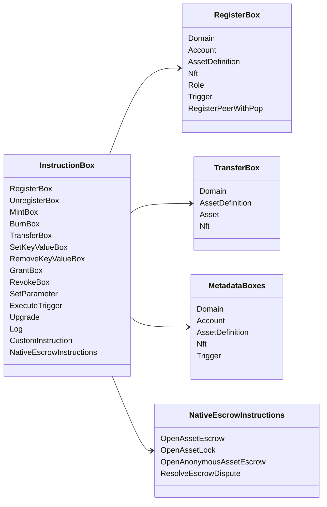

# Iroha အထူးညွှန်ကြားချက်များ {#iroha-special-instructions}

လက်ရှိ ဒေတာပုံစံက ဒီအဖွဲ့ဝင် ညွှန်ကြားမှု မိသားစုတွေကို ဖေါ်ပြထားပါတယ်-

| သင်ကြားချက် | အမျိုးအစားများ |
| --- | --- |
| [`RegisterBox`](/my/blockchain/instructions.md#un-register) | `Domain`, `Account`, `AssetDefinition`, `Nft`, `Role`, `Trigger`, `RegisterPeerWithPop` |
| [`UnregisterBox`](/my/blockchain/instructions.md#un-register) | `Peer`, `Domain`, `Account`, `AssetDefinition`, `Nft`, `Role`, `Trigger` |
| [`MintBox`](/my/blockchain/instructions.md#mint-burn) | အရေအတွက် `Asset`, trigger repeat များ |
| [`BurnBox`](/my/blockchain/instructions.md#mint-burn) | အရေအတွက် `Asset`, trigger repeat များ |
| [`TransferBox`](/my/blockchain/instructions.md#transfer) | `Domain`, `AssetDefinition`, အရေအတွက် `Asset`, `Nft` |
| [`SetKeyValueBox`](/my/blockchain/instructions.md#setkeyvalue-removekeyvalue) | `Domain`, `Account`, `AssetDefinition`, `Nft`, `Trigger` metadata များ |
| [`RemoveKeyValueBox`](/my/blockchain/instructions.md#setkeyvalue-removekeyvalue) | `Domain`, `Account`, `AssetDefinition`, `Nft`, `Trigger` metadata များ |
| [`GrantBox`](/my/blockchain/instructions.md#grant-revoke) | စာရင်းပေးခွင့်၊ စာရင်းပေးပိုင်ခွင့်၊ စာချုပ်ပေးပိုင်ခွင့် |
| [`RevokeBox`](/my/blockchain/instructions.md#grant-revoke) | အကောင့်မှ ခွင့်ပြုချက်၊ ကဏ္ဍမှ ကဏ္ဍ၊ ကဏ္ဍက ခွင့်ပြုချက်ကို |
| [`SetParameter`](/my/blockchain/instructions.md#setparameter) | Chain Parameters ကို Update လုပ်ပေးပါ |
| [`ExecuteTrigger`](/my/blockchain/instructions.md#executetrigger) | trigger execution |
| [`Upgrade`](/my/blockchain/instructions.md#other-instructions) | executor upgrade ကို |
| [`Log`](/my/blockchain/instructions.md#other-instructions) | အကောင်အထည်ဖော်သူ log entry |
| [`CustomInstruction`](/my/blockchain/instructions.md#other-instructions) | အကောင်အထည်ဖော်သူအတွက် သီးသန့် JSON အသုံးဝင်သော ဝန်ဆောင်မှု |
| [ဒေသခံ အရင်းအမြစ်များ၏ အလှူငွေ](/my/blockchain/escrow.md) | `OpenAssetEscrow`, `AcceptAssetEscrow`, `MarkEscrowPaymentSent`, `ReleaseAssetEscrow`, `CancelAssetEscrow`, `OpenEscrowDispute`, `ResolveEscrowDispute` |
| [ယေဘုယျ အရင်းအမြစ် Lock များ](/my/blockchain/escrow.md#generic-asset-locks) | `OpenAssetLock`, `DrawdownAssetLock`, `CancelAssetLock`, `ExpireAssetLock` |
| [အမည်မသိ အရင်းအမြစ်များအတွက် အာမခံ](/my/blockchain/escrow.md#anonymous-escrow) | `OpenAnonymousAssetEscrow`, `AcceptAnonymousAssetEscrow`, `MarkAnonymousEscrowPaymentSent`, `ReleaseAnonymousAssetEscrow`, `CancelAnonymousAssetEscrow`, `OpenAnonymousEscrowDispute`, `ResolveAnonymousEscrowDispute` |

အပို Iroha 3 မော်ဂျူးတွေက ဒိုမင်အထူး ညွှန်ကြားချက် အမျိုးအစားတွေကို မှတ်ပုံတင်နိုင်တယ်
instruction registry ကနေထုတ်ယူထားသော schema-level list အတွက်
current source tree ကို ကြည့်ပါ [ဒေတာပုံစံ အစီအစဉ်](./data-model-schema.md).

::: details ပြက္ခဒိန်: အခြေခံညွှန်ကြားချက်မိသားစုများ

:::
