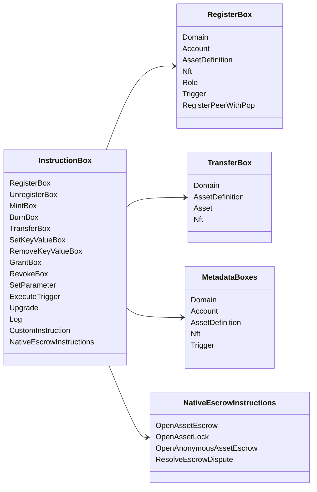

# Iroha အထူးညွှန်ကြားချက်များ {#iroha-special-instructions}

လက်ရှိ ဒေတာမော်ဒယ်က ဒီတည်ဆောက်ထားတဲ့ ညွှန်ကြားမှု မိသားစုတွေကို ဖေါ်ပြတယ်။

|ညွှန်ကြားချက်|အမျိုးအစားများ |
| --- | --- |
| [`RegisterBox`](/my/blockchain/instructions.md#un-register) | `Domain`, `Account`, `AssetDefinition`, `Nft`, `Role`, `Trigger`, `RegisterPeerWithPop` |
| [`UnregisterBox`](/my/blockchain/instructions.md#un-register) | `Peer`, `Domain`, `Account`, `AssetDefinition`, `Nft`, `Role`, `Trigger` |
| [`MintBox`](/my/blockchain/instructions.md#mint-burn) |ကိန်းဂဏန်း `Asset`, trigger ထပ်ကျော့ခြင်း |
| [`BurnBox`](/my/blockchain/instructions.md#mint-burn) |ကိန်းဂဏန်း `Asset`, trigger ထပ်ကျော့ခြင်း |
| [`TransferBox`](/my/blockchain/instructions.md#transfer) |`Domain`, `AssetDefinition`, နံပါတ်များ `Asset`, `Nft` |
| [`SetKeyValueBox`](/my/blockchain/instructions.md#setkeyvalue-removekeyvalue) |`Domain`, `Account`, `AssetDefinition`, `Nft`, `Trigger` မီတာဒေတာများ |
| [`RemoveKeyValueBox`](/my/blockchain/instructions.md#setkeyvalue-removekeyvalue) |`Domain`, `Account`, `AssetDefinition`, `Nft`, `Trigger` မီတာဒေတာများ |
| [`GrantBox`](/my/blockchain/instructions.md#grant-revoke) |စာရင်းဝင်ခွင့်၊ စာရင်းဝင်တာဝန်၊ အခန်းကဏ္ဍကို ခွင့်ပြုချက် |
| [`RevokeBox`](/my/blockchain/instructions.md#grant-revoke) |အကောင့်မှ ခွင့်ပြုချက်၊ အကောင့်မှ အခန်းကဏ္ဍ၊ ကဏ္ဍမှ အခန်းကို ခွင့်ပြုမှု |
| [`SetParameter`](/my/blockchain/instructions.md#setparameter) |Chain parameter ကို update လုပ်ပေးပါ |
| [`ExecuteTrigger`](/my/blockchain/instructions.md#executetrigger) |trigger execution ကို|
| [`Upgrade`](/my/blockchain/instructions.md#other-instructions) |အကောင်အထည်ဖော်သူ အဆင့်မြှင့်တင်ခြင်း |
| [`Log`](/my/blockchain/instructions.md#other-instructions) |အကောင်အထည်ဖော်ရေး မှတ်တမ်းဝင်မှု |
| [`CustomInstruction`](/my/blockchain/instructions.md#other-instructions) | အကောင်အထည်ဖော်သူအတွက် သီးသန့် JSON အသုံးဝင် ဝန်ဆောင်မှု |
| [တိုင်းရင်းသား အရင်းအမြစ်များအတွက် ကန့်သတ်ချက် ](/my/blockchain/escrow.md) | `OpenAssetEscrow`, `AcceptAssetEscrow`, `MarkEscrowPaymentSent`, `ReleaseAssetEscrow`, `CancelAssetEscrow`, `OpenEscrowDispute`, `ResolveEscrowDispute` |
| [အထွေထွေအရင်းအမြစ်ပိတ်ခြင်းများ ](/my/blockchain/escrow.md#generic-asset-locks) |`OpenAssetLock`, `DrawdownAssetLock`, `CancelAssetLock`၊ `ExpireAssetLock` |
| [အမည်မသိ အရင်းအမြစ်အထောက်အထား ](/my/blockchain/escrow.md#anonymous-escrow) | `OpenAnonymousAssetEscrow`, `AcceptAnonymousAssetEscrow`, `MarkAnonymousEscrowPaymentSent`, `ReleaseAnonymousAssetEscrow`, `CancelAnonymousAssetEscrow`, `OpenAnonymousEscrowDispute`, `ResolveAnonymousEscrowDispute` |

နောက်ထပ် Iroha 3 မော်ဂျူးများသည် ညွှန်ကြားချက်စာရင်းမှတစ်ဆင့် ဒိုမင်သတ်မှတ်ထားသော ညွှန်ပြမှုအမျိုးအစားများကို မှတ်ပုံတင်နိုင်သည်။ လက်ရှိအရင်းအမြစ်ပင်မှထုတ်လုပ်သည့် စကေးမားအဆင့် စာရင်းအတွက် [Data Model Schema](./data-model-schema.md) ကိုကြည့်ပါ။

::: details ပြက္ခဒိန်: အခြေခံညွှန်ကြားချက် မိသားစုများ

:::
