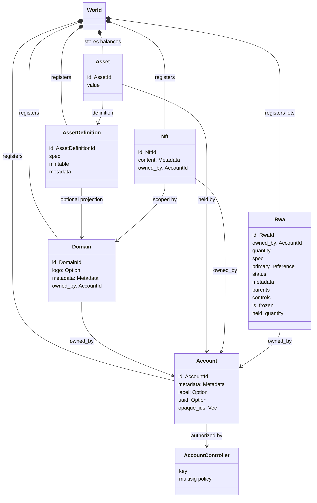
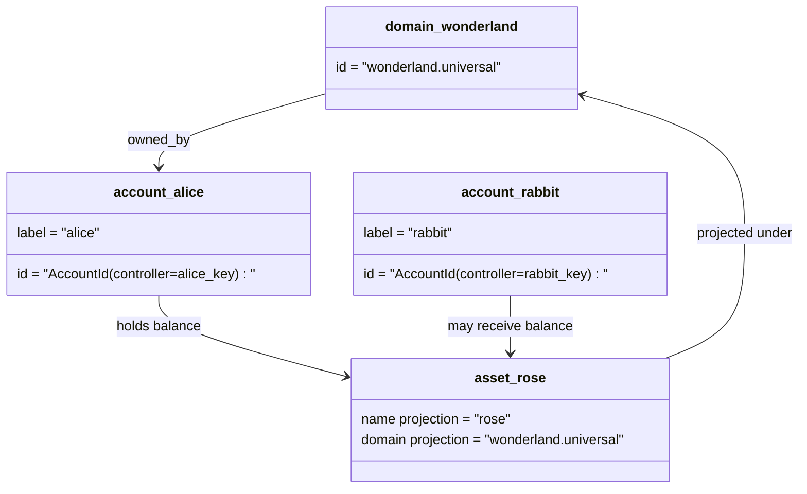

# Modelo de Dados {#data-model}

Iroha armazena o estado do livro-razão da blockchain no `World`. Seu modelo de dados da primeira versão utiliza as seguintes identidades e entidades canônicas:

- os domínios são qualificados por espaço de dados, por exemplo `payments.universal`
- as contas são canônicas e sem domínio; o ID da conta é derivado do controlador da conta
- definições de ativos podem manter uma projeção de domínio/nome, mas seu endereço textual canônico é um identificador opaco Base58
- ativos são saldos mantidos por contas para uma definição específica de ativo
- NFTs são registros exclusivamente possuídos com IDs qualificados por domínio e conteúdo de metadados
- RWAs são lotes de ID gerados que representam ativos fora da cadeia com proprietário atual, quantidade, proveniência, metadados, retenções, congelamentos e controles de ciclo de vida

## Exemplo {#example}

Em uma rede Iroha 3, `wonderland.universal` é um domínio dentro do espaço de dados `universal`. As contas canônicas neste exemplo são controladas por suas chaves ou políticas e codificadas como IDs de conta I105 sem domínio. Rótulos legíveis, como `alice@wonderland.universal`, são aliases separados vinculados a esses IDs. Uma definição de ativo projetado ainda pode ser construída a partir de um domínio e nome, como `rose` em `wonderland.universal`, enquanto o endereço da definição de ativo canônica usado na transmissão do protocolo é o endereço Base58 gerado.

## Apelidos {#aliases}

Aliases são nomes voltados para humanos sobrepostos aos identificadores canônicos do livro-razão da blockchain. Eles são úteis em API, CLI, carteiras e limites de exploradores, mas os IDs canônicos continuam sendo os identificadores estáveis armazenados em campos rigorosos do livro-razão da blockchain.

|Alvo| Alvo canônico |Também literal|Modelo de suporte|
| -------------- | --------------------------------------------------- | ------------------------------------------------------ | ----------------------------------------------------------------------------- |
|Conta de usuário|domínio sem `AccountId` codificado como um endereço I105| `name@domain.dataspace` ou `name@dataspace`            | `AccountAlias`; alias principal é `Account.label`, aliases extras são bindings |
|Definição de ativo|endereçamento Base58 canônico `AssetDefinitionId`| `name#domain.dataspace` ou `name#dataspace`            |`AssetDefinitionAlias` vinculado a uma definição de ativo|
|Contrato|Bech32m canônico `ContractAddress`| `name::domain.dataspace` ou `name::dataspace`          | `ContractAlias` vinculado a um endereço de contrato implantado|
|Nome de domínio| `DomainId` em `domain.dataspace` forma               | `domain.dataspace`                                    | SNS `domain` registro de namespace                                                 |
|Nome do espaço de dados|numérico `DataSpaceId` do catálogo ativo Nexus|alias de espaço de dados como `universal`, `paynet` ou `zk`| SNS `dataspace` registro de namespace mais o catálogo de espaço de dados ativo|

Aliases de conta são os nomes de conta visíveis ao usuário. Eles permanecem mesmo após a mudança de chave da conta porque o alias aponta para o ID da conta ativa através de índices do estado global e registros de mudança de chave da conta. Use `SetPrimaryAccountAlias` para o rótulo principal da conta, `SetAccountAliasBinding` para aliases adicionais não principais, e `FindAccountByAlias` ou `FindAliasesByAccountId` para leituras. Aliases de conta normalmente requerem um aluguel de alias de conta ativo SNS adquirido com `AcquireAccountAliasLease` e renovado com `RenewAccountAliasLease`.

Aliases de ativos nomeiam definições de ativos, não saldos individuais de contas. Aliases de ativos e aliases de contrato são ligações diretas de um nome legível para um destino canônico existente. Os aliases de ativos são definidos com `SetAssetDefinitionAlias`; o segmento do nome do alias deve corresponder ao nome de exibição da definição do ativo ou ao nome da definição projetada. Os aliases de contrato são definidos com `SetContractAlias`; o alias dataspace deve corresponder ao dataspace codificado no endereço do contrato. Ambas as vinculações podem carregar `lease_expiry_ms`; após a expiração, elas deixam de resolver quando a janela de carência termina e são removidas dos índices do estado mundial.

Domínios não possuem um objeto `DomainAlias` separado. Um identificador de domínio já é um nome qualificado por espaço de dados, como `payments.universal`. SNS rastreia a propriedade do aluguel para nomes de domínio no namespace `domain` e para aliases de espaço de dados no namespace `dataspace`. O alias de espaço de dados reservado `universal` deve permanecer definido.

## Documentos relacionados {#related-docs}

| Tópico                                  |Para onde ir|
| -------------------------------------- | ------------------------------------------- |
|Domínios| [Domínios](/pt/blockchain/domains.md)           |
|Contas| [Contas](/pt/blockchain/accounts.md)         |
|Ativos| [Ativos](/pt/blockchain/assets.md)             |
| NFTs                                   | [NFTs](/pt/blockchain/nfts.md)                 |
|Ativos do mundo real| [Ativos do Mundo Real](/pt/blockchain/rwas.md)    |
|Metadados| [Metadados](/pt/blockchain/metadata.md)         |
|Instruções de registro e transferência| [Instruções](/pt/blockchain/instructions.md) |
|permissões de tempo de execução do software| [Permissões](/pt/blockchain/permissions.md)   |
|Regras de nomenclatura| [Regras de nomenclatura](/pt/reference/naming.md)        |
