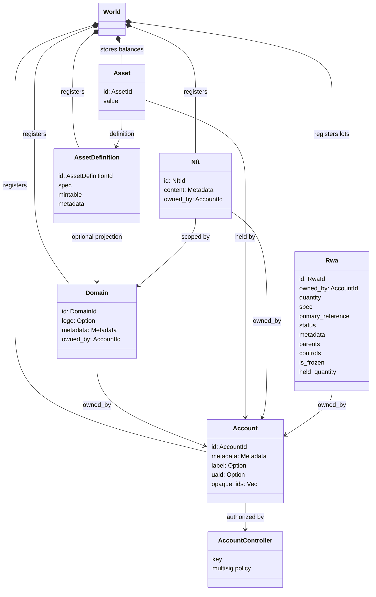
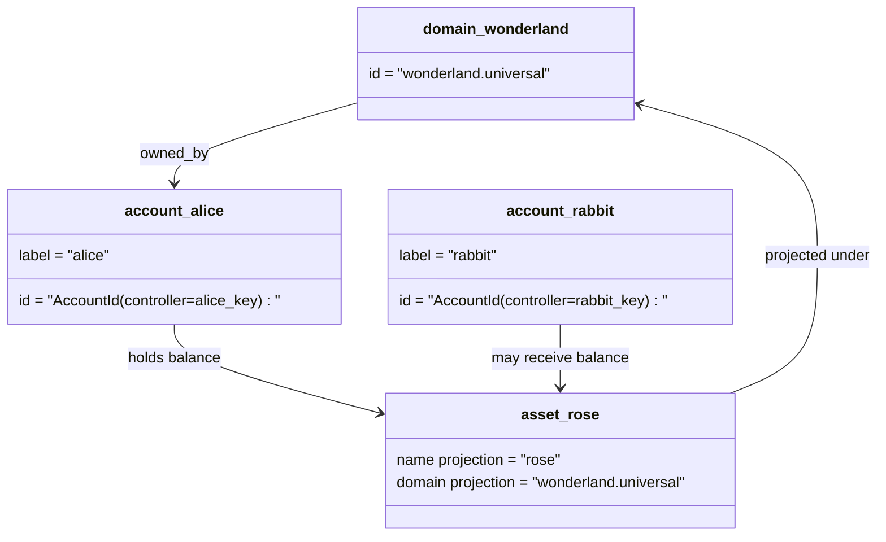

# Modelo de dados {#data-model}

Iroha armazena o estado do livro-razão no `World`. O modelo de dados da primeira edição utiliza as seguintes identidades e entidades canônicas:

- Os domínios são qualificados para o espaço de dados, por exemplo `payments.universal`
- As contas são canônicas e sem domínio; a conta ID é derivada do responsável pelo controlo da conta.
- As definições de ativos podem manter uma projeção de domínio/nome, mas o seu endereço textual canônico é um identificador Base58 opaco
- Ativos são saldos detidos por contas para uma definição específica de ativo.
- NFTs são registos de propriedade exclusiva com conteúdo de metadados e domínio-qualified IDs
- RWAs são gerados-ID lotes que representam ativos fora da cadeia com controle do proprietário atual, quantidade, proveniência, metadados, reservas, congelamento e ciclo de vida.

## Exemplo {#example}

Em uma rede Iroha 3, `wonderland.universal` é um domínio dentro do espaço de dados `universal`. As contas canônicas neste exemplo são controladas por suas chaves ou políticas e codificadas como conta sem domínio I105 IDs. Rótulos legíveis como `alice@wonderland.universal` são alias separados ligados a esses IDs. Uma definição de ativo projetada ainda pode ser construída a partir de um domínio e nome, como `rose` em `wonderland.universal`, enquanto o endereço canônico de definição do ativo utilizado no fio é o endereçamento Base58 gerado.

## Alias {#aliases}

Os pseudónimos são nomes de pessoas em camadas sobre identificadores canônicos do livro maior. Eles são úteis nos limites API, CLI, carteira e explorador, mas os identificadores canónicos IDs permanecem os identificadores estáveis armazenados em campos rígidos do livro maior .

|Alvo .|Alvo canônico |Alias literalmente |Modelo de apoio |
| -------------- | --------------------------------------------------- | ------------------------------------------------------ | ----------------------------------------------------------------------------- |
|Conta de utilizador |sem domínio `AccountId` codificado como endereço de I105 |`name@domain.dataspace` ou `name@dataspace` |`AccountAlias`; alias primário é `Account.label`, aliases extras são vinculativos |
|Definição de activos |canônico `AssetDefinitionId` Endereço Base58 |`name#domain.dataspace` ou `name#dataspace` |`AssetDefinitionAlias` vinculado a uma definição de ativo |
|Contrato |canônica Bech32m `ContractAddress` |`name::domain.dataspace` ou `name::dataspace` |`ContractAlias` vinculado a um endereço de contrato implantado |
|Nome de domínio |`DomainId` em formato `domain.dataspace` |`domain.dataspace` |SNS `domain` Registo do espaço de nomes |
|Nome do espaço de dados |Número `DataSpaceId` do catálogo ativo Nexus |Alias de espaço de dados, como `universal`, `paynet` ou `zk` |SNS `dataspace` registro do espaço de nomes mais o catálogo ativo do espaço de dados |

Os pseudónimos de conta são os nomes das contas orientadas para o usuário. Eles sobrevivem à redefinição da conta porque os pseudônimos apontam para a conta ativa ID através de índices do estado mundial e registros de redefinição de conta. Use `SetPrimaryAccountAlias` para o rótulo primário da conta, `SetAccountAliasBinding` para os pseudónimos não primários adicionais e `FindAccountByAlias` ou `FindAliasesByAccountId` para as leituras. Os pseudônimos da conta normalmente exigem um contrato de arrendamento activo do pseudónimo da conta SNS adquirido com `AcquireAccountAliasLease` e renovado com `RenewAccountAliasLease`.

Ativos aliases nome definições de ativos, não saldos de contas individuais. Os pseudónimos dos ativos são definidos com `SetAssetDefinitionAlias`; o segmento de nome do pseudônimo deve corresponder ao nome de exibição da definição do ativo ou ao nome da definição projetada. Os pseudônimos dos contratos são definidos em `SetContractAlias`; o espaço de dados do pseudônomo deve corresponsar ao espaço de dados codificado no endereço do contrato. Ambas as ligações podem transportar `lease_expiry_ms`; após a expiração, elas deixam de se resolver quando a janela de graça passa e são varridas dos índices de estados mundiais.

Os domínios não possuem um objeto `DomainAlias` separado. Um identificador de domínio já é um nome qualificado pelo espaço de dados, como `payments.universal`. SNS acompanha a propriedade do arrendamento dos nomes de domínio no espaço de nomes `domain` e para os alias do espaço de dados no espaço de nome `dataspace`. O alias `universal` de espaço de dados reservado deve permanecer definido.

## Documentos relacionados {#related-docs}

|Tópico .|Para onde ir ?|
| -------------------------------------- | ------------------------------------------- |
|Domínios | [Domínios](/pt/blockchain/domains.md) |
|Contas | [Contas](/pt/blockchain/accounts.md) |
|Ativos | [Ativos](/pt/blockchain/assets.md) |
|NFTs | [NFTs](/pt/blockchain/nfts.md)|
|Ativos reais | [Ativos do mundo real](/pt/blockchain/rwas.md) |
|Metadados | [Metadados](/pt/blockchain/metadata.md) |
|Instruções de registo e transferência | [Instruções](/pt/blockchain/instructions.md) |
|Permissões de execução | [Permissões ](/pt/blockchain/permissions.md) |
|Regras de nomeação | [Regras de nomeação](/pt/reference/naming.md) |
