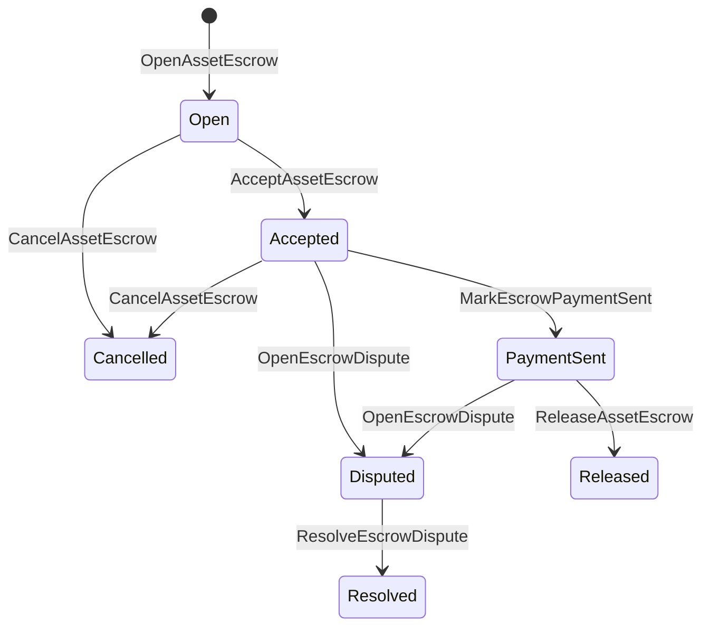

# Escrow de Ativo Nativo {#native-asset-escrow}

Escrow nativo é um mecanismo de custódia gerenciado por um livro-razão para ativos numéricos. Em vez de enviar ativos para uma conta de propriedade do aplicativo e depender do código do aplicativo para proteger essa conta, escrow ISIs mover valor para uma conta de custódia de protocolo determinística e registrar o ciclo de vida do escrow no estado mundial.

Use custódia nativa para liquidação de mercado, coordenação de pagamento fora da cadeia ao estilo Aitai, bloqueios por marcos e fluxos de trabalho de custódia protegida que precisam de estado de ciclo de vida visível no livro razão.

## Conceitos {#concepts}

|Conceito|Descrição|
| --- | --- |
| `EscrowId` |Identificador selecionado pelo chamador que encapsula um hash criptográfico. Deve ser único em depósitos transparentes e anônimos.|
| `AssetEscrowRecord` |Registro transparente de custódia ou bloqueio de ativo numérico.|
| `AnonymousAssetEscrowRecord` |Registro de escrow protegido respaldado por anuladores, compromissos e anexos de prova.|
|Conta de custódia|Conta de protocolo determinística derivada do ID da cadeia, ID do escrow e definição do ativo.|
|Provas de hashes criptográficos|A evidência de hashes criptográficos pode identificar faturas, sentenças, mensagens, manifestos técnicos de armazenamento ou outras evidências fora da cadeia. O próprio payload da evidência não é armazenado no registro do escrow.|

Registros transparentes contêm o vendedor, comprador opcional, definição do ativo, valor total, conta de custódia, status do ciclo de vida, tipo de comportamento, valor restante, principal de autorização de liberação opcional, carimbo de data/hora de expiração opcional, hashes criptográficos de evidência, carimbos de data/hora e detalhes de resolução opcionais.

Os valores em custódia devem ser quantidades numéricas de ativos positivas e devem corresponder à especificação numérica da definição do ativo. Enquanto uma custódia ou bloqueio estiver ativo, transferências genéricas de ativos não podem esgotar a conta de custódia; os caminhos de saída da custódia são a custódia ISIs descrita abaixo.

## Depósito em garantia do mercado {#marketplace-escrow}

O escrow do marketplace coordena a liberação de um ativo on-chain com um fluxo de pagamento ou entrega off-chain.



| ISI |Quem o submete|Efeito|
| --- | --- | --- |
| `OpenAssetEscrow` |Vendedor|Bloqueia o ativo numérico do vendedor na custódia do protocolo e cria um registro de mercado `Open`.|
| `AcceptAssetEscrow` |Comprador|Registra o comprador e move `Open` para `Accepted`. O vendedor não pode aceitar seu próprio escrow.|
| `MarkEscrowPaymentSent` |Comprador aceito|Move `Accepted` para `PaymentSent` depois que o comprador enviar o pagamento fora da cadeia.|
| `ReleaseAssetEscrow` |Vendedor|Move `PaymentSent` para `Released` e transfere o valor total em custódia para o comprador.|
| `CancelAssetEscrow` |Vendedor|Move `Open` ou `Accepted` para `Cancelled` e reembolsa o vendedor antes que o pagamento seja marcado.|
| `OpenEscrowDispute` |Vendedor ou comprador aceito|Move `Accepted` ou `PaymentSent` para `Disputed` e anexa hashes criptográficos de evidência.|
| `ResolveEscrowDispute` |Conta com `CanResolveEscrowDispute`|Move `Disputed` para `Resolved` e divide o valor entre comprador e vendedor.|

Os valores de resolução de disputas devem ser não negativos, e `buyer_amount + seller_amount` deve ser igual ao valor do depósito em garantia. Caminhos com valor zero são permitidos, mas a divisão inteira deve contabilizar o saldo bloqueado.

### Rust Exemplo {#rust-example}

Este exemplo assume que as contas do vendedor e do comprador já existem, a definição do ativo está registrada como numérica e o vendedor possui saldo suficiente.

```rust
use iroha::{
    client::Client,
    data_model::{
        isi::escrow::{
            AcceptAssetEscrow, MarkEscrowPaymentSent, OpenAssetEscrow,
            ReleaseAssetEscrow,
        },
        prelude::*,
    },
};
use iroha_crypto::Hash;

fn release_marketplace_escrow(
    seller_client: &Client,
    buyer_client: &Client,
    asset_definition_id: AssetDefinitionId,
) -> eyre::Result<()> {
    let escrow_id = EscrowId::new(Hash::new("docs-marketplace-escrow-001"));

    seller_client.submit_blocking(OpenAssetEscrow::with_evidence_hashes(
        escrow_id,
        asset_definition_id,
        Numeric::from(40_u64),
        vec![Hash::new("invoice:2026-001")],
    ))?;

    buyer_client.submit_blocking(AcceptAssetEscrow::new(escrow_id))?;
    buyer_client.submit_blocking(MarkEscrowPaymentSent::new(escrow_id))?;
    seller_client.submit_blocking(ReleaseAssetEscrow::new(escrow_id))?;

    let record = seller_client.query_single(FindAssetEscrowById::new(escrow_id))?;
    assert_eq!(record.status, AssetEscrowStatus::Released);
    assert_eq!(record.remaining_amount, Numeric::zero());

    Ok(())
}
```

## Trancas de Ativos Genéricas {#generic-asset-locks}

Bloqueios de ativos usam o mesmo tipo de registro de custódia, mas não são ofertas de comprador-vendedor. Eles bloqueiam fundos para uma conta de destino e, opcionalmente, exigem um principal de autorização de liberação separado para sacar os fundos.

| ISI |Quem o submete|Efeito|
| --- | --- | --- |
| `OpenAssetLock` |Conta de origem|Bloqueia um valor positivo, registra o destino como o comprador do registro e define o status como `Locked`.|
| `DrawdownAssetLock` |Principal de autorização de liberação, ou destino quando nenhum principal de autorização de liberação estiver definido|Transfere parte ou toda a custódia restante para o destino.|
| `CancelAssetLock` |Abridor de fechadura|Cancela um bloqueio ativo e reembolsa o valor restante ao iniciador.|
| `ExpireAssetLock` |Qualquer principal de autorização de transação após o prazo|Expira um bloqueio com `expires_at_ms` no passado e devolve o valor restante ao abridor.|

`DrawdownAssetLock` mantém o registro em `Locked` enquanto algum valor permanece. Quando o valor restante chega a zero, o status se torna `DrawnDown` e o registro é encerrado.

```rust
use iroha::{
    client::Client,
    data_model::{
        isi::escrow::{CancelAssetLock, DrawdownAssetLock, ExpireAssetLock, OpenAssetLock},
        prelude::*,
    },
};
use iroha_crypto::Hash;

fn drawdown_and_close_asset_locks(
    opener_client: &Client,
    destination_client: &Client,
    release_authority_client: &Client,
    asset_definition_id: AssetDefinitionId,
    destination: AccountId,
    release_authority: AccountId,
) -> eyre::Result<()> {
    let trusted_lock_id = EscrowId::new(Hash::new("docs-asset-lock-trusted"));

    opener_client.submit_blocking(OpenAssetLock::with_options(
        trusted_lock_id,
        asset_definition_id.clone(),
        destination.clone(),
        Numeric::from(40_u64),
        Some(release_authority),
        None,
        vec![Hash::new("milestone-plan-v1")],
    ))?;

    release_authority_client.submit_blocking(DrawdownAssetLock::new(
        trusted_lock_id,
        Numeric::from(15_u64),
    ))?;

    let partially_drawn =
        opener_client.query_single(FindAssetEscrowById::new(trusted_lock_id))?;
    assert_eq!(partially_drawn.status, AssetEscrowStatus::Locked);
    assert_eq!(partially_drawn.remaining_amount, Numeric::from(25_u64));

    opener_client.submit_blocking(CancelAssetLock::new(trusted_lock_id))?;
    let cancelled = opener_client.query_single(FindAssetEscrowById::new(trusted_lock_id))?;
    assert_eq!(cancelled.status, AssetEscrowStatus::Cancelled);

    let expiring_lock_id = EscrowId::new(Hash::new("docs-asset-lock-expiring"));
    opener_client.submit_blocking(OpenAssetLock::with_options(
        expiring_lock_id,
        asset_definition_id,
        destination,
        Numeric::from(10_u64),
        None,
        Some(0),
        Vec::new(),
    ))?;

    destination_client.submit_blocking(ExpireAssetLock::new(expiring_lock_id))?;
    let expired = opener_client.query_single(FindAssetEscrowById::new(expiring_lock_id))?;
    assert_eq!(expired.status, AssetEscrowStatus::Expired);

    Ok(())
}
```

Python atualmente expõe auxiliares de alto nível para bloqueios genéricos: `open_asset_lock`, `drawdown_asset_lock`, `cancel_asset_lock` e `expire_asset_lock`. Para o mercado e escrow anônimo de Python, use o `InstructionBox` canônico JSON através da escotilha de escape JSON do SDK, ou envie através de um SDK que expõe construtores de custódia de primeira classe.

## Disputas {#disputes}

Um escrow de marketplace pode entrar em disputa a partir de `Accepted` ou `PaymentSent`. Apenas o vendedor ou comprador registrado pode abrir a disputa. A resolução requer `CanResolveEscrowDispute`, seja concedida diretamente à conta do resolvedor ou herdada por meio de um papel.

```rust
use iroha::{
    client::Client,
    data_model::{
        isi::escrow::{OpenEscrowDispute, ResolveEscrowDispute},
        prelude::*,
    },
};
use iroha_crypto::Hash;
use iroha_executor_data_model::permission::escrow::CanResolveEscrowDispute;

fn resolve_disputed_escrow(
    admin_client: &Client,
    buyer_client: &Client,
    court_client: &Client,
    court: AccountId,
    escrow_id: EscrowId,
) -> eyre::Result<()> {
    admin_client.submit_blocking(Grant::account_permission(
        Permission::from(CanResolveEscrowDispute),
        court,
    ))?;

    buyer_client.submit_blocking(OpenEscrowDispute::with_evidence_hashes(
        escrow_id,
        vec![Hash::new("buyer-payment-receipt")],
    ))?;

    court_client.submit_blocking(ResolveEscrowDispute::with_evidence_hashes(
        escrow_id,
        Numeric::from(30_u64),
        Numeric::from(10_u64),
        vec![Hash::new("court-judgement-001")],
    ))?;

    let record = admin_client.query_single(FindAssetEscrowById::new(escrow_id))?;
    assert_eq!(record.status, AssetEscrowStatus::Resolved);
    assert_eq!(
        record.resolution.as_ref().map(|resolution| resolution.buyer_amount.clone()),
        Some(Numeric::from(30_u64)),
    );

    Ok(())
}
```

## Depósito em garantia anônimo {#anonymous-escrow}

O escrow anônimo utiliza o mesmo ciclo de vida do mercado, mas o financiamento e o movimento de fechamento do ativo são protegidos. O registro público ainda armazena vendedor, comprador, status, evidência de hashes criptográficos, carimbos de data/hora e registros de movimentação vinculados a provas. Valores e destinatários dentro de notas protegidas são representados por compromissos, nulificadores e anexos de prova.

|Transparente ISI|Anônimo ISI|
| --- | --- |
| `OpenAssetEscrow` | `OpenAnonymousAssetEscrow` |
| `AcceptAssetEscrow` | `AcceptAnonymousAssetEscrow` |
| `MarkEscrowPaymentSent` | `MarkAnonymousEscrowPaymentSent` |
| `ReleaseAssetEscrow` | `ReleaseAnonymousAssetEscrow` |
| `CancelAssetEscrow` | `CancelAnonymousAssetEscrow` |
| `OpenEscrowDispute` | `OpenAnonymousEscrowDispute` |
| `ResolveEscrowDispute` | `ResolveAnonymousEscrowDispute` |

As ferramentas da carteira ou do provedor devem construir o anexo de prova e as entradas públicas. A abertura cria um compromisso de depósito único. A liberação, o cancelamento e a resolução anônima de disputas devem gastar exatamente um compromisso de depósito e criar os compromissos de saída do comprador, do vendedor ou divididos, conforme exigido pela ação.

```rust
use iroha::{
    client::Client,
    data_model::{
        isi::escrow::{
            AcceptAnonymousAssetEscrow, MarkAnonymousEscrowPaymentSent,
            OpenAnonymousAssetEscrow,
        },
        prelude::*,
        proof::ProofAttachment,
    },
};
use iroha_crypto::Hash;

fn open_anonymous_escrow(
    seller_client: &Client,
    buyer_client: &Client,
    escrow_id: EscrowId,
    asset_definition_id: AssetDefinitionId,
    funding_nullifiers: Vec<[u8; 32]>,
    escrow_commitment: [u8; 32],
    proof: ProofAttachment,
    root_hint: Option<[u8; 32]>,
) -> eyre::Result<()> {
    seller_client.submit_blocking(OpenAnonymousAssetEscrow::with_evidence_hashes(
        escrow_id,
        asset_definition_id,
        funding_nullifiers,
        escrow_commitment,
        proof,
        root_hint,
        vec![Hash::new("shielded-invoice")],
    ))?;

    buyer_client.submit_blocking(AcceptAnonymousAssetEscrow::new(escrow_id))?;
    buyer_client.submit_blocking(MarkAnonymousEscrowPaymentSent::new(escrow_id))?;

    Ok(())
}
```

Para o modelo de transação protegido subjacente, veja [Transações Anônimas](/pt/blockchain/anonymous-transactions.md).

## SDK Uso {#sdk-usage}

O suporte a escrow é exposto de forma diferente através do SDKs. Rust possui o modelo de dados tipado canônico. Python atualmente expõe assistentes genéricos de bloqueio de ativos. JavaScript e TypeScript usam chamadas de host de escrow Kotodama. Kotlin/JVM e Swift fornecem construtores de payload tipados para marketplace e escrow anônimo.

| SDK |Use esta superfície|Escopo|
| --- | --- | --- |
| [Rust](#rust-sdk) | `iroha::data_model::isi::escrow` |Escrow de marketplace, bloqueios genéricos, escrow anônimo, consultas e eventos.|
| [Python](#python-asset-locks) |`Instruction.open_asset_lock`, `TransactionDraft.open_asset_lock` e os auxiliares do cliente `*_and_wait`|Bloqueios genéricos de ativos. O mercado e os auxiliares de depósito anônimo ainda não são métodos de primeira classe Python.|
| [JavaScript / TypeScript](#javascript-and-typescript-kotodama) | `compileKotodamaProgram` de `@iroha/iroha-js/kotodama-compiler` |O anfitrião de escrow liga dentro dos contratos Kotodama.|
| [Kotlin / JVM](#kotlin-and-jvm) | `InstructionTemplate` aulas em `org.hyperledger.iroha.sdk.core.model.instructions` |Modelos de instruções personalizadas para marketplace e escrow anônimo.|
| [Swift / iOS](#swift-and-ios) |`NativeEscrowInstructionBuilders` e `IrohaSDK.build*Escrow*` ajudantes|Marketplaces e depósitos em garantia anônimos Norito JSON cargas de instrução.|

Os exemplos abaixo se concentram na construção de instruções. Financiamento de conta, gerenciamento de assinatura e envio de transações seguem o fluxo normal para cada SDK.

### Rust SDK {#rust-sdk}

Use o Rust SDK quando precisar de cobertura nativa completa ou suporte a consultas/eventos. Os exemplos acima mostram lançamento no marketplace, liquidação genérica de bloqueio, resolução de disputas e construção de escrow anônima com `iroha::data_model::isi::escrow`.

```rust
use iroha::{
    client::Client,
    data_model::{isi::escrow::OpenAssetEscrow, prelude::*},
};
use iroha_crypto::Hash;

fn open_and_read(
    client: &Client,
    asset_definition_id: AssetDefinitionId,
) -> eyre::Result<AssetEscrowRecord> {
    let escrow_id = EscrowId::new(Hash::new("docs-rust-sdk-escrow"));

    client.submit_blocking(OpenAssetEscrow::new(
        escrow_id,
        asset_definition_id,
        Numeric::from(10_u64),
    ))?;

    client.query_single(FindAssetEscrowById::new(escrow_id))
}
```

### Python Bloqueios de Ativos {#python-asset-locks}

O Python SDK expõe auxiliares de primeira classe para bloqueios de ativos genéricos. Use-os para pagamentos de marcos, saques por um principal de autorização de liberação, cancelamento pelo abridor e reembolsos por expiração.

```python
client.open_asset_lock_and_wait(
    chain_id="dev-chain",
    authority="<source-account-id>",
    private_key_hex="<source-private-key-hex>",
    escrow_id="merchant-lock-001",
    asset_definition_id="<asset-definition-base58>",
    destination="<destination-account-id>",
    amount="2500",
    release_authority="<trusted-release-account-id>",
    expires_at_ms=1_704_000_000_000,
)

client.drawdown_asset_lock_and_wait(
    chain_id="dev-chain",
    authority="<trusted-release-account-id>",
    private_key_hex="<trusted-release-private-key-hex>",
    escrow_id="merchant-lock-001",
    amount="1000",
)

client.expire_asset_lock_and_wait(
    chain_id="dev-chain",
    authority="<any-account-id>",
    private_key_hex="<any-private-key-hex>",
    escrow_id="merchant-lock-001",
)
```

Para um bloqueio de duas partes, omita `release_authority`; a conta de destino então pode enviar `drawdown_asset_lock`.

### JavaScript e TypeScript Kotodama {#javascript-and-typescript-kotodama}

O JavaScript SDK atualmente não expõe construtores diretos de transações de escrow nativas. Para aplicativos JavaScript ou TypeScript que implantam contratos Kotodama, compile as chamadas do host de escrow com o compilador Kotodama.

Chamadas de host de custódia nativas exigem dicas de acesso explícitas porque o compilador não consegue derivar conjuntos de acesso mais restritos para custódia opaca ISIs. Use dicas curinga em pontos de entrada exportados que chamam builtins `escrow_*`.

```js
import { compileKotodamaProgram } from "@iroha/iroha-js/kotodama-compiler";

const source = `
seiyaku MarketplaceEscrow {
  meta { abi_version: 1; }

  #[access(read="*", write="*")]
  kotoage fn run() permission(Admin) {
    let asset = asset_definition("62Fk4FPcMuLvW5QjDGNF2a4jAmjM");
    let offer = name("aitai_offer");
    let evidence = norito_bytes("00");

    call escrow_open_offer(offer, asset, 10, evidence);
    call escrow_accept(offer);
    call escrow_mark_payment_sent(offer);
    call escrow_release(offer);
  }
}
`;

const compiled = compileKotodamaProgram(source, {
  sourceName: "escrow.ko",
});

if (compiled.diagnostics.length > 0) {
  throw new Error(compiled.diagnostics.map((item) => item.message).join("\n"));
}
```

Para disputas, use `escrow_open_dispute(offer, evidence)` e `escrow_resolve_dispute(offer, buyer_amount, seller_amount, evidence)`. Chamadas de host de depósito anônimo aceitam bytes de carga de solicitação Norito, por exemplo `anonymous_escrow_open_offer(request)`.

### Kotlin e JVM {#kotlin-and-jvm}

Os modelos Kotlin/JVM SDK incorporam custódia nativa como templates de instrução personalizados. Cada template valida os campos obrigatórios e expõe o mapa de argumentos canônico usado pelo construtor de transações.

```kotlin
import org.hyperledger.iroha.sdk.core.model.escrow.NativeEscrowPermissions
import org.hyperledger.iroha.sdk.core.model.instructions.AcceptAssetEscrowInstruction
import org.hyperledger.iroha.sdk.core.model.instructions.MarkEscrowPaymentSentInstruction
import org.hyperledger.iroha.sdk.core.model.instructions.OpenAssetEscrowInstruction
import org.hyperledger.iroha.sdk.core.model.instructions.ReleaseAssetEscrowInstruction
import org.hyperledger.iroha.sdk.core.model.instructions.ResolveEscrowDisputeInstruction

val open = OpenAssetEscrowInstruction(
    escrowId = "escrow-hash",
    assetDefinition = "xor#wonderland",
    amount = "42.5",
    evidenceHashes = listOf("invoice-hash"),
)
val accept = AcceptAssetEscrowInstruction("escrow-hash")
val paid = MarkEscrowPaymentSentInstruction("escrow-hash")
val release = ReleaseAssetEscrowInstruction("escrow-hash")
val resolve = ResolveEscrowDisputeInstruction(
    escrowId = "escrow-hash",
    buyerAmount = "30",
    sellerAmount = "12.5",
    evidenceHashes = listOf("judgement-hash"),
)

println(open.arguments)
println(NativeEscrowPermissions.CAN_RESOLVE_ESCROW_DISPUTE)
```

Modelos anônimos estão disponíveis como `OpenAnonymousAssetEscrowInstruction`, `AcceptAnonymousAssetEscrowInstruction`, `MarkAnonymousEscrowPaymentSentInstruction`, `ReleaseAnonymousAssetEscrowInstruction`, `CancelAnonymousAssetEscrowInstruction`, `OpenAnonymousEscrowDisputeInstruction` e `ResolveAnonymousEscrowDisputeInstruction`. Chamadores Java Android podem usar os construtores correspondentes `NativeEscrowInstructions.*` do artefato Android.

### Swift e iOS {#swift-and-ios}

O Swift SDK cria instruções de custódia como cargas Norito JSON. Use `NativeEscrowInstructionBuilders` diretamente, ou chame o auxiliar equivalente `IrohaSDK.build*Escrow*` quando seu aplicativo já possuir uma instância de `IrohaSDK`.

```swift
import IrohaSwift

let open = try NativeEscrowInstructionBuilders.openAssetEscrow(
    escrowId: "escrow-hash",
    assetDefinition: "xor#wonderland",
    amount: "42.5",
    evidenceHashes: ["invoice-hash"]
)
let accept = try NativeEscrowInstructionBuilders.acceptAssetEscrow(
    escrowId: "escrow-hash"
)
let paid = try NativeEscrowInstructionBuilders.markEscrowPaymentSent(
    escrowId: "escrow-hash"
)
let release = try NativeEscrowInstructionBuilders.releaseAssetEscrow(
    escrowId: "escrow-hash"
)
let resolve = try NativeEscrowInstructionBuilders.resolveEscrowDispute(
    escrowId: "escrow-hash",
    buyerAmount: "30",
    sellerAmount: "12.5",
    evidenceHashes: ["judgement-hash"]
)
```

Construtores anônimos Swift pegam listas de anuladores, listas de compromissos de saída, um dicionário de provas e valores opcionais `rootHint`. O token de permissão do resolvedor de disputas está disponível como `NativeEscrowPermissions.canResolveEscrowDispute`.

## Consultas e Eventos {#queries-and-events}

Use consultas de escrow para páginas de status, tarefas de reconciliação e ferramentas de suporte:

|Consulta|Propósito|
| --- | --- |
| `FindAssetEscrowById` |Leia um depósito em garantia ou bloqueio transparente por `EscrowId`.|
| `FindAssetEscrows` |Listar registros transparentes de custódia e bloqueio.|
| `FindAssetEscrowsBySeller` |Listar registros abertos por um vendedor ou destrancador.|
| `FindAssetEscrowsByBuyer` |Liste os depósitos em garantia do mercado aceitos por um comprador ou bloqueios direcionados a um destino.|
| `FindAssetEscrowsByStatus` |Liste os registros por `AssetEscrowStatus`.|
| `FindAnonymousAssetEscrowById` |Leia um depósito em garantia anônimo por `EscrowId`.|
| `FindAnonymousAssetEscrows*` |Liste os depósitos em garantia anônimos por todos os registros, vendedor, comprador ou status.|

`EscrowEventFilter` pode assinar eventos transparentes de escrow nativo e bloqueio por ID de escrow, vendedor, comprador, status e máscara de conjunto de eventos. A família de eventos inclui `Opened`, `Accepted`, `PaymentSent`, `Released`, `Cancelled`, `Expired`, `Disputed` e `Resolved`. Registros de custódia anônimos são inspecionados através das consultas de custódia anônimas.

## Notas Operacionais {#operational-notes}

- Armazene grandes faturas, registros de chat, sentenças ou pacotes de auditoria fora do registro de custódia e anexe seus hashes criptográficos como evidência.
- Use a derivação estável `EscrowId` em aplicações para que novas tentativas não possam criar depósitos duplicados para a mesma oferta.
- Conceda `CanResolveEscrowDispute` apenas a contas ou funções que operam o processo de disputa.
- Trate a verificação de pagamento fora da cadeia como uma política do aplicativo. Iroha registra a custódia e as transições do ciclo de vida; ele não verifica moedas fiduciárias ou canais de pagamento externos por si só.
