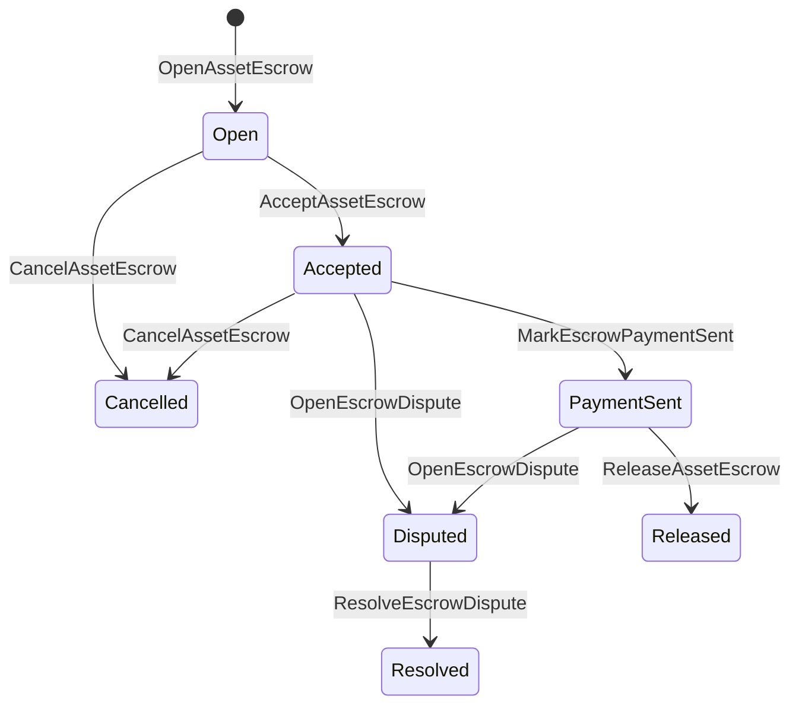

# Escrow de ativos nativos {#native-asset-escrow}

Native escrow é um mecanismo de custódia gerenciado por contabilidade para ativos numéricos. Em vez de enviar activos para uma conta de propriedade do aplicativo e confiar no código do aplicativo para proteger essa conta, O escrow ISIs transfere o valor para uma conta de custódia de protocolo determinista e registra o ciclo de vida do escrow no estado mundial.

Use escrow native para liquidação do mercado, coordenação de pagamentos fora da cadeia no estilo Aitai, fechaduras de marco e fluxos de trabalho de escrow protegidos que precisam de estado de ciclo de vida visível em um livro maior.

## Conceptos {#concepts}

|Conceptos|Descrição |
| --- | --- |
|`EscrowId` |Identificador selecionado pelo chamador envolvendo um hash. Deve ser único entre as fichas de garantia transparentes e anônimas.|
|`AssetEscrowRecord` |Registro de garantia numérico transparente dos ativos ou bloqueio. |
|`AnonymousAssetEscrowRecord` |Registro de garantia protegido apoiado por anuladores, compromissos e fichas de prova. |
|Contas de custódia |Conta de protocolo determinista derivada da cadeia ID, garantia ID e definição de ativo. |
|As evidências .|Os hashes de evidências podem identificar faturas, julgamentos, mensagens, manifestos de armazenamento ou outras provas fora da cadeia.|

Registros transparentes contêm o vendedor, comprador opcional, definição de ativo, valor total, conta de custódia, status do ciclo de vida, tipo de comportamento, montante restante, autoridade de liberação opcional, timestamp de validade opcional, hashes de evidências, timestamps e detalhes de resolução opcionais.

Os montantes do escrow devem ser quantidades numéricas de ativos positivas e devem corresponder às especificações numéricas da definição do ativo. Enquanto um escrow ou bloqueio estiver ativo, as transferências genéricas de activos não podem drenar a conta de custódia; os caminhos de saída da custódia são o escrow ISIs descrito abaixo.

## Escrow de mercado {#marketplace-escrow}

O escrow de mercado coordena uma liberação de ativos na cadeia com um fluxo de trabalho de pagamento ou entrega fora da cadeia.



|ISI |Quem o submete ?|Efeito |
| --- | --- | --- |
|`OpenAssetEscrow` |Vendedor |Localiza o ativo numérico do vendedor na custódia de protocolo e cria um registro no mercado `Open`. |
|`AcceptAssetEscrow` |Comprador |Registram o comprador e transferem `Open` para `Accepted`. O vendedor não pode aceitar a sua própria garantia. |
|`MarkEscrowPaymentSent` |Comprador aceito |Move `Accepted` para `PaymentSent` após o comprador enviar o pagamento fora da cadeia. |
|`ReleaseAssetEscrow` |Vendedor |Move `PaymentSent` para `Released` e transfere o montante total depositado ao comprador. |
|`CancelAssetEscrow` |Vendedor |Move `Open` ou `Accepted` para `Cancelled` e reembolsa o vendedor antes do pagamento ser marcado. |
|`OpenEscrowDispute` |Vendedor ou comprador aceito |Move `Accepted` ou `PaymentSent` para `Disputed` e anexa hashes de evidências. |
|`ResolveEscrowDispute` |Conta com `CanResolveEscrowDispute` |Move a `Disputed` para `Resolved` e divide o montante entre comprador e vendedor. |

Os montantes de resolução de litígios devem ser não negativos e `buyer_amount + seller_amount` devem ser iguais ao montante do depósito em garantia. As pernas de valor zero são permitidas, mas toda a divisão deve dar conta do saldo bloqueado.

### Rust {#rust-example}

Este exemplo pressupõe que as contas do vendedor e do comprador já existem, a definição de ativo é registada numérica e o vendedor tem um saldo suficiente.

```rust
use iroha::{
    client::Client,
    data_model::{
        isi::escrow::{
            AcceptAssetEscrow, MarkEscrowPaymentSent, OpenAssetEscrow,
            ReleaseAssetEscrow,
        },
        prelude::*,
    },
};
use iroha_crypto::Hash;

fn release_marketplace_escrow(
    seller_client: &Client,
    buyer_client: &Client,
    asset_definition_id: AssetDefinitionId,
) -> eyre::Result<()> {
    let escrow_id = EscrowId::new(Hash::new("docs-marketplace-escrow-001"));

    seller_client.submit_blocking(OpenAssetEscrow::with_evidence_hashes(
        escrow_id,
        asset_definition_id,
        Numeric::from(40_u64),
        vec![Hash::new("invoice:2026-001")],
    ))?;

    buyer_client.submit_blocking(AcceptAssetEscrow::new(escrow_id))?;
    buyer_client.submit_blocking(MarkEscrowPaymentSent::new(escrow_id))?;
    seller_client.submit_blocking(ReleaseAssetEscrow::new(escrow_id))?;

    let record = seller_client.query_single(FindAssetEscrowById::new(escrow_id))?;
    assert_eq!(record.status, AssetEscrowStatus::Released);
    assert_eq!(record.remaining_amount, Numeric::zero());

    Ok(())
}
```

## Localização de activos genéricos {#generic-asset-locks}

Os bloqueios de ativos usam o mesmo tipo de registro de custódia, mas não são ofertas do comprador ao vendedor. Eles bloqueiam fundos para uma conta de destino e opcionalmente exigem uma autoridade de liberação separada para retirar os fundos.

|ISI |Quem o submete ?|Efeito |
| --- | --- | --- |
|`OpenAssetLock` |Conta fonte |Localiza um montante positivo, registra o destino como comprador registrado e define o estado em `Locked`. |
|`DrawdownAssetLock` |Autoridade de liberação, ou destino quando nenhuma autoridade de liberação for definida |Transferir parte ou a totalidade da custódia restante para o destino.|
|`CancelAssetLock` |Abre a fechadura .|Cancela uma fechadura ativa e reembolsa o montante restante ao operador. |
|`ExpireAssetLock` |Qualquer autoridade de transacção após o prazo |Expirar um bloqueio com `expires_at_ms` no passado e reembolsar o montante restante ao operador. |

`DrawdownAssetLock` mantém o registro em `Locked` enquanto permanece algum valor. Quando o montante restante atinge zero, o status torna-se `DrawnDown` e o registro é fechado.

```rust
use iroha::{
    client::Client,
    data_model::{
        isi::escrow::{CancelAssetLock, DrawdownAssetLock, ExpireAssetLock, OpenAssetLock},
        prelude::*,
    },
};
use iroha_crypto::Hash;

fn drawdown_and_close_asset_locks(
    opener_client: &Client,
    destination_client: &Client,
    release_authority_client: &Client,
    asset_definition_id: AssetDefinitionId,
    destination: AccountId,
    release_authority: AccountId,
) -> eyre::Result<()> {
    let trusted_lock_id = EscrowId::new(Hash::new("docs-asset-lock-trusted"));

    opener_client.submit_blocking(OpenAssetLock::with_options(
        trusted_lock_id,
        asset_definition_id.clone(),
        destination.clone(),
        Numeric::from(40_u64),
        Some(release_authority),
        None,
        vec![Hash::new("milestone-plan-v1")],
    ))?;

    release_authority_client.submit_blocking(DrawdownAssetLock::new(
        trusted_lock_id,
        Numeric::from(15_u64),
    ))?;

    let partially_drawn =
        opener_client.query_single(FindAssetEscrowById::new(trusted_lock_id))?;
    assert_eq!(partially_drawn.status, AssetEscrowStatus::Locked);
    assert_eq!(partially_drawn.remaining_amount, Numeric::from(25_u64));

    opener_client.submit_blocking(CancelAssetLock::new(
        trusted_lock_id,
        partially_drawn.remaining_amount.clone(),
    ))?;
    let cancelled = opener_client.query_single(FindAssetEscrowById::new(trusted_lock_id))?;
    assert_eq!(cancelled.status, AssetEscrowStatus::Cancelled);

    let expiring_lock_id = EscrowId::new(Hash::new("docs-asset-lock-expiring"));
    opener_client.submit_blocking(OpenAssetLock::with_options(
        expiring_lock_id,
        asset_definition_id,
        destination,
        Numeric::from(10_u64),
        None,
        Some(0),
        Vec::new(),
    ))?;

    destination_client.submit_blocking(ExpireAssetLock::new(expiring_lock_id))?;
    let expired = opener_client.query_single(FindAssetEscrowById::new(expiring_lock_id))?;
    assert_eq!(expired.status, AssetEscrowStatus::Expired);

    Ok(())
}
```

Python atualmente expõe auxiliares de alto nível para fechaduras genéricas: `open_asset_lock`, `drawdown_asset_lock`, `cancel_asset_lock`, e `expire_asset_lock`. Para o mercado e a garantia anônima Python, uso canônico `InstructionBox` JSON através do SDK O que é ? JSON escape hatch, ou submeter-se através de um SDK O que expõe os construtores de fiança de primeira classe.

## Disputas {#disputes}

Uma garantia de mercado pode entrar em disputa a partir `Accepted` ou `PaymentSent`. Só o vendedor ou comprador registrado pode abrir a disputa. `CanResolveEscrowDispute`, seja concedida diretamente à conta do resolver ou herdada por meio de um papel.

```rust
use iroha::{
    client::Client,
    data_model::{
        isi::escrow::{OpenEscrowDispute, ResolveEscrowDispute},
        prelude::*,
    },
};
use iroha_crypto::Hash;
use iroha_executor_data_model::permission::escrow::CanResolveEscrowDispute;

fn resolve_disputed_escrow(
    admin_client: &Client,
    buyer_client: &Client,
    court_client: &Client,
    court: AccountId,
    escrow_id: EscrowId,
) -> eyre::Result<()> {
    admin_client.submit_blocking(Grant::account_permission(
        Permission::from(CanResolveEscrowDispute),
        court,
    ))?;

    buyer_client.submit_blocking(OpenEscrowDispute::with_evidence_hashes(
        escrow_id,
        vec![Hash::new("buyer-payment-receipt")],
    ))?;

    court_client.submit_blocking(ResolveEscrowDispute::with_evidence_hashes(
        escrow_id,
        Numeric::from(30_u64),
        Numeric::from(10_u64),
        vec![Hash::new("court-judgement-001")],
    ))?;

    let record = admin_client.query_single(FindAssetEscrowById::new(escrow_id))?;
    assert_eq!(record.status, AssetEscrowStatus::Resolved);
    assert_eq!(
        record.resolution.as_ref().map(|resolution| resolution.buyer_amount.clone()),
        Some(Numeric::from(30_u64)),
    );

    Ok(())
}
```

## Escrow Anônimo {#anonymous-escrow}

A garantia anônima utiliza o mesmo ciclo de vida do mercado, mas os movimentos de financiamento e fechamento dos ativos estão protegidos. O registro público ainda armazena vendedor, comprador, status, hashes de evidências, selos de tempo e registros de movimento ligados a provas. Os montantes e os destinatários dentro das notas protegidas são representados por compromissos, anuladores e anexos de prova.

|Transparente ISI |Anônimo ISI |
| --- | --- |
|`OpenAssetEscrow` |`OpenAnonymousAssetEscrow` |
|`AcceptAssetEscrow` |`AcceptAnonymousAssetEscrow` |
|`MarkEscrowPaymentSent` |`MarkAnonymousEscrowPaymentSent` |
|`ReleaseAssetEscrow` |`ReleaseAnonymousAssetEscrow` |
|`CancelAssetEscrow` |`CancelAnonymousAssetEscrow` |
|`OpenEscrowDispute` |`OpenAnonymousEscrowDispute` |
|`ResolveEscrowDispute` |`ResolveAnonymousEscrowDispute` |

A abertura cria um compromisso de escrow. libertação, cancelamento e resolução anônima de disputas devem gastar exatamente um compromisso em escrow e criar o comprador, vendedor ou compromissos de saída divididos exigidos pela ação.

```rust
use iroha::{
    client::Client,
    data_model::{
        isi::escrow::{
            AcceptAnonymousAssetEscrow, MarkAnonymousEscrowPaymentSent,
            OpenAnonymousAssetEscrow,
        },
        prelude::*,
        proof::ProofAttachment,
    },
};
use iroha_crypto::Hash;

fn open_anonymous_escrow(
    seller_client: &Client,
    buyer_client: &Client,
    escrow_id: EscrowId,
    asset_definition_id: AssetDefinitionId,
    funding_nullifiers: Vec<[u8; 32]>,
    escrow_commitment: [u8; 32],
    proof: ProofAttachment,
    root_hint: Option<[u8; 32]>,
) -> eyre::Result<()> {
    seller_client.submit_blocking(OpenAnonymousAssetEscrow::with_evidence_hashes(
        escrow_id,
        asset_definition_id,
        funding_nullifiers,
        escrow_commitment,
        proof,
        root_hint,
        vec![Hash::new("shielded-invoice")],
    ))?;

    buyer_client.submit_blocking(AcceptAnonymousAssetEscrow::new(escrow_id))?;
    buyer_client.submit_blocking(MarkAnonymousEscrowPaymentSent::new(escrow_id))?;

    Ok(())
}
```

Para o modelo de transação protegido subjacente, ver [Transformações Anônimas ](/pt/blockchain/anonymous-transactions.md).

## SDK Utilização {#sdk-usage}

O apoio ao escrow é exposto de forma diferente em todos os países. SDKs. Rust tem o modelo de dados canônico tipado. Python atualmente expõe os auxiliares genéricos de bloqueio de ativos. JavaScript e TypeScript Utilização Kotodama As chamadas do anfitrião de crédito. Kotlin/JVM e Swift Fornecer construtores de cargas úteis tipografados para mercado e garantia anônima.

|SDK |Use esta superfície .|Ámbito de aplicação |
| --- | --- | --- |
| [Rust](#rust-sdk)|`iroha::data_model::isi::escrow` |Escrow de mercado, fechaduras genéricas, escrow anónimo, consultas e eventos. |
| [Python](#python-asset-locks)|`Instruction.open_asset_lock`, `TransactionDraft.open_asset_lock` e os auxiliares do cliente `*_and_wait` |O mercado e os ajudantes anônimos de depósito não são ainda métodos de primeira classe Python. |
| [JavaScript / TypeScript](#javascript-and-typescript-kotodama) |`compileKotodamaProgram` de `@iroha/iroha-js/kotodama-compiler` |As chamadas de hospedeiro de escravos dentro dos contratos Kotodama. |
| [Kotlin / JVM](#kotlin-and-jvm) |Classe `InstructionTemplate` em `org.hyperledger.iroha.sdk.core.model.instructions` |Mercado e modelos anônimos de instruções personalizadas em escrow. |
| [Swift / iOS](#swift-and-ios) |Auxiliares `NativeEscrowInstructionBuilders` e `IrohaSDK.build*Escrow*` |Mercado e garantia anônima Norito JSON cargas úteis de instruções. |

Os exemplos abaixo se concentram na construção de instruções: o financiamento da conta, a gestão das assinaturas e a apresentação de transacções seguem o fluxo normal para cada SDK.

### Rust SDK {#rust-sdk}

Use o Rust SDK quando precisar de cobertura nativa completa ou suporte a consulta/evento. Os exemplos acima mostram lançamento no mercado, retirada genérica do bloqueio, resolução de litígios e construção anônima de fiança com `iroha::data_model::isi::escrow`.

```rust
use iroha::{
    client::Client,
    data_model::{isi::escrow::OpenAssetEscrow, prelude::*},
};
use iroha_crypto::Hash;

fn open_and_read(
    client: &Client,
    asset_definition_id: AssetDefinitionId,
) -> eyre::Result<AssetEscrowRecord> {
    let escrow_id = EscrowId::new(Hash::new("docs-rust-sdk-escrow"));

    client.submit_blocking(OpenAssetEscrow::new(
        escrow_id,
        asset_definition_id,
        Numeric::from(10_u64),
    ))?;

    client.query_single(FindAssetEscrowById::new(escrow_id))
}
```

### Python Fechaduras de activos {#python-asset-locks}

O Python SDK expõe os auxiliares de primeira classe para bloqueios genéricos de ativos. Usá-los para pagamentos de marco, retiradas por uma autoridade de liberação, cancelamento pelo iniciante e reembolsos após expiração.

```python
client.open_asset_lock_and_wait(
    chain_id="dev-chain",
    authority="<source-account-id>",
    private_key_hex="<source-private-key-hex>",
    escrow_id="merchant-lock-001",
    asset_definition_id="<asset-definition-base58>",
    destination="<destination-account-id>",
    amount="2500",
    release_authority="<trusted-release-account-id>",
    expires_at_ms=1_704_000_000_000,
)

client.drawdown_asset_lock_and_wait(
    chain_id="dev-chain",
    authority="<trusted-release-account-id>",
    private_key_hex="<trusted-release-private-key-hex>",
    escrow_id="merchant-lock-001",
    amount="1000",
)

client.expire_asset_lock_and_wait(
    chain_id="dev-chain",
    authority="<any-account-id>",
    private_key_hex="<any-private-key-hex>",
    escrow_id="merchant-lock-001",
)
```

Para um bloqueio de duas partes, omita `release_authority`; a conta de destino pode então enviar `drawdown_asset_lock`.

### JavaScript e TypeScript Kotodama {#javascript-and-typescript-kotodama}

O JavaScript SDK não expõe atualmente os construtores directos nativos de transações em custódia. Para as aplicações JavaScript ou TypeScript que implementam contratos Kotodama, compilem chamadas de hospedeiro em custódie com o compilador Kotodama.

As chamadas nativas de escrow host exigem sugestões explícitas de acesso porque o compilador não pode derivar conjuntos de acesso mais estreitos para escrow opaco ISIs. Use sugestões de wildcard em pontos de entrada exportados que chamam buildins `escrow_*`.

```js
import { compileKotodamaProgram } from "@iroha/iroha-js/kotodama-compiler";

const source = `
seiyaku MarketplaceEscrow {
  meta { abi_version: 1; }

  #[access(read="*", write="*")]
  kotoage fn run() permission(Admin) {
    let asset = asset_definition("62Fk4FPcMuLvW5QjDGNF2a4jAmjM");
    let offer = name("aitai_offer");
    let evidence = norito_bytes("00");

    call escrow_open_offer(offer, asset, 10, evidence);
    call escrow_accept(offer);
    call escrow_mark_payment_sent(offer);
    call escrow_release(offer);
  }
}
`;

const compiled = compileKotodamaProgram(source, {
  sourceName: "escrow.ko",
});

if (compiled.diagnostics.length > 0) {
  throw new Error(compiled.diagnostics.map((item) => item.message).join("\n"));
}
```

Para disputas, utilize `escrow_open_dispute(offer, evidence)` e `escrow_resolve_dispute(offer, buyer_amount, seller_amount, evidence)`. As chamadas anônimas de hospedeiro em custódia aceitam bytes de carga útil de solicitação Norito, por exemplo, `anonymous_escrow_open_offer(request)`.

### Kotlin e JVM {#kotlin-and-jvm}

A Kotlin/JVM SDK modela escrow nativo como modelos de instruções personalizadas. Cada modelo valida os campos necessários e expõe o mapa canônico de argumentos usado pelo criador de transações.

```kotlin
import org.hyperledger.iroha.sdk.core.model.escrow.NativeEscrowPermissions
import org.hyperledger.iroha.sdk.core.model.instructions.AcceptAssetEscrowInstruction
import org.hyperledger.iroha.sdk.core.model.instructions.MarkEscrowPaymentSentInstruction
import org.hyperledger.iroha.sdk.core.model.instructions.OpenAssetEscrowInstruction
import org.hyperledger.iroha.sdk.core.model.instructions.ReleaseAssetEscrowInstruction
import org.hyperledger.iroha.sdk.core.model.instructions.ResolveEscrowDisputeInstruction

val open = OpenAssetEscrowInstruction(
    escrowId = "escrow-hash",
    assetDefinition = "xor#wonderland",
    amount = "42.5",
    evidenceHashes = listOf("invoice-hash"),
)
val accept = AcceptAssetEscrowInstruction("escrow-hash")
val paid = MarkEscrowPaymentSentInstruction("escrow-hash")
val release = ReleaseAssetEscrowInstruction("escrow-hash")
val resolve = ResolveEscrowDisputeInstruction(
    escrowId = "escrow-hash",
    buyerAmount = "30",
    sellerAmount = "12.5",
    evidenceHashes = listOf("judgement-hash"),
)

println(open.arguments)
println(NativeEscrowPermissions.CAN_RESOLVE_ESCROW_DISPUTE)
```

Os modelos anônimos estão disponíveis como: `OpenAnonymousAssetEscrowInstruction`, `AcceptAnonymousAssetEscrowInstruction`, `MarkAnonymousEscrowPaymentSentInstruction`, `ReleaseAnonymousAssetEscrowInstruction`, `CancelAnonymousAssetEscrowInstruction`, `OpenAnonymousEscrowDisputeInstruction`, e `ResolveAnonymousEscrowDisputeInstruction`. Android Os usuários de Java podem usar a correspondência `NativeEscrowInstructions.*` Construtores da Android Artefacto.

### Swift e iOS {#swift-and-ios}

O Swift SDK constrói instruções de custódia como cargas úteis Norito JSON. Use `NativeEscrowInstructionBuilders` diretamente, ou ligue ao auxiliar equivalente `IrohaSDK.build*Escrow*` quando o seu aplicativo já possui uma instância `IrohaSDK`.

```swift
import IrohaSwift

let open = try NativeEscrowInstructionBuilders.openAssetEscrow(
    escrowId: "escrow-hash",
    assetDefinition: "xor#wonderland",
    amount: "42.5",
    evidenceHashes: ["invoice-hash"]
)
let accept = try NativeEscrowInstructionBuilders.acceptAssetEscrow(
    escrowId: "escrow-hash"
)
let paid = try NativeEscrowInstructionBuilders.markEscrowPaymentSent(
    escrowId: "escrow-hash"
)
let release = try NativeEscrowInstructionBuilders.releaseAssetEscrow(
    escrowId: "escrow-hash"
)
let resolve = try NativeEscrowInstructionBuilders.resolveEscrowDispute(
    escrowId: "escrow-hash",
    buyerAmount: "30",
    sellerAmount: "12.5",
    evidenceHashes: ["judgement-hash"]
)
```

Os construtores anônimos Swift tomam listas de anulação, listas de compromissos de saída, um dicionário de prova e valores opcionais `rootHint`. O token de permissão para resolver disputas está disponível como `NativeEscrowPermissions.canResolveEscrowDispute`.

## Perguntas e Eventos {#queries-and-events}

Usar consultas de escrow para páginas de status, trabalhos de reconciliação e ferramentas de suporte:

|Perguntas .|Propósito |
| --- | --- |
|`FindAssetEscrowById` |Leia uma garantia transparente ou bloqueio por `EscrowId`. |
|`FindAssetEscrows` |Lista de registos transparentes de garantia e bloqueio. |
|`FindAssetEscrowsBySeller` |Lista de registos abertos por um vendedor ou abrindo trancas. |
|`FindAssetEscrowsByBuyer` |Listar as fichas de mercado aceitas por um comprador ou fechar com destino a um destino. |
|`FindAssetEscrowsByStatus` |Lista de registos até `AssetEscrowStatus`. |
|`FindAnonymousAssetEscrowById` |Leia uma garantia anônima por `EscrowId`. |
|`FindAnonymousAssetEscrows*` |Listar as fichas anônimas por todos os registos, vendedor, comprador ou status. |

`EscrowEventFilter` pode subscrever-se a eventos nativos transparentes de custódia e bloqueio por custódia ID, a venda, o comprador, o status e as máscaras de eventos. `Opened`, `Accepted`, `PaymentSent`, `Released`, `Cancelled`, `Expired`, `Disputed`, e `Resolved`. Os registos anônimos são inspeccionados através das consultas anónimas de garantia.

## Notas operacionais {#operational-notes}

- Armazenar grandes faturas, registros de bate-papo, julgamentos ou pacotes de auditoria fora do registro fiduciário e anexar os seus hashes como evidência.
- Utilize a derivação estável `EscrowId` em aplicações para que as retemptadas não possam criar escravos duplicados para a mesma oferta.
- Conceder `CanResolveEscrowDispute` apenas a contas ou funções que operam o processo de litígio.
- Tratar a verificação de pagamentos fora da cadeia como política de aplicação. Iroha registra a custódia e as transições do ciclo de vida; não verifica por si só as vias de pagamento fiduciárias ou externas.
