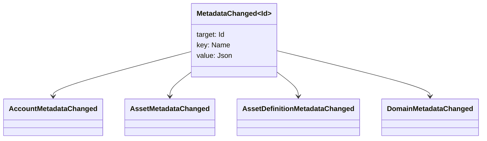

# Metadados {#metadata}

Metadados é um mapa de valor-chave verificado anexado a objetos do livro maior. Chaves são valores `Name` e valores são cargas úteis JSON (`Json`).

Os seguintes objetos podem transportar metadados:

- Domínios
- Contas
- Ativos
- Definições de activos
- NFTs
- RWAs
- desencadeadores
- Transações

Usar metadados para pequenos campos de descrição ou indexação que pertencem ao estado do livro-razão. As grandes cargas úteis devem ser armazenadas fora da WSV e referenciadas por um digest, URI, ou SoraFS caminho.

Para obter orientações sobre a escolha de metadados, ativos NFTs, RWAs ou armazenamento fora da cadeia, ver [Opções de armazenamento de metadatos e ledger ](/pt/guide/configure/metadata-and-store-assets.md).

## Tente em Taira {#try-it-on-taira}

Metadados são visíveis através de leituras normais de recursos. Este comando lista as definições de ativos Taira que atualmente possuem metadados:

```bash
curl -fsS 'https://taira.sora.org/v1/assets/definitions?limit=100' \
  | jq '.items[]
    | select((.metadata | length) > 0)
    | {id, name, metadata}'
```

Usar o mesmo padrão para domínios e contas:

```bash
curl -fsS 'https://taira.sora.org/v1/domains?limit=20' \
  | jq '.items[] | select((.metadata // {} | length) > 0)'

curl -fsS 'https://taira.sora.org/v1/accounts?limit=20' \
  | jq '.items[] | select((.metadata // {} | length) > 0)'
```

Tratar a saída vazia como um resultado válido. Significa que a página atual dos objetos Taira não contém metadados, não significa que o ponto final falhou.

## Atualização de Metadados {#updating-metadata}

Os metadados são alterados com as instruções especiais Iroha:

- [`SetKeyValue`](/pt/blockchain/instructions.md#setkeyvalue-removekeyvalue) inserir ou substituir uma chave.
- [`RemoveKeyValue`](/pt/blockchain/instructions.md#setkeyvalue-removekeyvalue) remove uma chave

A autoridade que apresenta a transação deve ter a permissão exigida pelo validador ativo de tempo de execução. Para a superfície de permissão padrão, ver [Permission Tokens](/pt/reference/permissions.md).

## Eventos {#events}

Os eventos de dados são emitidos quando os metadados mudam. A carga útil do evento genérico é `MetadataChanged<Id>`:



Use os filtros de eventos de dados [ ](/pt/blockchain/filters.md#data-event-filters) para subscrever apenas os eventos de metadados para o tipo ou objeto da entidade ID que são importantes para uma integração.

## Questões {#queries}

Metadados são devolvidos como parte do objeto consultado. Por exemplo, use [`FindAccountById`](/pt/reference/queries.md#accounts-and-permissions), [`FindDomainById`](/pt/reference/queries.md#domains-and-peers), ou [`FindAssetDefinitionById`](/pt/reference/queries.md#assets-nfts-and-rwas). Utilização [`FindNfts`](/pt/reference/queries.md#assets-nfts-and-rwas) ou [`FindNftsByAccountId`](/pt/reference/queries.md#assets-nfts-and-rwas) para NFTs, e [`FindRwas`](/pt/reference/queries.md#assets-nfts-and-rwas) para RWA Leia o campo de metadados do objeto. NFT Respostas de consulta expõem o NFT `content` Mapa como os metadados dos registos.

As chaves de metadados fazem parte do estado do livro, por isso mantenha-as estáveis e evite a codificação da versão específica da aplicação para o nome da chave quando um valor JSON pode carregar essa versão explicitamente.
