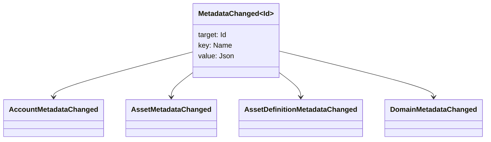

# Metadados {#metadata}

Metadados são um mapa de chave-valor verificado anexado a objetos do registro blockchain. As chaves são valores `Name` e os valores são cargas JSON (`Json`).

Os seguintes objetos podem conter metadados:

- domínios
- contas
- ativos
- definições de ativos
- NFTs
- RWAs
- gatilhos
- transações

Use metadados para pequenos campos descritivos ou de indexação que pertencem ao estado do livro-razão da blockchain. Grandes cargas úteis devem ser armazenadas fora do WSV e referenciadas por um valor de resumo criptográfico, URI, ou caminho SoraFS.

Para saber quando usar metadados, ativos, NFTs, RWAs ou armazenamento externo, consulte [Opções de metadados e armazenamento do livro-razão](/pt/guide/configure/metadata-and-store-assets.md).

## Experimente em Taira {#try-it-on-taira}

Os metadados são visíveis através de leituras normais de recursos. Este comando lista definições de ativos Taira que atualmente possuem metadados:

```bash
curl -fsS 'https://taira.sora.org/v1/assets/definitions?limit=100' \
  | jq '.items[]
    | select((.metadata | length) > 0)
    | {id, name, metadata}'
```

Use o mesmo padrão para domínios e contas:

```bash
curl -fsS 'https://taira.sora.org/v1/domains?limit=20' \
  | jq '.items[] | select((.metadata // {} | length) > 0)'

curl -fsS 'https://taira.sora.org/v1/accounts?limit=20' \
  | jq '.items[] | select((.metadata // {} | length) > 0)'
```

Trate a saída vazia como um resultado válido. Isso significa que a página atual de objetos Taira não possui metadados, e não que o endpoint API falhou.

## Atualizando Metadados {#updating-metadata}

Os metadados são alterados com operações de instrução Iroha:

- [`SetKeyValue`](/pt/blockchain/instructions.md#setkeyvalue-removekeyvalue) insere ou substitui uma chave
- [`RemoveKeyValue`](/pt/blockchain/instructions.md#setkeyvalue-removekeyvalue) remove uma chave

O principal de autorização que está submetendo a transação deve ter a permissão exigida pelo validador de tempo de execução de software ativo. Para a superfície de permissão padrão, veja [Tokens de Permissão](/pt/reference/permissions.md).

## Eventos {#events}

Eventos de dados são emitidos quando os metadados mudam. O payload genérico do evento é `MetadataChanged<Id>`:



Use [filtros de evento de dados](/pt/blockchain/filters.md#data-event-filters) para assinar apenas eventos de metadados para o tipo de entidade ou ID do objeto que importa para uma integração.

## Consultas {#queries}

Metadados são retornados como parte do objeto consultado. Por exemplo, use [`FindAccountById`](/pt/reference/queries.md#accounts-and-permissions), [`FindDomainById`](/pt/reference/queries.md#domains-and-peers), ou [`FindAssetDefinitionById`](/pt/reference/queries.md#assets-nfts-and-rwas). Usar [`FindNfts`](/pt/reference/queries.md#assets-nfts-and-rwas) ou [`FindNftsByAccountId`](/pt/reference/queries.md#assets-nfts-and-rwas) para NFTs, e [`FindRwas`](/pt/reference/queries.md#assets-nfts-and-rwas) para RWA muitos. Em seguida, leia o campo de metadados do objeto. NFT respostas de consulta expõem o NFT `content` mapear como os metadados do registro.

As chaves de metadados fazem parte do estado do livro razão da blockchain, portanto mantenha-as estáveis e evite codificar alterações de versão específicas do aplicativo no nome da chave quando um valor JSON pode conter essa versão explicitamente.
