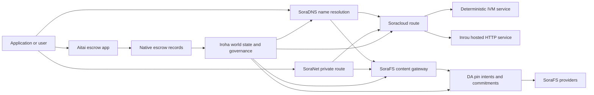

# SORA Nexus serviços {#sora-nexus-services}

SORA Nexus Adiciona aviões de serviço voltados para aplicativos em torno Iroha 3. Estes serviços não são registros separados, mas ancorados por Iroha Estado mundial, Norito Manifestos, registos de governança e Torii As famílias de rota.

A disponibilidade depende da construção do nó e do perfil de rede. Use [`/openapi`](/pt/reference/torii-endpoints.md#app-and-sora-route-families) no nó-alvo como a lista autorizada de rotas habilitadas.

## Mapa de componentes {#component-map}

|Componente |Função |Superfícies principais |
| ---------------------- | ------------------------------------------------------------------------------------------------------------------------------------------- | ---------------------------------------------------------------------------------------- |
|Soracloud |Implementação de aplicações, serviços hospedados, modelo privado/estado de tempo de execução e controlo do ciclo de vida do serviço. |`/v1/soracloud/`, `/api/`, `iroha app soracloud ...` |
|No interior .|Soracloud hospedado HTTP tempo de execução para revisões de serviço que necessitem de um avião HTTP ao vivo. |Soracloud Configuração de tempo de execução, anúncios de capacidade de hospedagem, replica do estado do tempo de execução |
|SoraNet |Privacidade e sobreposição de transporte para circuitos, tráfego de relés, VPN, sessões de ligação e rotas de streaming. |Metadados da rota `/v1/connect/`, `/v1/vpn/`, SoraNet |
|Disponibilidade de dados (DA) |Evidência de disponibilidade, compromisso e camada de intenção para cargas úteis referenciadas pelas vias Nexus, manifestos SoraFS e fluxos de prova. |`/v1/da/`, `FindDaPinIntent`, `[sumeragi.da]` |
|SoraFS |Tecido de armazenamento com endereço de conteúdo para os manifestos, cargas úteis CAR, conteúdo fixado, captações de gateway e fluxos de prova de recuperabilidade. |`/v1/sorafs/`, `/sorafs/`, `FindSorafsProviderOwner` |
|SoraDNS |Determinista de nomeação e camada de atestamento do resolutor para os serviços e conteúdos hospedados em SORA. |`/v1/soradns/`, `/soradns/`, eventos do diretório resolvedores |
|Aitai |Corredor de liquidação fiduciária e de ativos no nível do aplicativo, apoiado por registos de custódia nativos, não por um livro principal separado. | `OpenAssetEscrow`, `FindAssetEscrow*`, `EscrowEventFilter`, Kotodama `escrow_*` edifícios |



## Fluxos comuns {#common-flows}

### Aplicação Split hospedada {#hosted-split-application}

Um aplicativo típico de planos mistos usa todas as peças juntas:

1. Os ativos estáticos do frontend são embalados e fixados em SoraFS.
2. O anfitrião público, por exemplo `<app>.sora`, é registrado através de SoraDNS.
3. As rotas Soracloud `/api/v1/search` ou `/api/v1/stream` para um serviço Inrou HTTP.
4. As rotas Soracloud `/api/auth` e `/api/v1/user` para os manipuladores deterministas IVM.
5. Os clientes que precisam de privacidade podem acessar o mesmo conteúdo ou a rota API através de um circuito SoraNet.

|Caminho .|Avião de apoio .|Porquê ?|
| ----------------- | --------------------- | ------------------------------------------------- |
| `/`               |SoraFS conteúdo estático |Reprodução de conteúdo em cache root e gateway |
|`/assets/*` |SoraFS conteúdo estático |Ativos direcionados ao conteúdo e provas de manifesto |
|`/api/auth*` |Soracloud IVM |Reprodução segura de autor e desafio de carteira |
|`/api/v1/user*` |Soracloud IVM |Mutações de estado sensíveis à governança |
|`/api/v1/search*` |Soracloud Inrou |Serviço HTTP ao vivo, cache, SSE ou estado coletor |

### Publicação de conteúdo {#content-publication}

A publicação SoraFS produz artefatos duráveis antes de um nome apontar para eles:

1. Construir uma carga útil ou um diretório.
2. Encoste-o num arquivo CAR e um plano de pedaços.
3. Construa um manifesto Norito com dados de política de pin e governança.
4. Enviar o manifesto a Torii.
5. Registrar uma intenção ou um compromisso de disponibilidade do pin DA quando o perfil-alvo requer evidências explícitas.
6. Estabelecer o manifesto com um nome SoraDNS ou com uma rota estática de frente Soracloud.

### Tráfego privado ou rota de transmissão {#private-fetch-or-streaming-route}

SoraNet pode sentar-se na frente de SoraFS ou Soracloud:

1. O cliente resolve o nome ou o manifesto.
2. Um diretório de guarda ou um manifesto de rota escolhe os relés de entrada e saída.
3. O tráfego é revestido e enviado através do circuito SoraNet.
4. O relevo de saída atinge a entrada SoraFS, o fluxo Torii ou a rota Soracloud.

## Aitai {#aitai}

Aitai é o corredor de aplicativos SORA para a liquidação no estilo mercado, onde um comprador e um vendedor coordenam um pagamento fora da cadeia enquanto Iroha controla o pagamento. Custódia de ativos em cadeia. Deve utilizar a família nativa de instruções de custódia em vez de uma conta de custódie de propriedade contratual para novos fluxos de custódía numérica dos activos.

A fiança nativa mantém a custódia no livro de contabilidade. `OpenAssetEscrow`, O comprador aceita e marca o pagamento fora da cadeia com: `AcceptAssetEscrow` e `MarkEscrowPaymentSent`, e o vendedor liberta com `ReleaseAssetEscrow` Se o comprador e o vendedor não estiverem de acordo, qualquer das partes pode abrir uma disputa e resolver a questão com `CanResolveEscrowDispute` Pode dividir a quantidade bloqueada.

Para o ciclo de vida inteiro, bloqueios genéricos de ativos, garantia anónima, consultas, eventos e exemplos Rust, ver [Reserva de ativos nativos ](/pt/blockchain/escrow.md).

|Superfície Aitai |Usá-lo para |
| ------------------------------------------------------------------------------------------------------------------------------------------------------------- | ----------------------------------------------------------------------------------------- |
| `OpenAssetEscrow`, `AcceptAssetEscrow`, `MarkEscrowPaymentSent`, `ReleaseAssetEscrow`, `CancelAssetEscrow`                                                    |Ofertas de activos numéricos transparentes, incluindo fluxos de liquidação denominados em XOR. |
| `OpenAnonymousAssetEscrow`, `AcceptAnonymousAssetEscrow`, `MarkAnonymousEscrowPaymentSent`, `ReleaseAnonymousAssetEscrow`, `CancelAnonymousAssetEscrow`       |As ofertas protegidas utilizam anexos de prova para financiamento e fechamento dos movimentos. |
|`OpenEscrowDispute`, `ResolveEscrowDispute`, `OpenAnonymousEscrowDispute`, `ResolveAnonymousEscrowDispute` |Introdução a litígios e resolução judicial. |
|`FindAssetEscrowById`, `FindAssetEscrowsBySeller`, `FindAssetEscrowsByBuyer`, `FindAssetEscrowsByStatus` |Páginas de status do aplicativo, funções de reconciliação e ferramentas de suporte. |
|`EscrowEventFilter` |Subscrições de escrow transparentes ao vivo por identificação de escrow, vendedor, comprador, status ou tipo de evento. |
| Kotodama `escrow_open_offer`, `escrow_accept`, `escrow_mark_payment_sent`, `escrow_release`, `escrow_cancel`, `escrow_open_dispute`, `escrow_resolve_dispute` |Kotodama ligações contratuais apoiadas pelos sistemas de custódia V1. |

Para uso público Taira ou Minamoto, trate a linha de pagamento fora da cadeia e qualquer fluxo de trabalho de suporte ou tribunal como política de aplicação. Iroha registra o estado de custódia, eventos do ciclo de vida, hashes de evidências e movimento final de ativos; não verifica a liquidação fiduciária por si só.

## Verifique um Nodo alvo {#check-a-target-node}

Antes de usar exemplos desta página, confirme que a família de rotas existe no nó que você está direcionando:

```bash
export TORII_URL=https://taira.sora.org

curl -fsS "$TORII_URL/openapi.json" \
  | jq '.paths | keys[] | select(test("^/v1/(soracloud|sorafs|soradns|connect|vpn|da)/"))'

curl -fsS "$TORII_URL/status" | jq .
```

Se o `/openapi.json` não for exposto pelo perfil, tente `/openapi`. A disponibilidade exacta da rota depende das características de construção e configuração da rede.

### Taira Cheques de fumaça apenas para leitura {#taira-read-only-smoke-checks}

O endpoint público Taira é útil para verificações do lado de leitura, mas não o use para exemplos de mutação a menos que você esteja operando uma conta autorizada e pretenda alterar o estado ao vivo.

```bash
export TORII_URL=https://taira.sora.org

curl -fsS "$TORII_URL/status" \
  | jq '{version: .build.version, peers, blocks, lanes: (.teu_lane_commit | length)}'

curl -fsS "$TORII_URL/v1/connect/status" | jq '{enabled, sessions_active}'

curl -fsS "$TORII_URL/v1/vpn/profile" \
  | jq '{available, relay_endpoint, supported_exit_classes}'

curl -fsS "$TORII_URL/v1/sorafs/storage/state" \
  | jq '{bytes_capacity, bytes_used, pin_queue_depth, por_inflight}'

curl -fsS -H 'Accept: application/json' "$TORII_URL/v1/soracloud/status" \
  | jq '.control_plane | {service_count, services: [.services[] | {service_name, current_version}]}'
```

Taira pode expor rotas de plano de controle específicas para a implantação que não estejam listadas no mapa de percurso OpenAPI. Trate `/openapi` como o contrato primário gerado API e confirme, em seguida, qualquer rota específica para a implementação diretamente antes de documentá-la como viva.

## Soracloud {#soracloud}

Soracloud é o plano de controle da aplicação SORA. Ele acompanha os pacotes de implantação, revisões de serviços, roteamento, estado de implementação, entradas de configuração autorizadas, segredos de serviço criptografados, registros do registo de modelos, sessões privadas de inferência e recibos de tempo de execução.

Soracloud utiliza dois aviões de execução:

|Avião de execução |Tempo de execução |Usá-lo para |
| ---------------------- | ------- | -------------------------------------------------------------------------------------------- |
|`DeterministicService` |`Ivm` |Autor, estado do cofre, leituras certificadas, manipuladores de caixas de correio ordenados, mutações sensíveis à governança |
|`HttpService` |`Inrou` |Live HTTP APIs, trabalho pesado de colecionador, serviços com cache-backed, SSE, fluxos assistidos por navegador |

O plano de controle é autoritário. Deploy, upgrade, rollback, config, secret, model e status comandos enviam através Torii e ler estado mundial comprometido; eles não dependem de um espelho local separado CLI . O roteamento público é baseado no prefixo mais longo, de modo que um host registado pode dividir o tráfego entre as rotas HTTP hospedadas e as rotas determinísticas API.

### Escafar um aplicativo dividido {#scaffold-a-split-app}

O modelo de aplicativo dividido cria um frontend estático mais um hospedado ao vivo API e um serviço determinístico vault/API:

```bash
iroha app soracloud app init \
  --template split-app \
  --app-name solswap_indexer \
  --app-version 0.1.0 \
  --public-host solswap-indexer.sora \
  --output-dir ./apps/solswap-indexer

iroha app soracloud app local-plan \
  --manifest ./apps/solswap-indexer/app_manifest.json

iroha app soracloud app doctor \
  --manifest ./apps/solswap-indexer/app_manifest.json
```

`local-plan` imprime a divisão de rota, os manifestos de serviço infantil, os caminhos do script do espaço de trabalho e o modo de publicação esperado no frontend. `doctor` valida o contrato de lançamento local antes que você envolva Torii.

### Estabelecer e inspecionar o estado da aplicação {#deploy-and-inspect-app-state}

```bash
export SORACLOUD_TORII_URL=https://<soracloud-enabled-torii>

iroha app soracloud app deploy \
  --manifest ./apps/solswap-indexer/app_manifest.json \
  --torii-url "$SORACLOUD_TORII_URL"

iroha app soracloud app status \
  --manifest ./apps/solswap-indexer/app_manifest.json \
  --torii-url "$SORACLOUD_TORII_URL"
```

Para um serviço já implantado, utilize comandos de escala de serviço:

```bash
iroha app soracloud status \
  --service-name solswap_indexer_live \
  --torii-url "$SORACLOUD_TORII_URL"

iroha app soracloud rollback \
  --service-name solswap_indexer_live \
  --target-version 0.1.0 \
  --torii-url "$SORACLOUD_TORII_URL"
```

### Material config e secreto {#config-and-secret-material}

As entradas config e secretas Soracloud fazem parte do estado de implantação autorizado. Deploy, upgrade e rollback falham fechados quando as configurações ou ligações secretas necessárias faltam ou são inconsistentes com os manifestos ativos.

```bash
iroha app soracloud config-set \
  --service-name solswap_indexer_live \
  --config-name indexer/public_config \
  --value-file ./config/public-config.json \
  --torii-url "$SORACLOUD_TORII_URL"

iroha app soracloud secret-set \
  --service-name solswap_indexer_live \
  --secret-name indexer/api_key \
  --secret-file ./secrets/api-key.envelope.json \
  --torii-url "$SORACLOUD_TORII_URL"
```

Usar a ajuda CLI para obter as bandeiras de credenciais exatas exigidas pelo seu perfil:

```bash
iroha app soracloud config-set --help
iroha app soracloud secret-set --help
```

## Inrou {#inrou}

Inrou é o tempo de execução HTTP hospedado usado por Soracloud. Um nó Iroha com os projetos de tempo de execução embutidos Soracloud admitidos no estado Soracloud para um O plano de materialização local, inicia as réplicas do serviço hospedado atribuídas como serviços loopback e relata o estado da replicação em tempo de execução de volta para o modelo autoritário.

Use o Inrou para cargas de trabalho que necessitam de uma superfície HTTP ao vivo, tais como fluxos pesados no coletor APIs, SSE, processadores com cache ou serviços assistidos pelo navegador.

### Requisitos relativos ao tempo de execução {#runtime-requirements}

- O tempo de execução do manifesto de contêineres deve ser `Inrou`.
- O plano de execução do manifesto de serviço deve ser `HttpService`.
- O `HttpService + Inrou` requer exatamente um `PersistentRootLeaseVolume` montado no `/`.
- Os serviços Inrou replicados também precisam de um serviço compartilhado ou armazenamento confidencial de arrendamento quando mantêm o estado compartilhado mutável.
- Os nós de hospedagem de produção devem anunciar a capacidade real do Inrou em vez de operar apenas como um proxy.

### Fragmento Manifestado {#manifest-fragment}

O exemplo abaixo mostra a forma dos dois manifestos. É um fragmento, não um conjunto completo de implantação.

```jsonc
// container_manifest.json
{
  "schema_version": 1,
  "runtime": { "runtime": "Inrou", "value": null },
  "bundle_path": "/bundles/solswap-indexer.inrou",
  "entrypoint": "/app/bin/launch-indexer.sh",
  "args": [],
  "env": {
    "RUST_LOG": "info",
  },
  "inrou": {
    "schema_version": 1,
    "guest_os": { "guest_os": "DebianSlim", "value": null },
    "guest_images": {
      "x86_64": {
        "kernel_image_path": "/inrou/x86_64/vmlinux",
        "rootfs_image_path": "/inrou/x86_64/rootfs.ext4",
        "initrd_image_path": null,
      },
      "aarch64": {
        "kernel_image_path": "/inrou/aarch64/vmlinux",
        "rootfs_image_path": "/inrou/aarch64/rootfs.ext4",
        "initrd_image_path": null,
      },
    },
  },
  "lifecycle": {
    "start_grace_secs": 60,
    "stop_grace_secs": 30,
    "healthcheck_path": "/api/indexer/v1/health",
  },
}
```

```jsonc
// service_manifest.json
{
  "schema_version": 1,
  "service_name": "solswap_indexer_live",
  "service_version": "0.1.0",
  "execution_plane": { "execution_plane": "HttpService", "value": null },
  "replicas": 2,
  "route": {
    "host": "solswap-indexer.sora",
    "path_prefix": "/api/v1/search",
    "service_port": 8080,
    "visibility": { "visibility": "Public", "value": null },
    "tls_mode": { "tls": "Required", "value": null },
  },
  "lease_volumes": [
    {
      "volume_name": "root_disk",
      "kind": {
        "lease_volume": "PersistentRootLeaseVolume",
        "value": null,
      },
      "storage_class": { "storage_class": "Warm", "value": null },
      "mount_path": "/",
      "max_total_bytes": 8589934592,
    },
    {
      "volume_name": "index_state",
      "kind": { "lease_volume": "ServiceLeaseVolume", "value": null },
      "storage_class": { "storage_class": "Warm", "value": null },
      "mount_path": "/var/lib/solswap-indexer",
      "max_total_bytes": 1073741824,
    },
  ],
}
```

No período de execução, cada volume montado do arrendamento é exposto através de variáveis ambientais derivadas do nome do volume:

```text
SORACLOUD_LEASE_VOLUME_ROOT_DISK_DIR
SORACLOUD_LEASE_VOLUME_ROOT_DISK_MOUNT_PATH
SORACLOUD_LEASE_VOLUME_INDEX_STATE_DIR
SORACLOUD_LEASE_VOLUME_INDEX_STATE_MOUNT_PATH
```

## SoraNet {#soranet}

SoraNet é a camada de privacidade e transporte que fornece rotas baseadas em relés para o tráfego que não devem se conectar diretamente ao gateway ou serviço-alvo. O projeto de transporte utiliza funções de relevo de entrada, meio e saída, transporte QUIC, um aperto de mão híbrido baseado em ruído, negociação de capacidade, metadados do diretório de relevo e células revestidas de tamanho fixo.

No Nexus implantações, SoraNet pode transportar retalhos de conteúdo, tráfego de gateway, VPN ou sessões Connect, e Norito As entradas do diretório podem marcar relés que suportam o `norito-stream`, o que permite aos clientes preferir rotas adequadas para Torii RPC ou o tráfego de streaming.

### Configuração de streaming {#streaming-configuration}

O perfil Nexus permite o provisionamento de SoraNet para as rotas de transmissão:

```toml
[streaming]
feature_bits = 0b11

[streaming.soranet]
enabled = true
exit_multiaddr = "/dns/torii/udp/9443/quic"
padding_budget_ms = 25
access_kind = "authenticated"
provision_spool_dir = "./storage/streaming/soranet_routes"
provision_spool_max_bytes = 0
provision_window_segments = 4
provision_queue_capacity = 256
```

Use `access_kind = "read-only"` para as rotas de conteúdo que não exigem autenticação do espectador. Utilize `authenticated` quando o relevo de saída deve impor os bilhetes ou a identidade do espectador antes de entrar em contacto com Torii ou um serviço hospedado.

### SoraNet-Consciente SoraFS Trazer {#soranet-aware-sorafs-fetch}

O SoraFS fetch CLI pode emitir um manifesto de proxy local e rodar metadados da rota SoraNet para extensões do navegador ou adaptadores SDK:

```bash
sorafs_cli fetch \
  --plan artifacts/payload_plan.json \
  --manifest-id 7bb2...9d31 \
  --provider name=alpha,provider-id=9f5c...73aa,base-url=https://gw-alpha.example.org/,stream-token="$(cat alpha.token)" \
  --output artifacts/payload.bin \
  --json-out artifacts/fetch_summary.json \
  --local-proxy-manifest-out artifacts/proxy_manifest.json \
  --local-proxy-mode bridge \
  --local-proxy-norito-spool storage/streaming/soranet_routes \
  --local-proxy-kaigi-spool storage/streaming/soranet_routes \
  --local-proxy-kaigi-policy authenticated \
  --max-peers=2 \
  --retry-budget=4
```

Os relatórios do fornecedor de registos resumidos, recibos em pedaços, metadados proxy locais e as configurações efetivas da rota usadas para a busca.

## Disponibilidade de dados (DA) {#data-availability-da}

DA é a camada de evidência da disponibilidade para cargas úteis que são muito grandes, demasiado sensíveis à privacidade ou muito específicas do serviço para colocarem-se diretamente no estado mundial. Ele registra compromissos deterministas e obrigações de recuperação para que os validadores, gateways e clientes possam concordar sobre quais bytes foram prometidos, qual é a política aplicável e quais evidências foram observadas.

O DA não substitui o Kura nem o SoraFS:

- Kura armazena os dados de recuperação de blocos finalizados e de consenso.
- SoraFS armazena e serve bytes com endereço de conteúdo, cargas úteis CAR e manifestos.
- DA registra compromissos, políticas de prova, aberturas de prova e intenções de pin que permitem que esses bytes sejam agendados, auditados e ligados ao estado do livro.

Usar DA quando um aplicativo ou uma faixa Nexus precise de uma promessa visível no livro-razão de que os dados fora da cadeia continuam a ser recuperáveis. Exemplos comuns incluem compromissos de carga útil na faixa para fluxos de liquidação, intenções de pin SoraFS para conteúdo publicado, Pacotes de provas que devem ser conservados para verificação posterior, e artefatos de aplicação cujo estado público deve ser um digest em vez da carga útil completa.

### Ciclo de vida {#lifecycle}

|Estágio .|O que é registrado |
| ---------- | ----------------------------------------------------------------------------------------------------------------------------------------------------- |
|Intenção .|Um bilhete, referência manifesto, alias, referência de faixa/epoca/sequência, política de retenção ou alvo de replicação. |
|Compromisso |Digestar material que liga o manifesto, carregamento de faixa útil, comprovação ou raiz do conteúdo ao registro visível no livro. |
|Evidências .|Votos de disponibilidade, aberturas de prova, atestados de fornecedores ou outras provas específicas do perfil aceitas pela rede-alvo. |
|Perguntas .|Pesquisas de fixação por meio de `FindDaPinIntentByTicket`, `FindDaPinIntentByManifest`, `FindDaPinIntentByAlias` ou `FindDaPinIntentByLaneEpochSequence`. |

Um fluxo de publicação típico apoiado por DA é:

1. Construir ou receber a carga útil fora da WSV, por exemplo, um arquivo SoraFS CAR ou uma carga útil na faixa Nexus.
2. Descrever a carga útil em um manifesto Norito ou registro de compromisso específico da rota.
3. Enviar o manifesto, a intenção do pin ou o compromisso através de `/v1/da/*` quando essa família de rotas estiver habilitada, ou através do caminho de transacção assinado da rede.
4. Permitir que os validadores ou prestadores de disponibilidade recolham as provas exigidas pela política de prova ativa.
5. Pergunte a intenção ou compromisso do pin resultante antes de promover um alias, prova de liquidação ou rota de gateway que depende da carga útil.

### Modelo algorítmico {#algorithmic-model}

DA transforma uma carga útil em um compromisso assinado, protegido pela repetição, indexado por blocos. Os algoritmos importantes são deterministas para que os validadores e gateways possam recomputar os mesmos digestos dos mesmos bytes.

1. Canonizar a carga útil submetida. Torii aceita uma solicitação de ingestão com `(lane_id, epoch, sequence)`, bytes da carga útil, metadados de compressão, tamanho do pedaço, perfil de apagamento, Política de retenção e assinatura do enviador. O nó descomprime as cargas úteis gzip, deflate ou Zstandard quando solicitado, verificando então que o comprimento de byte canônico é igual a `total_size`.
2. Validar os parâmetros de faixa e pedaço. A faixa deve existir no catálogo de faixa Nexus. `chunk_size` deve ter uma potência não zero de dois, pelo menos dois bytes; e não superior ao máximo configurado. O perfil de apagamento deve incluir fragmentos de dados e, pelo menos, dois fragmentos de paridade. O catálogo da faixa seleciona o esquema de prova `merkle_sha256` ou `kzg_bls12_381`.
3. Aplicar a política da rede. O nó impõe a linha de base de replicação e retenção configurada para a classe blob. Os metadados públicos devem permanecer em texto simples; os metadados apenas de governança são criptografados com a chave de metadados de governância configurada do nó antes de serem escritos no manifesto.
4. A carga útil canónica é dividida num perfil de tamanho fixo derivado do `chunk_size`. Torii computa a digestão da carga útil, a raiz da árvore de prova de recuperabilidade e os compromissos por pedaço. BLAKE3 compromissos sobre os seus bytes.
5. Adicionar compromissos de exclusão. `data_shards`. As células que faltam na faixa final são empolhadas para o cálculo da paridade. RS(16) paridade cria linhas de paridade global; opcional `row_parity_stripes` adicionar a paridade de faixa em estilo coluna através da matriz. BLAKE3 Digestões de amêndoas `u16` Os símbolos.
6. Construir o manifesto. `DaManifestV1` registra a faixa, época, classe de manchas, codec, digest da carga útil, raiz de pedaço, tamanho do pedaço, perfil de apagamento, política de retenção, cotização de aluguel, compromissos no pedaço, compromisso opcional IPA, metadados e tempo de emissão. . O bilhete de armazenamento é determinista: o nó primeiro hashes um modelo do manifesto com um bilhete vazio, em seguida, escreve essa impressão digital como a final `storage_ticket`.
7. Rejeitar conflitos de reprodução. A chave de reprodução é `(lane_id, epoch, sequence, manifest_fingerprint)`. Um duplicado com a mesma impressão digital é idempotente. Uma sequência obsoleta ou a mesma seqüência com uma impressão digital diferente é rejeitada.
8. Emitir artefatos assinados. Torii calcula um compromisso de PDP, assina um `DaIngestReceipt`, constrói um `DaCommitmentRecord` e escreve artefatos de bobina para o manifesto; PDP compromisso, registro de compromisso, cronograma de compromissos, intenção do pin, arquivo de recibo e registro de receitas. O cursor de receita avança monotonicamente por `(lane_id, epoch)`.

Os registos de compromissos são o que os blocos carregam.

- Faixa, época e sequência
- Blob de chamada ID e hash do manifesto canônico
- Esquema de prova de faixa
- raiz de pedaços
- O compromisso opcional KZG para as pistas KZG
- PDP/digestão de prova
- Classe de retenção e bilhete de armazenamento
- Torii DA assinatura de reconhecimento

Antes de um bloco incorporar registos DA, o caminho de montagem do bloco valida o pacote:

- O `(lane_id, epoch, sequence)` deve ser único dentro do pacote.
- Os hashes manifestos devem ser não-zero e únicos dentro do pacote.
- O regime de comprovação do compromisso deve corresponder à política da faixa configurada.
- As vias de Merkle rejeitam KZG compromissos; KZG as vias exigem um número não-zero KZG O compromisso.
- As intenções de pin são canonizadas, classificadas e filtradas por faixa, hash do manifesto, bilhete de armazenamento, conta do proprietário e regras de colisão de alias.

O bloco de cabeçalho armazena hashes para DA As políticas, compromissos e intenções são comprovados. O pacote de compromissos também expõe uma raiz Merkle cujas folhas são hashes de canônico Norito- codificado `DaCommitmentRecord` valores. Os nós-mães hash a concatenação dos filhos esquerdo e direito; uma folha ímpar é promovida inalterada para a camada seguinte.

### Verificação da prova {#proof-verification}

`/v1/da/commitments/prove` pode produzir uma prova de um compromisso em um bloco. A prova contém o compromisso, altura do bloco, índice no pacote, hash do pacote, comprimento do pacote , raiz Merkle e caminho irmão. Verificação verifica:

1. O hash do pacote de prova corresponde ao hash do compromisso DA do cabeçalho do bloco.
2. A altura do bloco de prova corresponde ao cabeçalho do bloco referido.
3. O índice está em limites e o compromisso é igual à entrada no pacote desse índice.
4. A política de prova da pista aceita o compromisso.
5. Dobrar o caminho dos irmãos da folha de compromisso reconstitui a raiz fornecida.
6. A raiz reconstruída é igual à raiz do pacote.

Isto prova que um compromisso específico de disponibilidade foi incluído numa carga útil específica do bloco; não demonstra que todas as cópias estejam atualmente em linha. A recuperabilidade ao vivo é verificada separadamente através de verificações do fornecedor SoraFS, de verificações PDP/PoTR ou de evidências de disponibilidade específicas do perfil.

### Interação de consenso {#consensus-interaction}

DA é acoplado a Sumeragi através de uma transmissão confiável (RBC), mas não é um segundo protocolo de finalidade. RBC divulga e recupera cargas úteis de propostas: O proponente anuncia uma sessão para `(height, view, payload_hash)`, peer exchange chunks e os sinais `READY`/`DELIVER` rastream se suficientes validadores observaram a mesma carga útil.

Em Iroha 3, um peer considera que a carga útil pendente do bloco está disponível quando:

- o hash do bloco pendente local para o hash da carga útil esperada, ou
- RBC recuperou uma carga útil que corresponde ao hash do bloco, altura, visão e carga útil.

Se nenhuma das condições for válida, o peer record `missing_local_data`, continua a tentar recuperar a carga útil através de RBC ou sincronização de bloco e informa o portal DA em status e telemetria. Na implementação atual, estes sinais DA são consultivos para a finalidade: um bloco ainda termina a partir do certificado de compromisso mais a carga útil local correspondente, e não a partir de um certificado de quórum separado DA.

O cronograma DA amplia as janelas de recuperação. O cronograma efetivo do quórum DA é derivado do bloco configurado e dos cronogramas de compromissos, depois multiplicado por `sumeragi.advanced.da.quorum_timeout_multiplier`. O cronograma de disponibilidade é `max(quorum_timeout, availability_timeout_floor_ms) * availability_timeout_multiplier`. Antes da expiração desse prazo de disponibilidade, o nó favorece a recuperação da carga útil e evita um reprogramamento prematuro; após a expiração, os caminhos normais de recuperação e mudança de visão podem continuar.

### Notas do operador {#operator-notes}

Os perfis de consenso Iroha 3 incluem a disseminação da carga útil apoiada por RBC, proteções manifestas, validação do pacote DA e telemetria de recuperação. O modelo peer expõe limites `[sumeragi.da]` para compromissos e aberturas de prova por bloco, mais multiplicadores de tempo `[sumeragi.advanced.da]` para o comportamento do quórum e da disponibilidade. Mantenha estas configurações consistentes entre os validadores num único perfil de rede.

Para a descoberta da rota, comece com o documento OpenAPI do nó:

```bash
curl -fsS "$TORII_URL/openapi.json" \
  | jq '.paths | keys[] | select(startswith("/v1/da/"))'
```

Usar o [Referência de consulta](/pt/reference/queries.md#nexus-data-availability-and-packages) para a corrente DA nome de consulta, e o [Modelo de configuração de pares](/pt/reference/peer-config/) para o local `[sumeragi.da]` botões expostos pela sua construção.

## SoraFS {#sorafs}

SoraFS é o tecido de armazenamento descentralizado com endereço de conteúdo. Ele empacotam bytes em pedaços deterministas, arquivos CAR e manifestos Norito que ligam raízes de conteúdo, Os fornecedores de armazenamento anunciam a capacidade e a disponibilidade do conteúdo, enquanto os gateways verificam os manifestos e compromissos de fragmentos antes de servir o conteúdo.

Os usos típicos do SoraFS incluem ativos de aplicativos estáticos, edificações de documentação, bundles de zonas, referências de modelos ou artefatos e bundles de evidências de governança. O modelo de dados Iroha expõe os eventos do gateway SoraFS e uma consulta [`FindSorafsProviderOwner`](/pt/reference/queries.md#nexus-data-availability-and-packages) para resolução da propriedade do provedor.

### Paque, manifeste, assine e apresente {#pack-manifest-sign-and-submit}

```bash
cargo run -p sorafs_car --features cli --bin sorafs_cli -- \
  car pack \
  --input ./dist \
  --car-out artifacts/site.car \
  --plan-out artifacts/site.chunk-plan.json \
  --summary-out artifacts/site.car-summary.json

cargo run -p sorafs_car --features cli --bin sorafs_cli -- \
  manifest build \
  --summary artifacts/site.car-summary.json \
  --manifest-out artifacts/site.manifest.to \
  --manifest-json-out artifacts/site.manifest.json \
  --pin-min-replicas=3 \
  --pin-storage-class=warm \
  --pin-retention-epoch=42

SIGSTORE_ID_TOKEN=$(oidc-client fetch-token) \
cargo run -p sorafs_car --features cli --bin sorafs_cli -- \
  manifest sign \
  --manifest artifacts/site.manifest.to \
  --bundle-out artifacts/site.manifest.bundle.json \
  --signature-out artifacts/site.manifest.sig

cargo run -p sorafs_car --features cli --bin sorafs_cli -- \
  manifest submit \
  --manifest artifacts/site.manifest.to \
  --chunk-plan artifacts/site.chunk-plan.json \
  --torii-url "$TORII_URL" \
  --resolve-submitted-epoch=true \
  --authority=<i105-account-id> \
  --private-key-file ./secrets/authority.ed25519 \
  --summary-out artifacts/site.manifest.submit.json \
  --response-out artifacts/site.manifest.submit.body
```

Se `/v1/sorafs/pin/register` Não é encaminhado para o nó-alvo, o CLI pode cair de volta a uma assinada `/transaction` submissão e aguardar o status do gasoduto terminal.

### Verifique e traga {#verify-and-fetch}

```bash
cargo run -p sorafs_car --features cli --bin sorafs_cli -- \
  proof verify \
  --manifest artifacts/site.manifest.to \
  --car artifacts/site.car \
  --chunk-plan artifacts/site.chunk-plan.json \
  --summary-out artifacts/site.verify.json

sorafs_cli fetch \
  --plan artifacts/site.chunk-plan.json \
  --manifest-id <manifest-digest-hex> \
  --provider name=primary,provider-id=<provider-id-hex>,base-url=https://gateway.example.org/,stream-token="$(cat provider.token)" \
  --output artifacts/site.fetch.tar \
  --json-out artifacts/site.fetch.json
```

### Verificações de comprovação da recuperabilidade {#proof-of-retrievability-checks}

Os operadores podem inspeccionar e activar verificações de prova para os fornecedores de armazenamento:

```bash
sorafs_cli por status \
  --torii-url "$TORII_URL" \
  --manifest <manifest-digest-hex> \
  --status=failed \
  --limit=20

sorafs_cli por trigger \
  --torii-url "$TORII_URL" \
  --manifest <manifest-digest-hex> \
  --provider <provider-id-hex> \
  --reason=latency_probe \
  --samples=48 \
  --auth-token artifacts/challenge_token.to
```

## SoraDNS {#soradns}

SoraDNS é a camada de nomeação determinista para os serviços e conteúdos SORA. Normaliza nomes, ancora atualizações do diretório resolvedor em Iroha, e distribui pacotes de zonas ou resolvedores assinados através SoraFS. Os resolvedores e gateways verificam os documentos de atestamento do resolvedor antes de confiar em metadados de descoberta.

Para o acesso ao navegador, SoraDNS deriva os hosts de gateway a partir de um FQDN registado. O host de vaidade registrado continua a ser a origem da aplicação canônica, enquanto os perfis de gateway implantados expõem as rotas do navegador e de retrocesso Torii para aquela origem.

### Formulários de hospedagem {#host-forms}

|Formulário|Exemplo |Propósito |
| --- | --- | --- |
|Origem de vaidade |`https://<fqdn>/<path>` |Aplicação canónica URL registada em manifestos e notas de liberação |
|Taira browser gateway |`https://<fqdn>.mon.taira.sora.net/<path>` |Portal de navegador público para um alias ativo |
|Torii caminho de retorno |`https://taira.sora.org/soradns/<fqdn>/<path>` |Torii Debug e retorno de rota para um alias ativo |
|Canônica hash gateway |`<base32(blake3(name))>.gw.sora.id` |Identidade do gateway determinista e verificação GAR |

O fallback `/soradns/<alias>/...` não é o público preferido URL. Ferramentas, manifestos de aplicativos e configuração frontend devem preferi-lo ao próprio host vanity. Se um alias não estiver ativo em Taira, o gateway do navegador ou o caminho de retorno pode retornar `404` ou falhar TLS antes da iniciação do roteamento das aplicações.

### Deriva Gateway hosts {#derive-gateway-hosts}

```ts
import {
  deriveSoradnsGatewayHosts,
  hostPatternsCoverDerivedHosts,
} from '@iroha/iroha-js'

const derived = deriveSoradnsGatewayHosts('docs.sora')
console.log(derived.canonicalHost)
console.log(derived.prettyHost)

const taira = deriveSoradnsGatewayHosts('solswap-indexer.sora', {
  prettySuffix: 'mon.taira.sora.net',
})
console.log(taira.prettyHost)

const patterns = [
  derived.canonicalHost,
  derived.canonicalWildcard,
  derived.prettyHost,
]
console.log(hostPatternsCoverDerivedHosts(patterns, derived))
```

GAR As cargas úteis devem cobrir o host hash canônico, o wildcard canônico e o host bonito selecionado.

### Trazer um Resolver Directory Snapshot {#fetch-a-resolver-directory-snapshot}

```bash
curl -i "$TORII_URL/v1/soradns/directory/latest"

soradns_resolver directory fetch \
  --record-url "$TORII_URL/v1/soradns/directory/latest" \
  --directory-url https://gateway.example.org/soradns/directory/latest.car \
  --output ./state/soradns-directory

soradns_resolver rad verify \
  --rad ./state/soradns-directory/rad/resolver-a.norito
```

Gateways deve rejeitar resolvers cujo documento de atestado do resolver está faltando, expirado, sem assinatura ou não ancorado no último diretório Merkle root. Em uma rede onde nenhum diretório do resolver ainda foi publicado, `/v1/soradns/directory/latest` pode retornar `404` mesmo que a rota seja habilitada.

### Delegação pública DNS {#public-dns-delegation}

A derivação host SoraDNS não substitui a delegação regular de internet DNS. Se um nome público DNS apontar para uma porta de entrada SoraDNS:

- Para subdomínios, publicar um CNAME para o host bonito selecionado
- Para os nomes de ápice, utilizar os registos ALIAS/ANAME ou A/AAAA no gateway anycast IPs
- Manter o host hash canônico sob o domínio de entrada SoraDNS para as verificações GAR

## FHE e UAID {#fhe-and-uaid}

As superfícies relacionadas com FHE disponíveis para os serviços de Nexus incluem:

- `iroha_crypto::fhe_bfv` implementa o suporte determinístico BFV para a avaliação de texto criptográfico escalar. A resolução do identificador usa `BfvIdentifierPublicParameters` e `BfvIdentifierCiphertext`, onde o slot 0 armazena o comprimento de byte de entrada e os slots posteriores armazenam um byte criptografado cada.
- Soracloud estado e esquemas de trabalho modelo FHE cargas de trabalho de texto cifrado com conjuntos de parâmetros gerenciados pela governança, políticas de execução, compromissos de texto cifre, envelopes de consulta e pedidos de divulgação.

A Comissão BFV O padrão de identificação é utilizado para a inscrição, preservando a privacidade. Torii O resolvedor avalia-o sob a política de identificador ativo, obtém um `OpaqueAccountId`, E emite um recibo. `ClaimIdentifier` em seguida, liga esse recibo ao UAID Anexo à conta-alvo.

A Comissão UAID É o ancoramento da identidade e das capacidades em torno desse fluxo. `UniversalAccountId` é apoiado por hash e mostra-se como `uaid:<hash>`. Os analisadores aceitam qualquer um deles. `uaid:<hash>` Ou a digestão cruda de 64 hex. `Account` e `NewAccount` incluir opcionais `uaid` e `opaque_ids` O registo de tempo de execução impõe um UAID- índice de conta, rejeita identificadores opacos duplicados ou em colisão e rejeita os identificadores UAID. Sempre que um UAID mudanças de ligação da conta, o tempo de execução reconstrói Space Directory database ligações para esse UAID.

O Directório Espacial manifesta capacidades de ligação a um UAID. Um `AssetPermissionManifest` Os nomes dos UAID, Espaço de dados, período de ativação e expiração opcional, e entradas permitidas/recusadas ordenadas por espaço de dados, programa, método, ativo, e AMX A avaliação é negativa-ganha: a primeira negação de correspondência rejeita o pedido, Caso contrário, o último candidato autorizado a correspondência é verificado em relação a qualquer limite de montante. A publicação, expiração e revogação destes manifestos são protegidos por: `CanPublishSpaceDirectoryManifest`.

Para o estado de Soracloud FHE, os regimes implementados são:

|Esquema|O que controla.|
| ----------------------------------------- | --------------------------------------------------------------------------------------------------------------------------- |
|`SoraStateBindingV1` com o `FheCiphertext` |Declara que os valores sob um prefixo de chave de estado são FHE textos codificados. |
|`FheParamSetV1` |Nomes do esquema, backend, cadeia de módulos, grau polinômico, contagem de slots, alvo de segurança, ciclo de vida e digestão de parâmetros. |
|`FheExecutionPolicyV1` |Limita o tamanho do texto criptográfico, o tamanho de texto plano, a contagem de entrada/saída, a profundidade da multiplicação, as rotações, os bootstraps e o modo de arredondamento. |
|`FheGovernanceBundleV1` |Casa um parâmetro definido com uma política de execução para validação de admissão. |
|`FheJobSpecV1` |Descreve o trabalho determinista `Add`, `Multiply`, `RotateLeft` ou `Bootstrap` sobre chaves e compromissos de estado do texto cifrado. |
|`CiphertextQuerySpecV1` |As consultas são expressas apenas em código-texto por serviço, vinculação, prefixo de chave, limite de resultados, nível de metadados e prova opcional de inclusão. |
|`DecryptionRequestV1` |Solicita divulgação para um compromisso de texto criptográfico no âmbito de uma política de autorização de desciframento. |

`FheJobSpecV1::validate_for_execution` verifica que a função, a política de execução e o conjunto de parâmetros concordam antes da admissão. rotar e bootstrap precisam de exatamente uma entrada, e a profundidade requerida, contagem de rotação, contagão de bootstrap, contagens de entrada, bytes de carga útil e tamanho de saída determinista devem permanecer dentro dos limites das políticas.

UAID não é o texto criptográfico e não a própria política FHE. É a âncora de capacidade da conta estável usada para encontrar a conta, reivindicações de identificador opaco e vinculações do diretório de espaço que autorizam um fluxo de serviço ou espaço de dados. Os esquemas FHE regem a admissão e execução de cargas úteis criptografadas separadamente por meio de conjuntos de parâmetros, políticas de execução, compromissos com texto cifrado e políticas de autoridade de descifragem.

As superfícies Torii relevantes incluem:

- `/v1/identifier-policies`
- `/v1/identifiers/resolve`
- `/v1/accounts/{account_id}/identifiers/claim-receipt`
- `/v1/identifiers/receipts/{receipt_hash}`
- `/v1/accounts/{uaid}/portfolio`
- `/v1/space-directory/uaids/{uaid}`
- `/v1/space-directory/uaids/{uaid}/manifests`
- `/v1/soracloud/model/run-private`
- `/v1/soracloud/model/run-private/finalize`
- `/v1/soracloud/model/decrypt-output`

A limitação dos metadados públicos é explícita nos esquemas: ligações UAID, registos de identificadores opacos, ciclo de vida do manifesto, digestões de chave de estado, tamanhos de texto cifrado, compromissos com o texto cipherado, nomes de políticas, versões definidas por parâmetros, operações de trabalho, chaves de estado de saída, E os metadados de solicitação de divulgação podem ser visíveis. Os textos simples identificadores, o estado descifrado, as entradas e saídas do modelo e as chaves secretas FHE estão fora desses registros de consulta pública.

## Lista de verificação operacional {#operational-checklist}

- Confirmar as famílias de serviços habilitadas com `/openapi` no nó-alvo Torii.
- Tratar os manifestos de implantação Soracloud, os manifestos SoraFS, os registros do diretório de resolutores SoraDNS, os registos do directório de relevo SoraNet e as intenções de pin ou compromissos de disponibilidade de DA como artefatos sensíveis à governança.
- Utilize o mesmo perfil SORA Nexus de forma consistente em todos os validadores numa rede.
- Mantenha o Inrou root e os volumes de arrendamento compartilhados em manifestos, em vez de depender dos caminhos ad hoc node-local.
- Use a verificação de prova SoraFS antes de promover os pseudónimos do conteúdo.
- Monitor SoraNet falhas de aperto de mão, DA Quórum ou períodos de disponibilidade, SoraFS Recusos de entrada, SoraDNS RAD Frescosidade, e Soracloud A saúde da implantação.
- Para o uso público Taira ou Minamoto, comece com [Conectar-se aos bancos de dados SORA Nexus ](/pt/get-started/sora-nexus-dataspaces.md).

Veja também:

- [Pontos finais Torii](/pt/reference/torii-endpoints.md)
- [Filtros de eventos de dados](/pt/blockchain/filters.md#data-event-filters)
- [Referência à consulta](/pt/reference/queries.md#nexus-data-availability-and-packages)
