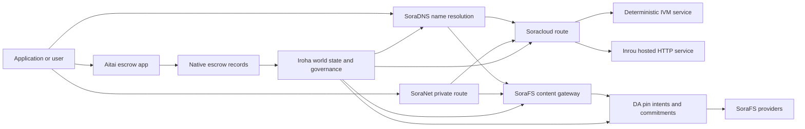

# SORA Nexus Serviços {#sora-nexus-services}

SORA Nexus adiciona planos de serviço voltados para aplicativos em torno de Iroha 3. Esses serviços não são livros contábeis separados de blockchain. Eles são ancorados pelo estado mundial de Iroha, manifestos técnicos de Norito, registros de governança e famílias de rotas de Torii.

A disponibilidade depende da versão do nó e do perfil da rede. Use [`/openapi.json`](/pt/reference/torii-endpoints.md#app-and-sora-route-families) descobrir aplicativo gerado API rotas no nó de destino. Local público SoraFS CID e rotas bem conhecidas são montadas fora desse documento gerado, então verifique essas rotas diretamente ao checar uma implantação.

## Mapa de Componentes {#component-map}

|Componente|Função|Superfícies principais|
| ---------------------- | ------------------------------------------------------------------------------------------------------------------------------------------- | ---------------------------------------------------------------------------------------- |
| Soracloud              |Implantação de aplicativos, serviços hospedados, estado privado do modelo/tempo de execução e controle do ciclo de vida do serviço.| `/v1/soracloud/*`, `/api/*`, `iroha soracloud service ...` |
|Inrou|Ambiente HTTP hospedado no Soracloud para revisões de serviços que exigem um plano HTTP ativo.|Configuração do ambiente Soracloud, anúncios de capacidade do host e estado de execução das réplicas|
| SoraNet                |Privacidade e sobreposição de transporte para circuitos, tráfego de relé, VPN, sessões de conexão e rotas de streaming.| `/v1/connect/*`, `/v1/vpn/*`, SoraNet metadados de rota|
|Disponibilidade de Dados (DA)|Evidência de disponibilidade, compromisso e camada de intenção de pino para cargas úteis que são referenciadas por pistas de execução Nexus, manifestos técnicos SoraFS e fluxos de prova.| `/v1/da/*`, `FindDaPinIntent*`, `[nexus.da]`                                             |
| SoraFS                 |Estrutura de armazenamento endereçada por conteúdo para manifestos técnicos, cargas CAR, conteúdo fixado, buscas de gateway e fluxos de prova de recuperabilidade.| `/v1/sorafs/*`, `/sorafs/*`, `FindSorafsProviderOwner` |
| SoraDNS                |Camada de nomeação determinística e atestação de resolvedor para serviços e conteúdo hospedados em SORA.| `/v1/soradns/*`, `/soradns/*`, resolver eventos do diretório|
|Aitai|Corredor da aplicação para liquidar moeda fiduciária e ativos, respaldado por registros nativos de garantia e não por outro livro-razão.| `OpenAssetEscrow`, `FindAssetEscrow*`, `EscrowEventFilter`, funções `escrow_*` incorporadas do Kotodama |



## Fluxos Comuns {#common-flows}

### Aplicativo Dividido Hospedado {#hosted-split-application}

Um aplicativo típico de plano misto usa todas as peças juntas:

1. Os arquivos estáticos do frontend são empacotados e fixados através do SoraFS.
2. O host público, por exemplo `<app>.sora`, está registrado através de SoraDNS.
3. Soracloud direciona `/api/v1/search` ou `/api/v1/stream` para um serviço Inrou HTTP.
4. Soracloud direciona `/api/auth` e `/api/v1/user` para os manipuladores determinísticos IVM.
5. Clientes que precisam de privacidade podem acessar o mesmo conteúdo ou rota API através de um circuito SoraNet.

|Caminho|Plano de suporte|Por que|
| ----------------- | --------------------- | ------------------------------------------------- |
| `/`               | SoraFS conteúdo estático |Cache de raiz de conteúdo e gateway reproduzível|
| `/assets/*`       | SoraFS conteúdo estático |Ativos endereçados por conteúdo e provas de manifesto técnico|
| `/api/auth*`      | Soracloud IVM         |Estado de desafio seguro contra replay de autenticação e carteira|
| `/api/v1/user*`   | Soracloud IVM         |Mutações estatais sensíveis à governança|
| `/api/v1/search*` | Soracloud Inrou       |Serviço ao vivo HTTP, cache, SSE ou estado do coletor|

### Publicação de Conteúdo {#content-publication}

SoraFS a publicação produz artefatos duráveis antes que um nome aponte para eles:

1. Construir um payload ou diretório.
2. Empacote em um arquivo CAR e planeje em partes.
3. Construa um manifesto técnico Norito com política de PIN e dados de governança.
4. Envie o manifesto técnico para Torii.
5. Registre uma intenção ou compromisso de disponibilidade de pino DA quando o perfil alvo exigir evidência explícita.
6. Vincule o manifesto técnico a um nome SoraDNS ou a uma rota estática de frontend Soracloud.

### Rota Privada de Busca ou Streaming {#private-fetch-or-streaming-route}

SoraNet pode ficar à frente do SoraFS ou do Soracloud:

1. O cliente resolve o nome ou o manifesto técnico.
2. Um diretório de guardas ou manifesto técnico de rota escolhe os relays de entrada e saída.
3. O tráfego é preenchido e enviado através do circuito SoraNet.
4. O relé de saída alcança o gateway SoraFS, o fluxo Torii ou a rota Soracloud.

## Aitai {#aitai}

Aitai é o corredor de aplicativos SORA para liquidações de mercado nas quais um comprador e um vendedor coordenam um pagamento fora da cadeia enquanto a Iroha mantém a custódia dos ativos na cadeia. Para novos fluxos de custódia de ativos numéricos, use a família de instruções de custódia nativas em vez de uma conta de custódia controlada por contrato.

O escrow nativo mantém a custódia no livro razão da blockchain. O vendedor abre uma oferta com `OpenAssetEscrow`, o comprador aceita e marca o pagamento off-chain com `AcceptAssetEscrow` e `MarkEscrowPaymentSent`, e o vendedor libera com `ReleaseAssetEscrow` ou cancela antes que o pagamento seja marcado. Se comprador e vendedor discordarem, qualquer uma das partes pode abrir uma disputa e um solucionador com `CanResolveEscrowDispute` pode dividir o valor bloqueado.

Para o ciclo de vida completo, bloqueios de ativos genéricos, custódia anônima, consultas, eventos e exemplos Rust, veja [Escrow de Ativo Nativo](/pt/blockchain/escrow.md).

|Superfície Aitai|Use para|
| ------------------------------------------------------------------------------------------------------------------------------------------------------------- | ----------------------------------------------------------------------------------------- |
| `OpenAssetEscrow`, `AcceptAssetEscrow`, `MarkEscrowPaymentSent`, `ReleaseAssetEscrow`, `CancelAssetEscrow`                                                    |Ofertas de ativos numéricos transparentes, incluindo fluxos de liquidação denominados em XOR.|
| `OpenAnonymousAssetEscrow`, `AcceptAnonymousAssetEscrow`, `MarkAnonymousEscrowPaymentSent`, `ReleaseAnonymousAssetEscrow`, `CancelAnonymousAssetEscrow`       |Ofertas protegidas usam anexos de prova para movimentos de financiamento e fechamento.|
| `OpenEscrowDispute`, `ResolveEscrowDispute`, `OpenAnonymousEscrowDispute`, `ResolveAnonymousEscrowDispute`                                                    |Entrada de disputa e resolução no estilo judicial.|
| `FindAssetEscrowById`, `FindAssetEscrowsBySeller`, `FindAssetEscrowsByBuyer`, `FindAssetEscrowsByStatus`                                                      |Páginas de status do aplicativo, trabalhos de reconciliação e ferramentas de suporte.|
| `EscrowEventFilter` |Assinaturas de depósito em garantia ao vivo por ID do depósito em garantia, vendedor, comprador, status ou tipo de evento.|
| Kotodama `escrow_open_offer`, `escrow_accept`, `escrow_mark_payment_sent`, `escrow_release`, `escrow_cancel`, `escrow_open_dispute`, `escrow_resolve_dispute` | Kotodama chamadas de contrato garantidas pelos syscalls de escrow V1.                                 |

Para uso público Taira ou Minamoto, trate o sistema de pagamento off-chain e qualquer fluxo de trabalho de suporte ou judicial como política do aplicativo. Iroha registra o estado de custódia, eventos do ciclo de vida, hashes criptográficos de evidências e o movimento final de ativos; ele não verifica a liquidação em moeda fiduciária por si só.

## Verificar um Nó de Destino {#check-a-target-node}

Antes de usar exemplos desta página, confirme se a família de rotas existe no nó que você está mirando:

```bash
export TORII_URL=https://taira.sora.org

curl -fsS "$TORII_URL/openapi.json" \
  | jq '.paths | keys[] | select(test("^/v1/(soracloud|sorafs|soradns|connect|vpn|da)/"))'

curl -fsS -H 'Accept: application/json' "$TORII_URL/status" | jq .
```

`/openapi.json` é o endpoint canônico OpenAPI API. A disponibilidade exata da rota depende dos recursos de compilação e da configuração da rede. O documento não enumera os SoraFS CID locais públicos e rotas conhecidas; verifique diretamente aqueles endpoints API, conforme descrito abaixo.

### Taira Verificações de Fumaça Somente Leitura {#taira-read-only-smoke-checks}

O endpoint público Taira API é útil para verificações do lado de leitura, mas não o utilize para exemplos de mutação a menos que você esteja operando uma conta autorizada e pretenda alterar o estado do testnet público.

```bash
export TORII_URL=https://taira.sora.org

curl -fsS -H 'Accept: application/json' "$TORII_URL/status" \
  | jq '{version: .build.version, peers, blocks, lanes: (.teu_lane_commit | length)}'

curl -fsS "$TORII_URL/v1/vpn/profile" \
  | jq '{available, relay_endpoint, supported_exit_classes}'

curl -fsS "$TORII_URL/v1/sorafs/storage/peers?limit=4" \
  | jq '{gateway_base_url, pin_torii_urls}'

curl -fsS -H 'Accept: application/json' "$TORII_URL/v1/soracloud/status" \
  | jq '.control_plane | {service_count, services: [.services[] | {service_name, current_version}]}'
```

Taira pode expor rotas de plano de controle específicas da implantação que não estão listadas no mapa de caminhos OpenAPI. Trate `/openapi.json` como o contrato gerado para as rotas que ele contém e, em seguida, confirme diretamente as rotas locais SoraFS específicas da implantação e públicas antes de registrá-las como disponíveis.

## Soracloud {#soracloud}

Soracloud é o plano de controle de aplicação SORA. Ele rastreia pacotes de implantação, revisões de serviço, roteamento, estado de lançamento, entradas de configuração autorizadas, segredos de serviço criptografados, registros do registro de modelo, sessões de inferência privadas e registros de resultados de protocolo de tempo de execução de software.

Soracloud utiliza dois planos de execução:

|Plano de execução|tempo de execução de software|Use-o para|
| ---------------------- | ------- | -------------------------------------------------------------------------------------------- |
| `DeterministicService` | `Ivm`   |Autenticação, estado do cofre, leituras certificadas, manipuladores de caixa de correio ordenados, mutações sensíveis à governança|
| `HttpService`          | `Inrou` |Ao vivo HTTP APIs, trabalho pesado de coletor, serviços com cache, SSE, fluxos assistidos pelo navegador|

O plano de controle é autoritativo. Comandos de implantar, atualizar, reverter, configurar, segredo, modelo e status são enviados através de Torii e leem o estado mundial comprometido; eles não dependem de um espelho local separado CLI. O roteamento público é baseado no prefixo mais longo, portanto, um host registrado pode dividir o tráfego entre rotas hospedadas HTTP e rotas determinísticas API.

### estrutura inicial gerada de um App Dividido {#scaffold-a-split-app}

O modelo split-app cria um frontend estático mais um serviço ao vivo hospedado API e um serviço de cofre determinístico/API:

```bash
iroha soracloud app init \
  --template split-app \
  --app-name solswap_indexer \
  --app-version 0.1.0 \
  --public-host solswap-indexer.sora \
  --output-dir ./apps/solswap-indexer

iroha soracloud app plan \
  --manifest ./apps/solswap-indexer/app_manifest.json

iroha soracloud app doctor \
  --manifest ./apps/solswap-indexer/app_manifest.json
```

`plan` mostra a divisão das rotas, os manifestos dos serviços filhos, os caminhos dos scripts do espaço de trabalho e o modo esperado de publicação do frontend. `doctor` valida o contrato de lançamento local antes de envolver a Torii.

### Implantar e Inspecionar Estado do App {#deploy-and-inspect-app-state}

Reutilize uma futura época de retenção SoraFS para cada tentativa de lançamento. Como o modelo de aplicativo dividido contém um serviço Inrou, qualifique seu artefato exato nas lojas de provedor offline selecionadas antes da mutação online:

```bash
export SORACLOUD_TORII_URL=https://<soracloud-enabled-torii>
export SORAFS_RETENTION_EPOCH=<future-unix-seconds>

iroha soracloud app preseed \
  --manifest ./apps/solswap-indexer/app_manifest.json \
  --sorafs-retention-epoch "$SORAFS_RETENTION_EPOCH" \
  --inrou-preseed-target <validator-account,peer-id,absolute-store-path> \
  --inrou-preseed-max-capacity-bytes <bytes> \
  --inrou-preseed-helper /absolute/path/to/sorafs-node \
  --inrou-preseed-helper-sha256 <lowercase-sha256> \
  --receipt-out /absolute/path/to/solswap-inrou-preseed.json

iroha soracloud app release \
  --manifest ./apps/solswap-indexer/app_manifest.json \
  --sorafs-retention-epoch "$SORAFS_RETENTION_EPOCH" \
  --inrou-preseed-receipt /absolute/path/to/solswap-inrou-preseed.json \
  --torii-url "$SORACLOUD_TORII_URL"

iroha soracloud app status \
  --manifest ./apps/solswap-indexer/app_manifest.json \
  --torii-url "$SORACLOUD_TORII_URL"
```

Repita `--inrou-preseed-target` para cada loja de provedor exigida pela política de implantação. `release` cria e sincroniza os manifestos técnicos, executa o app doctor, submete uma mutação de infraestrutura de aplicativo canônica, reconcilia o status autorizado e verifica os alvos ativos declarados. Um registro de resultado do protocolo preseed não é opcional quando o aplicativo contém artefatos Inrou.

Para um serviço já implantado, use comandos com escopo de serviço:

```bash
iroha soracloud service status \
  --service-name solswap_indexer_live \
  --torii-url "$SORACLOUD_TORII_URL"

iroha soracloud service rollback \
  --service-name solswap_indexer_live \
  --target-version 0.1.0 \
  --torii-url "$SORACLOUD_TORII_URL"
```

### Configuração e Material Secreto {#config-and-secret-material}

Soracloud entradas de configuração e segredo fazem parte do estado de implantação autorizado. Implantação, atualização e reversão falham de forma segura quando bindings de configuração ou segredo necessários estão ausentes ou inconsistentes com os manifests técnicos ativos.

```bash
iroha soracloud service config-set \
  --service-name solswap_indexer_live \
  --config-name indexer/public_config \
  --value-file ./config/public-config.json \
  --torii-url "$SORACLOUD_TORII_URL"

iroha soracloud service secret-set \
  --service-name solswap_indexer_live \
  --secret-name indexer/api_key \
  --secret-file ./secrets/api-key.envelope.json \
  --torii-url "$SORACLOUD_TORII_URL"
```

Use a ajuda CLI para os indicadores de credenciais exatos exigidos pelo seu perfil:

```bash
iroha soracloud service config-set --help
iroha soracloud service secret-set --help
```

## Inrou {#inrou}

Inrou é o tempo de execução de software hospedado HTTP usado por Soracloud. Um nó Iroha com o tempo de execução de software Soracloud incorporado projeta o estado Soracloud admitido em um plano de materialização local, inicia réplicas de serviço hospedado designadas como serviços de loopback e relata o estado de execução do software da réplica de volta ao modelo autoritário.

Use o Inrou para cargas de trabalho que precisam de uma superfície HTTP ativa, como APIs intensivos em coletores, fluxos SSE, manipuladores com cache ou serviços assistidos por navegador.

### Requisitos de tempo de execução de software {#runtime-requirements}

- O tempo de execução do software do manifesto técnico do contêiner deve ser `Inrou`.
- O plano de execução do manifesto técnico de serviço deve ser `HttpService`.
- `HttpService + Inrou` requer exatamente um `PersistentRootLeaseVolume` montado em `/`.
- Os serviços Inrou replicados também precisam de serviço compartilhado ou armazenamento de locação confidencial quando mantêm estado compartilhado mutável.
- Os nós de hospedagem de produção devem anunciar a capacidade real do Inrou em vez de operar apenas como um proxy.

### fragmento de manifesto técnico {#manifest-fragment}

O exemplo abaixo mostra a forma dos dois manifests técnicos. É um fragmento, não um pacote de implantação completo.

```jsonc
// container_manifest.json
{
  "schema_version": 1,
  "runtime": { "runtime": "Inrou", "value": null },
  "bundle_path": "/bundles/solswap-indexer.inrou",
  "entrypoint": "/app/bin/launch-indexer.sh",
  "args": [],
  "env": {
    "RUST_LOG": "info",
  },
  "inrou": {
    "schema_version": 1,
    "guest_os": { "guest_os": "DebianSlim", "value": null },
    "guest_images": {
      "x86_64": {
        "kernel_image_path": "/inrou/x86_64/vmlinux",
        "rootfs_image_path": "/inrou/x86_64/rootfs.ext4",
        "initrd_image_path": null,
      },
      "aarch64": {
        "kernel_image_path": "/inrou/aarch64/vmlinux",
        "rootfs_image_path": "/inrou/aarch64/rootfs.ext4",
        "initrd_image_path": null,
      },
    },
  },
  "lifecycle": {
    "start_grace_secs": 60,
    "stop_grace_secs": 30,
    "healthcheck_path": "/api/indexer/v1/health",
  },
}
```

```jsonc
// service_manifest.json
{
  "schema_version": 1,
  "service_name": "solswap_indexer_live",
  "service_version": "0.1.0",
  "execution_plane": { "execution_plane": "HttpService", "value": null },
  "replicas": 2,
  "route": {
    "host": "solswap-indexer.sora",
    "path_prefix": "/api/v1/search",
    "service_port": 8080,
    "visibility": { "visibility": "Public", "value": null },
    "tls_mode": { "tls": "Required", "value": null },
  },
  "lease_volumes": [
    {
      "volume_name": "root_disk",
      "kind": {
        "lease_volume": "PersistentRootLeaseVolume",
        "value": null,
      },
      "storage_class": { "storage_class": "Warm", "value": null },
      "mount_path": "/",
      "max_total_bytes": 8589934592,
    },
    {
      "volume_name": "index_state",
      "kind": { "lease_volume": "ServiceLeaseVolume", "value": null },
      "storage_class": { "storage_class": "Warm", "value": null },
      "mount_path": "/var/lib/solswap-indexer",
      "max_total_bytes": 1073741824,
    },
  ],
}
```

Durante a execução do software, cada volume de licença montado é exposto por meio de variáveis de ambiente derivadas do nome do volume:

```text
SORACLOUD_LEASE_VOLUME_ROOT_DISK_DIR
SORACLOUD_LEASE_VOLUME_ROOT_DISK_MOUNT_PATH
SORACLOUD_LEASE_VOLUME_INDEX_STATE_DIR
SORACLOUD_LEASE_VOLUME_INDEX_STATE_MOUNT_PATH
```

## SoraNet {#soranet}

SoraNet é a camada de privacidade e transporte. Ela fornece rotas baseadas em retransmissão para o tráfego que não deve se conectar diretamente ao gateway ou serviço alvo. O design de transporte utiliza funções de retransmissão de entrada, intermediária e de saída, transporte QUIC, um handshake híbrido baseado em ruído, negociação de capacidades, metadados de diretório de retransmissão e células preenchidas de tamanho fixo.

Em implantações Nexus, SoraNet pode transportar buscas de conteúdo, tráfego de gateway, VPN ou sessões Connect, e rotas de streaming Norito. Entradas de diretório podem marcar relays que suportam `norito-stream`, o que permite que os clientes prefiram rotas adequadas para Torii RPC ou tráfego de streaming.

### Configuração de Streaming {#streaming-configuration}

O perfil Nexus habilita o provisionamento SoraNet para rotas de streaming:

```toml
[streaming]
feature_bits = 0b11

[streaming.soranet]
enabled = true
exit_multiaddr = "/dns/torii/udp/9443/quic"
padding_budget_ms = 25
access_kind = "authenticated"
provision_spool_dir = "./storage/streaming/soranet_routes"
provision_spool_max_bytes = 0
provision_window_segments = 4
provision_queue_capacity = 256
```

Use `access_kind = "read-only"` para rotas de conteúdo que não exigem autenticação do visualizador. Use `authenticated` quando o relé de saída deve aplicar tickets ou a identidade do visualizador antes de conectar a Torii ou a um serviço hospedado.

### SoraNet-Consciente SoraFS Buscar {#soranet-aware-sorafs-fetch}

O SoraFS fetch CLI pode emitir um manifesto técnico de proxy local e enfileirar SoraNet metadados de rota para extensões de navegador ou SDK adaptadores. O orquestrador JSON deve definir `local_proxy` com `"emit_browser_manifest": true`, e o CLI deve ser construído com suporte a `local-quic-proxy`. Em Taira, inspecione o catálogo de provedores admitidos na raiz do testnet público, em seguida, preencha a tupla de provedores protegida emitida para esse provedor:

```bash
export TAIRA_ROOT=https://taira.sora.org
curl -fsS "$TAIRA_ROOT/v1/sorafs/providers?limit=20" | jq '.providers'

: "${TAIRA_SORAFS_PROVIDER_ID:?set the admitted provider ID from Taira discovery}"
: "${TAIRA_SORAFS_GATEWAY_KEY:?set the provider gateway key}"
: "${TAIRA_SORAFS_PROVIDER_URL:?set the advertised provider base URL}"
: "${TAIRA_SORAFS_STREAM_TOKEN_FILE:?set the issued stream-token file}"

cargo run -p sorafs_orchestrator --features=local-quic-proxy --bin=sorafs_cli -- \
  fetch \
  --plan=artifacts/payload_plan.json \
  --manifest-id=<manifest-digest-hex> \
  --orchestrator-config=artifacts/orchestrator.json \
  --provider=name=taira,provider-id="$TAIRA_SORAFS_PROVIDER_ID",gateway-key="$TAIRA_SORAFS_GATEWAY_KEY",base-url="$TAIRA_SORAFS_PROVIDER_URL",stream-token="$(cat "$TAIRA_SORAFS_STREAM_TOKEN_FILE")" \
  --output=artifacts/payload.bin \
  --json-out=artifacts/fetch_summary.json \
  --local-proxy-manifest-out=artifacts/proxy_manifest.json \
  --local-proxy-mode=bridge \
  --local-proxy-norito-spool=storage/streaming/soranet_routes \
  --local-proxy-kaigi-spool=storage/streaming/soranet_routes \
  --local-proxy-kaigi-policy=authenticated \
  --max-peers=2 \
  --retry-budget=4
```

O provedor de registros resumidos relata, os registros de resultado do protocolo de fragmentos, os metadados do proxy local e as configurações de rota efetivas usadas para a busca.

### Lista de Verificadores de Incentivo de Revezamento {#relay-incentive-verifier-roster}

A ingestão de incentivo de retransmissão está com falha fechada. Quando `incentives.enable` for verdadeiro, `incentives.trusted_verifier_ids` deve conter pelo menos um ID de conta canônico. A lista nunca deve exceder 64 entradas, mesmo quando os incentivos estão desativados. O tempo de execução do software o armazena como um conjunto ordenado determinístico e rejeita a geometria de lista inválida durante a inicialização do relé.

Cada `RelayBandwidthProofV1` é decodificado sob um orçamento fixo de quadro/alocação e deve consumir o quadro completo. A conta do verificador da prova deve estar presente na lista configurada, e `RelayBandwidthProofV1::verify_signature()` deve ser bem-sucedido, antes que o relé bloqueie ou altere seu acumulador de desempenho. Um signatário criptográfico não confiável ou uma prova com assinatura inválida/adulterada, portanto, não contribui com nenhuma medição e não pode produzir um instantâneo de incentivo.

## Disponibilidade de Dados (DA) {#data-availability-da}

DA é a camada de evidência de disponibilidade para cargas úteis que são grandes demais, muito sensíveis à privacidade ou muito específicas do serviço para serem colocadas diretamente no estado do mundo. Ele registra compromissos determinísticos e obrigações de recuperação para que validadores, gateways e clientes possam concordar sobre quais bytes foram prometidos, qual política se aplica e quais evidências foram observadas.

DA não substitui Kura ou SoraFS:

- Kura armazena o fluxo de blocos finalizado e os dados de recuperação de consenso.
- SoraFS armazena e fornece bytes endereçados por conteúdo, CAR cargas úteis e manifestos técnicos.
- DA registra compromissos, políticas de prova, aberturas de prova e intenções de PIN que permitem que esses bytes sejam programados, auditados e vinculados de volta ao estado do livro razão do blockchain.

Use DA quando um aplicativo ou pista de execução Nexus precisar de uma promessa visível no livro razão de que os dados fora da cadeia continuarão recuperáveis. Exemplos comuns incluem compromissos de carga útil da pista de execução para fluxos de liquidação, intenções de fixação SoraFS para conteúdo publicado, pacotes de prova que devem ser mantidos para verificação posterior, e artefatos de aplicação cujo estado público deve ser um valor de resumo criptográfico em vez do payload completo.

### Ciclo de vida {#lifecycle}

|Palco|O que está registrado|
| ---------- | ----------------------------------------------------------------------------------------------------------------------------------------------------- |
|Intenção|Um tíquete, referência de manifesto técnico, alias, referência de pista/época/sequência, política de retenção ou destino de replicação.|
|Compromisso|Material de resumo que vincula o manifesto, a carga útil da via, o pacote de provas ou a raiz do conteúdo ao registro visível na cadeia.|
|Evidência|Votos de disponibilidade, aberturas de prova, atestações de provedores ou outras evidências específicas do perfil aceitas pela rede alvo.|
|Consulta|Pesquisas por intenção de pin através de `FindDaPinIntentByTicket`, `FindDaPinIntentByManifest`, `FindDaPinIntentByAlias` ou `FindDaPinIntentByLaneEpochSequence`.|

Um fluxo de publicação típico apoiado por DA é:

1. Construa ou receba a carga útil fora do WSV, por exemplo, um arquivo SoraFS CAR ou uma carga útil da pista de execução Nexus.
2. hash criptográfico e descrever o payload em um manifesto técnico Norito ou registro de compromisso específico da rota.
3. Envie o manifesto técnico, a intenção de fixar ou o compromisso através de `/v1/da/*` quando aquela família de rotas estiver habilitada, ou através do caminho de transação assinada da rede.
4. Permita que validadores ou provedores de disponibilidade coletem as evidências exigidas pela política de prova ativa.
5. Consulte a intenção ou compromisso do pino resultante antes de promover um alias, prova de liquidação ou rota de gateway que dependa do payload.

### Modelo Algorítmico {#algorithmic-model}

DA transforma uma carga útil em um compromisso assinado, protegido contra repetição e indexado por blocos. Os algoritmos importantes são determinísticos, para que validadores e gateways possam recalcular os mesmos resumos criptográficos a partir dos mesmos bytes.

1. Normalize a carga útil enviada em forma canônica. Torii aceita uma solicitação de ingestão com `(lane_id, epoch, sequence)`, bytes da carga útil, metadados de compressão, tamanho do fragmento, perfil de apagamento, política de retenção e assinatura do remetente. O nó descompacta cargas gzip, deflate ou Zstandard quando solicitado e então verifica se o comprimento canônico em bytes é igual a `total_size`.
2. Validar os parâmetros de pista de execução e bloco. A pista de execução deve existir no catálogo de pistas de execução Nexus. `chunk_size` deve ser uma potência de dois diferente de zero, de pelo menos dois bytes, e não maior do que o máximo configurado. O perfil de apagamento deve incluir fragmentos de dados e pelo menos dois fragmentos de paridade. O catálogo de pistas de execução seleciona o esquema de prova, seja `merkle_sha256` ou `kzg_bls12_381`.
3. Aplicar política de rede. O nó aplica a linha de base de replicação e retenção configurada para a classe de blob. Os metadados públicos devem permanecer em texto simples; os metadados apenas de governança são criptografados com a chave de metadados de governança configurada no nó antes de serem gravados no manifesto técnico.
4. Divida e confirme. A carga útil canônica é dividida em blocos com um perfil de tamanho fixo derivado de `chunk_size`. Torii calcula o valor do resumo criptográfico da carga útil, a raiz da árvore de prova de recuperabilidade e as confirmações por bloco. Os blocos de dados carregam confirmações BLAKE3 sobre seus bytes.
5. Adicione compromissos de apagamento. Os blocos são agrupados em faixas de `data_shards`. Células ausentes na faixa final são preenchidas com zeros para o cálculo de paridade. RS(16) de paridade cria fragmentos de paridade de linha/global; opcional `row_parity_stripes` adicionar paridade em faixa no estilo de coluna através da matriz. Os compromissos de fragmento de paridade são BLAKE3 resumos criptográficos de símbolos `u16` em little-endian.
6. Construa o manifesto técnico. `DaManifestV1` registra a pista de execução, época, classe do blob, codec, valor de resumo criptográfico da carga, raiz do chunk, tamanho do chunk, perfil de eliminação, política de retenção, cotação de aluguel, compromissos do chunk, compromisso opcional IPA, metadados e hora de emissão. O ticket de armazenamento é determinístico: o nó primeiro gera um hash criptográfico de um modelo de manifesto técnico com um ticket vazio, e então escreve essa impressão digital de volta como o `storage_ticket` final.
7. Rejeite conflitos de repetição. A chave de repetição é `(lane_id, epoch, sequence, manifest_fingerprint)`. Um duplicado com a mesma impressão digital é idempotente. Uma sequência obsoleta ou a mesma sequência com uma impressão digital diferente é rejeitada.
8. Emitir artefatos assinados. Torii calcula um compromisso PDP, assina um `DaIngestReceipt`, constrói um `DaCommitmentRecord` e grava artefatos de spool para o manifesto, o compromisso PDP, o registro e o cronograma de compromissos, a intenção de pin, o arquivo de recibo e o log de recibos. O cursor de recibos avança monotonicamente para cada `(lane_id, epoch)`.

Registros de compromisso são o que os blocos carregam. Um registro vincula:

- faixa de execução, época e sequência
- ID do blob do chamador e hash criptográfico do manifesto técnico canônico
- esquema de prova de pista de execução
- raiz do fragmento
- compromisso opcional KZG para faixas de execução KZG
- PDP/provar valor de resumo criptográfico
- classe de retenção e ticket de armazenamento
- Torii DA assinatura de reconhecimento

Antes que um bloco incorpore registros DA, o caminho de montagem do bloco valida o pacote:

- `(lane_id, epoch, sequence)` deve ser único dentro do pacote.
- os hashes criptográficos do manifesto técnico devem ser diferentes de zero e únicos dentro do pacote.
- O esquema de prova de compromisso deve corresponder à política de execução da linha configurada.
- As vias Merkle rejeitam compromissos KZG; as vias KZG exigem um compromisso KZG diferente de zero.
- As intenções de fixação são normalizadas em forma canônica, ordenadas e filtradas por via, hash do manifesto, tíquete de armazenamento, conta proprietária e regras de colisão de aliases.

O cabeçalho do bloco armazena hashes criptográficos para DA políticas de prova, compromissos e intenções de PIN. Para provas de associação, o pacote de comprometimento também expõe uma raiz de Merkle cujas folhas são hashes criptográficos de valores `DaCommitmentRecord` codificados de forma canônica Norito. Nós pais hash criptograficamente a concatenação dos filhos esquerdo e direito; uma folha ímpar é promovida inalterada para a camada seguinte.

### Verificação de Prova {#proof-verification}

`/v1/da/commitments/prove` pode produzir uma prova para um compromisso em um bloco. A prova contém o compromisso, altura do bloco, índice no pacote, hash criptográfico do pacote, comprimento do pacote, raiz de Merkle e caminho dos irmãos. A verificação verifica:

1. O hash criptográfico do pacote de prova corresponde ao hash criptográfico do compromisso DA do cabeçalho do bloco.
2. A altura do bloco de prova corresponde ao cabeçalho do bloco referenciado.
3. O índice está dentro dos limites e o compromisso é igual à entrada do pacote naquele índice.
4. A política de prova da linha de execução aceita o compromisso.
5. Dobrando o caminho do irmão a partir da folha de compromisso reconstrói a raiz fornecida.
6. A raiz reconstruída é igual à raiz do conjunto.

Isso prova que um compromisso específico de disponibilidade foi incluído em um payload de bloco específico; isso não prova que todas as réplicas estão atualmente online. A recuperabilidade ao vivo é verificada separadamente por meio de buscas do provedor SoraFS, verificações PDP/PoTR ou evidências de disponibilidade específicas do perfil.

### Interação de Consenso {#consensus-interaction}

A disponibilidade da carga útil de consenso é obrigatória, mas não é um protocolo de segunda finalidade. O líder transmite um `PayloadManifest` assinado para todo o comitê `3f + 1`. O primeiro corpo e a ocorrência do fragmento RS16 têm como alvo o Conjunto A, cujos membros `2f + 1` incluem o líder e o rabo proxy. Uma retransmissão delimitada de mesma visão expande o serviço de corpo e fragmento para todo o comitê.

Um manifesto técnico ou conjunto parcial de fragmentos não é suficiente para votar. Antes da Preparação, cada validador deve autenticar os pedaços, reconstruir o corpo canônico completo, verificar seu comprimento, raiz do bloco, e hash criptográfico do corpo, persista esse corpo, e finalize a validação determinística do bloco. O validador mantém o corpo exato através da aplicação CommitQC ou recuperação certificada.

Quando um par de rede aprende um certificado antes de ter o corpo, ele primeiro solicita pedaços autenticados ou o corpo canônico dos signatários criptográficos do certificado, e então expande a recuperação para o comitê congelado. Cada resposta permanece vinculada ao contexto de altura exato, rodada de proposta, manifesto técnico e assunto do corpo. O bloco é aplicado apenas após o corpo reconstruído localmente corresponder ao certificado.

### Notas do Operador {#operator-notes}

Iroha 3 perfis de consenso sempre incluem manifesto técnico assinado e RS16 disseminação de payload, validação completa do corpo antes do Prepare, DA validação do bundle e telemetria de recuperação limitada. O layout e os limites do protocolo estão congelados no contexto de altura assinado; não há troca local nem perfil de tempo limite que possa desativá-los ou redefini-los. Os limites de bloco e fila locais do nó ainda precisam se ajustar ao layout e à carga de trabalho assinados da implantação.

Para a descoberta de rotas, comece com o documento OpenAPI do nó:

```bash
curl -fsS "$TORII_URL/openapi.json" \
  | jq '.paths | keys[] | select(startswith("/v1/da/"))'
```

Use o [referência de consulta](/pt/reference/queries.md#nexus-data-availability-and-packages) para os nomes de consultas DA atuais, e o [modelo de configuração de par de rede](/pt/reference/peer-config/) para ingestão, amostragem, auditoria e limites de recuperação de `[nexus.da]` em nível de aplicação, além dos limites locais de bloco e fila de Sumeragi.

## SoraFS {#sorafs}

SoraFS é a estrutura de armazenamento descentralizado endereçada por conteúdo. Ele empacota bytes em blocos determinísticos, arquivos CAR, e manifestos técnicos Norito que vinculam raízes de conteúdo, perfis de fragmentação, políticas de fixação e atestações de governança. Os provedores de armazenamento anunciam capacidade e disponibilidade de conteúdo, enquanto os gateways verificam manifestos técnicos e compromissos de blocos antes de fornecer o conteúdo.

Típico SoraFS os usos incluem ativos de aplicação estática, compilações de documentação, zona pacotes, referências de modelo ou artefato e pacotes de evidências de governança. O Iroha modelo de dados expõe SoraFS eventos de gateway e um [`FindSorafsProviderOwner`](/pt/reference/queries.md#nexus-data-availability-and-packages) consulta para resolução de propriedade do provedor.

### Taira Perfil da Testnet {#taira-testnet-profile}

Taira é a testnet pública canônica SoraFS. Seu perfil de validador registrado usa a cadeia `fc56984b-2be7-431d-840e-21514d1883f0` e o discriminante da cadeia `369`. O `NetworkId` abaixo é a identidade exata do gênesis da blockchain Taira atualmente fixada. Um Taira reset pode alterar esse hash criptográfico enquanto mantém o rótulo da cadeia, então atualize-o a partir do perfil de implantação assinado atual e nunca o derive da cadeia UUID. As configurações efetivas de Taira SoraFS são:

- ID da rede: `hash:82531CE8EAE8BFF6BEECA4698BFD13A3BC8BEC5F0EE0D23D428C97FC17AB0F3B#3E94`
- base do gateway URL: `https://taira.sora.org`
- pino Torii URLs: `https://taira-validator-1.sora.org` através de `https://taira-validator-4.sora.org`
- capacidades de descoberta: `torii_gateway`, `chunk_range_fetch` e `potr_mldsa`
- origem de conteúdo isolado: `https://{cid}.sorafs.taira.sora.org/{path}`
- política de pin público: sem permissão e com taxa, com `require_council_signatures = false`

```toml
[sorafs.storage]
enabled = false
max_capacity_bytes = 13743895347

[sorafs.discovery]
discovery_enabled = true
known_capabilities = ["torii_gateway", "chunk_range_fetch", "potr_mldsa"]

[sorafs.discovery.admission]
envelopes_dir = "configs/soranexus/taira/sorafs_admission"
trusted_council_keys = ["REPLACE_WITH_TAIRA_SORAFS_COUNCIL_PUBLIC_KEY"]
signature_threshold = "REPLACE_WITH_TAIRA_SORAFS_COUNCIL_SIGNATURE_THRESHOLD"

[sorafs.discovery.publish]
gateway_base_url = "https://taira.sora.org"
pin_torii_urls = [
  "https://taira-validator-1.sora.org",
  "https://taira-validator-2.sora.org",
  "https://taira-validator-3.sora.org",
  "https://taira-validator-4.sora.org",
]

[sorafs.gateway]
require_manifest_envelope = true
enforce_admission = true
enforce_capabilities = true

[sorafs.gateway.untrusted_hosting]
enabled = true
path_gateway_redirect = true
redirect_html_only = true

[sorafs.gateway.untrusted_hosting.cid_host_suffixes]
live = "sorafs.sora.org"
taira = "sorafs.taira.sora.org"

[sorafs.repair]
enabled = false
claim_ttl_secs = 900
heartbeat_interval_secs = 60
max_attempts = 3
worker_concurrency = 4

[sorafs.gc]
enabled = false
interval_secs = 900
max_deletions_per_run = 500
retention_grace_secs = 86400

[gov.sorafs_pin_policy]
require_council_signatures = false
```

Os três valores de gateway de nível superior são padrões herdados com falha ao fechar; todos os outros valores no trecho são explícitos no perfil registrado de Taira. Um operador deve substituir os espaços reservados de descoberta-admissão pelo material de implantação assinado. Cada solicitação atendida deve conter um contêiner de dados de manifesto técnico, passar pela admissão do provedor e usar uma capacidade anunciada.

Os validadores Taira têm armazenamento SoraFS embutido, reparo e coleta de lixo desativados. A capacidade configurada deles continua sendo parte do validador verificação de orçamento de disco; isso não significa que o validador seja um provedor de armazenamento. Use `GET /v1/sorafs/storage/peers?limit=4` para ler o gateway configurado e os destinos de pinagem atuais antes de um teste.

A configuração de esquema de Taira aceita tanto as chaves de sufixo CID-host `live` quanto `taira`. Manifests técnicos do public-testnet, verificações de origem e testes de navegador devem usar `sorafs.taira.sora.org` para que sua origem esteja visivelmente vinculada a Taira; não trate a chave aceita `live` como uma recomendação para publicar conteúdo de testnet sob uma origem com aparência de produção. Outras implantações devem usar sua própria identidade de rede, chaves de governança, material de admissão de provedores, endpoints pin API e política de capacidade/reparo.

### Local Público CID e Portais do Site {#public-local-cid-and-site-gateways}

Cada nó SoraFS habilitado para Torii monta essas rotas públicas anônimas mesmo quando o aplicativo opcional API não está construído:

|Método e endpoint API|Propósito|
| ---------------------------------- | -------------------------------------------------------------------- |
| `GET /.well-known/sorafs/manifest` |Retornar o manifesto técnico selecionado pelo host de solicitação canônico|
| `GET /v1/sorafs/cid/{cid}`         |Retornar metadados de manifesto técnico local delimitados e entradas de arquivo para um CID|
| `GET /sorafs/cid/{cid}`            |Servir o documento raiz para um site local com endereço de conteúdo|
| `GET /sorafs/cid/{cid}/{*path}`    |Serve um caminho normalizado, ou um intervalo de bytes limitado, sob aquele CID|

Estas rotas nunca aceitam `x-sorafs-stream-token` ou `x-sorafs-token-id`. A presença de qualquer um dos cabeçalhos é uma solicitação incorreta. Um manifesto técnico canônico já está presente no armazenamento local autoritativo do nó é a capacidade de leitura pública; uma falha de cache não autoriza a hidratação pelo provedor remoto. O provedor protegido CAR e as rotas de fragmentos permanecem superfícies de protocolo autenticadas separadas.

Antes de ler bytes, Torii valida a codificação canônica, as restrições semânticas, o valor do resumo criptográfico e a raiz CID do manifesto técnico local. Ele então requer a identidade do provedor local autorizado, admissão de governança e conformidade governada para o manifesto técnico, CID, e provedor. A política de taxa/proibição do gateway usa o endereço efetivo do cliente, respeitando endereços encaminhados apenas por meio de proxies confiáveis configurados. A falta de política, conformidade, identidade ou estado de admissão resulta em falha fechada.

Uma solicitação possui uma permissão de gateway público de ponta a ponta; o limite de processo é de 64 leituras simultâneas, com solicitações excedentes retornando `503 Service Unavailable` e `Retry-After: 1`. As respostas do manifesto técnico são limitadas a 16 MiB, as listagens de arquivos padrão são de 50 entradas e retornam no máximo 500, e um arquivo completo ou intervalo de bytes único é limitado a 8 MiB. A análise de consultas depende da compilação. A versão de produção `app_api` aceita um `limit` de 32 bits sem sinal decodificado, ignora outras chaves de consulta, deixa o último `limit` repetido vencer e limita o valor em `1..=500`. Uma versão mínima de recursos sem `app_api` aceita apenas um par canônico `limit=1..500` e rejeita formas desconhecidas, repetidas, codificadas em porcentagem ou não canônicas. Envie exatamente um par `limit=<1..500>` para um comportamento que seja portátil entre versões. CIDs, hosts, caminhos e cabeçalhos de intervalo permanecem canônicos e de valor único em ambas as versões. Ativo HTML, CSS, JavaScript, SVG, XML, PDF, ou o conteúdo Wasm é servido apenas a partir de uma origem isolada derivada de CID configurada (ou redirecionado para lá), impedindo que uma origem gateway de caminho compartilhado execute conteúdo não confiável.

### Empacotar, Construir e Enviar {#pack-build-and-submit}

O seguinte exemplo de mutação usa os atuais Taira `NetworkId` fixados, o endpoint de fixação API, o piso de replicação e a política de governança. Use um financiado conta de testnet e um arquivo de chave exclusivo para o proprietário descartável. Taira admite pins sem permissão sem assinaturas do conselho, mas ainda cobra a taxa governada.

```bash
cargo run -p sorafs_orchestrator --bin sorafs_cli -- \
  car pack \
  --input=./dist \
  --car-out=artifacts/site.car \
  --plan-out=artifacts/site.chunk-plan.json \
  --summary-out=artifacts/site.car-summary.json

: "${TAIRA_AUTHORITY:?set a funded Taira I105 account}"
export TAIRA_NETWORK_ID='hash:82531CE8EAE8BFF6BEECA4698BFD13A3BC8BEC5F0EE0D23D428C97FC17AB0F3B#3E94'
export TAIRA_PIN_TORII_URL=https://taira-validator-1.sora.org
export TAIRA_PRIVATE_KEY_FILE="${TAIRA_PRIVATE_KEY_FILE:-./secrets/taira-authority.ed25519}"
export TAIRA_RETENTION_EPOCH=$(( $(date -u +%s) + 86400 ))

cargo run -p sorafs_orchestrator --bin sorafs_cli -- \
  manifest build \
  --summary=artifacts/site.car-summary.json \
  --manifest-out=artifacts/site.manifest.to \
  --manifest-json-out=artifacts/site.manifest.json \
  --pin-min-replicas=1 \
  --pin-storage-class=warm \
  --pin-retention-epoch="$TAIRA_RETENTION_EPOCH"

cargo run -p sorafs_orchestrator --bin sorafs_cli -- \
  manifest submit \
  --manifest=artifacts/site.manifest.to \
  --chunk-plan=artifacts/site.chunk-plan.json \
  --torii-url="$TAIRA_PIN_TORII_URL" \
  --network-id="$TAIRA_NETWORK_ID" \
  --authority="$TAIRA_AUTHORITY" \
  --private-key-file="$TAIRA_PRIVATE_KEY_FILE" \
  --summary-out=artifacts/site.manifest.submit.json \
  --response-out=artifacts/site.manifest.submit.body
```

`manifest submit` requer `/v1/sorafs/pin/register`. Se o nó de destino não encaminhá-lo, o comando falha; a primeira versão CLI não recai sobre o genérico `/transaction` API endpoint.

### Verificar e Buscar {#verify-and-fetch}

A tupla de busca protegida é específica do provedor. Obtenha seu ID de provedor e a base anunciada URL no catálogo de provedores de Taira, e obtenha a chave do gateway e o token de stream através desse provedor. fluxo de admissão. Esses valores não são configurações de armazenamento do validador. Os validadores Taira registrados têm armazenamento incorporado desativado, portanto, não substitua um PIN de validador URL por um provedor URL.

```bash
export TAIRA_ROOT=https://taira.sora.org
curl -fsS "$TAIRA_ROOT/v1/sorafs/providers?limit=20" | jq '.providers'

: "${TAIRA_SORAFS_PROVIDER_ID:?set the admitted provider ID from Taira discovery}"
: "${TAIRA_SORAFS_GATEWAY_KEY:?set the provider gateway key}"
: "${TAIRA_SORAFS_PROVIDER_URL:?set the advertised provider base URL}"
: "${TAIRA_SORAFS_STREAM_TOKEN_FILE:?set the issued stream-token file}"

cargo run -p sorafs_orchestrator --bin sorafs_cli -- \
  proof verify \
  --manifest=artifacts/site.manifest.to \
  --car=artifacts/site.car \
  --chunk-plan=artifacts/site.chunk-plan.json \
  --summary-out=artifacts/site.verify.json

cargo run -p sorafs_orchestrator --bin sorafs_cli -- \
  fetch \
  --plan=artifacts/site.chunk-plan.json \
  --manifest-id=<manifest-digest-hex> \
  --provider=name=taira,provider-id="$TAIRA_SORAFS_PROVIDER_ID",gateway-key="$TAIRA_SORAFS_GATEWAY_KEY",base-url="$TAIRA_SORAFS_PROVIDER_URL",stream-token="$(cat "$TAIRA_SORAFS_STREAM_TOKEN_FILE")" \
  --output=artifacts/site.fetch.tar \
  --json-out=artifacts/site.fetch.json
```

### Verificações de Prova de Recuperabilidade {#proof-of-retrievability-checks}

Operadores podem inspecionar, exportar e relatar os resultados da prova de recuperabilidade. Os desafios são agendados pelo pipeline de processamento de provas da rede; o CLI apresenta seus resultados.

```bash
cargo run -p sorafs_orchestrator --bin sorafs_cli -- \
  por status \
  --torii-url="$TAIRA_PIN_TORII_URL" \
  --manifest=<manifest-digest-hex> \
  --status=failed \
  --limit=20

cargo run -p sorafs_orchestrator --bin sorafs_cli -- \
  por report \
  --torii-url="$TAIRA_PIN_TORII_URL" \
  --week=<YYYY-Www> \
  --format=json
```

## SoraDNS {#soradns}

SoraDNS é a camada de nomeação determinística para serviços e conteúdo SORA. Ela normaliza nomes, ancora atualizações do diretório de resolução em Iroha, e distribui pacotes de zona ou resolvedor assinados através do SoraFS. Resolvedores e gateways verificam documentos de atestado do resolvedor antes de confiar nos metadados de descoberta.

Para acesso via navegador, SoraDNS deriva hosts de gateway a partir de um FQDN registrado. O host personalizado registrado permanece como a origem canônica do aplicativo, enquanto os perfis de gateway implantados expõem rotas de fallback para navegador e Torii para essa origem.

### Formulários de Host {#host-forms}

|Formulário|Exemplo|Propósito|
| ---------------------- | ---------------------------------------------- | --------------------------------------------------------- |
|Origem da vaidade| `https://<fqdn>/<path>`                        |Aplicativo canônico URL registrado em manifestos técnicos e notas de versão|
|Taira gateway do navegador| `https://<fqdn>.mon.taira.sora.net/<path>`     |Gateway de navegador público para um alias ativo|
| Torii caminho de fallback    | `https://taira.sora.org/soradns/<fqdn>/<path>` | Torii rota de depuração e fallback para um alias ativo        |
|Gateway de hash criptográfico canônico| `<base32(blake3(name))>.gw.sora.id`            |Verificação determinística de identidade de gateway e GAR|

A substituição `/soradns/<alias>/...` não é o URL público preferido. Ferramentas, manifestos técnicos de aplicativos e configuração de frontend devem preferir o próprio host personalizado. Se um alias não estiver ativo em Taira, o gateway do navegador ou o caminho de fallback podem retornar `404` ou falhar TLS antes que o roteamento da aplicação comece.

### Derivar Hosts de Gateway {#derive-gateway-hosts}

```ts
import {
  deriveSoradnsGatewayHosts,
  hostPatternsCoverDerivedHosts,
} from '@iroha/iroha-js'

const derived = deriveSoradnsGatewayHosts('docs.sora')
console.log(derived.canonicalHost)
console.log(derived.prettyHost)

const taira = deriveSoradnsGatewayHosts('solswap-indexer.sora', {
  prettySuffix: 'mon.taira.sora.net',
})
console.log(taira.prettyHost)

const patterns = [
  derived.canonicalHost,
  derived.canonicalWildcard,
  derived.prettyHost,
]
console.log(hostPatternsCoverDerivedHosts(patterns, derived))
```

GAR os payloads devem cobrir o host de hash criptográfico canônico, o curinga canônico e o host bonito selecionado.

### Buscar uma visualização de dados pontual do Diretório de Resolvedores {#fetch-a-resolver-directory-snapshot}

```bash
curl -i "$TORII_URL/v1/soradns/directory/latest"

soradns_resolver directory fetch \
  --record-url "$TORII_URL/v1/soradns/directory/latest" \
  --directory-url https://gateway.example.org/soradns/directory/latest.car \
  --output ./state/soradns-directory

soradns_resolver rad verify \
  --rad ./state/soradns-directory/rad/resolver-a.norito
```

Os gateways devem rejeitar resolvedores cujo documento de autenticação do resolvedor esteja ausente, expirado, não assinado ou não ancorado na raiz Merkle do diretório mais recente. Em uma rede onde nenhum diretório de resolvedores tenha sido publicado ainda, `/v1/soradns/directory/latest` pode retornar `404` mesmo que a rota esteja habilitada.

### Delegação Pública DNS {#public-dns-delegation}

SoraDNS a derivação do host não substitui a delegação regular de DNS internet. Se um nome público DNS deve apontar para um gateway SoraDNS:

- para subdomínios, publique um CNAME no host bonito selecionado
- para nomes apex, use registros ALIAS/ANAME ou A/AAAA para o gateway anycast IPs
- mantenha o host de hash criptográfico canônico sob o domínio do gateway SoraDNS para verificações de GAR

## FHE e UAID {#fhe-and-uaid}

As superfícies relacionadas a FHE disponíveis para os serviços Nexus incluem:

- `iroha_crypto::fhe_bfv` implementa suporte determinístico a BFV para avaliação de texto cifrado escalar. A resolução de identificadores utiliza `BfvIdentifierPublicParameters` e `BfvIdentifierCiphertext`, onde o slot 0 armazena o comprimento do byte de entrada e os slots seguintes armazenam um byte criptografado cada.
- Soracloud os esquemas de estado e de trabalho modelam FHE cargas de trabalho cifradas com conjuntos de parâmetros gerenciados pela governança, políticas de execução, compromissos de texto cifrado, contêineres de dados de consulta e solicitações de divulgação.

O caminho do identificador BFV é usado para inscrição que preserva a privacidade. Um cliente pode enviar um identificador criptografado para o resolvedor Torii. O resolvedor o avalia sob o política de identificador ativo, deriva um `OpaqueAccountId` e emite um registro de resultado de protocolo. `ClaimIdentifier` então vincula esse registro de resultado de protocolo ao UAID anexado à conta de destino.

O UAID é o ancoradouro de identidade e capacidade em torno desse fluxo. No modelo de dados, `UniversalAccountId` é suportado por hash e aparece como `uaid:<hash>`. Os analisadores aceitam tanto `uaid:<hash>` quanto o valor bruto do resumo criptográfico de 64 dígitos hexadecimais. `Account` e `NewAccount` incluem os campos opcionais `uaid` e `opaque_ids`. o registro de tempo de execução do software aplica um índice um-para-um UAID-para-conta, rejeita identificadores opacos duplicados ou conflitantes e rejeita opacos identificadores sem um UAID. Sempre que uma ligação de conta UAID muda, o tempo de execução do software reconstrói as ligações do espaço de dados do Diretório do Espaço para esse UAID.

Os manifestos técnicos do Diretório Espacial anexam capacidades a um UAID. Um `AssetPermissionManifest` nomeia o UAID, espaço de dados, ativação e época de expiração opcional, e entradas de permitir/negar ordenadas com escopo por espaço de dados, programa, método, ativo e função AMX. A avaliação é deny-wins: a primeira negação correspondente rejeita a solicitação, caso contrário, o último candidato permitido correspondente é verificado quanto a qualquer limite de quantidade. Publicar, expirar e revogar esses manifestos técnicos é protegido por `CanPublishSpaceDirectoryManifest`.

Para o estado Soracloud FHE, os esquemas implementados são:

|Esquema|O que ele controla|
| ----------------------------------------- | --------------------------------------------------------------------------------------------------------------------------- |
| `SoraStateBindingV1` com `FheCiphertext` |Declara que os valores sob um prefixo de chave de estado são cifras FHE.|
| `FheParamSetV1`                           |Nomes do esquema, backend, cadeia de módulo, grau do polinômio, contagem de slots, meta de segurança, ciclo de vida e valor do resumo criptográfico do parâmetro.|
| `FheExecutionPolicyV1`                    |Limita os tamanhos do texto cifrado e do texto simples, o número de entradas e saídas, a profundidade de multiplicação, as rotações, os bootstraps e o modo de arredondamento.|
| `FheGovernanceBundleV1`                   |Combina um conjunto de parâmetros com uma política de execução para validação de admissão.|
| `FheJobSpecV1`                            |Descreve trabalho determinístico `Add`, `Multiply`, `RotateLeft` ou `Bootstrap` sobre chaves de estado de cifra e compromissos.|
| `CiphertextQuerySpecV1`                   |Consulta o estado apenas de texto cifrado por serviço, vínculo, prefixo de chave, limite de resultados, nível de metadados e prova de inclusão opcional.|
| `DecryptionRequestV1`                     |Solicita a divulgação de um compromisso de texto cifrado sob uma política de autoridade de descriptografia.|

`FheJobSpecV1::validate_for_execution` verifica se o trabalho, a política de execução e o conjunto de parâmetros concordam antes da admissão. Ele também aplica regras específicas de operação: adicionar e multiplicar precisam de pelo menos duas entradas, rotacionar e bootstrap precisam de exatamente uma entrada, e a profundidade solicitada, contagem de rotações, contagem de bootstraps, contagem de entradas, bytes de carga útil e tamanho de saída determinística devem permanecer dentro dos limites da política. Os resultados da consulta de texto cifrado não devem retornar linhas em texto claro.

UAID não é o texto cifrado nem a própria política FHE. É a âncora de capacidade de conta estável usada para encontrar a conta, reivindicações de identificador opaco e associações do Diretório de Espaço que autorizam um serviço ou fluxo de espaço de dados. FHE os esquemas governam a admissão e a execução de cargas criptografadas separadamente por meio de conjuntos de parâmetros, políticas de execução, compromissos de texto cifrado e políticas de principal de autorização de descriptografia.

As superfícies Torii relevantes incluem:

- `/v1/identifier-policies`
- `/v1/identifiers/resolve`
- `/v1/accounts/{account_id}/identifiers/claim-receipt`
- `/v1/identifiers/receipts/{receipt_hash}`
- `/v1/accounts/{uaid}/portfolio`
- `/v1/space-directory/uaids/{uaid}`
- `/v1/space-directory/uaids/{uaid}/manifests`
- `/v1/soracloud/fhe/job/run`
- `/v1/soracloud/ciphertext/query`
- `/v1/soracloud/decrypt/request`

O limite de metadados públicos é explícito nos esquemas: ligações UAID, registros de identificador opaco, ciclo de vida do manifesto técnico, resumos criptográficos de chave de estado, tamanhos de texto cifrado, compromissos de texto cifrado, nomes de políticas, versões do conjunto de parâmetros, operações de trabalho, chaves de estado de saída, e os metadados da solicitação de divulgação podem ser visíveis. Textos simples de identificadores, estado descriptografado, entradas e saídas do modelo e chaves secretas FHE estão fora desses registros públicos de consultas.

## Lista de Verificação Operacional {#operational-checklist}

- Confirme as famílias de serviço geradas com `/openapi.json` no nó de destino Torii, e probe rotas públicas locais SoraFS CID e bem conhecidas diretamente.
- Trate os manifests técnicos de implantação Soracloud, os manifests técnicos SoraFS, os registros de diretório do resolvedor SoraDNS, os registros de diretório de retransmissão SoraNet e as intenções de fixação ou compromissos de disponibilidade DA como artefatos sensíveis à governança.
- Use o mesmo perfil SORA Nexus de forma consistente entre os validadores em uma rede.
- Mantenha os volumes Inrou root e shared lease nos manifests técnicos, em vez de depender de caminhos locais de nó ad hoc.
- Use a verificação de prova SoraFS antes de promover aliases de conteúdo.
- Monitore falhas de handshake SoraNet, estado do corpo e recuperação de payload ausente Sumeragi, recusas de gateway SoraFS, frescor SoraDNS RAD e saúde do rollout Soracloud.
- Para uso em testnet público, use o perfil Taira e comece com [Conectar-se aos dataspaces SORA Nexus](/pt/get-started/sora-nexus-dataspaces.md).

Veja também:

- [Torii API pontos de extremidade](/pt/reference/torii-endpoints.md)
- [Filtros de eventos de dados](/pt/blockchain/filters.md#data-event-filters)
- [Referência de consulta](/pt/reference/queries.md#nexus-data-availability-and-packages)
- [Configuração do validador canônico Taira no commit fixado](https://github.com/hyperledger-iroha/iroha/blob/0010c5a70039eac101a4846499ba9ceaf43eb65c/configs/soranexus/taira/config.toml)
