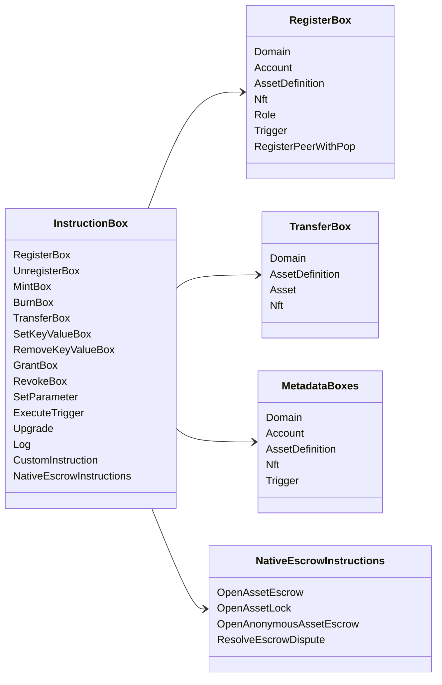

# Iroha Operações de instrução {#iroha-special-instructions}

O modelo de dados atual expõe essas famílias de instruções incorporadas:

|Instrução|Variantes|
| --- | --- |
| [`RegisterBox`](/pt/blockchain/instructions.md#un-register) | `Domain`, `Account`, `AssetDefinition`, `Nft`, `Role`, `Trigger`, `RegisterPeerWithPop` |
| [`UnregisterBox`](/pt/blockchain/instructions.md#un-register) | `Peer`, `Domain`, `Account`, `AssetDefinition`, `Nft`, `Role`, `Trigger` |
| [`MintBox`](/pt/blockchain/instructions.md#mint-burn) |numérico `Asset`, acionar repetições|
| [`BurnBox`](/pt/blockchain/instructions.md#mint-burn) |numérico `Asset`, acionar repetições|
| [`TransferBox`](/pt/blockchain/instructions.md#transfer) | `Domain`, `AssetDefinition`, numérico `Asset`, `Nft` |
| [`SetKeyValueBox`](/pt/blockchain/instructions.md#setkeyvalue-removekeyvalue) | `Domain`, `Account`, `AssetDefinition`, `Nft`, `Trigger` metadados |
| [`RemoveKeyValueBox`](/pt/blockchain/instructions.md#setkeyvalue-removekeyvalue) | `Domain`, `Account`, `AssetDefinition`, `Nft`, `Trigger` metadados |
| [`GrantBox`](/pt/blockchain/instructions.md#grant-revoke) | `Permission` (`Grant<Permission, Account>`), `Role` (`Grant<RoleId, Account>`), `RolePermission` (`Grant<Permission, Role>`) |
| [`RevokeBox`](/pt/blockchain/instructions.md#grant-revoke) | `Permission` (`Revoke<Permission, Account>`), `Role` (`Revoke<RoleId, Account>`), `RolePermission` (`Revoke<Permission, Role>`) |
| [`SetParameter`](/pt/blockchain/instructions.md#setparameter) |atualização do parâmetro da cadeia|
| [`ExecuteTrigger`](/pt/blockchain/instructions.md#executetrigger) |acionar execução|
| [`Upgrade`](/pt/blockchain/instructions.md#other-instructions) |atualização do executor|
| [`Log`](/pt/blockchain/instructions.md#other-instructions) |entrada de log do executor|
| [`CustomInstruction`](/pt/blockchain/instructions.md#other-instructions) |carga útil específica do executor JSON|
| [Depósito em garantia de ativo nativo](/pt/blockchain/escrow.md) | `OpenAssetEscrow`, `AcceptAssetEscrow`, `MarkEscrowPaymentSent`, `ReleaseAssetEscrow`, `CancelAssetEscrow`, `OpenEscrowDispute`, `ResolveEscrowDispute` |
| [Trancas de ativos genéricos](/pt/blockchain/escrow.md#generic-asset-locks) | `OpenAssetLock`, `DrawdownAssetLock`, `CancelAssetLock`, `ExpireAssetLock` |
| [Depósito fiduciário de ativos anônimo](/pt/blockchain/escrow.md#anonymous-escrow) | `OpenAnonymousAssetEscrow`, `AcceptAnonymousAssetEscrow`, `MarkAnonymousEscrowPaymentSent`, `ReleaseAnonymousAssetEscrow`, `CancelAnonymousAssetEscrow`, `OpenAnonymousEscrowDispute`, `ResolveAnonymousEscrowDispute` |
| [Liquidação privada atômica](/pt/blockchain/instructions.md#atomic-private-settlement) | `ActivatePrivateSettlementPoolV1`, `RotatePrivateSettlementPoolPolicyV1`, `FinalizeAtomicPrivateSettlementV1`, `AbortAtomicPrivateSettlementV1` |

Módulos adicionais Iroha 3 podem registrar tipos de instrução específicos do domínio através do registro de instruções. Para o esquema com autoridade do nó e um comando que o captura, veja [Esquema do Modelo de Dados](./data-model-schema.md).

::: details Diagrama: Famílias de Instruções Principais

:::
