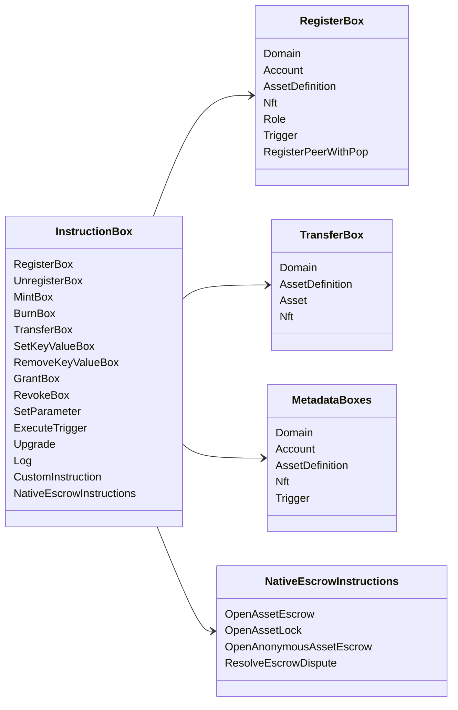

# Instruções especiais Iroha {#iroha-special-instructions}

O modelo de dados atual expõe estas famílias de instruções embutidas:

|Instrução |Variantes .|
| --- | --- |
| [`RegisterBox`](/pt/blockchain/instructions.md#un-register) | `Domain`, `Account`, `AssetDefinition`, `Nft`, `Role`, `Trigger`, `RegisterPeerWithPop` |
| [`UnregisterBox`](/pt/blockchain/instructions.md#un-register) | `Peer`, `Domain`, `Account`, `AssetDefinition`, `Nft`, `Role`, `Trigger` |
| [`MintBox`](/pt/blockchain/instructions.md#mint-burn) |Numérico `Asset`, provoca repetições |
| [`BurnBox`](/pt/blockchain/instructions.md#mint-burn) |Numérico `Asset`, provoca repetições |
| [`TransferBox`](/pt/blockchain/instructions.md#transfer) |`Domain`, `AssetDefinition`, numérico `Asset`, `Nft` |
| [`SetKeyValueBox`](/pt/blockchain/instructions.md#setkeyvalue-removekeyvalue) | `Domain`, `Account`, `AssetDefinition`, `Nft`, `Trigger` Metadados |
| [`RemoveKeyValueBox`](/pt/blockchain/instructions.md#setkeyvalue-removekeyvalue) | `Domain`, `Account`, `AssetDefinition`, `Nft`, `Trigger` Metadados |
| [`GrantBox`](/pt/blockchain/instructions.md#grant-revoke) |`Permission` (`Grant<Permission, Account>`), `Role` (`Grant<RoleId, Account>`), `RolePermission` (`Grant<Permission, Role>`) |
| [`RevokeBox`](/pt/blockchain/instructions.md#grant-revoke) |`Permission` (`Revoke<Permission, Account>`), `Role` (`Revoke<RoleId, Account>`), `RolePermission` (`Revoke<Permission, Role>`) |
| [`SetParameter`](/pt/blockchain/instructions.md#setparameter) |atualização de parâmetros da cadeia |
| [`ExecuteTrigger`](/pt/blockchain/instructions.md#executetrigger) |Trigger execução |
| [`Upgrade`](/pt/blockchain/instructions.md#other-instructions) |atualização do executor |
| [`Log`](/pt/blockchain/instructions.md#other-instructions) |registo de registro do executor |
| [`CustomInstruction`](/pt/blockchain/instructions.md#other-instructions) |Carga útil JSON específica para o executor |
| [Ativos nativos em garantia ](/pt/blockchain/escrow.md) | `OpenAssetEscrow`, `AcceptAssetEscrow`, `MarkEscrowPaymentSent`, `ReleaseAssetEscrow`, `CancelAssetEscrow`, `OpenEscrowDispute`, `ResolveEscrowDispute` |
| [Ativos genéricos ](/pt/blockchain/escrow.md#generic-asset-locks) |`OpenAssetLock`, `DrawdownAssetLock`, `CancelAssetLock`, `ExpireAssetLock` |
| [Ativos anônimos em garantia](/pt/blockchain/escrow.md#anonymous-escrow) | `OpenAnonymousAssetEscrow`, `AcceptAnonymousAssetEscrow`, `MarkAnonymousEscrowPaymentSent`, `ReleaseAnonymousAssetEscrow`, `CancelAnonymousAssetEscrow`, `OpenAnonymousEscrowDispute`, `ResolveAnonymousEscrowDispute` |
| [Liquidação privada atômica](/pt/blockchain/instructions.md#atomic-private-settlement) | `ActivatePrivateSettlementPoolV1`, `RotatePrivateSettlementPoolPolicyV1`, `FinalizeAtomicPrivateSettlementV1`, `AbortAtomicPrivateSettlementV1` |

Os módulos adicionais Iroha 3 podem registrar tipos de instruções específicos do domínio através do registro de instruções. Para a lista de nível de esquema gerada a partir da árvore fonte atual, consulte [Data Model Schema](./data-model-schema.md).

::: details Diagrama: Famílias de instrução básica

:::
