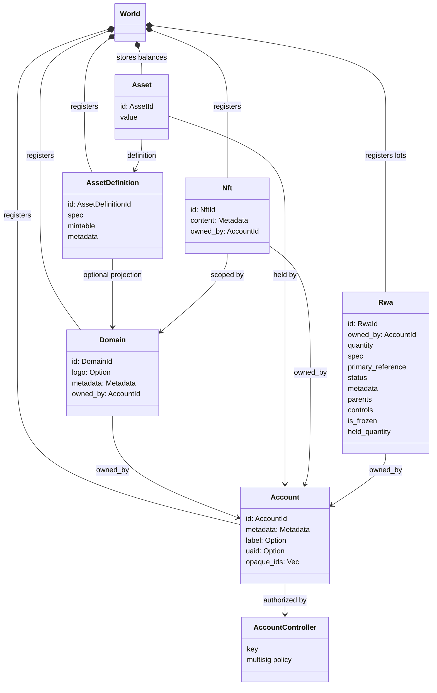
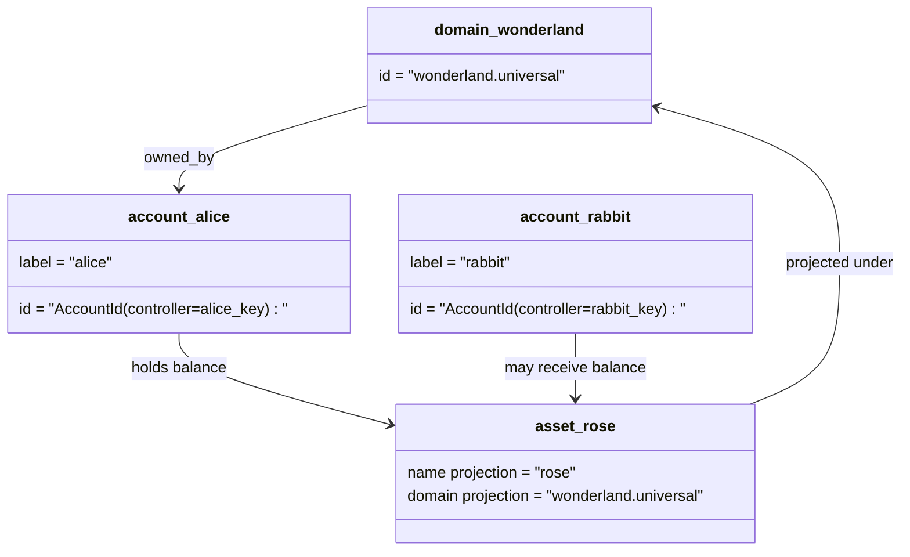

# Модель данных {#data-model}

Iroha хранит состояние бухгалтерского учета в `World`.

- домены имеют квалификацию по пространству данных, например `payments.universal`
- учетные записи являются каноническими и не имеют доменов; учетная запись ID происходит от администратора учетной записи
- определения активов могут поддерживать проекцию домена / имени, но их канонический текстовый адрес является непрозрачным идентификатором Base58.
- активы - балансы, удерживаемые счетами по определению конкретного актива
- NFTs являются учетными записями, имеющими доменную квалификацию IDs и содержанием метаданных.
- RWAs генерируются лоты-ID, которые представляют собой активы вне цепочки с текущим владельцем, количеством, происхождением, метаданными, хранением, заморозкой и контролем жизненного цикла

## Пример {#example}

В сети Iroha 3 `wonderland.universal` является доменом внутри пространства данных `universal`. Канонические учетные записи в этом примере контролируются их ключами или политиками и кодируются как бездоменная учетная запись I105 IDs. Читаемые этикетки, такие как `alice@wonderland.universal` являются отдельными псевдонимами, связанными с этими IDs. Предполагаемое определение активов все еще может быть создано из домена и имени, таких как `rose` в `wonderland.universal`, а канонический адрес определения активов, используемый на проводе, является генерированным адресом Base58.

## Прозвища {#aliases}

Алфавиты - это человеческие имена, слоированные над каноническими идентификаторами книги. Они полезны на границах API, CLI, кошелек и исследовательских границ, но канонические IDs остаются стабильными идентификаторами, хранящимися в строгих областях книги.

|Цель |Каноническая цель |Буквально.|Поддерживающая модель |
| -------------- | --------------------------------------------------- | ------------------------------------------------------ | ----------------------------------------------------------------------------- |
|Аккаунт пользователя |бездоменный `AccountId` кодированный как адрес I105 |`name@domain.dataspace` или `name@dataspace` |`AccountAlias`; первичный псевдоним - `Account.label`, дополнительные псевдонимы являются обязательными |
|Определение активов |канонический адрес `AssetDefinitionId` Base58 |`name#domain.dataspace` или `name#dataspace` |`AssetDefinitionAlias` связанный с определением активов |
|Договор |Канонический Bech32m `ContractAddress` |`name::domain.dataspace` или `name::dataspace` |`ContractAlias` связанный с распределенным контрактным адресом |
|Доменное имя |`DomainId` в форме `domain.dataspace` |`domain.dataspace` |SNS `domain` Запись именного пространства |
|Название пространства данных |цифровая `DataSpaceId` из активного каталога Nexus |псевдонимы пространства данных, такие как `universal`, `paynet` или `zk` |SNS `dataspace` запись именного пространства плюс каталог активного пространства данных |

Псевдонимы счетов - это имена учетных записей, обращенные к пользователям. Они выживают после регистрации учетной записи, потому что псевдоним указывает на активный счет ID через индексы мировых государств и записи о регистрации учетных записях. Используйте `SetPrimaryAccountAlias` для первичной маркировки счета, `SetAccountAliasBinding` для дополнительных непервичных псевдонимов и `FindAccountByAlias` или `FindAliasesByAccountId` для чтений. Для псевдонимных аккаунтов обычно требуется активный арендный контракт под названием SNS за счет, приобретенный с `AcquireAccountAliasLease` и продленный с `RenewAccountAliasLease`.

Идентификации активов - это определения названий активов, а не индивидуальные балансы счетов. Прозвища активов устанавливаются на `SetAssetDefinitionAlias`; сегмент имени прозвища должен совпадать с названием отображения определения актива или названием прогнозируемого определения. Прозвища контракта определяются на `SetContractAlias`; пространство данных прозвища должно соответствовать пространству данных, кодированному в адресе договора. Обе связи могут нести `lease_expiry_ms`; после истечения срока они перестают решаться, когда проходит окно благодати и удаляются из индексов мировых государств.

Домены не имеют отдельного объекта `DomainAlias`. Идентификатор домена уже является квалифицированным именем пространства данных, таким как `payments.universal`. SNS отслеживает аренду собственности на имена доменов в пространстве имен `domain` и для псевдонимов пространства данных в пространстве названий `dataspace`. Определенный `universal` псевдоним пространства данных должен оставаться определенным.

## Соответствующие документы {#related-docs}

|Тема |Куда идти ?|
| -------------------------------------- | ------------------------------------------- |
|Домены | [Домены](/ru/blockchain/domains.md) |
|Счеты | [Счета](/ru/blockchain/accounts.md) |
|Активы | [Активы](/ru/blockchain/assets.md) |
|NFTs | [NFTs](/ru/blockchain/nfts.md) |
|Реальные активы | [Реальные активы](/ru/blockchain/rwas.md) |
|Метаданные | [Метаданные](/ru/blockchain/metadata.md) |
|Инструкции по регистрации и передаче | [Инструкция](/ru/blockchain/instructions.md) |
|Разрешения на время запуска | [Разрешения](/ru/blockchain/permissions.md) |
|Правила наименования | [Правила наименования](/ru/reference/naming.md) |
