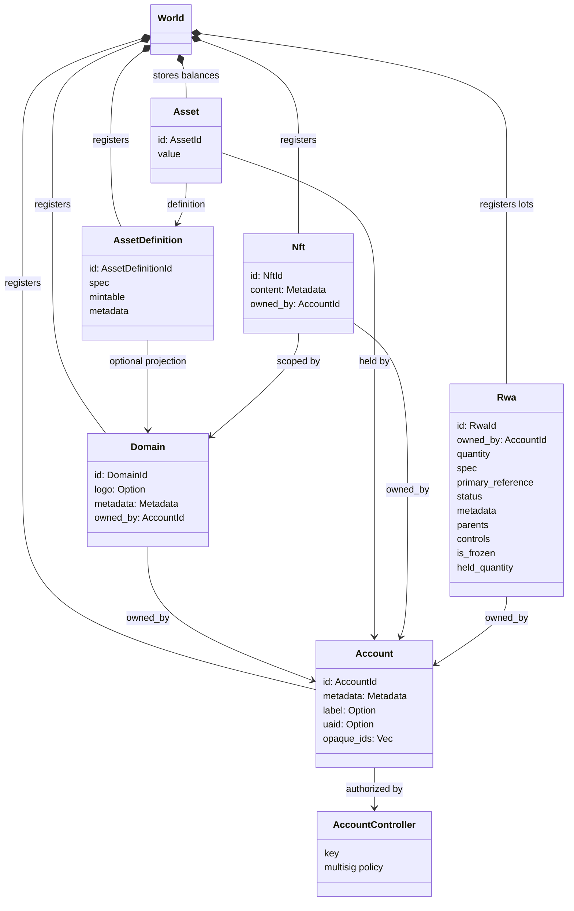
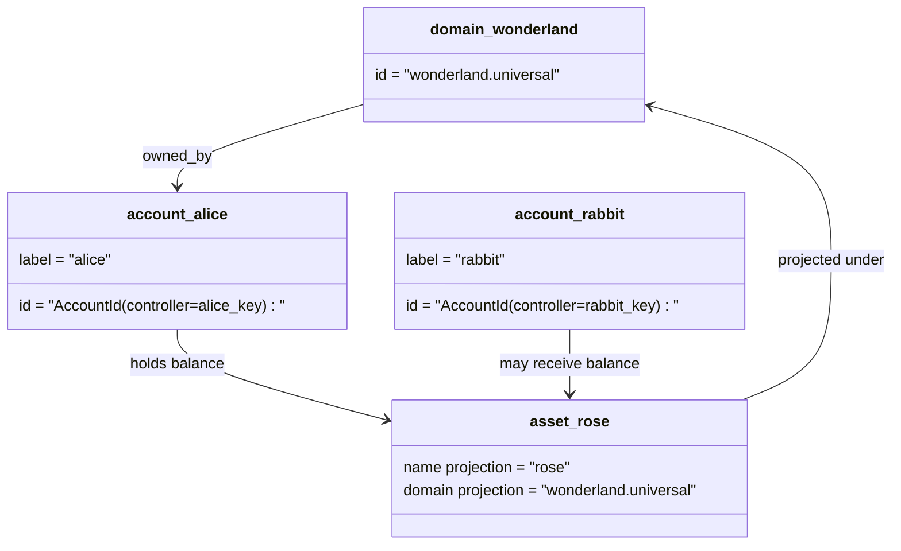

# Модель данных {#data-model}

Iroha магазины бухгалтерского учета в штате `World`. Применяется модель данных первого выпуска
следующие канонические идентичности и организации:

- Домены обладают квалификацией по пространству данных, например `payments.universal`
- учетные записи являются каноническими и бездоменными; ID Вытекает из
  контролер счета
- определения активов могут сохранять доменную/назвательную проекцию, но их канонические
  текстовый адрес является непрозрачным идентификатором Base58
- активы - балансы, содержащиеся в счетах для определения конкретного актива
- NFTs являются документами, принадлежащими исключительно владельцам доменов. IDs и метаданные
  содержание
- RWAs создаются -ID лоты, представляющие активы вне цепочки с текущим
  владелец, количество, происхождение, метаданные, хранилище, замораживание и жизненный цикл
  Контроль

## Пример {#example}

В одной Iroha 3 сеть, `wonderland.universal` является доменом внутри
`universal` Канонические отчеты в этом примере контролируются
по своим ключам или политикам и кодируются как бездоменные I105 учетный счет IDs. Читаемый
этикетки, такие как `alice@wonderland.universal` являются отдельными псевдонимами, связанными с этими
IDs. Определение предполагаемого актива может быть по-прежнему создано из домена и
имя, такое как `rose` в `wonderland.universal`, в то время как канонический актив
адрес определения, используемый на проводе, является генерируемым адресом Base58.

## Прозвища {#aliases}

Алфавиты - это человеческие имена, слоированные над каноническими идентификаторами.
Они полезны для API, CLI, кошелек, и исследовательские границы, но канонические
IDs остаются стабильными идентификаторами, хранящимися в строгих учетных записях.

| Цель         | Каноническая цель                                    | Буквальный прозвище                                          | Поддерживающая модель                                                                 |
| -------------- | --------------------------------------------------- | ------------------------------------------------------ | ----------------------------------------------------------------------------- |
| Аккаунт пользователя   | бездоменный `AccountId` кодируются как I105 адрес   | `name@domain.dataspace` или `name@dataspace`            | `AccountAlias`; первичный псевдоним `Account.label`, Дополнительные псевдонимы являются обязательными  |
| Определение активов | канонический `AssetDefinitionId` Адрес Base58     | `name#domain.dataspace` или `name#dataspace`            | `AssetDefinitionAlias` привязанность к определению активов                           |
| Договор       | Канонический Bech32m `ContractAddress`                 | `name::domain.dataspace` или `name::dataspace`          | `ContractAlias` связанный с распределенным контрактным адресом                          |
| Доменное имя    | `DomainId` в `domain.dataspace` формы               | `domain.dataspace`                                    | SNS `domain` запись пространства имен                                                 |
| Название пространства данных | цифровая `DataSpaceId` от активных Nexus каталог | псевдонимы пространства данных, такие как `universal`, `paynet`, или `zk` | SNS `dataspace` запись namespace плюс каталог активного пространства данных            |

Идентификаторы аккаунтов - это имена аккаунта, которые используются пользователями.
рекеайтинг , потому что псевдоним указывает на активный счет ID через мировое государство
Индексы и учетные записи. `SetPrimaryAccountAlias` для
первичная этикетка счета, `SetAccountAliasBinding` для дополнительных невыпускных классов
псевдоним, и `FindAccountByAlias` или `FindAliasesByAccountId` для чтения.
Счетные прозвища обычно требуют активного SNS приобретенный лизинговый контракт
с `AcquireAccountAliasLease` и возобновляется с `RenewAccountAliasLease`.

Профильные названия активов - определения активов, а не индивидуальные балансы счетов.
Псевдоним и контрактные псевдоим являются прямыми обязательствами от читаемого имени к
существующая каноническая цель. `SetAssetDefinitionAlias`;
сегмент имени под псевдонимом должен соответствовать названию отображения определения актива или
Проектированное название определения. `SetContractAlias`;
псевдоним пространство данных должно соответствовать пространству данных, кодированному в адресе договора.
Обе связи могут нести `lease_expiry_ms`; после истечения срока действия они перестают разрешаться
Когда пройдет время, и они будут удалены из индексов мировых государств.

Домены не имеют отдельных `DomainAlias` Объект. Идентификатор домена
уже имеется имя, которое соответствует требованиям пространства данных: `payments.universal`. SNS следы
арендной собственности на доменные имена в `domain` namespace и для данных
псевдоним в `dataspace` Пространство названий. `universal` псевдоним пространства данных
Должен оставаться определенным.

## Соответствующие документы {#related-docs}

| Тема                                  | Куда идти?                                 |
| -------------------------------------- | ------------------------------------------- |
| Домены                                | [Домены](/ru/blockchain/domains.md)           |
| Счета                               | [Счета](/ru/blockchain/accounts.md)         |
| Активы                                 | [Активы](/ru/blockchain/assets.md)             |
| NFTs                                   | [NFTs](/ru/blockchain/nfts.md)                 |
| Реальные активы                      | [Активы в реальном мире](/ru/blockchain/rwas.md)    |
| Метаданные                               | [Метаданные](/ru/blockchain/metadata.md)         |
| Инструкции по регистрации и передаче | [Инструкции](/ru/blockchain/instructions.md) |
| Разрешения на время запуска                    | [Разрешения](/ru/blockchain/permissions.md)   |
| Правила присвоения наименований                           | [Правила присвоения наименований](/ru/reference/naming.md)        |
