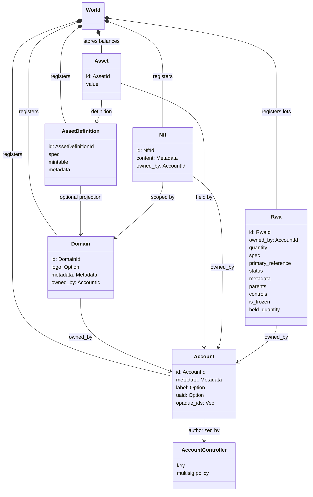
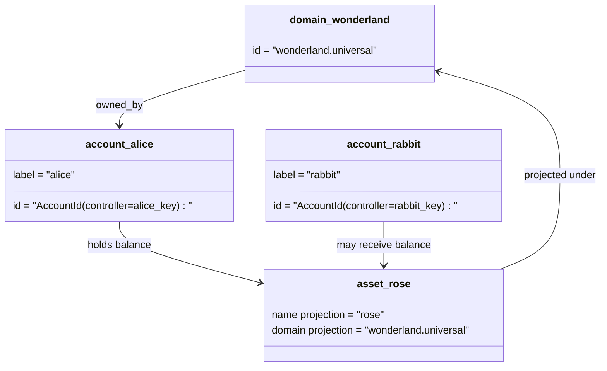

# Модель данных {#data-model}

Iroha хранит состояние распределенного реестра блокчейна в `World`. Модель данных первой версии использует следующие канонические идентичности и сущности:

- домены имеют квалификацию пространства данных, например `payments.universal`
- аккаунты канонические и бездоменные; идентификатор аккаунта выводится из контроллера аккаунта
- определения активов могут хранить проекцию домена/имени, но их канонический текстовый адрес является непрозрачным идентификатором Base58
- активы — это балансы, удерживаемые счетами для определенного определения актива
- NFTs — это уникально принадлежащие записи с идентификаторами, квалифицированными по домену, и метаданным содержанием
- RWAs — это сгенерированные идентификаторы лотов, которые представляют внецепочечные активы с текущим владельцем, количеством, происхождением, метаданными, удержаниями, блокировками и управлением жизненным циклом

## Пример {#example}

В сети Iroha 3 `wonderland.universal` является доменом внутри пространства данных `universal`. Канонические аккаунты в этом примере контролируются своими ключами или политиками и кодируются как аккаунт ID без домена I105. Читаемые метки, такие как `alice@wonderland.universal`, являются отдельными псевдонимами, привязанными к этим ID. Проектируемое определение актива все еще можно построить из домена и имени, таких как `rose` в `wonderland.universal`, в то время как канонический адрес определения актива, используемый при передаче протокола, является сгенерированным адресом Base58.

## Псевдонимы {#aliases}

Псевдонимы — это имена, ориентированные на человека, наложенные на канонические идентификаторы распределенного реестра блокчейна. Они полезны на границах API, CLI, кошелька и обозревателя, но канонические идентификаторы остаются стабильными идентификаторами, хранимыми в строгих полях распределенного реестра блокчейна.

|Цель|каноническая цель|Псевдоним буквально|Резервная модель|
| -------------- | --------------------------------------------------- | ------------------------------------------------------ | ----------------------------------------------------------------------------- |
|Учётная запись пользователя|бездоменный `AccountId`, закодированный как адрес I105| `name@domain.dataspace` или `name@dataspace`            | `AccountAlias`; основной псевдоним — `Account.label`, дополнительные псевдонимы — привязки |
|Определение актива|канонический `AssetDefinitionId` адрес Base58| `name#domain.dataspace` или `name#dataspace`            | `AssetDefinitionAlias` привязано к определению актива|
|Контракт|канонический Bech32m `ContractAddress`| `name::domain.dataspace` или `name::dataspace`          |`ContractAlias` привязано к развернутому адресу контракта|
|Доменное имя| `DomainId` в форме `domain.dataspace` | `domain.dataspace`                                    | SNS `domain` пространство имён запись |
|Имя пространства данных|цифровой `DataSpaceId` из активного Nexus каталога|псевдоним пространства данных, такой как `universal`, `paynet` или `zk`|SNS `dataspace` пространство имен записи плюс активный каталог области данных|

Псевдонимы аккаунтов — это имена аккаунтов, видимые пользователю. Они сохраняются при смене ключа аккаунта, потому что псевдоним указывает на активный идентификатор аккаунта через индексы состояния мира и записи о смене ключа аккаунта. Используйте `SetPrimaryAccountAlias` для основного ярлыка аккаунта, `SetAccountAliasBinding` — для дополнительных неосновных псевдонимов, а `FindAccountByAlias` или `FindAliasesByAccountId` — для чтения. Псевдонимы аккаунта обычно требуют активной аренды псевдонима аккаунта SNS, полученной с помощью `AcquireAccountAliasLease` и продленной с помощью `RenewAccountAliasLease`.

Псевдонимы активов именуют определения активов, а не отдельные балансы счетов. Псевдонимы активов и псевдонимы контрактов являются прямыми привязками от читаемого имени к существующей канонической цели. Псевдонимы активов задаются с помощью `SetAssetDefinitionAlias`; сегмент имени псевдонима должен соответствовать отображаемому имени определения актива или имени проецируемого определения. Псевдонимы контрактов задаются с помощью `SetContractAlias`; псевдоним пространства данных должен соответствовать пространству данных, закодированному в адресе контракта. Оба привязанных элемента могут содержать `lease_expiry_ms`; после истечения срока действия они перестают разрешаться, когда истекает льготный период, и удаляются из индексов состояния мира.

Домены не имеют отдельного объекта `DomainAlias`. Идентификатор домена уже является именем, квалифицированным для пространства данных, таким как `payments.universal`. SNS отслеживает владение арендой для доменных имен в пространстве имён `domain` и для псевдонимов областей данных в пространстве имён `dataspace`. Зарезервированный псевдоним области данных `universal` должен оставаться определённым.

## Связанные документы {#related-docs}

|Тема|Куда идти|
| -------------------------------------- | ------------------------------------------- |
|Домены| [Домены](/ru/blockchain/domains.md)           |
|Счета| [Аккаунты](/ru/blockchain/accounts.md)         |
|Активы|[Активы](/ru/blockchain/assets.md)|
| NFTs                                   | [NFTs](/ru/blockchain/nfts.md)                 |
|Активы реального мира| [Активы реального мира](/ru/blockchain/rwas.md)    |
|Метаданные| [Метаданные](/ru/blockchain/metadata.md)         |
|Инструкции по регистрации и передаче| [Инструкции](/ru/blockchain/instructions.md) |
|разрешения времени выполнения программного обеспечения| [Разрешения](/ru/blockchain/permissions.md)   |
|Правила именования|[Правила именования](/ru/reference/naming.md)        |
