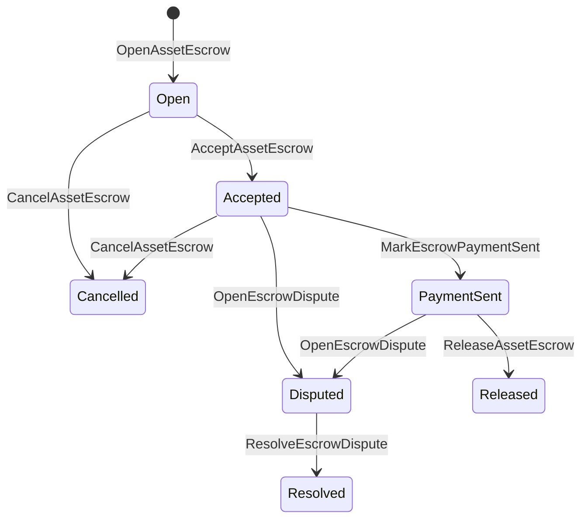

# Сберегательная задолженность за собственные активы {#native-asset-escrow}

Native escrow - это механизм хранения цифровых активов, управляемый бухгалтерской книгой. Вместо отправки активов на учетную запись, принадлежащую приложению, и полагаясь на код приложения для защиты этой счета, опека ISIs переводит стоимость на детерминистический протокол счета по хранению и записывает жизненный цикл опеки в мировом состоянии.

Используйте нативные поручительства для расчетов на рынке, координацию платежей вне цепочки в стиле Атайи, блокировки этапов и защищенные рабочие процессы поручительства, которые требуют видного состояния жизненного цикла в регистре.

## Концепции {#concepts}

|Концепция .|Описание |
| --- | --- |
|`EscrowId` |Идентификатор, выбранный вызовителем, упакованный в хэш. Он должен быть уникальным среди прозрачных и анонимных поручителей. |
|`AssetEscrowRecord` |Прозрачная цифровая конфиденциальность активов или запись замка. |
|`AnonymousAssetEscrowRecord` |Защищенная запись о поручительстве, подкрепленная аннулирующими документами, обязательствами и приложениями к доказательствам. |
|Счет опеки |Детерминистический протокол счета, полученный из цепи ID, поручительства ID и определения активов. |
|Доказательства хешс |Хеш с расчетами, судами, сообщениями, хранилищами или другими доказательствами вне цепи.|

Прозрачные записи содержат продавца, факультативного покупателя, определение активов, общую сумму, учетную запись по хранению, состояние жизненного цикла, вид поведения, оставшуюся сумму, опционный авторитет выпуска, опциональный срок истечения срока действия, хэши доказательств, временные штампы и детали решений.

Суммы сбережений должны быть положительными количествами активов и должны соответствовать численной спецификации определения активов. В то время как депозитная запись или блокировка активны, общие трансферты активов не могут истощать счет по хранению; Выходные пути по уходу за ребенком - это гарантия. ISIs описанные ниже.

## Рыночные депозиты {#marketplace-escrow}

Рыночная конфиденциальность координирует выпуск активов в цепочке с рабочим процессом оплаты или доставки вне цепочки.



|ISI |Кто его подает ?|Влияние |
| --- | --- | --- |
|`OpenAssetEscrow` |Продавец |Закрывает цифровой актив продавца в протокольном хранении и создает рыночный рекорд `Open`. |
|`AcceptAssetEscrow` |Покупатель |Записывает покупателя и переводит `Open` на `Accepted`. Продавец не может принять свой собственный поручительство. |
|`MarkEscrowPaymentSent` |Принятый покупатель |Перемещается `Accepted` на `PaymentSent` после того, как покупатель отправляет платеж вне цепи. |
|`ReleaseAssetEscrow` |Продавец |Перемещает `PaymentSent` на `Released` и передает покупателю полную сумму закрепленного залога. |
|`CancelAssetEscrow` |Продавец |Перемещает `Open` или `Accepted` на `Cancelled` и возвращает продавцу сумму до заметки платежа. |
|`OpenEscrowDispute` |Продавец или принятый покупатель |Перемещает `Accepted` или `PaymentSent` в `Disputed` и добавляет хэши доказательств. |
|`ResolveEscrowDispute` |Счет с `CanResolveEscrowDispute` |Перемещается `Disputed` на `Resolved` и делится сумма между покупателем и продавцом. |

Сумма разрешения споров должна быть не отрицательной, а `buyer_amount + seller_amount` должна равняться сумме поручительства.

### Rust Пример {#rust-example}

В этом примере предполагается, что счета продавца и покупателя уже существуют, определение активов зарегистрировано как числовое, а у продавца есть достаточный баланс.

```rust
use iroha::{
    client::Client,
    data_model::{
        isi::escrow::{
            AcceptAssetEscrow, MarkEscrowPaymentSent, OpenAssetEscrow,
            ReleaseAssetEscrow,
        },
        prelude::*,
    },
};
use iroha_crypto::Hash;

fn release_marketplace_escrow(
    seller_client: &Client,
    buyer_client: &Client,
    asset_definition_id: AssetDefinitionId,
) -> eyre::Result<()> {
    let escrow_id = EscrowId::new(Hash::new("docs-marketplace-escrow-001"));

    seller_client.submit_blocking(OpenAssetEscrow::with_evidence_hashes(
        escrow_id,
        asset_definition_id,
        Numeric::from(40_u64),
        vec![Hash::new("invoice:2026-001")],
    ))?;

    buyer_client.submit_blocking(AcceptAssetEscrow::new(escrow_id))?;
    buyer_client.submit_blocking(MarkEscrowPaymentSent::new(escrow_id))?;
    seller_client.submit_blocking(ReleaseAssetEscrow::new(escrow_id))?;

    let record = seller_client.query_single(FindAssetEscrowById::new(escrow_id))?;
    assert_eq!(record.status, AssetEscrowStatus::Released);
    assert_eq!(record.remaining_amount, Numeric::zero());

    Ok(())
}
```

## Обычные блокировки активов {#generic-asset-locks}

Заключения активов используют тот же тип записей о хранении, но они не являются предложениями покупателя-продавца. Они блокируют средства для учетной записи назначения и, возможно, требуют отдельного органа по выпуску средств для извлечения средств.

|ISI |Кто его подает ?|Влияние |
| --- | --- | --- |
|`OpenAssetLock` |Источник счета |Задерживает положительную сумму, записывает местонахождение в качестве рекордного покупателя и устанавливает статус на `Locked`. |
|`DrawdownAssetLock` |Уполномоченный орган по выпуску или пункт назначения, если нет установленного органа по выпуске |Перевод части или всей оставшейся попечительства в место назначения. |
|`CancelAssetLock` |Открыватель замка .|Отменяет активный замок и возвращает оставшуюся сумму на открыватель. |
|`ExpireAssetLock` |Любой орган по сделкам после истечения срока |Замок с `expires_at_ms` в прошлом истекает и оставшуюся сумму возвращается открывателю. |

`DrawdownAssetLock` хранит запись в `Locked`, пока остается некоторая сумма. Когда оставшаяся сумма достигает нуля, статус становится `DrawnDown` и запись закрывается.

```rust
use iroha::{
    client::Client,
    data_model::{
        isi::escrow::{CancelAssetLock, DrawdownAssetLock, ExpireAssetLock, OpenAssetLock},
        prelude::*,
    },
};
use iroha_crypto::Hash;

fn drawdown_and_close_asset_locks(
    opener_client: &Client,
    destination_client: &Client,
    release_authority_client: &Client,
    asset_definition_id: AssetDefinitionId,
    destination: AccountId,
    release_authority: AccountId,
) -> eyre::Result<()> {
    let trusted_lock_id = EscrowId::new(Hash::new("docs-asset-lock-trusted"));

    opener_client.submit_blocking(OpenAssetLock::with_options(
        trusted_lock_id,
        asset_definition_id.clone(),
        destination.clone(),
        Numeric::from(40_u64),
        Some(release_authority),
        None,
        vec![Hash::new("milestone-plan-v1")],
    ))?;

    release_authority_client.submit_blocking(DrawdownAssetLock::new(
        trusted_lock_id,
        Numeric::from(15_u64),
    ))?;

    let partially_drawn =
        opener_client.query_single(FindAssetEscrowById::new(trusted_lock_id))?;
    assert_eq!(partially_drawn.status, AssetEscrowStatus::Locked);
    assert_eq!(partially_drawn.remaining_amount, Numeric::from(25_u64));

    opener_client.submit_blocking(CancelAssetLock::new(trusted_lock_id))?;
    let cancelled = opener_client.query_single(FindAssetEscrowById::new(trusted_lock_id))?;
    assert_eq!(cancelled.status, AssetEscrowStatus::Cancelled);

    let expiring_lock_id = EscrowId::new(Hash::new("docs-asset-lock-expiring"));
    opener_client.submit_blocking(OpenAssetLock::with_options(
        expiring_lock_id,
        asset_definition_id,
        destination,
        Numeric::from(10_u64),
        None,
        Some(0),
        Vec::new(),
    ))?;

    destination_client.submit_blocking(ExpireAssetLock::new(expiring_lock_id))?;
    let expired = opener_client.query_single(FindAssetEscrowById::new(expiring_lock_id))?;
    assert_eq!(expired.status, AssetEscrowStatus::Expired);

    Ok(())
}
```

Python в настоящее время подвергает воздействию высокоуровневые вспомогательные средства для генеральных замков: `open_asset_lock`, `drawdown_asset_lock`, `cancel_asset_lock`, и `expire_asset_lock`. Для рынка и анонимного поручительства от Python, использовать канонический `InstructionBox` JSON через SDK Я ... JSON выхода из люка, или подвергнуться через SDK что выявляет первоклассных строителей поручительства.

## Споры {#disputes}

Рыночный поручитель может вступить в споры с `Accepted` или `PaymentSent`. Лишь зарегистрированный продавец или покупатель может открыть спор. `CanResolveEscrowDispute`, либо предоставляется непосредственно счету решителя, либо унаследован через роль.

```rust
use iroha::{
    client::Client,
    data_model::{
        isi::escrow::{OpenEscrowDispute, ResolveEscrowDispute},
        prelude::*,
    },
};
use iroha_crypto::Hash;
use iroha_executor_data_model::permission::escrow::CanResolveEscrowDispute;

fn resolve_disputed_escrow(
    admin_client: &Client,
    buyer_client: &Client,
    court_client: &Client,
    court: AccountId,
    escrow_id: EscrowId,
) -> eyre::Result<()> {
    admin_client.submit_blocking(Grant::account_permission(
        Permission::from(CanResolveEscrowDispute),
        court,
    ))?;

    buyer_client.submit_blocking(OpenEscrowDispute::with_evidence_hashes(
        escrow_id,
        vec![Hash::new("buyer-payment-receipt")],
    ))?;

    court_client.submit_blocking(ResolveEscrowDispute::with_evidence_hashes(
        escrow_id,
        Numeric::from(30_u64),
        Numeric::from(10_u64),
        vec![Hash::new("court-judgement-001")],
    ))?;

    let record = admin_client.query_single(FindAssetEscrowById::new(escrow_id))?;
    assert_eq!(record.status, AssetEscrowStatus::Resolved);
    assert_eq!(
        record.resolution.as_ref().map(|resolution| resolution.buyer_amount.clone()),
        Some(Numeric::from(30_u64)),
    );

    Ok(())
}
```

## Анонимная сберегательная организация {#anonymous-escrow}

Anonymous escrow использует один и тот же рыночный жизненный цикл, но движение финансирования и закрытия активов защищается. Суммы и получатели в закрепленных банкнотах представлены обязательствами, аннулирующими актами и приложениями к доказательствам.

|Прозрачность ISI |Анонимный ISI |
| --- | --- |
|`OpenAssetEscrow` |`OpenAnonymousAssetEscrow` |
|`AcceptAssetEscrow` |`AcceptAnonymousAssetEscrow` |
|`MarkEscrowPaymentSent` |`MarkAnonymousEscrowPaymentSent` |
|`ReleaseAssetEscrow` |`ReleaseAnonymousAssetEscrow` |
|`CancelAssetEscrow` |`CancelAnonymousAssetEscrow` |
|`OpenEscrowDispute` |`OpenAnonymousEscrowDispute` |
|`ResolveEscrowDispute` |`ResolveAnonymousEscrowDispute` |

Портфель или инструмент проверки должны создавать доказательную прикрепление и публичные входы. Открытие создает одно обязательство по хранению. Выпуск, отмена и анонимное разрешение споров должны потратить точно одно обязательство о хранении и создать покупателя, продавца или разделенные обязательства по выходу, требуемые действием.

```rust
use iroha::{
    client::Client,
    data_model::{
        isi::escrow::{
            AcceptAnonymousAssetEscrow, MarkAnonymousEscrowPaymentSent,
            OpenAnonymousAssetEscrow,
        },
        prelude::*,
        proof::ProofAttachment,
    },
};
use iroha_crypto::Hash;

fn open_anonymous_escrow(
    seller_client: &Client,
    buyer_client: &Client,
    escrow_id: EscrowId,
    asset_definition_id: AssetDefinitionId,
    funding_nullifiers: Vec<[u8; 32]>,
    escrow_commitment: [u8; 32],
    proof: ProofAttachment,
    root_hint: Option<[u8; 32]>,
) -> eyre::Result<()> {
    seller_client.submit_blocking(OpenAnonymousAssetEscrow::with_evidence_hashes(
        escrow_id,
        asset_definition_id,
        funding_nullifiers,
        escrow_commitment,
        proof,
        root_hint,
        vec![Hash::new("shielded-invoice")],
    ))?;

    buyer_client.submit_blocking(AcceptAnonymousAssetEscrow::new(escrow_id))?;
    buyer_client.submit_blocking(MarkAnonymousEscrowPaymentSent::new(escrow_id))?;

    Ok(())
}
```

Для базовой модели защищенных транзакций см. [Anonymous Transactions](/ru/blockchain/anonymous-transactions.md).

## SDK Использование {#sdk-usage}

Поддержка сбережений различается в разных странах. SDKs. Rust имеет каноническую типовую модель данных. Python в настоящее время подвергает воздействию генерические помощники для блокировки активов. JavaScript и TypeScript использование Kotodama Позвонить хозяину. Kotlin/JVM и Swift предоставление типовых конструкторов полезных грузов для рынка и анонимного поручительства.

|SDK |Используйте эту поверхность .|Сфера действия |
| --- | --- | --- |
| [Rust](#rust-sdk) |`iroha::data_model::isi::escrow` |Рыночные депозиты, общие блокировки, анонимные депозиты, запросы и мероприятия. |
| [Python](#python-asset-locks) |`Instruction.open_asset_lock`, `TransactionDraft.open_asset_lock`, а также помощники клиента `*_and_wait` |Общие блокировки активов. Рыночная площадка и анонимные помощники по хранению не являются методами первого класса Python пока. |
| [JavaScript / TypeScript](#javascript-and-typescript-kotodama) |`compileKotodamaProgram` от `@iroha/iroha-js/kotodama-compiler` |Эскорные звонки хозяина в рамках контрактов Kotodama. |
| [Kotlin / JVM](#kotlin-and-jvm) |`InstructionTemplate` классы в `org.hyperledger.iroha.sdk.core.model.instructions` |Рыночная площадка и анонимные шаблоны инструктажей на хранение. |
| [Swift / iOS](#swift-and-ios) |Помощники `NativeEscrowInstructionBuilders` и `IrohaSDK.build*Escrow*` |Рыночные и анонимные поручительные инструктажи Norito JSON полезные грузы. |

Ниже приведенные примеры сосредоточены на строительстве инструкций. Финансирование счетов, управление подписями и представление транзакции следуют нормальному потоку для каждого SDK.

### Rust SDK {#rust-sdk}

Используйте Rust SDK Примеры выше показывают распространение на рынке, общие блокировки, разрешения споров, а также анонимного строительства поручительства с `iroha::data_model::isi::escrow`.

```rust
use iroha::{
    client::Client,
    data_model::{isi::escrow::OpenAssetEscrow, prelude::*},
};
use iroha_crypto::Hash;

fn open_and_read(
    client: &Client,
    asset_definition_id: AssetDefinitionId,
) -> eyre::Result<AssetEscrowRecord> {
    let escrow_id = EscrowId::new(Hash::new("docs-rust-sdk-escrow"));

    client.submit_blocking(OpenAssetEscrow::new(
        escrow_id,
        asset_definition_id,
        Numeric::from(10_u64),
    ))?;

    client.query_single(FindAssetEscrowById::new(escrow_id))
}
```

### Python Закрытие активов {#python-asset-locks}

Python SDK раскрывает первоклассные помощники для общих блокировки активов.Используйте их для платежей в рамках этапов, вычетов уполномоченным органом по освобождению, аннулирования от открывателя и возврата по истечении срока действия.

```python
client.open_asset_lock_and_wait(
    chain_id="dev-chain",
    authority="<source-account-id>",
    private_key_hex="<source-private-key-hex>",
    escrow_id="merchant-lock-001",
    asset_definition_id="<asset-definition-base58>",
    destination="<destination-account-id>",
    amount="2500",
    release_authority="<trusted-release-account-id>",
    expires_at_ms=1_704_000_000_000,
)

client.drawdown_asset_lock_and_wait(
    chain_id="dev-chain",
    authority="<trusted-release-account-id>",
    private_key_hex="<trusted-release-private-key-hex>",
    escrow_id="merchant-lock-001",
    amount="1000",
)

client.expire_asset_lock_and_wait(
    chain_id="dev-chain",
    authority="<any-account-id>",
    private_key_hex="<any-private-key-hex>",
    escrow_id="merchant-lock-001",
)
```

Для двухстороннего блокировки вычеркните `release_authority`; после этого учетная запись пункта назначения может подать `drawdown_asset_lock`.

### JavaScript и TypeScript Kotodama {#javascript-and-typescript-kotodama}

В настоящее время JavaScript SDK в настоящее время не раскрывает прямых создателей транзакций с помощью собственных депозитов. для JavaScript или TypeScript приложения, которые внедряются Kotodama Договоры, составление сопроводительных звонков с помощью Kotodama компилятор.

Native escrow host calls require explicit access hints because the compiler cannot derive narrower access sets for opaque escrow ISIs. Используйте указания на открытые карты на экспортируемых входных точках, которые называют встроенные устройства `escrow_*`.

```js
import { compileKotodamaProgram } from "@iroha/iroha-js/kotodama-compiler";

const source = `
seiyaku MarketplaceEscrow {
  meta { abi_version: 1; }

  #[access(read="*", write="*")]
  kotoage fn run() permission(Admin) {
    let asset = asset_definition("62Fk4FPcMuLvW5QjDGNF2a4jAmjM");
    let offer = name("aitai_offer");
    let evidence = norito_bytes("00");

    call escrow_open_offer(offer, asset, 10, evidence);
    call escrow_accept(offer);
    call escrow_mark_payment_sent(offer);
    call escrow_release(offer);
  }
}
`;

const compiled = compileKotodamaProgram(source, {
  sourceName: "escrow.ko",
});

if (compiled.diagnostics.length > 0) {
  throw new Error(compiled.diagnostics.map((item) => item.message).join("\n"));
}
```

Для споров используйте `escrow_open_dispute(offer, evidence)` и `escrow_resolve_dispute(offer, buyer_amount, seller_amount, evidence)`. Анонимные вызовы хоста-эскроя принимают байты полезной нагрузки запроса Norito, например `anonymous_escrow_open_offer(request)`.

### Kotlin и JVM {#kotlin-and-jvm}

Kotlin/JVM SDK моделируют нативный депозит в качестве шаблонов пользовательских инструкций. Каждый шаблон подтверждает требуемые поля и раскрывает каноническую карту аргументов, используемую конструктором транзакций.

```kotlin
import org.hyperledger.iroha.sdk.core.model.escrow.NativeEscrowPermissions
import org.hyperledger.iroha.sdk.core.model.instructions.AcceptAssetEscrowInstruction
import org.hyperledger.iroha.sdk.core.model.instructions.MarkEscrowPaymentSentInstruction
import org.hyperledger.iroha.sdk.core.model.instructions.OpenAssetEscrowInstruction
import org.hyperledger.iroha.sdk.core.model.instructions.ReleaseAssetEscrowInstruction
import org.hyperledger.iroha.sdk.core.model.instructions.ResolveEscrowDisputeInstruction

val open = OpenAssetEscrowInstruction(
    escrowId = "escrow-hash",
    assetDefinition = "xor#wonderland",
    amount = "42.5",
    evidenceHashes = listOf("invoice-hash"),
)
val accept = AcceptAssetEscrowInstruction("escrow-hash")
val paid = MarkEscrowPaymentSentInstruction("escrow-hash")
val release = ReleaseAssetEscrowInstruction("escrow-hash")
val resolve = ResolveEscrowDisputeInstruction(
    escrowId = "escrow-hash",
    buyerAmount = "30",
    sellerAmount = "12.5",
    evidenceHashes = listOf("judgement-hash"),
)

println(open.arguments)
println(NativeEscrowPermissions.CAN_RESOLVE_ESCROW_DISPUTE)
```

Анонимные шаблоны доступны как: `OpenAnonymousAssetEscrowInstruction`, `AcceptAnonymousAssetEscrowInstruction`, `MarkAnonymousEscrowPaymentSentInstruction`, `ReleaseAnonymousAssetEscrowInstruction`, `CancelAnonymousAssetEscrowInstruction`, `OpenAnonymousEscrowDisputeInstruction`, и `ResolveAnonymousEscrowDisputeInstruction`. Android Вызыватели Java могут использовать совпадение `NativeEscrowInstructions.*` строителей из Android Артефакт.

### Swift и iOS {#swift-and-ios}

Swift SDK создает инструкции по хранению в качестве полезных нагрузок Norito JSON. Используйте `NativeEscrowInstructionBuilders` напрямую или позвоните помощнику `IrohaSDK.build*Escrow*`, если у вашего приложения уже есть инстанция `IrohaSDK`.

```swift
import IrohaSwift

let open = try NativeEscrowInstructionBuilders.openAssetEscrow(
    escrowId: "escrow-hash",
    assetDefinition: "xor#wonderland",
    amount: "42.5",
    evidenceHashes: ["invoice-hash"]
)
let accept = try NativeEscrowInstructionBuilders.acceptAssetEscrow(
    escrowId: "escrow-hash"
)
let paid = try NativeEscrowInstructionBuilders.markEscrowPaymentSent(
    escrowId: "escrow-hash"
)
let release = try NativeEscrowInstructionBuilders.releaseAssetEscrow(
    escrowId: "escrow-hash"
)
let resolve = try NativeEscrowInstructionBuilders.resolveEscrowDispute(
    escrowId: "escrow-hash",
    buyerAmount: "30",
    sellerAmount: "12.5",
    evidenceHashes: ["judgement-hash"]
)
```

Анонимный Swift строители принимают списки аннулирующих, списки выпуска обязательств, справочный словарь и факультативный `rootHint` Токен разрешения на разрешение споров доступен как `NativeEscrowPermissions.canResolveEscrowDispute`.

## Вопросы и события {#queries-and-events}

Используйте запросы по счету для страниц о статусе, рабочих мест по согласованию и инструментов поддержки:

|Вопрос |Цель .|
| --- | --- |
|`FindAssetEscrowById` |Прочитайте один прозрачный депозит или блокировку по `EscrowId`. |
|`FindAssetEscrows` |Перечисли прозрачные записи о депозитах и замках. |
|`FindAssetEscrowsBySeller` |Список записей, открытых продавцом или откровителем замка. |
|`FindAssetEscrowsByBuyer` |Перечислить депозиты на рынке, принятые покупателем, или блокировки, направленные на место назначения. |
|`FindAssetEscrowsByStatus` |Список записей к `AssetEscrowStatus`. |
|`FindAnonymousAssetEscrowById` |Прочитайте один анонимный депозит на `EscrowId`. |
|`FindAnonymousAssetEscrows*` |Перечислить анонимные поручительства по всем записям, продавцу, покупателю или статусу. |

`EscrowEventFilter` может подписываться на прозрачные события по сбережениям и блокировкам по сбережению ID, продавцу, покупателю, статусу и маске событий. Семейство событий включает в себя `Opened`, `Accepted`, `PaymentSent`, `Released`, `Cancelled`, `Expired`, `Disputed` и `Resolved`. Проверка анонимных записей по поручительствам проводится через анонимные запросы по поручительству.

## Операционные заметки {#operational-notes}

- Сохраняйте большие счета, журналы чатов, суждения или аудиторские пакеты за пределами депозитарной записи и прикрепляйте их в качестве доказательства.
- Используйте стабильное `EscrowId` производное значение в заявках, чтобы повторные попытки не могли создавать дублированные гарантии для одного и того же предложения.
- Предоставление `CanResolveEscrowDispute` только счетам или ролям, управляющим спорным процессом.
- Проверка платежей вне цепочки рассматривается как политика применения. Iroha регистрирует хранение и переходы в жизненный цикл; она не проверяет самостоятельно фиатные или внешние платежные рельсы.
