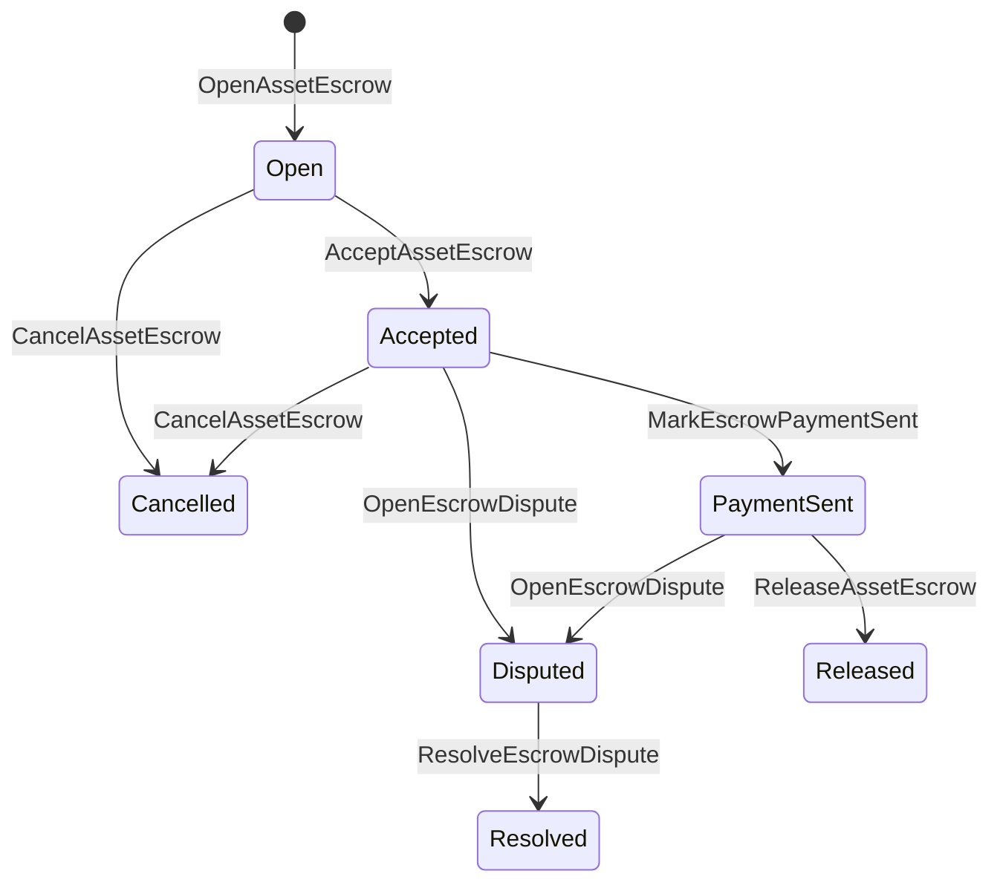

# Эскроу для родных активов {#native-asset-escrow}

Нативный эскроу управляется распределённым регистром блокчейна и представляет собой механизм хранения числовых активов. Вместо того чтобы отправлять активы на счёт, принадлежащий приложению, и полагаться на код приложения для защиты этого аккаунта, эскроу ISIs переводит значение на счет хранения детерминированного протокола и фиксирует жизненный цикл эскроу в состоянии мира.

Используйте родной эскроу для урегулирования финансовых транзакций на маркетплейсе, координацию платежей вне цепочки в стиле Aitai, блокировки поэтапного выполнения и защищенные рабочие процессы эскроу, которые требуют видимого состояния жизненного цикла в распределенном реестре блокчейна.

## Концепции {#concepts}

|Концепция|Описание|
| --- | --- |
| `EscrowId` |запрашивающий идентификатор, выбранный клиентом, инкапсулирующий криптографический хэш. Он должен быть уникальным для прозрачных и анонимных условных депозитов.|
| `AssetEscrowRecord` |Прозрачная запись условного хранения или блокировки числового актива.|
| `AnonymousAssetEscrowRecord` | Защищённая эскроу-запись, подкреплённая нулификаторами, криптографическими обязательствами и вложениями доказательств. |
|Кастодиальный счет|Детерминированный протокольный аккаунт, полученный из идентификатора цепочки, идентификатора эскроу и определения актива.|
|Доказательства криптографических хешей|Доказательства криптографических хешей могут идентифицировать счета, судебные решения, сообщения, технические манифесты хранения или другие внецепочные доказательства. Сам полезный нагрузочный блок доказательства не хранится в записи эскроу.|

Прозрачные записи содержат продавца, необязательного покупателя, определение актива, общую сумму, счет депонирования, состояние жизненного цикла, тип поведения, оставшуюся сумму, необязательного уполномоченного на выпуск, необязательную метку времени истечения, криптографические хэши доказательств, метки времени и необязательные детали разрешения.

Суммы эскроу должны быть положительными числовыми количествами активов и должны соответствовать числовой спецификации определения актива. Пока эскроу или блокировка активны, обычные переводы активов не могут опустошить счет хранения; пути выхода из хранения — это эскроу ISIs, описанные ниже.

## Эскроу на рынке {#marketplace-escrow}

Эскроу на торговой площадке координирует выпуск актива в блокчейне с внецепочечным процессом оплаты или доставки.



| ISI |Кто это подает?|Эффект|
| --- | --- | --- |
| `OpenAssetEscrow` |Продавец|Блокирует цифровой актив продавца в хранении протокола и создает запись на маркетплейсе `Open`.|
| `AcceptAssetEscrow` |Покупатель|Регистрирует покупателя и перемещает `Open` в `Accepted`. Продавец не может принять свой собственный эскроу.|
| `MarkEscrowPaymentSent` |Принятый покупатель|Перемещает `Accepted` в `PaymentSent` после того, как покупатель отправит внецепочечный платеж.|
| `ReleaseAssetEscrow` |Продавец|Перемещает `PaymentSent` в `Released` и переводит полную сумму в эскроу покупателю.|
| `CancelAssetEscrow` |Продавец|Перемещает `Open` или `Accepted` в `Cancelled` и возвращает деньги продавцу до того, как оплата будет отмечена.|
| `OpenEscrowDispute` |Продавец или принятый покупатель|Перемещает `Accepted` или `PaymentSent` в `Disputed` и добавляет криптографические хэши доказательств.|
| `ResolveEscrowDispute` |Счет с `CanResolveEscrowDispute`|Перемещает `Disputed` в `Resolved` и делит сумму между покупателем и продавцом.|

Суммы урегулирования споров должны быть неотрицательными, а `buyer_amount + seller_amount` должен равняться сумме на эскроу-счете. Части финансового перевода с нулевой стоимостью допускаются, но весь раздел должен учитывать заблокированный баланс.

### Rust Пример {#rust-example}

Этот пример предполагает, что аккаунты продавца и покупателя уже существуют, определение актива зарегистрировано как числовое, и у продавца достаточно баланса.

```rust
use iroha::{
    client::Client,
    data_model::{
        isi::escrow::{
            AcceptAssetEscrow, MarkEscrowPaymentSent, OpenAssetEscrow,
            ReleaseAssetEscrow,
        },
        prelude::*,
    },
};
use iroha_crypto::Hash;

fn release_marketplace_escrow(
    seller_client: &Client,
    buyer_client: &Client,
    asset_definition_id: AssetDefinitionId,
) -> eyre::Result<()> {
    let escrow_id = EscrowId::new(Hash::new("docs-marketplace-escrow-001"));

    seller_client.submit_blocking(OpenAssetEscrow::with_evidence_hashes(
        escrow_id,
        asset_definition_id,
        Numeric::from(40_u64),
        vec![Hash::new("invoice:2026-001")],
    ))?;

    buyer_client.submit_blocking(AcceptAssetEscrow::new(escrow_id))?;
    buyer_client.submit_blocking(MarkEscrowPaymentSent::new(escrow_id))?;
    seller_client.submit_blocking(ReleaseAssetEscrow::new(escrow_id))?;

    let record = seller_client.query_single(FindAssetEscrowById::new(escrow_id))?;
    assert_eq!(record.status, AssetEscrowStatus::Released);
    assert_eq!(record.remaining_amount, Numeric::zero());

    Ok(())
}
```

## Общие блокировки активов {#generic-asset-locks}

Блокировки активов используют тот же тип записи о хранении, но они не являются предложениями продавца-покупателя. Они блокируют средства для целевого счета и при необходимости требуют отдельного основного разрешения на выдачу средств.

| ISI |Кто это подает?|Эффект|
| --- | --- | --- |
| `OpenAssetLock` |Исходный счет|Блокирует положительное количество, записывает пункт назначения как покупателя записи и устанавливает статус `Locked`.|
| `DrawdownAssetLock` |Ответственное лицо за разрешение на выпуск или пункт назначения, если ответственное лицо за разрешение на выпуск не установлено|Передает часть или всю оставшуюся опеку назначенному месту.|
| `CancelAssetLock` |Открывалка для замков|Отменяет активную блокировку и возвращает оставшуюся сумму инициатору.|
| `ExpireAssetLock` |Любой принцип авторизации транзакции после установленного срока|Истекает срок блокировки с `expires_at_ms` в прошлом и возвращает оставшуюся сумму открывшему.|

`DrawdownAssetLock` сохраняет запись в `Locked`, пока остаётся некоторая сумма. Когда оставшаяся сумма достигает нуля, статус меняется на `DrawnDown`, и запись закрывается.

```rust
use iroha::{
    client::Client,
    data_model::{
        isi::escrow::{CancelAssetLock, DrawdownAssetLock, ExpireAssetLock, OpenAssetLock},
        prelude::*,
    },
};
use iroha_crypto::Hash;

fn drawdown_and_close_asset_locks(
    opener_client: &Client,
    destination_client: &Client,
    release_authority_client: &Client,
    asset_definition_id: AssetDefinitionId,
    destination: AccountId,
    release_authority: AccountId,
) -> eyre::Result<()> {
    let trusted_lock_id = EscrowId::new(Hash::new("docs-asset-lock-trusted"));

    opener_client.submit_blocking(OpenAssetLock::with_options(
        trusted_lock_id,
        asset_definition_id.clone(),
        destination.clone(),
        Numeric::from(40_u64),
        Some(release_authority),
        None,
        vec![Hash::new("milestone-plan-v1")],
    ))?;

    release_authority_client.submit_blocking(DrawdownAssetLock::new(
        trusted_lock_id,
        Numeric::from(15_u64),
    ))?;

    let partially_drawn =
        opener_client.query_single(FindAssetEscrowById::new(trusted_lock_id))?;
    assert_eq!(partially_drawn.status, AssetEscrowStatus::Locked);
    assert_eq!(partially_drawn.remaining_amount, Numeric::from(25_u64));

    opener_client.submit_blocking(CancelAssetLock::new(trusted_lock_id))?;
    let cancelled = opener_client.query_single(FindAssetEscrowById::new(trusted_lock_id))?;
    assert_eq!(cancelled.status, AssetEscrowStatus::Cancelled);

    let expiring_lock_id = EscrowId::new(Hash::new("docs-asset-lock-expiring"));
    opener_client.submit_blocking(OpenAssetLock::with_options(
        expiring_lock_id,
        asset_definition_id,
        destination,
        Numeric::from(10_u64),
        None,
        Some(0),
        Vec::new(),
    ))?;

    destination_client.submit_blocking(ExpireAssetLock::new(expiring_lock_id))?;
    let expired = opener_client.query_single(FindAssetEscrowById::new(expiring_lock_id))?;
    assert_eq!(expired.status, AssetEscrowStatus::Expired);

    Ok(())
}
```

Python в настоящее время предоставляет высокоуровневые вспомогательные средства для универсальных блокировок: `open_asset_lock`, `drawdown_asset_lock`, `cancel_asset_lock` и `expire_asset_lock`. Для торговой площадки и анонимного эскроу из Python, используйте канонический `InstructionBox` JSON через аварийный люк JSON SDK, или отправьте через SDK, который открывает первых строителей условного депонирования.

## Споры {#disputes}

Эскроу на рынке может инициировать спор от `Accepted` или `PaymentSent`. Только зарегистрированный продавец или покупатель может открыть спор. Для разрешения требуется `CanResolveEscrowDispute`, который либо предоставляется непосредственно аккаунту разрешителя, либо наследуется через роль.

```rust
use iroha::{
    client::Client,
    data_model::{
        isi::escrow::{OpenEscrowDispute, ResolveEscrowDispute},
        prelude::*,
    },
};
use iroha_crypto::Hash;
use iroha_executor_data_model::permission::escrow::CanResolveEscrowDispute;

fn resolve_disputed_escrow(
    admin_client: &Client,
    buyer_client: &Client,
    court_client: &Client,
    court: AccountId,
    escrow_id: EscrowId,
) -> eyre::Result<()> {
    admin_client.submit_blocking(Grant::account_permission(
        Permission::from(CanResolveEscrowDispute),
        court,
    ))?;

    buyer_client.submit_blocking(OpenEscrowDispute::with_evidence_hashes(
        escrow_id,
        vec![Hash::new("buyer-payment-receipt")],
    ))?;

    court_client.submit_blocking(ResolveEscrowDispute::with_evidence_hashes(
        escrow_id,
        Numeric::from(30_u64),
        Numeric::from(10_u64),
        vec![Hash::new("court-judgement-001")],
    ))?;

    let record = admin_client.query_single(FindAssetEscrowById::new(escrow_id))?;
    assert_eq!(record.status, AssetEscrowStatus::Resolved);
    assert_eq!(
        record.resolution.as_ref().map(|resolution| resolution.buyer_amount.clone()),
        Some(Numeric::from(30_u64)),
    );

    Ok(())
}
```

## Анонимный эскроу {#anonymous-escrow}

Анонимный эскроу использует тот же жизненный цикл торговой площадки, но передача средств и закрытие сделки защищены. Публичная запись по-прежнему хранит продавца, покупателя, состояние, хеши доказательств, временные метки и связанные с доказательствами записи перемещений. Суммы и получатели внутри защищённых нот представлены криптографическими обязательствами, нулификаторами и вложениями доказательств.

|Прозрачный ISI|Анонимный ISI|
| --- | --- |
| `OpenAssetEscrow` | `OpenAnonymousAssetEscrow` |
| `AcceptAssetEscrow` | `AcceptAnonymousAssetEscrow` |
| `MarkEscrowPaymentSent` | `MarkAnonymousEscrowPaymentSent` |
| `ReleaseAssetEscrow` | `ReleaseAnonymousAssetEscrow` |
| `CancelAssetEscrow` | `CancelAnonymousAssetEscrow` |
| `OpenEscrowDispute` | `OpenAnonymousEscrowDispute` |
| `ResolveEscrowDispute` | `ResolveAnonymousEscrowDispute` |

Инструменты кошелька или проверяющего должны создавать приложение доказательства и публичные входные данные. Открытие создает одно значение криптографического обязательства условного депонирования. Выпуск, отмена, и анонимное разрешение споров должно потратить ровно одно криптографическое значение обязательства эскроу и создать криптографические значения обязательств покупателя, продавца или распределенного вывода, требуемые действием.

```rust
use iroha::{
    client::Client,
    data_model::{
        isi::escrow::{
            AcceptAnonymousAssetEscrow, MarkAnonymousEscrowPaymentSent,
            OpenAnonymousAssetEscrow,
        },
        prelude::*,
        proof::ProofAttachment,
    },
};
use iroha_crypto::Hash;

fn open_anonymous_escrow(
    seller_client: &Client,
    buyer_client: &Client,
    escrow_id: EscrowId,
    asset_definition_id: AssetDefinitionId,
    funding_nullifiers: Vec<[u8; 32]>,
    escrow_commitment: [u8; 32],
    proof: ProofAttachment,
    root_hint: Option<[u8; 32]>,
) -> eyre::Result<()> {
    seller_client.submit_blocking(OpenAnonymousAssetEscrow::with_evidence_hashes(
        escrow_id,
        asset_definition_id,
        funding_nullifiers,
        escrow_commitment,
        proof,
        root_hint,
        vec![Hash::new("shielded-invoice")],
    ))?;

    buyer_client.submit_blocking(AcceptAnonymousAssetEscrow::new(escrow_id))?;
    buyer_client.submit_blocking(MarkAnonymousEscrowPaymentSent::new(escrow_id))?;

    Ok(())
}
```

Для базовой модели защищённой транзакции см. [Анонимные транзакции](/ru/blockchain/anonymous-transactions.md).

## SDK Использование {#sdk-usage}

Поддержка эскроу представлена по-разному в SDKs. Rust имеет каноническую модель типизированных данных. Python в настоящее время предоставляет универсальные помощники для блокировки активов. JavaScript и TypeScript используют вызовы функций эскроу-хоста Kotodama. Kotlin/JVM и Swift предоставляют строители типизированных полезных нагрузок для рынка и анонимного эскроу.

| SDK |Используйте эту поверхность|Область|
| --- | --- | --- |
| [Rust](#rust-sdk) | `iroha::data_model::isi::escrow` |Эскроу на рынке, общие блокировки, анонимный эскроу, запросы и события.|
| [Python](#python-asset-locks) |помощники `Instruction.open_asset_lock`, `TransactionDraft.open_asset_lock` и клиента `*_and_wait`|Общие блокировки активов. Вспомогательные функции для маркетплейса и анонимного эскроу пока не являются методами первого класса Python.|
| [JavaScript / TypeScript](#javascript-and-typescript-kotodama) | `compileKotodamaProgram` от `@iroha/iroha-js/kotodama-compiler` |Вызовы хост-функций эскроу внутри контрактов Kotodama.|
| [Kotlin / JVM](#kotlin-and-jvm) |`InstructionTemplate` классы в `org.hyperledger.iroha.sdk.core.model.instructions`|Шаблоны пользовательских инструкций для торговой площадки и анонимного эскроу.|
| [Swift / iOS](#swift-and-ios) |`NativeEscrowInstructionBuilders` и `IrohaSDK.build*Escrow*` помощники|Маркетплейс и анонимные эскроу Norito JSON данные инструкций.|

Приведенные ниже примеры сосредоточены на построении инструкций. Финансирование счета, управление подписями и отправка транзакций следуют обычному порядку для каждого SDK.

### Rust SDK {#rust-sdk}

Используйте Rust SDK, когда вам требуется полное нативное покрытие или поддержка запросов/событий. Примеры выше показывают выпуск на рынке, общий сокращение блокировки, разрешение споров и создание анонимного эскроу с `iroha::data_model::isi::escrow`.

```rust
use iroha::{
    client::Client,
    data_model::{isi::escrow::OpenAssetEscrow, prelude::*},
};
use iroha_crypto::Hash;

fn open_and_read(
    client: &Client,
    asset_definition_id: AssetDefinitionId,
) -> eyre::Result<AssetEscrowRecord> {
    let escrow_id = EscrowId::new(Hash::new("docs-rust-sdk-escrow"));

    client.submit_blocking(OpenAssetEscrow::new(
        escrow_id,
        asset_definition_id,
        Numeric::from(10_u64),
    ))?;

    client.query_single(FindAssetEscrowById::new(escrow_id))
}
```

### Python Блокировки активов {#python-asset-locks}

Python SDK предоставляет первоклассные помощники для универсальных блокировок активов. Используйте их для этапных выплат, авансов по распоряжению уполномоченного лица, отмены инициатором и возвратов при истечении срока.

```python
client.open_asset_lock_and_wait(
    chain_id="dev-chain",
    authority="<source-account-id>",
    private_key_hex="<source-private-key-hex>",
    escrow_id="merchant-lock-001",
    asset_definition_id="<asset-definition-base58>",
    destination="<destination-account-id>",
    amount="2500",
    release_authority="<trusted-release-account-id>",
    expires_at_ms=1_704_000_000_000,
)

client.drawdown_asset_lock_and_wait(
    chain_id="dev-chain",
    authority="<trusted-release-account-id>",
    private_key_hex="<trusted-release-private-key-hex>",
    escrow_id="merchant-lock-001",
    amount="1000",
)

client.expire_asset_lock_and_wait(
    chain_id="dev-chain",
    authority="<any-account-id>",
    private_key_hex="<any-private-key-hex>",
    escrow_id="merchant-lock-001",
)
```

Для двухсторонней блокировки опустите `release_authority`; затем целевой счет может отправить `drawdown_asset_lock`.

### JavaScript и TypeScript Kotodama {#javascript-and-typescript-kotodama}

JavaScript SDK в настоящее время не предоставляет прямые нативные конструкторы транзакций эскроу. Для приложений JavaScript или TypeScript, которые разворачивают контракты Kotodama, компилируйте вызовы хост-функций эскроу с помощью компилятора Kotodama.

Вызовы встроенной хост-функции эскроу требуют явных указаний доступа, потому что компилятор не может вывести более узкие наборы доступа для непрозрачного эскроу ISIs. Используйте подстановочные указания на экспортируемых точках входа, которые вызывают технический вызов `escrow_*` встроенных функций.

```js
import { compileKotodamaProgram } from "@iroha/iroha-js/kotodama-compiler";

const source = `
seiyaku MarketplaceEscrow {
  meta { abi_version: 1; }

  #[access(read="*", write="*")]
  kotoage fn run() permission(Admin) {
    let asset = asset_definition("62Fk4FPcMuLvW5QjDGNF2a4jAmjM");
    let offer = name("aitai_offer");
    let evidence = norito_bytes("00");

    call escrow_open_offer(offer, asset, 10, evidence);
    call escrow_accept(offer);
    call escrow_mark_payment_sent(offer);
    call escrow_release(offer);
  }
}
`;

const compiled = compileKotodamaProgram(source, {
  sourceName: "escrow.ko",
});

if (compiled.diagnostics.length > 0) {
  throw new Error(compiled.diagnostics.map((item) => item.message).join("\n"));
}
```

Для разрешения споров используйте `escrow_open_dispute(offer, evidence)` и `escrow_resolve_dispute(offer, buyer_amount, seller_amount, evidence)`. Анонимные вызовы функций эскроу-хоста принимают байты полезной нагрузки запроса Norito, например `anonymous_escrow_open_offer(request)`.

### Kotlin и JVM {#kotlin-and-jvm}

Модели Kotlin/JVM SDK реализуют нативный эскроу как настраиваемые шаблоны инструкций. Каждый шаблон проверяет необходимые поля и предоставляет каноническую карту аргументов, используемую конструктором транзакций.

```kotlin
import org.hyperledger.iroha.sdk.core.model.escrow.NativeEscrowPermissions
import org.hyperledger.iroha.sdk.core.model.instructions.AcceptAssetEscrowInstruction
import org.hyperledger.iroha.sdk.core.model.instructions.MarkEscrowPaymentSentInstruction
import org.hyperledger.iroha.sdk.core.model.instructions.OpenAssetEscrowInstruction
import org.hyperledger.iroha.sdk.core.model.instructions.ReleaseAssetEscrowInstruction
import org.hyperledger.iroha.sdk.core.model.instructions.ResolveEscrowDisputeInstruction

val open = OpenAssetEscrowInstruction(
    escrowId = "escrow-hash",
    assetDefinition = "xor#wonderland",
    amount = "42.5",
    evidenceHashes = listOf("invoice-hash"),
)
val accept = AcceptAssetEscrowInstruction("escrow-hash")
val paid = MarkEscrowPaymentSentInstruction("escrow-hash")
val release = ReleaseAssetEscrowInstruction("escrow-hash")
val resolve = ResolveEscrowDisputeInstruction(
    escrowId = "escrow-hash",
    buyerAmount = "30",
    sellerAmount = "12.5",
    evidenceHashes = listOf("judgement-hash"),
)

println(open.arguments)
println(NativeEscrowPermissions.CAN_RESOLVE_ESCROW_DISPUTE)
```

Анонимные шаблоны доступны как `OpenAnonymousAssetEscrowInstruction`, `AcceptAnonymousAssetEscrowInstruction`, `MarkAnonymousEscrowPaymentSentInstruction`, `ReleaseAnonymousAssetEscrowInstruction`, `CancelAnonymousAssetEscrowInstruction`, `OpenAnonymousEscrowDisputeInstruction` и `ResolveAnonymousEscrowDisputeInstruction`. Клиенты Java, которые делают запросы Android, могут использовать соответствующие конструкторы `NativeEscrowInstructions.*` из артефакта Android.

### Swift и iOS {#swift-and-ios}

Swift SDK формирует инструкции условного депонирования в виде Norito JSON данных. Используйте `NativeEscrowInstructionBuilders` напрямую или вызовите эквивалентный помощник `IrohaSDK.build*Escrow*`, когда ваше приложение уже имеет экземпляр `IrohaSDK`.

```swift
import IrohaSwift

let open = try NativeEscrowInstructionBuilders.openAssetEscrow(
    escrowId: "escrow-hash",
    assetDefinition: "xor#wonderland",
    amount: "42.5",
    evidenceHashes: ["invoice-hash"]
)
let accept = try NativeEscrowInstructionBuilders.acceptAssetEscrow(
    escrowId: "escrow-hash"
)
let paid = try NativeEscrowInstructionBuilders.markEscrowPaymentSent(
    escrowId: "escrow-hash"
)
let release = try NativeEscrowInstructionBuilders.releaseAssetEscrow(
    escrowId: "escrow-hash"
)
let resolve = try NativeEscrowInstructionBuilders.resolveEscrowDispute(
    escrowId: "escrow-hash",
    buyerAmount: "30",
    sellerAmount: "12.5",
    evidenceHashes: ["judgement-hash"]
)
```

Анонимные Swift строители берут списки аннулирующих элементов, выводят списки значений криптографических обязательств, словарь доказательств и необязательные значения `rootHint`. Токен разрешения разрешителя споров доступен как `NativeEscrowPermissions.canResolveEscrowDispute`.

## Запросы и события {#queries-and-events}

Используйте запросы условного депонирования для страниц состояния, заданий по сверке и инструментов поддержки:

|Запрос|Цель|
| --- | --- |
| `FindAssetEscrowById` |Прочитайте один прозрачный эскроу или замок от `EscrowId`.|
| `FindAssetEscrows` |Список прозрачных эскроу и заблокированных записей.|
| `FindAssetEscrowsBySeller` |Список записей, открытых продавцом или открывающим замки.|
| `FindAssetEscrowsByBuyer` |Список депозитов торговой площадки, принимаемых покупателем, или блокировок, нацеленных на пункт назначения.|
| `FindAssetEscrowsByStatus` |Список записей по `AssetEscrowStatus`.|
| `FindAnonymousAssetEscrowById` |Прочитайте один анонимный эскроу от `EscrowId`.|
| `FindAnonymousAssetEscrows*` |Список анонимных эскроу по всем записям, продавцу, покупателю или статусу.|

`EscrowEventFilter` может подписываться на прозрачные нативные эскроу и события блокировки по идентификатору эскроу, продавцу, покупателю, статусу и маске набора событий. Семейство событий включает `Opened`, `Accepted`, `PaymentSent`, `Released`, `Cancelled`, `Expired`, `Disputed` и `Resolved`. Анонимные записи эскроу проверяются через анонимные запросы эскроу.

## Операционные заметки {#operational-notes}

- Храните большие счета, журналы чатов, судебные решения или аудиторские пакеты вне эскроу-записи и прикрепляйте их криптографические хэши в качестве доказательства.
- Используйте стабильное `EscrowId` производное в приложениях, чтобы повторные попытки не создавали дублирующие эскроу для одного и того же предложения.
- Предоставляйте `CanResolveEscrowDispute` только аккаунтам или ролям, которые участвуют в процессе урегулирования споров.
- Рассматривайте проверку внецепочечных платежей как политику приложения. Iroha регистрирует хранение и переходы жизненного цикла; оно само по себе не проверяет фиатные или внешние платежные каналы.
