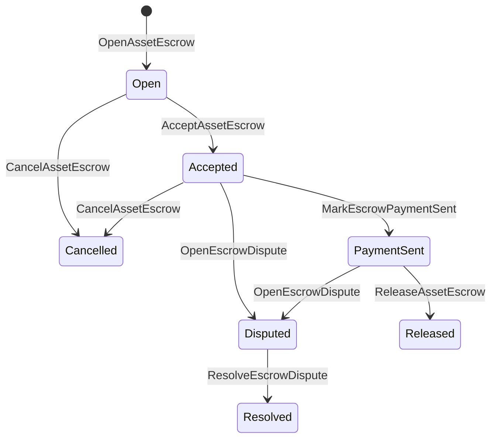

# Осуществление сбережений на собственные активы {#native-asset-escrow}

Native escrow - это механизм хранения цифровых активов, управляемый бухгалтерским учетом.
Вместо отправки активов на учетную запись, принадлежащую приложению, и полагаясь на
код заявки на защиту данного счета, депозит ISIs переместить стоимость в
Детерминистический протокол счета по хранению и запись жизненного цикла поручительства в
Всемирное государство.

Используйте местный депозит для расчетов на рынке, внецепочной оплаты в стиле Айтай
координация, блокировка этапов и защищенные рабочие процессы по поручительству, которые требуют
состояние жизненного цикла, видимого в регистре.

## Концепции {#concepts}

| Концепция | Описание |
| --- | --- |
| `EscrowId` | Идентификатор, выбранный вызовителем, упакованный в хэш. Он должен быть уникальным на прозрачных и анонимных депозитах. |
| `AssetEscrowRecord` | Прозрачная цифровая запись депозита или блокировки активов. |
| `AnonymousAssetEscrowRecord` | Защищенный депозит, подтвержденный аннулирующими документами, обязательствами и приложениями к доказательству. |
| Счет по хранению | Детерминистический протокол учета, полученная из цепочки ID, депозитные средства ID, и определение активов. |
| Доказательства | Хеш с расчетами, суждениями, сообщениями, хранилищами или другими доказательствами вне цепи. |

Прозрачные записи содержат продавца, факультативного покупателя, определение активов,
общая сумма, счет по уходу за ребенком, состояние жизненного цикла, вид поведения, остаток
сумма, произвольный орган по освобождению, произвольный срок истечения срока действия, доказательства
hashes, временные штампы и дополнительные детали разрешения.

Суммы сбережений должны быть положительными количественными объемами активов и соответствовать
Количественная спецификация определения актива.
общие перечисления активов не могут истощать счет по хранению; выход из депозита
Пути - это поручительство . ISIs описанные ниже.

## Рыночный банкротство {#marketplace-escrow}

Рыночная конфиденциальность координирует выпуск активов в цепочке с выпуском из цепочки
рабочий процесс оплаты или доставки.



| ISI | Кто подает ее | Влияние |
| --- | --- | --- |
| `OpenAssetEscrow` | Продавец | Закрывает цифровой актив продавца в протокольном хранилище и создает `Open` рыночный рекорд. |
| `AcceptAssetEscrow` | Покупатель | Записывает покупателя и движется `Open` к `Accepted`. Продавец не может принять собственное поручительство. |
| `MarkEscrowPaymentSent` | Принятый покупатель | Перемещение `Accepted` к `PaymentSent` после того, как покупатель отправит платеж вне цепочки. |
| `ReleaseAssetEscrow` | Продавец | Перемещение `PaymentSent` к `Released` и перечисляет полную сумму залога покупателю. |
| `CancelAssetEscrow` | Продавец | Перемещение `Open` или `Accepted` к `Cancelled` и возвращает продавцу деньги до того, как оплата будет отмечена. |
| `OpenEscrowDispute` | Продавец или принятый покупатель | Перемещение `Accepted` или `PaymentSent` к `Disputed` и добавляет доказательства. |
| `ResolveEscrowDispute` | Счет с `CanResolveEscrowDispute` | Перемещение `Disputed` к `Resolved` и разделить сумму между покупателем и продавцом. |

Размеры разрешения споров должны быть не отрицательными, и
`buyer_amount + seller_amount` Должен равняться сумме поручения.
ноги разрешены, но весь раздел должен учитывать запертый баланс.

### Rust Пример {#rust-example}

Этот пример предполагает, что счета продавца и покупателя уже существуют, актив
определение зарегистрировано как числовое, и продавец имеет достаточный баланс.

```rust
use iroha::{
    client::Client,
    data_model::{
        isi::escrow::{
            AcceptAssetEscrow, MarkEscrowPaymentSent, OpenAssetEscrow,
            ReleaseAssetEscrow,
        },
        prelude::*,
    },
};
use iroha_crypto::Hash;

fn release_marketplace_escrow(
    seller_client: &Client,
    buyer_client: &Client,
    asset_definition_id: AssetDefinitionId,
) -> eyre::Result<()> {
    let escrow_id = EscrowId::new(Hash::new("docs-marketplace-escrow-001"));

    seller_client.submit_blocking(OpenAssetEscrow::with_evidence_hashes(
        escrow_id,
        asset_definition_id,
        Numeric::from(40_u64),
        vec![Hash::new("invoice:2026-001")],
    ))?;

    buyer_client.submit_blocking(AcceptAssetEscrow::new(escrow_id))?;
    buyer_client.submit_blocking(MarkEscrowPaymentSent::new(escrow_id))?;
    seller_client.submit_blocking(ReleaseAssetEscrow::new(escrow_id))?;

    let record = seller_client.query_single(FindAssetEscrowById::new(escrow_id))?;
    assert_eq!(record.status, AssetEscrowStatus::Released);
    assert_eq!(record.remaining_amount, Numeric::zero());

    Ok(())
}
```

## Общие блоки активов {#generic-asset-locks}

Заключения активов используют тот же тип записей о хранении, но они не являются покупателем-продавцом
Они блокируют средства на учетную запись назначения и, возможно, требуют
отдельный орган по выпуску средств.

| ISI | Кто подает ее | Влияние |
| --- | --- | --- |
| `OpenAssetLock` | Источник учетной записи | Закрывает положительную сумму, записывает место назначения как покупателя записи и устанавливает статус на `Locked`. |
| `DrawdownAssetLock` | Орган выпуска или пункт назначения, когда нет установленного органа по выпуску | Перевод части или всей оставшейся попечительства в место назначения. |
| `CancelAssetLock` | Открыватель замка | Отменяет активный замок и возвращает оставшуюся сумму открывателю. |
| `ExpireAssetLock` | Любой орган по сделкам после истечения срока | Срок действия замка с `expires_at_ms` в прошлом и возвращает оставшуюся сумму открывателю. |

`DrawdownAssetLock` сохраняет запись `Locked` пока остается некоторая сумма.
Когда оставшаяся сумма достигает нуля, статус становится `DrawnDown` и
Запись закрыта.

```rust
use iroha::{
    client::Client,
    data_model::{
        isi::escrow::{CancelAssetLock, DrawdownAssetLock, ExpireAssetLock, OpenAssetLock},
        prelude::*,
    },
};
use iroha_crypto::Hash;

fn drawdown_and_close_asset_locks(
    opener_client: &Client,
    destination_client: &Client,
    release_authority_client: &Client,
    asset_definition_id: AssetDefinitionId,
    destination: AccountId,
    release_authority: AccountId,
) -> eyre::Result<()> {
    let trusted_lock_id = EscrowId::new(Hash::new("docs-asset-lock-trusted"));

    opener_client.submit_blocking(OpenAssetLock::with_options(
        trusted_lock_id,
        asset_definition_id.clone(),
        destination.clone(),
        Numeric::from(40_u64),
        Some(release_authority),
        None,
        vec![Hash::new("milestone-plan-v1")],
    ))?;

    release_authority_client.submit_blocking(DrawdownAssetLock::new(
        trusted_lock_id,
        Numeric::from(15_u64),
    ))?;

    let partially_drawn =
        opener_client.query_single(FindAssetEscrowById::new(trusted_lock_id))?;
    assert_eq!(partially_drawn.status, AssetEscrowStatus::Locked);
    assert_eq!(partially_drawn.remaining_amount, Numeric::from(25_u64));

    opener_client.submit_blocking(CancelAssetLock::new(trusted_lock_id))?;
    let cancelled = opener_client.query_single(FindAssetEscrowById::new(trusted_lock_id))?;
    assert_eq!(cancelled.status, AssetEscrowStatus::Cancelled);

    let expiring_lock_id = EscrowId::new(Hash::new("docs-asset-lock-expiring"));
    opener_client.submit_blocking(OpenAssetLock::with_options(
        expiring_lock_id,
        asset_definition_id,
        destination,
        Numeric::from(10_u64),
        None,
        Some(0),
        Vec::new(),
    ))?;

    destination_client.submit_blocking(ExpireAssetLock::new(expiring_lock_id))?;
    let expired = opener_client.query_single(FindAssetEscrowById::new(expiring_lock_id))?;
    assert_eq!(expired.status, AssetEscrowStatus::Expired);

    Ok(())
}
```

Python в настоящее время подвергает воздействию помощники высокого уровня для генеральных замков:
`open_asset_lock`, `drawdown_asset_lock`, `cancel_asset_lock`, и
`expire_asset_lock`. Для рынка и анонимного поручительства от Python, использование
канонический `InstructionBox` JSON через SDK Я ... JSON выхода из люка, или подать
через SDK что выявляет первоклассных строителей депозитов.

## Споры {#disputes}

Рыночный поручитель может вступить в споры с `Accepted` или `PaymentSent`.
Только зарегистрированный продавец или покупатель может открыть спор.
`CanResolveEscrowDispute`, либо предоставляется непосредственно на счет решений
или унаследованной ролью.

```rust
use iroha::{
    client::Client,
    data_model::{
        isi::escrow::{OpenEscrowDispute, ResolveEscrowDispute},
        prelude::*,
    },
};
use iroha_crypto::Hash;
use iroha_executor_data_model::permission::escrow::CanResolveEscrowDispute;

fn resolve_disputed_escrow(
    admin_client: &Client,
    buyer_client: &Client,
    court_client: &Client,
    court: AccountId,
    escrow_id: EscrowId,
) -> eyre::Result<()> {
    admin_client.submit_blocking(Grant::account_permission(
        Permission::from(CanResolveEscrowDispute),
        court,
    ))?;

    buyer_client.submit_blocking(OpenEscrowDispute::with_evidence_hashes(
        escrow_id,
        vec![Hash::new("buyer-payment-receipt")],
    ))?;

    court_client.submit_blocking(ResolveEscrowDispute::with_evidence_hashes(
        escrow_id,
        Numeric::from(30_u64),
        Numeric::from(10_u64),
        vec![Hash::new("court-judgement-001")],
    ))?;

    let record = admin_client.query_single(FindAssetEscrowById::new(escrow_id))?;
    assert_eq!(record.status, AssetEscrowStatus::Resolved);
    assert_eq!(
        record.resolution.as_ref().map(|resolution| resolution.buyer_amount.clone()),
        Some(Numeric::from(30_u64)),
    );

    Ok(())
}
```

## Анонимная сберегательная организация {#anonymous-escrow}

Анонимные депозиты используют тот же рыночный жизненный цикл, но финансирование и
Общественная запись по-прежнему хранит продавца,
покупатель, статус, хэши доказательств, часовые марки и движение с подтверждением
Суммы и получатели в защищенных банкнотах представлены:
обязательства, аннулирующие и доказательные привязки.

| Прозрачность ISI | Анонимный ISI |
| --- | --- |
| `OpenAssetEscrow` | `OpenAnonymousAssetEscrow` |
| `AcceptAssetEscrow` | `AcceptAnonymousAssetEscrow` |
| `MarkEscrowPaymentSent` | `MarkAnonymousEscrowPaymentSent` |
| `ReleaseAssetEscrow` | `ReleaseAnonymousAssetEscrow` |
| `CancelAssetEscrow` | `CancelAnonymousAssetEscrow` |
| `OpenEscrowDispute` | `OpenAnonymousEscrowDispute` |
| `ResolveEscrowDispute` | `ResolveAnonymousEscrowDispute` |

Портфель или инструмент проверки должны составить доказательную прикрепление и общественные вводы.
Открытие создает одно поручительство.
Решение споров должно расходовать точно одно обязательство по хранению и создавать
обязательства покупателя, продавца или разделения выпуска, требуемые действием.

```rust
use iroha::{
    client::Client,
    data_model::{
        isi::escrow::{
            AcceptAnonymousAssetEscrow, MarkAnonymousEscrowPaymentSent,
            OpenAnonymousAssetEscrow,
        },
        prelude::*,
        proof::ProofAttachment,
    },
};
use iroha_crypto::Hash;

fn open_anonymous_escrow(
    seller_client: &Client,
    buyer_client: &Client,
    escrow_id: EscrowId,
    asset_definition_id: AssetDefinitionId,
    funding_nullifiers: Vec<[u8; 32]>,
    escrow_commitment: [u8; 32],
    proof: ProofAttachment,
    root_hint: Option<[u8; 32]>,
) -> eyre::Result<()> {
    seller_client.submit_blocking(OpenAnonymousAssetEscrow::with_evidence_hashes(
        escrow_id,
        asset_definition_id,
        funding_nullifiers,
        escrow_commitment,
        proof,
        root_hint,
        vec![Hash::new("shielded-invoice")],
    ))?;

    buyer_client.submit_blocking(AcceptAnonymousAssetEscrow::new(escrow_id))?;
    buyer_client.submit_blocking(MarkAnonymousEscrowPaymentSent::new(escrow_id))?;

    Ok(())
}
```

Для базовой модели транзакций с защитой см.
[Анонимные транзакции](/ru/blockchain/anonymous-transactions.md).

## SDK Использование {#sdk-usage}

Поддержка сбережений различается по SDKs. Rust имеет канонический
типовой модели данных. Python в настоящее время подвергает воздействию генерические помощники блокировки активов.
JavaScript и TypeScript использование Kotodama - Позвонить хозяину. Kotlin/JVM и Swift
предоставление типовых конструкторов полезной нагрузки для рынка и анонимного депозита.

| SDK | Используйте эту поверхность | Сфера действия |
| --- | --- | --- |
| [Rust](#rust-sdk) | `iroha::data_model::isi::escrow` | Рыночная попечительная работа, общие блокировки, анонимные попечители, запросы и события. |
| [Python](#python-asset-locks) | `Instruction.open_asset_lock`, `TransactionDraft.open_asset_lock`, и клиент `*_and_wait` помощники | Рынок и анонимные помощники не первоклассники Python Методы пока. |
| [JavaScript / TypeScript](#javascript-and-typescript-kotodama) | `compileKotodamaProgram` от `@iroha/iroha-js/kotodama-compiler` | Звонок хозяина эскор внутри Kotodama договоры. |
| [Kotlin / JVM](#kotlin-and-jvm) | `InstructionTemplate` занятия в `org.hyperledger.iroha.sdk.core.model.instructions` | Рыночные и анонимные шаблоны инструкций по хранению. |
| [Swift / iOS](#swift-and-ios) | `NativeEscrowInstructionBuilders` и `IrohaSDK.build*Escrow*` помощники | Рыночная площадка и анонимный депозит Norito JSON инструкционные полезные грузы. |

Приведенные ниже примеры сосредоточены на строительстве инструкций.
управление подписями и представление транзакций следуют нормальному потоку для
Каждый SDK.

### Rust SDK {#rust-sdk}

Используйте Rust SDK когда вам нужна полная местная охрана или поддержка запросов/событий.
В приведенных выше примерах показаны рыночные выпуски, общие ограничения, споры.
Резолюция и анонимная конфиденциальность с
`iroha::data_model::isi::escrow`.

```rust
use iroha::{
    client::Client,
    data_model::{isi::escrow::OpenAssetEscrow, prelude::*},
};
use iroha_crypto::Hash;

fn open_and_read(
    client: &Client,
    asset_definition_id: AssetDefinitionId,
) -> eyre::Result<AssetEscrowRecord> {
    let escrow_id = EscrowId::new(Hash::new("docs-rust-sdk-escrow"));

    client.submit_blocking(OpenAssetEscrow::new(
        escrow_id,
        asset_definition_id,
        Numeric::from(10_u64),
    ))?;

    client.query_single(FindAssetEscrowById::new(escrow_id))
}
```

### Python Закрытие активов {#python-asset-locks}

Сборник Python SDK Выявляет первоклассных помощников для общих блокировки активов.
для платежей в рамках этапов, снятия выплат органом по освобождению, отмена
открыватель и возмещение по истечении срока действия.

```python
client.open_asset_lock_and_wait(
    chain_id="dev-chain",
    authority="<source-account-id>",
    private_key_hex="<source-private-key-hex>",
    escrow_id="merchant-lock-001",
    asset_definition_id="<asset-definition-base58>",
    destination="<destination-account-id>",
    amount="2500",
    release_authority="<trusted-release-account-id>",
    expires_at_ms=1_704_000_000_000,
)

client.drawdown_asset_lock_and_wait(
    chain_id="dev-chain",
    authority="<trusted-release-account-id>",
    private_key_hex="<trusted-release-private-key-hex>",
    escrow_id="merchant-lock-001",
    amount="1000",
)

client.expire_asset_lock_and_wait(
    chain_id="dev-chain",
    authority="<any-account-id>",
    private_key_hex="<any-private-key-hex>",
    escrow_id="merchant-lock-001",
)
```

Для двухпартийной блокировки, пропустить `release_authority`; счет назначения может
Затем подать `drawdown_asset_lock`.

### JavaScript и TypeScript Kotodama {#javascript-and-typescript-kotodama}

Сборник JavaScript SDK в настоящее время не раскрывает прямую транзакцию с помощью собственного поручительства
для строителей. JavaScript или TypeScript приложения, которые развертываются Kotodama
Договоры, составление экспозиционных звонков хозяина с Kotodama компилятор.

Нативные вызовы хоста требуют ясных указаний на доступ, потому что компилятор
не может получать более узкие наборы доступа для непрозрачного депозита ISIs. Используйте указания на дикие карты
экспортируемые пункты въезда, призывающие `escrow_*` Встроенные.

```js
import { compileKotodamaProgram } from "@iroha/iroha-js/kotodama-compiler";

const source = `
seiyaku MarketplaceEscrow {
  meta { abi_version: 1; }

  #[access(read="*", write="*")]
  kotoage fn run() permission(Admin) {
    let asset = asset_definition("62Fk4FPcMuLvW5QjDGNF2a4jAmjM");
    let offer = name("aitai_offer");
    let evidence = norito_bytes("00");

    call escrow_open_offer(offer, asset, 10, evidence);
    call escrow_accept(offer);
    call escrow_mark_payment_sent(offer);
    call escrow_release(offer);
  }
}
`;

const compiled = compileKotodamaProgram(source, {
  sourceName: "escrow.ko",
});

if (compiled.diagnostics.length > 0) {
  throw new Error(compiled.diagnostics.map((item) => item.message).join("\n"));
}
```

Для споров, использование `escrow_open_dispute(offer, evidence)` и
`escrow_resolve_dispute(offer, buyer_amount, seller_amount, evidence)`.
Принимают анонимные звонки хозяина. Norito запрос байтов полезной нагрузки, например
`anonymous_escrow_open_offer(request)`.

### Kotlin и JVM {#kotlin-and-jvm}

Сборник Kotlin/JVM SDK Модели нативных поручительств в качестве шаблонов инструкций.
шаблон подтверждает требуемые поля и раскрывает используемую карту канонических аргументов
создателем сделки.

```kotlin
import org.hyperledger.iroha.sdk.core.model.escrow.NativeEscrowPermissions
import org.hyperledger.iroha.sdk.core.model.instructions.AcceptAssetEscrowInstruction
import org.hyperledger.iroha.sdk.core.model.instructions.MarkEscrowPaymentSentInstruction
import org.hyperledger.iroha.sdk.core.model.instructions.OpenAssetEscrowInstruction
import org.hyperledger.iroha.sdk.core.model.instructions.ReleaseAssetEscrowInstruction
import org.hyperledger.iroha.sdk.core.model.instructions.ResolveEscrowDisputeInstruction

val open = OpenAssetEscrowInstruction(
    escrowId = "escrow-hash",
    assetDefinition = "xor#wonderland",
    amount = "42.5",
    evidenceHashes = listOf("invoice-hash"),
)
val accept = AcceptAssetEscrowInstruction("escrow-hash")
val paid = MarkEscrowPaymentSentInstruction("escrow-hash")
val release = ReleaseAssetEscrowInstruction("escrow-hash")
val resolve = ResolveEscrowDisputeInstruction(
    escrowId = "escrow-hash",
    buyerAmount = "30",
    sellerAmount = "12.5",
    evidenceHashes = listOf("judgement-hash"),
)

println(open.arguments)
println(NativeEscrowPermissions.CAN_RESOLVE_ESCROW_DISPUTE)
```

Анонимные шаблоны доступны как
`OpenAnonymousAssetEscrowInstruction`, `AcceptAnonymousAssetEscrowInstruction`,
`MarkAnonymousEscrowPaymentSentInstruction`,
`ReleaseAnonymousAssetEscrowInstruction`,
`CancelAnonymousAssetEscrowInstruction`,
`OpenAnonymousEscrowDisputeInstruction`, и
`ResolveAnonymousEscrowDisputeInstruction`. Android Назватели Java могут использовать
совпадение `NativeEscrowInstructions.*` строителей из Android Артефакт.

### Swift и iOS {#swift-and-ios}

Сборник Swift SDK создает инструкции по хранению в качестве Norito JSON полезные грузы.
`NativeEscrowInstructionBuilders` непосредственно, или вызвать эквивалент
`IrohaSDK.build*Escrow*` Помощник , если приложение уже имеет `IrohaSDK`
В случае.

```swift
import IrohaSwift

let open = try NativeEscrowInstructionBuilders.openAssetEscrow(
    escrowId: "escrow-hash",
    assetDefinition: "xor#wonderland",
    amount: "42.5",
    evidenceHashes: ["invoice-hash"]
)
let accept = try NativeEscrowInstructionBuilders.acceptAssetEscrow(
    escrowId: "escrow-hash"
)
let paid = try NativeEscrowInstructionBuilders.markEscrowPaymentSent(
    escrowId: "escrow-hash"
)
let release = try NativeEscrowInstructionBuilders.releaseAssetEscrow(
    escrowId: "escrow-hash"
)
let resolve = try NativeEscrowInstructionBuilders.resolveEscrowDispute(
    escrowId: "escrow-hash",
    buyerAmount: "30",
    sellerAmount: "12.5",
    evidenceHashes: ["judgement-hash"]
)
```

Анонимный Swift Строители берут списки аннулирующих, списки обязательств по выпуску, доказательство
словарь и факультативный `rootHint` Разрешение на разрешение споров
Токен доступен как `NativeEscrowPermissions.canResolveEscrowDispute`.

## Вопросы и события {#queries-and-events}

Используйте запросы по счету для страниц о статусе, рабочих мест при согласовании и инструментов поддержки:

| Вопрос | Цель |
| --- | --- |
| `FindAssetEscrowById` | Прочитайте один прозрачный депозит или закройте `EscrowId`. |
| `FindAssetEscrows` | Перечисли прозрачные записи о депозитах и замок. |
| `FindAssetEscrowsBySeller` | Список записей, открытых продавцом или открывателем замков. |
| `FindAssetEscrowsByBuyer` | Перечислить депозиты, принятые покупателем на рынке, или блокировки, направленные на место назначения. |
| `FindAssetEscrowsByStatus` | Список записей по `AssetEscrowStatus`. |
| `FindAnonymousAssetEscrowById` | Прочитайте один анонимный поручитель `EscrowId`. |
| `FindAnonymousAssetEscrows*` | Перечислить анонимные депозиты по всем записям, продавцам, покупателям или статусу. |

`EscrowEventFilter` может подписываться на прозрачный родной депозит и блокировку
события по поручительству ID, Продавец, покупатель, статус и маска событий.
семья включает `Opened`, `Accepted`, `PaymentSent`, `Released`,
`Cancelled`, `Expired`, `Disputed`, и `Resolved`. Анонимный депозит
записи проверяются через анонимные запросы по поручению.

## Операционные заметки {#operational-notes}

- Сохранить большие счета, журналы чатов, суждения или аудиторские пакеты вне
  запись сверху и прикрепить их хаши в качестве доказательств.
- Используйте стабильно `EscrowId` извлечения в приложениях, так что повторные попытки не могут создать
  двойные гарантии за одно и то же предложение.
- Грант `CanResolveEscrowDispute` только для счетов или ролей, осуществляющих
  процесс споров.
- Проверка платежей вне цепочки должна рассматриваться как политика применения. Iroha запись
  переходы на хранение и жизненный цикл; он не проверяет фиат или внешний
  само по себе.
