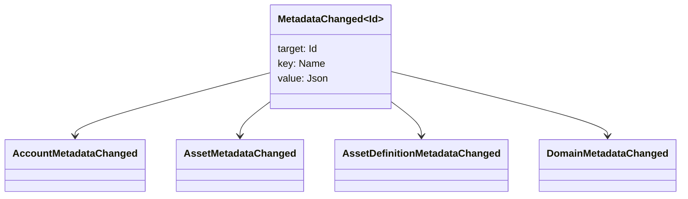

# Метаданные {#metadata}

Метаданные — это проверенная карта ключ-значение, прикреплённая к объектам распределённого реестра блокчейна. Ключи — это значения `Name`, а значения — это полезные нагрузки JSON (`Json`).

Следующие объекты могут содержать метаданные:

- домены
- счета
- активы
- определения активов
- NFTs
- RWAs
- триггеры
- транзакции

Используйте метаданные для небольших описательных или индексных полей, которые должны находиться в состоянии распределенного реестра блокчейна. Большие полезные нагрузки следует хранить за пределами WSV и ссылаться на них с помощью криптографического значения дайджеста, URI или пути SoraFS.

Для получения руководства по выбору метаданных, активов, NFTs, RWAs или хранения за пределами цепочки см. [Метаданные и распределенный реестр блокчейна Выбор хранилища](/ru/guide/configure/metadata-and-store-assets.md).

## Запустите этот рабочий процесс на Taira {#try-it-on-taira}

Метаданные видны при обычном чтении ресурсов. Эта команда перечисляет определения активов Taira, которые в настоящее время имеют метаданные:

```bash
curl -fsS 'https://taira.sora.org/v1/assets/definitions?limit=100' \
  | jq '.items[]
    | select((.metadata | length) > 0)
    | {id, name, metadata}'
```

Используйте ту же схему для доменов и учётных записей:

```bash
curl -fsS 'https://taira.sora.org/v1/domains?limit=20' \
  | jq '.items[] | select((.metadata // {} | length) > 0)'

curl -fsS 'https://taira.sora.org/v1/accounts?limit=20' \
  | jq '.items[] | select((.metadata // {} | length) > 0)'
```

Рассматривайте пустой вывод как действительный результат. Это означает, что текущая страница объектов Taira не содержит метаданных, а не то, что конечная точка API не работает.

## Обновление метаданных {#updating-metadata}

Метаданные изменяются с помощью операций инструкции Iroha:

- [`SetKeyValue`](/ru/blockchain/instructions.md#setkeyvalue-removekeyvalue) вставляет или заменяет ключ
- [`RemoveKeyValue`](/ru/blockchain/instructions.md#setkeyvalue-removekeyvalue) удаляет ключ

Лицо, уполномоченное на проведение транзакции, должно иметь разрешение, требуемое активным программным средством проверки во время выполнения. Для стандартной области разрешений см. [Токены разрешений](/ru/reference/permissions.md).

## События {#events}

События данных генерируются при изменении метаданных. Общая нагрузка события имеет вид `MetadataChanged<Id>`:



Используйте [фильтры событий данных](/ru/blockchain/filters.md#data-event-filters), чтобы подписываться только на события метаданных для типа сущности или идентификатора объекта, которые имеют значение для интеграции.

## Запросы {#queries}

Метаданные возвращаются как часть запрашиваемого объекта. Например, используйте [`FindAccountById`](/ru/reference/queries.md#accounts-and-permissions), [`FindDomainById`](/ru/reference/queries.md#domains-and-peers), или [`FindAssetDefinitionById`](/ru/reference/queries.md#assets-nfts-and-rwas). Использовать [`FindNfts`](/ru/reference/queries.md#assets-nfts-and-rwas) или [`FindNftsByAccountId`](/ru/reference/queries.md#assets-nfts-and-rwas) для NFTs, и [`FindRwas`](/ru/reference/queries.md#assets-nfts-and-rwas) для RWA много. Затем прочитайте поле метаданных объекта. NFT ответы на запросы раскрывают NFT `content` карта как метаданные записи.

Ключи метаданных являются частью распределенного состояния реестра блокчейна, поэтому сохраняйте их стабильными и избегайте кодирования изменений версий, специфичных для приложения, в названии ключа, когда значение JSON может явно содержать эту версию.
