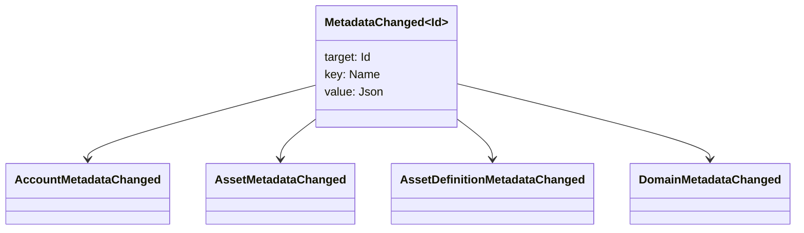

# Метаданные {#metadata}

Метаданные - это проверенная карта ключевого значения, прикрепленная к объектам реестра.
`Name` ценности и значения JSON (`Json`) полезных нагрузок.

Следующие объекты могут содержать метаданные:

- домены
- счета
- активы
- определения активов
- NFTs
- RWAs
- триггеры
- транзакции

Используйте метаданные для небольших описательных или индексирующих полей, которые относятся к регистру
Большие полезные грузы должны храниться за пределами WSV и ссылается на
пищеварение, URI, или SoraFS Путь.

Для руководства по выбору метаданных, активов, NFTs, RWAs, или вне цепи
хранение, см.
[Выбор хранилища метаданных и реестра](/ru/guide/configure/metadata-and-store-assets.md).

## Попробуй . Taira {#try-it-on-taira}

Метаданные видны через обычные чтения ресурсов. Taira
определения активов, которые в настоящее время имеют метаданные:

```bash
curl -fsS 'https://taira.sora.org/v1/assets/definitions?limit=100' \
  | jq '.items[]
    | select((.metadata | length) > 0)
    | {id, name, metadata}'
```

Используйте тот же шаблон для доменов и учетных записей:

```bash
curl -fsS 'https://taira.sora.org/v1/domains?limit=20' \
  | jq '.items[] | select((.metadata // {} | length) > 0)'

curl -fsS 'https://taira.sora.org/v1/accounts?limit=20' \
  | jq '.items[] | select((.metadata // {} | length) > 0)'
```

Считать пустой выход действительным результатом. Taira
объекты не содержат метаданные, а не то, что конечная точка потерпела неудачу.

## Обновление метаданных {#updating-metadata}

Метаданные изменяются с Iroha Специальные инструкции:

- [`SetKeyValue`](/ru/blockchain/instructions.md#setkeyvalue-removekeyvalue)
  вставляет или заменяет ключ
- [`RemoveKeyValue`](/ru/blockchain/instructions.md#setkeyvalue-removekeyvalue)
  удаляет ключ

Власти, представляющие сделку, должны иметь разрешение
для поверхности разрешений по умолчанию см.
[Токены разрешения](/ru/reference/permissions.md).

## События {#events}

События данных выделяются при изменении метаданных.
`MetadataChanged<Id>`:



Использование [фильтры событий данных](/ru/blockchain/filters.md#data-event-filters) к
подписывается только на события метаданных для типа или объекта субъекта ID Это
Это важно для интеграции.

## Вопросы {#queries}

Метаданные возвращаются как часть запрошенного объекта.
[`FindAccountById`](/ru/reference/queries.md#accounts-and-permissions),
[`FindDomainById`](/ru/reference/queries.md#domains-and-peers), или
[`FindAssetDefinitionById`](/ru/reference/queries.md#assets-nfts-and-rwas).
Использование [`FindNfts`](/ru/reference/queries.md#assets-nfts-and-rwas) или
[`FindNftsByAccountId`](/ru/reference/queries.md#assets-nfts-and-rwas) для
NFTs, и [`FindRwas`](/ru/reference/queries.md#assets-nfts-and-rwas) для RWA
Прочитайте поле метаданных объекта. NFT Ответы на запросы раскрывают
NFT `content` Карта в качестве метаданных.

Ключи метаданных являются частью состояния реестра, поэтому держите их стабильными и избегайте
Кодирование конкретной версии приложения перемещается в название ключа, когда JSON
значение может содержать эту версию явно.
