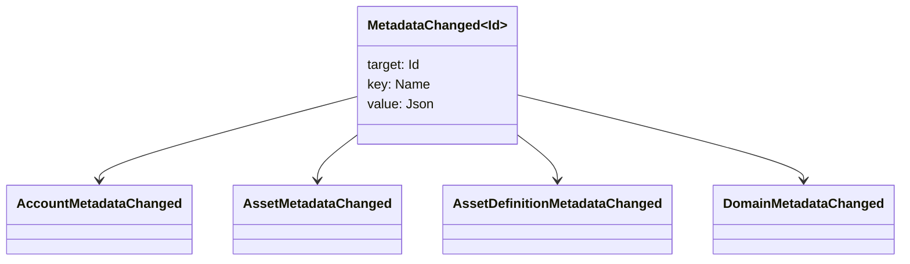

# Метаданные {#metadata}

Метаданные - это проверенная карта значения ключа, прикрепленная к объектам книги. Ключи являются значениями `Name` и значениями являются полезные нагрузки JSON (`Json`).

Следующие объекты могут содержать метаданные:

- домены
- счета
- активы
- определения активов
- NFTs
- RWAs
- триггеры
- транзакции

Используйте метаданные для небольших описательных или индексирующих полей, которые относятся к состоянию реестра. Большие полезные нагрузки должны храниться за пределами WSV и ссылаться на траекторию URI или SoraFS.

Для руководства по выбору метаданных, активов NFTs, RWAs или хранения вне цепочки см. [Metadata and Ledger Storage Choices](/ru/guide/configure/metadata-and-store-assets.md).

## Попробуй на Taira {#try-it-on-taira}

Метаданные видны через обычные чтения ресурсов. Эта команда перечисляет определения активов Taira, которые в настоящее время имеют метаданные:

```bash
curl -fsS 'https://taira.sora.org/v1/assets/definitions?limit=100' \
  | jq '.items[]
    | select((.metadata | length) > 0)
    | {id, name, metadata}'
```

Используйте один и тот же шаблон для доменов и учетных записей:

```bash
curl -fsS 'https://taira.sora.org/v1/domains?limit=20' \
  | jq '.items[] | select((.metadata // {} | length) > 0)'

curl -fsS 'https://taira.sora.org/v1/accounts?limit=20' \
  | jq '.items[] | select((.metadata // {} | length) > 0)'
```

Оценить пустой выход как действительный результат. Это означает, что текущая страница объектов Taira не содержит метаданные, а это не значит, что конечная точка потерпела неудачу.

## Обновление метаданных {#updating-metadata}

Метаданные изменяются посредством Iroha Специальных инструкций:

- [Вставляет или заменяет ключ `SetKeyValue`](/ru/blockchain/instructions.md#setkeyvalue-removekeyvalue)
- [`RemoveKeyValue`](/ru/blockchain/instructions.md#setkeyvalue-removekeyvalue) удаляет ключ

Орган, представляющий транзакцию, должен иметь разрешение, требуемое активным валидатором запуска. Для поверхности разрешений по умолчанию см. [Токены разрешения](/ru/reference/permissions.md).

## События {#events}

Данные событий выделяются при изменениях метаданных. `MetadataChanged<Id>`:



Используйте фильтры событий данных [](/ru/blockchain/filters.md#data-event-filters) для подписки только на события метаданных типа субъекта или объекта ID, которые имеют значение в интеграции.

## Вопросы {#queries}

Метаданные возвращаются в качестве части запрашиваемого объекта. Например, используйте [`FindAccountById`](/ru/reference/queries.md#accounts-and-permissions), [`FindDomainById`](/ru/reference/queries.md#domains-and-peers) или [`FindAssetDefinitionById` ](/ru/reference/queries.md#assets-nfts-and-rwas). Используйте [`FindNfts`](/ru/reference/queries.md#assets-nfts-and-rwas) или [`FindNftsByAccountId`](/ru/reference/queries.md#assets-nfts-and-rwas) для NFTs, и [`FindRwas`](/ru/reference/queries.md#assets-nfts-and-rwas) для лотов RWA. Затем прочитайте поле метаданных объекта. Ответы на запрос NFT показывают карту NFT `content` как записи метаданные.

Ключи метаданных являются частью состояния реестра, поэтому держите их стабильными и избегайте кодирования специальной версии приложения в название ключа, когда значение JSON может содержать эту версию явно.
