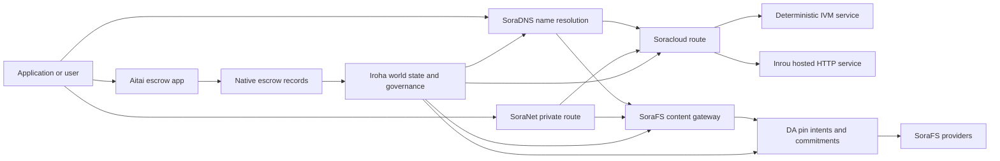

# SORA Nexus Услуги {#sora-nexus-services}

SORA Nexus добавляет сервисные уровни, ориентированные на приложение, вокруг Iroha 3. Эти сервисы не являются отдельными распределёнными реестрами блокчейна. Они закреплены за состоянием мира Iroha, техническими манифестами Norito, записями управления и семействами маршрутов Torii.

Доступность зависит от сборки узла и профиля сети. Используйте [`/openapi.json`](/ru/reference/torii-endpoints.md#app-and-sora-route-families) обнаружить сгенерированное приложение API маршруты на целевом узле. Публичный локальный SoraFS CID и известные маршруты размещаются за пределами сгенерированного документа, поэтому проверяйте эти маршруты напрямую при проверке развертывания.

## Карта компонентов {#component-map}

|Компонент|Роль|Основные поверхности|
| ---------------------- | ------------------------------------------------------------------------------------------------------------------------------------------- | ---------------------------------------------------------------------------------------- |
| Soracloud              |Развертывание приложений, размещенные сервисы, частная модель/состояние выполнения и управление жизненным циклом сервиса.| `/v1/soracloud/*`, `/api/*`, `iroha soracloud service ...`                                   |
| Inrou | Среда выполнения HTTP в Soracloud для версий служб, которым нужен активный HTTP-контур. | Конфигурация среды выполнения Soracloud, объявления возможностей хоста, состояние реплики |
|SoraNet|Конфиденциальность и транспортная накладка для цепей, релейного трафика, VPN, подключений сеансов и потоковых маршрутов.|метаданные маршрута `/v1/connect/*`, `/v1/vpn/*`, SoraNet|
|Доступность данных (DA)|Доказательства доступности, криптографическое значение обязательства и слой намерения PIN для полезных нагрузок, на которые ссылаются Nexus исполнительные линии, SoraFS технические манифесты и потоки доказательств.| `/v1/da/*`, `FindDaPinIntent*`, `[nexus.da]`                                             |
|SoraFS|Схема хранения с адресацией по содержимому для технических манифестов, полезных нагрузок CAR, закрепленного контента, загрузок через шлюз и потоков доказательства возможности извлечения.| `/v1/sorafs/*`, `/sorafs/*`, `FindSorafsProviderOwner`                                   |
| SoraDNS                |Детерминированная система именования и слой проверки разрешений для сервисов и контента, размещённых на SORA.|`/v1/soradns/*`, `/soradns/*`, события каталога разрешителя|
| Aitai | Коридор фиатных расчётов и расчётов по активам на уровне приложения, основанный на встроенных записях эскроу, а не на отдельном реестре. | `OpenAssetEscrow`, `FindAssetEscrow*`, `EscrowEventFilter`, встроенные функции Kotodama `escrow_*` |



## Распространённые потоки {#common-flows}

### Разделённое размещённое приложение {#hosted-split-application}

Типичное приложение с комбинированными плоскостями использует все элементы вместе:

1. Статические фронтенд-ресурсы упаковываются и закрепляются через SoraFS.
2. Публичный хост, например `<app>.sora`, зарегистрирован через SoraDNS.
3. Soracloud направляет `/api/v1/search` или `/api/v1/stream` к сервису Inrou HTTP.
4. Soracloud маршрутизирует `/api/auth` и `/api/v1/user` к детерминированным обработчикам IVM.
5. Клиенты, которым нужна конфиденциальность, могут получить доступ к тому же контенту или маршруту API через цепь SoraNet.

|Путь|Опорная плоскость|Почему|
| ----------------- | --------------------- | ------------------------------------------------- |
| `/`               | SoraFS статическое содержимое |Кэширование корневого содержимого и шлюза с воспроизводимостью|
| `/assets/*`       | SoraFS статическое содержимое |Контент-адресуемые ресурсы и технические доказательства манифеста|
| `/api/auth*`      | Soracloud IVM         |Состояние аутентификации и кошелька, безопасное от повторного воспроизведения|
| `/api/v1/user*`   | Soracloud IVM         |Чувствительные к управлению мутации состояния|
| `/api/v1/search*` | Soracloud Инроу       |Состояние живого HTTP сервиса, кэша, SSE или коллектора|

### Публикация контента {#content-publication}

SoraFS публикация создает долговечные артефакты до того, как имя указывает на них:

1. Создайте полезную нагрузку или каталог.
2. Упакуйте это в архив CAR и разбейте план на части.
3. Создайте технический манифест Norito с политикой PIN и данными управления.
4. Отправьте технический манифест на Torii.
5. Запишите криптографическое значение обязательства PIN DA или доступности, когда целевой профиль требует явного доказательства.
6. Привяжите технический манифест к имени SoraDNS или статическому фронтенд-маршруту Soracloud.

### Приватный маршрут извлечения или потоковой передачи {#private-fetch-or-streaming-route}

SoraNet может сидеть перед SoraFS или Soracloud:

1. Клиент разрешает имя или технический манифест.
2. Каталог охранных узлов или технический маршрутный манифест выбирает входные и выходные реле.
3. Трафик дополнительно заполняется и отправляется через цепь SoraNet.
4. Выходное реле достигает шлюза SoraFS, потока Torii или маршрута Soracloud.

## Аитай {#aitai}

Aitai — это SORA коридор приложения для урегулирования финансовых транзакций в стиле маркетплейса, где покупатель и продавец согласовывают оффчейн-платеж, пока Iroha контролирует хранение активов в блокчейне. Для новых потоков хранения цифровых активов следует использовать родную семейство инструкций эскроу, а не эскроу-счет, принадлежащий контракту.

Нативный эскроу хранит попечение в распределенном реестре блокчейна. Продавец открывает предложение с `OpenAssetEscrow`, покупатель принимает его и отмечает оффчейн-платеж с `AcceptAssetEscrow` и `MarkEscrowPaymentSent`, и продавец освобождает с `ReleaseAssetEscrow` или отменяет до того, как оплата будет отмечена. Если покупатель и продавец не согласны, любая сторона может открыть спор, и разрешающий с `CanResolveEscrowDispute` может разделить заблокированную сумму.

Для полного жизненного цикла, общих блокировок активов, анонимного эскроу, запросов, событий и примеров Rust см. [Эскроу для родных активов](/ru/blockchain/escrow.md).

|Поверхность Aitai|Используйте это для|
| ------------------------------------------------------------------------------------------------------------------------------------------------------------- | ----------------------------------------------------------------------------------------- |
| `OpenAssetEscrow`, `AcceptAssetEscrow`, `MarkEscrowPaymentSent`, `ReleaseAssetEscrow`, `CancelAssetEscrow`                                                    |Прозрачные предложения числовых активов, включая потоки расчетов финансовых транзакций, номинированные в XOR.|
| `OpenAnonymousAssetEscrow`, `AcceptAnonymousAssetEscrow`, `MarkAnonymousEscrowPaymentSent`, `ReleaseAnonymousAssetEscrow`, `CancelAnonymousAssetEscrow`       |Защищённые предложения используют доказательные приложения для финансирования и закрывающих операций.|
| `OpenEscrowDispute`, `ResolveEscrowDispute`, `OpenAnonymousEscrowDispute`, `ResolveAnonymousEscrowDispute`                                                    |Внесение споров и разрешение в судебном стиле.|
| `FindAssetEscrowById`, `FindAssetEscrowsBySeller`, `FindAssetEscrowsByBuyer`, `FindAssetEscrowsByStatus` |Страницы статуса приложений, задачи согласования и инструменты поддержки.|
| `EscrowEventFilter` |Просматривайте прозрачные подписки эскроу по идентификатору эскроу, продавцу, покупателю, статусу или типу события.|
|Kotodama `escrow_open_offer`, `escrow_accept`, `escrow_mark_payment_sent`, `escrow_release`, `escrow_cancel`, `escrow_open_dispute`, `escrow_resolve_dispute`| Kotodama вызовы контрактов поддерживаются V1 системными вызовами условного депонирования. |

Для общественного Taira или Minamoto использования относитесь к внецепочечному платежному каналу и любому поддерживающему или судебному процессу как к политике приложения. Iroha записывает состояние хранения, события жизненного цикла, криптографические хэши доказательств и окончательное перемещение активов; само по себе оно не проверяет расчет фиатных финансовых транзакций.

## Проверить целевой узел {#check-a-target-node}

Перед использованием примеров с этой страницы убедитесь, что семейство маршрутов существует на узле, на который вы нацелены:

```bash
export TORII_URL=https://taira.sora.org

curl -fsS "$TORII_URL/openapi.json" \
  | jq '.paths | keys[] | select(test("^/v1/(soracloud|sorafs|soradns|connect|vpn|da)/"))'

curl -fsS -H 'Accept: application/json' "$TORII_URL/status" | jq .
```

`/openapi.json` является каноническим OpenAPI API конечным пунктом. Точная доступность маршрута зависит от возможностей сборки и конфигурации сети. В документе не перечислены публичные локальные SoraFS CID и известные маршруты; проверьте эти API конечные пункты напрямую, как описано ниже.

### Taira Проверки дыма только для чтения {#taira-read-only-smoke-checks}

Публичная конечная точка Taira API полезна для проверок со стороны чтения, но не используйте её для примеров с изменением данных, если вы не управляете авторизованной учетной записью и не намерены изменять состояние публичной тестовой сети.

```bash
export TORII_URL=https://taira.sora.org

curl -fsS -H 'Accept: application/json' "$TORII_URL/status" \
  | jq '{version: .build.version, peers, blocks, lanes: (.teu_lane_commit | length)}'

curl -fsS "$TORII_URL/v1/vpn/profile" \
  | jq '{available, relay_endpoint, supported_exit_classes}'

curl -fsS "$TORII_URL/v1/sorafs/storage/peers?limit=4" \
  | jq '{gateway_base_url, pin_torii_urls}'

curl -fsS -H 'Accept: application/json' "$TORII_URL/v1/soracloud/status" \
  | jq '.control_plane | {service_count, services: [.services[] | {service_name, current_version}]}'
```

Taira может раскрывать маршруты управляющей плоскости, специфичные для развертывания, которые не указаны в карте пути OpenAPI. Рассматривайте `/openapi.json` как сгенерированный контракт для содержащихся в нём маршрутов, затем напрямую подтверждайте маршруты, специфичные для развертывания и публичные локальные SoraFS, перед их документированием как доступные.

## Soracloud {#soracloud}

Soracloud — это плоскость управления приложением SORA. Она отслеживает пакеты развертывания, версии сервисов, маршрутизацию, состояние развертывания, авторитетные записи конфигураций, зашифрованные секреты сервисов, записи реестра моделей, приватные сессии инференса и записи результатов протокола выполнения программного обеспечения.

Soracloud использует две плоскости исполнения:

|Плоскость выполнения|время выполнения программного обеспечения|Используйте это для|
| ---------------------- | ------- | -------------------------------------------------------------------------------------------- |
| `DeterministicService` | `Ivm`   |Аутентификация, состояние хранилища, сертифицированные чтения, упорядоченные обработчики почтовых ящиков, изменения, чувствительные к управлению|
| `HttpService`          | `Inrou` |Живой HTTP APIs, работа с большим количеством коллекций, сервисы с поддержкой кэша, SSE, потоки с поддержкой браузера|

Плоскость управления является авторитетной. Команды развертывания, обновления, отката, конфигурации, секретов, модели и состояния отправляются через Torii и читают окончательное состояние мира; они не зависят от отдельного локального зеркала CLI. Публичная маршрутизация основана на наибольшем префиксе, поэтому один зарегистрированный хост может распределять трафик между размещёнными маршрутами HTTP и детерминированными маршрутами API.

### создана стартовая структура Split App {#scaffold-a-split-app}

Шаблон split-app создает статический фронтенд, а также один размещенный живой API и одну детерминированную службу хранилища/API:

```bash
iroha soracloud app init \
  --template split-app \
  --app-name solswap_indexer \
  --app-version 0.1.0 \
  --public-host solswap-indexer.sora \
  --output-dir ./apps/solswap-indexer

iroha soracloud app plan \
  --manifest ./apps/solswap-indexer/app_manifest.json

iroha soracloud app doctor \
  --manifest ./apps/solswap-indexer/app_manifest.json
```

`plan` выводит разделение маршрута, технические манифесты дочерних сервисов, пути скриптов рабочего пространства и ожидаемый режим публикации фронтенда. `doctor` проверяет локальный контракт релиза перед тем, как вы привлечёте Torii.

### Развернуть и проверить состояние приложения {#deploy-and-inspect-app-state}

Повторно используйте одну будущую эпоху удержания SoraFS для каждой попытки выпуска. Поскольку шаблон разделенного приложения содержит сервис Inrou, уточните его точный артефакт в выбранных оффлайн-хранилищах провайдера перед онлайн-модификацией:

```bash
export SORACLOUD_TORII_URL=https://<soracloud-enabled-torii>
export SORAFS_RETENTION_EPOCH=<future-unix-seconds>

iroha soracloud app preseed \
  --manifest ./apps/solswap-indexer/app_manifest.json \
  --sorafs-retention-epoch "$SORAFS_RETENTION_EPOCH" \
  --inrou-preseed-target <validator-account,peer-id,absolute-store-path> \
  --inrou-preseed-max-capacity-bytes <bytes> \
  --inrou-preseed-helper /absolute/path/to/sorafs-node \
  --inrou-preseed-helper-sha256 <lowercase-sha256> \
  --receipt-out /absolute/path/to/solswap-inrou-preseed.json

iroha soracloud app release \
  --manifest ./apps/solswap-indexer/app_manifest.json \
  --sorafs-retention-epoch "$SORAFS_RETENTION_EPOCH" \
  --inrou-preseed-receipt /absolute/path/to/solswap-inrou-preseed.json \
  --torii-url "$SORACLOUD_TORII_URL"

iroha soracloud app status \
  --manifest ./apps/solswap-indexer/app_manifest.json \
  --torii-url "$SORACLOUD_TORII_URL"
```

Повторите `--inrou-preseed-target` для каждого магазина поставщика, требуемого политикой развертывания. `release` создает и синхронизирует технические манифесты, запускает проверку приложения, подает одну каноническую мутацию инфраструктуры приложения, согласовывает авторитетный статус и проверяет заявленные живые цели. Запись результата протокола предварительной настройки не является необязательной, когда приложение содержит артефакты Inrou.

Для уже развернутого сервиса используйте команды, ограниченные сервисом:

```bash
iroha soracloud service status \
  --service-name solswap_indexer_live \
  --torii-url "$SORACLOUD_TORII_URL"

iroha soracloud service rollback \
  --service-name solswap_indexer_live \
  --target-version 0.1.0 \
  --torii-url "$SORACLOUD_TORII_URL"
```

### Конфигурационные и секретные материалы {#config-and-secret-material}

Soracloud записи конфигурации и секретов являются частью авторитетного состояния развертывания. Развертывание, обновление и откат завершаются с ошибкой, если необходимые привязки конфигураций или секретов отсутствуют или не соответствуют активным техническим манифестам.

```bash
iroha soracloud service config-set \
  --service-name solswap_indexer_live \
  --config-name indexer/public_config \
  --value-file ./config/public-config.json \
  --torii-url "$SORACLOUD_TORII_URL"

iroha soracloud service secret-set \
  --service-name solswap_indexer_live \
  --secret-name indexer/api_key \
  --secret-file ./secrets/api-key.envelope.json \
  --torii-url "$SORACLOUD_TORII_URL"
```

Используйте справку CLI, чтобы узнать точные флаги учетных данных, требуемые вашим профилем:

```bash
iroha soracloud service config-set --help
iroha soracloud service secret-set --help
```

## Инроу {#inrou}

Inrou — это размещённая среда выполнения программного обеспечения HTTP, используемая Soracloud. Узел Iroha с встроенной средой выполнения программного обеспечения Soracloud проецирует допустимое состояние Soracloud в план локальной материализации, запускает назначенные реплики обслуживаемых сервисов как сервисы обратной петли и сообщает состояние времени выполнения программного обеспечения реплики обратно в достоверную модель.

Используйте Inrou для рабочих нагрузок, которые требуют живой поверхности HTTP, таких как потоки с большим количеством сборщиков APIs, SSE, обработчики с поддержкой кэша или службы с поддержкой браузера.

### требования к среде выполнения программного обеспечения {#runtime-requirements}

- Программное обеспечение времени выполнения технического манифеста контейнера должно быть `Inrou`.
- Плоскость выполнения технического манифеста сервиса должна быть `HttpService`.
- `HttpService + Inrou` требует ровно один `PersistentRootLeaseVolume`, установленный в `/`.
- Реплицированные службы Inrou также нуждаются в совместном сервисе или конфиденциальном хранилище аренд, когда они сохраняют изменяемое совместное состояние.
- Узлы хостинга в производственной среде должны рекламировать реальную емкость Inrou, а не функционировать только как прокси.

### технический манифест Фрагмент {#manifest-fragment}

Пример ниже показывает форму двух технических манифестов. Это фрагмент, а не полный пакет развертывания.

```jsonc
// container_manifest.json
{
  "schema_version": 1,
  "runtime": { "runtime": "Inrou", "value": null },
  "bundle_path": "/bundles/solswap-indexer.inrou",
  "entrypoint": "/app/bin/launch-indexer.sh",
  "args": [],
  "env": {
    "RUST_LOG": "info",
  },
  "inrou": {
    "schema_version": 1,
    "guest_os": { "guest_os": "DebianSlim", "value": null },
    "guest_images": {
      "x86_64": {
        "kernel_image_path": "/inrou/x86_64/vmlinux",
        "rootfs_image_path": "/inrou/x86_64/rootfs.ext4",
        "initrd_image_path": null,
      },
      "aarch64": {
        "kernel_image_path": "/inrou/aarch64/vmlinux",
        "rootfs_image_path": "/inrou/aarch64/rootfs.ext4",
        "initrd_image_path": null,
      },
    },
  },
  "lifecycle": {
    "start_grace_secs": 60,
    "stop_grace_secs": 30,
    "healthcheck_path": "/api/indexer/v1/health",
  },
}
```

```jsonc
// service_manifest.json
{
  "schema_version": 1,
  "service_name": "solswap_indexer_live",
  "service_version": "0.1.0",
  "execution_plane": { "execution_plane": "HttpService", "value": null },
  "replicas": 2,
  "route": {
    "host": "solswap-indexer.sora",
    "path_prefix": "/api/v1/search",
    "service_port": 8080,
    "visibility": { "visibility": "Public", "value": null },
    "tls_mode": { "tls": "Required", "value": null },
  },
  "lease_volumes": [
    {
      "volume_name": "root_disk",
      "kind": {
        "lease_volume": "PersistentRootLeaseVolume",
        "value": null,
      },
      "storage_class": { "storage_class": "Warm", "value": null },
      "mount_path": "/",
      "max_total_bytes": 8589934592,
    },
    {
      "volume_name": "index_state",
      "kind": { "lease_volume": "ServiceLeaseVolume", "value": null },
      "storage_class": { "storage_class": "Warm", "value": null },
      "mount_path": "/var/lib/solswap-indexer",
      "max_total_bytes": 1073741824,
    },
  ],
}
```

Во время выполнения программного обеспечения каждый смонтированный арендованный том отображается через переменные окружения, полученные из имени тома:

```text
SORACLOUD_LEASE_VOLUME_ROOT_DISK_DIR
SORACLOUD_LEASE_VOLUME_ROOT_DISK_MOUNT_PATH
SORACLOUD_LEASE_VOLUME_INDEX_STATE_DIR
SORACLOUD_LEASE_VOLUME_INDEX_STATE_MOUNT_PATH
```

## SoraNet {#soranet}

SoraNet — это слой конфиденциальности и транспорта. Он обеспечивает маршруты на основе ретрансляторов для трафика, который не должен напрямую подключаться к целевому шлюзу или сервису. Транспортная схема использует роли ретранслятора на входе, в середине и на выходе, транспорт QUIC, гибридное рукопожатие на основе шума, согласование возможностей, метаданные каталога ретрансляторов и ячейки фиксированного размера с заполнением.

В развертываниях Nexus SoraNet могут выполнять выборку контента, трафик шлюза, VPN или сессии Connect, а также маршруты потоковой передачи Norito. Записи в каталоге могут отмечать ретрансляторы, которые поддерживают `norito-stream`, что позволяет клиентам отдавать предпочтение маршрутам, подходящим для Torii RPC или потокового трафика.

### Конфигурация потоковой передачи {#streaming-configuration}

Профиль Nexus включает процесс SoraNet для маршрутов потоковой передачи:

```toml
[streaming]
feature_bits = 0b11

[streaming.soranet]
enabled = true
exit_multiaddr = "/dns/torii/udp/9443/quic"
padding_budget_ms = 25
access_kind = "authenticated"
provision_spool_dir = "./storage/streaming/soranet_routes"
provision_spool_max_bytes = 0
provision_window_segments = 4
provision_queue_capacity = 256
```

Используйте `access_kind = "read-only"` для маршрутов контента, которые не требуют аутентификации зрителя. Используйте `authenticated`, когда выходной ретранслятор должен проверять билеты или личность зрителя перед подключением к Torii или размещенному сервису.

### SoraNet-Осведомленный SoraFS Получить {#soranet-aware-sorafs-fetch}

SoraFS fetch CLI может испускать локальный прокси технический манифест и буферизовать SoraNet маршрутизируемые метаданные для расширений браузера или SDK адаптеров. Оркестратор JSON должен определять `local_proxy` с `"emit_browser_manifest": true`, а CLI должен быть построен с поддержкой `local-quic-proxy`. На Taira проверьте каталог допущенных провайдеров на публичном тестнете, затем заполните защищенный кортеж провайдера, выданный для этого провайдера:

```bash
export TAIRA_ROOT=https://taira.sora.org
curl -fsS "$TAIRA_ROOT/v1/sorafs/providers?limit=20" | jq '.providers'

: "${TAIRA_SORAFS_PROVIDER_ID:?set the admitted provider ID from Taira discovery}"
: "${TAIRA_SORAFS_GATEWAY_KEY:?set the provider gateway key}"
: "${TAIRA_SORAFS_PROVIDER_URL:?set the advertised provider base URL}"
: "${TAIRA_SORAFS_STREAM_TOKEN_FILE:?set the issued stream-token file}"

cargo run -p sorafs_orchestrator --features=local-quic-proxy --bin=sorafs_cli -- \
  fetch \
  --plan=artifacts/payload_plan.json \
  --manifest-id=<manifest-digest-hex> \
  --orchestrator-config=artifacts/orchestrator.json \
  --provider=name=taira,provider-id="$TAIRA_SORAFS_PROVIDER_ID",gateway-key="$TAIRA_SORAFS_GATEWAY_KEY",base-url="$TAIRA_SORAFS_PROVIDER_URL",stream-token="$(cat "$TAIRA_SORAFS_STREAM_TOKEN_FILE")" \
  --output=artifacts/payload.bin \
  --json-out=artifacts/fetch_summary.json \
  --local-proxy-manifest-out=artifacts/proxy_manifest.json \
  --local-proxy-mode=bridge \
  --local-proxy-norito-spool=storage/streaming/soranet_routes \
  --local-proxy-kaigi-spool=storage/streaming/soranet_routes \
  --local-proxy-kaigi-policy=authenticated \
  --max-peers=2 \
  --retry-budget=4
```

Поставщик сводных записей отчетов, записи результатов протокола чанков, метаданные локального прокси и фактические настройки маршрута, используемые для выборки.

### Реестр проверяющих стимулы реле {#relay-incentive-verifier-roster}

Поглощение стимулов ретрансляции выполнено с закрытием при сбое. Когда `incentives.enable` истинно, `incentives.trusted_verifier_ids` должен содержать как минимум один канонический идентификатор аккаунта. Список участников никогда не должен превышать 64. записи, даже когда стимулы отключены. Среда выполнения программного обеспечения сохраняет это как детерминированный упорядоченный набор и отклоняет недопустимую геометрию списка во время запуска ретранслятора.

Каждый `RelayBandwidthProofV1` декодируется в рамках фиксированного бюджета кадров/распределения и должен полностью использовать весь кадр. Аккаунт проверяющего доказательство должен присутствовать в настроенном списке, и `RelayBandwidthProofV1::verify_signature()` должен завершиться успешно, прежде чем ретранслятор заблокирует или изменит свой аккумулятор производительности. Недоверенный криптографический подписант или доказательство с недействительной/подделанной подписью, следовательно, не вносит никаких измерений и не может создать снимок стимулов.

## Доступность данных (DA) {#data-availability-da}

DA — это уровень доказательства доступности для полезных нагрузок, которые слишком большие, слишком конфиденциальные или слишком специфичные для сервиса, чтобы размещать их непосредственно в состоянии мира. Он записывает детерминированные значения криптографической привязки и обязательства по извлечению, чтобы валидаторы, шлюзы и клиенты могли согласовать, какие байты были обещаны, какая политика применяется и какие доказательства были зафиксированы.

DA не заменяет Kura или SoraFS:

- Kura хранит окончательно сформированный поток блоков и данные восстановления консенсуса.
- SoraFS хранит и предоставляет контент-адресованные байты, CAR полезные нагрузки и технические манифесты.
- DA записывает значения криптографических обязательств, политики доказательств, раскрытия доказательств и намерения пин-кодов, которые позволяют этим байтам быть запланированными, проверяемыми и связанными с состоянием распределённого реестра блокчейна.

Используйте DA, когда приложению или Nexus исполнительной линии требуется видимое в распределенном реестре блокчейна обязательство о том, что данные вне цепочки остаются доступными для извлечения. Распространённые примеры включают значения криптографических обязательств полезной нагрузки линии выполнения для потоков расчёта финансовых транзакций, намерения PIN SoraFS для опубликованного контента, пакеты доказательств, которые должны быть сохранены для последующей проверки, и артефакты приложений, состояние которых должно быть представлено криптографическим дайджестом, а не полной полезной нагрузкой.

### Жизненный цикл {#lifecycle}

|Сцена|Что записано|
| ---------- | ----------------------------------------------------------------------------------------------------------------------------------------------------- |
|Намерение|Билет, ссылка на технический манифест, псевдоним, ссылка на полосу/эпоху/последовательность, политика хранения или цель репликации.|
| Криптографический коммитмент | Дайджест, связывающий манифест, полезную нагрузку канала, пакет доказательств или корень содержимого с записью, видимой в реестре. |
|Доказательство|Голоса за доступность, доказательства открытий, заверения поставщиков или другие доказательства, специфичные для профиля, принимаемые целевой сетью.|
|Запрос| Поиск по намерению PIN через `FindDaPinIntentByTicket`, `FindDaPinIntentByManifest`, `FindDaPinIntentByAlias` или `FindDaPinIntentByLaneEpochSequence`. |

Типичный поток публикаций, поддерживаемый DA, выглядит следующим образом:

1. Создайте или получите полезную нагрузку за пределами WSV, например, файл SoraFS CAR или полезную нагрузку для выполнения Nexus.
2. Вычислите хеш полезной нагрузки и опишите её в манифесте Norito или в записи коммитмента, относящейся к маршруту.
3. Отправьте технический манифест, намерение закрепления или значение криптографического обязательства через `/v1/da/*`, когда эта группа маршрутов включена, или через путь подписанной транзакции сети.
4. Позвольте валидаторам или поставщикам доступности собирать доказательства, требуемые активной политикой доказательства.
5. Запросите результирующее намерение PIN или значение криптографического обязательства перед продвижением псевдонима, доказательства расчета финансовой транзакции или маршрута шлюза, который зависит от полезной нагрузки.

### Алгоритмическая модель {#algorithmic-model}

DA превращает полезную нагрузку в подписанное, защищённое от повторного воспроизведения, индексированное по блокам криптографическое значение обязательства. Важные алгоритмы детерминированы, поэтому валидаторы и шлюзы могут пересчитывать одинаковые криптографические дайджесты из тех же байтов.

1. Приведите представленные данные к каноническому виду. Torii принимает запрос на загрузку с `(lane_id, epoch, sequence)`, байтами данных, метаданными сжатия, размером чанка, профилем восстановления, политика хранения и подпись отправителя. Узел распаковывает данные в форматах gzip, deflate или Zstandard по запросу, затем проверяет, что каноническая длина байтов равна `total_size`.
2. Проверьте параметры выполнения канала и блока. Канал выполнения должен существовать в каталоге каналов выполнения Nexus. `chunk_size` должен быть ненулевой степенью двойки, не менее двух байт. и не больше, чем настроенный максимум. Профиль стирания должен включать фрагменты данных и как минимум два фрагмента проверки. Каталог линии выполнения выбирает схему доказательства, либо `merkle_sha256`, либо `kzg_bls12_381`.
3. Примените сетевую политику. Узел обеспечивает соблюдение настроенных стандартов репликации и хранения для класса блобов. Общедоступные метаданные должны оставаться в виде открытого текста; метаданные только для управления шифруются с использованием настроенного на узле ключа метаданных управления перед записью в технический манифест.
4. Разделение на части и финализация протокола. Каноническая полезная нагрузка разделена на части с профилем фиксированного размера, полученным из `chunk_size`. Torii вычисляет криптографический дайджест полезной нагрузки значение, корень дерева доказательства доступности и криптографические значения обязательств для каждого блока данных. Блоки данных несут криптографические значения обязательств BLAKE3 по своим байтам.
5. Добавьте значения криптографического обязательства с возможностью стирания. Фрагменты группируются в полосы по `data_shards`. Отсутствующие ячейки в последней полосе заполняются нулями для расчета четности. RS(16) четность создает паритетные фрагменты строки/глобальные паритетные фрагменты; опционально `row_parity_stripes` добавляет паритет в стиле колонок по всей матрице. Криптографические значения привязки паритетных фрагментов — это BLAKE3 криптографические дайджесты малоэндиановых `u16` символов.
6. Создайте технический манифест. `DaManifestV1` регистрирует полосу выполнения, эпоху, класс блоба, кодек, значение криптографического дайджеста полезной нагрузки, корень чанка, размер чанка, профиль восстановления, политику хранения, квоту аренды, значения криптографических обязательств чанка, необязательное криптографическое обязательство IPA, метаданные и время выпуска. Билет хранилища является детерминированным: узел сначала криптографически хеширует технический шаблон манифеста с пустым билетом, затем записывает этот отпечаток обратно как окончательный `storage_ticket`.
7. Отклонять конфликты воспроизведения. Ключ воспроизведения — `(lane_id, epoch, sequence, manifest_fingerprint)`. Дубликат с тем же отпечатком пальца является идемпотентным. Устаревшая последовательность или та же последовательность с другим отпечатком пальца отклоняется.
8. Создавайте подписанные артефакты. Torii вычисляет PDP значение криптографического коммита, подписывает `DaIngestReceipt`, создает `DaCommitmentRecord` и записывает спул-артефакты для технического манифеста, PDP значения криптографического коммита, записи значения криптографического коммита, график значений криптографического обязательства, намерение PIN, файл записи результата протокола и журнал записи результата протокола. Курсор записи результата протокола продвигается монотонно согласно `(lane_id, epoch)`.

записи значений криптографического обязательства — это то, что несут блоки. Запись связывает:

- полоса выполнения, эпоха и последовательность
- ID вызывающего блоба и канонический криптографический хэш технического манифеста
- схема доказательства исполнения
- кусок корня
- необязательное KZG криптографическое значение обязательства для KZG исполнительных линий
- PDP/доказательство криптографического хэш-значения
- класс хранения и билет на хранение
- Torii DA подпись подтверждения

Прежде чем блок встроит записи DA, путь сборки блока проверяет пакет:

- `(lane_id, epoch, sequence)` должен быть уникальным внутри пакета.
- технические манифесты криптографических хешей должны быть ненулевыми и уникальными внутри пакета.
- Схема доказательства значения криптографического обязательства должна соответствовать настроенной политике выполнения линии.
- Исполнительные каналы Меркла отклоняют криптографические обязательственные значения KZG; исполнительные каналы KZG требуют ненулевое криптографическое обязательственное значение KZG.
- Намерения закрепления канонизируются, сортируются и фильтруются по линии выполнения, криптографическому хэшу технического манифеста, билетам на хранение, учетной записи владельца и правилам столкновения псевдонимов.

Заголовок блока хранит криптографические хэши для DA политик доказательств, криптографические значения обязательств и намерения пина. Для подтверждений членства пакет криптографических значений обязательств также показывает корень Меркле. чьи листья являются криптографическими хешами канонических значений, закодированных в формате Norito-`DaCommitmentRecord`. Родительские узлы вычисляют криптографический хеш конкатенации левого и правого потомков; нечетный лист продвигается на следующий уровень без изменений.

### Проверка доказательства {#proof-verification}

`/v1/da/commitments/prove` может создать доказательство для одного значения криптографического обязательства в блоке. Доказательство содержит значение криптографического обязательства, высоту блока, индекс в пакете, криптографический хэш пакета, длину пакета, корень Меркле и путь к сестринскому узлу. Проверка включает:

1. Криптографический хэш пакета доказательств совпадает с криптографическим хэшом заголовка блока DA связанного значения.
2. Высота блока доказательства совпадает с заголовком ссылаемого блока.
3. Индекс находится в пределах диапазона, и значение криптографического обязательства равно элементу пакета по этому индексу.
4. Политика доказательства канала исполнения принимает значение криптографического обязательства.
5. Свертывание пути брата от листа значения криптографического коммита восстанавливает предоставленный корень.
6. Воссозданный корень равен корню пучка.

Это доказывает, что конкретное значение криптографического обязательства доступности было включено в полезную нагрузку конкретного блока; это не доказывает, что каждая реплика в данный момент активна. Живая доступность проверяется отдельно через извлечения провайдера SoraFS, проверки PDP/PoTR или доказательства доступности, специфичные для профиля.

### Консенсусное взаимодействие {#consensus-interaction}

Наличие полезной нагрузки консенсуса является обязательным, но это не протокол второй финальности. Лидер отправляет подписанный `PayloadManifest` всему комитету `3f + 1`. Первое тело и RS16 фрагмент нацелены на Набор A, члены которого `2f + 1` включают лидера и прокси-хвост. Ограниченная повторная передача в той же области расширяет обслуживание тела и фрагмента на весь комитет.

Технический манифест или частичный набор шардов недостаточен для голосования. Перед этапом Prepare каждый валидатор должен аутентифицировать фрагменты, восстановить полный канонический блок и проверить его длину, корень блока и криптографический хэш тела, сохраняйте это тело и завершайте детерминированную проверку блока. Валидатор сохраняет точное тело через приложение CommitQC или сертифицированное восстановление.

Когда сетевой узел узнает сертификат до того, как у него есть тело, он сначала запрашивает аутентифицированные фрагменты или каноническое тело у криптографических подписантов сертификата, затем расширяет восстановление до замороженного комитета. Каждый ответ остается привязанным к точному контексту высоты, раунду предложения, техническому манифесту и объекту тела. Блок применяется только после того, как локально восстановленное тело соответствует сертификату.

### Заметки оператора {#operator-notes}

Iroha 3 профили консенсуса всегда включают подписанный технический манифест и RS16 распространение полезной нагрузки, проверку полного тела перед подготовкой, DA проверку пакета и ограниченную телеметрию восстановления. Макет и границы протокола зафиксированы в подписанном контексте высоты; нет локального переключателя или профиля тайм-аута, которые могли бы их отключить или переопределить. Локальные для узла границы блоков и очередей по-прежнему должны соответствовать подписанному макету и нагрузке развертывания.

Для обнаружения маршрута начните с документа узла OpenAPI:

```bash
curl -fsS "$TORII_URL/openapi.json" \
  | jq '.paths | keys[] | select(startswith("/v1/da/"))'
```

Используйте [ссылка на запрос](/ru/reference/queries.md#nexus-data-availability-and-packages) для текущих имен запросов DA, а [шаблон конфигурации сетевого узла](/ru/reference/peer-config/) для приема, семплирования, аудита и границ восстановления на уровне приложения `[nexus.da]`, а также местные ограничения блока и очереди Sumeragi.

## SoraFS {#sorafs}

SoraFS — это децентрализованная система хранения с адресацией по содержимому. Она упаковывает байты в детерминированные фрагменты, архивы CAR и технические манифесты Norito, которые связывают корни контента, профили разбиения на фрагменты, политики закрепления и подтверждения управления. Поставщики хранилищ рекламируют емкость и доступность контента, в то время как шлюзы проверяют технические манифесты и значения криптографической привязки блоков перед предоставлением контента.

К типичным применениям SoraFS относятся статические ресурсы приложений, сборки документации, пакеты зон, ссылки на модели или артефакты и пакеты доказательств для управления. Модель данных Iroha предоставляет события шлюза SoraFS и запрос [`FindSorafsProviderOwner`](/ru/reference/queries.md#nexus-data-availability-and-packages) для определения владельца провайдера.

### Taira Профиль тестовой сети {#taira-testnet-profile}

Taira является каноническим публичным тестнетом SoraFS. Его проверенный профиль валидатора использует цепочку `fc56984b-2be7-431d-840e-21514d1883f0` и дискриминант цепочки `369`. Ниже `NetworkId` — это точная идентификация текущего закрепленного генезиса блокчейна Taira. Сброс Taira может изменить этот криптографический хэш, сохранив метку цепочки, поэтому обновите его из текущего подписанного профиля развертывания и никогда не выводите его из цепочки UUID. Эффективные настройки SoraFS Taira следующие:

- ID сети: `hash:82531CE8EAE8BFF6BEECA4698BFD13A3BC8BEC5F0EE0D23D428C97FC17AB0F3B#3E94`
- шлюзовая база URL: `https://taira.sora.org`
- штифт Torii URLs: `https://taira-validator-1.sora.org` через `https://taira-validator-4.sora.org`
- возможности обнаружения: `torii_gateway`, `chunk_range_fetch` и `potr_mldsa`
- изолированное происхождение контента: `https://{cid}.sorafs.taira.sora.org/{path}`
- публичная политика закрепления: без разрешений и с ограничением по плате, с `require_council_signatures = false`

```toml
[sorafs.storage]
enabled = false
max_capacity_bytes = 13743895347

[sorafs.discovery]
discovery_enabled = true
known_capabilities = ["torii_gateway", "chunk_range_fetch", "potr_mldsa"]

[sorafs.discovery.admission]
envelopes_dir = "configs/soranexus/taira/sorafs_admission"
trusted_council_keys = ["REPLACE_WITH_TAIRA_SORAFS_COUNCIL_PUBLIC_KEY"]
signature_threshold = "REPLACE_WITH_TAIRA_SORAFS_COUNCIL_SIGNATURE_THRESHOLD"

[sorafs.discovery.publish]
gateway_base_url = "https://taira.sora.org"
pin_torii_urls = [
  "https://taira-validator-1.sora.org",
  "https://taira-validator-2.sora.org",
  "https://taira-validator-3.sora.org",
  "https://taira-validator-4.sora.org",
]

[sorafs.gateway]
require_manifest_envelope = true
enforce_admission = true
enforce_capabilities = true

[sorafs.gateway.untrusted_hosting]
enabled = true
path_gateway_redirect = true
redirect_html_only = true

[sorafs.gateway.untrusted_hosting.cid_host_suffixes]
live = "sorafs.sora.org"
taira = "sorafs.taira.sora.org"

[sorafs.repair]
enabled = false
claim_ttl_secs = 900
heartbeat_interval_secs = 60
max_attempts = 3
worker_concurrency = 4

[sorafs.gc]
enabled = false
interval_secs = 900
max_deletions_per_run = 500
retention_grace_secs = 86400

[gov.sorafs_pin_policy]
require_council_signatures = false
```

Три значения верхнего уровня шлюза являются унаследованными значениями по умолчанию с закрытием при сбое; все остальные значения в отрывке явно указаны в проверенном профиле Taira. Оператор должен заменить заполнители обнаружения и допуска на подписанный материал развертывания. Каждый обслуживаемый запрос должен содержать контейнер с данными технического манифеста, пройти проверку допуска провайдера и использовать заявленную возможность.

Валидаторы Taira имеют встроенное хранилище SoraFS, ремонт и сбор мусора отключены. Их настроенная ёмкость остаётся частью валидатора проверка дискового бюджета; это не означает, что валидатор является поставщиком хранения. Используйте `GET /v1/sorafs/storage/peers?limit=4`, чтобы прочитать текущий настроенный шлюз и назначения закрепления перед тестом.

Конфигурация схемы Taira принимает как ключи с суффиксом хоста CID для `live`, так и для `taira`. Технические манифесты публичной тестовой сети, проверки источника и тесты в браузере должны использовать `sorafs.taira.sora.org`, чтобы их источник был явно привязан к Taira; не рассматривайте принятый ключ `live` как рекомендацию публиковать контент тестовой сети под происхождением, выглядящим как продукционное. Другие развертывания должны использовать собственную сетевую идентичность, ключи управления, материалы для допуска поставщиков, закрепленные API конечные точки и политику емкости/ремонта.

### Общественные локальные CID и шлюзы сайта {#public-local-cid-and-site-gateways}

Каждый SoraFS-поддерживаемый узел Torii монтирует эти анонимные публичные маршруты, даже когда необязательное приложение API не собрано:

|Метод и API конечная точка|Цель|
| ---------------------------------- | -------------------------------------------------------------------- |
| `GET /.well-known/sorafs/manifest` |Вернуть технический манифест, выбранный хостом канонического запроса|
| `GET /v1/sorafs/cid/{cid}`         |Возврат ограниченных локальных технических метаданных манифеста и файловых записей для одного CID|
|`GET /sorafs/cid/{cid}`            |Обслуживать корневой документ для одного локального контент-адресного сайта|
| `GET /sorafs/cid/{cid}/{*path}`    |Обслуживайте один нормализованный путь или один ограниченный диапазон байтов под этим CID|

Эти маршруты никогда не принимают `x-sorafs-stream-token` или `x-sorafs-token-id`. Наличие любого из этих заголовков является некорректным запросом. Канонический технический манифест уже присутствует в авторитетном локальном хранилище узла Это возможность для публичного чтения; промах кеша не дает права на гидратацию с удаленного провайдера. Защищенные провайдеры CAR и маршруты чанков остаются отдельными аутентифицированными протокольными интерфейсами.

Перед чтением байтов, Torii проверяет каноническое кодирование локального технического манифеста, его семантические ограничения, значение криптографического дайджеста и корень CID. Затем это требует авторитетной местной идентификации поставщика, допуска к управлению и соблюдения норм управляемости для технического манифеста, CID, и поставщика. Политика скорости/блокировки шлюза использует фактический адрес клиента, учитывая переадресованные адреса только через настроенные доверенные прокси. При отсутствии политики, соответствия, идентификации или состояния допуска доступ закрыт.

Один запрос имеет разрешение публичного шлюза от начала до конца; предел на весь процесс — 64 одновременных чтения, при этом избыточные запросы возвращают `503 Service Unavailable` и `Retry-After: 1`. технические отклики манифеста ограничены 16 MiB, списки файлов по умолчанию содержат 50 записей и возвращают максимум 500, а полный файл или один диапазон байтов ограничен 8 MiB. Разбор запроса зависит от сборки. Релизная сборка `app_api` принимает декодированное беззнаковое 32-битное значение `limit`, игнорирует другие ключи запроса, допускает победу последнего повторяющегося `limit` и ограничивает значение в диапазоне `1..=500`. Минимальная сборка с ограниченным набором функций без `app_api` принимает только одну каноническую пару `limit=1..500` и отклоняет неизвестные, повторяющиеся, закодированные в процентах или некорректные формы. Отправляйте ровно одну пару `limit=<1..500>` для поведения, которое переносимо между сборками. CIDs, хосты, пути и заголовки диапазона остаются каноническими и однозначными в обеих сборках. Активные HTML, CSS, JavaScript, SVG, XML, PDF, или содержимое Wasm обслуживается только с настроенного изолированного источника, производного от CID (или перенаправляется туда), что предотвращает выполнение недоверенного содержимого из общего источника пути-шлюза.

### Упаковать, собрать и отправить {#pack-build-and-submit}

Следующий пример мутации использует текущий закрепленный Taira `NetworkId`, закрепить API конечную точку, уровень репликации и политику управления. Используйте профинансированный учетная запись тестовой сети и одноразовый файл ключа только для владельца. Taira разрешает безразрешительные закрепления без подписей совета, но все же взимает установленную плату.

```bash
cargo run -p sorafs_orchestrator --bin sorafs_cli -- \
  car pack \
  --input=./dist \
  --car-out=artifacts/site.car \
  --plan-out=artifacts/site.chunk-plan.json \
  --summary-out=artifacts/site.car-summary.json

: "${TAIRA_AUTHORITY:?set a funded Taira I105 account}"
export TAIRA_NETWORK_ID='hash:82531CE8EAE8BFF6BEECA4698BFD13A3BC8BEC5F0EE0D23D428C97FC17AB0F3B#3E94'
export TAIRA_PIN_TORII_URL=https://taira-validator-1.sora.org
export TAIRA_PRIVATE_KEY_FILE="${TAIRA_PRIVATE_KEY_FILE:-./secrets/taira-authority.ed25519}"
export TAIRA_RETENTION_EPOCH=$(( $(date -u +%s) + 86400 ))

cargo run -p sorafs_orchestrator --bin sorafs_cli -- \
  manifest build \
  --summary=artifacts/site.car-summary.json \
  --manifest-out=artifacts/site.manifest.to \
  --manifest-json-out=artifacts/site.manifest.json \
  --pin-min-replicas=1 \
  --pin-storage-class=warm \
  --pin-retention-epoch="$TAIRA_RETENTION_EPOCH"

cargo run -p sorafs_orchestrator --bin sorafs_cli -- \
  manifest submit \
  --manifest=artifacts/site.manifest.to \
  --chunk-plan=artifacts/site.chunk-plan.json \
  --torii-url="$TAIRA_PIN_TORII_URL" \
  --network-id="$TAIRA_NETWORK_ID" \
  --authority="$TAIRA_AUTHORITY" \
  --private-key-file="$TAIRA_PRIVATE_KEY_FILE" \
  --summary-out=artifacts/site.manifest.submit.json \
  --response-out=artifacts/site.manifest.submit.body
```

`manifest submit` требует `/v1/sorafs/pin/register`. Если целевой узел не выполняет маршрутизацию, команда завершится с ошибкой; первая версия CLI не использует универсальный `/transaction` API эндпоинт.

### Проверить и получить {#verify-and-fetch}

Защищенный кортеж выборки является специфичным для провайдера. Получите его идентификатор провайдера и объявленную базу URL из каталога провайдера Taira, а также получите ключ шлюза и токен потока через этого провайдера. поток приёма. Эти значения не являются настройками хранилища валидатора. У зарегистрированных валидаторов Taira встроенное хранилище отключено, поэтому не заменяйте пин валидатора URL на провайдера URL.

```bash
export TAIRA_ROOT=https://taira.sora.org
curl -fsS "$TAIRA_ROOT/v1/sorafs/providers?limit=20" | jq '.providers'

: "${TAIRA_SORAFS_PROVIDER_ID:?set the admitted provider ID from Taira discovery}"
: "${TAIRA_SORAFS_GATEWAY_KEY:?set the provider gateway key}"
: "${TAIRA_SORAFS_PROVIDER_URL:?set the advertised provider base URL}"
: "${TAIRA_SORAFS_STREAM_TOKEN_FILE:?set the issued stream-token file}"

cargo run -p sorafs_orchestrator --bin sorafs_cli -- \
  proof verify \
  --manifest=artifacts/site.manifest.to \
  --car=artifacts/site.car \
  --chunk-plan=artifacts/site.chunk-plan.json \
  --summary-out=artifacts/site.verify.json

cargo run -p sorafs_orchestrator --bin sorafs_cli -- \
  fetch \
  --plan=artifacts/site.chunk-plan.json \
  --manifest-id=<manifest-digest-hex> \
  --provider=name=taira,provider-id="$TAIRA_SORAFS_PROVIDER_ID",gateway-key="$TAIRA_SORAFS_GATEWAY_KEY",base-url="$TAIRA_SORAFS_PROVIDER_URL",stream-token="$(cat "$TAIRA_SORAFS_STREAM_TOKEN_FILE")" \
  --output=artifacts/site.fetch.tar \
  --json-out=artifacts/site.fetch.json
```

### Проверки на возможность извлечения {#proof-of-retrievability-checks}

Операторы могут проверять, экспортировать и отчитываться о результатах доказательства возмещаемости. Испытания планируются рабочим процессом программного обеспечения проверки сети; CLI отображает их результаты.

```bash
cargo run -p sorafs_orchestrator --bin sorafs_cli -- \
  por status \
  --torii-url="$TAIRA_PIN_TORII_URL" \
  --manifest=<manifest-digest-hex> \
  --status=failed \
  --limit=20

cargo run -p sorafs_orchestrator --bin sorafs_cli -- \
  por report \
  --torii-url="$TAIRA_PIN_TORII_URL" \
  --week=<YYYY-Www> \
  --format=json
```

## SoraDNS {#soradns}

SoraDNS является детерминированным уровнем именования для сервисов и контента SORA. Он нормализует имена и закрепляет обновления каталога разрешителей в Iroha, и распространяет подписанные наборы зон или резолверов через SoraFS. Резолверы и шлюзы проверяют документы аттестации резолвера перед тем, как доверять метаданным обнаружения.

Для доступа через браузер SoraDNS получает хосты шлюза из зарегистрированного FQDN. Зарегистрированный vanity-хост остаётся каноническим источником приложения, в то время как развернутые профили шлюза предоставляют маршруты резервного доступа для браузера и Torii для этого источника.

### Формы хозяина {#host-forms}

|Форма|Пример|Цель|
| ---------------------- | ---------------------------------------------- | --------------------------------------------------------- |
| Пользовательский origin-адрес | `https://<fqdn>/<path>` | Канонический URL приложения, записанный в манифестах и примечаниях к выпуску |
|Taira браузерный шлюз| `https://<fqdn>.mon.taira.sora.net/<path>`     |Публичный браузерный шлюз для активного псевдонима|
| Torii резервный путь | `https://taira.sora.org/soradns/<fqdn>/<path>` | Torii отладочный и запасной маршрут для активного псевдонима        |
|канонический криптографический хэш-шлюз|`<base32(blake3(name))>.gw.sora.id`            |Детерминированная идентификация шлюза и проверка GAR|

Резервный вариант `/soradns/<alias>/...` не является предпочтительным публичным URL. Инструменты, технические манифесты приложений и конфигурация фронтенда должны отдавать предпочтение самому vanity-хосту. Если псевдоним не активен на Taira, шлюз браузера или резервный путь могут вернуть `404` или завершиться с ошибкой TLS до начала маршрутизации приложения.

### Вывести хосты шлюза {#derive-gateway-hosts}

```ts
import {
  deriveSoradnsGatewayHosts,
  hostPatternsCoverDerivedHosts,
} from '@iroha/iroha-js'

const derived = deriveSoradnsGatewayHosts('docs.sora')
console.log(derived.canonicalHost)
console.log(derived.prettyHost)

const taira = deriveSoradnsGatewayHosts('solswap-indexer.sora', {
  prettySuffix: 'mon.taira.sora.net',
})
console.log(taira.prettyHost)

const patterns = [
  derived.canonicalHost,
  derived.canonicalWildcard,
  derived.prettyHost,
]
console.log(hostPatternsCoverDerivedHosts(patterns, derived))
```

GAR полезные нагрузки должны охватывать канонический хэш криптографического хоста, канонический универсальный символ и выбранный красивый хост.

### Получить снимок данных каталога Resolver {#fetch-a-resolver-directory-snapshot}

```bash
curl -i "$TORII_URL/v1/soradns/directory/latest"

soradns_resolver directory fetch \
  --record-url "$TORII_URL/v1/soradns/directory/latest" \
  --directory-url https://gateway.example.org/soradns/directory/latest.car \
  --output ./state/soradns-directory

soradns_resolver rad verify \
  --rad ./state/soradns-directory/rad/resolver-a.norito
```

Шлюзы должны отклонять резолверы, у которых отсутствует документ аттестации резолвера, документ истек, не подписан или не заякорен в последнем Merkle-корее каталога. В сети, где еще не был опубликован ни один каталог резолверов, `/v1/soradns/directory/latest` может возвращать `404`, даже если маршрут включен.

### Публичная DNS делегация {#public-dns-delegation}

SoraDNS производное имя хоста не заменяет обычную интернет DNS делегацию. Если публичное DNS имя должно указывать на SoraDNS шлюз:

- для поддоменов опубликуйте CNAME на выбранном красивом хосте
- для имен apex используйте записи ALIAS/ANAME или A/AAAA для шлюза anycast IPs
- держите канонический криптографический хэш-хост под доменом шлюза SoraDNS для проверок GAR

## FHE и UAID {#fhe-and-uaid}

Доступные для сервисов Nexus поверхности, связанные с FHE, включают:

- `iroha_crypto::fhe_bfv` реализует детерминированную поддержку BFV для оценки скалярных зашифрованных данных. Разрешение идентификаторов использует `BfvIdentifierPublicParameters` и `BfvIdentifierCiphertext`, при этом слот 0 хранит длину входного байта, а последующие слоты хранят по одному зашифрованному байту.
- Soracloud схемы состояний и заданий моделируют FHE зашифрованные рабочие нагрузки с наборами параметров, управляемыми через управление, политиками выполнения, зашифрованными криптографическими значениями обязательств, контейнерами данных запросов и запросами на раскрытие информации.

Путь идентификатора BFV используется для регистрации с сохранением конфиденциальности. Клиент может отправить зашифрованный идентификатор в разрешитель Torii. Разрешитель оценивает его в рамках активная политика идентификатора, создает `OpaqueAccountId` и выдает запись результата протокола. `ClaimIdentifier` затем привязывает эту запись результата протокола к UAID, прикрепленной к целевому аккаунту.

UAID является якорем идентичности и возможностей в этом потоке. В модели данных `UniversalAccountId` поддерживается с помощью хеша и отображается как `uaid:<hash>`. Парсеры принимают либо `uaid:<hash>`, либо исходное 64-символьное значение криптографического дайджеста. `Account` и `NewAccount` включают необязательные поля `uaid` и `opaque_ids`. регистрация выполнения программного обеспечения обеспечивает индекс один-к-одному UAID-к-аккаунту, отклоняет дублирующиеся или конфликтующие непрозрачные идентификаторы и отклоняет непрозрачные идентификаторы без UAID. Каждый раз, когда изменяется привязка учетной записи UAID, среда выполнения программного обеспечения перестраивает привязки пространства данных каталога Space для этого UAID.

Технические манифесты Космического каталога прикрепляют возможности к UAID. `AssetPermissionManifest` указывает UAID, пространство данных, эпоху активации и необязательную эпоху истечения, а также упорядоченные записи разрешений/запрещений, определяемые по пространству данных, программе, методу, активу и роли AMX. Оценка основана на принципе «отклонение побеждает»: первое совпадающее правило отказа отклоняет запрос, в противном случае проверяется последняя совпавшая допустимая кандидатура на соответствие любому ограничению по сумме. Публикация, истечение срока действия и отзыв этих технических манифестов контролируются `CanPublishSpaceDirectoryManifest`.

Для состояния Soracloud FHE реализованные схемы следующие:

|Схема|Что это контролирует|
| ----------------------------------------- | --------------------------------------------------------------------------------------------------------------------------- |
| `SoraStateBindingV1` с `FheCiphertext` |Заявляет, что значения под префиксом ключа состояния являются FHE зашифрованными текстами.|
| `FheParamSetV1`                           |Указывает схему, бэкенд, цепочку модулей, степень полинома, количество слотов, целевой уровень безопасности, жизненный цикл и криптографическое значение дайджеста параметров.|
| `FheExecutionPolicyV1`                    |Ограничивает размер зашифрованного текста, размер открытого текста, количество входов/выходов, глубину умножения, вращения, бутстрапы и режим округления.|
|`FheGovernanceBundleV1`|Сопоставляет один набор параметров с одной политикой выполнения для проверки допуска.|
|`FheJobSpecV1`                            |Описывает детерминированную работу `Add`, `Multiply`, `RotateLeft` или `Bootstrap` над ключами состояния шифротекста и значениями криптографических обязательств.|
| `CiphertextQuerySpecV1`                   |Запрашивает состояние только зашифрованного текста по сервису, привязке, префиксу ключа, лимиту результатов, уровню метаданных и необязательному доказательству включения.|
| `DecryptionRequestV1`                     |Запрашивает раскрытие одного криптографического зашифрованного значения обязательства в соответствии с политикой органов расшифровки.|

`FheJobSpecV1::validate_for_execution` проверяет, что задание, политика выполнения и набор параметров согласованы перед допуском. Он также соблюдает правила, специфичные для операции: для add и multiply требуется как минимум два входа, операции rotate и bootstrap требуют ровно одного входного значения, а запрошенные глубина, количество поворотов, количество операций bootstrap, количество входов, количество байт полезной нагрузки и детерминированный размер выхода должны оставаться в пределах политики. Результаты запросов к зашифрованному тексту не должны возвращать открытые строки.

UAID не является зашифрованным текстом и не является самой политикой FHE. Это якорь возможности стабильного аккаунта, используемый для поиска аккаунта, претензий с непрозрачными идентификаторами и привязок к Каталогу пространства, которые авторизуют службу или поток данных. FHE схемы управляют приемом и выполнением зашифрованных полезных нагрузок отдельно через наборы параметров, политики выполнения, криптографические значения обязательств шифротекста и политики главного лица, уполномоченного на расшифровку.

Соответствующие Torii поверхности включают:

- `/v1/identifier-policies`
- `/v1/identifiers/resolve`
- `/v1/accounts/{account_id}/identifiers/claim-receipt`
- `/v1/identifiers/receipts/{receipt_hash}`
- `/v1/accounts/{uaid}/portfolio`
- `/v1/space-directory/uaids/{uaid}`
- `/v1/space-directory/uaids/{uaid}/manifests`
- `/v1/soracloud/fhe/job/run`
- `/v1/soracloud/ciphertext/query`
- `/v1/soracloud/decrypt/request`

Граница общедоступных метаданных явно указана в схемах: UAID привязки, записи с непрозрачными идентификаторами, жизненный цикл технического манифеста, криптографические дайджесты состояний-ключей, размеры шифротекста, криптографические значения обязательств шифротекста, названия политик, версии наборов параметров, операции с заданиями, ключи состояния вывода и метаданные запроса на раскрытие могут быть видны. Открытые идентификаторы, расшифрованное состояние, входные и выходные данные модели, а также секретные ключи FHE находятся за пределами этих публичных записей запросов.

## Операционный контрольный список {#operational-checklist}

- Подтвердите сгенерированные семейства сервисов с `/openapi.json` на целевом узле Torii и напрямую проверяйте публичные локальные SoraFS CID и известные маршруты.
- Обращайтесь с техническими манифестами развертывания Soracloud, техническими манифестами SoraFS, записями каталога разрешателя SoraDNS, записями каталога ретрансляции SoraNet и намерениями закрепления или криптографическими значениями обязательств доступности DA как с артефактами, чувствительными к управлению.
- Используйте один и тот же профиль SORA Nexus последовательно для валидаторов в одной сети.
- Храните корень Inrou и общие тома аренды в технических манифестах вместо того, чтобы полагаться на произвольные локальные пути узлов.
- Используйте проверку доказательств SoraFS перед продвижением псевдонимов контента.
- Отслеживайте сбои рукопожатия SoraNet, состояние тела и восстановление отсутствующих пакетов Sumeragi, отказы шлюза SoraFS, свежесть SoraDNS RAD и здоровье развертывания Soracloud.
- Для использования публичной тестовой сети используйте профиль Taira и начните с [Подключиться к пространствам данных SORA Nexus](/ru/get-started/sora-nexus-dataspaces.md).

См. также:

- [Torii API конечные точки](/ru/reference/torii-endpoints.md)
- [Фильтры событий данных](/ru/blockchain/filters.md#data-event-filters)
- [Справка по запросу](/ru/reference/queries.md#nexus-data-availability-and-packages)
- [каноническая Taira конфигурация валидатора на закрепленной версии исходного кода](https://github.com/hyperledger-iroha/iroha/blob/0010c5a70039eac101a4846499ba9ceaf43eb65c/configs/soranexus/taira/config.toml)
