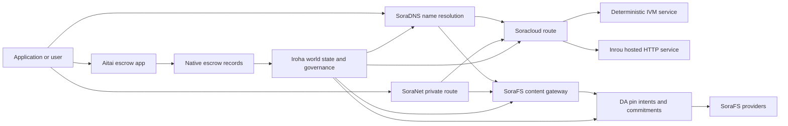

# SORA Nexus Услуги {#sora-nexus-services}


SORA Nexus добавляет сервисные самолеты, ориентированные на приложение Iroha 3. Эти услуги не являются отдельными реестрами. Iroha мировое государство, Norito манифестации, записи о управлении и Torii семейных маршрутов.

Наличие зависит от создания узла и профиля сети. [`/openapi`](/ru/reference/torii-endpoints.md#app-and-sora-route-families) для обнаружения генерируемого приложения-API маршруты на целевом узле. SoraFS CID и известные маршруты устанавливаются за пределами генерируемого документа, поэтому проверьте эти маршруты непосредственно при проверке развертывания.

## Карта компонентов {#component-map}

|Компонент |Роль |Основные поверхности |
| ---------------------- | ------------------------------------------------------------------------------------------------------------------------------------------- | ---------------------------------------------------------------------------------------- |
|Soracloud |Развертывание приложений, хостинг-сервисы, частная модель / состояние рабочего времени и контроль жизненного цикла сервиса. |`/v1/soracloud/`, `/api/`, `iroha app soracloud ...` |
|Внутри |Soracloud разместил HTTP время выполнения сервисных пересмотров, которые требуют живого самолета HTTP. |Soracloud конфигурация запуска, объявления о возможностях хоста, реплика состояния запуска |
|SoraNet |Конфиденциальность и транспортное перекрытие для цепочек, эстафеты, VPN, сеансы подключения и маршрутов потоковой передачи. |Метаданные маршрута `/v1/connect/`, `/v1/vpn/`, SoraNet |
|Доступность данных (DA) |Доказательства наличия, обязательства и слой целенаправленности для полезных нагрузок, указанные в полосах Nexus, манифестах SoraFS и потоках доказательств. |`/v1/da/`, `FindDaPinIntent`, `[sumeragi.da]` |
|SoraFS |Контент-адресная ткань для хранения манифестов, полезных нагрузок CAR, финированного контента, шлюзов и потоков подтверждения восстановленности. |`/v1/sorafs/`, `/sorafs/`, `FindSorafsProviderOwner` |
|SoraDNS |Детерминистическое наименование и уровень аттестации решений для услуг и контента, размещенных в SORA. |`/v1/soradns/`, `/soradns/`, события каталога решителей |
|Атай |Корридор фиатов и расчетов активов на уровне приложений, поддерживаемый местными записями в экспозиции, а не отдельной книгой. | `OpenAssetEscrow`, `FindAssetEscrow*`, `EscrowEventFilter`, Kotodama `escrow_*` построенные |



## Общие потоки {#common-flows}

### Хостированное приложение Split {#hosted-split-application}

Типичное приложение для смешанного плана использует все части вместе:

1. Статические активы фронтэнда упакованы и закреплены в SoraFS.
2. Общественный хозяин, например `<app>.sora`, регистрируется через SoraDNS.
3. маршруты Soracloud `/api/v1/search` или `/api/v1/stream` к службе Inrou HTTP.
4. маршруты Soracloud `/api/auth` и `/api/v1/user` к детерминированным управляющим IVM.
5. Клиенты, которые нуждаются в конфиденциальности, могут получить тот же контент или маршрут API через схему SoraNet.

|Путь .|Подъемный самолет |Почему ?|
| ----------------- | --------------------- | ------------------------------------------------- |
| `/`               |SoraFS статическое содержание |Кэширование коренного и шлюзового контента . |
|`/assets/*` |SoraFS статическое содержание |Содержание адресованных активов и прозрачные доказательства |
|`/api/auth*` |Soracloud IVM |Реплей-безопасный автор и слот бросает вызов состояние |
|`/api/v1/user*` |Soracloud IVM |Мутации состояния , чувствительные к управлению |
|`/api/v1/search*` |Soracloud Внутри |Прямой HTTP сервис, кешировка, SSE или состояние коллектора |

### Содержание публикации {#content-publication}

Публикация SoraFS производит прочные артефакты до того, как название указывает на них:

1. Создайте полезную нагрузку или каталог.
2. Запакируйте его в архив CAR и составьте план.
3. Создать манифест Norito с информацией о политике и управлении пин.
4. Подача манифеста на Torii.
5. Зарегистрируйте намерение или обязательство о наличии пин DA, если целевой профиль требует явных доказательств.
6. Привязать манифест к названию SoraDNS или к статическому маршруту переднего конца Soracloud.

### Частная доставка или маршрут трансляции {#private-fetch-or-streaming-route}

SoraNet может сидеть перед SoraFS или Soracloud:

1. Клиент решает имя или манифест.
2. Справочник охраны или маршрутный манифест выбирают входные и выходные релеи.
3. Трафик заполняется и отправляется через SoraNet схему.
4. Выходный реле достигает шлюза SoraFS, потока Torii или маршрута Soracloud.

## Атай {#aitai}

Aitai - это коридор приложений SORA для расчетов в стиле рынка, где покупатель и продавец координируют платежи вне цепи, а Iroha контролирует хранение активов на цепочке. для новых потоков хранения цифровых активов она должна использовать родную семью инструкций по эскрою вместо контрактного счета в собственности.

Нативный поручитель хранит опекунство в бухгалтерской книге. `OpenAssetEscrow`, покупатель принимает и отмечает платеж вне цепочки с `AcceptAssetEscrow` и `MarkEscrowPaymentSent`, и продавец выпускает с `ReleaseAssetEscrow` Если покупатель и продавец не согласны, любая из сторон может открыть спор и разрешить его с `CanResolveEscrowDispute` может разделить запертую сумму.

Для полного жизненного цикла, общих блокировок активов, анонимных поручительств, запросов, событий и примеров Rust см. [Native Asset Escrow](/ru/blockchain/escrow.md).

|Атайская поверхность |Используйте его для |
| ------------------------------------------------------------------------------------------------------------------------------------------------------------- | ----------------------------------------------------------------------------------------- |
| `OpenAssetEscrow`, `AcceptAssetEscrow`, `MarkEscrowPaymentSent`, `ReleaseAssetEscrow`, `CancelAssetEscrow`                                                    |Прозрачные количественные предложения активов, включая потоки расчетов в номиналах XOR. |
| `OpenAnonymousAssetEscrow`, `AcceptAnonymousAssetEscrow`, `MarkAnonymousEscrowPaymentSent`, `ReleaseAnonymousAssetEscrow`, `CancelAnonymousAssetEscrow`       |Защищенные предложения используют доказательства приложения для финансирования и закрытия движений. |
|`OpenEscrowDispute`, `ResolveEscrowDispute`, `OpenAnonymousEscrowDispute`, `ResolveAnonymousEscrowDispute` |Внесение споров и разрешение в судебном порядке. |
|`FindAssetEscrowById`, `FindAssetEscrowsBySeller`, `FindAssetEscrowsByBuyer`, `FindAssetEscrowsByStatus` |Страницы о состоянии приложения, работы по согласованию и инструменты поддержки. |
|`EscrowEventFilter` |Живые транспарентные подписки по удостоверению личности, продавцу, покупателю, статусу или виду событий. |
| Kotodama `escrow_open_offer`, `escrow_accept`, `escrow_mark_payment_sent`, `escrow_release`, `escrow_cancel`, `escrow_open_dispute`, `escrow_resolve_dispute` |Kotodama контрактные звонки, поддерживаемые с помощью V1 депозитарных систем |

Для общественности Taira или Minamoto использование, относиться к внецепочке платежной железной дороге и любому рабочему процессу поддержки или судебного разбирательства как к политике применения. Iroha записывает состояние ухода за ребенком, события жизненного цикла, хеш доказательств и окончательное движение активов; оно не проверяет фиатное расчеты самостоятельно.

## Проверяйте целевой узел {#check-a-target-node}

Прежде чем использовать примеры с этой страницы, подтвердите, что семья маршрутов существует на узле, который вы ориентируете:

```bash
export TORII_URL=https://taira.sora.org

curl -fsS "$TORII_URL/openapi.json" \
  | jq '.paths | keys[] | select(test("^/v1/(soracloud|sorafs|soradns|connect|vpn|da)/"))'

curl -fsS -H 'Accept: application/json' "$TORII_URL/status" | jq .
```

Если `/openapi.json` не раскрывается профилем, попробуйте `/openapi`. Точная доступность маршрута зависит от функций построения и конфигурации сети. Документ не перечисляет общедоступные локальные SoraFS CID и известные маршруты; проверьте эти конечные точки непосредственно, как описано ниже.

### Taira Читание только для проверки курения {#taira-read-only-smoke-checks}

Публичный конечный пункт Taira полезен для проверки страницы чтения, но не используйте его для мутирующих примеров, если вы не управляете авторизованной учетной записью и не намерены изменять состояние публичной тестируемой сети.

```bash
export TORII_URL=https://taira.sora.org

curl -fsS -H 'Accept: application/json' "$TORII_URL/status" \
  | jq '{version: .build.version, peers, blocks, lanes: (.teu_lane_commit | length)}'

curl -fsS "$TORII_URL/v1/connect/status" | jq '{enabled, sessions_active}'

curl -fsS "$TORII_URL/v1/vpn/profile" \
  | jq '{available, relay_endpoint, supported_exit_classes}'

curl -fsS "$TORII_URL/v1/sorafs/storage/peers?limit=4" \
  | jq '{gateway_base_url, pin_torii_urls}'

curl -fsS -H 'Accept: application/json' "$TORII_URL/v1/soracloud/status" \
  | jq '.control_plane | {service_count, services: [.services[] | {service_name, current_version}]}'
```

Taira может раскрывать маршруты специальных для развертывания управляющих самолетов, которые не перечислены в карте пути OpenAPI. Обращайтесь с `/openapi` как с созданным контрактом на маршруты, которые он содержит, а затем подтвердите конкретные и общедоступные локальные маршруты SoraFS непосредственно перед тем, как документировать их как доступные.

## Soracloud {#soracloud}

Soracloud - это план управления приложениями SORA. Он отслеживает пакеты развертывания, пересмотры услуг, маршрутизацию, состояние внедрения, авторитетные записи конфигурации, зашифрованные секреты сервиса, протоколы модельного реестра, частные сеансы вывода и расписки за время выполнения.

Soracloud использует два самолета выполнения:

|Самолет исполнения |Время работы |Используйте его для |
| ---------------------- | ------- | -------------------------------------------------------------------------------------------- |
|`DeterministicService` |`Ivm` |Автор, состояние хранилища, сертифицированные чтения, заказанные пользователи почтовых ящиков, мутации с чувствительным к управлению |
|`HttpService` |`Inrou` |Живая HTTP APIs, коллекторная работа, услуги с поддержкой кеша, SSE, потоки с помощью браузера |

Контрольная плоскость является авторитетной. Распоряжения по развертыванию, модернизации, отказу, конфигурации, секретности, модели и статусу отправляются через Torii и читают обязательное мировое состояние; они не зависят от отдельного локального зеркала CLI. Общественный маршрутизатор основан на самом длинном префиксе, поэтому один зарегистрированный хост может разделить трафик между хостинговыми маршрутами HTTP и детерминистическими маршрутами API.

### Разделить приложение {#scaffold-a-split-app}

В шаблоне разделенного приложения создается статический фронтэнд плюс один хостированный живой API и один детерминистический сервис хранилище/API:

```bash
iroha app soracloud app init \
  --template split-app \
  --app-name solswap_indexer \
  --app-version 0.1.0 \
  --public-host solswap-indexer.sora \
  --output-dir ./apps/solswap-indexer

iroha app soracloud app local-plan \
  --manifest ./apps/solswap-indexer/app_manifest.json

iroha app soracloud app doctor \
  --manifest ./apps/solswap-indexer/app_manifest.json
```

`local-plan` распечатывает раздел маршрута, манифесты детского обслуживания, пути сценариев рабочего пространства и ожидаемый режим публикации в фронт-энд. `doctor` подтверждает локальный договор выпуска до того, как вы включите Torii.

### Развертывание и проверка состояния приложения {#deploy-and-inspect-app-state}

```bash
export SORACLOUD_TORII_URL=https://<soracloud-enabled-torii>

iroha app soracloud app deploy \
  --manifest ./apps/solswap-indexer/app_manifest.json \
  --torii-url "$SORACLOUD_TORII_URL"

iroha app soracloud app status \
  --manifest ./apps/solswap-indexer/app_manifest.json \
  --torii-url "$SORACLOUD_TORII_URL"
```

Для уже развернутой службы используйте команды по охвату обслуживания:

```bash
iroha app soracloud status \
  --service-name solswap_indexer_live \
  --torii-url "$SORACLOUD_TORII_URL"

iroha app soracloud rollback \
  --service-name solswap_indexer_live \
  --target-version 0.1.0 \
  --torii-url "$SORACLOUD_TORII_URL"
```

### Конфигурация и секретные материалы {#config-and-secret-material}

Soracloud конфигурация и секретные записи являются частью авторитетного состояния развертывания. Развертывание, обновление и отказ от загрузки закрываются при отсутствии или несоответствии необходимых конфигураций или секретных связей с активными манифестами.

```bash
iroha app soracloud config-set \
  --service-name solswap_indexer_live \
  --config-name indexer/public_config \
  --value-file ./config/public-config.json \
  --torii-url "$SORACLOUD_TORII_URL"

iroha app soracloud secret-set \
  --service-name solswap_indexer_live \
  --secret-name indexer/api_key \
  --secret-file ./secrets/api-key.envelope.json \
  --torii-url "$SORACLOUD_TORII_URL"
```

Используйте CLI для получения точных знаков, требуемых вашим профилем:

```bash
iroha app soracloud config-set --help
iroha app soracloud secret-set --help
```

## Внутренние {#inrou}

Inrou - хостированное время выполнения HTTP, используемое Soracloud. Узло Iroha с встроенными проектами времени выполнения Soracloud, допущенными в состояние Soracloud План локальной материализации, запускает присвоенные копии хостинг-сервиса в качестве вертикальных сервисов и сообщает о состоянии выполнения репликации обратно в авторитетную модель.

Используйте Inrou для рабочей нагрузки, которая требует живой поверхности HTTP, такой как сборщик-тяжелый APIs, потоки SSE, обработки с поддержкой кеша или услуги с помощью браузера.

### Требования к срокам эксплуатации {#runtime-requirements}

- Время выполнения контейнерного манифеста должно быть `Inrou`.
- Площадь выполнения манифеста обслуживания должна быть `HttpService`.
- `HttpService + Inrou` требует точно одного `PersistentRootLeaseVolume`, установленного на `/`.
- Воспроизведённые услуги Inrou также нуждаются в совместном обслуживании или конфиденциальном арендном хранилище, когда они сохраняют изменчивый общий состояние.
- Узлы производственного хостинга должны рекламировать реальные возможности Inrou вместо того, чтобы работать только в качестве прокси.

### Явный фрагмент {#manifest-fragment}

Пример ниже показывает форму двух манифестаций. Это фрагмент, а не полный пакет развертывания.

```jsonc
// container_manifest.json
{
  "schema_version": 1,
  "runtime": { "runtime": "Inrou", "value": null },
  "bundle_path": "/bundles/solswap-indexer.inrou",
  "entrypoint": "/app/bin/launch-indexer.sh",
  "args": [],
  "env": {
    "RUST_LOG": "info",
  },
  "inrou": {
    "schema_version": 1,
    "guest_os": { "guest_os": "DebianSlim", "value": null },
    "guest_images": {
      "x86_64": {
        "kernel_image_path": "/inrou/x86_64/vmlinux",
        "rootfs_image_path": "/inrou/x86_64/rootfs.ext4",
        "initrd_image_path": null,
      },
      "aarch64": {
        "kernel_image_path": "/inrou/aarch64/vmlinux",
        "rootfs_image_path": "/inrou/aarch64/rootfs.ext4",
        "initrd_image_path": null,
      },
    },
  },
  "lifecycle": {
    "start_grace_secs": 60,
    "stop_grace_secs": 30,
    "healthcheck_path": "/api/indexer/v1/health",
  },
}
```

```jsonc
// service_manifest.json
{
  "schema_version": 1,
  "service_name": "solswap_indexer_live",
  "service_version": "0.1.0",
  "execution_plane": { "execution_plane": "HttpService", "value": null },
  "replicas": 2,
  "route": {
    "host": "solswap-indexer.sora",
    "path_prefix": "/api/v1/search",
    "service_port": 8080,
    "visibility": { "visibility": "Public", "value": null },
    "tls_mode": { "tls": "Required", "value": null },
  },
  "lease_volumes": [
    {
      "volume_name": "root_disk",
      "kind": {
        "lease_volume": "PersistentRootLeaseVolume",
        "value": null,
      },
      "storage_class": { "storage_class": "Warm", "value": null },
      "mount_path": "/",
      "max_total_bytes": 8589934592,
    },
    {
      "volume_name": "index_state",
      "kind": { "lease_volume": "ServiceLeaseVolume", "value": null },
      "storage_class": { "storage_class": "Warm", "value": null },
      "mount_path": "/var/lib/solswap-indexer",
      "max_total_bytes": 1073741824,
    },
  ],
}
```

Во время эксплуатации каждый объем аренды, установленный в аренду, подвергается воздействию с помощью переменных окружающей среды, полученных от названия объема:

```text
SORACLOUD_LEASE_VOLUME_ROOT_DISK_DIR
SORACLOUD_LEASE_VOLUME_ROOT_DISK_MOUNT_PATH
SORACLOUD_LEASE_VOLUME_INDEX_STATE_DIR
SORACLOUD_LEASE_VOLUME_INDEX_STATE_MOUNT_PATH
```

## SoraNet {#soranet}

SoraNet - это перекрытие конфиденциальности и транспорта. Он обеспечивает маршруты на основе реле для трафика, которые не должны напрямую подключаться к целевому шлюзу или сервису. Конструкция транспорта использует входные, средние и выходные роли реле, транспорт QUIC, гибридный рукопожатие на основе шума, переговоры о возможностях, метаданные релевого каталога и заполненные элементы фиксированного размера.

В развертывании Nexus, SoraNet может перевозить доставку контента, трафик шлюза, сессии VPN или Connect и маршруты потоковой передачи Norito. Записи каталога могут отмечать реле, которые поддерживают `norito-stream`, что позволяет клиентам предпочитать маршруты, подходящие для Torii RPC или потокового трафика.

### Конфигурация потоковой передачи {#streaming-configuration}

Профиль Nexus позволяет обеспечить SoraNet для маршрутов потоковой передачи:

```toml
[streaming]
feature_bits = 0b11

[streaming.soranet]
enabled = true
exit_multiaddr = "/dns/torii/udp/9443/quic"
padding_budget_ms = 25
access_kind = "authenticated"
provision_spool_dir = "./storage/streaming/soranet_routes"
provision_spool_max_bytes = 0
provision_window_segments = 4
provision_queue_capacity = 256
```

Используйте `access_kind = "read-only"` для маршрутов контента, которые не требуют аутентификации зрителей. Используйте `authenticated`, когда выходной эстафета должен обеспечить выдачу билетов или идентификацию зрителя перед переходом на Torii или хостинг-сервис.

### SoraNet-Знание SoraFS Привезить {#soranet-aware-sorafs-fetch}

В настоящее время SoraFS повозка CLI может выпускать локальный прокси-манифест и spool SoraNet маршрутные метаданные для расширений браузера или SDK Адаптеры, оркестр. JSON Должен определить `local_proxy` с `"emit_browser_manifest": true`, и CLI должны быть построены с `local-quic-proxy` Поддержка. Taira, проверять каталог разрешенных поставщиков на общедоступном тестировании сети, Затем заполнить защищенный провайдер, выданный для этого провайдера:

```bash
export TAIRA_ROOT=https://taira.sora.org
curl -fsS "$TAIRA_ROOT/v1/sorafs/providers?limit=20" | jq '.providers'

: "${TAIRA_SORAFS_PROVIDER_ID:?set the admitted provider ID from Taira discovery}"
: "${TAIRA_SORAFS_GATEWAY_KEY:?set the provider gateway key}"
: "${TAIRA_SORAFS_PROVIDER_URL:?set the advertised provider base URL}"
: "${TAIRA_SORAFS_STREAM_TOKEN_FILE:?set the issued stream-token file}"

cargo run -p sorafs_orchestrator --features=local-quic-proxy --bin=sorafs_cli -- \
  fetch \
  --plan=artifacts/payload_plan.json \
  --manifest-id=<manifest-digest-hex> \
  --orchestrator-config=artifacts/orchestrator.json \
  --provider=name=taira,provider-id="$TAIRA_SORAFS_PROVIDER_ID",gateway-key="$TAIRA_SORAFS_GATEWAY_KEY",base-url="$TAIRA_SORAFS_PROVIDER_URL",stream-token="$(cat "$TAIRA_SORAFS_STREAM_TOKEN_FILE")" \
  --output=artifacts/payload.bin \
  --json-out=artifacts/fetch_summary.json \
  --local-proxy-manifest-out=artifacts/proxy_manifest.json \
  --local-proxy-mode=bridge \
  --local-proxy-norito-spool=storage/streaming/soranet_routes \
  --local-proxy-kaigi-spool=storage/streaming/soranet_routes \
  --local-proxy-kaigi-policy=authenticated \
  --max-peers=2 \
  --retry-budget=4
```

Поставщик резюме сообщений, расписки на части, местные метаданные прокси и эффективные настройки маршрута, используемые для доставки.

### Перечень проверяющих факторов стимулирования передачи {#relay-incentive-verifier-roster}

В случае, если `incentives.enable` является верным, `incentives.trusted_verifier_ids` должен содержать по меньшей мере один канонический счет ID. Список никогда не должен превышать 64 записей, даже если стимулы отключены. Runtime сохраняет его как детерминистический упорядоченный набор и отвергает недействительную геометрию списка во время запуска реле.

Каждый `RelayBandwidthProofV1` декодируется в соответствии с фиксированной рамкой/бюджетом распределения и должен потреблять всю рамку. Счет проверщика доказательства должен присутствовать в конфигурированном списке, а `RelayBandwidthProofV1::verify_signature()` должен быть успешным, прежде чем реле закроет или изменит его аккумулятор производительности. Реле игнорирует ненадежный подписывающийся или подпись-недействительный / измененное доказательство. Такое доказательство не добавляет никаких измерений и не может создать стимулирующий снимок.

## Наличие данных (DA) {#data-availability-da}

DA - это слой доказательств доступности для полезных нагрузок, которые слишком большие, слишком чувствительные к конфиденциальности или слишком специфические для обслуживания, чтобы размещать их непосредственно в мировом состоянии. Он регистрирует детерминистические обязательства и обязательства по извлечению, чтобы валидаторы, шлюзы и клиенты могли договориться о том, какие байты были обещаны, какая политика применяется и какие доказательства наблюдались.

DA не заменяет Kura или SoraFS:

- Kura сохраняет завершенный блок-поток и консенсусные данные восстановления.
- SoraFS хранит и обслуживает байты, адресованные содержанию, полезные нагрузки CAR и манифесты.
- DA записывает обязательства, политику доказательства, открытия доказательств и намерения пин, которые позволяют планировать эти байты, проводить аудит и связывать их с состоянием книги.

Использование DA при подаче заявления или Nexus Lane нуждается в главном обещании о том, что данные вне цепочки остаются доступными. Обычные примеры включают обязательства по полезной нагрузке полос для расчетных потоков, SoraFS Пин-намерения для опубликованного содержания, пакеты доказательств, которые должны быть сохранены для последующей проверки; и артефакты применения, общественное состояние которых должно быть расщеплением, а не полным полезным грузом.

### жизненный цикл {#lifecycle}

|Этап .|Что записано ?|
| ---------- | ----------------------------------------------------------------------------------------------------------------------------------------------------- |
|Намерение|Билет, проявленная ссылка, псевдоним, ссылка на полосу/эпоху/секвенцию, политика сохранения или цель репликации. |
|Приверженность |Переваривать материал, который связывает манифест, полезную нагрузку полосы, пакет доказательств или корень контента с записью, видимой в регистре. |
|Доказательства |Голоса по доступности, открытия для доказательств, аттестации поставщиков или другие профильные данные, принятые целевой сетью |
|Вопрос |Проверка фиксированного намерения через `FindDaPinIntentByTicket`, `FindDaPinIntentByManifest`, `FindDaPinIntentByAlias` или `FindDaPinIntentByLaneEpochSequence`. |

Типичный поток публикаций, поддерживаемый DA, является:

1. Создать или получать полезную нагрузку за пределами WSV, например файла SoraFS CAR или полезной нагрузки полосы Nexus.
2. Hash и описывайте полезную нагрузку в манифесте Norito или учете обязательств по маршруту.
3. Поставьте манифест, намерение или обязательство через `/v1/da/*`, когда семейство маршрутов включено, или через подписанный маршрут транзакции сети.
4. Пусть валидаторы или провайдеры доступности собирают доказательства, требуемые политикой активного подтверждения.
5. Спросите о полученном намерении или обязательстве перед продвижением псевдонима, доказательства расчетов или маршрута шлюза, который зависит от полезного груза.

### Алгоритмическая модель {#algorithmic-model}

DA превращает полезную нагрузку в подписанный, защищенный от воспроизведения, блок-индексированный обязательство. Важные алгоритмы являются детерминистическими, так что валидаторы и шлюзы могут пересчитывать те же дигесты из тех же байтов.

1. Канонизировать представленную полезную нагрузку. Torii принимает запрос по приему с помощью `(lane_id, epoch, sequence)`, байтов полезной нагрузки, метаданных сжатия, размера части, профиля удаления, Политика хранения и подпись подателя. Уз разжимает gzip, deflate или Zstandard полезные нагрузки при запросе, а затем проверяет, что каноническая длина байта равна `total_size` .
2. Подтвердить параметры полосы и части. полоса должна присутствовать в каталоге полос Nexus. `chunk_size` должен иметь не нулевую мощность двух, по меньшей мере двух байтов, и не превышает установленного максимума. Профиль удаления должен включать фрагменты данных и по меньшей мере два фрагмента паритета. В каталоге ленты выбирается схема доказательства, либо `merkle_sha256`, либо `kzg_bls12_381`.
3. Применить политику сети. Нод навязывает конфигурированную репликационную и базовую линию хранения для класса blob. Публичные метаданные должны оставаться простым текстом; метаданные, предназначенные только для управления, зашифруются с помощью ключа метаданных управления, созданного нодом, прежде чем они будут написаны в манифесте.
4. Каноническая полезная нагрузка состоит из фиксированного профиля, полученного от `chunk_size`. Torii вычисляет показатель полезной нагрузки, корень дерева доказательства восстановленности и обязательства в разрезе. BLAKE3 обязательства по своим байтам.
5. Добавьте обязательства по удалению. `data_shards`. Отсутствующие клетки в финальной полосе заполнены на нуле для расчета паритета. RS(16) паритет создает рядовые/глобальные паритетные фрагменты; `row_parity_stripes` Добавить паритет полосы в стиле столбцов по матрице. BLAKE3 пищеварение мелких индейцев `u16` символы.
6. Создайте манифест. `DaManifestV1` записывает полосу, эпоху, класс блоков, кодек, переписку полезной нагрузки, корень частицы, размер частицы, профиль удаления, политику хранения, стоимость аренды, обязательства частицы, необязательные обязательства IPA, метаданные и время выпуска. Билет хранения является детерминистическим: узел сначала хэширует шаблон манифеста с пустым билетом, а затем записывает этот отпечаток пальца обратно в качестве финального `storage_ticket`.
7. Отклонить конфликты воспроизведения. Ключ воспроизведения - `(lane_id, epoch, sequence, manifest_fingerprint)`. Дубликат с одним и тем же отпечатком пальца не имеет возможности. Отклоняется устаревшая последовательность или та же последовательность с другим отпечатом пальца.
8. Выпустите подписанные артефакты. Torii вычисляет PDP обязательства, подписывает `DaIngestReceipt`, создает `DaCommitmentRecord`, и записывает для ясных, PDP обязательство, запись об обязательствах, график обязательств, намерение настойки, файл расписки и журнал расписки. Квитанция курсора продвигается монотонно на `(lane_id, epoch)`.

Запись об обязательствах - это то, что содержат блоки.

- полоса, эпохи и последовательности
- Блоб звонка ID и хэш канонического манифестирования
- схема прочности полосы
- кусочек корня
- необязательное обязательство KZG для полос KZG
- PDP/доказательный дигест
- класс хранения и билет на хранение
- Подпись подтверждения Torii DA

Перед тем, как блок внедрит записи DA, путь сборки блоков подтверждает пакет:

- `(lane_id, epoch, sequence)` должна быть уникальной внутри пакета.
- Манифестные хэши должны быть не нулевыми и уникальными внутри пакета.
- Схема подтверждения обязательств должна соответствовать политике конфигурированной полосы.
- Меркельские полосы отказываются от обязательств KZG; полосы KZG требуют обязательства, не составляющих нулевого значения KZG.
- Интенты пин канонизируются, сортируются и фильтруются по полосе, гашированному манифесту, билету на хранение, учетной записи владельца и правилам коллизии под названием.

В заголовке блоков хранятся хэши для DA Доказательства политики, обязательств и намерений. в обязательном пакете также выявлено корне Merkle , чьи листья являются хаши канонического Norito-кодируемый `DaCommitmentRecord` ценности. Родительские узлы расшифруют соединение левых и правых детей; необычный лист продвигается неизменным на следующий слой.

### Проверка доказательств {#proof-verification}

`/v1/da/commitments/prove` может представить доказательство одного обязательства в блоке. Доказательство содержит обязательство, высоту блока, индекс в пакете, хэш пакета, длина пакета, корне Merkle и родственный путь. проверки:

1. Указанный хэш подтверждения совпадает с хэшем обязательств заголовка блоков DA.
2. Высота блок-доказательства совпадает с заголовком указанного блока.
3. Индекс находится в пределах, и обязательство равняется объему зачислений по этому индексу.
4. Политика пропускной способности принимает обязательство.
5. Складывая родственный путь с листья обязательства, восстанавливается поставленный корень.
6. Реконструированный корень равен кусочком корня.

Это доказывает, что конкретное обязательство по доступности было включено в конкретную полезную нагрузку блоков; это не подтверждает, что все копии в настоящее время онлайн. Проверка доступности в режиме реального времени проводится отдельно с помощью проверки поставщиков SoraFS, проверок PDP/PoTR или доказательств наличия, определяемых по профилю.

### Взаимодействие с консенсусом {#consensus-interaction}

DA соединяется с Sumeragi через надежную трансляцию (RBC), но это не второй протокол окончательности. RBC распространяет и восстанавливает полезные нагрузки предложений: Предлагающий объявляет о проведении сессии для `(height, view, payload_hash)`, переменных блоков, и сигналов `READY`/`DELIVER` отслеживает, соблюдали ли достаточное количество validators одну и ту же полезную нагрузку.

В Iroha 3 равный считает доступную ожидаемую полезную нагрузку блока, если либо:

- локальный ожидающий блок гаширует байты к ожидаемой нагрузке гаширования, или
- RBC восстановил полезную нагрузку совпадающую с хэшем блока, высотой, просмотром и хешом полезной нагрузки.

Если ни одно из этих условий не соответствует требованиям, сообщение `missing_local_data` продолжает пытаться восстановить полезную нагрузку через RBC или блокировать синхронизацию, и сообщает о DA Вход в состояние и телеметрию. В текущей реализации эти сигналы DA являются рекомендательными для окончательности: блок все еще завершается из сертификата обязательства плюс соответствующая местная полезная нагрузка, не из отдельного сертификата кворума DA.

Время DA расширяет окна восстановления. Эффективный срок кворума DA получается из настроенного блока и сроков обязательств, затем умножается на `sumeragi.advanced.da.quorum_timeout_multiplier`. Время доступности составляет `max(quorum_timeout, availability_timeout_floor_ms) * availability_timeout_multiplier`. Прежде чем истечет срок доступности, узел поддерживает восстановление полезной нагрузки и избегает преждевременного перепланирования; после его окончания обычные пути восстановления и изменения просмотра могут продолжиться.

### Заметки оператора {#operator-notes}

К консенсусным профилям Iroha 3 относятся распространение полезной нагрузки, поддерживаемое RBC, защитные манифестирования, проверка пакета DA и телеметрия восстановления. Типовой шаблон раскрывает пределы `[sumeragi.da]` для обязательств и расширенных доказательств на блок, плюс кратковременные умножители `[sumeragi.advanced.da]` для кворума и поведения доступности.

Для обнаружения маршрута начинайте с документа OpenAPI узла:

```bash
curl -fsS "$TORII_URL/openapi.json" \
  | jq '.paths | keys[] | select(startswith("/v1/da/"))'
```

Используйте [ссылка на запрос](/ru/reference/queries.md#nexus-data-availability-and-packages) для текущего DA названия запросов, и [шаблон конфигурации сверстников](/ru/reference/peer-config/) для местных `[sumeragi.da]` Кнопки подвергнуты воздействию вашей конструкции.

## SoraFS {#sorafs}

SoraFS - это децентрализованная ткань хранения адресованного контента. Он упаковывает байты в детерминистические куски, архивы CAR и манифесты Norito, которые связывают корни контента, Провайдеры хранилищ рекламируют способность и доступность контента, в то время как шлюзы проверяют манифестации и обязательства по размещению контента.

Типичное использование SoraFS включает в себя статические активы приложений, сборки документации, зонные пакеты, ссылки на модели или артефакты и пакеты доказательств управления. Данная модель Iroha раскрывает события шлюза SoraFS и запрос [`FindSorafsProviderOwner`](/ru/reference/queries.md#nexus-data-availability-and-packages) для разрешения собственности поставщика.

### Профиль тестовой сети Taira {#taira-testnet-profile}

Taira является канонической общественностью SoraFS Профиль проверенного валидатора использует цепь `fc56984b-2be7-431d-840e-21514d1883f0` и цепной дискриминатор `369`. Опубликовано SoraFS настройки:

- сеть ID: `hash:82531CE8EAE8BFF6BEECA4698BFD13A3BC8BEC5F0EE0D23D428C97FC17AB0F3B#3E94`
- Входная база URL: `https://taira.sora.org`
- Пин Torii URLs: от `https://taira-validator-1.sora.org` до `https://taira-validator-4.sora.org`
- возможности обнаружения: `torii_gateway`, `chunk_range_fetch` и `potr_mldsa`
- происхождение изолированного содержания: `https://{cid}.sorafs.taira.sora.org/{path}`
- государственная политика: без разрешения и с платной целью, с `require_council_signatures = false`

```toml
[sorafs.storage]
enabled = false
max_capacity_bytes = 13743895347

[sorafs.discovery]
discovery_enabled = true
known_capabilities = ["torii_gateway", "chunk_range_fetch", "potr_mldsa"]

[sorafs.discovery.publish]
gateway_base_url = "https://taira.sora.org"
pin_torii_urls = [
  "https://taira-validator-1.sora.org",
  "https://taira-validator-2.sora.org",
  "https://taira-validator-3.sora.org",
  "https://taira-validator-4.sora.org",
]

[sorafs.gateway.untrusted_hosting]
enabled = true
path_gateway_redirect = true
redirect_html_only = true

[sorafs.gateway.untrusted_hosting.cid_host_suffixes]
taira = "sorafs.taira.sora.org"

[sorafs.repair]
enabled = false

[sorafs.gc]
enabled = false

[gov.sorafs_pin_policy]
require_council_signatures = false
```

В настоящее время Taira встроены валидаторы SoraFS Сохранение, ремонт и сбор мусора остаются отключеными. проверка диска-бюджета validator; это не означает, что validator является поставщиком хранилищ. `GET /v1/sorafs/storage/peers?limit=4` для прочтения текущего конфигурированного шлюза и пунктов назначения пин перед испытанием.

Суффикс `sorafs.sora.org` CID - это профиль живого/производства, а не Taira. Не указывайте его в манифестах Taira, проверках происхождения или тестах браузера. Развертывание производства должно использовать свою собственную сетевую идентичность, ключи управления, материалы приема поставщиков услуг, конечные точки пин и политику по производству/ремонту; никогда не копируйте верификации Taira или предположения конечных пунктов в конфигурацию производства.

### Публичные локальные CID и порталы сайта {#public-local-cid-and-site-gateways}

Каждый узел Torii, включенный в SoraFS, устанавливает эти анонимные общественные маршруты даже когда дополнительное приложение API не построено:

|Метод и конечный пункт |Цель .|
| ---------------------------------- | -------------------------------------------------------------------- |
|`GET /.well-known/sorafs/manifest` |Возвращайте манифест , выбранный хозяином канонического запроса |
|`GET /v1/sorafs/cid/{cid}` |Возвращение ограниченных метаданных локального манифеста и записей файлов для одного CID |
|`GET /sorafs/cid/{cid}` |Служить коренным документом для одного локального сайта , адресованного контенту |
|`GET /sorafs/cid/{cid}/{*path}` |Служить одной нормализованной трассы, или один ограниченный диапазон байтов, под этим CID |

Эти маршруты никогда не принимают `x-sorafs-stream-token` или `x-sorafs-token-id`. Наличие одного из заголовков является плохим запросом. Канонический манифест, уже присутствующий в авторитетном локальном магазине узла возможности публичного чтения; ошибка кеша не разрешает гидратирование удаленного провайдера. Защищенный провайдер CAR и частичные маршруты остаются отдельными проверенными поверхностями протокола.

Прежде чем читать байты, Torii подтверждает каноническое кодирование локального манифеста, семантические ограничения, дигест и корень CID. Затем требуется авторитетная идентификация местного поставщика, признание управления и регулируемое соответствие для манифеста CID и поставщика. Политика тарифа / запрета на вход использует действительный адрес клиента, уважая переданные адреса только через конфигурированные доверенные представители. Если отсутствует политика, соответствие, идентификация или состояние приема, Torii отклоняет запрос.

Один запрос имеет разрешение на общественный портал от конца к концу; ограничение по всему процессу составляет 64 одновременные чтения, с возвращением излишних запросов `503 Service Unavailable` и `Retry-After: 1`. Явные ответы ограничены на 16 MiB, Списки файлов по умолчанию до 50 записей и возвращения не более 500, а полный файл или однобайтный диапазон ограничены на 8 MiB. Отзывный анализ зависит от конструкции. `app_api` Build принимает декодированный неподписанный 32-битный `limit`, игнорирует другие ключи запроса, позволяет последний повторяется `limit` выигрыш, и затягивает значение в `1..=500`. Минимальная конструкция без `app_api` принимает только один канонический `limit=1..500` Пара и отклоняет неизвестные, повторяющиеся, кодируемые процентами или неканонические формы. `limit=<1..500>` Пара для поведения, которое переносится через конструкции. CIDs, хосты, пути и заголовки диапазона остаются каноническими и однозначными в обоих сборниках. HTML, CSS, JavaScript, SVG, XML, PDF, или контент Wasm подается только из конфигурированного CID- полученное изолированное происхождение (или перенаправленное туда), предотвращая реализацию недостоверного контента совместным путем-воротным источником.

### Собирайте, стройте и подавайте {#pack-build-and-submit}

В следующем примере мутации используется зарегистрированный Taira `NetworkId`, Определите конечную точку, пол репликации и политику управления. Используйте профильный тест-сет и одноразовый файл ключей для владельца. Taira Принимает без разрешения ручки без подписей совета, но все равно взимает установленную плату.

```bash
cargo run -p sorafs_orchestrator --bin sorafs_cli -- \
  car pack \
  --input=./dist \
  --car-out=artifacts/site.car \
  --plan-out=artifacts/site.chunk-plan.json \
  --summary-out=artifacts/site.car-summary.json

: "${TAIRA_AUTHORITY:?set a funded Taira I105 account}"
export TAIRA_NETWORK_ID='hash:82531CE8EAE8BFF6BEECA4698BFD13A3BC8BEC5F0EE0D23D428C97FC17AB0F3B#3E94'
export TAIRA_PIN_TORII_URL=https://taira-validator-1.sora.org
export TAIRA_PRIVATE_KEY_FILE="${TAIRA_PRIVATE_KEY_FILE:-./secrets/taira-authority.ed25519}"
export TAIRA_RETENTION_EPOCH=$(( $(date -u +%s) + 86400 ))

cargo run -p sorafs_orchestrator --bin sorafs_cli -- \
  manifest build \
  --summary=artifacts/site.car-summary.json \
  --manifest-out=artifacts/site.manifest.to \
  --manifest-json-out=artifacts/site.manifest.json \
  --pin-min-replicas=1 \
  --pin-storage-class=warm \
  --pin-retention-epoch="$TAIRA_RETENTION_EPOCH"

cargo run -p sorafs_orchestrator --bin sorafs_cli -- \
  manifest submit \
  --manifest=artifacts/site.manifest.to \
  --chunk-plan=artifacts/site.chunk-plan.json \
  --torii-url="$TAIRA_PIN_TORII_URL" \
  --network-id="$TAIRA_NETWORK_ID" \
  --authority="$TAIRA_AUTHORITY" \
  --private-key-file="$TAIRA_PRIVATE_KEY_FILE" \
  --summary-out=artifacts/site.manifest.submit.json \
  --response-out=artifacts/site.manifest.submit.body
```

`manifest submit` требует `/v1/sorafs/pin/register`. Если целевой узел не направляет его, команда не выполняется; первый выпуск CLI не возвращается к общей конечной точке `/transaction`.

### Проверьте и приведите {#verify-and-fetch}

Защищенный тупль доставки является специфичным для поставщика. Получите его поставщика ID и рекламную базу URL из каталога поставщиков Taira, и получите ключ шлюза и токен потока через этот поток приема провайдера. Эти значения не являются настройками хранения валидатора. проверенные в Taira валидаторы включены в ход, поэтому не заменяйте пин-валидатора URL для провайдера URL.

```bash
export TAIRA_ROOT=https://taira.sora.org
curl -fsS "$TAIRA_ROOT/v1/sorafs/providers?limit=20" | jq '.providers'

: "${TAIRA_SORAFS_PROVIDER_ID:?set the admitted provider ID from Taira discovery}"
: "${TAIRA_SORAFS_GATEWAY_KEY:?set the provider gateway key}"
: "${TAIRA_SORAFS_PROVIDER_URL:?set the advertised provider base URL}"
: "${TAIRA_SORAFS_STREAM_TOKEN_FILE:?set the issued stream-token file}"

cargo run -p sorafs_orchestrator --bin sorafs_cli -- \
  proof verify \
  --manifest=artifacts/site.manifest.to \
  --car=artifacts/site.car \
  --chunk-plan=artifacts/site.chunk-plan.json \
  --summary-out=artifacts/site.verify.json

cargo run -p sorafs_orchestrator --bin sorafs_cli -- \
  fetch \
  --plan=artifacts/site.chunk-plan.json \
  --manifest-id=<manifest-digest-hex> \
  --provider=name=taira,provider-id="$TAIRA_SORAFS_PROVIDER_ID",gateway-key="$TAIRA_SORAFS_GATEWAY_KEY",base-url="$TAIRA_SORAFS_PROVIDER_URL",stream-token="$(cat "$TAIRA_SORAFS_STREAM_TOKEN_FILE")" \
  --output=artifacts/site.fetch.tar \
  --json-out=artifacts/site.fetch.json
```

### Проверки доказательства восстановительности {#proof-of-retrievability-checks}

Операторы могут проверять, экспортировать и сообщать о доказательстве восстановления Результаты: задачи планируются по трубопроводу доказательств сети; CLI выявляется их результат.

```bash
cargo run -p sorafs_orchestrator --bin sorafs_cli -- \
  por status \
  --torii-url="$TAIRA_PIN_TORII_URL" \
  --manifest=<manifest-digest-hex> \
  --status=failed \
  --limit=20

cargo run -p sorafs_orchestrator --bin sorafs_cli -- \
  por report \
  --torii-url="$TAIRA_PIN_TORII_URL" \
  --week=<YYYY-Www> \
  --format=json
```

## SoraDNS {#soradns}

SoraDNS - это определённый слой имен для услуг и контента SORA. Он нормализует имена, соединяет обновления каталога решений в Iroha, и распространяет подписанные зоны или пакеты решений через SoraFS. Резолюторы и шлюзы проверяют аттестатные документы резолютора, прежде чем доверять метаданным обнаружения.

Для доступа к браузеру SoraDNS получает хосты шлюзов из зарегистрированного FQDN. Зарегистрированный хост пустоты остается каноническим источником приложения, в то время как развернутые профили шлюзов выставляют маршруты браузера и обратных путей Torii для этого источника.

### Формы хостинга {#host-forms}

|Форма|Пример |Цель |
| --- | --- | --- |
|Поход тщеславия |`https://<fqdn>/<path>` |Каноническое приложение URL записано в манифестах и записках об освобождении |
| Taira браузерный шлюз |`https://<fqdn>.mon.taira.sora.net/<path>` |Публичный браузерный шлюз для активного псевдонима |
|Torii обратный путь |`https://taira.sora.org/soradns/<fqdn>/<path>` |Torii Дебаг и обратный маршрут для активного псевдонима |
|Canonical hash gateway |`<base32(blake3(name))>.gw.sora.id` |Детерминистическая идентификация шлюза и проверка GAR |

Fallback `/soradns/<alias>/...` не является предпочтительным общественным URL. Инструментация, манифесты приложений и конфигурация фронтэнда должны предпочитать сам хост пустоты. Если псевдоним не активен на Taira, браузерный шлюз или обратный путь могут вернуться к `404` или потерпеть неудачу в TLS до начала маршрутизации приложений.

### Проводные ворота хостов {#derive-gateway-hosts}

```ts
import {
  deriveSoradnsGatewayHosts,
  hostPatternsCoverDerivedHosts,
} from '@iroha/iroha-js'

const derived = deriveSoradnsGatewayHosts('docs.sora')
console.log(derived.canonicalHost)
console.log(derived.prettyHost)

const taira = deriveSoradnsGatewayHosts('solswap-indexer.sora', {
  prettySuffix: 'mon.taira.sora.net',
})
console.log(taira.prettyHost)

const patterns = [
  derived.canonicalHost,
  derived.canonicalWildcard,
  derived.prettyHost,
]
console.log(hostPatternsCoverDerivedHosts(patterns, derived))
```

GAR полезные нагрузки должны охватывать канонический хэш хост, каноническая дикая карта, и выбранный красивый хост.

### Приведите снимок резюме Резолютор {#fetch-a-resolver-directory-snapshot}

```bash
curl -i "$TORII_URL/v1/soradns/directory/latest"

soradns_resolver directory fetch \
  --record-url "$TORII_URL/v1/soradns/directory/latest" \
  --directory-url https://gateway.example.org/soradns/directory/latest.car \
  --output ./state/soradns-directory

soradns_resolver rad verify \
  --rad ./state/soradns-directory/rad/resolver-a.norito
```

Gateways должны отклонить резюсеры , чьи разрешение удостоверения документа является отсутствуют, истекают срок действия, не подписываются или не закреплены в последнем каталоге Merkle root В сети, где еще не опубликован каталог решителей. `/v1/soradns/directory/latest` может вернуть `404` даже если маршрут включен.

### Общественная DNS Делегация {#public-dns-delegation}

SoraDNS производность хоста не заменяет обычную интернет-делегацию DNS. Если публичное имя DNS должно указывать на шлюз SoraDNS:

- для субдоменов опубликовать CNAME в выбранном красивом хостере
- для названий вершин, используйте записи ALIAS/ANAME или A/AAAA в шлюзе anycast IPs
- хранить канонический хэш-хост под доменом шлюза SoraDNS для проверки GAR;

## FHE и UAID {#fhe-and-uaid}

Поверхности, относящиеся к FHE, доступные для услуг Nexus, включают:

- `iroha_crypto::fhe_bfv` реализует детерминистическую поддержку BFV для оценки скалярного шифрового текста. Резолюция идентификатора использует `BfvIdentifierPublicParameters` и `BfvIdentifierCiphertext`, где слот 0 хранит длину входных байтов, а позднее слоты хранят один зашифрованный байт каждый.
- Soracloud модели государственных и рабочих схем FHE шифровая рабочая нагрузка текста с наборами параметров, управляемых управлением, политикой выполнения, обязательствами в области шифрового текста, конвертами запросов и просьбами о раскрытии данных.

Маршрут идентификатора BFV используется для регистрации с сохранением конфиденциальности. Клиент может отправить шифрованный идентификатор в решителя Torii. Решатель оценивает он в соответствии с политикой активного идентификатора получает `OpaqueAccountId` и выдает квитанцию `ClaimIdentifier`. Затем связывает эту квитанции с UAID, прикрепленной к целевому счету.

В настоящее время UAID В данной модели, мы можем определить, что это значит. `UniversalAccountId` подкреплено хэшем и отображается как `uaid:<hash>`. Парассеры принимают либо `uaid:<hash>` или сырое 64-хексовое переваривание. `Account` и `NewAccount` включать в себя необязательные `uaid` и `opaque_ids` Регистрация в режиме запуска приводит к выпуску один на один UAID- к счету индекс, отклоняет двойные или столкнувшиеся непрозрачные идентификаторы и отвергает непрозрачные индикаторы без UAID. Всякий раз, когда UAID При изменении учетной записи, время запуска восстанавливает связки пространственного каталога данных для этого UAID.

Пространственный каталог манифестирует возможности прикрепления к UAID. Сборник `AssetPermissionManifest` названия UAID, пространство данных, эпоха активации и необязательной истечения срока действия, а также заказанные записи разрешения/отклонения по пространству данных, программе, методу, активу, и AMX Оценка - отрицание-выигрыш: первый соответствующий отказ отклоняет запрос, в противном случае последнее согласование разрешает кандидата проверяется по отношению к любому пределу суммы. Публикация, истечение срока действия и отмена этих манифестов охраняется `CanPublishSpaceDirectoryManifest`.

По состоянию на Soracloud FHE реализованные схемы:

|Схема|Что он контролирует?|
| ----------------------------------------- | --------------------------------------------------------------------------------------------------------------------------- |
|`SoraStateBindingV1` с `FheCiphertext` |Заявляет, что значения под префиксом государственного ключа являются FHE шифровыми текстами. |
|`FheParamSetV1` |Название схемы, бэкэнд, цепочка модулей, степень полиномий, количество слотов, цель безопасности, жизненный цикл и переваривание параметров. |
|`FheExecutionPolicyV1` |Ограничает размер шифрового текста, размер простого текста, количество ввода/вывода, глубину умножения, вращения, загрузку и режим округления. |
|`FheGovernanceBundleV1` |Сочетает один параметр, установленный с одной политикой исполнения для проверки приема. |
|`FheJobSpecV1` |Описывает детерминистическую работу `Add`, `Multiply`, `RotateLeft` или `Bootstrap` над ключами и обязательствами по состоянию шифрового текста. |
|`CiphertextQuerySpecV1` |Запросы содержат только шифрованный текст по службе, обязательности, префиксу ключа, пределу результатов, уровню метаданных и дополнительному доказательству включения. |
|`DecryptionRequestV1` |Просит раскрытие для одного шифрового текста обязательства в соответствии с политикой расшифровки. |

`FheJobSpecV1::validate_for_execution` проверяет, согласуются ли задачи, политика выполнения и параметры перед принятием. rotate и bootstrap требуют точно одного ввода, а запрашиваемая глубина, количество ротаций, количество bootstraps, количество вводов, байты полезной нагрузки и размер детерминистического выхода должны оставаться в пределах границ политики.

UAID не является шифровым текстом и не самой политикой FHE. Это стабильная якорь возможностей учетной записи, используемая для поиска учетной записи , непрозрачных идентификационных требований и связей Space Directory, которые разрешают поток сервиса или пространства данных. Схемы FHE регулируют зашифрованное принятие и выполнение полезной нагрузки отдельно посредством наборов параметров, политики исполнения, обязательств по шифрованию текста и политики полномочий по расшифровке.

Соответствующие поверхности Torii включают в себя:

- `/v1/identifier-policies`
- `/v1/identifiers/resolve`
- `/v1/accounts/{account_id}/identifiers/claim-receipt`
- `/v1/identifiers/receipts/{receipt_hash}`
- `/v1/accounts/{uaid}/portfolio`
- `/v1/space-directory/uaids/{uaid}`
- `/v1/space-directory/uaids/{uaid}/manifests`
- `/v1/soracloud/model/run-private`
- `/v1/soracloud/model/run-private/finalize`
- `/v1/soracloud/model/decrypt-output`

Граница публичных метаданных явно определена в схемах: UAID связывания, непрозрачные идентификационные записи, жизненный цикл манифеста, дигесты ключевого состояния, размеры шифрового текста, обязательства с шифровым текстом, названия политики, версии набора параметров, операции задач, ключи выхода состояния, Идентификационные простые тексты, расшифрованное состояние, вводы и выводы модели, а также секретные ключи FHE находятся за пределами этих публичных записей запросов.

## Операционный контрольный список {#operational-checklist}

- Подтвердить генерируемые семейные службы с `/openapi` на цели Torii узел, и исследовать общественный локальный SoraFS CID и известные маршруты прямо.
- Обращайтесь с манифестами развертывания Soracloud, манифестациями SoraFS, записями каталога решителей SoraDNS, записками каталога реле SoraNet и записями пин-интентов или обязательствами по доступности DA как с артефактами, чувствительными к управлению.
- Используйте один и тот же профиль SORA Nexus последовательно на всех validator в одной сети.
- Сохраняйте объемы корневого и совместного аренды Inrou в манифестах, вместо того, чтобы полагаться на ad hoc узло-местные пути.
- Используйте проверку доказательств SoraFS перед продвижением псевдонимного содержания.
- Монитор SoraNet ошибки в рукопожатии, DA кворум или сроки доступности; SoraFS отказы от входа, SoraDNS RAD свежесть, и Soracloud Развертывание здоровья.
- Для использования общедоступной тестовой сети используйте профиль Taira и начните с [Свяжитесь с SORA Nexus датчатами данных](/ru/get-started/sora-nexus-dataspaces.md).

См. также:

- [конечные точки Torii](/ru/reference/torii-endpoints.md)
- [Фильтры событий данных](/ru/blockchain/filters.md#data-event-filters)
- [Справка на запрос](/ru/reference/queries.md#nexus-data-availability-and-packages)
- [Каноническая конфигурация валидатора Taira на финированном commit](https://github.com/hyperledger-iroha/iroha/blob/0010c5a70039eac101a4846499ba9ceaf43eb65c/configs/soranexus/taira/config.toml)
