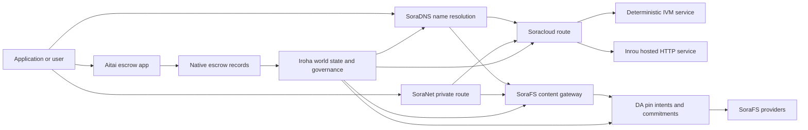

# SORA Nexus Услуги {#sora-nexus-services}

SORA Nexus добавляет сервисные самолеты, ориентированные на приложение Iroha 3. Эти услуги
Они не являются отдельными бухгалтерскими книгами. Iroha мировое государство, Norito
манифестации, записи о управлении и Torii семейных маршрутов.

Доступность зависит от создания узла и профиля сети.
[`/openapi`](/ru/reference/torii-endpoints.md#app-and-sora-route-families) на
Целевой узел как авторитетный список включенных маршрутов.

## Карта компонентов {#component-map}

| Компонент              | Роль                                                                                                                                        | Основные поверхности                                                                            |
| ---------------------- | ------------------------------------------------------------------------------------------------------------------------------------------- | ---------------------------------------------------------------------------------------- |
| Soracloud              | Развертывание приложений, хостинг-сервисы, частная модель / состояние рабочего времени и контроль жизненного цикла услуг.                                        | `/v1/soracloud/*`, `/api/*`, `iroha app soracloud ...`                                   |
| Внутренние                  | Soracloud размещенные HTTP время выполнения пересмотров услуг, требующих прямого HTTP Самолет.                                                            | Soracloud конфигурация времени запуска, объявления о возможностях хоста, реплика состояния времени запуска                 |
| SoraNet                | Конфиденциальность и транспортное перекрытие для цепей, эстафеты; VPN, Соедините сеансы и потоковые маршруты.                                     | `/v1/connect/*`, `/v1/vpn/*`, SoraNet метаданные маршрута                                     |
| Доступность данных (DA) | Доказательства наличия, обязательства и слой целенаправленности для полезных нагрузок, указанных в Nexus дорожки, SoraFS проявляется, и доказательства протекают. | `/v1/da/*`, `FindDaPinIntent*`, `[sumeragi.da]`                                          |
| SoraFS                 | Ткани для хранения манифестов с адресной контентом, CAR полезные нагрузки, закрепленное содержание, выводы из шлюзов и потоки подтверждения восстановления.           | `/v1/sorafs/*`, `/sorafs/*`, `FindSorafsProviderOwner`                                   |
| SoraDNS                | Детерминистическое наименование и слой разрешения-аттестации для SORA- хостинг услуг и контента.                                                   | `/v1/soradns/*`, `/soradns/*`, события каталога resolver                                 |
| Атай                  | Корридор фиатного и расчетов активов на уровне приложений, поддерживаемый местными записями по депозитам, а не отдельной книгой.                                     | `OpenAssetEscrow`, `FindAssetEscrow*`, `EscrowEventFilter`, Kotodama `escrow_*` построенные |



## Общие потоки {#common-flows}

### Хостированное приложение Split {#hosted-split-application}

Типичное приложение для смешанного плана использует все части вместе:

1. Статические активы фронтэнда упаковываются и закрепляются через SoraFS.
2. Общественный хозяин, например `<app>.sora`, зарегистрировано через
   SoraDNS.
3. Soracloud маршруты `/api/v1/search` или `/api/v1/stream` к Инру HTTP
   Служба.
4. Soracloud маршруты `/api/auth` и `/api/v1/user` к детерминистической IVM
   управляющих.
5. Клиенты, которые нуждаются в конфиденциальности могут получить тот же контент или API маршрут
   через SoraNet Счётчик.

| Путь              | Запасный самолет         | Почему ?                                               |
| ----------------- | --------------------- | ------------------------------------------------- |
| `/`               | SoraFS статическое содержание | Каширование коренного и шлюзового контента, воспроизводимого     |
| `/assets/*`       | SoraFS статическое содержание | Активы, адресованные содержанию и доказательства      |
| `/api/auth*`      | Soracloud IVM         | Относительно безопасный статус автора и бросающего вызов кошелька       |
| `/api/v1/user*`   | Soracloud IVM         | Мутации состояния, чувствительные к управлению              |
| `/api/v1/search*` | Soracloud Внутренние       | Жизнь HTTP сервис, кеширование, SSE, или коллекторское государство |

### Содержание публикации {#content-publication}

SoraFS публикация производит прочные артефакты до того, как название указывает на них:

1. Создайте полезную нагрузку или каталог.
2. Запакируйте его в CAR Архив и план кусочки.
3. Создать Norito Пин-политики и данные управления.
4. Передача манифеста в Torii.
5. Зарегистрируйте DA Пин-намерение или обязательство о доступности, когда цель
   Профиль требует ясных доказательств.
6. Привязать манифест к SoraDNS имя или Soracloud статический фронтальный маршрут.

### Частная доставка или маршрут трансляции {#private-fetch-or-streaming-route}

SoraNet может сидеть перед SoraFS или Soracloud:

1. Клиент решает имя или манифест.
2. Справочник охранников или маршрутный манифест выбирает релеи входа и выхода.
3. Заправленный и отправленный через SoraNet Счётчик.
4. Выходный эстафета достигает SoraFS входные ворота, Torii поток, или Soracloud
   Маршрут.

## Атай {#aitai}

Атай - это SORA Приложения для расчетов на рынке, где:
покупатель и продавец координируют платеж вне цепочки, в то время как Iroha контролирует
Сбережение активов в цепочке.
вместо контрактного счета-эскроя для новой конфиденциальности цифровых активов
Поток.

Начальник хранит в книге опекунство.
`OpenAssetEscrow`, покупатель принимает и отмечает внецепочка платеж с
`AcceptAssetEscrow` и `MarkEscrowPaymentSent`, и продавец освобождает
с `ReleaseAssetEscrow` Если покупатель и
если продавец не согласен, любая из сторон может открыть спор и разрешить его с
`CanResolveEscrowDispute` может разделить запертую сумму.

На весь жизненный цикл, генеральные блокировки активов, анонимные поручительства, запросы,
события, и Rust Примеры, см.
[Осуществление сбережений на собственные активы](/ru/blockchain/escrow.md).

| Атайская поверхность                                                                                                                                                 | Используйте его для                                                                                |
| ------------------------------------------------------------------------------------------------------------------------------------------------------------- | ----------------------------------------------------------------------------------------- |
| `OpenAssetEscrow`, `AcceptAssetEscrow`, `MarkEscrowPaymentSent`, `ReleaseAssetEscrow`, `CancelAssetEscrow`                                                    | Прозрачные предложения цифровых активов, в том числе XOR- номинальные потоки урегулирования.             |
| `OpenAnonymousAssetEscrow`, `AcceptAnonymousAssetEscrow`, `MarkAnonymousEscrowPaymentSent`, `ReleaseAnonymousAssetEscrow`, `CancelAnonymousAssetEscrow`       | Защищенные предложения, когда движения по финансированию и закрытию осуществляются путем подтверждения. |
| `OpenEscrowDispute`, `ResolveEscrowDispute`, `OpenAnonymousEscrowDispute`, `ResolveAnonymousEscrowDispute`                                                    | Введение споров и разрешение в судебном порядке.                                                 |
| `FindAssetEscrowById`, `FindAssetEscrowsBySeller`, `FindAssetEscrowsByBuyer`, `FindAssetEscrowsByStatus`                                                      | Страницы статуса приложения, работы по согласованию и инструменты поддержки.                               |
| `EscrowEventFilter`                                                                                                                                           | Живые транспарентные подписки по адресу "эскор", продавцу, покупателю, статусу или типу событий. |
| Kotodama `escrow_open_offer`, `escrow_accept`, `escrow_mark_payment_sent`, `escrow_release`, `escrow_cancel`, `escrow_open_dispute`, `escrow_resolve_dispute` | Kotodama контрактные звонки, поддерживаемые V1 Скриптовая система.                                 |

Для общественности Taira или Minamoto использование, обработка внецепочки платежных рельсов и
любой процесс поддержки или судебного процесса в качестве политики подачи заявки. Iroha записывает
состояние удержания, события жизненного цикла, распределение доказательств и окончательное движение активов;
самостоятельно не проверяет фиатные расчеты.

## Проверьте целевой узел {#check-a-target-node}

Прежде чем использовать примеры на этой странице, подтвердите, что существует семейство маршрутов
на узле, который вы ориентируете:

```bash
export TORII_URL=https://taira.sora.org

curl -fsS "$TORII_URL/openapi.json" \
  | jq '.paths | keys[] | select(test("^/v1/(soracloud|sorafs|soradns|connect|vpn|da)/"))'

curl -fsS "$TORII_URL/status" | jq .
```

Если `/openapi.json` не подвергается воздействию профиля, попробуйте `/openapi`. Точно.
доступность маршрута зависит от функций построения и конфигурации сети.

### Taira Читать только тютюновые чеки {#taira-read-only-smoke-checks}

Общественность Taira конечная точка полезна для проверки с точки зрения чтения, но не используйте ее
для мутирующих примеров, если вы не управляете авторизованным аккаунтом и
намерены изменить состояние жизни.

```bash
export TORII_URL=https://taira.sora.org

curl -fsS "$TORII_URL/status" \
  | jq '{version: .build.version, peers, blocks, lanes: (.teu_lane_commit | length)}'

curl -fsS "$TORII_URL/v1/connect/status" | jq '{enabled, sessions_active}'

curl -fsS "$TORII_URL/v1/vpn/profile" \
  | jq '{available, relay_endpoint, supported_exit_classes}'

curl -fsS "$TORII_URL/v1/sorafs/storage/state" \
  | jq '{bytes_capacity, bytes_used, pin_queue_depth, por_inflight}'

curl -fsS -H 'Accept: application/json' "$TORII_URL/v1/soracloud/status" \
  | jq '.control_plane | {service_count, services: [.services[] | {service_name, current_version}]}'
```

Taira могут выявлять маршруты специальных для развертывания контрольных самолетов, которые не являются
перечисленные в OpenAPI Карта пути. `/openapi` как первичный генерируемый
API контракт, а затем подтверждение любого маршрута непосредственно перед развертыванием
Документируя его как живое.

## Soracloud {#soracloud}

Soracloud Это SORA Площадь управления применением.
пакеты, пересмотры сервисов, маршрутизация, состояние развертывания, авторитетная конфигурация
записи, шифрованные секреты службы, модели реестра записей, частный
сеансы выводов и расписки за время работы.

Soracloud использует два самолета выполнения:

| Самолет исполнения        | Время выполнения | Используйте его для                                                                                   |
| ---------------------- | ------- | -------------------------------------------------------------------------------------------- |
| `DeterministicService` | `Ivm`   | Автор, состояние хранилища, сертифицированные чтения, заказанные пользователи почтовых ящиков, мутации, чувствительные к управлению |
| `HttpService`          | `Inrou` | Жизнь HTTP APIs, работа с коллекторами, услуги, поддерживаемые кешем; SSE, потоки с помощью браузера     |

Контрольный самолет авторитетный.
секретные, модели и статуса команды подают через Torii и читать обязаны
мирового государства; они не полагаются на отдельное CLI- местное зеркало.
маршрутизация основана на самом длинном префиксе, поэтому один зарегистрированный хост может разделить трафик
между принимаемыми HTTP маршруты и детерминизм API маршруты.

### Разделить приложение {#scaffold-a-split-app}

Шаблон раздельного приложения создает статический фронтэнд плюс один хостинг в режиме прямого API
и один детерминистический тремор/API обслуживание:

```bash
iroha app soracloud app init \
  --template split-app \
  --app-name solswap_indexer \
  --app-version 0.1.0 \
  --public-host solswap-indexer.sora \
  --output-dir ./apps/solswap-indexer

iroha app soracloud app local-plan \
  --manifest ./apps/solswap-indexer/app_manifest.json

iroha app soracloud app doctor \
  --manifest ./apps/solswap-indexer/app_manifest.json
```

`local-plan` печатает раздел маршрута, манифесты детского обслуживания, рабочее пространство
маршруты сценария, и ожидаемый режим публикации фронтэнда. `doctor`
подтверждает договор о местном освобождении до того, как вы включите Torii.

### Развертывание и проверка состояния приложения {#deploy-and-inspect-app-state}

```bash
export SORACLOUD_TORII_URL=https://<soracloud-enabled-torii>

iroha app soracloud app deploy \
  --manifest ./apps/solswap-indexer/app_manifest.json \
  --torii-url "$SORACLOUD_TORII_URL"

iroha app soracloud app status \
  --manifest ./apps/solswap-indexer/app_manifest.json \
  --torii-url "$SORACLOUD_TORII_URL"
```

Для уже развернутой службы используйте команды с охватом обслуживания:

```bash
iroha app soracloud status \
  --service-name solswap_indexer_live \
  --torii-url "$SORACLOUD_TORII_URL"

iroha app soracloud rollback \
  --service-name solswap_indexer_live \
  --target-version 0.1.0 \
  --torii-url "$SORACLOUD_TORII_URL"
```

### Конфигурация и секретные материалы {#config-and-secret-material}

Soracloud Config и секретные записи являются частью авторитетного развертывания
Развертывание, модернизация и отказ от загрузки закрываются при необходимости конфигурации или
отсутствуют секретные связи или несовместимы с активными манифестами.

```bash
iroha app soracloud config-set \
  --service-name solswap_indexer_live \
  --config-name indexer/public_config \
  --value-file ./config/public-config.json \
  --torii-url "$SORACLOUD_TORII_URL"

iroha app soracloud secret-set \
  --service-name solswap_indexer_live \
  --secret-name indexer/api_key \
  --secret-file ./secrets/api-key.envelope.json \
  --torii-url "$SORACLOUD_TORII_URL"
```

Используйте CLI помощь в определении точных знаков идентификации, требуемых вашим профилем:

```bash
iroha app soracloud config-set --help
iroha app soracloud secret-set --help
```

## Внутренние {#inrou}

Инру - хозяин HTTP время выполнения, используемое Soracloud. Сборник Iroha узел с
встроенные Soracloud приняты проекты по запуску Soracloud в местный
план материализации, начинает присвоенные копии хостинг-сервиса как loopback
Службы и отчеты реплика состояния запуска обратно в авторитетный
Модель.

Используйте Inrou для рабочей нагрузки, которая требует HTTP поверхность, например
сборщик-тяжелый APIs, SSE потоки, обработки с кешем, или
услуги с помощью браузера.

### Требования к срокам работы {#runtime-requirements}

- Время выполнения контейнерного манифеста должно быть `Inrou`.
- План выполнения служебного манифеста должен быть `HttpService`.
- `HttpService + Inrou` требует точно одного `PersistentRootLeaseVolume`
  установлены на `/`.
- Воспроизведенные услуги Inrou также нуждаются в совместном обслуживании или конфиденциальном аренде
  хранение, когда они сохраняют изменяемое общее состояние.
- В узлах производства должны рекламироваться реальные мощности Inrou вместо
  действует только в качестве доверенного лица.

### Явный фрагмент {#manifest-fragment}

Пример ниже показывает форму двух манифестов.
не полный пакет развертывания.

```jsonc
// container_manifest.json
{
  "schema_version": 1,
  "runtime": { "runtime": "Inrou", "value": null },
  "bundle_path": "/bundles/solswap-indexer.inrou",
  "entrypoint": "/app/bin/launch-indexer.sh",
  "args": [],
  "env": {
    "RUST_LOG": "info",
  },
  "inrou": {
    "schema_version": 1,
    "guest_os": { "guest_os": "DebianSlim", "value": null },
    "guest_images": {
      "x86_64": {
        "kernel_image_path": "/inrou/x86_64/vmlinux",
        "rootfs_image_path": "/inrou/x86_64/rootfs.ext4",
        "initrd_image_path": null,
      },
      "aarch64": {
        "kernel_image_path": "/inrou/aarch64/vmlinux",
        "rootfs_image_path": "/inrou/aarch64/rootfs.ext4",
        "initrd_image_path": null,
      },
    },
  },
  "lifecycle": {
    "start_grace_secs": 60,
    "stop_grace_secs": 30,
    "healthcheck_path": "/api/indexer/v1/health",
  },
}
```

```jsonc
// service_manifest.json
{
  "schema_version": 1,
  "service_name": "solswap_indexer_live",
  "service_version": "0.1.0",
  "execution_plane": { "execution_plane": "HttpService", "value": null },
  "replicas": 2,
  "route": {
    "host": "solswap-indexer.sora",
    "path_prefix": "/api/v1/search",
    "service_port": 8080,
    "visibility": { "visibility": "Public", "value": null },
    "tls_mode": { "tls": "Required", "value": null },
  },
  "lease_volumes": [
    {
      "volume_name": "root_disk",
      "kind": {
        "lease_volume": "PersistentRootLeaseVolume",
        "value": null,
      },
      "storage_class": { "storage_class": "Warm", "value": null },
      "mount_path": "/",
      "max_total_bytes": 8589934592,
    },
    {
      "volume_name": "index_state",
      "kind": { "lease_volume": "ServiceLeaseVolume", "value": null },
      "storage_class": { "storage_class": "Warm", "value": null },
      "mount_path": "/var/lib/solswap-indexer",
      "max_total_bytes": 1073741824,
    },
  ],
}
```

В период эксплуатации каждый установленный объем аренды подвергается воздействию окружающей среды
переменные, полученные из названия объема:

```text
SORACLOUD_LEASE_VOLUME_ROOT_DISK_DIR
SORACLOUD_LEASE_VOLUME_ROOT_DISK_MOUNT_PATH
SORACLOUD_LEASE_VOLUME_INDEX_STATE_DIR
SORACLOUD_LEASE_VOLUME_INDEX_STATE_MOUNT_PATH
```

## SoraNet {#soranet}

SoraNet Это обеспечивает конфиденциальность и транспортное покрытие.
маршруты для движения, которые не должны напрямую подключаться к целевому шлюзу
или обслуживание. конструкция транспорта использует входные, средние и выходные реле роли,
QUIC транспорт, гибридный рукопожатие на основе шума, переговоры о возможностях,
метаданные релевого каталога и клеты с фиксированным размером.

В Nexus развертывания, SoraNet может перевозить доставку контента, трафик шлюзов,
VPN или сеансы Connect, и Norito Запись в каталог может
знак передает эту поддержку `norito-stream`, что позволяет клиентам предпочитать маршруты
подходит для Torii RPC или потоковой трафик.

### Конфигурация потока {#streaming-configuration}

Сборник Nexus профиль SoraNet предоставление услуг для маршрутов потоковой передачи:

```toml
[streaming]
feature_bits = 0b11

[streaming.soranet]
enabled = true
exit_multiaddr = "/dns/torii/udp/9443/quic"
padding_budget_ms = 25
access_kind = "authenticated"
provision_spool_dir = "./storage/streaming/soranet_routes"
provision_spool_max_bytes = 0
provision_window_segments = 4
provision_queue_capacity = 256
```

Использование `access_kind = "read-only"` для маршрутов содержания, которые не требуют
аутентификация просмотра. `authenticated` когда эстафета выхода должна обеспечивать
билеты или личность зрителя, прежде чем перейти к Torii или хостинг-сервис.

### SoraNet- Знаю. SoraFS Приведи . {#soranet-aware-sorafs-fetch}

Сборник SoraFS прибытие CLI может выпускать локальный прокси-манифест и ролик SoraNet
метаданные маршрута для расширений браузера или SDK адаптеры:

```bash
sorafs_cli fetch \
  --plan artifacts/payload_plan.json \
  --manifest-id 7bb2...9d31 \
  --provider name=alpha,provider-id=9f5c...73aa,base-url=https://gw-alpha.example.org/,stream-token="$(cat alpha.token)" \
  --output artifacts/payload.bin \
  --json-out artifacts/fetch_summary.json \
  --local-proxy-manifest-out artifacts/proxy_manifest.json \
  --local-proxy-mode bridge \
  --local-proxy-norito-spool storage/streaming/soranet_routes \
  --local-proxy-kaigi-spool storage/streaming/soranet_routes \
  --local-proxy-kaigi-policy authenticated \
  --max-peers=2 \
  --retry-budget=4
```

Отчеты провайдера резюме, расписки на кусочки, метаданные местных представителей,
и эффективные настройки маршрута, используемые для доставки.

## Доступность данных (DA) {#data-availability-da}

DA является уровнем наличия доказательств для полезных нагрузок, которые слишком большие, также
чувствительные к конфиденциальности или слишком специфические для обслуживания, чтобы размещать их непосредственно в мире
Он регистрирует детерминистические обязательства и обязательства по извлечению
валидаторы, шлюзы и клиенты могут договориться о том, какие байты были обещаны,
Какая политика применяется и какие доказательства были обнаружены.

DA не заменяет Kura или SoraFS:

- Kura сохраняет финализированный блок-поток и консенсусные данные восстановления.
- SoraFS хранит и обслуживает байты, адресованные контенту; CAR полезные нагрузки и
  Проявления.
- DA записывает обязательства, политику проверки, открытия доказательств и намерения фиксации
  которые позволяют этим байтам планировать, проверять и связывать их с реестр
  Государство.

Использование DA при подаче заявления или Nexus Лейну нужен видный в книге обещание
Обычные примеры включают полосу
обязательства по полезной нагрузке для расчетных потоков, SoraFS Пин-намерения для публикации
содержание, пакеты доказательств, которые должны быть сохранены для последующей проверки; и
Применение артефактов, общественное состояние которых должно быть дигестом, а не
полная нагрузка.

### жизненный цикл {#lifecycle}

| Стадия      | Что записано                                                                                                                                      |
| ---------- | ----------------------------------------------------------------------------------------------------------------------------------------------------- |
| Намерение     | Билет, указатель ссылки, псевдоним, ссылка на полосу/эпоху/секуенцию, политика хранения или цель репликации.                                          |
| Обязанность | Переваривать материал, который связывает манифест, полезную нагрузку полосы, букет доказательств или корень контента с записью, видимой в регистре.                                    |
| Доказательства   | голосование по доступности, открытия для доказательств, аттестации поставщиков или другие профильные доказательства, принятые целевой сетью.                         |
| Вопрос      | Проверки с целью проникновения `FindDaPinIntentByTicket`, `FindDaPinIntentByManifest`, `FindDaPinIntentByAlias`, или `FindDaPinIntentByLaneEpochSequence`. |

Типичный DA- поддерживаемый поток публикаций:

1. Построение или получение полезной нагрузки вне WSV, к примеру SoraFS CAR
   досье или Nexus полезная нагрузка.
2. Hash и описать полезную нагрузку в Norito манифест или маршрутный
   запись о приверженности.
3. Представьте манифест, намерение или обязательство через `/v1/da/*` когда
   что семейство маршрутов включено, или через подписанную сеть
   путь транзакции.
4. Пусть проверяющие или поставщики доступности собирают необходимые доказательства
   Политикой активного доказательства.
5. Спросите о полученном намерении или обязательстве перед продвижением псевдонима,
   доказательство расчетов или маршрут шлюза, который зависит от полезной нагрузки.

### Алгоритмическая модель {#algorithmic-model}

DA превращает полезную нагрузку в подписанный, защищенный от повторного воспроизведения, блок-индексированный обязательство.
Важные алгоритмы являются детерминистическими, так что валидаторы и шлюзы могут
пересчитывать те же биты из тех же байтов.

1. **Канонизируйте представленный полезный груз.** Torii принимает запрос на прием с
   `(lane_id, epoch, sequence)`, Байты полезной нагрузки, метаданные сжатия, кусочек
   размер, профиль удаления, политика хранения и подпись подавшего.
   разжимает gzip, deflate или Zstandard полезные нагрузки при запросе, затем
   проверяет, что длина канонического байта равна `total_size`.
2. **Подтвердить параметры полосы и части.** Путь должен существовать в Nexus
   Каталог полос. `chunk_size` Должен быть не нулевой мощностью 2, по меньшей мере 2.
   и не превышает установленного максимума.
   включают в себя фрагменты данных и не менее двух фрагментов паритета.
   схема доказательства, либо `merkle_sha256` или `kzg_bls12_381`.
3. **Применить политику сети.** Узло заставляет настроить репликацию и
   базовый уровень сохранения для класса "блобы". Публичные метаданные должны оставаться простого текста;
   Метаданные, предназначенные только для управления, зашифрованы с конфигурированным управлением узла
   ключ метаданных, прежде чем он будет записан в манифест.
4. **Сделайте это.** Каноническая полезная нагрузка разбит фиксированным размером
   Профиль, полученный из `chunk_size`. Torii вычисляет расход полезной нагрузки,
   Корень дерева доказательства восстановленности и обязательства на кусочек.
   перевозка BLAKE3 обязательства по своим байтам.
5. **Добавьте обязательства по удалению.** Чашки группируются в полосы
   `data_shards`. Отсутствующие клетки в финальной полосе наполнены нулем для паритета
   расчет. RS(16) паритет создает строки/глобальные парности; необязательно
   `row_parity_stripes` Добавьте паритет полосы в стиле колонки по матрице.
   Задачи по паритетным разделам: BLAKE3 пищеварение мелких андианов `u16` символы.
6. **Создайте реестр.** `DaManifestV1` записывает полосу, эпоху, класс пятен,
   Кодекс, переваривание полезной нагрузки, корень кусочка, размер кусочки, профиль удаления, сохранение
   Политика, квота аренды, обязательства на части, необязательно IPA обязательства, метаданные,
   Точка хранения детерминистична: узел сначала хэширует
   Manifest template с пустым билетом, затем записывает этот отпечаток пальца обратно как
   финал `storage_ticket`.
7. **Откажитесь от конфликтов повторного воспроизведения.** Ключ к воспроизведению
   `(lane_id, epoch, sequence, manifest_fingerprint)`. Дубликат с
   То же отпечатки пальцев не имеют силы.
   отпечатки пальцев отвергаются.
8. **Выпустите подписанные артефакты.** Torii вычисляет PDP обязательства, подписывает
   `DaIngestReceipt`, создает `DaCommitmentRecord`, и пишет артефакты из катушек
   для ясных, PDP обязательства, отчетность об обязательствах, график выполнения обязательств;
   Пин-намерение, файл квитанции и журнал квитанций.
   монотонно на `(lane_id, epoch)`.

Запись об обязательствах - это то, что содержат блоки.

- полоса, эпоха и последовательность
- Блоб звонка ID и канонический манифест хэши
- схема прочности полосы
- корень кусочки
- по выбору KZG обязательства KZG полосы
- PDP/доказательная пищеварение
- класс хранения и билет на хранение
- Torii DA подпись подтверждения

Прежде чем блокируются DA записей, путь сборки блоков подтверждает пакет:

- `(lane_id, epoch, sequence)` должны быть уникальными внутри пакета.
- Проявленные хэши должны быть не нулевыми и уникальными внутри пакета.
- Схема подтверждения обязательств должна соответствовать политике конфигурированной полосы.
- Мерклейные полосы отклоняются KZG обязательства; KZG полосы требуют не нулевой KZG
  Приверженность.
- Замысли штифовок канонизируются, сортируются и фильтруются по полосе, манифестируют хэш,
  билет на хранение, счет владельца и правила коллизии под псевдонимом.

Заголовок блока хранит хэши для DA Политика проверки, обязательства и пин
Для доказательств членства, пакет обязательств также раскрывает Merkle
корень, листья которого являются хаши канонических Norito-кодируются
`DaCommitmentRecord` ценности. родительские узлы набрасывают конкаценацию левых и
Правые дети; необычный лист продвигается неизменным в следующий слой.

### Проверка доказательств {#proof-verification}

`/v1/da/commitments/prove` может представить доказательство одного обязательства в блоке.
Доказательство содержит обязательство, высоту блока, индекс в пакете, пакеты
hash, длина пакета, корень Merkle и путь братьев.

1. Хеш-пакет доказательств соответствует заголовку блока DA Хеш-связи.
2. Высота блока доказательства соответствует заголовку указанного блока.
3. Индекс находится в пределах, и обязательство равняется зачислению в пакете на тот момент
   индекс.
4. Политика прочности полос принимает обязательство.
5. Складывание брачного пути с листка обязательств восстанавливает поставленные
   корневой.
6. Реконструированный корень равен кореню пучки.

Это доказывает, что конкретное обязательство по обеспечению доступности было включено в
блок полезной нагрузки; это не доказывает, что каждая реплика в настоящее время онлайн.
восстановленность проверяется отдельно через SoraFS доставщика, PDP/PoTR
проверки или доказательства наличия, специфические для профиля.

### Взаимодействие консенсуса {#consensus-interaction}

DA соединено с Sumeragi через надежное вещание (RBC), но это не
второй протокол окончательности. RBC распространяет и восстанавливает полезные нагрузки предложений:
Предлагающий объявляет о проведении сессии на `(height, view, payload_hash)`, сверстники
обменные кусочки, и `READY`/`DELIVER` сигналы отслеживают, есть ли достаточное количество валидаторов
наблюдал ту же полезную нагрузку.

В Iroha 3, Peer считает, что ожидающаяся полезная нагрузка блока доступна, если:

- локальный ожидающий блок гаширует байты к ожидаемой нагрузке гаширования, или
- RBC восстановил полезную нагрузку, соответствующую хэши блока, высоте, просмотру и
  Хеш.

Если ни одно из условий не соответствует требованиям, рекорды сверстников `missing_local_data`, продолжает пытаться
для восстановления полезной нагрузки через RBC или блокировать синхронизацию, и сообщает о DA Входные ворота
В настоящее время внедряются DA сигналы
Консультативная информация о окончательности: блок еще завершается из сертификата обязательства плюс
соответствующая местная полезная нагрузка, не из отдельной DA Свидетельство о кворуме.

DA Время расширяет окна восстановления. DA вытекает из кворума
из конфигурированного блока и задать сроки, затем умножить на
`sumeragi.advanced.da.quorum_timeout_multiplier`. Время доступности:
`max(quorum_timeout, availability_timeout_floor_ms) * availability_timeout_multiplier`.
Перед истечением срока доступности узел поддерживает восстановление полезной нагрузки и
избегает преждевременного перепланирования; после истечения срока его действия нормальное восстановление и
Продолжается просмотр путей.

### Ноты оператора {#operator-notes}

Iroha 3 Консенсусные профили включают RBC- поддерживаемое распространение полезной нагрузки, манифест
охранников, DA Бандл-валидация и телеметрия восстановления.
экспозиции шаблона `[sumeragi.da]` ограничения на обязательства и открытия для доказательств в размере:
блок, плюс `[sumeragi.advanced.da]` умножители временного пропуска для кворума и
Сохраняйте эти настройки последовательными между валидаторами в одной
профиль сети.

Для обнаружения маршрута, начинайте с узла OpenAPI документ:

```bash
curl -fsS "$TORII_URL/openapi.json" \
  | jq '.paths | keys[] | select(startswith("/v1/da/"))'
```

Используйте
[ссылка на запрос](/ru/reference/queries.md#nexus-data-availability-and-packages)
для текущего DA названия запросов, и
[шаблон конфигурации сверстников](/ru/reference/peer-config/) для местных
`[sumeragi.da]` ногти, выявленные твоим строением.

## SoraFS {#sorafs}

SoraFS - это децентрализованная ткань хранения с адресованным содержанием.
байты в детерминистические кусочки, CAR архивы, и Norito проявляет, что
связывают корни контента, профили разбивки, политики пин и управление
Аттестации. Доставщики хранилищ рекламируют емкость и содержание
доступность, в то время как шлюзы проверяют манифесты и части обязательств до
содержимое.

Типичный SoraFS использования включают активы статического применения, документацию
построения, зоны, модели или артефакты ссылки и доказательства управления
Сборные. Iroha экспозиции моделей данных SoraFS события портала и
[`FindSorafsProviderOwner`](/ru/reference/queries.md#nexus-data-availability-and-packages)
запрос на разрешение собственности поставщика.

### Собирайте, объясняйте, подпишите и подавайте {#pack-manifest-sign-and-submit}

```bash
cargo run -p sorafs_car --features cli --bin sorafs_cli -- \
  car pack \
  --input ./dist \
  --car-out artifacts/site.car \
  --plan-out artifacts/site.chunk-plan.json \
  --summary-out artifacts/site.car-summary.json

cargo run -p sorafs_car --features cli --bin sorafs_cli -- \
  manifest build \
  --summary artifacts/site.car-summary.json \
  --manifest-out artifacts/site.manifest.to \
  --manifest-json-out artifacts/site.manifest.json \
  --pin-min-replicas=3 \
  --pin-storage-class=warm \
  --pin-retention-epoch=42

SIGSTORE_ID_TOKEN=$(oidc-client fetch-token) \
cargo run -p sorafs_car --features cli --bin sorafs_cli -- \
  manifest sign \
  --manifest artifacts/site.manifest.to \
  --bundle-out artifacts/site.manifest.bundle.json \
  --signature-out artifacts/site.manifest.sig

cargo run -p sorafs_car --features cli --bin sorafs_cli -- \
  manifest submit \
  --manifest artifacts/site.manifest.to \
  --chunk-plan artifacts/site.chunk-plan.json \
  --torii-url "$TORII_URL" \
  --resolve-submitted-epoch=true \
  --authority=<i105-account-id> \
  --private-key-file ./secrets/authority.ed25519 \
  --summary-out artifacts/site.manifest.submit.json \
  --response-out artifacts/site.manifest.submit.body
```

Если `/v1/sorafs/pin/register` не маршрутизируется на целевом узле, CLI может
возвращаться к подписанному `/transaction` Подача и ожидание терминала
состояние трубопровода.

### Проверьте и приведите {#verify-and-fetch}

```bash
cargo run -p sorafs_car --features cli --bin sorafs_cli -- \
  proof verify \
  --manifest artifacts/site.manifest.to \
  --car artifacts/site.car \
  --chunk-plan artifacts/site.chunk-plan.json \
  --summary-out artifacts/site.verify.json

sorafs_cli fetch \
  --plan artifacts/site.chunk-plan.json \
  --manifest-id <manifest-digest-hex> \
  --provider name=primary,provider-id=<provider-id-hex>,base-url=https://gateway.example.org/,stream-token="$(cat provider.token)" \
  --output artifacts/site.fetch.tar \
  --json-out artifacts/site.fetch.json
```

### Проверка доказательства восстановленности {#proof-of-retrievability-checks}

Операторы могут проверять и запускать проверки доказательств для поставщиков хранения:

```bash
sorafs_cli por status \
  --torii-url "$TORII_URL" \
  --manifest <manifest-digest-hex> \
  --status=failed \
  --limit=20

sorafs_cli por trigger \
  --torii-url "$TORII_URL" \
  --manifest <manifest-digest-hex> \
  --provider <provider-id-hex> \
  --reason=latency_probe \
  --samples=48 \
  --auth-token artifacts/challenge_token.to
```

## SoraDNS {#soradns}

SoraDNS является детерминистическим именным слоем для SORA услуги и содержание.
нормализует названия, соединяет решения каталога обновления в Iroha, и
распределяет подписанные зоны или пакеты решений через SoraFS. Резолюции и
Gateways проверяют документы подтверждения решений до того , как доверять открытию
метаданные.

Для доступа в браузер, SoraDNS получает хостинг шлюзов из зарегистрированного FQDN.
Зарегистрированный хостинг пустоты остается источником канонического применения, в то время как
развернутые профили шлюзов обнаруживают браузер и Torii маршруты обратного пути для этого
происхождение.

### Формы хостинга {#host-forms}

| Форма | Пример | Цель |
| --- | --- | --- |
| Противоположное происхождение | `https://<fqdn>/<path>` | Каноническое приложение URL зарегистрированы в манифестах и записях об освобождении |
| Taira браузерный шлюз | `https://<fqdn>.mon.taira.sora.net/<path>` | Публичный браузерный шлюз для активного псевдонима |
| Torii обратный путь | `https://taira.sora.org/soradns/<fqdn>/<path>` | Torii маршрут отладки и обратной связи для активного псевдонима |
| Канонический хэш-гейтвей | `<base32(blake3(name))>.gw.sora.id` | Идентичность детерминистического шлюза и GAR проверка |

Сборник `/soradns/<alias>/...` Возвращение не является предпочтительной публикой. URL.
Инструменты, манифесты приложений и конфигурация фронтэнда должны предпочитать пустоту
Если псевдоним не работает на Taira, браузерный шлюз или
путь возвращения может вернуться `404` или неудача TLS до маршрутизации приложения
начинается.

### Происходящие ворота хостов {#derive-gateway-hosts}

```ts
import {
  deriveSoradnsGatewayHosts,
  hostPatternsCoverDerivedHosts,
} from '@iroha/iroha-js'

const derived = deriveSoradnsGatewayHosts('docs.sora')
console.log(derived.canonicalHost)
console.log(derived.prettyHost)

const taira = deriveSoradnsGatewayHosts('solswap-indexer.sora', {
  prettySuffix: 'mon.taira.sora.net',
})
console.log(taira.prettyHost)

const patterns = [
  derived.canonicalHost,
  derived.canonicalWildcard,
  derived.prettyHost,
]
console.log(hostPatternsCoverDerivedHosts(patterns, derived))
```

GAR полезные нагрузки должны охватывать канонический хэш-хост, каноническую дикую карту,
и выбранного красивого хозяина.

### Приведите снимок резюме резольвера {#fetch-a-resolver-directory-snapshot}

```bash
curl -i "$TORII_URL/v1/soradns/directory/latest"

soradns_resolver directory fetch \
  --record-url "$TORII_URL/v1/soradns/directory/latest" \
  --directory-url https://gateway.example.org/soradns/directory/latest.car \
  --output ./state/soradns-directory

soradns_resolver rad verify \
  --rad ./state/soradns-directory/rad/resolver-a.norito
```

Gateways должны отклонить резюсеры , чьи разрешительский документ является
отсутствует, истекла срок действия, не подписана или не закреплена в последнем каталоге Merkle
В сети, где пока не опубликован каталог решений,
`/v1/soradns/directory/latest` может вернуться `404` Хотя маршрут
включен.

### Общественность DNS Делегация {#public-dns-delegation}

SoraDNS производность хоста не заменяет обычный интернет DNS Делегация.
Если общественность DNS название должно указывать на SoraDNS Ворота:

- для субдоменов, опубликовать CNAME к выбранному красивому хозяину
- для названий верхних слоев, используйте ALIAS/ANAME или А/AAAA записи на шлюз anycast
  IPs
- сохранить канонический хэш хост под SoraDNS домен шлюза для GAR
  проверки

## FHE и UAID {#fhe-and-uaid}

FHE- соответствующие поверхности, доступные для Nexus услуги включают:

- `iroha_crypto::fhe_bfv` реализует детерминистическую BFV поддержка скалярных
  Оценка шифрового текста.
  `BfvIdentifierPublicParameters` и `BfvIdentifierCiphertext`, где слот
  0 хранит длину ввода байта , а позднее слоты хранят один зашифрованный байт
  Каждый.
- Soracloud модель государственных и рабочих мест FHE шифровая работа с
  набора параметров управления управлением, политики исполнения, шифровая текст
  обязательства, конверты запросов и просьбы о раскрытии информации.

Сборник BFV Идентификационный путь используется для сохранения конфиденциальности.
может представить зашифрованный идентификатор Torii Регулятор.
оценивает его в соответствии с политикой активного идентификатора, получает
`OpaqueAccountId`, и выдает квитанцию. `ClaimIdentifier` затем связывает это
квитанция в UAID прикрепленные к целевому счету.

Сборник UAID Именно в этом смысле мы должны быть готовы к тому, что все это будет происходить.
модель данных, `UniversalAccountId` подкреплена хэшем и отображается как
`uaid:<hash>`. Проверки принимают либо `uaid:<hash>` или сырой 64-хекс
Переваривать. `Account` и `NewAccount` включать в себя необязательные `uaid` и `opaque_ids`
Регистрация в режиме запуска требует единоличной UAID- Индекс по счетам,
отвергает двойные или столкнувшиеся непрозрачные идентификаторы, и отвергает непрозрачный
идентификаторы без UAID. В любой момент UAID изменения в обязательном учете,
Runtime восстанавливает пространство Справочник данные пространства связывания для этого UAID.

Пространственный каталог манифестирует возможности присоединения к UAID. Сборник
`AssetPermissionManifest` названия UAID, пространство данных, активация и
выборная эпоха истечения срока действия и заказанные записи разрешения/отказа, охваченные пространством данных;
программа, метод, актив и AMX Оценка - это отрицание-выигрыш: первая
отказ от совпадения отклоняет запрос, в противном случае последнее совпадение позволяет
Выпуск, истечение срока действия и
отзыв этих манифестов охраняется `CanPublishSpaceDirectoryManifest`.

Для Soracloud FHE В соответствии с законодательством, реализованными схемами являются:

| Схема                                    | Что он контролирует                                                                                                            |
| ----------------------------------------- | --------------------------------------------------------------------------------------------------------------------------- |
| `SoraStateBindingV1` с `FheCiphertext` | Заявляет, что значения под префиксом государственного ключа FHE шифровые тексты.                                                          |
| `FheParamSetV1`                           | Название схемы, бэкэнд, цепочка модулей, степень полиномий, количество слотов, цель безопасности, жизненный цикл и параметры.  |
| `FheExecutionPolicyV1`                    | Ограничает размер шифрового текста, размер простого текста, количество ввода/выпуска, глубину умножения, вращение, загрузку и режим округления. |
| `FheGovernanceBundleV1`                   | Параметры, установленные на одном параметре с одной политикой исполнения для проверки приема.                                               |
| `FheJobSpecV1`                            | Описывает детерминистический `Add`, `Multiply`, `RotateLeft`, или `Bootstrap` Работа над шифрово-текстовыми ключами и обязательствами.    |
| `CiphertextQuerySpecV1`                   | Запросы с шифровым текстом только по службе, связуемости, префиксу ключа, пределу результатов, уровню метаданных и доказательству включения.  |
| `DecryptionRequestV1`                     | Просит раскрытие для одного шифрового текста в рамках политики расшифровки.                                      |

`FheJobSpecV1::validate_for_execution` проверяет, что работа, исполнение
Политики и параметры, установленные согласованы до принятия.
правила, специфические для операции: добавление и умножение требуют не менее двух входов, вращение
и bootstrap нужно точно один вход, и требуется глубина, количество вращения,
количество загрузки, количество ввода, байты полезной нагрузки и размер выпуска
Результаты запроса по шифру не должны возвращаться
строки простого текста.

UAID не является шифровым текстом и не FHE Это и есть стабильная политика.
якорь возможности учетной записи, используемый для поиска учетной записи; непрозрачный идентификатор
претензии и обязательства Space Directory, которые разрешают предоставление услуги или пространства данных
поток. FHE схемы регулируют зашифрованное прием и выполнение полезных грузов
отдельно через наборы параметров, политики исполнения, шифровая текст
обязательства, а также политики органа по расшифровке.

Соответствующее Torii поверхности включают:

- `/v1/identifier-policies`
- `/v1/identifiers/resolve`
- `/v1/accounts/{account_id}/identifiers/claim-receipt`
- `/v1/identifiers/receipts/{receipt_hash}`
- `/v1/accounts/{uaid}/portfolio`
- `/v1/space-directory/uaids/{uaid}`
- `/v1/space-directory/uaids/{uaid}/manifests`
- `/v1/soracloud/model/run-private`
- `/v1/soracloud/model/run-private/finalize`
- `/v1/soracloud/model/decrypt-output`

Граница общественных метаданных явно определена в схемах: UAID обязательства,
непрозрачные идентификационные записи, проявленный жизненный цикл, дигесты ключей от государства;
размеры шифрового текста, обязательства по шифровому тексту, названия политики, набор параметров
версии, операции работы, ключи выхода и запрос на раскрытие
Метаданные могут быть видимыми.
вводы и выводы; FHE Секретные ключи не доступны для публичных запросов .
Записи.

## Операционный контрольный список {#operational-checklist}

- Подтвердить, что семейные службы с `/openapi` на цели Torii
  - Ну, нод.
- Лечить Soracloud манифесты развертывания, SoraFS манифестации, SoraDNS решитель
  запись справочников, SoraNet записи релевого каталога, и DA намерения или
  обязательства по доступности в качестве объектов, чувствительных к управлению.
- Используйте то же самое . SORA Nexus Профиль последовательно между валидаторами в одном
  Сеть.
- Сохраняйте объемы root и shared lease Inrou в манифестах вместо того, чтобы полагаться на
  на специальных узло-местных маршрутах.
- Использование SoraFS проверка доказательств перед продвижением псевдоним контента.
- Монитор SoraNet провалы рукопожатия, DA кворум или сроки доступности,
  SoraFS отказы от входа, SoraDNS RAD свежесть и Soracloud развертывание
  здоровье.
- Для общественности Taira или Minamoto использование, начиная с
  [Подключить к SORA Nexus пространства данных](/ru/get-started/sora-nexus-dataspaces.md).

См. также:

- [Torii конечные точки](/ru/reference/torii-endpoints.md)
- [Фильтры событий данных](/ru/blockchain/filters.md#data-event-filters)
- [Ссылка на запрос](/ru/reference/queries.md#nexus-data-availability-and-packages)
