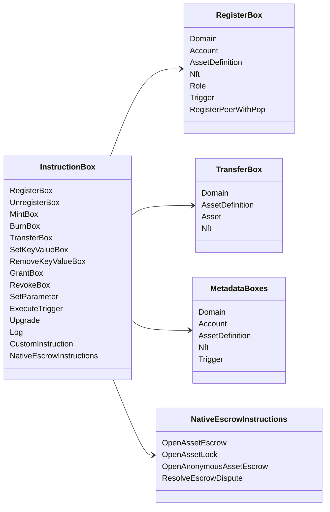

# Iroha Специальные инструкции {#iroha-special-instructions}

Нынешняя модель данных раскрывает эти встроенные семейства инструкций:

|Инструкция |Варианты |
| --- | --- |
| [`RegisterBox`](/ru/blockchain/instructions.md#un-register) | `Domain`, `Account`, `AssetDefinition`, `Nft`, `Role`, `Trigger`, `RegisterPeerWithPop` |
| [`UnregisterBox`](/ru/blockchain/instructions.md#un-register) | `Peer`, `Domain`, `Account`, `AssetDefinition`, `Nft`, `Role`, `Trigger` |
| [`MintBox`](/ru/blockchain/instructions.md#mint-burn) |цифровая `Asset`, запускает повторения |
| [`BurnBox`](/ru/blockchain/instructions.md#mint-burn) |цифровая `Asset`, запускает повторения |
| [`TransferBox`](/ru/blockchain/instructions.md#transfer) |`Domain`, `AssetDefinition`, цифры `Asset`, `Nft` |
| [`SetKeyValueBox`](/ru/blockchain/instructions.md#setkeyvalue-removekeyvalue) | `Domain`, `Account`, `AssetDefinition`, `Nft`, `Trigger` метаданные |
| [`RemoveKeyValueBox`](/ru/blockchain/instructions.md#setkeyvalue-removekeyvalue) | `Domain`, `Account`, `AssetDefinition`, `Nft`, `Trigger` метаданные |
| [`GrantBox`](/ru/blockchain/instructions.md#grant-revoke) |разрешение на учет, роль на учет.|
| [`RevokeBox`](/ru/blockchain/instructions.md#grant-revoke) |разрешение на учетную запись, роль на счет, разрешение на роль |
| [`SetParameter`](/ru/blockchain/instructions.md#setparameter) |обновление параметров цепочки |
| [`ExecuteTrigger`](/ru/blockchain/instructions.md#executetrigger) |запустить исполнение |
| [`Upgrade`](/ru/blockchain/instructions.md#other-instructions) |обновление исполнителя |
| [`Log`](/ru/blockchain/instructions.md#other-instructions) |запись в журнале исполнителя |
| [`CustomInstruction`](/ru/blockchain/instructions.md#other-instructions) |Исполнитель-специфическая полезная нагрузка JSON |
| [Конфиденциальность активов ](/ru/blockchain/escrow.md) | `OpenAssetEscrow`, `AcceptAssetEscrow`, `MarkEscrowPaymentSent`, `ReleaseAssetEscrow`, `CancelAssetEscrow`, `OpenEscrowDispute`, `ResolveEscrowDispute` |
| [Общие блоки активов](/ru/blockchain/escrow.md#generic-asset-locks) |`OpenAssetLock`, `DrawdownAssetLock`, `CancelAssetLock`, `ExpireAssetLock` |
| [Anonymous asset escrow](/ru/blockchain/escrow.md#anonymous-escrow) | `OpenAnonymousAssetEscrow`, `AcceptAnonymousAssetEscrow`, `MarkAnonymousEscrowPaymentSent`, `ReleaseAnonymousAssetEscrow`, `CancelAnonymousAssetEscrow`, `OpenAnonymousEscrowDispute`, `ResolveAnonymousEscrowDispute` |

Дополнительные модули Iroha 3 могут регистрировать типы инструкций для конкретного домена через реестр инструкций. Для списка уровня схемы, созданного из текущего источника дерева, см. [Схема модели данных](./data-model-schema.md).

::: details Диаграмма: Основные семейные инструкции

:::
