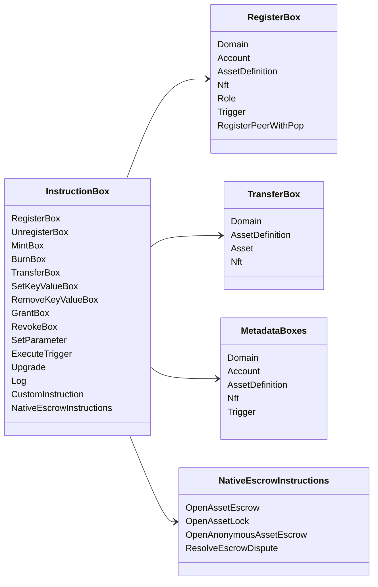

# Iroha Инструкционные операции {#iroha-special-instructions}

Текущая модель данных предоставляет эти встроенные семейства инструкций:

|Инструкция|Варианты|
| --- | --- |
| [`RegisterBox`](/ru/blockchain/instructions.md#un-register) |`Domain`, `Account`, `AssetDefinition`, `Nft`, `Role`, `Trigger`, `RegisterPeerWithPop`|
| [`UnregisterBox`](/ru/blockchain/instructions.md#un-register) | `Peer`, `Domain`, `Account`, `AssetDefinition`, `Nft`, `Role`, `Trigger` |
| [`MintBox`](/ru/blockchain/instructions.md#mint-burn) |числовой `Asset`, повторение триггеров|
| [`BurnBox`](/ru/blockchain/instructions.md#mint-burn) |числовой `Asset`, повторения триггера|
| [`TransferBox`](/ru/blockchain/instructions.md#transfer) | `Domain`, `AssetDefinition`, числовой `Asset`, `Nft` |
| [`SetKeyValueBox`](/ru/blockchain/instructions.md#setkeyvalue-removekeyvalue) | `Domain`, `Account`, `AssetDefinition`, `Nft`, `Trigger` метаданные |
| [`RemoveKeyValueBox`](/ru/blockchain/instructions.md#setkeyvalue-removekeyvalue) | `Domain`, `Account`, `AssetDefinition`, `Nft`, `Trigger` метаданные |
| [`GrantBox`](/ru/blockchain/instructions.md#grant-revoke) | `Permission` (`Grant<Permission, Account>`), `Role` (`Grant<RoleId, Account>`), `RolePermission` (`Grant<Permission, Role>`) |
| [`RevokeBox`](/ru/blockchain/instructions.md#grant-revoke) | `Permission` (`Revoke<Permission, Account>`), `Role` (`Revoke<RoleId, Account>`), `RolePermission` (`Revoke<Permission, Role>`) |
| [`SetParameter`](/ru/blockchain/instructions.md#setparameter) |обновление параметра цепочки|
| [`ExecuteTrigger`](/ru/blockchain/instructions.md#executetrigger) |вызвать выполнение|
| [`Upgrade`](/ru/blockchain/instructions.md#other-instructions) |обновление исполнителя|
| [`Log`](/ru/blockchain/instructions.md#other-instructions) |запись журнала исполнителя|
| [`CustomInstruction`](/ru/blockchain/instructions.md#other-instructions) |исполнитель-специфическая JSON полезная нагрузка|
| [Эскроу нативного актива](/ru/blockchain/escrow.md) | `OpenAssetEscrow`, `AcceptAssetEscrow`, `MarkEscrowPaymentSent`, `ReleaseAssetEscrow`, `CancelAssetEscrow`, `OpenEscrowDispute`, `ResolveEscrowDispute` |
| [Общие блокировки активов](/ru/blockchain/escrow.md#generic-asset-locks) | `OpenAssetLock`, `DrawdownAssetLock`, `CancelAssetLock`, `ExpireAssetLock` |
| [Анонимный эскроу для активов](/ru/blockchain/escrow.md#anonymous-escrow) | `OpenAnonymousAssetEscrow`, `AcceptAnonymousAssetEscrow`, `MarkAnonymousEscrowPaymentSent`, `ReleaseAnonymousAssetEscrow`, `CancelAnonymousAssetEscrow`, `OpenAnonymousEscrowDispute`, `ResolveAnonymousEscrowDispute` |
| [Атомарное частное финансовое урегулирование транзакций](/ru/blockchain/instructions.md#atomic-private-settlement) | `ActivatePrivateSettlementPoolV1`, `RotatePrivateSettlementPoolPolicyV1`, `FinalizeAtomicPrivateSettlementV1`, `AbortAtomicPrivateSettlementV1` |

Дополнительные модули Iroha 3 могут регистрировать типы инструкций, специфичные для домена, через реестр инструкций. Для схемы с авторитетным узлом и команды, которая ее захватывает, смотрите [Схема модели данных](./data-model-schema.md).

::: details Диаграмма: Основные семейства команд

:::
