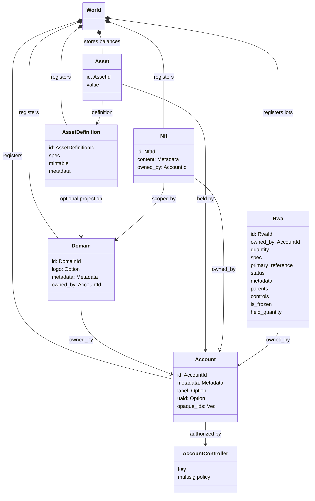
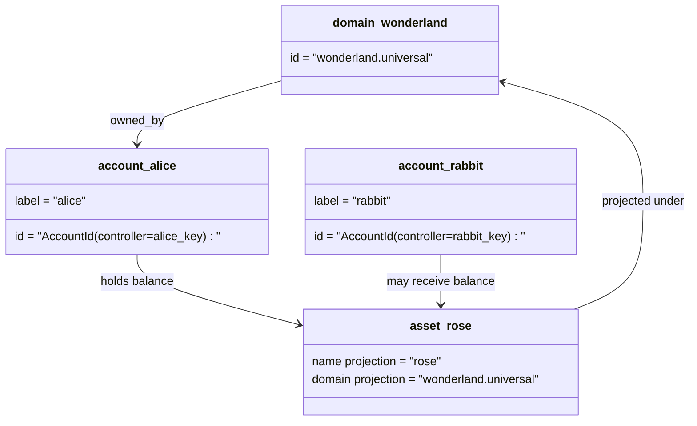

# ڈیٹا ماڈل {#data-model}

Iroha `World` میں لیجر کی حالت کو ذخیرہ کرتا ہے۔ اس کا پہلا ریلیز ڈیٹا ماڈل مندرجہ ذیل کینونیکل شناختوں اور اداروں کا استعمال کرتا ہے:

- ڈومینز ڈیٹا اسپیس کے اہل ہیں، مثال کے طور پر `payments.universal`
- اکاؤنٹس کینیکل اور ڈومین کے بغیر ہیں۔ اکاؤنٹ ID اکاؤنٹ کنٹرولر سے اخذ کیا جاتا ہے۔
- اثاثہ کی تعریفیں ڈومین / نام پروجیکشن کو برقرار رکھ سکتی ہیں ، لیکن ان کا کینونیکل ٹیکسٹ ایڈریس ایک غیر شفاف بیس 58 شناخت کنندہ ہے۔
- اثاثے ایک مخصوص اثاثہ کی تعریف کے لئے اکاؤنٹس میں رکھے گئے بیلنس ہیں
- NFTs ڈومین کوالیفائیڈ IDs اور میٹا ڈیٹا مواد کے ساتھ منفرد ملکیت ریکارڈز ہیں.
- RWAs پیدا ہوتے ہیں- ID اسٹیٹس جو موجودہ مالک ، مقدار ، اصل ، میٹا ڈیٹا ، ہولڈ ، منجمد اور لائف سائیکل کنٹرول کے ساتھ آف چین اثاثے کی نمائندگی کرتے ہیں۔

## مثال {#example}

ایک میں Iroha 3 نیٹ ورک، `wonderland.universal` کے اندر ایک ڈومین ہے `universal` ڈیٹا اسپیس. اس مثال میں کینونیکل اکاؤنٹس ان کی چابیاں یا پالیسیوں کی طرف سے کنٹرول کر رہے ہیں اور ڈومینلیس کے طور پر کوڈ I105 اکاؤنٹ IDs. پڑھنے کے قابل لیبل جیسے: `alice@wonderland.universal` ان سے منسلک علیحدہ عرفات ہیں IDs. ایک متوقع اثاثہ کی تعریف اب بھی ڈومین اور نام سے تعمیر کیا جا سکتا ہے جیسے `rose` میں `wonderland.universal`, جبکہ ترسیل کے دوران استعمال ہونے والے کینونیکل اثاثہ تعریف ایڈریس پیدا شدہ بیس 58 ایڈریس ہے.

## مستعار نام {#aliases}

عرفات انسانی چہرے کے نام ہیں جو کینونیکل لیجر شناخت کنندگان پر پرت ہیں۔ وہ API ، CLI ، پرس ، اور ایکسپلورر کی حدود میں مفید ہیں ، لیکن کینونیکل IDs سخت لیجر فیلڈز میں ذخیرہ کردہ مستحکم شناختی طور پر باقی رہتے ہیں۔

|ہدف |کینونیکل ہدف |لفظی عرفان |معاون ماڈل |
| -------------- | --------------------------------------------------- | ------------------------------------------------------ | ----------------------------------------------------------------------------- |
|صارف کا اکاؤنٹ |I105 ایڈریس کے طور پر کوڈڈ ڈومینلیس `AccountId` |`name@domain.dataspace` یا `name@dataspace` |`AccountAlias`؛ بنیادی عرفی نام `Account.label` ہے، اضافی عرفی نام پابندیاں ہیں |
|اثاثہ جات کی تعریف |`AssetDefinitionId` Base58 ایڈریس |`name#domain.dataspace` یا `name#dataspace` |`AssetDefinitionAlias` ایک اثاثہ کی تعریف سے منسلک |
|معاہدہ |canonical Bech32m `ContractAddress` |`name::domain.dataspace` یا `name::dataspace` |`ContractAlias` ایک تعینات معاہدہ ایڈریس سے منسلک |
|ڈومین کا نام |`DomainId` فارم میں `domain.dataspace` |`domain.dataspace` |SNS `domain` ناموں کی جگہ ریکارڈ |
|ڈیٹا بیس کا نام |فعال Nexus کیٹلاگ میں سے عددی `DataSpaceId` |`universal`، `paynet`، یا `zk` جیسے ڈیٹا اسپیس عرفات |SNS `dataspace` ناموں کی جگہ کا ریکارڈ پلس فعال ڈیٹا اسپیس کیٹلاگ |

اکاؤنٹ عرفی نام صارف کے سامنے اکاؤنٹس کے نام ہیں۔ وہ اکاؤنٹ ریکیائنگ سے زندہ رہتے ہیں کیونکہ عرفی نام عالمی حالت انڈیکس اور اکاؤنٹ ریکی ریکارڈز کے ذریعہ فعال اکاؤنٹ ID پر اشارہ کرتا ہے۔ اکاؤنٹ کے بنیادی لیبل کے لئے `SetPrimaryAccountAlias` کا استعمال کریں، `SetAccountAliasBinding` اضافی غیر بنیادی ناموں کے لئے، اور `FindAccountByAlias` یا `FindAliasesByAccountId` پڑھنے کے لئے۔ اکاؤنٹ کے ناموں کو عام طور پر ایک فعال SNS اکاؤنٹ کے نام لیز کی ضرورت ہوتی ہے جو `AcquireAccountAliasLease` سے حاصل کیا جاتا ہے اور `RenewAccountAliasLease` کے ساتھ تجدید کیا جاتا ہے۔

اثاثہ عرفات نام کے اثاثوں کی تعریفیں ہیں، انفرادی اکاؤنٹ بیلنس نہیں. اثاثے اور معاہدے کے عرفات ایک پڑھنے کے قابل نام سے موجودہ کینونیکل ہدف پر براہ راست پابندیاں ہیں۔ اثاثہ ناموں کو `SetAssetDefinitionAlias` کے ساتھ مقرر کیا جاتا ہے؛ مستعار نام کا سیگمنٹ اثاثے کی تعریف ڈسپلے نام یا متوقع تعریف نام سے ملنا چاہئے۔ معاہدے کے مستعار `SetContractAlias` کے ساتھ مقرر کیے جاتے ہیں؛ مستعار ڈیٹا اسپیس کو معاہدہ ایڈریس میں کوڈ کردہ ڈیٹا اسپیس سے ملنا ضروری ہے۔ دونوں پابندیاں `lease_expiry_ms` لے سکتے ہیں؛ ختم ہونے کے بعد وہ فضل ونڈو گزرنے پر حل کرنا بند کردیں اور عالمی حالت انڈیکس سے مٹا دیں.

ڈومینز میں علیحدہ ڈومین نہیں ہے `DomainAlias` ایک ڈومین شناخت کنندہ پہلے سے ہی ڈیٹا اسپیس کے لئے اہل نام ہے جیسے: `payments.universal`. SNS ڈومین ناموں کے لئے لیز ملکیت کا سراغ لگانا `domain` ناموں کی جگہ اور اعداد و شمار کی جگہ کے لئے `dataspace` ناموں کی جگہ. محفوظ شدہ `universal` ڈیٹا اسپیس عرفات کی وضاحت باقی رہنی چاہئے۔

## متعلقہ دستاویزات {#related-docs}

|موضوع |کہاں جانا ہے |
| -------------------------------------- | ------------------------------------------- |
|ڈومینز | [ڈومینز](/ur/blockchain/domains.md) |
|اکاؤنٹس | [اکاؤنٹس](/ur/blockchain/accounts.md) |
|اثاثے | [اثاثہ جات](/ur/blockchain/assets.md) |
|NFTs | [NFTs](/ur/blockchain/nfts.md) |
|حقیقی دنیا کے اثاثے | [حقیقی دنیا کے اثاثے](/ur/blockchain/rwas.md) |
|میٹا ڈیٹا | [میٹا ڈیٹا](/ur/blockchain/metadata.md) |
|رجسٹریشن اور منتقلی کی ہدایات | [ہدایات](/ur/blockchain/instructions.md) |
|رن ٹائم کی اجازت | [اجازت نامے](/ur/blockchain/permissions.md)|
|ناموں کے ضابطے | [نامزدگی کے قواعد](/ur/reference/naming.md) |
