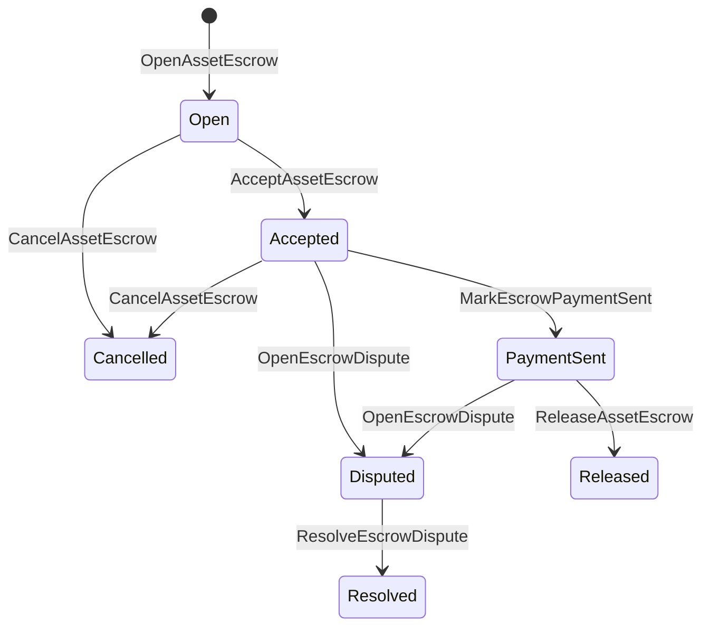

# مقامی اثاثہ جات کا حصول {#native-asset-escrow}

Native escrow اعداد و شمار کے اثاثوں کے لئے ایک لیجر کے زیر انتظام ذخیرہ کرنے کا طریقہ کار ہے۔ درخواست کے مالک اکاؤنٹ میں اثاثے بھیجنے اور اس اکاؤنٹ کی حفاظت کے ل application درخواست کوڈ پر انحصار کرنے کے بجائے ، ایسکرو ISIs قدر کو ایک تعیناتی پروٹوکول کی نگہداشت کے اکاؤنٹ میں منتقل کریں اور عالمی حالت میں ایسکرو زندگی کا دور ریکارڈ کریں۔

مارکیٹ پلیس تصفیہ کے لئے مقامی ایسکرو کا استعمال کریں ، آٹائی طرز کی آف چین ادائیگی کوآرڈینیشن ، سنگ میل تالے ، اور حفاظتی ایسکرو ورک فلوز جو لیجر کے قابل زندگی سائیکل کی حالت کی ضرورت ہے۔

## تصورات {#concepts}

|تصور |تفصیل |
| --- | --- |
|`EscrowId` |کال کرنے والے کی طرف سے منتخب کردہ شناخت کنندہ ایک ہیش لفافے. یہ شفاف اور گمنام escrow کے درمیان منفرد ہونا ضروری ہے. |
|`AssetEscrowRecord` |شفاف عددی اثاثوں کی حراست یا لاک ریکارڈ۔ |
|`AnonymousAssetEscrowRecord` |گارنٹی شدہ کریڈٹ ریکارڈ، منسوخ کرنے والوں، عہدوں اور ثبوت کے attachments کی طرف سے حمایت. |
|نگہداشت اکاؤنٹ |ڈیٹرمینسٹ پروٹوکول اکاؤنٹ جو چین ID ، ایسرو ID، اور اثاثہ کی تعریف سے اخذ کیا گیا ہے۔ |
|شواہد ہیش |ثبوت ہیش بلوں ، فیصلوں ، پیغامات ، اسٹوریج مینی فیسٹ ، یا دیگر غیر زنجیروں کے شواہد کی نشاندہی کرسکتے ہیں۔ ثبوت کا بوجھ خود ایسکرو ریکارڈ میں محفوظ نہیں ہے۔ |

شفاف ریکارڈوں میں بیچنے والے، اختیاری خریدار، اثاثہ کی تعریف، مجموعی رقم، حراستی اکاؤنٹ، لائف سائیکل کی حیثیت، طرز عمل کی قسم، باقی رقم، اختیری ریلیز اتھارٹی، اختیاري ختم ہونے کا ٹائم اسٹیمپ، ثبوت ہیش، ٹائم سٹیمپ، اور اختیاری حل کی تفصیلات شامل ہیں۔

ایسکرو کی رقم مثبت عددی اثاثہ کی مقدار ہونی چاہئے اور اثاثے کی تعریف کی عددی وضاحت سے ملنا چاہئے۔ جب کہ ایک ایسکرو یا لاک فعال ہے ، عام اثاثوں کی منتقلی حراستی اکاؤنٹ کو ختم نہیں کرسکتی ہے۔ حراستی سے نکلنے کے راستے مندرجہ ذیل میں بیان کردہ ایسکرو ISIs ہیں۔

## مارکیٹ پلیس ایایسکرو {#marketplace-escrow}

مارکیٹ پلیس ایسکرو ایک آن چین اثاثہ ریلیز کو آف چین ادائیگی یا ترسیل ورک فلو کے ساتھ ہم آہنگ کرتا ہے۔



|ISI |جو اسے پیش کرتا ہے |اثر |
| --- | --- | --- |
|`OpenAssetEscrow` |بیچنے والا |بیچنے والے کے عددی اثاثے کو پروٹوکول کی تحویل میں بند کر دیتا ہے اور `Open` مارکیٹ پلیس ریکارڈ بناتا ہے۔ |
|`AcceptAssetEscrow` |خریدار |خریدار کو ریکارڈ کرتا ہے اور `Open` کو `Accepted` میں منتقل کر دیتا ہے۔ بیچنے والا اپنا اپنا گرو قبول نہیں کرسکتا۔ |
|`MarkEscrowPaymentSent` |قبول شدہ خریدار |خریدار آف چین ادائیگی بھیجنے کے بعد `Accepted` کو `PaymentSent` میں منتقل کرتا ہے۔ |
|`ReleaseAssetEscrow` |بیچنے والا |`PaymentSent` کو `Released` میں منتقل کرتا ہے اور خریدار کو پوری رقم منتقل کر دیتا ہے۔ |
|`CancelAssetEscrow` |بیچنے والا |`Open` یا `Accepted` کو `Cancelled` میں منتقل کرتا ہے اور ادائیگی سے پہلے بیچنے والے کی رقم واپس کر دیتا ہے۔ |
|`OpenEscrowDispute` |بیچنے والا یا قبول شدہ خریدار |`Accepted` یا `PaymentSent` کو `Disputed` میں منتقل کرتا ہے اور ثبوت ہیشز شامل کرتا ہے۔ |
|`ResolveEscrowDispute` |`CanResolveEscrowDispute` کے ساتھ اکاؤنٹ|`Disputed` کو `Resolved` میں منتقل کرتا ہے اور خریدار اور بیچنے والے کے درمیان رقم بانٹتا ہے۔ |

تنازعے کے حل کی رقوم غیر منفی ہونی چاہئیں، اور `buyer_amount + seller_amount` ایایسکرو کی رقم کے برابر ہونا چاہیے۔ صفر قدر والے حصے جائز ہیں، لیکن پوری تقسیم کو مقفل بیلنس کا حساب دینا ہوگا۔

### Rust مثال {#rust-example}

اس مثال میں یہ فرض کیا جاتا ہے کہ بیچنے والے اور خریدار کے اکاؤنٹس پہلے ہی موجود ہیں، اثاثہ کی تعریف عددی طور پر رجسٹرڈ ہے، اور بیچنے والے کے پاس کافی بیلنس ہے۔

```rust
use iroha::{
    client::Client,
    data_model::{
        isi::escrow::{
            AcceptAssetEscrow, MarkEscrowPaymentSent, OpenAssetEscrow,
            ReleaseAssetEscrow,
        },
        prelude::*,
    },
};
use iroha_crypto::Hash;

fn release_marketplace_escrow(
    seller_client: &Client,
    buyer_client: &Client,
    asset_definition_id: AssetDefinitionId,
) -> eyre::Result<()> {
    let escrow_id = EscrowId::new(Hash::new("docs-marketplace-escrow-001"));

    seller_client.submit_blocking(OpenAssetEscrow::with_evidence_hashes(
        escrow_id,
        asset_definition_id,
        Numeric::from(40_u64),
        vec![Hash::new("invoice:2026-001")],
    ))?;

    buyer_client.submit_blocking(AcceptAssetEscrow::new(escrow_id))?;
    buyer_client.submit_blocking(MarkEscrowPaymentSent::new(escrow_id))?;
    seller_client.submit_blocking(ReleaseAssetEscrow::new(escrow_id))?;

    let record = seller_client.query_single(FindAssetEscrowById::new(escrow_id))?;
    assert_eq!(record.status, AssetEscrowStatus::Released);
    assert_eq!(record.remaining_amount, Numeric::zero());

    Ok(())
}
```

## عام اثاثوں کے تالے {#generic-asset-locks}

اثاثوں کے تالے ایک ہی ذخیرہ اندوزی ریکارڈ کی قسم کا استعمال کرتے ہیں ، لیکن یہ خریدار بیچنے والے کی پیش کش نہیں ہیں۔ وہ منزل مقصود اکاؤنٹ کے لئے فنڈز کو لاک کرتے ہیں اور اختیاری طور پر فنڈز نکالنے کے ل a علیحدہ جاری کرنے والی اتھارٹی کی ضرورت ہے۔

|ISI |جو اسے پیش کرتا ہے |اثر |
| --- | --- | --- |
|`OpenAssetLock` |ماخذ اکاؤنٹ |ایک مثبت رقم بند کر دیتا ہے، منزل مقصود کو ریکارڈ خریدار کے طور پر ریکارڈ کرتا ہے، اور `Locked` کی حیثیت مقرر کرتا ہے. |
|`DrawdownAssetLock` |ریلیز اتھارٹی، یا منزل مقصود جب کوئی ریلیز اختیار مقرر نہیں ہوتا |باقی رہ جانے والی تحویل کا حصہ یا مکمل طور پر منزل مقصود کی طرف منتقل کرنا۔ |
|`CancelAssetLock` |لاک اوپنر |ایک فعال لاک کو منسوخ کرتا ہے اور باقی رقم کھولنے والے کو واپس کردیتا ہے۔ |
|`ExpireAssetLock` |کسی بھی ٹرانزیکشن اتھارٹی کی آخری تاریخ کے بعد |ماضی میں `expires_at_ms` کے ساتھ ایک تالا ختم ہوتا ہے اور باقی رقم کھولنے والے کو واپس کردی جاتی ہے۔ |

`DrawdownAssetLock` `Locked` میں ریکارڈ رکھتا ہے جبکہ کچھ رقم باقی رہتی ہے۔ جب باقی رقم صفر تک پہنچ جاتی ہے تو ، اسٹیٹس `DrawnDown` بن جاتا ہے اور ریکارڈ بند ہوجاتا ہے۔

```rust
use iroha::{
    client::Client,
    data_model::{
        isi::escrow::{CancelAssetLock, DrawdownAssetLock, ExpireAssetLock, OpenAssetLock},
        prelude::*,
    },
};
use iroha_crypto::Hash;

fn drawdown_and_close_asset_locks(
    opener_client: &Client,
    destination_client: &Client,
    release_authority_client: &Client,
    asset_definition_id: AssetDefinitionId,
    destination: AccountId,
    release_authority: AccountId,
) -> eyre::Result<()> {
    let trusted_lock_id = EscrowId::new(Hash::new("docs-asset-lock-trusted"));

    opener_client.submit_blocking(OpenAssetLock::with_options(
        trusted_lock_id,
        asset_definition_id.clone(),
        destination.clone(),
        Numeric::from(40_u64),
        Some(release_authority),
        None,
        vec![Hash::new("milestone-plan-v1")],
    ))?;

    release_authority_client.submit_blocking(DrawdownAssetLock::new(
        trusted_lock_id,
        Numeric::from(15_u64),
    ))?;

    let partially_drawn =
        opener_client.query_single(FindAssetEscrowById::new(trusted_lock_id))?;
    assert_eq!(partially_drawn.status, AssetEscrowStatus::Locked);
    assert_eq!(partially_drawn.remaining_amount, Numeric::from(25_u64));

    opener_client.submit_blocking(CancelAssetLock::new(trusted_lock_id))?;
    let cancelled = opener_client.query_single(FindAssetEscrowById::new(trusted_lock_id))?;
    assert_eq!(cancelled.status, AssetEscrowStatus::Cancelled);

    let expiring_lock_id = EscrowId::new(Hash::new("docs-asset-lock-expiring"));
    opener_client.submit_blocking(OpenAssetLock::with_options(
        expiring_lock_id,
        asset_definition_id,
        destination,
        Numeric::from(10_u64),
        None,
        Some(0),
        Vec::new(),
    ))?;

    destination_client.submit_blocking(ExpireAssetLock::new(expiring_lock_id))?;
    let expired = opener_client.query_single(FindAssetEscrowById::new(expiring_lock_id))?;
    assert_eq!(expired.status, AssetEscrowStatus::Expired);

    Ok(())
}
```

Python فی الحال عام قفلوں کے لئے اعلی سطح کے معاونین کو بے نقاب کرتا ہے: `open_asset_lock`, `drawdown_asset_lock`, `cancel_asset_lock`, اور `expire_asset_lock`. مارکیٹ پلیس کے لئے اور گمنام ایسکرو سے Python, استعمال کنونیکل `InstructionBox` JSON کے ذریعے SDK میں ہوں JSON escape hatch، یا ایک کے ذریعے پیش SDK جو پہلی قسم کے ایسکرو بلڈرز کو بے نقاب کرتا ہے۔

## تنازعات {#disputes}

ایک مارکیٹ پلیس ایسرو `Accepted` یا `PaymentSent` سے تنازعہ درج کرسکتا ہے۔ صرف رجسٹرڈ بیچنے والا یا خریدار ہی تنازعے کو کھول سکتا ہے۔ حل کے لئے `CanResolveEscrowDispute` کی ضرورت ہوتی ہے ، یا تو براہ راست ریزولر اکاؤنٹ میں دی جاتی ہے یا کسی کردار کے ذریعہ ورثہ حاصل ہوتا ہے۔

```rust
use iroha::{
    client::Client,
    data_model::{
        isi::escrow::{OpenEscrowDispute, ResolveEscrowDispute},
        prelude::*,
    },
};
use iroha_crypto::Hash;
use iroha_executor_data_model::permission::escrow::CanResolveEscrowDispute;

fn resolve_disputed_escrow(
    admin_client: &Client,
    buyer_client: &Client,
    court_client: &Client,
    court: AccountId,
    escrow_id: EscrowId,
) -> eyre::Result<()> {
    admin_client.submit_blocking(Grant::account_permission(
        Permission::from(CanResolveEscrowDispute),
        court,
    ))?;

    buyer_client.submit_blocking(OpenEscrowDispute::with_evidence_hashes(
        escrow_id,
        vec![Hash::new("buyer-payment-receipt")],
    ))?;

    court_client.submit_blocking(ResolveEscrowDispute::with_evidence_hashes(
        escrow_id,
        Numeric::from(30_u64),
        Numeric::from(10_u64),
        vec![Hash::new("court-judgement-001")],
    ))?;

    let record = admin_client.query_single(FindAssetEscrowById::new(escrow_id))?;
    assert_eq!(record.status, AssetEscrowStatus::Resolved);
    assert_eq!(
        record.resolution.as_ref().map(|resolution| resolution.buyer_amount.clone()),
        Some(Numeric::from(30_u64)),
    );

    Ok(())
}
```

## گمنام ایایسکرو {#anonymous-escrow}

گمنام ایسکرو ایک ہی مارکیٹ لائف سائیکل کا استعمال کرتا ہے ، لیکن فنڈنگ اور بند ہونے والے اثاثوں کی نقل و حرکت کو محفوظ کیا جاتا ہے۔ عوامی ریکارڈ اب بھی بیچنے والے ، خریدار ، حیثیت ، ثبوت ہیشز ، ٹائم اسٹیمپ ، اور ثبوت سے منسلک تحریک کے ریکارڈز کو ذخیرہ کرتا ہے۔ حفاظتی نوٹوں کے اندر موجود رقم اور وصول کنندگان کی نمائندگی عہدوں، منسوخ کرنے والے اور ثبوت منسلک سے کی جاتی ہے۔

|شفاف ISI |گمنام ISI |
| --- | --- |
|`OpenAssetEscrow` |`OpenAnonymousAssetEscrow` |
|`AcceptAssetEscrow` |`AcceptAnonymousAssetEscrow` |
|`MarkEscrowPaymentSent` |`MarkAnonymousEscrowPaymentSent` |
|`ReleaseAssetEscrow` |`ReleaseAnonymousAssetEscrow` |
|`CancelAssetEscrow` |`CancelAnonymousAssetEscrow` |
|`OpenEscrowDispute` |`OpenAnonymousEscrowDispute` |
|`ResolveEscrowDispute` |`ResolveAnonymousEscrowDispute` |

بٹوے یا پراور ٹولنگ کو ثبوت منسلک اور عوامی ان پٹ کی تعمیر کرنا چاہئے۔ کھولنے سے ایک ایسرو کا عزم پیدا ہوتا ہے۔ رہائی ، منسوخی ، اور گمنام تنازعہ حل کرنے کے لئے بالکل ایک ایسرو عزم خرچ کرنا ضروری ہے اور کارروائی کے ذریعہ مطلوبہ خریدار ، بیچنے والا ، یا تقسیم شدہ آؤٹ پٹ وعدوں کو تشکیل دینا ہوگا۔

```rust
use iroha::{
    client::Client,
    data_model::{
        isi::escrow::{
            AcceptAnonymousAssetEscrow, MarkAnonymousEscrowPaymentSent,
            OpenAnonymousAssetEscrow,
        },
        prelude::*,
        proof::ProofAttachment,
    },
};
use iroha_crypto::Hash;

fn open_anonymous_escrow(
    seller_client: &Client,
    buyer_client: &Client,
    escrow_id: EscrowId,
    asset_definition_id: AssetDefinitionId,
    funding_nullifiers: Vec<[u8; 32]>,
    escrow_commitment: [u8; 32],
    proof: ProofAttachment,
    root_hint: Option<[u8; 32]>,
) -> eyre::Result<()> {
    seller_client.submit_blocking(OpenAnonymousAssetEscrow::with_evidence_hashes(
        escrow_id,
        asset_definition_id,
        funding_nullifiers,
        escrow_commitment,
        proof,
        root_hint,
        vec![Hash::new("shielded-invoice")],
    ))?;

    buyer_client.submit_blocking(AcceptAnonymousAssetEscrow::new(escrow_id))?;
    buyer_client.submit_blocking(MarkAnonymousEscrowPaymentSent::new(escrow_id))?;

    Ok(())
}
```

بنیادی حفاظتی ٹرانزیکشن ماڈل کے لئے، دیکھیں [گمنام لین دین](/ur/blockchain/anonymous-transactions.md).

## SDK استعمال {#sdk-usage}

ایایسکرو سپورٹ SDKs میں مختلف طور پر بے نقاب ہوتا ہے۔ Rust کے پاس کینونیکل ٹائپڈ ڈیٹا ماڈل ہے۔ Python فی الحال عام اثاثہ لاک ہیلپرز کو بے نقاب کرتا ہے۔ JavaScript اور TypeScript استعمال کرتے ہیں Kotodama ایایسکرو ہوسٹ کالز. Kotlin/JVM اور Swift مارکیٹ پلیس کے لئے ٹائپڈ پے لوڈ بنانے والے اور گمنام ایسکرو فراہم کرتے ہیں.

|SDK |اس سطح کا استعمال کریں |دائرہ کار|
| --- | --- | --- |
| [Rust](#rust-sdk) |`iroha::data_model::isi::escrow` |marketplace escrow، عمومی locks، anonymous escrow، استفسارات اور events۔ |
| [Python](#python-asset-locks) |`Instruction.open_asset_lock` ، `TransactionDraft.open_asset_lock`، اور مؤکل `*_and_wait` کے معاون |عام اثاثوں کے تالے۔ مارکیٹ پلیس اور گمنام ایسکرو ہیلپرز ابھی تک فرسٹ کلاس Python طریقے نہیں ہیں۔ |
| [JavaScript / TypeScript](#javascript-and-typescript-kotodama) |`compileKotodamaProgram` سے `@iroha/iroha-js/kotodama-compiler` |Kotodama معاہدوں کے اندر ایایسکرو میزبان کالز. |
| [Kotlin / JVM](#kotlin-and-jvm) |`InstructionTemplate` کلاسز میں `org.hyperledger.iroha.sdk.core.model.instructions` |مارکیٹ پلیس اور گمنام کریڈٹ کسٹم ہدایات ٹیمپلیٹس. |
| [Swift / iOS](#swift-and-ios) |`NativeEscrowInstructionBuilders` اور `IrohaSDK.build*Escrow*` معاون |مارکیٹ پلیس اور گمنام ایسکرو Norito JSON ہدایات کا استعمال کرتے ہوئے. |

مندرجہ ذیل مثالیں ہدایات کی تعمیر پر توجہ مرکوز کرتی ہیں۔ اکاؤنٹ فنڈنگ، دستخط کے انتظام اور ٹرانزیکشن جمع کرانے میں ہر ایک SDK کے لئے معمول کے بہاؤ کا پیچھا کیا جاتا ہے.

### Rust SDK {#rust-sdk}

استعمال کریں Rust SDK جب آپ کو مکمل مقامی کوریج یا استفسار / واقعہ کی حمایت کی ضرورت ہو۔ مذکورہ بالا مثالوں میں مارکیٹ پلیس ریلیز ، عمومی لاک ڈاؤن ، تنازعات کے حل، اور گمنام escrow کی تعمیر `iroha::data_model::isi::escrow`.

```rust
use iroha::{
    client::Client,
    data_model::{isi::escrow::OpenAssetEscrow, prelude::*},
};
use iroha_crypto::Hash;

fn open_and_read(
    client: &Client,
    asset_definition_id: AssetDefinitionId,
) -> eyre::Result<AssetEscrowRecord> {
    let escrow_id = EscrowId::new(Hash::new("docs-rust-sdk-escrow"));

    client.submit_blocking(OpenAssetEscrow::new(
        escrow_id,
        asset_definition_id,
        Numeric::from(10_u64),
    ))?;

    client.query_single(FindAssetEscrowById::new(escrow_id))
}
```

### Python اثاثہ بندشیں {#python-asset-locks}

Python SDK عام اثاثوں کے تالے کے لئے فرسٹ کلاس ہیلپرز کو بے نقاب کرتا ہے۔ ان کا استعمال سنگ میل کی ادائیگیوں ، ریلیز اتھارٹی کی طرف سے کھینچنے ، کھولنے والے کی طرف سے منسوخی اور ختم ہونے والی رقم کی واپسی کے لئے۔

```python
client.open_asset_lock_and_wait(
    chain_id="dev-chain",
    authority="<source-account-id>",
    private_key_hex="<source-private-key-hex>",
    escrow_id="merchant-lock-001",
    asset_definition_id="<asset-definition-base58>",
    destination="<destination-account-id>",
    amount="2500",
    release_authority="<trusted-release-account-id>",
    expires_at_ms=1_704_000_000_000,
)

client.drawdown_asset_lock_and_wait(
    chain_id="dev-chain",
    authority="<trusted-release-account-id>",
    private_key_hex="<trusted-release-private-key-hex>",
    escrow_id="merchant-lock-001",
    amount="1000",
)

client.expire_asset_lock_and_wait(
    chain_id="dev-chain",
    authority="<any-account-id>",
    private_key_hex="<any-private-key-hex>",
    escrow_id="merchant-lock-001",
)
```

دو پارٹی لاک کے لئے، `release_authority` چھوڑ دیں؛ پھر منزل اکاؤنٹ `drawdown_asset_lock` جمع کروا سکتا ہے.

### JavaScript اور TypeScript Kotodama {#javascript-and-typescript-kotodama}

JavaScript SDK فی الحال براہ راست مقامی ایسرو ٹرانزیکشن بلڈرز کو بے نقاب نہیں کرتا ہے۔ JavaScript یا TypeScript ایپلی کیشنز کے لئے جو Kotodama معاہدوں کو تعینات کرتے ہیں ، Kotodama کمپائلر کے ساتھ ایسرو ہوسٹ کالز مرتب کریں۔

مقامی ایایسکرو ہوسٹ کالز کو صریح رسائی اشارے کی ضرورت ہوتی ہے کیونکہ کمپائلر opaque escrow ISIs کے لئے تنگ رسائی سیٹ حاصل نہیں کرسکتا ہے۔ برآمد شدہ انٹری پوائنٹس پر وائلڈ کارڈ اشارے کا استعمال کریں جو `escrow_*` بلٹ میں کال کرتے ہیں۔

```js
import { compileKotodamaProgram } from "@iroha/iroha-js/kotodama-compiler";

const source = `
seiyaku MarketplaceEscrow {
  meta { abi_version: 1; }

  #[access(read="*", write="*")]
  kotoage fn run() permission(Admin) {
    let asset = asset_definition("62Fk4FPcMuLvW5QjDGNF2a4jAmjM");
    let offer = name("aitai_offer");
    let evidence = norito_bytes("00");

    call escrow_open_offer(offer, asset, 10, evidence);
    call escrow_accept(offer);
    call escrow_mark_payment_sent(offer);
    call escrow_release(offer);
  }
}
`;

const compiled = compileKotodamaProgram(source, {
  sourceName: "escrow.ko",
});

if (compiled.diagnostics.length > 0) {
  throw new Error(compiled.diagnostics.map((item) => item.message).join("\n"));
}
```

تنازعات کے لئے، `escrow_open_dispute(offer, evidence)` اور `escrow_resolve_dispute(offer, buyer_amount, seller_amount, evidence)` کا استعمال کریں. گمنام ایسکرو میزبان کالز قبول کرتے ہیں Norito پے لوڈ بائٹس کی درخواست کریں، مثال کے طور پر `anonymous_escrow_open_offer(request)`.

### Kotlin اور JVM {#kotlin-and-jvm}

Kotlin/JVM SDK مقامی ایسکرو کو کسٹم ہدایات کے ٹیمپلیٹس کے طور پر ماڈل کرتا ہے۔ ہر ٹیمپلیٹ مطلوبہ فیلڈز کی توثیق کرتی ہے اور ٹرانزیکشن بلڈر کے ذریعہ استعمال کردہ کینونیکل دلیل کا نقشہ ظاہر کرتی ہے۔

```kotlin
import org.hyperledger.iroha.sdk.core.model.escrow.NativeEscrowPermissions
import org.hyperledger.iroha.sdk.core.model.instructions.AcceptAssetEscrowInstruction
import org.hyperledger.iroha.sdk.core.model.instructions.MarkEscrowPaymentSentInstruction
import org.hyperledger.iroha.sdk.core.model.instructions.OpenAssetEscrowInstruction
import org.hyperledger.iroha.sdk.core.model.instructions.ReleaseAssetEscrowInstruction
import org.hyperledger.iroha.sdk.core.model.instructions.ResolveEscrowDisputeInstruction

val open = OpenAssetEscrowInstruction(
    escrowId = "escrow-hash",
    assetDefinition = "xor#wonderland",
    amount = "42.5",
    evidenceHashes = listOf("invoice-hash"),
)
val accept = AcceptAssetEscrowInstruction("escrow-hash")
val paid = MarkEscrowPaymentSentInstruction("escrow-hash")
val release = ReleaseAssetEscrowInstruction("escrow-hash")
val resolve = ResolveEscrowDisputeInstruction(
    escrowId = "escrow-hash",
    buyerAmount = "30",
    sellerAmount = "12.5",
    evidenceHashes = listOf("judgement-hash"),
)

println(open.arguments)
println(NativeEscrowPermissions.CAN_RESOLVE_ESCROW_DISPUTE)
```

گمنام ٹیمپلیٹس دستیاب ہیں: `OpenAnonymousAssetEscrowInstruction`, `AcceptAnonymousAssetEscrowInstruction`, `MarkAnonymousEscrowPaymentSentInstruction`, `ReleaseAnonymousAssetEscrowInstruction`, `CancelAnonymousAssetEscrowInstruction`, `OpenAnonymousEscrowDisputeInstruction`, اور `ResolveAnonymousEscrowDisputeInstruction`. Android جاوا کال کرنے والے ملاپ استعمال کر سکتے ہیں `NativeEscrowInstructions.*` تعمیر کاروں سے Android آرٹی فیکٹس.

### Swift اور iOS {#swift-and-ios}

Swift SDK ایسکرو ہدایات کو Norito JSON پےلوڈ کے طور پر بناتا ہے۔ براہ راست `NativeEscrowInstructionBuilders` کا استعمال کریں ، یا جب آپ کی ایپ میں پہلے ہی `IrohaSDK` مثال موجود ہو تو مساوی `IrohaSDK.build*Escrow*` معاون کو استعمال کریں۔

```swift
import IrohaSwift

let open = try NativeEscrowInstructionBuilders.openAssetEscrow(
    escrowId: "escrow-hash",
    assetDefinition: "xor#wonderland",
    amount: "42.5",
    evidenceHashes: ["invoice-hash"]
)
let accept = try NativeEscrowInstructionBuilders.acceptAssetEscrow(
    escrowId: "escrow-hash"
)
let paid = try NativeEscrowInstructionBuilders.markEscrowPaymentSent(
    escrowId: "escrow-hash"
)
let release = try NativeEscrowInstructionBuilders.releaseAssetEscrow(
    escrowId: "escrow-hash"
)
let resolve = try NativeEscrowInstructionBuilders.resolveEscrowDispute(
    escrowId: "escrow-hash",
    buyerAmount: "30",
    sellerAmount: "12.5",
    evidenceHashes: ["judgement-hash"]
)
```

گمنام Swift بلڈرز منسوخی کی فہرستیں ، آؤٹ پٹ مصروفیت کی فہرستوں ، ایک ثبوت لغت اور اختیاری `rootHint` اقدار لیتے ہیں۔ تنازعہ حل کرنے کی اجازت کا ٹوکن `NativeEscrowPermissions.canResolveEscrowDispute` کے طور پر دستیاب ہے۔

## استفسارات اور واقعات {#queries-and-events}

اسٹیٹس صفحات، مفاہمت کے کام اور سپورٹ ٹولز کے لیے ایسرو استفسارات کا استعمال کریں:

|استفسار |مقصد |
| --- | --- |
|`FindAssetEscrowById` |`EscrowId` پر ایک شفاف ایسکرو یا لاک پڑھیں۔ |
|`FindAssetEscrows` |شفاف ایسکرو اور لاک ریکارڈ درج کریں۔ |
|`FindAssetEscrowsBySeller` |بیچنے والے یا لاک اوپنر کی طرف سے کھولے گئے ریکارڈ کو درج کریں۔ |
|`FindAssetEscrowsByBuyer` |خریدار کی طرف سے قبول کردہ مارکیٹ پلیس ایسکرورز یا منزل مقصود کو نشانہ بنانے والے قفلوں کی فہرست بنائیں۔ |
|`FindAssetEscrowsByStatus` |`AssetEscrowStatus` کی طرف سے ریکارڈ درج کریں. |
|`FindAnonymousAssetEscrowById` |`EscrowId` کے ذریعے ایک گمنام ضامن پڑھیں۔ |
|`FindAnonymousAssetEscrows*` |تمام records، seller، buyer یا status کے مطابق anonymous escrows کی فہرست بنائیں۔ |

`EscrowEventFilter`، escrow ID، seller، buyer، status اور event-set mask کے مطابق شفاف native escrow اور lock events کو subscribe کر سکتا ہے۔ event family میں `Opened`، `Accepted`، `PaymentSent`، `Released`، `Cancelled`، `Expired`، `Disputed` اور `Resolved` شامل ہیں۔ anonymous escrow records کا معائنہ anonymous escrow استفسارات کے ذریعے کیا جاتا ہے۔

## آپریشنل نوٹس {#operational-notes}

- بڑے انوائسز، چیٹ لاگس، فیصلے یا آڈٹ بنڈل کو ایسکرو ریکارڈ کے باہر ذخیرہ کریں اور ثبوت کے طور پر ان کے ہیشوں کو منسلک کریں۔
- درخواستوں میں مستحکم `EscrowId` مشتق کا استعمال کریں تاکہ دوبارہ کوششیں ایک ہی پیشکش کے لئے دوہرا اثاثہ نہیں بنا سکیں۔
- `CanResolveEscrowDispute` صرف اکاؤنٹس یا رولز کو عطا کریں جو تنازعہ کے عمل کو چلاتے ہیں۔
- ایپلیکیشن پالیسی کے طور پر آف چین ادائیگی کی تصدیق کا علاج کریں۔ Iroha حراستی اور لائف سائیکل میں منتقلی کو ریکارڈ کرتا ہے۔ یہ خود ہی fiat یا بیرونی ادائیگی کے ریلوں کی تصدیق نہیں کرتا ہے۔
