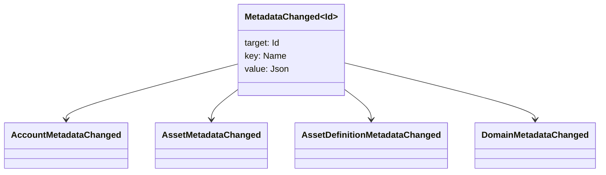

# میٹا ڈیٹا {#metadata}

میٹا ڈیٹا ایک چیک شدہ کلیدی قدر کا نقشہ ہے جو لیجر اشیاء سے منسلک ہے۔ کلیدیں `Name` اقدار ہیں اور اقدار JSON (`Json`) پے لوڈ ہیں۔

مندرجہ ذیل اشیاء میٹا ڈیٹا لے سکتے ہیں:

- علاقہ جات
- اکاؤنٹس
- اثاثے
- اثاثہ جات کی تعریفیں
- NFTs
- RWAs
- ٹرگرز
- لین دین

چھوٹے وضاحتی یا انڈیکسنگ فیلڈز کے لئے میٹا ڈیٹا کا استعمال کریں جو لیجر کی حالت میں شامل ہیں۔ بڑے پے لوڈ کو WSV سے باہر ذخیرہ کیا جانا چاہئے اور ایک ڈائجسٹ ، URI ، یا SoraFS راستے کے ذریعہ حوالہ دیا جانا چاہئے.

میٹا ڈیٹا ، اثاثوں ، NFTs ، RWAs ، یا آف چین اسٹوریج کا انتخاب کرنے کے بارے میں رہنمائی کے ل see ، [میٹا ڈیٹا اور لیجر اسٹوریج کے اختیارات ](/ur/guide/configure/metadata-and-store-assets.md) دیکھیں.

## Taira پر آزمائیں {#try-it-on-taira}

میٹا ڈیٹا معمول کے وسائل کی تلاوتوں کے ذریعے نظر آتا ہے۔ اس کمانڈ میں Taira اثاثہ تعریفیں درج ہیں جن میں فی الحال میٹا ڈیٹا ہے:

```bash
curl -fsS 'https://taira.sora.org/v1/assets/definitions?limit=100' \
  | jq '.items[]
    | select((.metadata | length) > 0)
    | {id, name, metadata}'
```

ڈومینز اور اکاؤنٹس کے لئے ایک ہی پیٹرن کا استعمال کریں:

```bash
curl -fsS 'https://taira.sora.org/v1/domains?limit=20' \
  | jq '.items[] | select((.metadata // {} | length) > 0)'

curl -fsS 'https://taira.sora.org/v1/accounts?limit=20' \
  | jq '.items[] | select((.metadata // {} | length) > 0)'
```

خالی آؤٹ پٹ کو درست نتیجہ سمجھیں۔ اس کا مطلب یہ ہے کہ Taira اشیاء کے موجودہ صفحے میں میٹا ڈیٹا نہیں ہے ، لیکن یہ نہیں ہے کہ اختتامی نقطہ ناکام ہوا۔

## میٹا ڈیٹا کو اپ ڈیٹ کرنا {#updating-metadata}

میٹا ڈیٹا Iroha کے ساتھ تبدیل کیا جاتا ہے خصوصی ہدایات:

- [`SetKeyValue`](/ur/blockchain/instructions.md#setkeyvalue-removekeyvalue) ایک کلید داخل کرتا ہے یا اسے تبدیل کرتا ہے۔
- [`RemoveKeyValue`](/ur/blockchain/instructions.md#setkeyvalue-removekeyvalue) ایک کلید کو ہٹا دیتا ہے

ٹرانزیکشن جمع کرانے والی اتھارٹی کے پاس فعال رن ٹائم ویلیڈیٹر کی ضرورت کی اجازت ہونی چاہئے۔ ڈیفالٹ اجازت سطح کے لئے ، [اجازت ٹوکن](/ur/reference/permissions.md) دیکھیں۔

## واقعات {#events}

اعداد و شمار کے واقعات جب میٹا ڈیٹا تبدیل ہوتے ہیں تو جاری کیے جاتے ہیں۔ عام واقعہ کا پے لوڈ `MetadataChanged<Id>` ہے:



استعمال [ڈیٹا ایونٹ فلٹرز](/ur/blockchain/filters.md#data-event-filters) صرف ایکٹیٹ ٹائپ یا آبجیکٹ کے لئے میٹا ڈیٹا واقعات کی رکنیت ID انضمام کے لئے اہم ہے.

## استفسارات {#queries}

میٹا ڈیٹا مطلوبہ اعتراض کے حصے کے طور پر واپس کیا جاتا ہے۔ مثال کے طور پر ، استعمال کریں [`FindAccountById`](/ur/reference/queries.md#accounts-and-permissions), [`FindDomainById`](/ur/reference/queries.md#domains-and-peers), یا [`FindAssetDefinitionById`](/ur/reference/queries.md#assets-nfts-and-rwas). استعمال [`FindNfts`](/ur/reference/queries.md#assets-nfts-and-rwas) یا [`FindNftsByAccountId`](/ur/reference/queries.md#assets-nfts-and-rwas) کے لئے NFTs, اور [`FindRwas`](/ur/reference/queries.md#assets-nfts-and-rwas) کے لئے RWA بہت کچھ. پھر اعتراض کے میٹا ڈیٹا فیلڈ کو پڑھیں. NFT استفسار کے جوابات سے ظاہر ہوتا ہے NFT `content` نقشہ ریکارڈ میٹا ڈیٹا کے طور پر.

میٹا ڈیٹا چابیاں لیجر کی حالت کا حصہ ہیں ، لہذا انہیں مستحکم رکھیں اور ایپلیکیشن کے مخصوص ورژن کو انکوڈنگ سے بچیں جب JSON قدر اس ورژن کو صریح طور پر لے سکتی ہو۔
