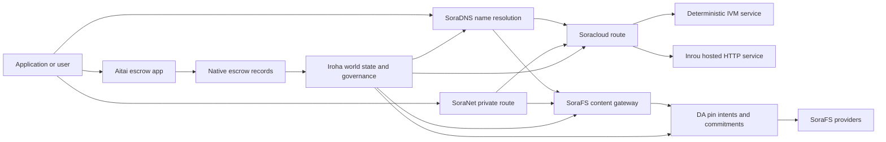

# SORA Nexus خدمات {#sora-nexus-services}

SORA Nexus نے Iroha 3 کے ارد گرد ایپ سے متعلق سروس طیاروں کو شامل کیا ہے۔ یہ خدمات الگ الگ لیجرز نہیں ہیں۔ وہ Iroha دنیا کی حالت ، Norito مینی فیسٹ ، گورننس ریکارڈ اور Torii روٹ فیملیوں کے ذریعہ لنگر ہیں.

دستیابی نوڈ کی تعمیر اور نیٹ ورک پروفائل پر منحصر ہے۔ ہدف نوڈ پر تیار کردہ ایپ-API راستوں کو دریافت کرنے کے لئے [`/openapi.json`](/ur/reference/torii-endpoints.md#app-and-sora-route-families) کا استعمال کریں۔ عوامی مقامی SoraFS CID اور معروف راستوں کو اس تیار کردہ دستاویز کے باہر نصب کیا جاتا ہے، لہذا کسی تعیناتی کی جانچ پڑتال کرتے وقت ان راستوں کا براہ راست معائنہ کریں.

## جزو نقشہ {#component-map}

|اجزاء |کردار |اہم سطحیں |
| ---------------------- | ------------------------------------------------------------------------------------------------------------------------------------------- | ---------------------------------------------------------------------------------------- |
|Soracloud |ایپلی کیشنز کی تعیناتی، میزبان خدمات، نجی ماڈل/رن ٹائم اسٹیٹ، اور سروس لائف سائیکل کنٹرول۔ |`/v1/soracloud/*` ، `/api/*`، `iroha soracloud service ...` |
|Inrou |ان service revisions کے لیے Soracloud کا hosted HTTP runtime جنہیں live HTTP layer درکار ہو۔ |Soracloud runtime config، host capability adverts، replica runtime state |
|SoraNet |سرکٹس، ریلے ٹریفک، VPN، کنیکٹ سیشنز اور سٹریمنگ روٹس کے لئے رازداری اور ٹرانسپورٹ اوورلی۔ |`/v1/connect/*` ، `/v1/vpn/*`، SoraNet راستے کے میٹا ڈیٹا |
|ڈیٹا کی دستیابی (DA) |Nexus لینوں، SoraFS دستاویزات اور ثبوت کے بہاؤ کی طرف سے حوالہ دیا جاتا ہے کہ پے لوڈ کے لئے دستیابی کا ثبوت، مصروفیت، اور پن ارادے پرت. |`/v1/da/*` ، `FindDaPinIntent*`، `[nexus.da]` |
|SoraFS |مینیفیس، CAR پےلوڈز، پنڈ مواد، گیٹ وے کی وصولی، اور ثبوت کی بازیافت کے بہاؤ کے لئے مواد ایڈریس شدہ اسٹوریج ٹیب۔ |`/v1/sorafs/*` ، `/sorafs/*`، `FindSorafsProviderOwner` |
|SoraDNS |SORA کی میزبانی کردہ خدمات اور مواد کے لئے تعیناتی ناموں اور حل کنندہ تصدیق کی پرت۔ |`/v1/soradns/*`، `/soradns/*`، resolver ڈائرکٹری واقعات |
|Aitai |ایپ لیول فائیٹ اور اثاثوں کی تصفیہ کا راہداری مقامی ایایسکرو ریکارڈز کی طرف سے حمایت، ایک علیحدہ دفتر کی طرف سے نہیں. | `OpenAssetEscrow`, `FindAssetEscrow*`, `EscrowEventFilter`, Kotodama `escrow_*` تعمیرات |



## عام بہاؤ {#common-flows}

### ہوسٹڈ اسپلٹ ایپلیکیشن {#hosted-split-application}

ایک عام mixed-layer app تمام حصوں کو ایک ساتھ استعمال کرتی ہے:

1. جامد فرنٹ اینڈ اثاثوں کو پیک کیا جاتا ہے اور SoraFS کے ذریعے منسلک کیا جاتا ہے۔
2. عوامی میزبان، مثال کے طور پر `<app>.sora` ، SoraDNS کے ذریعے رجسٹرڈ ہے.
3. Soracloud راستوں `/api/v1/search` یا `/api/v1/stream` کے لئے ایک Inrou HTTP سروس.
4. Soracloud راستوں `/api/auth` اور `/api/v1/user` deterministic IVM ہینڈلرز کے لئے.
5. صارفین جو رازداری کی ضرورت رکھتے ہیں وہ ایک ہی مواد یا API روٹ کے ذریعے SoraNet سرکٹ تک پہنچ سکتے ہیں۔

|راستہ |معاون لیئر |وجہ |
| ----------------- | --------------------- | ------------------------------------------------- |
| `/`               |SoraFS جامد مواد |بازیافت کے قابل مواد جڑ اور گیٹ وے کیشنگ |
|`/assets/*` |SoraFS جامد مواد |مواد سے منسلک اثاثے اور واضح ثبوت |
|`/api/auth*` |Soracloud IVM |دوبارہ کھیلنے کے لئے محفوظ auth اور پرس چیلنج ریاست |
|`/api/v1/user*` |Soracloud IVM |حکمرانی کے لیے حساس ریاستی تغیرات |
|`/api/v1/search*` |Soracloud Inrou |براہ راست HTTP سروس، کیش، SSE، یا جمع کرنے والی ریاست |

### مواد اشاعت {#content-publication}

SoraFS اشاعت پائیدار آرٹیفیکٹس تیار کرتی ہے اس سے پہلے کہ ایک نام ان کی طرف اشارہ کرے:

1. ایک پے لوڈ یا ڈائرکٹری بنائیں.
2. اسے ایک CAR آرکائیو میں پیک کریں اور ٹکڑا منصوبہ.
3. پن پالیسی اور گورننس ڈیٹا کے ساتھ ایک Norito مینی فیسٹ بنائیں۔
4. Torii پر دستاویز جمع کروائیں۔
5. ایک DA پن ارادے یا دستیابی کا وعدہ ریکارڈ کریں جب ہدف پروفائل واضح ثبوت کی ضرورت ہوتی ہے.
6. مینیفیس کو SoraDNS نام یا Soracloud جامد فرنٹ اینڈ روٹ سے منسلک کریں۔

### نجی نقل و حمل یا سٹریمنگ کا راستہ {#private-fetch-or-streaming-route}

SoraNet کے سامنے بیٹھ سکتا ہے SoraFS یا Soracloud:

1. کلائنٹ نام یا دستاویز کو حل کرتا ہے۔
2. گارڈ ڈائرکٹری یا روٹ مینی فیسٹ داخلہ اور باہر نکلنے کے ریلے کا انتخاب کرتا ہے.
3. ٹریفک بھری ہوئی ہے اور SoraNet سرکٹ کے ذریعے بھیجا جاتا ہے۔
4. باہر نکلنے والا ریلے SoraFS گیٹ وے، Torii سلسلہ، یا Soracloud راستے تک پہنچتا ہے۔

## آٹائی {#aitai}

Aitai SORA مارکیٹ سٹائل کے معاہدے کے لئے ایپ کوریڈور ہے جہاں ایک خریدار اور بیچنے والا آف چین ادائیگی کو مربوط کرتے ہیں جبکہ Iroha کنٹرول کرتا ہے زنجیروں پر اثاثوں کی بحالی. اس کو نئے عددی اثاثوں کے بحالی کے بہاؤ کے لئے معاہدے کے مالک ایکسرو اکاؤنٹ کے بجائے مقامی سپلائی ہدایات کا استعمال کرنا چاہئے۔

Native escrow نے کیبر میں حراست رکھی ہے۔ بیچنے والا `OpenAssetEscrow` کے ساتھ ایک پیشکش کھولتا ہے، خریدار `AcceptAssetEscrow` اور `MarkEscrowPaymentSent` کے ساتھ آف چین ادائیگی کو قبول کرتا ہے اور نشان لگا دیتا ہے، اور بیچنے والے `ReleaseAssetEscrow` کے ساتھ جاری کرتا ہے یا ادائیگی کو نشان زد کرنے سے پہلے منسوخ کرتا ہے۔ اگر خریدار اور بیچنے والا متفق نہیں ہیں تو ، دونوں فریقین تنازعہ کھول سکتے ہیں اور `CanResolveEscrowDispute` کے ساتھ حل کنندہ مقفل رقم بانٹ سکتا ہے۔

مکمل زندگی سائیکل، عام اثاثوں کے تالے، گمنام ایسکرو، استفسارات، واقعات، اور Rust کی مثالوں کے لئے، دیکھیں [مقامی اثاثہ ایایسکرو ](/ur/blockchain/escrow.md).

|Aitai سطح |اسے استعمال کریں |
| ------------------------------------------------------------------------------------------------------------------------------------------------------------- | ----------------------------------------------------------------------------------------- |
| `OpenAssetEscrow`, `AcceptAssetEscrow`, `MarkEscrowPaymentSent`, `ReleaseAssetEscrow`, `CancelAssetEscrow`                                                    |شفاف عددی اثاثوں کی پیشکشیں ، بشمول XOR کے نامی تصفیہ کے بہاؤ۔ |
| `OpenAnonymousAssetEscrow`, `AcceptAnonymousAssetEscrow`, `MarkAnonymousEscrowPaymentSent`, `ReleaseAnonymousAssetEscrow`, `CancelAnonymousAssetEscrow`       |شیلڈڈ پیشکشیں فنڈنگ اور بندش کی تحریکوں کے لئے ثبوت منسلک استعمال کرتے ہیں. |
|`OpenEscrowDispute` ، `ResolveEscrowDispute`، `OpenAnonymousEscrowDispute`، `ResolveAnonymousEscrowDispute`|تنازعات میں شمولیت اور عدالت کی طرز پر حل۔ |
|`FindAssetEscrowById` ، `FindAssetEscrowsBySeller`، `FindAssetEscrowsByBuyer`، `FindAssetEscrowsByStatus`|ایپ کی حیثیت کے صفحات، مفاہمت کے کام اور سپورٹ ٹولنگ۔ |
|`EscrowEventFilter` |بروکر ID، بیچنے والے، خریدار، حیثیت، یا ایونٹ کی قسم کے ذریعہ شفاف ایسکرو رکنیتیں براہ راست. |
| Kotodama `escrow_open_offer`, `escrow_accept`, `escrow_mark_payment_sent`, `escrow_release`, `escrow_cancel`, `escrow_open_dispute`, `escrow_resolve_dispute` |Kotodama معاہدہ کالز کی حمایت V1 escrow syscalls کے ذریعے کی جاتی ہے۔ |

عوامی Taira یا Minamoto استعمال کے لیے off-chain ادائیگی کے راستے اور کسی بھی معاونتی یا عدالتی عملی بہاؤ کو application policy سمجھیں۔ Iroha تحویل کی حالت، lifecycle events، evidence hashes اور اثاثے کی حتمی منتقلی ریکارڈ کرتا ہے؛ وہ خود fiat تصفیے کی تصدیق نہیں کرتا۔

## ٹارگٹ نوڈ چیک کریں {#check-a-target-node}

اس صفحے سے مثالیں استعمال کرنے سے پہلے ، تصدیق کریں کہ آپ جس نوڈ کو نشانہ بنانا چاہتے ہیں اس پر روٹ فیملی موجود ہے:

```bash
export TORII_URL=https://taira.sora.org

curl -fsS "$TORII_URL/openapi.json" \
  | jq '.paths | keys[] | select(test("^/v1/(soracloud|sorafs|soradns|connect|vpn|da)/"))'

curl -fsS -H 'Accept: application/json' "$TORII_URL/status" | jq .
```

`/openapi.json` کینیکل OpenAPI اختتامی نقطہ ہے۔ روٹ کی عین مطابق دستیابی بلڈ خصوصیات اور نیٹ ورک کی ترتیب پر منحصر ہے۔ دستاویز میں عوامی مقامی SoraFS CID اور معروف راستوں کی فہرست نہیں ہے؛ براہ راست ان اختتامی پوائنٹس کو چیک کریں جیسا کہ ذیل میں بیان کیا گیا ہے۔

### Taira صرف پڑھنے کے لئے سگریٹ چیک {#taira-read-only-smoke-checks}

پبلک Taira اختتامی نقطہ پڑھنے کے ساتھ چیک کرنے کے لئے مفید ہے، لیکن جب تک آپ ایک مجاز اکاؤنٹ چلاتے ہیں اور عوامی ٹیسٹ نیٹ کی حالت کو تبدیل کرنے کا ارادہ رکھتے ہیں تب تک اسے متغیر مثالوں کے لئے استعمال نہ کریں.

```bash
export TORII_URL=https://taira.sora.org

curl -fsS -H 'Accept: application/json' "$TORII_URL/status" \
  | jq '{version: .build.version, peers, blocks, lanes: (.teu_lane_commit | length)}'

curl -fsS "$TORII_URL/v1/vpn/profile" \
  | jq '{available, relay_endpoint, supported_exit_classes}'

curl -fsS "$TORII_URL/v1/sorafs/storage/peers?limit=4" \
  | jq '{gateway_base_url, pin_torii_urls}'

curl -fsS -H 'Accept: application/json' "$TORII_URL/v1/soracloud/status" \
  | jq '.control_plane | {service_count, services: [.services[] | {service_name, current_version}]}'
```

Taira تعیناتی کے مخصوص کنٹرول لیئر کے راستوں کو ظاہر کر سکتا ہے جو OpenAPI راستے کے نقشے میں درج نہیں ہیں۔ `/openapi.json` کو اس میں شامل راستوں کے لیے تیار کردہ معاہدہ سمجھیں، پھر تعیناتی کے مخصوص اور عوامی مقامی SoraFS راستوں کی دستاویز سازی سے پہلے براہ راست ان کی دستیابی جانچیں۔

## Soracloud {#soracloud}

Soracloud، SORA ایپلی کیشن کا کنٹرول لیئر ہے۔ یہ تعیناتی بنڈل، سروس ریویژنز، روٹنگ، رول آؤٹ اسٹیٹ، مجاز ترتیب اندراجات، خفیہ کردہ سروس راز، ماڈل رجسٹری ریکارڈز، نجی inference سیشنز اور رن ٹائم رسیدوں کو ٹریک کرتا ہے۔

Soracloud عمل درآمد کی دو سطحیں استعمال کرتا ہے:

|عمل درآمد کی سطح |رن ٹائم |اسے استعمال کریں |
| ---------------------- | ------- | -------------------------------------------------------------------------------------------- |
|`DeterministicService` |`Ivm` |مصنف، خفیہ خانے کی حالت، تصدیق شدہ پڑھتا ہے، حکم دیا میل باکس ہینڈلرز، گورننس حساس تغیرات |
|`HttpService` |`Inrou` |لائیو HTTP APIs، کریکٹر بھاری کام، کیشے کے ساتھ حمایت یافتہ خدمات، SSE، براؤزر کی مدد سے بہاؤ |

کنٹرول لیئر مستند ہے۔ تعیناتی، اپ گریڈ، رول بیک، ترتیب، راز، ماڈل اور اسٹیٹس کے احکامات Torii کے ذریعے جمع کریں اور پابند عالمی اسٹیٹ پڑھیں؛ یہ کسی الگ مقامی CLI عکس پر منحصر نہیں ہیں۔ عوامی روٹنگ longest-prefix matching پر مبنی ہے، اس لیے ایک رجسٹرڈ host ہوسٹ کردہ HTTP راستوں اور تعیناتی API راستوں کے درمیان ٹریفک تقسیم کر سکتا ہے۔

### اسپلٹ ایپ کو اسٹافلڈ کریں {#scaffold-a-split-app}

اسپلٹ ایپ ٹیمپلیٹ ایک جامد فرنٹ اینڈ پلس ایک میزبان لائیو API اور ایک تعیناتی والٹ / API سروس تخلیق کرتا ہے:

```bash
iroha soracloud app init \
  --template split-app \
  --app-name solswap_indexer \
  --app-version 0.1.0 \
  --public-host solswap-indexer.sora \
  --output-dir ./apps/solswap-indexer

iroha soracloud app plan \
  --manifest ./apps/solswap-indexer/app_manifest.json

iroha soracloud app doctor \
  --manifest ./apps/solswap-indexer/app_manifest.json
```

`plan` روٹ تقسیم ، بچوں کی خدمت کے دستاویزات ، ورک اسپیس اسکرپٹ راستوں اور متوقع فرنٹ اینڈ اشاعت موڈ کو پرنٹ کرتا ہے۔ `doctor` مقامی ریلیز معاہدے کی توثیق کرتا ہے اس سے پہلے کہ آپ Torii میں شامل ہوں۔

### ایپ کی حالت کا تعین اور معائنہ {#deploy-and-inspect-app-state}

ریلیز کی ہر دوبارہ کوشش کے لئے مستقبل میں ایک SoraFS برقرار رکھنے کا دور دوبارہ استعمال کریں۔ چونکہ اسپلٹ ایپ ٹیمپلیٹ میں انرو سروس شامل ہے ، لہذا آن لائن تغیر سے پہلے منتخب کردہ آف لائن فراہم کنندہ اسٹورز میں اس کے عین مطابق آرٹیفیکٹ کو اہل بنائیں:

```bash
export SORACLOUD_TORII_URL=https://<soracloud-enabled-torii>
export SORAFS_RETENTION_EPOCH=<future-unix-seconds>

iroha soracloud app preseed \
  --manifest ./apps/solswap-indexer/app_manifest.json \
  --sorafs-retention-epoch "$SORAFS_RETENTION_EPOCH" \
  --inrou-preseed-target <validator-account,peer-id,absolute-store-path> \
  --inrou-preseed-max-capacity-bytes <bytes> \
  --inrou-preseed-helper /absolute/path/to/sorafs-node \
  --inrou-preseed-helper-sha256 <lowercase-sha256> \
  --receipt-out /absolute/path/to/solswap-inrou-preseed.json

iroha soracloud app release \
  --manifest ./apps/solswap-indexer/app_manifest.json \
  --sorafs-retention-epoch "$SORAFS_RETENTION_EPOCH" \
  --inrou-preseed-receipt /absolute/path/to/solswap-inrou-preseed.json \
  --torii-url "$SORACLOUD_TORII_URL"

iroha soracloud app status \
  --manifest ./apps/solswap-indexer/app_manifest.json \
  --torii-url "$SORACLOUD_TORII_URL"
```

تعیناتی کی پالیسی کے مطابق مطلوبہ ہر فراہم کنندہ اسٹور کے لئے `--inrou-preseed-target` دہرائیں۔ `release` مینی فیسٹ بناتا ہے اور ہم آہنگ کرتا ہے ، ایپ ڈاکٹر چلاتا ہے ، ایک کینیکل پیش کرتا ہے۔ ایپ انفراسٹرکچر کی تبدیلی ، مستند حیثیت کو ہم آہنگ کرتا ہے ، اور اعلان کردہ براہ راست اہداف کی تصدیق کرتا ہے۔ جب ایپ میں انرو آرٹیفیکٹس ہوتے ہیں تو پہلے سے طے شدہ رسید اختیاری نہیں ہوتی ہے۔

پہلے سے ہی تعینات سروس کے لئے، خدمت کی حد تک کمانڈ کا استعمال کریں:

```bash
iroha soracloud service status \
  --service-name solswap_indexer_live \
  --torii-url "$SORACLOUD_TORII_URL"

iroha soracloud service rollback \
  --service-name solswap_indexer_live \
  --target-version 0.1.0 \
  --torii-url "$SORACLOUD_TORII_URL"
```

### خفیہ اور خفیہ مواد {#config-and-secret-material}

Soracloud ترتیب اور خفیہ اندراجات مستند تعیناتی کی حالت کا حصہ ہیں۔ جب مطلوبہ ترتیب یا خفیہ پابندیاں غائب ہوں یا فعال مینی فیسٹوں کے ساتھ مطابقت نہیں رکھتی ہیں تو تعیناتی ، اپ گریڈ اور رول بیک بند ہوجاتے ہیں۔

```bash
iroha soracloud service config-set \
  --service-name solswap_indexer_live \
  --config-name indexer/public_config \
  --value-file ./config/public-config.json \
  --torii-url "$SORACLOUD_TORII_URL"

iroha soracloud service secret-set \
  --service-name solswap_indexer_live \
  --secret-name indexer/api_key \
  --secret-file ./secrets/api-key.envelope.json \
  --torii-url "$SORACLOUD_TORII_URL"
```

CLI کی مدد سے اپنے پروفائل کے ذریعہ مطلوبہ درست شناختی نشانات حاصل کریں:

```bash
iroha soracloud service config-set --help
iroha soracloud service secret-set --help
```

## انرو {#inrou}

Inrou ہوسٹڈ HTTP رن ٹائم ہے جو Soracloud کے ذریعہ استعمال کیا جاتا ہے۔ ایک Iroha نوڈ جس میں ایمبیڈڈڈ Soracloud رن ٹائمز منصوبوں کو Soracloud ریاست میں داخل کیا گیا ہے. مقامی مادیت کا منصوبہ، مختص ہوسٹنگ سروس کی نقلیں لوپ بیک خدمات کے طور پر شروع کرتا ہے، اور رپورٹوں کو دوبارہ مستند ماڈل میں ریپلیکا رن ٹائم ریاست میں.

انرو کا استعمال ایسے کام کے بوجھ کے لئے کریں جن کو براہ راست HTTP سطح کی ضرورت ہو ، جیسے کریکٹر بھاری APIs ، SSE سلسلے ، کیش بیکڈ ہینڈلرز ، یا براؤزر سے معاون خدمات۔

### رن ٹائم کی ضروریات {#runtime-requirements}

- کنٹینر مینی فیسٹ رن ٹائم `Inrou` ہونا چاہئے.
- سروس مینی فیسٹ کے عملدرآمد کی سطح `HttpService` ہونا ضروری ہے.
- `HttpService + Inrou` کو بالکل ایک `PersistentRootLeaseVolume` کی ضرورت ہوتی ہے جو `/` پر نصب ہے۔
- انرو کی نقل شدہ خدمات کو مشترکہ سروس یا خفیہ لیز اسٹوریج کی بھی ضرورت ہوتی ہے جب وہ متغیر مشترکہ حالت برقرار رکھتی ہیں۔
- پروڈکشن ہوسٹنگ نوڈس کو صرف ایک پراکسی کے طور پر کام کرنے کی بجائے حقیقی Inrou صلاحیت کا اشتہار دینا چاہئے۔

### مینی فیسٹ کا حصہ {#manifest-fragment}

ذیل کی مثال دونوں مینی فیسٹس کی ساخت دکھاتی ہے۔ یہ صرف ایک حصہ ہے، مکمل deployment bundle نہیں۔

```jsonc
// container_manifest.json
{
  "schema_version": 1,
  "runtime": { "runtime": "Inrou", "value": null },
  "bundle_path": "/bundles/solswap-indexer.inrou",
  "entrypoint": "/app/bin/launch-indexer.sh",
  "args": [],
  "env": {
    "RUST_LOG": "info",
  },
  "inrou": {
    "schema_version": 1,
    "guest_os": { "guest_os": "DebianSlim", "value": null },
    "guest_images": {
      "x86_64": {
        "kernel_image_path": "/inrou/x86_64/vmlinux",
        "rootfs_image_path": "/inrou/x86_64/rootfs.ext4",
        "initrd_image_path": null,
      },
      "aarch64": {
        "kernel_image_path": "/inrou/aarch64/vmlinux",
        "rootfs_image_path": "/inrou/aarch64/rootfs.ext4",
        "initrd_image_path": null,
      },
    },
  },
  "lifecycle": {
    "start_grace_secs": 60,
    "stop_grace_secs": 30,
    "healthcheck_path": "/api/indexer/v1/health",
  },
}
```

```jsonc
// service_manifest.json
{
  "schema_version": 1,
  "service_name": "solswap_indexer_live",
  "service_version": "0.1.0",
  "execution_plane": { "execution_plane": "HttpService", "value": null },
  "replicas": 2,
  "route": {
    "host": "solswap-indexer.sora",
    "path_prefix": "/api/v1/search",
    "service_port": 8080,
    "visibility": { "visibility": "Public", "value": null },
    "tls_mode": { "tls": "Required", "value": null },
  },
  "lease_volumes": [
    {
      "volume_name": "root_disk",
      "kind": {
        "lease_volume": "PersistentRootLeaseVolume",
        "value": null,
      },
      "storage_class": { "storage_class": "Warm", "value": null },
      "mount_path": "/",
      "max_total_bytes": 8589934592,
    },
    {
      "volume_name": "index_state",
      "kind": { "lease_volume": "ServiceLeaseVolume", "value": null },
      "storage_class": { "storage_class": "Warm", "value": null },
      "mount_path": "/var/lib/solswap-indexer",
      "max_total_bytes": 1073741824,
    },
  ],
}
```

چلانے کے وقت، ہر نصب کرایہ کی مقدار حجم کے نام سے ماخوذ ماحول متغیرات کی طرف سے بے نقاب کیا جاتا ہے:

```text
SORACLOUD_LEASE_VOLUME_ROOT_DISK_DIR
SORACLOUD_LEASE_VOLUME_ROOT_DISK_MOUNT_PATH
SORACLOUD_LEASE_VOLUME_INDEX_STATE_DIR
SORACLOUD_LEASE_VOLUME_INDEX_STATE_MOUNT_PATH
```

## SoraNet {#soranet}

SoraNet رازداری اور ٹرانسپورٹ اوورلی ہے۔ یہ ریلے پر مبنی راستوں کو ٹریفک کے لئے فراہم کرتا ہے جو براہ راست ہدف گیٹ وے یا سروس سے منسلک نہیں ہونا چاہئے۔ ٹرانسپورٹ ڈیزائن میں داخلہ ، درمیانی اور خارجی ریلے رولز ، QUIC نقل و حمل ، شور پر مبنی ہائبرڈ ہینڈ شیک ، صلاحیت کی بات چیت ، ریلے ڈائرکٹری میٹا ڈیٹا ، اور فکسڈ سائز کے پیڈڈ سیل استعمال ہوتے ہیں۔

Nexus تعیناتیوں میں ، SoraNet مواد کی وصولی ، گیٹ وے ٹریفک ، VPN یا کنیکٹ سیشنز ، اور Norito اسٹریمنگ راستوں کو لے سکتا ہے۔ ڈائرکٹری اندراجات ریلے کو نشان زد کرسکتے ہیں جو `norito-stream` کی حمایت کرتے ہیں ، جس سے گاہکوں کو Torii RPC یا سٹریمنگ ٹریفک کے لئے موزوں راستوں کو ترجیح دینے کی اجازت دیتا ہے۔

### سٹریمنگ ترتیب {#streaming-configuration}

Nexus پروفائل اسٹریمنگ روٹس کے لئے SoraNet کی فراہمی کو قابل بناتا ہے:

```toml
[streaming]
feature_bits = 0b11

[streaming.soranet]
enabled = true
exit_multiaddr = "/dns/torii/udp/9443/quic"
padding_budget_ms = 25
access_kind = "authenticated"
provision_spool_dir = "./storage/streaming/soranet_routes"
provision_spool_max_bytes = 0
provision_window_segments = 4
provision_queue_capacity = 256
```

ایسے content routes کے لیے `access_kind = "read-only"` استعمال کریں جنہیں viewer authentication درکار نہیں۔ جب exit relay کو Torii یا کسی hosted service سے bridge کرنے سے پہلے tickets یا viewer identity نافذ کرنی ہو تو `authenticated` استعمال کریں۔

### SoraNet-آگاہ SoraFS لانا {#soranet-aware-sorafs-fetch}

SoraFS لانے والے CLI براؤزر کی توسیع یا SDK اڈاپٹرز کے لئے مقامی پراکسی مینی فیسٹ اور اسپیل SoraNet روٹ میٹا ڈیٹا جاری کرسکتے ہیں۔ آرکیسٹریٹر JSON کو `"emit_browser_manifest": true` کے ساتھ `local_proxy` کی وضاحت کرنی ہوگی ، اور CLI کو `local-quic-proxy` کی حمایت کے ساتھ بنایا جانا چاہئے۔ Taira پر، عوامی ٹیسٹ نیٹ ورک جڑ میں منظور شدہ فراہم کنندہ کیٹلاگ کا معائنہ کریں، پھر اس فراہم کنندہ کے لئے جاری کردہ محفوظ فراہم کنندہ ٹوپل کو بھر دیں:

```bash
export TAIRA_ROOT=https://taira.sora.org
curl -fsS "$TAIRA_ROOT/v1/sorafs/providers?limit=20" | jq '.providers'

: "${TAIRA_SORAFS_PROVIDER_ID:?set the admitted provider ID from Taira discovery}"
: "${TAIRA_SORAFS_GATEWAY_KEY:?set the provider gateway key}"
: "${TAIRA_SORAFS_PROVIDER_URL:?set the advertised provider base URL}"
: "${TAIRA_SORAFS_STREAM_TOKEN_FILE:?set the issued stream-token file}"

cargo run -p sorafs_orchestrator --features=local-quic-proxy --bin=sorafs_cli -- \
  fetch \
  --plan=artifacts/payload_plan.json \
  --manifest-id=<manifest-digest-hex> \
  --orchestrator-config=artifacts/orchestrator.json \
  --provider=name=taira,provider-id="$TAIRA_SORAFS_PROVIDER_ID",gateway-key="$TAIRA_SORAFS_GATEWAY_KEY",base-url="$TAIRA_SORAFS_PROVIDER_URL",stream-token="$(cat "$TAIRA_SORAFS_STREAM_TOKEN_FILE")" \
  --output=artifacts/payload.bin \
  --json-out=artifacts/fetch_summary.json \
  --local-proxy-manifest-out=artifacts/proxy_manifest.json \
  --local-proxy-mode=bridge \
  --local-proxy-norito-spool=storage/streaming/soranet_routes \
  --local-proxy-kaigi-spool=storage/streaming/soranet_routes \
  --local-proxy-kaigi-policy=authenticated \
  --max-peers=2 \
  --retry-budget=4
```

خلاصہ ریکارڈ فراہم کنندہ کی رپورٹیں، ٹکڑے ٹکڑے رسیدیں، مقامی پراکسی میٹا ڈیٹا، اور مؤثر راستے کی ترتیبات کو لانے کے لئے استعمال کیا.

### ریلی حوصلہ افزائی کی تصدیق کنندہ فہرست {#relay-incentive-verifier-roster}

Relay incentive ingestion fail-closed ہے۔ جب `incentives.enable` درست ہو تو `incentives.trusted_verifier_ids` میں کم از کم ایک canonical account ID ہونا ضروری ہے۔ Incentives غیر فعال ہوں تب بھی roster کبھی 64 entries سے زیادہ نہیں ہونا چاہیے۔ Runtime اسے deterministic ordered set کے طور پر محفوظ کرتا ہے اور relay startup کے دوران invalid roster geometry کو مسترد کرتا ہے۔

ہر `RelayBandwidthProofV1` کو مقررہ frame/allocation budget کے تحت decode کیا جاتا ہے اور اسے پورا frame استعمال کرنا ہوتا ہے۔ relay کے کارکردگی accumulator کو lock یا تبدیل کرنے سے پہلے proof کا verifier account ترتیب شدہ roster میں موجود ہونا اور `RelayBandwidthProofV1::verify_signature()` کا کامیاب ہونا ضروری ہے۔ اس لیے غیر معتبر signer یا غلط signature/چھیڑ چھاڑ والا proof کوئی پیمائش شامل نہیں کرتا اور incentive snapshot پیدا نہیں کر سکتا۔

## ڈیٹا کی دستیابی (DA) {#data-availability-da}

DA دنیا کی حالت میں براہ راست رکھنے کے لئے بہت بڑے، رازداری سے حساس یا سروس مخصوص ہونے والے پے لوڈوں کے لئے دستیابی کا ثبوت پرت ہے. اس میں تعیناتی ذمہ داریاں اور بازیافت کے پابندیاں ریکارڈ کی جاتی ہیں تاکہ تصدیق کنندہ، گیٹ وے اور کلائنٹ اس بات پر اتفاق کر سکیں کہ کون سے بائٹس کا وعدہ کیا گیا تھا، کون سی پالیسی لاگو ہوتی ہے، اور کون سا ثبوت مشاہدہ کیا گیا ہے۔

DA Kura یا SoraFS کی جگہ نہیں لے سکتا:

- Kura حتمی بلاک سٹریم اور اتفاق رائے کی بازیابی کے اعداد و شمار کو ذخیرہ کرتا ہے.
- SoraFS مواد ایڈریس بائٹس، CAR پےلوڈز، اور دستاویزات کو اسٹور اور خدمت کرتا ہے.
- DA ذمہ داریوں، ثبوت کی پالیسیوں، ثبوت کھولنے اور پن ارادے کو ریکارڈ کرتا ہے جو ان بائٹس کو شیڈول کرنے، آڈٹ کرنے اور لیجر کی حالت سے منسلک کرنے کی اجازت دیتا ہے.

DA کا استعمال کریں جب کسی ایپلی کیشن یا Nexus لین کو لیجر سے نظر آنے والے وعدے کی ضرورت ہو کہ آف چین ڈیٹا بازیافت کے قابل رہے۔ عام مثالوں میں حل کے بہاؤ کے لئے lane payload commitments شامل ہیں، شائع شدہ مواد کے لئے SoraFS pin intents، ثبوت کے بنڈل جو بعد میں تصدیق کے لئے محفوظ کیے جانے چاہئیں ، اور ایپلی کیشن آرٹیفیکٹس جن کی عوامی حالت مکمل لوڈ کی بجائے ڈائجسٹ ہونی چاہئے۔

### لائف سائیکل {#lifecycle}

|مرحلہ |کیا ریکارڈ کیا جاتا ہے |
| ---------- | ----------------------------------------------------------------------------------------------------------------------------------------------------- |
|نیت |ٹکٹ، مینیفیس ریفرنس، عرفی نام، لین/ایپک/سیکوینس ریفرنس ، برقرار رکھنے کی پالیسی، یا نقل کا ہدف۔ |
|عزم |مواد کو ڈائجسٹ کریں جو مینی فیسٹ، لین پلے لوڈ، ثبوت بنڈل، یا مواد کی جڑ کو لیجر کے قابل ریکارڈ سے منسلک کرتا ہے. |
|ثبوت |دستیابی کے ووٹ، ثبوت کھولنے، فراہم کنندہ کی تصدیق، یا ہدف نیٹ ورک کی طرف سے قبول کردہ دیگر پروفائل مخصوص ثبوت۔ |
|استفسار |`FindDaPinIntentByTicket` ، `FindDaPinIntentByManifest`، `FindDaPinIntentByAlias`، یا `FindDaPinIntentByLaneEpochSequence` کے ذریعے پن ارادے کی تلاشیں۔ |

DA کی حمایت یافتہ عام اشاعت کے بہاؤ میں شامل ہیں:

1. WSV سے باہر پے لوڈ بنائیں یا وصول کریں، مثال کے طور پر ایک SoraFS CAR فائل یا Nexus لین پے لوڈ.
2. Norito مینی فیسٹ یا روٹ مخصوص مصروفیت ریکارڈ میں پے لوڈ کی وضاحت کریں.
3. جب اس روٹ فیملی کو فعال کیا جائے تو `/v1/da/*` کے ذریعے یا نیٹ ورک کے دستخط شدہ ٹرانزیکشن پاتھ کے ذریعہ مینی فیسٹ، پن ارادے، یا مصروفیت جمع کروائیں۔
4. توثیق کرنے والوں یا دستیابی فراہم کرنے والوں کو فعال ثبوت کی پالیسی کے مطابق مطلوبہ شواہد جمع کرنے دیں۔
5. اس سے پہلے کہ آپ کسی عرفی نام، تصدیقی ثبوت یا گیٹ وے روٹ کو فروغ دیں جو payload پر منحصر ہے اس کے نتیجے میں پن کا ارادہ یا عزم پوچھیں.

### الگورتھم ماڈل {#algorithmic-model}

DA ایک پے لوڈ کو ایک دستخط شدہ ، دوبارہ کھیلنے سے محفوظ ، بلاک انڈیکسڈ مصروفیت میں بدل دیتا ہے۔ اہم الگورتھم تعیناتی ہیں تاکہ تصدیق کنندہ اور گیٹ وے ایک ہی بائٹس سے ایک ہی ڈائجسٹ کی دوبارہ گنتی کرسکیں۔

1. Torii `(lane_id, epoch, sequence)` ، استعمال شدہ بوجھ بائٹس، کمپریشن میٹا ڈیٹا، ٹکڑا سائز، مٹانے پروفائل کے ساتھ انجکشن کی درخواست کو قبول کرتا ہے، برقرار رکھنے کی پالیسی ، اور جمع کرنے والے دستخط۔ نوڈ جب درخواست کی جائے تو gzip ، deflate ، یا Zstandard پے لوڈ کو ختم کرتا ہے ، پھر اس بات کی تصدیق کرتا ہے کہ کینونیکل بائٹ لمبائی برابر ہے `total_size`.
2. لین اور ٹکڑے کے پیرامیٹرز کی توثیق کریں۔ لین Nexus لین کیٹلاگ میں موجود ہونا ضروری ہے۔ `chunk_size` دو، کم از کم دو بائٹس کا غیر صفر طاقت ہونا چاہئے، اور ترتیب شدہ زیادہ سے زیادہ سے زیادہ نہیں ہونا چاہئے۔ مٹانے کے پروفائل میں ڈیٹا شیٹس اور کم از کم دو پارٹی شیٹس شامل ہونی چاہئیں۔ لین کی فہرست میں ثبوت اسکیم کا انتخاب کیا جاتا ہے، یا تو `merkle_sha256` یا `kzg_bls12_381`.
3. نیٹ ورک کی پالیسی لاگو کریں۔ نوڈ بلب کلاس کے لئے ترتیب شدہ نقل اور برقرار رکھنے کی بیس لائن کو نافذ کرتا ہے۔ عوامی میٹا ڈیٹا کو صاف متن میں رہنا چاہئے۔ صرف گورننس والے میٹا ڈیٹا نوڈ کی تشکیل شدہ گورننس میٹا ڈیٹا کلید کے ساتھ خفیہ کیا جاتا ہے اس سے پہلے کہ اسے مینی فیسٹ میں لکھا جائے۔
4. **ٹکڑوں میں تقسیم کریں اور cryptographic commitments بنائیں۔** کینونیکل پے لوڈ کو `chunk_size` سے اخذ کردہ مقررہ سائز کے پروفائل کے مطابق تقسیم کیا جاتا ہے۔ Torii پے لوڈ ڈائجسٹ، proof-of-retrievability درخت کی جڑ اور ہر ٹکڑے کے commitment کا حساب لگاتا ہے۔ ڈیٹا کے ٹکڑے اپنے بائٹس پر BLAKE3 commitments رکھتے ہیں۔
5. مٹانے کے وعدے شامل کریں۔ ٹکڑے ٹکڑے `data_shards` کی پٹیوں میں گروپ کیے جاتے ہیں۔ حتمی پٹی میں لاپتہ خلیات پارٹی کا حساب کتاب کرنے کے لئے صفر بھرا ہوا ہے۔ RS(16) پارٹی تخلیق کرتا ہے صف / گلوبل پارٹی شیٹس؛ اختیاری `row_parity_stripes` کالم طرز کی پٹی پارٹی کو میٹرکس میں شامل کریں۔ پارٹی شیٹ کے وعدے little-endian `u16` علامات کے BLAKE3 ڈائجسٹ ہیں۔
6. مینی فیسٹ بنائیں۔ `DaManifestV1` لین ، ایپوک ، بلب کلاس ، کوڈیک ، پلے لوڈ ڈائجسٹ ، ٹکڑا جڑ ، ٹکڑا سائز ، مٹانے کا پروفائل ، برقرار رکھنے کی پالیسی ، کرایہ کی قیمت ، ٹکڑے کے وعدے ، اختیاری IPA عزم ، میٹا ڈیٹا ، اور اشاعت کا وقت ریکارڈ کرتا ہے۔ اسٹوریج ٹکٹ تعیناتی ہے: نوڈ پہلے خالی ٹکٹ کے ساتھ ایک مینی فیسٹ ٹیمپلیٹ کو ہیش کرتا ہے ، پھر اس فنگر پرنٹ کو آخری `storage_ticket` کے طور پر واپس لکھتا ہے۔
7. تکرار کے تنازعات کو مسترد کریں۔ دوبارہ کھیلنے کی کلید `(lane_id, epoch, sequence, manifest_fingerprint)` ہے۔ ایک ہی fingerprint والا duplicate idempotent ہے۔ ایک متروک ترتیب یا مختلف فنگر پرینٹ والے اسی ترتیب کو مسترد کردیا جاتا ہے۔
8. دستخط شدہ دستاویزات جاری کریں. Torii شمار کرتا ہے PDP مصروفیت، دستخط `DaIngestReceipt`, بناتا ہے `DaCommitmentRecord`, اور کھلی ہوئی کتابوں کے لئے کڑوا لکھتا ہے PDP مصروفیت، مصروفیت ریکارڈ، مصروفتی شیڈول، پن ارادے، رسید فائل، اور رسید کی نوشتہ. رسید کرسر monotonously پیش رفت فی `(lane_id, epoch)`.

مصروفیت کے ریکارڈ وہ ہیں جو بلاکس لے جاتے ہیں۔ ایک ریکارڈ منسلک کرتا ہے:

- لین، دور اور ترتیب
- caller blob ID اور canonical manifest hash
- لین پروف اسکیم
- کٹائی جڑ
- KZG لینوں کے لئے اختیاری KZG عہد
- PDP/ثبوت ڈائجسٹ
- برقرار رکھنے کی کلاس اور اسٹوریج ٹکٹ
- Torii DA تصدیق کی دستخط

ایک بلاک DA ریکارڈوں کو سرایت کرنے سے پہلے، بلاک اسمبلی کا راستہ بنڈل کی توثیق کرتا ہے:

- `(lane_id, epoch, sequence)` بنڈل کے اندر منفرد ہونا ضروری ہے.
- ظاہری ہیشوں کو غیر صفر اور بنڈل کے اندر منفرد ہونا ضروری ہے.
- مصروفیت کا ثبوت اسکیم کو ترتیب شدہ لین پالیسی کے مطابق ہونا چاہئے.
- مرکل لینز مسترد KZG ذمہ داریاں؛ KZG لینز کو غیر صفر کی ضرورت ہوتی ہے KZG عزم۔
- پن کے ارادوں کو لین، manifest hash، اسٹوریج ٹکٹ، مالک اکاؤنٹ، اور عرفی تصادم کے قواعد کی طرف سے canonicalized، درجہ بندی اور فلٹر کیا جاتا ہے.

بلاک header، DA proof policies، commitments اور pin intents کے hashes محفوظ کرتا ہے۔ membership proofs کے لیے commitment bundle ایک Merkle root بھی ظاہر کرتا ہے، جس کے leaves کینونیکل Norito-encoded `DaCommitmentRecord` values کے hashes ہیں۔ parent nodes بائیں اور دائیں child کی concatenation کو hash کرتے ہیں؛ طاق leaf کو اگلی تہہ میں بغیر تبدیلی کے منتقل کیا جاتا ہے۔

### ثبوت کی تصدیق {#proof-verification}

`/v1/da/commitments/prove` ایک بلاک میں ایک مصروفیت کا ثبوت پیش کرسکتا ہے۔ اس ثبوت میں مصروفیت ، بلاک کی اونچائی ، بنڈل میں انڈیکس ، بنڈلی ہیش ، بنڈلز لمبائی ، میرکل جڑ اور بہن بھائی راستہ شامل ہے۔ تصدیق چیک:

1. ثبوت بنڈل ہیش بلاک ہیڈر کے DA مصروفیت ہیش سے مماثل ہے.
2. ثبوت بلاک کی اونچائی حوالہ دیا گیا بلاک ہیڈر سے ملتی ہے.
3. انڈیکس حدود میں ہے اور اس انڈیکس میں بانڈ اندراج کے برابر ذمہ داری ہے۔
4. لین پروف پالیسی اس عہد کو قبول کرتی ہے۔
5. وابستگی کے پتھر سے بھائیوں کا راستہ فولڈنگ فراہم کردہ جڑ کی تعمیر نو کرتا ہے.
6. تعمیر شدہ جڑ بنڈل کی جڑ کے برابر ہے۔

اس سے یہ ثابت ہوتا ہے کہ ایک مخصوص بلاک پے لوڈ میں دستیابی کے لئے ایک خاص عہد شامل کیا گیا تھا؛ یہ ثابت نہیں کرتا ہے کہ ہر نقل فی الحال آن لائن ہے۔ براہ راست بازیافت کو SoraFS فراہم کنندہ کے ذریعے الگ سے چیک کیا جاتا ہے، PDP/PoTR چیک، یا پروفائل مخصوص دستیابی کا ثبوت.

### اتفاق رائے کا تعامل {#consensus-interaction}

رضامندی سے پے لوڈ کی دستیابی لازمی ہے ، لیکن یہ دوسرا حتمی پروٹوکول نہیں ہے۔ رہنما مکمل `3f + 1` کمیٹی کو ایک دستخط شدہ `PayloadManifest` نشر کرتا ہے۔ پہلا جسم اور RS16 ٹکڑا واقع ہونے کا ہدف سیٹ اے ہے ، جس کے `2f + 1` ممبروں میں قائد اور پراکسی کڑے شامل ہیں۔ ایک محدود اسی نقطہ نظر کی ری ٹرانسمیشن پورے کمیٹی تک جسم اور ٹکڑے کی خدمت کو بڑھا دیتی ہے۔

مینی فیسٹ یا نامکمل shard set ووٹ دینے کے لیے کافی نہیں ہے۔ Prepare سے پہلے ہر validator کو chunks کی توثیق، مکمل canonical body کی تعمیر نو، اس کی length، chunk root اور body hash کی تصدیق، body کا پائیدار ذخیرہ، اور deterministic block validation مکمل کرنا ضروری ہے۔ validator CommitQC application یا certified recovery تک بالکل اسی body کو محفوظ رکھتا ہے۔

جب کسی پیئر کو body ملنے سے پہلے certificate کا علم ہو تو وہ پہلے certificate signers سے authenticated chunks یا canonical body مانگتا ہے، پھر recovery کو frozen committee تک بڑھاتا ہے۔ ہر response عین height context، proposal round، manifest اور body subject سے منسلک رہتا ہے۔ block صرف اس وقت apply ہوتا ہے جب مقامی طور پر دوبارہ تشکیل دی گئی body certificate سے مطابقت رکھتی ہو۔

### آپریٹر کے نوٹ {#operator-notes}

Iroha 3 اتفاق رائے کے پروفائلز میں ہمیشہ دستخط شدہ مینی فیسٹ اور RS16 پلے لوڈ پھیلاؤ ، مکمل جسم سے پہلے تیار کرنے کی توثیق ، DA بنڈل توثیق اور محدود بازیافت ٹیلی میٹری شامل ہوتی ہے۔ ترتیب اور پروٹوکول کی حدیں دستخط شدہ اونچائی کے تناظر میں منجمد ہیں؛ کوئی مقامی سوئچ یا ٹائم آؤٹ پروفائل نہیں ہے جو انہیں غیر فعال یا دوبارہ بیان کرسکتا ہے۔ نوڈ لوکل بلاک اور قطار کی حدود کو ابھی بھی تعیناتی کے دستخط شدہ ترتیب اور کام کا بوجھ سے فٹ ہونے کی ضرورت ہے۔

راستے کی دریافت کے لئے، نوڈ کی OpenAPI دستاویز سے شروع کریں:

```bash
curl -fsS "$TORII_URL/openapi.json" \
  | jq '.paths | keys[] | select(startswith("/v1/da/"))'
```

استعمال کریں [استفسار کا حوالہ](/ur/reference/queries.md#nexus-data-availability-and-packages) موجودہ کے لئے DA استفسارات کے نام، اور [نیٹ ورک نوڈ ترتیب ٹیمپلیٹ](/ur/reference/peer-config/) درخواست کی سطح کے لئے `[nexus.da]` کھپت، نمونہ لینے، آڈٹ اور بازیابی کی حدود کے علاوہ مقامی Sumeragi بلاک اور قطار کی حدود.

## SoraFS {#sorafs}

SoraFS غیر مرکزی، مواد کے پتے پر مبنی storage fabric ہے۔ یہ bytes کو deterministic chunks، CAR archives اور Norito manifests میں پیک کرتا ہے جو content roots، chunking profiles، pin policies اور گورننس attestations کو باہم باندھتے ہیں۔ storage providers گنجائش اور مواد کی دستیابی کا اعلان کرتے ہیں، جبکہ gateways مواد پیش کرنے سے پہلے manifests اور chunk commitments کی تصدیق کرتے ہیں۔

عام SoraFS استعمالات میں جامد ایپلی کیشنز کے اثاثے ، دستاویزات کا مجموعہ ، زون شامل ہیں بنڈل، ماڈل یا آرٹیفیکٹ ریفرنسز، اور گورننس ثبوت بنڈل. Iroha اعداد و شمار کے ماڈل کی نمائش SoraFS گیٹ وے واقعات اور ایک [`FindSorafsProviderOwner`](/ur/reference/queries.md#nexus-data-availability-and-packages) فراہم کنندہ کی ملکیت کے حل کے لئے استفسار۔

### Taira ٹیسٹ نیٹ پروفائل {#taira-testnet-profile}

Taira کیونکل پبلک SoraFS ٹیسٹ نیٹ۔ اس کے چیک ان کی تصدیق کنندہ پروفائل چین کا استعمال کرتا ہے۔ `fc56984b-2be7-431d-840e-21514d1883f0` اور زنجیروں میں فرق کرنے والا `369`. انگریزی میں `NetworkId` ذیل میں موجودہ پنڈت کی عین مطابق شناخت ہے Taira پیدائش Taira ری سیٹ چین لیبل کو برقرار رکھتے ہوئے اس ہیش کو تبدیل کر سکتے ہیں، تو اسے تازہ کریں موجودہ دستخط شدہ تعیناتی پروفائل سے اور اسے کبھی بھی سلسلہ سے حاصل نہیں کرنا۔ UUID. Taira مؤثر ہے SoraFS ترتیبات ہیں:

- ID نیٹ ورک: `hash:82531CE8EAE8BFF6BEECA4698BFD13A3BC8BEC5F0EE0D23D428C97FC17AB0F3B#3E94`
- gateway base URL: `https://taira.sora.org`
- pin Torii URLs: `https://taira-validator-1.sora.org` سے `https://taira-validator-4.sora.org`
- دریافت کی صلاحیتیں: `torii_gateway`، `chunk_range_fetch`، اور `potr_mldsa`
- الگ تھلگ مواد کی اصل: `https://{cid}.sorafs.taira.sora.org/{path}`
- پبلک پن پالیسی: بغیر اجازت اور فیس کی حد کے ساتھ، `require_council_signatures = false`

```toml
[sorafs.storage]
enabled = false
max_capacity_bytes = 13743895347

[sorafs.discovery]
discovery_enabled = true
known_capabilities = ["torii_gateway", "chunk_range_fetch", "potr_mldsa"]

[sorafs.discovery.admission]
envelopes_dir = "configs/soranexus/taira/sorafs_admission"
trusted_council_keys = ["REPLACE_WITH_TAIRA_SORAFS_COUNCIL_PUBLIC_KEY"]
signature_threshold = "REPLACE_WITH_TAIRA_SORAFS_COUNCIL_SIGNATURE_THRESHOLD"

[sorafs.discovery.publish]
gateway_base_url = "https://taira.sora.org"
pin_torii_urls = [
  "https://taira-validator-1.sora.org",
  "https://taira-validator-2.sora.org",
  "https://taira-validator-3.sora.org",
  "https://taira-validator-4.sora.org",
]

[sorafs.gateway]
require_manifest_envelope = true
enforce_admission = true
enforce_capabilities = true

[sorafs.gateway.untrusted_hosting]
enabled = true
path_gateway_redirect = true
redirect_html_only = true

[sorafs.gateway.untrusted_hosting.cid_host_suffixes]
live = "sorafs.sora.org"
taira = "sorafs.taira.sora.org"

[sorafs.repair]
enabled = false
claim_ttl_secs = 900
heartbeat_interval_secs = 60
max_attempts = 3
worker_concurrency = 4

[sorafs.gc]
enabled = false
interval_secs = 900
max_deletions_per_run = 500
retention_grace_secs = 86400

[gov.sorafs_pin_policy]
require_council_signatures = false
```

اوپری سطح کی تین gateway قدریں وراثتی fail-closed defaults ہیں؛ اقتباس کی تمام دوسری قدریں Taira کے محفوظ profile میں صریح ہیں۔ آپریٹر کو discovery-admission placeholders کی جگہ دستخط شدہ deployment material رکھنا ہوگا۔ پیش کی جانے والی ہر درخواست کو مینی فیسٹ لفافہ رکھنا، provider admission پاس کرنا اور مشتہر صلاحیت استعمال کرنا ہوگی۔

Taira کے validators میں شامل SoraFS اسٹوریج، مرمت اور garbage collection غیر فعال ہیں۔ ان کی مقررہ گنجائش validator کے disk-budget check کا حصہ رہتی ہے؛ اس کا مطلب یہ نہیں کہ validator اسٹوریج فراہم کنندہ ہے۔ ٹیسٹ سے پہلے موجودہ مقررہ gateway اور pin destinations پڑھنے کے لیے `GET /v1/sorafs/storage/peers?limit=4` استعمال کریں۔

Taira کی اسکیما ترتیب میں CID-host suffix کی `live` اور `taira` دونوں کلیدیں قبول ہوتی ہیں۔ عوامی testnet کے مینی فیسٹس، ماخذ کی جانچ اور براؤزر ٹیسٹس کو `sorafs.taira.sora.org` استعمال کرنا چاہیے تاکہ ان کا ماخذ صاف طور پر Taira سے بندھا ہو؛ قبول شدہ `live` کلید کو پیداواری شکل والے ماخذ کے تحت testnet مواد شائع کرنے کی سفارش نہ سمجھیں۔ دوسری تنصیبات کو اپنی نیٹ ورک شناخت، گورننس کلیدیں، فراہم کنندہ داخلے کا مواد، pin endpoints اور گنجائش و مرمت کی پالیسی استعمال کرنی ہوگی۔

### پبلک مقامی CID اور سائٹ گیٹ وے {#public-local-cid-and-site-gateways}

SoraFS کے قابل ہر Torii نوڈ ان گمنام عوامی راستوں کو نصب کرتا ہے یہاں تک کہ جب اختیاری ایپ API نہیں بنائی جاتی ہے:

|طریقہ کار اور اختتامی نقطہ |مقصد |
| ---------------------------------- | -------------------------------------------------------------------- |
|`GET /.well-known/sorafs/manifest` |کینیکل درخواست میزبان کی طرف سے منتخب کردہ دستاویز واپس کریں |
|`GET /v1/sorafs/cid/{cid}` |ایک CID کے لئے مقامی مینی فیسٹ میٹا ڈیٹا اور فائل اندراجات کو محدود کریں |
|`GET /sorafs/cid/{cid}` |ایک مقامی مواد ایڈریس سائٹ کے لئے جڑ دستاویز کی خدمت کریں |
|`GET /sorafs/cid/{cid}/{*path}` |اس CID کے تحت ایک معیاری راستہ، یا ایک محدود بائٹ رینج کی خدمت کریں |

یہ راستے کبھی بھی `x-sorafs-stream-token` یا `x-sorafs-token-id` کو قبول نہیں کرتے ہیں۔ کسی بھی ہیڈر کی موجودگی ایک بری درخواست ہے۔ نوڈ کے مستند مقامی اسٹور میں پہلے سے موجود ایک کینیکل مینی فیسٹ عوامی پڑھنے کی صلاحیت؛ ایک کیش غلطی ریموٹ فراہم کنندہ ہائیڈریشن کی اجازت نہیں دیتی ہے۔ محفوظ کردہ فراہم کنندہ CAR اور ٹکڑے ٹکڑے راستے الگ الگ تصدیق شدہ پروٹوکول سطحیں رہتی ہیں۔

بائٹس پڑھنے سے پہلے ، Torii مقامی مینی فیسٹ کی کینونیکل کوڈنگ ، معنوی پابندیاں ، ڈائجسٹ اور جڑ CID کی توثیق کرتا ہے۔ اس کے بعد اس کے لئے مستند مقامی فراہم کنندہ کی شناخت ، گورننس کا اعتراف ، اور مینی فیسٹ ، CID ، اور فراہم کنندہ کے لئے زیر انتظام تعمیل کی ضرورت ہوتی ہے . گیٹ وے کی شرح / پابندی کی پالیسی مؤثری کلائنٹ ایڈریس کا استعمال کرتی ہے ، صرف ترتیب شدہ قابل اعتماد پراکسیوں کے ذریعہ آگے بڑھانے والے پتوں کو اعزاز دیتی ہے۔ غائب policy، compliance، identity یا admission state کی صورت میں نظام fail closed ہوتا ہے۔

ایک درخواست میں اختتام سے اختتام تک عوامی گیٹ وے کی اجازت ہے؛ پورے عمل کی حد 64 بیک وقت پڑھتی ہے، اضافی درخواستوں کے ساتھ `503 Service Unavailable` اور `Retry-After: 1` واپس کرنا. واضح جوابات کو 16 MiB تک محدود کیا جاتا ہے ، فائل کی فہرستیں ڈیفالٹ کے طور پر 50 اندراجات اور زیادہ سے زیادہ 500 واپس آتی ہیں ، اور ایک مکمل فائل یا واحد بائٹ رینج کو 8 MiB تک محدود کردیا جاتا ہے۔ استفسار تجزیہ بلڈ پر منحصر ہے۔ شپنگ `app_api` بلڈ ایک غیر دستخط شدہ 32 بٹ `limit` کو قبول کرتا ہے ، دوسرے استفسار کی چابیاں نظرانداز کرتا ہے ، آخری بار `limit` جیتنے دیتا ہے ، اور قدر کو `1..=500` میں کلیم کرتا ہے۔. `app_api` کے بغیر ایک خصوصیت کی کم سے کم تعمیر صرف ایک کینیکل `limit=1..500` جوڑی کو قبول کرتی ہے اور نامعلوم ، بار بار ، فیصد کوڈ شدہ ، یا غیر کینیکل فارموں کو مسترد کرتی ہے۔ طرز عمل کے ل exactly بالکل ایک `limit=<1..500>` جوڑا بھیجیں جو بلڈز میں پورٹیبل ہو۔ CIDs، میزبان، راستے اور رینج ہیڈرز دونوں بلڈز میں کینونیکل اور سنگل ویلیو ہیں. فعال HTML, CSS, JavaScript، SVG ، XML، PDF, یا Wasm مواد صرف تشکیل شدہ CID سے حاصل کردہ الگ تھلگ اصل (یا اس پر ری ڈائریکٹ) سے فراہم کیا جاتا ہے ، جس کی وجہ سے مشترکہ راستہ-گیٹ وے نکالنے والے غیر قابل اعتماد مواد کو انجام دینے سے روکتا ہے۔

### پیک کریں، تعمیر کریں اور پیش کریں۔ {#pack-build-and-submit}

مندرجہ ذیل تغیراتی مثال موجودہ پنڈ Taira `NetworkId` ، پن اینڈ پوائنٹ ، نقل کی سطح اور گورننس پالیسی کا استعمال کرتی ہے۔ ایک فنڈ شدہ ٹیسٹ نیٹ اکاؤنٹ اور ایک disposable proprietary صرف کلید فائل کا استعمال کریں۔ Taira کونسل کے دستخطوں کے بغیر اجازت کے بغیر پنز کو قبول کرتا ہے، لیکن پھر بھی حکمرانی کی فیس چارج.

```bash
cargo run -p sorafs_orchestrator --bin sorafs_cli -- \
  car pack \
  --input=./dist \
  --car-out=artifacts/site.car \
  --plan-out=artifacts/site.chunk-plan.json \
  --summary-out=artifacts/site.car-summary.json

: "${TAIRA_AUTHORITY:?set a funded Taira I105 account}"
export TAIRA_NETWORK_ID='hash:82531CE8EAE8BFF6BEECA4698BFD13A3BC8BEC5F0EE0D23D428C97FC17AB0F3B#3E94'
export TAIRA_PIN_TORII_URL=https://taira-validator-1.sora.org
export TAIRA_PRIVATE_KEY_FILE="${TAIRA_PRIVATE_KEY_FILE:-./secrets/taira-authority.ed25519}"
export TAIRA_RETENTION_EPOCH=$(( $(date -u +%s) + 86400 ))

cargo run -p sorafs_orchestrator --bin sorafs_cli -- \
  manifest build \
  --summary=artifacts/site.car-summary.json \
  --manifest-out=artifacts/site.manifest.to \
  --manifest-json-out=artifacts/site.manifest.json \
  --pin-min-replicas=1 \
  --pin-storage-class=warm \
  --pin-retention-epoch="$TAIRA_RETENTION_EPOCH"

cargo run -p sorafs_orchestrator --bin sorafs_cli -- \
  manifest submit \
  --manifest=artifacts/site.manifest.to \
  --chunk-plan=artifacts/site.chunk-plan.json \
  --torii-url="$TAIRA_PIN_TORII_URL" \
  --network-id="$TAIRA_NETWORK_ID" \
  --authority="$TAIRA_AUTHORITY" \
  --private-key-file="$TAIRA_PRIVATE_KEY_FILE" \
  --summary-out=artifacts/site.manifest.submit.json \
  --response-out=artifacts/site.manifest.submit.body
```

`manifest submit` کی ضرورت ہے `/v1/sorafs/pin/register`. اگر ہدف نوڈ اسے روٹ نہیں کرتا ہے تو ، کمانڈ ناکام ہوجاتا ہے۔ پہلی ریلیز CLI عام `/transaction` اختتامی نقطہ پر واپس نہیں آتا۔

### چیک کریں اور لائیں {#verify-and-fetch}

حفاظتی حصول ٹاپل فراہم کنندہ مخصوص ہے. اس کے فراہم کنندہ حاصل کریں ID اور اشتہاری بنیاد URL سے Taira فراہم کنندہ کیٹلاگ، اور اس فراہم کنندہ کے داخلہ بہاؤ کے ذریعے گیٹ وے کلید اور سٹریم ٹوکن حاصل کریں. یہ اقدار تصدیق کنندہ اسٹوریج کی ترتیبات نہیں ہیں. Taira توثیق کرنے والوں میں داخل اسٹوریج غیر فعال ہے، لہذا توثیق کنندہ پن کو متبادل نہ کریں. URL ایک فراہم کنندہ کے لیے URL.

```bash
export TAIRA_ROOT=https://taira.sora.org
curl -fsS "$TAIRA_ROOT/v1/sorafs/providers?limit=20" | jq '.providers'

: "${TAIRA_SORAFS_PROVIDER_ID:?set the admitted provider ID from Taira discovery}"
: "${TAIRA_SORAFS_GATEWAY_KEY:?set the provider gateway key}"
: "${TAIRA_SORAFS_PROVIDER_URL:?set the advertised provider base URL}"
: "${TAIRA_SORAFS_STREAM_TOKEN_FILE:?set the issued stream-token file}"

cargo run -p sorafs_orchestrator --bin sorafs_cli -- \
  proof verify \
  --manifest=artifacts/site.manifest.to \
  --car=artifacts/site.car \
  --chunk-plan=artifacts/site.chunk-plan.json \
  --summary-out=artifacts/site.verify.json

cargo run -p sorafs_orchestrator --bin sorafs_cli -- \
  fetch \
  --plan=artifacts/site.chunk-plan.json \
  --manifest-id=<manifest-digest-hex> \
  --provider=name=taira,provider-id="$TAIRA_SORAFS_PROVIDER_ID",gateway-key="$TAIRA_SORAFS_GATEWAY_KEY",base-url="$TAIRA_SORAFS_PROVIDER_URL",stream-token="$(cat "$TAIRA_SORAFS_STREAM_TOKEN_FILE")" \
  --output=artifacts/site.fetch.tar \
  --json-out=artifacts/site.fetch.json
```

### بازیافت کے ثبوت کی جانچ {#proof-of-retrievability-checks}

آپریٹرز جانچ پڑتال کر سکتے ہیں، برآمد اور بازیافت کے ثبوت کے نتائج کی اطلاع دے سکتے ہیں. چیلنجوں کو نیٹ ورک کے ثبوت پائپ لائن کی طرف سے شیڈول کیا جاتا ہے؛ CLI ان کے نتائج کو ظاہر کرتا ہے.

```bash
cargo run -p sorafs_orchestrator --bin sorafs_cli -- \
  por status \
  --torii-url="$TAIRA_PIN_TORII_URL" \
  --manifest=<manifest-digest-hex> \
  --status=failed \
  --limit=20

cargo run -p sorafs_orchestrator --bin sorafs_cli -- \
  por report \
  --torii-url="$TAIRA_PIN_TORII_URL" \
  --week=<YYYY-Www> \
  --format=json
```

## SoraDNS {#soradns}

SoraDNS، SORA خدمات اور مواد کے لیے قطعی naming layer ہے۔ یہ نام معمول پر لاتا، resolver directory کی تازہ کاریاں Iroha میں ثبت کرتا اور دستخط شدہ zone یا resolver bundles کو SoraFS کے ذریعے تقسیم کرتا ہے۔ Resolvers اور gateways، discovery metadata پر اعتماد کرنے سے پہلے resolver attestation documents کی توثیق کرتے ہیں۔

براؤزر رسائی کے لیے SoraDNS رجسٹرڈ FQDN سے gateway hosts اخذ کرتا ہے۔ رجسٹرڈ vanity host ایپ کا کینونیکل origin رہتا ہے، جبکہ نصب gateway profiles اسی origin کے لیے browser اور Torii fallback routes ظاہر کرتے ہیں۔

### میزبان فارم {#host-forms}

|فارم |مثال |مقصد |
| ---------------------- | ---------------------------------------------- | --------------------------------------------------------- |
|Vanity origin |`https://<fqdn>/<path>` |مینی فیسٹس اور ریلیز نوٹس میں درج کینونیکل ایپ URL |
|Taira براؤزر گیٹ وے |`https://<fqdn>.mon.taira.sora.net/<path>` |فعال alias کے لیے عوامی براؤزر گیٹ وے |
|Torii fallback راستہ |`https://taira.sora.org/soradns/<fqdn>/<path>` |فعال alias کے لیے Torii debug اور fallback route |
|کینونیکل ہیش گیٹ وے |`<base32(blake3(name))>.gw.sora.id` |قطعی gateway شناخت اور GAR توثیق |

`/soradns/<alias>/...` fallback پسندیدہ عوامی URL نہیں۔ ٹولنگ، ایپ مینی فیسٹس اور frontend configuration کو خود vanity host ترجیح دینا چاہیے۔ اگر Taira پر alias فعال نہ ہو تو application routing شروع ہونے سے پہلے browser gateway یا fallback راستہ `404` واپس کر سکتا یا TLS ناکام ہو سکتا ہے۔

### مشتق گیٹ وے میزبان {#derive-gateway-hosts}

```ts
import {
  deriveSoradnsGatewayHosts,
  hostPatternsCoverDerivedHosts,
} from '@iroha/iroha-js'

const derived = deriveSoradnsGatewayHosts('docs.sora')
console.log(derived.canonicalHost)
console.log(derived.prettyHost)

const taira = deriveSoradnsGatewayHosts('solswap-indexer.sora', {
  prettySuffix: 'mon.taira.sora.net',
})
console.log(taira.prettyHost)

const patterns = [
  derived.canonicalHost,
  derived.canonicalWildcard,
  derived.prettyHost,
]
console.log(hostPatternsCoverDerivedHosts(patterns, derived))
```

GAR payloads canonical ہاش میزبان، canonical wildcard، اور منتخب خوبصورت میزبان کو احاطہ کرنا چاہئے.

### ریزولوَر ڈائریکٹری کا اسنیپ شاٹ حاصل کریں {#fetch-a-resolver-directory-snapshot}

```bash
curl -i "$TORII_URL/v1/soradns/directory/latest"

soradns_resolver directory fetch \
  --record-url "$TORII_URL/v1/soradns/directory/latest" \
  --directory-url https://gateway.example.org/soradns/directory/latest.car \
  --output ./state/soradns-directory

soradns_resolver rad verify \
  --rad ./state/soradns-directory/rad/resolver-a.norito
```

گیٹ وے کو ایسے ریزولورز کو مسترد کرنا چاہئے جن کا ریزولٹر سرٹیفیکیشن دستاویز غائب ہے ، ختم ہوچکا ہے ، غیر دستخط شدہ ہے ، یا جدید ترین ڈائرکٹری مرکل جڑ میں لنگر نہیں ہے۔ کسی نیٹ ورک پر جہاں ابھی تک کوئی ریزولر ڈائریکٹری شائع نہیں ہوئی ہے ، `/v1/soradns/directory/latest` `404` واپس کر سکتا ہے یہاں تک کہ اگر روٹ فعال ہے۔

### عوامی DNS وفد {#public-dns-delegation}

SoraDNS میزبان مشتق باقاعدہ انٹرنیٹ DNS تفویض کی جگہ نہیں لیتا ہے۔ اگر ایک عوامی DNS نام SoraDNS گیٹ وے پر اشارہ کرنا چاہئے تو:

- ذیلی ڈومینز کے لئے، منتخب خوبصورت میزبان کو ایک CNAME شائع کریں.
- چوٹیوں کے ناموں کے لیے، گیٹ وے anycast IPs میں ALIAS/ANAME یا A/AAAA ریکارڈ استعمال کریں۔
- GAR چیک کے لئے SoraDNS گیٹ وے ڈومین کے تحت کینونیکل ہیش ہوسٹ رکھیں۔

## FHE اور UAID {#fhe-and-uaid}

FHE سے متعلق سطحیں Nexus خدمات کے لئے دستیاب ہیں ان میں شامل ہیں:

- `iroha_crypto::fhe_bfv` سکالر ciphertext تشخیص کے لئے deterministic BFV کی حمایت کو نافذ کرتا ہے۔ شناخت کنندہ ریزولوشن `BfvIdentifierPublicParameters` اور `BfvIdentifierCiphertext` کا استعمال کرتا ہے ، جہاں سلاٹ 0 ان پٹ بائٹ لمبائی ذخیرہ کرتا ہے اور بعد میں سلاٹ ہر ایک خفیہ شدہ بائٹ ذخیرہ کرتے ہیں۔
- Soracloud کی ریاست اور کام کے اسکیمے FHE سائفر ٹیکسٹ کے کام کے بوجھ کو حکومت کے زیر انتظام پیرامیٹر سیٹس، عمل درآمد کی پالیسیوں، سائفر ٹیکسٹ کے وعدوں، استفسار لفافوں اور افشا کی درخواستوں کے ساتھ ماڈل کرتے ہیں۔

BFV شناخت کنندہ کا راستہ رازداری کو برقرار رکھنے والے اندراج کے لئے استعمال کیا جاتا ہے۔ ایک کلائنٹ Torii ریزولر کو خفیہ کردہ شناخت کنندہ جمع کروا سکتا ہے۔ ریزولر یہ فعال شناختی پالیسی کے تحت، `OpaqueAccountId` حاصل کرتا ہے، اور ایک رسید جاری کرتا ہے۔ `ClaimIdentifier` پھر اس رسید کو ہدف اکاؤنٹ سے منسلک UAID پر پابند کرتا ہے.

انگریزی میں UAID یہ اس بہاؤ کے ارد گرد شناخت اور صلاحیت لنگر ہے. `UniversalAccountId` ہیش بیکڈ ہے اور دکھاتا ہے کے طور پر `uaid:<hash>`. تجزیہ کاروں کو یا تو قبول `uaid:<hash>` یا 64 ہیکس خام ڈائجسٹ. `Account` اور `NewAccount` اختیاری شامل کریں `uaid` اور `opaque_ids` کھیتوں. رن ٹائم رجسٹریشن ایک سے ایک نافذ کرتا ہے UAID- اکاؤنٹ میں انڈیکس، دوہرا یا ٹکرانے والے غیر شفاف شناخت کنندگان کو مسترد کرتا ہے، اور غیر شفاف شناخت کنندہ کو بغیر ایک UAID. جب بھی ایک UAID اکاؤنٹ منسلک تبدیلیاں، رن ٹائم اس کے لئے خلائی ڈائرکٹری ڈیٹا بیس منسلک کی تعمیر UAID.

اسپیس ڈائرکٹری میں UAID کو منسلک کرنے کی صلاحیتوں کا مینی فیسٹ کیا جاتا ہے۔ ایک `AssetPermissionManifest` نے UAID ، ڈیٹا اسپیس ، ایکٹیویشن اور اختیاری میعاد ختم ہونے کے دور کا نام دیا ہے ، اور ڈیٹا اسپیس، پروگرام ، طریقہ ، اثاثہ ، اور AMX کردار کے ذریعہ ترتیب دی گئی اجازت / انکار کی اشاعتیں ہیں۔ تشخیص انکار جیت ہے: پہلا مماثل انکار درخواست کو مسترد کرتا ہے، بصورت دیگر تازہ ترین میچنگ اجازت امیدوار کسی بھی رقم کی حد کے خلاف چیک کیا جاتا ہے۔ ان دستاویزات کی اشاعت ، ختم ہونے اور منسوخی `CanPublishSpaceDirectoryManifest` کے ذریعہ محفوظ ہے.

Soracloud FHE ریاست کے لئے، نافذ کردہ اسکیمیں ہیں:

|اسکیم |یہ کیا کنٹرول کرتا ہے |
| ----------------------------------------- | --------------------------------------------------------------------------------------------------------------------------- |
|`SoraStateBindingV1` کے ساتھ `FheCiphertext` |بیان کرتا ہے کہ اسٹیٹ کیچ پریفیکس کے تحت اقدار FHE ciphertexts ہیں. |
|`FheParamSetV1` |اسکیم کا نام، بیک اینڈ، ماڈیولز چین، کثیرالاضلاع کی ڈگری، سلاٹ گنتی، سیکیورٹی ہدف، لائف سائیکل، اور پیرامیٹر ڈائجسٹ۔ |
|`FheExecutionPolicyV1` |شفر متن کے سائز، سادہ متن کا سائز، ان پٹ / آؤٹ پٹ گنتی، ضرب کی گہرائی، گردشیں، بوٹسٹریپس اور گولنگ موڈ کو محدود کرتا ہے. |
|`FheGovernanceBundleV1` |داخلہ کی توثیق کے لئے ایک عملدرآمد پالیسی کے ساتھ ایک پیرامیٹر مقرر کرتا ہے. |
|`FheJobSpecV1` | Deterministic بیان کرتا ہے `Add`, `Multiply`, `RotateLeft`, یا `Bootstrap` خفیہ متن کی ریاستی چابیاں اور عہدوں پر کام کریں.    |
|`CiphertextQuerySpecV1` |استفسارات صرف خفیہ متن کی حیثیت سے خدمت ، پابند ، کلیدی پریفیکس ، نتائج کی حد ، میٹا ڈیٹا کی سطح اور اختیاری شمولیت کا ثبوت۔ |
|`DecryptionRequestV1` |ڈسکرپشن اتھارٹی پالیسی کے تحت ایک خفیہ متن کی ذمہ داری کے لئے انکشاف کی درخواست کرتا ہے۔ |

`FheJobSpecV1::validate_for_execution` چیک کرتا ہے کہ نوکری ، عمل درآمد کی پالیسی اور پیرامیٹر سیٹ داخل ہونے سے پہلے متفق ہے۔ یہ آپریشن کے مخصوص قوانین کو بھی نافذ کرتا ہے: شامل کریں اور ضرب کم از کم دو ان پٹ کی ضرورت ہوتی ہے ، گھومنے اور بوٹ اسٹرپ کو ایک ہی ان پٹ کی ضرورت ہوتی ہے ، اور مطلوبہ گہرائی ، گردش گنتی ، بوٹ اسٹریپ گنتی ، ان پٹ گنتی ، استعمال شدہ بوجھ بائٹس ، اور تعیناتی آؤٹ پٹ سائز پالیسی حدود کے اندر رہنا چاہئے۔ شفر ٹیکسٹ query نتائج سادہ متن قطار واپس نہیں کرنا چاہئے.

UAID خفیہ متن نہیں ہے اور نہ ہی FHE پالیسی خود ہے۔ یہ اکاؤنٹ تلاش کرنے کے لئے استعمال ہونے والا مستحکم اکاؤنٹ کی صلاحیت لنگر ہے ، غیر شفاف شناخت کنندہ دعوے ، اور اسپیس ڈائرکٹری پابندیاں جو کسی سروس یا ڈیٹا اسپیس فلو کو مجاز کرتی ہیں۔ FHE اسکیمیں پیرامیٹر سیٹ، عملدرآمد کی پالیسیوں، شفر متن کے وعدے، اور خفیہ کاری اتھارٹی کی پالیسیوں کے ذریعے خفیہ کردہ پے لوڈ کی اجازت اور عملدرآمد کو علیحدہ علیحدہ طریقے سے منظم کرتی ہیں۔

متعلقہ Torii سطحوں میں شامل ہیں:

- `/v1/identifier-policies`
- `/v1/identifiers/resolve`
- `/v1/accounts/{account_id}/identifiers/claim-receipt`
- `/v1/identifiers/receipts/{receipt_hash}`
- `/v1/accounts/{uaid}/portfolio`
- `/v1/space-directory/uaids/{uaid}`
- `/v1/space-directory/uaids/{uaid}/manifests`
- `/v1/soracloud/fhe/job/run`
- `/v1/soracloud/ciphertext/query`
- `/v1/soracloud/decrypt/request`

عوامی میٹا ڈیٹا کی حد اسکیموں میں واضح ہے: UAID پابندیاں، غیر شفاف شناخت کنندہ ریکارڈز، manifest زندگی سائیکل، ریاستی کلید ڈائجسٹ، ciphertext سائز، cipher text commitments، پالیسی کے نام، پیرامیٹر سیٹ ورژن، کام آپریشنز، آؤٹ پٹ ریاست کی چابیاں، اور انکشاف کی درخواست میٹا ڈیٹا دکھائی دے سکتا ہے۔ شناخت کے سادہ متن ، خفیہ حالت ، ماڈل ان پٹ اور آؤٹ پٹ ، اور FHE خفیہ کلیدیں عوامی استفسار ریکارڈز سے باہر ہیں۔

## آپریشنل چیک لسٹ {#operational-checklist}

- ہدف Torii نوڈ پر `/openapi.json` کے ساتھ پیدا کردہ سروس فیملیز کی تصدیق کریں ، اور براہ راست عوامی مقامی SoraFS CID اور معروف راستوں کی تحقیقات کریں۔
- Soracloud تعیناتی کے دستاویزات، SoraFS دستاویزات ، SoraDNS حل کنندہ ڈائرکٹری ریکارڈز، SoraNet ریلے ڈائریکٹری ریکارڈ، اور DA پن ارادے یا دستیابی کی ذمہ داریوں کو گورننس حساس آرٹیفیکٹس کے طور پر علاج کریں.
- ایک ہی نیٹ ورک میں درست کرنے والوں کے درمیان مسلسل ایک ہی SORA Nexus پروفائل کا استعمال کریں.
- نوڈ مقامی راستے پر انحصار کرنے کے بجائے انرو جڑ اور مشترکہ کرایہ کی مقدار کو دستاویزات میں رکھیں.
- مواد کے ناموں کو فروغ دینے سے پہلے SoraFS ثبوت کی تصدیق کا استعمال کریں.
- مانیٹر SoraNet ہاتھ ملانے کی ناکامیاں، Sumeragi جسم کی حالت اور لاپتہ پے لوڈ کی بازیابی، SoraFS گیٹ وے سے انکار، SoraDNS RAD تازگی، اور Soracloud رول آؤٹ صحت.
- عوامی ٹیسٹ نیٹ استعمال کے لئے، Taira پروفائل کا استعمال کریں اور [ سے شروع کریں SORA Nexus ڈیٹا بیس](/ur/get-started/sora-nexus-dataspaces.md) سے رابطہ قائم کریں.

یہ بھی ملاحظہ کریں:

- [Torii اختتام پوائنٹس](/ur/reference/torii-endpoints.md)
- [ڈیٹا ایونٹ فلٹرز](/ur/blockchain/filters.md#data-event-filters)
- [استفسار کا حوالہ](/ur/reference/queries.md#nexus-data-availability-and-packages)
- [منسلک commit](https://github.com/hyperledger-iroha/iroha/blob/0010c5a70039eac101a4846499ba9ceaf43eb65c/configs/soranexus/taira/config.toml) پر Canonical Taira تصدیق کنندہ ترتیب
