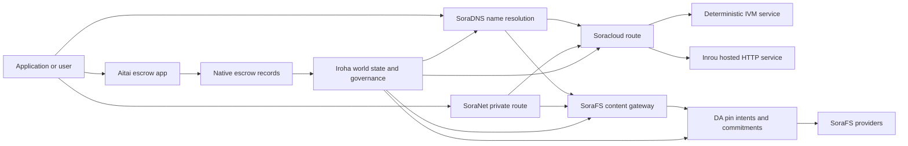

# SORA Nexus خدمات {#sora-nexus-services}

SORA Nexus نے Iroha 3 کے ارد گرد ایپ سے متعلق سروس طیاروں کو شامل کیا ہے۔ یہ خدمات الگ الگ لیجرز نہیں ہیں۔ وہ Iroha دنیا کی ریاست ، Norito منشور ، گورننس ریکارڈ اور Torii روٹ فیملیوں کے ذریعہ لنگر ہیں.

دستیابی نوڈ بلڈ اور نیٹ ورک پروفائل پر منحصر ہے۔ ہدف نوڈ پر [`/openapi`](/ur/reference/torii-endpoints.md#app-and-sora-route-families) کو فعال راستوں کی مستند فہرست کے طور پر استعمال کریں۔

## جزو نقشہ {#component-map}

|اجزاء |کردار |اہم سطحیں |
| ---------------------- | ------------------------------------------------------------------------------------------------------------------------------------------- | ---------------------------------------------------------------------------------------- |
|Soracloud |ایپلی کیشنز کی تعیناتی، میزبان خدمات، نجی ماڈل/رن ٹائم اسٹیٹ، اور سروس لائف سائیکل کنٹرول۔ |`/v1/soracloud/` ، `/api/`، `iroha app soracloud ...` |
|اندرونی |Soracloud میزبان HTTP سروس کی نظر ثانیوں کے لئے چلانے کا وقت جو ایک زندہ HTTP طیارے کی ضرورت ہے. |Soracloud رن ٹائم ترتیب، میزبان کی صلاحیت اشتھارات، نقل رن ٹائمز ریاست |
|SoraNet |سرکٹس، ریلے ٹریفک، VPN، کنیکٹ سیشنز اور سٹریمنگ روٹس کے لئے پرائیویسی اور ٹرانسپورٹ اوورلی۔ |`/v1/connect/` ، `/v1/vpn/`، SoraNet راستے کے میٹا ڈیٹا |
|ڈیٹا کی دستیابی (DA) |Nexus لینوں، SoraFS دستاویزات اور ثبوت کے بہاؤ کی طرف سے حوالہ دیا جاتا ہے جس میں مفید بوجھ کے لئے دستیابی کا ثبوت، عزم، اور پن ارادے پرت. |`/v1/da/` ، `FindDaPinIntent`، `[sumeragi.da]` |
|SoraFS |مینیفیس، CAR پےلوڈز، پنڈ مواد، گیٹ وے کی وصولی، اور ثبوت کی بازیافت کے بہاؤ کے لئے مواد ایڈریس شدہ اسٹوریج ٹیب۔ |`/v1/sorafs/` ، `/sorafs/`، `FindSorafsProviderOwner` |
|SoraDNS |SORA کی میزبانی کردہ خدمات اور مواد کے لئے تعیناتی ناموں اور حل کنندہ تصدیق کی پرت۔ |`/v1/soradns/`، `/soradns/`، resolver ڈائرکٹری واقعات |
|Aitai |ایپ لیول فائیٹ اور اثاثوں کی تصفیہ کا راہداری مقامی ایسکرو ریکارڈز کی طرف سے حمایت، ایک علیحدہ دفتر کی طرف سے نہیں. | `OpenAssetEscrow`, `FindAssetEscrow*`, `EscrowEventFilter`, Kotodama `escrow_*` تعمیرات |



## عام بہاؤ {#common-flows}

### ہوسٹڈ اسپلٹ ایپلیکیشن {#hosted-split-application}

ایک عام مخلوط طیارے ایپ تمام ٹکڑوں کو ایک ساتھ استعمال کرتا ہے:

1. جامد فرنٹ اینڈ اثاثوں کو پیک کیا جاتا ہے اور SoraFS کے ذریعے منسلک کیا جاتا ہے۔
2. عوامی میزبان، مثال کے طور پر `<app>.sora` ، SoraDNS کے ذریعے رجسٹرڈ ہے.
3. Soracloud راستوں `/api/v1/search` یا `/api/v1/stream` کے لئے ایک Inrou HTTP سروس.
4. Soracloud راستوں `/api/auth` اور `/api/v1/user` deterministic IVM ہینڈلرز کے لئے.
5. صارفین جو رازداری کی ضرورت رکھتے ہیں وہ ایک ہی مواد یا API روٹ کے ذریعے SoraNet سرکٹ تک پہنچ سکتے ہیں۔

|راستہ |پشتارہ طیارے |کیوں ؟|
| ----------------- | --------------------- | ------------------------------------------------- |
| `/`               |SoraFS جامد مواد |بازیافت کے قابل مواد جڑ اور گیٹ وے کیشنگ |
|`/assets/*` |SoraFS جامد مواد |مواد سے منسلک اثاثے اور واضح ثبوت |
|`/api/auth*` |Soracloud IVM |دوبارہ کھیلنے کے لئے محفوظ auth اور پرس چیلنج ریاست |
|`/api/v1/user*` |Soracloud IVM |حکمرانی کے لیے حساس ریاستی تغیرات |
|`/api/v1/search*` |Soracloud Inrou |براہ راست HTTP سروس، کیش، SSE، یا جمع کرنے والی ریاست |

### مواد اشاعت {#content-publication}

SoraFS اشاعت پائیدار آرٹیفیکٹس تیار کرتی ہے اس سے پہلے کہ ایک نام ان کی طرف اشارہ کرے:

1. ایک مفید بوجھ یا ڈائرکٹری بنائیں.
2. اسے ایک CAR آرکائیو میں پیک کریں اور ٹکڑا منصوبہ.
3. پن پالیسی اور گورننس ڈیٹا کے ساتھ ایک Norito مینفیس بنائیں۔
4. Torii پر دستاویز جمع کروائیں۔
5. ایک DA پن ارادے یا دستیابی کا وعدہ ریکارڈ کریں جب ہدف پروفائل واضح ثبوت کی ضرورت ہوتی ہے.
6. مینیفیس کو SoraDNS نام یا Soracloud جامد فرنٹ اینڈ روٹ سے منسلک کریں۔

### نجی نقل و حمل یا سٹریمنگ کا راستہ {#private-fetch-or-streaming-route}

SoraNet کے سامنے بیٹھ سکتا ہے SoraFS یا Soracloud:

1. کلائنٹ نام یا دستاویز کو حل کرتا ہے۔
2. گارڈ ڈائرکٹری یا روٹ مینفیس داخلہ اور باہر نکلنے کے ریلے کا انتخاب کرتا ہے.
3. ٹریفک بھری ہوئی ہے اور SoraNet سرکٹ کے ذریعے بھیجا جاتا ہے۔
4. باہر نکلنے والا ریلے SoraFS گیٹ وے، Torii سلسلہ، یا Soracloud راستے تک پہنچتا ہے۔

## آٹائی {#aitai}

Aitai SORA مارکیٹ سٹائل کے معاہدے کے لئے ایپ کوریڈور ہے جہاں خریدار اور بیچنے والا آف چین ادائیگی کو ہم آہنگ کرتے ہیں جبکہ Iroha آن لائن اثاثوں کی نگہداشت پر کنٹرول کرتا ہے۔ اس کو نئے عددی اثاثوں کی حراستی کے بہاؤ کے لئے معاہدے کے ملکیت کے حراستی اکاؤنٹ کے بجائے مقامی ایسکرو ہدایات کا استعمال کرنا چاہئے۔

Native escrow کی کتاب میں حراست برقرار ہے۔ بیچنے والا `OpenAssetEscrow` کے ساتھ ایک پیش کش کھولتا ہے ، خریدار `AcceptAssetEscrow` اور `MarkEscrowPaymentSent` کے ساتھ آف چین ادائیگی کو قبول کرتا ہے اور اس پر نشان لگاتا ہے ، اور بیچنے والا ادائیگی سے پہلے `ReleaseAssetEscrow` کے ساتھ رہائی دیتا ہے یا منسوخ کرتا ہے۔ اگر خریدار اور بیچنے والا متفق نہ ہوں تو ، دونوں فریقین تنازعہ کھول سکتے ہیں اور `CanResolveEscrowDispute` کے ساتھ ایک حل کنندہ بند رقم کو تقسیم کرسکتا ہے۔

مکمل زندگی سائیکل، عام اثاثوں کے تالے، گمنام اسکو، سوالات، واقعات، اور Rust کی مثالوں کے لئے، دیکھیں [Native Asset Escrow ](/ur/blockchain/escrow.md).

|Aitai سطح |اسے استعمال کریں |
| ------------------------------------------------------------------------------------------------------------------------------------------------------------- | ----------------------------------------------------------------------------------------- |
| `OpenAssetEscrow`, `AcceptAssetEscrow`, `MarkEscrowPaymentSent`, `ReleaseAssetEscrow`, `CancelAssetEscrow`                                                    |شفاف عددی اثاثوں کی پیش کشیں ، بشمول XOR کے نامی تصفیہ کے بہاؤ۔ |
| `OpenAnonymousAssetEscrow`, `AcceptAnonymousAssetEscrow`, `MarkAnonymousEscrowPaymentSent`, `ReleaseAnonymousAssetEscrow`, `CancelAnonymousAssetEscrow`       |تحفظ یافتہ پیشکشیں جہاں فنڈنگ اور بندش کی حرکتوں کو ثبوت کے ساتھ منسلک کیا جاتا ہے. |
|`OpenEscrowDispute` ، `ResolveEscrowDispute`، `OpenAnonymousEscrowDispute`، `ResolveAnonymousEscrowDispute`|تنازعات میں شمولیت اور عدالت کی طرز پر حل۔ |
|`FindAssetEscrowById` ، `FindAssetEscrowsBySeller`، `FindAssetEscrowsByBuyer`، `FindAssetEscrowsByStatus`|ایپ کی حیثیت کے صفحات، مفاہمت کے کام اور سپورٹ ٹولنگ۔ |
|`EscrowEventFilter` |بروکر ID، بیچنے والے، خریدار، حیثیت، یا ایونٹ کی قسم کے ذریعہ شفاف سکرو رکنیتیں براہ راست. |
| Kotodama `escrow_open_offer`, `escrow_accept`, `escrow_mark_payment_sent`, `escrow_release`, `escrow_cancel`, `escrow_open_dispute`, `escrow_resolve_dispute` |Kotodama معاہدہ کالز کی حمایت V1 escrow syscalls کے ذریعے کی جاتی ہے۔ |

عوامی Taira یا Minamoto استعمال کے ل the ، آف چین ادائیگی ریل اور کسی بھی معاونت یا عدالت کے کام کے بہاؤ کو درخواست کی پالیسی کے طور پر سمجھیں۔ Iroha حراست کی حالت ، لائف سائیکل کے واقعات ، ثبوت ہیشز ، اور حتمی اثاثوں کی نقل و حرکت کا ریکارڈ کرتا ہے۔ یہ خود ہی فیاٹ تصدیقی تصدیق نہیں کرتا ہے۔

## ٹارگٹ نوڈ چیک کریں {#check-a-target-node}

اس صفحے سے مثالیں استعمال کرنے سے پہلے ، تصدیق کریں کہ آپ جس نوڈ کو نشانہ بنانا چاہتے ہیں اس پر روٹ فیملی موجود ہے:

```bash
export TORII_URL=https://taira.sora.org

curl -fsS "$TORII_URL/openapi.json" \
  | jq '.paths | keys[] | select(test("^/v1/(soracloud|sorafs|soradns|connect|vpn|da)/"))'

curl -fsS "$TORII_URL/status" | jq .
```

اگر `/openapi.json` پروفائل کی طرف سے بے نقاب نہیں کیا جاتا ہے، تو `/openapi` کوشش کریں. صحیح راستے کی دستیابی بلڈ خصوصیات اور نیٹ ورک کی ترتیب پر منحصر ہے.

### Taira صرف پڑھنے کے لئے سگریٹ چیک {#taira-read-only-smoke-checks}

عوامی Taira اختتام پوائنٹ پڑھنے کی طرف چیک کے لئے مفید ہے، لیکن آپ کو متحرک مثالوں کے لئے استعمال نہیں کرتے ہیں جب تک کہ آپ ایک مجاز اکاؤنٹ چل رہے ہیں اور زندہ حالت تبدیل کرنے کا ارادہ رکھتے ہیں.

```bash
export TORII_URL=https://taira.sora.org

curl -fsS "$TORII_URL/status" \
  | jq '{version: .build.version, peers, blocks, lanes: (.teu_lane_commit | length)}'

curl -fsS "$TORII_URL/v1/connect/status" | jq '{enabled, sessions_active}'

curl -fsS "$TORII_URL/v1/vpn/profile" \
  | jq '{available, relay_endpoint, supported_exit_classes}'

curl -fsS "$TORII_URL/v1/sorafs/storage/state" \
  | jq '{bytes_capacity, bytes_used, pin_queue_depth, por_inflight}'

curl -fsS -H 'Accept: application/json' "$TORII_URL/v1/soracloud/status" \
  | jq '.control_plane | {service_count, services: [.services[] | {service_name, current_version}]}'
```

Taira تعیناتی کے مخصوص کنٹرول طیارے راستوں کو بے نقاب کرسکتا ہے جو OpenAPI راستے کے نقشے میں درج نہیں ہیں۔ `/openapi` کو بنیادی طور پر پیدا ہونے والے API معاہدے کے طور پر علاج کریں ، پھر براہ راست کسی بھی تعیناتی کی مخصوص روٹ کی تصدیق کریں اس سے پہلے کہ اسے زندہ دستاویز کریں۔

## Soracloud {#soracloud}

Soracloud SORA ایپلی کیشن کنٹرول طیارہ ہے۔ یہ تعیناتی بنڈل ، سروس ریویژنز ، روٹنگ ، رول آؤٹ اسٹیٹ ، مجاز ترتیب اندراجات ، خفیہ کردہ سروس راز ، ماڈل رجسٹری ریکارڈز ، نجی نتیجہ خیز سیشن اور رن ٹائم رسیدوں کو ٹریک کرتا ہے۔

Soracloud دو عملدرآمد طیاروں کا استعمال کرتا ہے:

|پھانسی کا طیارہ |رن ٹائم |اسے استعمال کریں |
| ---------------------- | ------- | -------------------------------------------------------------------------------------------- |
|`DeterministicService` |`Ivm` |مصنف، خفیہ خانے کی حالت، تصدیق شدہ پڑھتا ہے، حکم دیا میل باکس ہینڈلرز، حکمرانی کے حساس تغیرات|
|`HttpService` |`Inrou` |لائیو HTTP APIs، کریکٹر بھاری کام، کیشے کے ساتھ حمایت یافتہ خدمات، SSE، براؤزر کی مدد سے بہاؤ |

کنٹرول طیارہ مستند ہے۔ تعینات ، اپ گریڈ ، رول بیک ، ترتیب ، خفیہ ، ماڈل اور حیثیت کے احکامات Torii کے ذریعے جمع کروائیں اور پابند عالمی حالت پڑھیں؛ وہ کسی علیحدہ CLI مقامی آئینے پر انحصار نہیں کرتے ہیں۔ پبلک روٹنگ طویل ترین پریفیکس پر مبنی ہے، لہذا ایک رجسٹرڈ میزبان میزبانی شدہ HTTP راستوں اور تعیناتی API راستوں کے درمیان ٹریفک تقسیم کر سکتا ہے.

### اسپلٹ ایپ کو اسٹافلڈ کریں {#scaffold-a-split-app}

اسپلٹ ایپ ٹیمپلیٹ ایک جامد فرنٹ اینڈ پلس ایک میزبان لائیو API اور ایک تعیناتی والٹ / API سروس تخلیق کرتا ہے:

```bash
iroha app soracloud app init \
  --template split-app \
  --app-name solswap_indexer \
  --app-version 0.1.0 \
  --public-host solswap-indexer.sora \
  --output-dir ./apps/solswap-indexer

iroha app soracloud app local-plan \
  --manifest ./apps/solswap-indexer/app_manifest.json

iroha app soracloud app doctor \
  --manifest ./apps/solswap-indexer/app_manifest.json
```

`local-plan` روٹ تقسیم ، بچوں کی خدمت کے دستاویزات ، ورک اسپیس اسکرپٹ راستوں اور متوقع فرنٹ اینڈ اشاعت موڈ کو پرنٹ کرتا ہے۔ `doctor` مقامی ریلیز معاہدے کی توثیق کرتا ہے اس سے پہلے کہ آپ Torii میں شامل ہوں۔

### ایپ کی حالت کا تعین اور معائنہ {#deploy-and-inspect-app-state}

```bash
export SORACLOUD_TORII_URL=https://<soracloud-enabled-torii>

iroha app soracloud app deploy \
  --manifest ./apps/solswap-indexer/app_manifest.json \
  --torii-url "$SORACLOUD_TORII_URL"

iroha app soracloud app status \
  --manifest ./apps/solswap-indexer/app_manifest.json \
  --torii-url "$SORACLOUD_TORII_URL"
```

پہلے سے ہی تعینات سروس کے لئے، خدمت کی حد تک کمانڈ کا استعمال کریں:

```bash
iroha app soracloud status \
  --service-name solswap_indexer_live \
  --torii-url "$SORACLOUD_TORII_URL"

iroha app soracloud rollback \
  --service-name solswap_indexer_live \
  --target-version 0.1.0 \
  --torii-url "$SORACLOUD_TORII_URL"
```

### خفیہ اور خفیہ مواد {#config-and-secret-material}

Soracloud ترتیب اور خفیہ اندراجات مستند تعیناتی کی حالت کا حصہ ہیں۔ جب مطلوبہ ترتیب یا خفیہ پابندیاں غائب ہوں یا فعال منشوروں کے ساتھ مطابقت نہیں رکھتی ہیں تو تعیناتی ، اپ گریڈ اور رول بیک بند ہوجاتے ہیں۔

```bash
iroha app soracloud config-set \
  --service-name solswap_indexer_live \
  --config-name indexer/public_config \
  --value-file ./config/public-config.json \
  --torii-url "$SORACLOUD_TORII_URL"

iroha app soracloud secret-set \
  --service-name solswap_indexer_live \
  --secret-name indexer/api_key \
  --secret-file ./secrets/api-key.envelope.json \
  --torii-url "$SORACLOUD_TORII_URL"
```

CLI کی مدد سے اپنے پروفائل کے ذریعہ مطلوبہ درست شناختی نشانات حاصل کریں:

```bash
iroha app soracloud config-set --help
iroha app soracloud secret-set --help
```

## انرو {#inrou}

Inrou HTTP چلنے کا وقت ہے جو Soracloud کے ذریعہ استعمال کیا جاتا ہے۔ ایک Iroha نوڈ جس میں ایمبیڈڈ Soracloud رن ٹائم منصوبوں کو مقامی مٹیریلائزیشن پلان میں داخل کیا گیا ہے Soracloud ریاست ، مختص کردہ ہوسٹنگ سروس کی نقلیں لوپ بیک خدمات کے طور پر شروع کرتی ہیں۔ اور تصدیق شدہ ماڈل میں ریپلیکا رن ٹائم اسٹیٹ کی رپورٹیں واپس.

انرو کا استعمال ایسے کام کے بوجھ کے لئے کریں جن کو براہ راست HTTP سطح کی ضرورت ہو ، جیسے کریکٹر بھاری APIs ، SSE سلسلے ، کیش بیکڈ ہینڈلرز ، یا براؤزر سے معاون خدمات۔

### رن ٹائم کی ضروریات {#runtime-requirements}

- کنٹینر مینفیس رن ٹائم `Inrou` ہونا چاہئے.
- سروس مینفیس کے عملدرآمد کی سطح `HttpService` ہونا ضروری ہے.
- `HttpService + Inrou` کو بالکل ایک `PersistentRootLeaseVolume` کی ضرورت ہوتی ہے جو `/` پر نصب ہے۔
- انرو کی نقل شدہ خدمات کو مشترکہ سروس یا خفیہ لیز اسٹوریج کی بھی ضرورت ہوتی ہے جب وہ متغیر مشترکہ حالت برقرار رکھتی ہیں۔
- پروڈکشن ہوسٹنگ نوڈس کو صرف ایک پراکسی کے طور پر کام کرنے کی بجائے حقیقی Inrou صلاحیت کا اشتہار دینا چاہئے۔

### واضح ٹکڑا {#manifest-fragment}

مندرجہ ذیل مثال میں دو مظاہروں کی شکل دکھائی گئی ہے۔ یہ ایک ٹکڑا ہے ، مکمل تعیناتی کا بنڈل نہیں ہے۔

```jsonc
// container_manifest.json
{
  "schema_version": 1,
  "runtime": { "runtime": "Inrou", "value": null },
  "bundle_path": "/bundles/solswap-indexer.inrou",
  "entrypoint": "/app/bin/launch-indexer.sh",
  "args": [],
  "env": {
    "RUST_LOG": "info",
  },
  "inrou": {
    "schema_version": 1,
    "guest_os": { "guest_os": "DebianSlim", "value": null },
    "guest_images": {
      "x86_64": {
        "kernel_image_path": "/inrou/x86_64/vmlinux",
        "rootfs_image_path": "/inrou/x86_64/rootfs.ext4",
        "initrd_image_path": null,
      },
      "aarch64": {
        "kernel_image_path": "/inrou/aarch64/vmlinux",
        "rootfs_image_path": "/inrou/aarch64/rootfs.ext4",
        "initrd_image_path": null,
      },
    },
  },
  "lifecycle": {
    "start_grace_secs": 60,
    "stop_grace_secs": 30,
    "healthcheck_path": "/api/indexer/v1/health",
  },
}
```

```jsonc
// service_manifest.json
{
  "schema_version": 1,
  "service_name": "solswap_indexer_live",
  "service_version": "0.1.0",
  "execution_plane": { "execution_plane": "HttpService", "value": null },
  "replicas": 2,
  "route": {
    "host": "solswap-indexer.sora",
    "path_prefix": "/api/v1/search",
    "service_port": 8080,
    "visibility": { "visibility": "Public", "value": null },
    "tls_mode": { "tls": "Required", "value": null },
  },
  "lease_volumes": [
    {
      "volume_name": "root_disk",
      "kind": {
        "lease_volume": "PersistentRootLeaseVolume",
        "value": null,
      },
      "storage_class": { "storage_class": "Warm", "value": null },
      "mount_path": "/",
      "max_total_bytes": 8589934592,
    },
    {
      "volume_name": "index_state",
      "kind": { "lease_volume": "ServiceLeaseVolume", "value": null },
      "storage_class": { "storage_class": "Warm", "value": null },
      "mount_path": "/var/lib/solswap-indexer",
      "max_total_bytes": 1073741824,
    },
  ],
}
```

چلانے کے وقت، ہر نصب کرایہ کی مقدار حجم کے نام سے ماخوذ ماحول متغیرات کی طرف سے بے نقاب کیا جاتا ہے:

```text
SORACLOUD_LEASE_VOLUME_ROOT_DISK_DIR
SORACLOUD_LEASE_VOLUME_ROOT_DISK_MOUNT_PATH
SORACLOUD_LEASE_VOLUME_INDEX_STATE_DIR
SORACLOUD_LEASE_VOLUME_INDEX_STATE_MOUNT_PATH
```

## SoraNet {#soranet}

SoraNet رازداری اور ٹرانسپورٹ اوورلی ہے۔ یہ ریلے پر مبنی راستوں کو ٹریفک کے لئے فراہم کرتا ہے جو براہ راست ہدف گیٹ وے یا سروس سے منسلک نہیں ہونا چاہئے۔ ٹرانسپورٹ ڈیزائن میں داخلہ ، درمیانی اور خارجی ریلے رولز ، QUIC نقل و حمل ، شور پر مبنی ہائبرڈ ہینڈ شیک ، صلاحیت کی بات چیت ، ریلے ڈائرکٹری میٹا ڈیٹا ، اور فکسڈ سائز کے پیڈڈ سیل استعمال ہوتے ہیں۔

Nexus تعیناتیوں میں ، SoraNet مواد کی وصولی ، گیٹ وے ٹریفک ، VPN یا کنیکٹ سیشنز ، اور Norito اسٹریمنگ راستوں کو لے سکتا ہے۔ ڈائرکٹری اندراجات ریلے کو نشان زد کرسکتے ہیں جو `norito-stream` کی حمایت کرتے ہیں ، جس سے گاہکوں کو Torii RPC یا سٹریمنگ ٹریفک کے لئے موزوں راستوں کو ترجیح دینے کی اجازت دیتا ہے۔

### سٹریمنگ ترتیب {#streaming-configuration}

Nexus پروفائل اسٹریمنگ روٹس کے لئے SoraNet کی فراہمی کو قابل بناتا ہے:

```toml
[streaming]
feature_bits = 0b11

[streaming.soranet]
enabled = true
exit_multiaddr = "/dns/torii/udp/9443/quic"
padding_budget_ms = 25
access_kind = "authenticated"
provision_spool_dir = "./storage/streaming/soranet_routes"
provision_spool_max_bytes = 0
provision_window_segments = 4
provision_queue_capacity = 256
```

`access_kind = "read-only"` کا استعمال مواد کے راستوں کے لئے کریں جن میں ناظرین کی توثیق کی ضرورت نہیں ہے۔ `authenticated` کا استعمال کریں جب باہر نکلنے والے ریلے کو ٹکٹ یا ناظر کی شناخت کو نافذ کرنا ہوگا جب تک کہ وہ Torii یا کسی میزبان سروس سے رابطہ نہ کریں۔

### SoraNet-آگاہ SoraFS لانا {#soranet-aware-sorafs-fetch}

SoraFS ٹچ CLI براؤزر کی توسیع یا SDK اڈاپٹرز کے لئے مقامی پراکسی مینفیس اور spool SoraNet روٹ میٹا ڈیٹا جاری کر سکتا ہے:

```bash
sorafs_cli fetch \
  --plan artifacts/payload_plan.json \
  --manifest-id 7bb2...9d31 \
  --provider name=alpha,provider-id=9f5c...73aa,base-url=https://gw-alpha.example.org/,stream-token="$(cat alpha.token)" \
  --output artifacts/payload.bin \
  --json-out artifacts/fetch_summary.json \
  --local-proxy-manifest-out artifacts/proxy_manifest.json \
  --local-proxy-mode bridge \
  --local-proxy-norito-spool storage/streaming/soranet_routes \
  --local-proxy-kaigi-spool storage/streaming/soranet_routes \
  --local-proxy-kaigi-policy authenticated \
  --max-peers=2 \
  --retry-budget=4
```

خلاصہ ریکارڈ فراہم کنندہ کی رپورٹیں، ٹکڑے ٹکڑے رسیدیں، مقامی پراکسی میٹا ڈیٹا، اور مؤثر راستے کی ترتیبات کو لانے کے لئے استعمال کیا.

## ڈیٹا کی دستیابی (DA) {#data-availability-da}

DA دنیا کی حالت میں براہ راست رکھنے کے لئے بہت بڑے، رازداری سے حساس یا سروس مخصوص ہونے والے مفید بوجھوں کے لئے دستیابی کا ثبوت پرت ہے. اس میں تعیناتی ذمہ داریاں اور بازیافت کے پابندیاں ریکارڈ کی جاتی ہیں تاکہ تصدیق کنندہ، گیٹ وے اور کلائنٹ اس بات پر اتفاق کر سکیں کہ کون سے بائٹس کا وعدہ کیا گیا تھا، کون سی پالیسی لاگو ہوتی ہے، اور کون سا ثبوت مشاہدہ کیا گیا ہے۔

DA Kura یا SoraFS کی جگہ نہیں لے سکتا:

- Kura حتمی بلاک سٹریم اور اتفاق رائے کی بازیابی کے اعداد و شمار کو ذخیرہ کرتا ہے.
- SoraFS مواد ایڈریس بائٹس، CAR پےلوڈز، اور دستاویزات کو اسٹور اور خدمت کرتا ہے.
- DA ذمہ داریاں، ثبوت کی پالیسیاں، ثبوت کھولنے اور پن ارادے ریکارڈ کرتا ہے جو ان بائٹس کو شیڈول کرنے، آڈٹ کرنے اور لیجر کی حالت سے منسلک کرنے کی اجازت دیتا ہے.

DA کا استعمال کریں جب کسی ایپلی کیشن یا Nexus لین کو لیجر سے نظر آنے والے وعدہ کی ضرورت ہو کہ آف چین ڈیٹا بازیافت کے قابل رہتا ہے۔ عام مثالوں میں حل کے بہاؤ کے لئے لین فائدے کی بوجھ کے وعدے شامل ہیں ، شائع کردہ مواد کے لئے SoraFS پن ارادے ، ثبوت کے بنڈل جو بعد میں تصدیق کے لئے محفوظ کیے جانے چاہئیں ، اور ایپلی کیشن آرٹیفیکٹس جن کی عوامی حالت مکمل لوڈ کی بجائے ڈائجسٹ ہونی چاہئے۔

### لائف سائیکل {#lifecycle}

|مرحلہ |کیا ریکارڈ کیا جاتا ہے |
| ---------- | ----------------------------------------------------------------------------------------------------------------------------------------------------- |
|نیت |ٹکٹ، مینیفیس ریفرنس، عرفی نام، لین/ایپک/سیکوینس ریفرنس ، برقرار رکھنے کی پالیسی، یا نقل کا ہدف۔ |
|عزم |مواد کو ہضم کریں جو مینوفیسٹ، لین پلے لوڈ، ثبوت بنڈل، یا مواد کی جڑ کو لیجر کے قابل ریکارڈ سے منسلک کرتا ہے. |
|ثبوت |دستیابی کے ووٹ، ثبوت کھولنے، فراہم کنندہ کی تصدیق، یا ہدف نیٹ ورک کی طرف سے قبول کردہ دیگر پروفائل مخصوص ثبوت۔ |
|سوال |`FindDaPinIntentByTicket` ، `FindDaPinIntentByManifest`، `FindDaPinIntentByAlias`، یا `FindDaPinIntentByLaneEpochSequence` کے ذریعے پن ارادے کی تلاشیں۔ |

DA کی حمایت یافتہ عام اشاعت کے بہاؤ میں شامل ہیں:

1. WSV سے باہر مفید بوجھ بنائیں یا وصول کریں، مثال کے طور پر ایک SoraFS CAR فائل یا Nexus لین مفید بوجھ.
2. Norito مینفیس یا روٹ کے مخصوص مصروفیت ریکارڈ میں مفید بوجھ کی وضاحت کریں.
3. جب اس روٹ فیملی کو فعال کیا جائے تو `/v1/da/*` کے ذریعے یا نیٹ ورک کے دستخط شدہ ٹرانزیکشن پاتھ کے ذریعہ مینفیس، پن ارادے، یا مصروفیت جمع کروائیں۔
4. توثیق کرنے والوں یا دستیابی فراہم کرنے والوں کو فعال ثبوت کی پالیسی کے مطابق مطلوبہ شواہد جمع کرنے دیں۔
5. اس سے پہلے کہ آپ کسی عرفی نام، تصدیقی ثبوت یا گیٹ وے روٹ کو فروغ دیں جو فائدہ مند بوجھ پر منحصر ہے اس کے نتیجے میں پن کا ارادہ یا عزم پوچھیں.

### الگورتھم ماڈل {#algorithmic-model}

DA ایک مفید بوجھ کو ایک دستخط شدہ ، دوبارہ کھیلنے سے محفوظ ، بلاک انڈیکسڈ مصروفیت میں بدل دیتا ہے۔ اہم الگورتھم تعیناتی ہیں تاکہ تصدیق کنندہ اور گیٹ وے ایک ہی بائٹس سے ایک ہی ڈائجسٹ کی دوبارہ گنتی کرسکیں۔

1. پیش کردہ مفید بوجھ کو کینیکلائزیشن کریں۔ Torii `(lane_id, epoch, sequence)` ، استعمال شدہ بوجھ بائٹس، کمپریشن میٹا ڈیٹا، ٹکڑا سائز، مٹانے کا پروفائل، برقرار رکھنے کی پالیسی، اور جمع کرنے والے کے دستخط کے ساتھ انگوٹی کی درخواست قبول کرتا ہے۔ نوڈ جب درخواست کی جائے تو gzip، deflate، یا Zstandard مفید بوجھ کو ختم کرتا ہے، پھر اس بات کی تصدیق کرتا ہے کہ کینونیکل بائٹ لمبائی `total_size` کے برابر ہے.
2. لین اور ٹکڑا پیرامیٹرز کی توثیق کریں۔ لین کو Nexus لین کیٹلاگ میں موجود ہونا چاہئے۔ `chunk_size` دو ، کم از کم دو بائٹس کا غیر صفر طاقت ہونا ضروری ہے ، اور تشکیل شدہ زیادہ سے زیادہ نہیں ہونا چاہئے۔ مٹانے کے پروفائل میں ڈیٹا شیڈز اور کم سے کم دو پارٹی شیڈز شامل ہوں گے۔ لین کیٹلاگ میں ثبوت کے نظام کا انتخاب کیا جاتا ہے، یا تو `merkle_sha256` یا `kzg_bls12_381`.
3. نیٹ ورک کی پالیسی لاگو کریں۔ نوڈ بلب کلاس کے لئے ترتیب شدہ نقل اور برقرار رکھنے کی بیس لائن کو نافذ کرتا ہے۔ عوامی میٹا ڈیٹا کو صاف متن میں رہنا چاہئے۔ صرف گورننس والے میٹا ڈیٹا نوڈ کی تشکیل شدہ گورننس میٹا ڈیٹا کلید کے ساتھ خفیہ کیا جاتا ہے اس سے پہلے کہ اسے مینفیس میں لکھا جائے۔
4. ٹکڑا اور commit. کینونیکل پے لوڈ کو `chunk_size` سے حاصل کردہ ایک مقررہ سائز کے پروفائل کے ساتھ ٹکڑا کیا جاتا ہے۔ Torii پےلوڈ ڈائجسٹ ، ثبوت کی بازیافت کرنے والی درخت کی جڑ ، اور ہر ٹکڑے کے وعدوں کا حساب لگاتا ہے۔ ڈیٹا کے ٹکڑے اپنے بائٹس پر BLAKE3 وعدے لے جاتے ہیں۔
5. حذف کرنے کے وعدے شامل کریں۔ ٹکڑے ٹکڑے `data_shards` کی پٹیوں میں گروپ کیے جاتے ہیں۔ حتمی پٹی میں لاپتہ خلیات مساوات کے حساب کے لئے صفر سے بھری ہوئی ہیں۔ RS(16) مساوات صف / گلوبل مساوات کا ٹکڑا بناتی ہے۔ اختیاری `row_parity_stripes` میٹرکس بھر میں کالم طرز کی پٹی مساوات شامل کریں. پارٹی شیڈ کے وعدے BLAKE3 چھوٹے اینڈین `u16` علامتوں کے ڈائجسٹ ہیں۔
6. مینفیس بنائیں۔ `DaManifestV1` لین ، ایپوک ، بلب کلاس ، کوڈیک ، پلے لوڈ ڈائجسٹ ، ٹکڑا جڑ ، ٹکڑا سائز ، مٹانے کا پروفائل ، برقرار رکھنے کی پالیسی ، کرایہ کی قیمت ، ٹکڑے کے وعدے ، اختیاری IPA عزم ، میٹا ڈیٹا اور اشاعت کا وقت ریکارڈ کرتا ہے. اسٹوریج ٹکٹ تعیناتی ہے: نوڈ پہلے خالی ٹکٹ کے ساتھ ایک منشور ٹیمپلیٹ کو ہیش کرتا ہے ، پھر اس فنگر پرنٹ کو آخری `storage_ticket` کے طور پر واپس لکھتا ہے۔
7. تکرار کے تنازعات کو مسترد کریں۔ دوبارہ کھیلنے کی کلید `(lane_id, epoch, sequence, manifest_fingerprint)` ہے۔ ایک ہی فنگر پرنٹ والا ڈپلیکیٹ بیکار ہے۔ ایک متروک ترتیب یا مختلف فنگر پرینٹ والے اسی ترتیب کو مسترد کردیا جاتا ہے۔
8. دستخط شدہ آرٹیفیکٹس جاری کریں۔ Torii ایک PDP عزم کا حساب لگاتا ہے ، `DaIngestReceipt` پر دستخط کرتا ہے ، `DaCommitmentRecord` کی تعمیر کرتا ہے ، اور manifest کے لئے spool artifacts لکھتا ہے ، PDP عزم ، عزم ریکارڈ ، عزم شیڈول ، پن ارادہ ، رسید فائل ، اور رسید لاگ۔ رسید کرسر ہر `(lane_id, epoch)` پر یکساں طور پر آگے بڑھتا ہے.

مصروفیت کے ریکارڈ وہ ہیں جو بلاکس لے جاتے ہیں۔ ایک ریکارڈ منسلک کرتا ہے:

- لین، دور اور ترتیب
- caller blob ID اور canonical manifest hash
- لین پروف اسکیم
- کٹائی جڑ
- KZG لینوں کے لئے اختیاری KZG عہد
- PDP/ثبوت ہضم
- برقرار رکھنے کی کلاس اور اسٹوریج ٹکٹ
- Torii DA تصدیق کی دستخط

ایک بلاک DA ریکارڈز کو سرایت کرنے سے پہلے، بلاک اسمبلی کا راستہ بنڈل کی توثیق کرتا ہے:

- `(lane_id, epoch, sequence)` بنڈل کے اندر منفرد ہونا ضروری ہے.
- ظاہری ہیشوں کو غیر صفر اور بنڈل کے اندر منفرد ہونا ضروری ہے.
- مصروفیت کا ثبوت اسکیم کو ترتیب شدہ لین پالیسی کے مطابق ہونا چاہئے.
- مرکل لینز مسترد KZG ذمہ داریاں؛ KZG لینز کو غیر صفر کی ضرورت ہوتی ہے KZG عزم۔
- پن کے ارادوں کو لین، manifest hash، اسٹوریج ٹکٹ، مالک اکاؤنٹ، اور عرفی تصادم کے قواعد کی طرف سے canonicalized، درجہ بندی اور فلٹر کیا جاتا ہے.

بلاک ہیڈر DA ثبوت کی پالیسیوں ، وابستگیوں اور پن ارادوں کے لئے ہیش اسٹورز کرتا ہے۔ رکنیت کے ثبوتوں کے ل the ، وابستگی کا بنڈل ایک مرکل جڑ کو بھی بے نقاب کرتا ہے جس کے پتے کینیکل Norito-کوڈ شدہ `DaCommitmentRecord` اقدار کے ہیش ہیں. والدین کے نوڈس بائیں اور دائیں بچوں کی جڑیں ہاش کرتے ہیں۔ ایک عجیب پتھر کو اگلے پرت میں تبدیل نہیں کیا جاتا ہے۔

### ثبوت کی تصدیق {#proof-verification}

`/v1/da/commitments/prove` ایک بلاک میں ایک مصروفیت کا ثبوت پیش کرسکتا ہے۔ اس ثبوت میں مصروفیت ، بلاک کی اونچائی ، بنڈل میں انڈیکس ، بنڈلی ہیش ، بنڈلز لمبائی ، میرکل جڑ اور بہن بھائی راستہ شامل ہے۔ تصدیق چیک:

1. ثبوت بنڈل ہیش بلاک ہیڈر کے DA مصروفیت ہیش سے مماثل ہے.
2. ثبوت بلاک کی اونچائی حوالہ دیا گیا بلاک ہیڈر سے ملتی ہے.
3. انڈیکس حدود میں ہے اور اس انڈیکس میں بانڈ اندراج کے برابر ذمہ داری ہے۔
4. لین پروف پالیسی اس عہد کو قبول کرتی ہے۔
5. وابستگی کے پتھر سے بھائیوں کا راستہ فولڈنگ فراہم کردہ جڑ کی تعمیر نو کرتا ہے.
6. تعمیر شدہ جڑ بنڈل کی جڑ کے برابر ہے۔

اس سے یہ ثابت ہوتا ہے کہ ایک مخصوص بلاک پے لوڈ میں دستیابی کے لئے ایک خاص عہد شامل کیا گیا تھا؛ یہ ثابت نہیں کرتا ہے کہ ہر نقل فی الحال آن لائن ہے۔ براہ راست بازیافت کو SoraFS فراہم کنندہ کے ذریعے الگ سے چیک کیا جاتا ہے، PDP/PoTR چیک، یا پروفائل مخصوص دستیابی کا ثبوت.

### اتفاق رائے کا تعامل {#consensus-interaction}

DA قابل اعتماد نشریات (RBC) کے ذریعے Sumeragi سے منسلک کیا جاتا ہے ، لیکن یہ دوسرا حتمی پروٹوکول نہیں ہے۔ RBC تجویز کی مفید بوجھ کو پھیلا دیتا ہے اور بازیافت کرتا ہے۔: تجویز کنندہ `(height, view, payload_hash)` کے لئے ایک سیشن کا اعلان کرتا ہے ، ہم مرتبہ تبادلہ ٹکڑے ، اور `READY`/`DELIVER` سگنل اس بات کو ٹریک کرتے ہیں کہ آیا کافی تصدیق کنندگان نے ایک ہی مفید بوجھ کا مشاہدہ کیا ہے۔

Iroha 3 میں، ایک ہم منصب زیر التواء بلاک مفید بوجھ دستیاب سمجھتا ہے جب یا تو:

- مقامی زیر التواء بلاک بائٹس ہیش کے لئے متوقع مفید بوجھ ہیش، یا
- RBC بلاک ہیش، اونچائی، نقطہ نظر، اور مفید بوجھ ہیش کے مطابق ایک پائلڈ بازیافت کیا ہے.

اگر کوئی بھی حالت درست نہیں ہے تو، ہم مرتبہ ریکارڈ `missing_local_data` ، RBC یا بلاک مطابقت پذیری کے ذریعے مفید بوجھ کو بازیافت کرنے کی کوشش کرتا رہتا ہے، اور DA گیٹ کی حیثیت اور ٹیلی میٹری میں رپورٹ کرتا ہے. موجودہ نفاذ میں یہ DA سگنل حتمی طور پر مشورہ دیتے ہیں: ایک بلاک ابھی بھی کمیٹ سرٹیفکیٹ کے ساتھ مل کر مماثل مقامی مفید بوجھ سے ختم ہوتا ہے، نہ کہ علیحدہ DA کووروم سرٹیفکٹ سے.

DA ٹائمنگ بازیافت ونڈوز کو وسعت دیتی ہے۔ مؤثر DA کووروم ٹائم آؤٹ ترتیب شدہ بلاک سے حاصل کیا جاتا ہے اور اس کے بعد `sumeragi.advanced.da.quorum_timeout_multiplier` سے ضرب کی جاتی ہے۔ دستیابی کا ٹائم آوٹ `max(quorum_timeout, availability_timeout_floor_ms) * availability_timeout_multiplier` ہے۔ اس دستیابی کا ٹائم آؤٹ ختم ہونے سے پہلے، نوڈ مفید بوجھ کی بازیابی کو ترجیح دیتا ہے اور قبل از وقت دوبارہ شیڈولنگ سے بچتا ہے۔ اس کے بعد، معمول کی بازیابی اور نقطہ نظر تبدیل کرنے کے راستے جاری رہ سکتے ہیں۔

### آپریٹر کے نوٹ {#operator-notes}

Iroha 3 اتفاق رائے کے پروفائلز میں شامل ہیں RBC کی حمایت یافتہ مفید بوجھ پھیلاؤ، manifest guards، DA بنڈل توثیق، اور بازیابی ٹیلی میٹری. ہم منصب ٹیمپلیٹ فی بلاک کے لئے `[sumeragi.da]` ذمہ داریوں اور ثبوت کھولنے کے لئے حدود کو ظاہر کرتا ہے، جمع `[sumeragi.advanced.da]` ٹائم آؤٹ ضربات کووروم اور دستیابی کے رویے کے لئے۔ ان ترتیبات کو ایک نیٹ ورک پروفائل میں توثیق کرنے والوں کے درمیان مستقل رکھیں.

راستے کی دریافت کے لئے، نوڈ کی OpenAPI دستاویز سے شروع کریں:

```bash
curl -fsS "$TORII_URL/openapi.json" \
  | jq '.paths | keys[] | select(startswith("/v1/da/"))'
```

موجودہ DA استفسار کے ناموں کے لئے [ query حوالہ](/ur/reference/queries.md#nexus-data-availability-and-packages) کا استعمال کریں، اور آپ کی تعمیر کے ذریعہ سامنے آنے والے مقامی `[sumeragi.da]` بٹنوں کے لئے پیئر ترتیب ٹیمپلیٹ [ ](/ur/reference/peer-config/) کا استعمال کریں۔

## SoraFS {#sorafs}

SoraFS غیر مرکزی مواد ایڈریس شدہ اسٹوریج ٹیبل ہے۔ یہ بائٹس کو تعیناتی ٹکڑوں ، CAR آرکائیوز میں پیک کرتا ہے ، اور Norito ظاہر کرتا ہے جو مواد کی جڑیں ، ٹکڑے ٹکڑے پروفائلز ، پن پالیسیاں ، اور گورننس تصدیقوں کو پابند کرتا ہے۔ اسٹوریج فراہم کرنے والے صلاحیت اور مواد کی دستیابی کا اشتہار دیتے ہیں، جبکہ گیٹ وے مواد کی خدمت سے پہلے منشوروں اور ٹکڑے ٹکڑے کے وعدوں کی تصدیق کرتے ہیں۔

عام SoraFS استعمال میں جامد ایپلی کیشنز کے اثاثے ، دستاویزات کا بلڈ ، زون بنڈل ، ماڈل یا آرٹیفیکٹ ریفرنس شامل ہیں ، اور گورننس کے ثبوت بنڈل. Iroha اعداد و شمار کے ماڈل کی نمائش SoraFS گیٹ وے واقعات اور ایک [`FindSorafsProviderOwner`](/ur/reference/queries.md#nexus-data-availability-and-packages) فراہم کنندہ کی ملکیت کے حل کے لئے سوال۔

### پیک کریں، بیان کریں، دستخط کریں اور جمع کروائیں {#pack-manifest-sign-and-submit}

```bash
cargo run -p sorafs_car --features cli --bin sorafs_cli -- \
  car pack \
  --input ./dist \
  --car-out artifacts/site.car \
  --plan-out artifacts/site.chunk-plan.json \
  --summary-out artifacts/site.car-summary.json

cargo run -p sorafs_car --features cli --bin sorafs_cli -- \
  manifest build \
  --summary artifacts/site.car-summary.json \
  --manifest-out artifacts/site.manifest.to \
  --manifest-json-out artifacts/site.manifest.json \
  --pin-min-replicas=3 \
  --pin-storage-class=warm \
  --pin-retention-epoch=42

SIGSTORE_ID_TOKEN=$(oidc-client fetch-token) \
cargo run -p sorafs_car --features cli --bin sorafs_cli -- \
  manifest sign \
  --manifest artifacts/site.manifest.to \
  --bundle-out artifacts/site.manifest.bundle.json \
  --signature-out artifacts/site.manifest.sig

cargo run -p sorafs_car --features cli --bin sorafs_cli -- \
  manifest submit \
  --manifest artifacts/site.manifest.to \
  --chunk-plan artifacts/site.chunk-plan.json \
  --torii-url "$TORII_URL" \
  --resolve-submitted-epoch=true \
  --authority=<i105-account-id> \
  --private-key-file ./secrets/authority.ed25519 \
  --summary-out artifacts/site.manifest.submit.json \
  --response-out artifacts/site.manifest.submit.body
```

اگر `/v1/sorafs/pin/register` ہدف نوڈ پر روٹ نہیں کیا جاتا ہے تو، CLI ایک دستخط شدہ `/transaction` جمع کرانے کے لئے واپس گر سکتا ہے اور ٹرمینل پائپ لائن کی حیثیت کا انتظار کرسکتا ہے.

### چیک کریں اور لائیں {#verify-and-fetch}

```bash
cargo run -p sorafs_car --features cli --bin sorafs_cli -- \
  proof verify \
  --manifest artifacts/site.manifest.to \
  --car artifacts/site.car \
  --chunk-plan artifacts/site.chunk-plan.json \
  --summary-out artifacts/site.verify.json

sorafs_cli fetch \
  --plan artifacts/site.chunk-plan.json \
  --manifest-id <manifest-digest-hex> \
  --provider name=primary,provider-id=<provider-id-hex>,base-url=https://gateway.example.org/,stream-token="$(cat provider.token)" \
  --output artifacts/site.fetch.tar \
  --json-out artifacts/site.fetch.json
```

### بازیافت کے ثبوت کی جانچ {#proof-of-retrievability-checks}

آپریٹرز اسٹوریج فراہم کرنے والوں کے لئے جانچ پڑتال اور ثبوت کی جانچ شروع کر سکتے ہیں:

```bash
sorafs_cli por status \
  --torii-url "$TORII_URL" \
  --manifest <manifest-digest-hex> \
  --status=failed \
  --limit=20

sorafs_cli por trigger \
  --torii-url "$TORII_URL" \
  --manifest <manifest-digest-hex> \
  --provider <provider-id-hex> \
  --reason=latency_probe \
  --samples=48 \
  --auth-token artifacts/challenge_token.to
```

## SoraDNS {#soradns}

SoraDNS SORA خدمات اور مواد کے لئے تعیناتی ناموں کی پرت ہے۔ یہ ناموں کو معمول بناتا ہے ، resolver ڈائرکٹری اپ ڈیٹس کو Iroha میں لنگر کرتا ہے ، اور SoraFS کے ذریعے دستخط شدہ زون یا حل کنندہ بنڈلز تقسیم کرتا ہے۔ ریزولور اور گیٹ ویز ڈیکوری میٹا ڈیٹا پر اعتماد کرنے سے پہلے ریزولر تصدیق کے دستاویزات کی تصدیق کرتے ہیں.

براؤزر تک رسائی کے لئے ، SoraDNS رجسٹرڈ FQDN سے گیٹ وے ہوسٹ حاصل کرتا ہے۔ رجسٹر شدہ باطل ہوسٹ ایپلی کیشنز کا کینونیکل ماخذ رہتا ہے ، جبکہ تعینات کردہ گیٹ وائی پروفائلز براؤزر اور اس ماخذ کے لیے Torii فال بیک روٹس کو ظاہر کرتے ہیں۔

### میزبان فارم {#host-forms}

|فارم |مثال |مقصد |
| --- | --- | --- |
|فضولیت کا اصل |`https://<fqdn>/<path>` |مینیفیس اور ریلیز نوٹس میں ریکارڈ کردہ کینونیکل ایپ URL |
|Taira براؤزر گیٹ وے |`https://<fqdn>.mon.taira.sora.net/<path>` |ایک فعال عرف کے لئے عوامی براؤزر گیٹ وے |
|Torii واپسی کا راستہ |`https://taira.sora.org/soradns/<fqdn>/<path>` |Torii ایک فعال عرف کے لئے ڈیبگ اور فال بیک روٹ |
|کینونیکل ہیش گیٹ وے |`<base32(blake3(name))>.gw.sora.id` |Deterministic gateway identity اور GAR کی تصدیق |

`/soradns/<alias>/...` فال بیک پسندیدہ عوامی URL نہیں ہے۔ ٹولنگ ، ایپ منیٹس ، اور فرنٹ اینڈ ترتیب کو خود فضول میزبان کو ترجیح دینی چاہئے۔ اگر Taira پر کوئی عرفی نام فعال نہیں ہے تو، براؤزر گیٹ وے یا فال بیک راستہ ایپلی کیشن روٹنگ شروع ہونے سے پہلے `404` واپس کر سکتا ہے یا TLS ناکام ہوسکتا ہے.

### مشتق گیٹ وے میزبان {#derive-gateway-hosts}

```ts
import {
  deriveSoradnsGatewayHosts,
  hostPatternsCoverDerivedHosts,
} from '@iroha/iroha-js'

const derived = deriveSoradnsGatewayHosts('docs.sora')
console.log(derived.canonicalHost)
console.log(derived.prettyHost)

const taira = deriveSoradnsGatewayHosts('solswap-indexer.sora', {
  prettySuffix: 'mon.taira.sora.net',
})
console.log(taira.prettyHost)

const patterns = [
  derived.canonicalHost,
  derived.canonicalWildcard,
  derived.prettyHost,
]
console.log(hostPatternsCoverDerivedHosts(patterns, derived))
```

GAR payloads canonical ہاش میزبان، canonical wildcard، اور منتخب خوبصورت میزبان کو احاطہ کرنا چاہئے.

### ایک Resolver ڈائرکٹری سنیپ شاٹ لیں۔ {#fetch-a-resolver-directory-snapshot}

```bash
curl -i "$TORII_URL/v1/soradns/directory/latest"

soradns_resolver directory fetch \
  --record-url "$TORII_URL/v1/soradns/directory/latest" \
  --directory-url https://gateway.example.org/soradns/directory/latest.car \
  --output ./state/soradns-directory

soradns_resolver rad verify \
  --rad ./state/soradns-directory/rad/resolver-a.norito
```

گیٹ وے کو ایسے ریزولورز کو مسترد کرنا چاہئے جن کا ریزولٹر سرٹیفیکیشن دستاویز غائب ہے ، ختم ہوچکا ہے ، غیر دستخط شدہ ہے ، یا جدید ترین ڈائرکٹری مرکل جڑ میں لنگر نہیں ہے۔ کسی نیٹ ورک پر جہاں ابھی تک کوئی ریزولر ڈائریکٹری شائع نہیں ہوئی ہے ، `/v1/soradns/directory/latest` `404` واپس کر سکتا ہے یہاں تک کہ اگر روٹ فعال ہے۔

### عوامی DNS وفد {#public-dns-delegation}

SoraDNS میزبان مشتق باقاعدہ انٹرنیٹ DNS تفویض کی جگہ نہیں لیتا ہے۔ اگر ایک عوامی DNS نام SoraDNS گیٹ وے پر اشارہ کرنا چاہئے تو:

- ذیلی ڈومینز کے لئے، منتخب خوبصورت میزبان کو ایک CNAME شائع کریں.
- چوٹیوں کے ناموں کے لیے، گیٹ وے anycast IPs میں ALIAS/ANAME یا A/AAAA ریکارڈ استعمال کریں۔
- GAR چیک کے لئے SoraDNS گیٹ وے ڈومین کے تحت کینونیکل ہیش ہوسٹ رکھیں۔

## FHE اور UAID {#fhe-and-uaid}

FHE سے متعلق سطحیں Nexus خدمات کے لئے دستیاب ہیں ان میں شامل ہیں:

- `iroha_crypto::fhe_bfv` سکالر ciphertext تشخیص کے لئے deterministic BFV کی حمایت کو نافذ کرتا ہے۔ شناخت کنندہ ریزولوشن `BfvIdentifierPublicParameters` اور `BfvIdentifierCiphertext` کا استعمال کرتا ہے ، جہاں سلاٹ 0 ان پٹ بائٹ لمبائی ذخیرہ کرتا ہے اور بعد میں سلاٹ ہر ایک خفیہ شدہ بائٹ ذخیرہ کرتے ہیں۔
- Soracloud ریاست اور ملازمت کے منصوبوں کا ماڈل FHE حکومتداری کے زیر انتظام پیرامیٹر سیٹ، عملدرآمد کی پالیسیاں، ciphertext commitments، query envelopes، and disclosure requests کے ساتھ ciphertext workloads۔

BFV شناختی راستہ پرائیویسی کو برقرار رکھنے والے اندراج کے لئے استعمال کیا جاتا ہے۔ ایک کلائنٹ Torii ریزولر میں خفیہ کردہ شناختی جمع کروا سکتا ہے۔ ریزولر اسے فعال شناخت کنندہ پالیسی کے تحت جائزہ لیتا ہے ، `OpaqueAccountId` حاصل کرتا ہے ، اور رسید جاری کرتا ہے۔ `ClaimIdentifier` پھر اس رسید کو ہدف کے اکاؤنٹ سے منسلک UAID پر باندھ دیتا ہے۔

انگریزی میں UAID یہ اس بہاؤ کے ارد گرد شناخت اور صلاحیت لنگر ہے. `UniversalAccountId` ہیش بیکڈ ہے اور دکھاتا ہے کے طور پر `uaid:<hash>`. تجزیہ کاروں کو یا تو قبول `uaid:<hash>` یا 64 ہیکس خام ہضم. `Account` اور `NewAccount` اختیاری شامل کریں `uaid` اور `opaque_ids` کھیتوں. رن ٹائم رجسٹریشن ایک سے ایک نافذ کرتا ہے UAID- اکاؤنٹ میں انڈیکس، دوہرا یا ٹکرانے والے غیر شفاف شناخت کنندگان کو مسترد کرتا ہے، اور غیر شفاف شناخت کنندہ کو بغیر ایک UAID. جب بھی ایک UAID اکاؤنٹ منسلک تبدیلیاں، رن ٹائم اس کے لئے خلائی ڈائرکٹری ڈیٹا بیس منسلک کی تعمیر UAID.

اسپیس ڈائرکٹری میں UAID کو منسلک کرنے کی صلاحیتوں کا مظاہرہ کیا جاتا ہے۔ ایک `AssetPermissionManifest` نے UAID ، ڈیٹا اسپیس ، ایکٹیویشن اور اختیاری میعاد ختم ہونے کے دور کا نام دیا ہے ، اور ڈیٹا اسپیس، پروگرام ، طریقہ ، اثاثہ ، اور AMX کردار کے ذریعہ ترتیب دی گئی اجازت / انکار کی اشاعتیں ہیں۔ تشخیص انکار جیت ہے: پہلا مماثل انکار درخواست کو مسترد کرتا ہے، بصورت دیگر تازہ ترین میچنگ اجازت امیدوار کسی بھی رقم کی حد کے خلاف چیک کیا جاتا ہے۔ ان دستاویزات کی اشاعت ، ختم ہونے اور منسوخی `CanPublishSpaceDirectoryManifest` کے ذریعہ محفوظ ہے.

Soracloud FHE ریاست کے لئے، نافذ کردہ اسکیمیں ہیں:

|اسکیم |یہ کیا کنٹرول کرتا ہے |
| ----------------------------------------- | --------------------------------------------------------------------------------------------------------------------------- |
|`SoraStateBindingV1` کے ساتھ `FheCiphertext` |بیان کرتا ہے کہ اسٹیٹ کیچ پریفیکس کے تحت اقدار FHE ciphertexts ہیں. |
|`FheParamSetV1` |اسکیم کا نام، بیک اینڈ، ماڈیولز چین، کثیرالاضلاع کی ڈگری، سلاٹ گنتی، سیکیورٹی ہدف، لائف سائیکل، اور پیرامیٹر ہضم۔ |
|`FheExecutionPolicyV1` |شفر متن کے سائز، سادہ متن کا سائز، ان پٹ / آؤٹ پٹ گنتی، ضرب کی گہرائی، گردشیں، بوٹسٹریپس اور گولنگ موڈ کو محدود کرتا ہے. |
|`FheGovernanceBundleV1` |داخلہ کی توثیق کے لئے ایک عملدرآمد پالیسی کے ساتھ ایک پیرامیٹر مقرر کرتا ہے. |
|`FheJobSpecV1` | Deterministic بیان کرتا ہے `Add`, `Multiply`, `RotateLeft`, یا `Bootstrap` خفیہ متن کی ریاستی چابیاں اور عہدوں پر کام کریں.    |
|`CiphertextQuerySpecV1` |سوالات صرف خفیہ متن کی حیثیت سے خدمت ، پابند ، کلیدی پریفیکس ، نتائج کی حد ، میٹا ڈیٹا کی سطح اور اختیاری شمولیت کا ثبوت۔ |
|`DecryptionRequestV1` |ڈسکرپشن اتھارٹی پالیسی کے تحت ایک خفیہ متن کی ذمہ داری کے لئے انکشاف کی درخواست کرتا ہے۔ |

`FheJobSpecV1::validate_for_execution` چیک کرتا ہے کہ نوکری ، عملدرآمد کی پالیسی اور پیرامیٹر سیٹ داخل ہونے سے پہلے متفق ہے۔ یہ آپریشن کے مخصوص قواعد بھی نافذ کرتا ہے: شامل کریں اور ضرب کو کم از کم دو ان پٹس کی ضرورت ہوتی ہے ، گھومیں اور بوٹ اسٹریپ کو بالکل ایک ان پٹ کی ضرورت ہوتی ہے۔ اور مطلوبہ گہرائی ، گردش کا شمار ، بوٹ اسٹرپ کا شمار ، ان پٹ کا شمار ، استعمال شدہ بوجھ بائٹس، اور تعیناتی آؤٹ پٹ سائز پالیسی کی حدود کے اندر رہنا چاہئے.

UAID خفیہ متن نہیں ہے اور نہ ہی FHE پالیسی خود ہے۔ یہ اکاؤنٹ تلاش کرنے کے لئے استعمال ہونے والا مستحکم اکاؤنٹ کی صلاحیت لنگر ہے ، غیر شفاف شناخت کنندہ دعوے ، اور اسپیس ڈائرکٹری پابندیاں جو کسی سروس یا ڈیٹا اسپیس فلو کو مجاز کرتی ہیں۔ FHE اسکیمیں پیرامیٹر سیٹ، عملدرآمد کی پالیسیوں، شفر متن کے وعدے، اور خفیہ کاری اتھارٹی کی پالیسیوں کے ذریعے خفیہ کردہ مفید بوجھ کی اجازت اور عملدرآمد کو علیحدہ علیحدہ طریقے سے منظم کرتی ہیں۔

متعلقہ Torii سطحوں میں شامل ہیں:

- `/v1/identifier-policies`
- `/v1/identifiers/resolve`
- `/v1/accounts/{account_id}/identifiers/claim-receipt`
- `/v1/identifiers/receipts/{receipt_hash}`
- `/v1/accounts/{uaid}/portfolio`
- `/v1/space-directory/uaids/{uaid}`
- `/v1/space-directory/uaids/{uaid}/manifests`
- `/v1/soracloud/model/run-private`
- `/v1/soracloud/model/run-private/finalize`
- `/v1/soracloud/model/decrypt-output`

عوامی میٹا ڈیٹا کی حد اسکیموں میں واضح ہے: UAID پابندیاں، غیر شفاف شناخت کنندہ ریکارڈز، manifest زندگی سائیکل، ریاستی کلید ڈائجسٹ، ciphertext سائز، cipher text commitments، پالیسی کے نام، پیرامیٹر سیٹ ورژن، کام آپریشنز، آؤٹ پٹ ریاست کی چابیاں، اور انکشاف کی درخواست میٹا ڈیٹا دکھائی دے سکتا ہے۔ شناخت کے سادہ متن ، خفیہ حالت ، ماڈل ان پٹ اور آؤٹ پٹ ، اور FHE خفیہ کلیدیں عوامی استفسار ریکارڈز سے باہر ہیں۔

## آپریشنل چیک لسٹ {#operational-checklist}

- ہدف Torii node پر `/openapi` کے ساتھ فعال سروس خاندانوں کی تصدیق کریں.
- Soracloud تعیناتی کے دستاویزات، SoraFS دستاویزات ، SoraDNS حل کنندہ ڈائرکٹری ریکارڈز، SoraNet ریلے ڈائریکٹری ریکارڈ، اور DA پن ارادے یا دستیابی کی ذمہ داریوں کو گورننس حساس آرٹیفیکٹس کے طور پر علاج کریں.
- ایک ہی نیٹ ورک میں درست کرنے والوں کے درمیان مسلسل ایک ہی SORA Nexus پروفائل کا استعمال کریں.
- نوڈ مقامی راستے پر انحصار کرنے کے بجائے انرو جڑ اور مشترکہ کرایہ کی مقدار کو دستاویزات میں رکھیں.
- مواد کے ناموں کو فروغ دینے سے پہلے SoraFS ثبوت کی تصدیق کا استعمال کریں.
- مانیٹر SoraNet ہاتھ ملانے کی ناکامیاں، DA کووروم یا دستیابی کی ٹائم آؤٹ، SoraFS گیٹ وے سے انکار، SoraDNS RAD تازگی، اور Soracloud رول آؤٹ صحت.
- عوامی استعمال کے لیے Taira یا Minamoto، [ سے شروع کریں SORA Nexus ڈیٹا بیسوں سے رابطہ کریں](/ur/get-started/sora-nexus-dataspaces.md).

یہ بھی ملاحظہ کریں:

- [Torii اختتام پوائنٹس](/ur/reference/torii-endpoints.md)
- [ڈیٹا ایونٹ فلٹرز](/ur/blockchain/filters.md#data-event-filters)
- [استفسار کا حوالہ](/ur/reference/queries.md#nexus-data-availability-and-packages)
