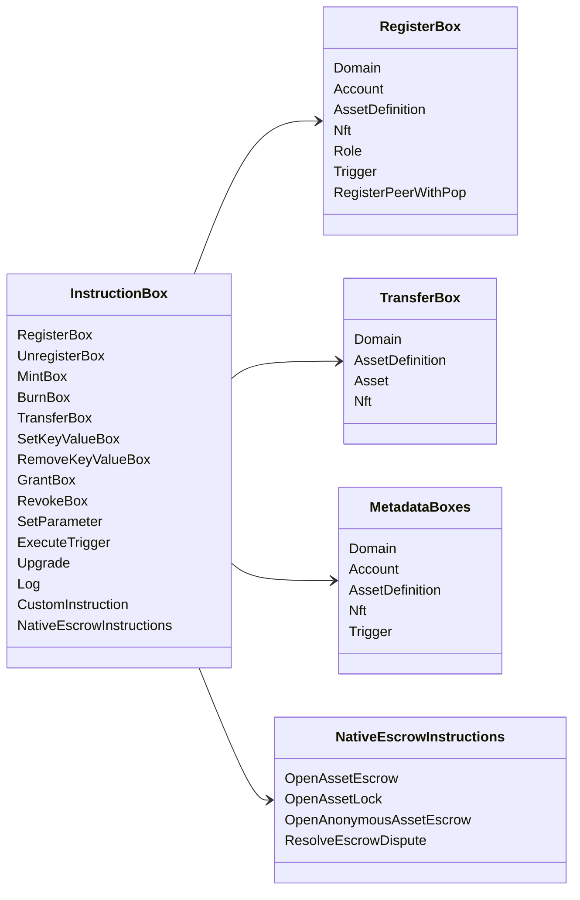

# Iroha خصوصی ہدایات {#iroha-special-instructions}

موجودہ ڈیٹا ماڈل ان بلٹ میں ہدایات کے خاندانوں کو بے نقاب کرتا ہے:

|تعلیم |متغیرات |
| --- | --- |
| [`RegisterBox`](/ur/blockchain/instructions.md#un-register) | `Domain`, `Account`, `AssetDefinition`, `Nft`, `Role`, `Trigger`, `RegisterPeerWithPop` |
| [`UnregisterBox`](/ur/blockchain/instructions.md#un-register) | `Peer`, `Domain`, `Account`, `AssetDefinition`, `Nft`, `Role`, `Trigger` |
| [`MintBox`](/ur/blockchain/instructions.md#mint-burn) |عددی `Asset` ، ٹرگر تکرار |
| [`BurnBox`](/ur/blockchain/instructions.md#mint-burn) |عددی `Asset` ، ٹرگر تکرار |
| [`TransferBox`](/ur/blockchain/instructions.md#transfer) |`Domain` ، `AssetDefinition`، عددی طور پر `Asset`، `Nft`|
| [`SetKeyValueBox`](/ur/blockchain/instructions.md#setkeyvalue-removekeyvalue) | `Domain`, `Account`, `AssetDefinition`, `Nft`, `Trigger` میٹا ڈیٹا |
| [`RemoveKeyValueBox`](/ur/blockchain/instructions.md#setkeyvalue-removekeyvalue) | `Domain`, `Account`, `AssetDefinition`, `Nft`, `Trigger` میٹا ڈیٹا |
| [`GrantBox`](/ur/blockchain/instructions.md#grant-revoke) | `Permission` (`Grant<Permission, Account>`), `Role` (`Grant<RoleId, Account>`), `RolePermission` (`Grant<Permission, Role>`) |
| [`RevokeBox`](/ur/blockchain/instructions.md#grant-revoke) | `Permission` (`Revoke<Permission, Account>`), `Role` (`Revoke<RoleId, Account>`), `RolePermission` (`Revoke<Permission, Role>`) |
| [`SetParameter`](/ur/blockchain/instructions.md#setparameter) |سلسلہ پیرامیٹر اپ ڈیٹ |
| [`ExecuteTrigger`](/ur/blockchain/instructions.md#executetrigger) |عملدرآمد کو متحرک کریں |
| [`Upgrade`](/ur/blockchain/instructions.md#other-instructions) |عملدرآمد اپ گریڈ |
| [`Log`](/ur/blockchain/instructions.md#other-instructions) |عملدرآمد لاگ اندراج |
| [`CustomInstruction`](/ur/blockchain/instructions.md#other-instructions) |عملدرآمد کنندہ کے لئے مخصوص JSON پے لوڈ |
| [مقامی اثاثہ جات کی ضمانت ](/ur/blockchain/escrow.md) | `OpenAssetEscrow`, `AcceptAssetEscrow`, `MarkEscrowPaymentSent`, `ReleaseAssetEscrow`, `CancelAssetEscrow`, `OpenEscrowDispute`, `ResolveEscrowDispute` |
| [عام اثاثوں کے تالے](/ur/blockchain/escrow.md#generic-asset-locks) |`OpenAssetLock` ، `DrawdownAssetLock`، `CancelAssetLock`، `ExpireAssetLock`|
| [گمنام اثاثوں کا ضامن](/ur/blockchain/escrow.md#anonymous-escrow) | `OpenAnonymousAssetEscrow`, `AcceptAnonymousAssetEscrow`, `MarkAnonymousEscrowPaymentSent`, `ReleaseAnonymousAssetEscrow`, `CancelAnonymousAssetEscrow`, `OpenAnonymousEscrowDispute`, `ResolveAnonymousEscrowDispute` |
| [ایٹمی نجی تصفیہ](/ur/blockchain/instructions.md#atomic-private-settlement) | `ActivatePrivateSettlementPoolV1`, `RotatePrivateSettlementPoolPolicyV1`, `FinalizeAtomicPrivateSettlementV1`, `AbortAtomicPrivateSettlementV1` |

اضافی Iroha 3 ماڈیول ڈومین مخصوص ہدایات کی اقسام کو ہدایات کے رجسٹری کے ذریعے درج کرسکتے ہیں۔ نوڈ کے فراہم کردہ اسکیما اور اسے محفوظ کرنے کے لیے استعمال ہونے والی کمانڈ کے لیے [ڈیٹا ماڈل اسکیم](./data-model-schema.md) دیکھیں۔

::: details خاکہ: بنیادی ہدایات خاندان

:::
