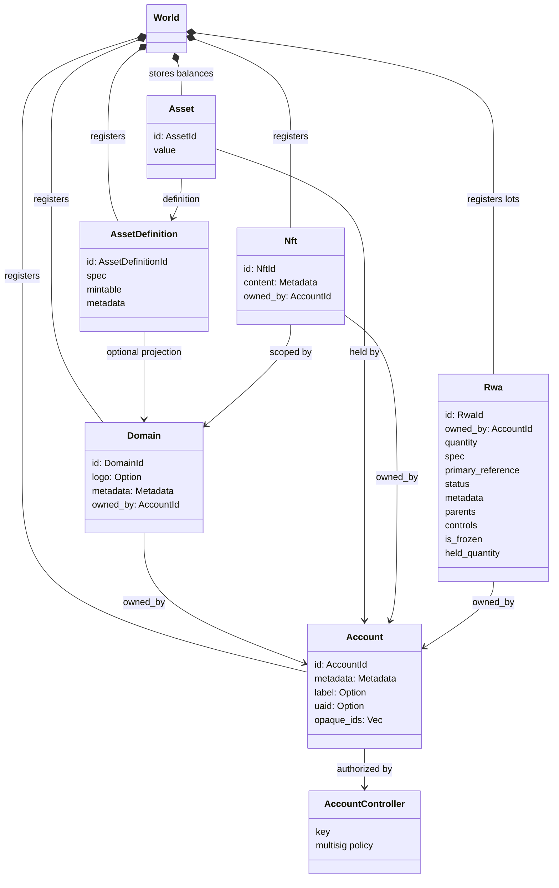
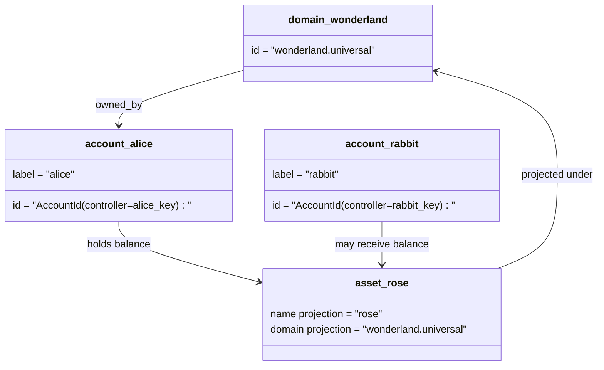

# Ma’lumotlar modeli {#data-model}

Iroha reyestr yozuvlarini `World` da saqlaydi. Birinchi reliz ma’lumotlar modeli quyidagi kanonik identifikator va subyektlardan foydalanadi:

- domenlar `payments.universal` kabi ma’lumotlar makoni bilan aniqlashtiriladi;
- hisoblar kanonik va domensiz; hisob identifikatori hisob boshqaruvchisidan hosil qilinadi
- aktiv ta’riflari domen/nom proyeksiyasini saqlashi mumkin, ammo ularning kanonik matn manzili yashirin Base58 identifikatoridir
- aktivlar — muayyan aktiv ta’rifi bo‘yicha hisoblarda saqlanadigan qoldiqlar;
- NFTs domen bilan aniqlashtirilgan identifikator va metama’lumot mazmuniga ega, yagona egali yozuvlardir
- RWAs hosil qilingan identifikatorli lotlar bo‘lib, joriy ega, miqdor, kelib chiqish, metama’lumot, ushlab turishlar, muzlatishlar va hayot sikli boshqaruvlari bilan zanjirdan tashqari aktivlarni ifodalaydi.

## Misol {#example}

Iroha 3 tarmog‘ida `wonderland.universal` — `universal` ma’lumotlar makonidagi domen. Bu misoldagi kanonik hisoblarni o‘z kalitlari yoki siyosatlari boshqaradi va ular domensiz I105 hisob identifikatorlari sifatida kodlanadi. `alice@wonderland.universal` kabi o‘qiladigan yorliqlar shu identifikatorlarga bog‘langan alohida taxalluslardir. Proyeksiya qilingan aktiv ta’rifi hanuz domen va nomdan, masalan `wonderland.universal` dagi `rose` dan boshlanadi, ammo uzatishda ishlatiladigan kanonik aktiv ta’rifi manzili hosil qilingan Base58 manzilidir.

## Taxalluslar {#aliases}

Taxalluslar kanonik reyestr identifikatorlari ustiga qo‘yiladigan, inson o‘qiy oladigan nomlardir. Ular API, CLI, hamyon va kuzatuvchi chegaralarida qulay, ammo qat’iy reyestr maydonlarida saqlanadigan barqaror qiymat kanonik identifikator bo‘lib qoladi.

| Subyekt | Kanonik nishon | O‘qiladigan shakl | Bog‘lanish modeli |
| -------------- | --------------------------------------------------- | ------------------------------------------------------ | ----------------------------------------------------------------------------- |
| Foydalanuvchi hisobi | I105 manzili sifatida kodlangan domensiz `AccountId` | `name@domain.dataspace` yoki `name@dataspace` | `AccountAlias`; asosiy taxallus `Account.label`, qo‘shimchalari esa bog‘lanishlardir |
| Aktiv ta’rifi | kanonik `AssetDefinitionId` Base58 manzili | `name#domain.dataspace` yoki `name#dataspace` | `AssetDefinitionAlias` aktiv ta’rifiga bog‘lanadi |
| Shartnoma | kanonik Bech32m `ContractAddress` | `name::domain.dataspace` yoki `name::dataspace` | `ContractAlias` joylashtirilgan shartnoma manziliga bog‘lanadi |
| Domen nomi | `domain.dataspace` shaklidagi `DomainId` | `domain.dataspace` | SNS `domain` nomlar makonidagi yozuv |
| Ma’lumotlar makoni nomi | faol Nexus katalogidagi raqamli `DataSpaceId` | `universal`, `paynet` yoki `zk` kabi ma’lumotlar makoni taxallusi | SNS `dataspace` nomlar makoni yozuvlari va faol ma’lumotlar makoni katalogi |

Hisob taxalluslari foydalanuvchiga ko‘rinadigan hisob nomlaridir. Taxallus global holat indekslari va hisob kalitini almashtirish yozuvlari orqali faol hisob identifikatoriga ishora qilgani uchun kalit almashtirilgandan keyin ham saqlanadi. Hisobning asosiy yorlig‘i uchun `SetPrimaryAccountAlias`, qo‘shimcha asosiy bo‘lmagan taxalluslar uchun `SetAccountAliasBinding`, o‘qish uchun esa `FindAccountByAlias` yoki `FindAliasesByAccountId` dan foydalaning. Hisob taxalluslari odatda `AcquireAccountAliasLease` bilan olinadigan va `RenewAccountAliasLease` bilan yangilanadigan faol SNS hisob-taxallus ijarasini talab qiladi.

Aktiv taxalluslari alohida hisob balanslarini emas, aktiv ta’riflarini nomlaydi. Aktiv va shartnoma taxalluslari o‘qiladigan nomni mavjud kanonik nishonga bevosita bog‘laydi. Aktiv taxalluslari `SetAssetDefinitionAlias` bilan o‘rnatiladi; taxallus nomi bo‘lagi aktiv ta’rifining ko‘rsatiladigan yoki proyeksiya qilingan nomiga mos kelishi shart. Shartnoma taxalluslari `SetContractAlias` bilan o‘rnatiladi; taxallusdagi ma’lumotlar makoni shartnoma manzilida kodlangan ma’lumotlar makoniga mos kelishi kerak. Har ikki bog‘lanish `lease_expiry_ms` ni saqlashi mumkin; imtiyozli muddat ham tugagach ular yechilmaydi va global holat indekslaridan olib tashlanadi.

Domenlarda alohida `DomainAlias` obyekti yo‘q. Domen identifikatorining o‘zi `payments.universal` kabi ma’lumotlar makoni bilan aniqlashtirilgan nomdir. SNS `domain` nomlar makonidagi domen nomlari va `dataspace` nomlar makonidagi ma’lumotlar makoni taxalluslari uchun ijara egaligini kuzatadi. Zaxiralangan `universal` ma’lumotlar makoni taxallusi ta’riflangan holda qolishi shart.

## Bog‘liq hujjatlar {#related-docs}

| Mavzu | Hujjat |
| -------------------------------------- | ------------------------------------------- |
|Domenlar | [Domenlar](/uz/blockchain/domains.md) |
| Hisoblar | [Hisoblar](/uz/blockchain/accounts.md) |
|Aktivlar | [Aktivlar](/uz/blockchain/assets.md) |
| NFTs | [NFTs](/uz/blockchain/nfts.md) |
|Haqiqiy dunyo aktivlari | [Haqiqiy dunyo aktivlari](/uz/blockchain/rwas.md) |
| Metama’lumotlar | [Metama’lumotlar](/uz/blockchain/metadata.md) |
| Ro‘yxatdan o‘tkazish va o‘tkazish ko‘rsatmalari | [Ko‘rsatmalar](/uz/blockchain/instructions.md) |
| Bajarish muhiti ruxsatlari | [Ruxsatlar](/uz/blockchain/permissions.md) |
| Nomlash qoidalari | [Nomlash qoidalari](/uz/reference/naming.md) |
