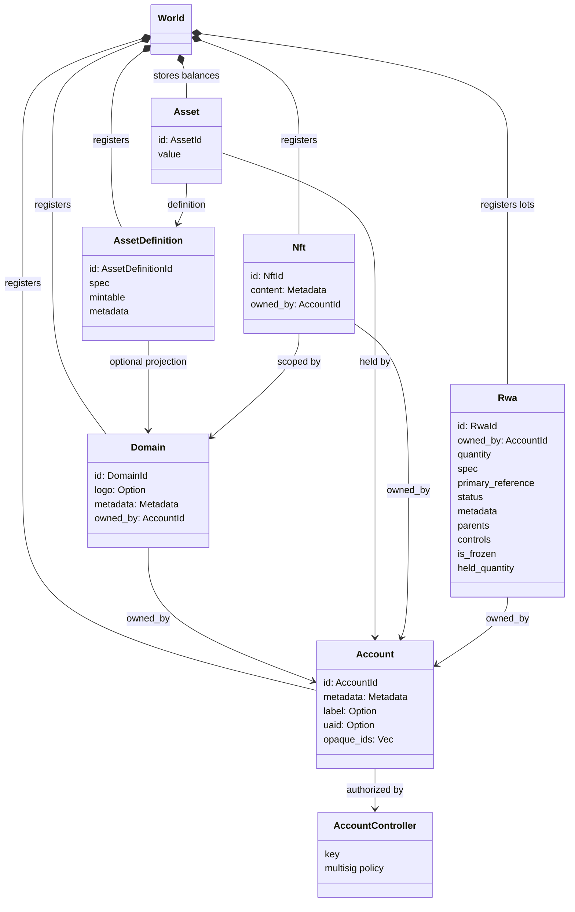
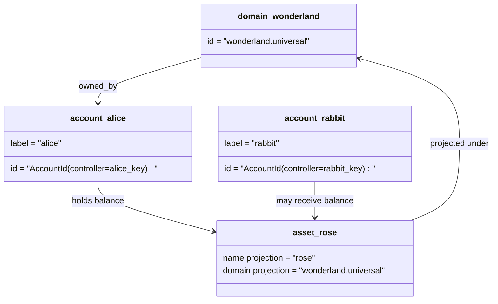

# Ma'lumotlar modeli {#data-model}

Iroha davlatda do'konlar katta `World`. Uning birinchi nashrdagi ma'lumotlar modeli foydalanadi
quyidagi kanonik identifikatsiyalar va entitetlar:

- domenlar ma'lumotlar maydonida malakali bo'ladi, masalan `payments.universal`
- hisoblar kanonik va domensiz; hisob ID (b) o'z navbatida
  hisob boshqaruvchisi
- aktivlarning ta'riflari domen/nom proyeksiyasini saqlab qolishi mumkin, ammo ularning kanonik
  matnli manzil shaffof bo'lmagan Base58 identifikatori hisoblanadi
- aktivlar - muayyan aktivni aniqlash uchun hisobvaraqlarda saqlangan saldolar
- NFTs domenlarga ega bo'lgan yagona hisoblar IDs va metadatalar
  mazmuni
- RWAs ishlab chiqariladi-ID to'lovlar bilan silsildan tashqaridagi aktivlarni ifodalaydigan lotlar
  egasi, miqdori, kelib chiqishi, metadatalar, saqlanishi, muzlatilishi va hayot davri
  nazoratlar

## Misol {#example}

Bir martalik Iroha 3 tarmoq, `wonderland.universal` o'z ichiga domain hisoblanadi
`universal` ma'lumotlar maydoni. Ushbu misoldagi kanonik hisoblar nazorat qilinadi
oʻz kalitlari yoki siyosatlari bilan kodlangan va domensiz I105 hisob IDs. O'qiladigan
maktublar: `alice@wonderland.universal` bularga bog'liq bo'lgan alohida aliaslar
IDs. Loyihalashtirilgan aktivni aniqlash hali ham domen va
nomi: `rose` yo'nalishi `wonderland.universal`, kanonik aktiv bo'lsa
simda ishlatiladigan ma'lumotlar manzili hosil qilingan Base58 manzili hisoblanadi.

## Nomlar {#aliases}

Aliaslar kanonik kitob identifikatorlari ustiga qatlamli inson yuziga o'xshash ismlardir.
Ular API, CLI, pul va kashfiyotchi chegaralari, lekin kanonik
IDs qat'iy daftar maydonlarida saqlangan barqaror identifikatorlar bo'lib qoladi.

| Nihoyat         | Kanonik maqsad                                    | Alias majoziycha                                          | Qo'llab-quvvatlash modeli                                                                 |
| -------------- | --------------------------------------------------- | ------------------------------------------------------ | ----------------------------------------------------------------------------- |
| Foydalanuvchi hisobi   | domensiz `AccountId` kodlangan I105 manzili   | `name@domain.dataspace` yoki `name@dataspace`            | `AccountAlias`; asosiy alias `Account.label`, qo'shimcha aliaslar bog'liq  |
| Assetning tavsiflanishi | kanonik `AssetDefinitionId` Base58 manzili     | `name#domain.dataspace` yoki `name#dataspace`            | `AssetDefinitionAlias` aktivni belgilash bilan bog'liq                           |
| Shartnoma       | kanonik Bech32m `ContractAddress`                 | `name::domain.dataspace` yoki `name::dataspace`          | `ContractAlias` ishga tushirilgan shartnoma manzili bilan bog'liq                          |
| Domen nomi    | `DomainId` yo'nalishi `domain.dataspace` shakli               | `domain.dataspace`                                    | SNS `domain` nomlar maydonining ro'yxati                                                 |
| Ma'lumotlar maydonining nomi | raqamli `DataSpaceId` faol Nexus katalog | ma'lumotlar maydonining aliaslari: `universal`, `paynet`, yoki `zk` | SNS `dataspace` nomlar maydonining rekordlari va faol ma'lumotlar maydonining kataloglari            |

Hisobvaraqning aliaslari foydalanuvchiga bog'liq hisob nomlaridir. Ular hisobdan omon qoladi
qayta tiklash , chunki alias aktiv hisob raqamiga ishora qiladi ID jahon davlatlari orqali
Indekslar va hisob raqamlari. `SetPrimaryAccountAlias` uchun
hisobning asosiy etiketi, `SetAccountAliasBinding` qo'shimcha non-primary uchun
aliaslar va `FindAccountByAlias` yoki `FindAliasesByAccountId` o'qish uchun.
Hisobvaraqning aliasi odatda faol SNS sotib olingan hisob-kitob ijara
bilan `AcquireAccountAliasLease` va yangilangan `RenewAccountAliasLease`.

Asset aliases nomli aktivlarning tavsiflari, alohida hisob raqamlarining saldi emas.
Aliaslar va shartnoma aliaslari o'qiladigan nomdan to'g'ridan-to'g'ri bog'liq
mavjud kanonik maqsad. Asset aliases `SetAssetDefinitionAlias`;
alias nomi segment aktiv ta'rifini ko'rsatuvchi nom bilan moslashishi kerak yoki
kontraktning aliaslari quyidagicha belgilanadi: `SetContractAlias`;
alias ma'lumotlar maydoni shartnoma manzilidagi kodlangan ma'lumot maydoniga mos kelishi kerak.
Ikkala bog'lanish ham olib borishi mumkin `lease_expiry_ms`; muddati tugaganidan so'ng ular yechishni to'xtatadi
Rahmat oynasi o'tib ketganda va dunyo davlatlari indekslaridan olib tashlanganida.

Domenlar alohida bo'lmagan `DomainAlias` Ob'ekt. Domen identifikatori
allaqachon ma'lumotlar maydonida malakali nom, masalan: `payments.universal`. SNS izlar
hududdagi domen nomlari uchun ijaraga olish huquqi `domain` nomlar maydonida va ma'lumotlar maydonida
nomlari `dataspace` Nomlar maydonida. `universal` ma'lumotlar maydonining aliaslari
belgilab qo'yilishi kerak.

## Tegishli hujjatlar {#related-docs}

| Mavzu                                  | Qayerga borishim kerak                                 |
| -------------------------------------- | ------------------------------------------- |
| Domenlar                                | [Domenlar](/uz/blockchain/domains.md)           |
| Hisobvaraqlar                               | [Hisobvaraqlar](/uz/blockchain/accounts.md)         |
| Aktivlar                                 | [Aktivlar](/uz/blockchain/assets.md)             |
| NFTs                                   | [NFTs](/uz/blockchain/nfts.md)                 |
| Haqiqiy dunyodagi aktivlar                      | [Haqiqiy dunyodagi aktivlar](/uz/blockchain/rwas.md)    |
| Metadatalar                               | [Metadatalar](/uz/blockchain/metadata.md)         |
| Ro'yxatdan o'tish va o'tkazish yo'l-yo'riqlari | [Ko'rsatmalar](/uz/blockchain/instructions.md) |
| Ishga tushirish uchun ruxsatnomalar                    | [Ruxsatnomalar](/uz/blockchain/permissions.md)   |
| Nomlash qoidalari                           | [Nomlash qoidalari](/uz/reference/naming.md)        |
