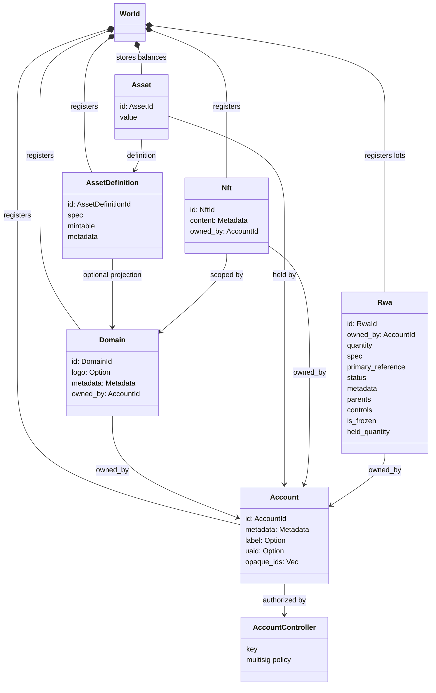
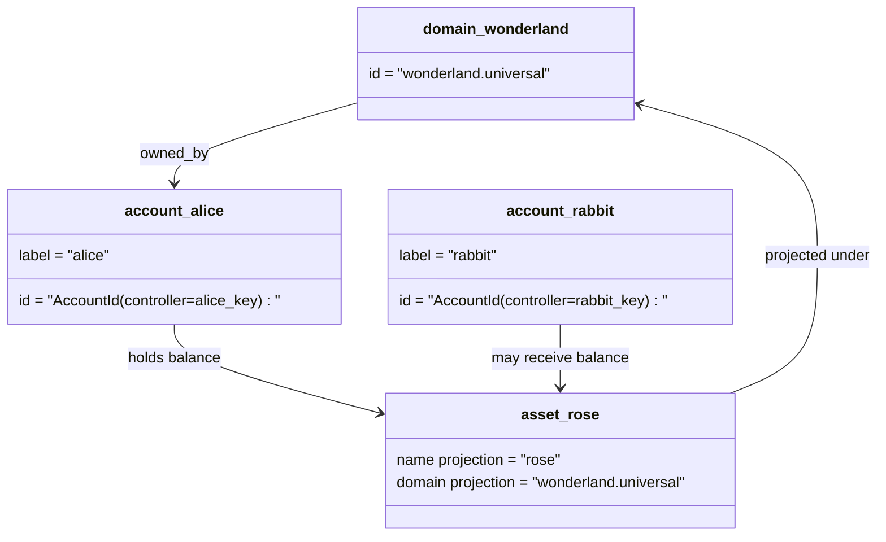

# Ma'lumotlar modeli {#data-model}

Iroha `World`da katta yozuvlarni saqlaydi. Uning birinchi nashrdagi ma'lumotlar modeli quyidagi kanonik identifikatsiyalar va entitetlardan foydalanadi:

- domenlar ma'lumotlar maydonidan iborat bo'ladi, masalan `payments.universal`
- hisoblar kanonik va domensiz bo'ladi; hisob ID hisobdan olingan
- Asset ta'riflari domen / nom proyeksiyasini saqlab qolishi mumkin, ammo ularning kanonik matn manzili shaffof Base58 identifikatori hisoblanadi
- aktivlar - muayyan aktivni belgilash bo'yicha hisobvaraqlarda saqlangan balanslar
- NFTs domen uchun malakali IDs va metadata tarkibiga ega bo'lgan yagona mulkdagi yozuvlardir.
- RWAs ishlab chiqarilgan- ID lotlar mavjud mulkdor, miqdor, kelib chiqishi, metadotlar, saqlash, muzlatish va hayot davri nazoratlari bilan zanjirdan tashqari aktivlarni ifodalaydi.

## Misol {#example}

Bir martalik Iroha 3 tarmoq, `wonderland.universal` o'z ichiga domain hisoblanadi `universal` Ushbu misoldagi kanonik hisoblar o'z kalitlari yoki siyosatlari bilan boshqariladi va domensiz sifatida kodlanadi I105 hisob IDs. O'qiladigan etiketlar: `alice@wonderland.universal` quyidagilarga bog'liq bo'lgan alohida aliaslar IDs. Proyekt qilingan aktivni belgilash hali ham domen va nomdan, masalan: `rose` yo'nalishida `wonderland.universal`, qadoqlashda qo'llaniladigan kanonik aktivni aniqlash manzili hosil qilingan Base58 manzili bo'lsa.

## O'zgacha nomlar {#aliases}

Aliaslar kanonik kitob identifikatorlari ustiga qatlamli inson yuzidagi nomlardir. Ular API, CLI, hamyon va qidiruvchi chegaralarida foydali bo'ladi; lekin kanonik IDs qat'iy daftar maydonlarida saqlangan barqaror identifikatorlar bo'lib qoladi.

|Nihoyat |Canonik maqsad |Ogoh boʻling .|Taraqqiyot modeli |
| -------------- | --------------------------------------------------- | ------------------------------------------------------ | ----------------------------------------------------------------------------- |
|Foydalanuvchi hisobi |I105 manzili sifatida kodlangan domensiz `AccountId` |`name@domain.dataspace` yoki `name@dataspace` |`AccountAlias`; asosiy alias - `Account.label`, qo'shimcha aliaslar bog'liqdir |
|Assetning aniqlanishi |kanonik `AssetDefinitionId` Base58 manzili |`name#domain.dataspace` yoki `name#dataspace` |`AssetDefinitionAlias` aktivni aniqlash bilan bog'liq |
|Shartnoma|kanonik Bech32m `ContractAddress` |`name::domain.dataspace` yoki `name::dataspace` |`ContractAlias` ishga tushirilgan shartnoma manzili bilan bog'liq |
|Domen nomi |`DomainId` shaklida `domain.dataspace` |`domain.dataspace` |SNS `domain` nomlar maydonida yozuv |
|Maʼlumotlar maydoni nomi |faol Nexus katalogidan raqamli `DataSpaceId` |`universal`, `paynet` yoki `zk` kabi ma'lumotlar maydonining aliasi |SNS `dataspace` nomlar maydonining rekordlari va faol ma'lumotlar maydonining kataloglari |

Hisobvaraq aliaslari foydalanuvchiga bog'liq hisob nomlaridir. Ular hisobni qayta tiklashdan omon qoladi, chunki alias aktiv hisobda ID dunyo davlatlari indekslari va hisobni qayta olish yozuvlari orqali ko'rsatkich beradi. Hisobvaraqning asosiy etiketi uchun `SetPrimaryAccountAlias`, qo'shimcha birinchi bo'lmagan aliaslar uchun `SetAccountAliasBinding` va o'qish uchun `FindAccountByAlias` yoki `FindAliasesByAccountId` dan foydalaning. Hisobvaraqlar uchun odatda `AcquireAccountAliasLease` bilan sotib olingan va `RenewAccountAliasLease` bilan yangilangan faol SNS hisob aliasi ijaraga olish kerak.

Asset aliases - har bir hisobda qoldiqlar emas, balki aktivlarning nomi bilan ta'riflangan. Asset aliases va kontrakt aliases - bu o'qiladigan nomdan mavjud kanonik maqsadga to'g'ridan-to'g'ri bog'lanishdir. Asset aliases: `SetAssetDefinitionAlias`; alias nomi segment aktivni ta'rif namoyi ko'rsatiladigan nom yoki prognoz qilingan ta'rif nomi bilan moslashishi kerak. `SetContractAlias`; Alias ma'lumotlar maydoni shartnoma manzilida kodlangan ma'lumot maydoniga mos kelishi kerak. Ikkala bog'lanish ham `lease_expiry_ms`; muddati tugaganidan so'ng, ular o'zgarishni to'xtatadilar va dunyo davlatlari indekslaridan olib tashlanadilar.

Domenlar alohida `DomainAlias` ob'ektiga ega emas. domen identifikatori allaqachon `payments.universal` kabi ma'lumotlar maydonida malakali nomdir. SNS `domain` nomlar maydonidagi domen nomlari va `dataspace` nomlar maydonidagi ma'lumot maydonining aliaslari uchun ijara egasini kuzatadi. Qo'riqlangan `universal` ma'lumotlar maydonining aliasi aniqlanishi kerak.

## Aloqaviy hujjatlar {#related-docs}

|Mavzu |Qayerga borish kerak ?|
| -------------------------------------- | ------------------------------------------- |
|Domenlar | [Domenlar](/uz/blockchain/domains.md) |
|Hisobotlar | [Hisobotlar](/uz/blockchain/accounts.md) |
|Aktivlar | [Aktivlar](/uz/blockchain/assets.md) |
|NFTs | [NFTs](/uz/blockchain/nfts.md) |
|Haqiqiy aktivlar | [Real dunyo aktivlari](/uz/blockchain/rwas.md) |
|Metadotlar | [Metadatalar](/uz/blockchain/metadata.md) |
|Ro ' yxatga olish va o ' tkazish yo ' riqnomalari | [Ko'rsatmalar](/uz/blockchain/instructions.md) |
|Ishga tushirish uchun ruxsatlar | [Ruxsatlar](/uz/blockchain/permissions.md) |
|Nomlashtirish qoidalari | [Nomlash qoidalari](/uz/reference/naming.md) |
