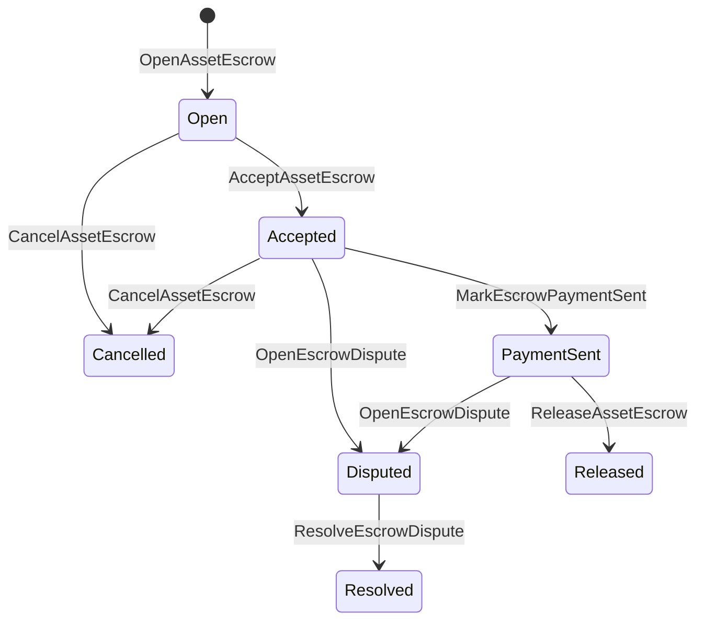

# Mahalliy aktiv eskrousi {#native-asset-escrow}

Mahalliy eskrou — raqamli aktivlar uchun reyestr boshqaradigan saqlov mexanizmi. Aktivlarni ilovaga tegishli hisobga yuborib, shu hisobni himoyalash mantiqini ilova kodida yuritish o‘rniga, eskrou ISIs qiymatni deterministik protokol saqlov hisobiga o‘tkazadi va eskrouning hayot siklini global holatda qayd etadi.

Mahalliy eskroudan bozor hisob-kitoblari, Aitai uslubidagi zanjirdan tashqari to‘lovlarni muvofiqlashtirish, bosqichli qulflar hamda hayot sikli holati reyestrda ko‘rinishi kerak bo‘lgan himoyalangan eskrou jarayonlari uchun foydalaning.

## Tushunchalar {#concepts}

|Tushuncha |Tavsifi |
| --- | --- |
|`EscrowId` |Chaqiruvchi tanlaydigan, xeshni o‘rab turuvchi identifikator. U shaffof va anonim eskroular bo‘ylab yagona bo‘lishi shart. |
|`AssetEscrowRecord` |Shaffof raqamli aktiv eskrousi yoki qulf yozuvi. |
|`AnonymousAssetEscrowRecord` |Nullifikatorlar, majburiyatlar va isbotlar bilan ta’minlangan himoyalangan eskrou yozuvi. |
|Saqlov hisobi |Eskrou identifikatori va aktiv ta’rifidan hosil qilinadigan deterministik protokol hisobi. |
|Dalil xeshi |Hisob-faktura, sud qarori, xabar, saqlov manifesti yoki zanjirdan tashqari boshqa dalilni belgilashi mumkin. Dalilning o‘zi eskrouda saqlanmaydi. |

Shaffof yozuvlar sotuvchi, ixtiyoriy xaridor, aktiv ta’rifi, umumiy miqdor, saqlov hisobi, hayot sikli holati, xatti-harakat turi, qolgan miqdor, ixtiyoriy chiqarish vakolati, ixtiyoriy amal qilish muddati, dalil xeshlari, vaqt belgilari va ixtiyoriy yechim ma’lumotlarini o‘z ichiga oladi.

Eskrou miqdori musbat raqamli aktiv miqdori bo‘lishi va aktiv ta’rifining raqamli xususiyatlariga mos kelishi shart. Eskrou yoki qulf faol ekan, oddiy aktiv o‘tkazmalari saqlov hisobini bo‘shata olmaydi; saqlovdan chiqishning yagona yo‘llari quyida ko‘rsatilgan eskrou ISIs hisoblanadi.

## Bozor eskrousi {#marketplace-escrow}

Bozor eskrousi zanjirdagi aktivni zanjirdan tashqari to‘lov yoki yetkazib berish jarayoni bilan bog‘laydi.



|ISI |Kim yuboradi |Ta’siri|
| --- | --- | --- |
|`OpenAssetEscrow` |Sotuvchi |Sotuvchining raqamli aktivini protokol saqlovida qulflaydi va `Open` holatidagi bozor yozuvini yaratadi. |
|`AcceptAssetEscrow` |Xaridor |Xaridorni qayd etib, `Open` holatini `Accepted` ga o‘tkazadi. Sotuvchi o‘z eskrousini qabul qila olmaydi. |
|`MarkEscrowPaymentSent` |Qabul qilingan xaridor |Xaridor zanjirdan tashqari haqni yuborgach, `Accepted` holatini `PaymentSent` ga o‘tkazadi. |
|`ReleaseAssetEscrow` |Sotuvchi |`PaymentSent` holatini `Released` ga o‘tkazadi va eskroudagi butun miqdorni xaridorga beradi. |
|`CancelAssetEscrow` |Sotuvchi |`Open` yoki `Accepted` holatini `Cancelled` ga o‘tkazadi va haq yuborilgani belgilanmasidan oldin aktivni sotuvchiga qaytaradi. |
|`OpenEscrowDispute` |Sotuvchi yoki qabul qilingan xaridor |`Accepted` yoki `PaymentSent` holatini `Disputed` ga o‘tkazib, dalil xeshlarini qo‘shadi. |
|`ResolveEscrowDispute` |`CanResolveEscrowDispute` vakolatiga ega hisob |`Disputed` holatini `Resolved` ga o‘tkazadi va miqdorni xaridor bilan sotuvchi o‘rtasida taqsimlaydi. |

Nizoni hal qilish miqdorlari manfiy bo‘lmasligi va `buyer_amount + seller_amount` eskrou miqdoriga teng bo‘lishi shart. Nol miqdorli ulushlarga ruxsat beriladi, biroq jami taqsimot qulflangan balansni to‘liq qoplashi kerak.

### Rust Misol {#rust-example}

Bu misolda sotuvchi va xaridor hisoblari allaqachon mavjud, aktiv ta’rifi raqamli sifatida ro‘yxatdan o‘tgan va sotuvchining balansi yetarli deb hisoblanadi.

```rust
use iroha::{
    client::Client,
    data_model::{
        isi::escrow::{
            AcceptAssetEscrow, MarkEscrowPaymentSent, OpenAssetEscrow,
            ReleaseAssetEscrow,
        },
        prelude::*,
    },
};
use iroha_crypto::Hash;

fn release_marketplace_escrow(
    seller_client: &Client,
    buyer_client: &Client,
    asset_definition_id: AssetDefinitionId,
) -> eyre::Result<()> {
    let escrow_id = EscrowId::new(Hash::new("docs-marketplace-escrow-001"));

    seller_client.submit_blocking(OpenAssetEscrow::with_evidence_hashes(
        escrow_id,
        asset_definition_id,
        Numeric::from(40_u64),
        vec![Hash::new("invoice:2026-001")],
    ))?;

    buyer_client.submit_blocking(AcceptAssetEscrow::new(escrow_id))?;
    buyer_client.submit_blocking(MarkEscrowPaymentSent::new(escrow_id))?;
    seller_client.submit_blocking(ReleaseAssetEscrow::new(escrow_id))?;

    let record = seller_client.query_single(FindAssetEscrowById::new(escrow_id))?;
    assert_eq!(record.status, AssetEscrowStatus::Released);
    assert_eq!(record.remaining_amount, Numeric::zero());

    Ok(())
}
```

## Umumiy aktiv qulflari {#generic-asset-locks}

Aktiv qulflari ayni saqlov yozuvi turidan foydalanadi, ammo ular xaridor va sotuvchi o‘rtasidagi takliflar emas. Ular belgilangan hisob uchun mablag‘ni qulflaydi va mablag‘ni yechish uchun alohida chiqarish vakolatini talab qiladi.

|ISI |Kim yuboradi |Ta’siri |
| --- | --- | --- |
|`OpenAssetLock` |Manba hisobi |Musbat miqdorni qulflaydi, maqsad hisobni yozuv xaridori sifatida qayd etadi va holatni `Locked` ga o‘rnatadi. |
|`DrawdownAssetLock` |Chiqarish vakolati yoki u ko‘rsatilmagan bo‘lsa maqsad hisob |Qolgan saqlovni qisman yoki butunlay maqsad hisobga o‘tkazadi. |
|`CancelAssetLock` |Qulfni ochgan hisob |Aktiv qulfini bekor qiladi va qolgan miqdorni uni ochgan hisobga qaytaradi. |
|`ExpireAssetLock` |Muddat tugagach istalgan tranzaksiya vakolati |`expires_at_ms` vaqti o‘tgan qulfni tugatadi va qolgan miqdorni uni ochgan hisobga qaytaradi. |

`DrawdownAssetLock` biror miqdor qolgan ekan, yozuvni `Locked` holatida saqlaydi. Qolgan miqdor nolga yetganda holat `DrawnDown` bo‘ladi va yozuv yopiladi.

```rust
use iroha::{
    client::Client,
    data_model::{
        isi::escrow::{CancelAssetLock, DrawdownAssetLock, ExpireAssetLock, OpenAssetLock},
        prelude::*,
    },
};
use iroha_crypto::Hash;

fn drawdown_and_close_asset_locks(
    opener_client: &Client,
    destination_client: &Client,
    release_authority_client: &Client,
    asset_definition_id: AssetDefinitionId,
    destination: AccountId,
    release_authority: AccountId,
) -> eyre::Result<()> {
    let trusted_lock_id = EscrowId::new(Hash::new("docs-asset-lock-trusted"));

    opener_client.submit_blocking(OpenAssetLock::with_options(
        trusted_lock_id,
        asset_definition_id.clone(),
        destination.clone(),
        Numeric::from(40_u64),
        Some(release_authority),
        None,
        vec![Hash::new("milestone-plan-v1")],
    ))?;

    release_authority_client.submit_blocking(DrawdownAssetLock::new(
        trusted_lock_id,
        Numeric::from(15_u64),
    ))?;

    let partially_drawn =
        opener_client.query_single(FindAssetEscrowById::new(trusted_lock_id))?;
    assert_eq!(partially_drawn.status, AssetEscrowStatus::Locked);
    assert_eq!(partially_drawn.remaining_amount, Numeric::from(25_u64));

    opener_client.submit_blocking(CancelAssetLock::new(trusted_lock_id))?;
    let cancelled = opener_client.query_single(FindAssetEscrowById::new(trusted_lock_id))?;
    assert_eq!(cancelled.status, AssetEscrowStatus::Cancelled);

    let expiring_lock_id = EscrowId::new(Hash::new("docs-asset-lock-expiring"));
    opener_client.submit_blocking(OpenAssetLock::with_options(
        expiring_lock_id,
        asset_definition_id,
        destination,
        Numeric::from(10_u64),
        None,
        Some(0),
        Vec::new(),
    ))?;

    destination_client.submit_blocking(ExpireAssetLock::new(expiring_lock_id))?;
    let expired = opener_client.query_single(FindAssetEscrowById::new(expiring_lock_id))?;
    assert_eq!(expired.status, AssetEscrowStatus::Expired);

    Ok(())
}
```

Python hozir umumiy qulflar uchun yuqori darajali `open_asset_lock`, `drawdown_asset_lock`, `cancel_asset_lock` va `expire_asset_lock` yordamchilarini taqdim etadi. Python-da bozor yoki anonim eskrou yaratish uchun SDK-ning JSON o‘tish yo‘li orqali kanonik `InstructionBox` JSON qiymatidan foydalaning yoxud eskrou uchun birinchi darajali tuzuvchilarni taqdim etadigan SDK orqali yuboring.

## Nizolar {#disputes}

Bozor eskrousi `Accepted` yoki `PaymentSent` holatidan nizoga o‘tishi mumkin. Nizoni faqat qayd etilgan sotuvchi yoki xaridor ochadi. Uni hal qilish uchun yechuvchi hisobga bevosita berilgan yoki rol orqali meros bo‘lgan `CanResolveEscrowDispute` vakolati talab etiladi.

```rust
use iroha::{
    client::Client,
    data_model::{
        isi::escrow::{OpenEscrowDispute, ResolveEscrowDispute},
        prelude::*,
    },
};
use iroha_crypto::Hash;
use iroha_executor_data_model::permission::escrow::CanResolveEscrowDispute;

fn resolve_disputed_escrow(
    admin_client: &Client,
    buyer_client: &Client,
    court_client: &Client,
    court: AccountId,
    escrow_id: EscrowId,
) -> eyre::Result<()> {
    admin_client.submit_blocking(Grant::account_permission(
        Permission::from(CanResolveEscrowDispute),
        court,
    ))?;

    buyer_client.submit_blocking(OpenEscrowDispute::with_evidence_hashes(
        escrow_id,
        vec![Hash::new("buyer-payment-receipt")],
    ))?;

    court_client.submit_blocking(ResolveEscrowDispute::with_evidence_hashes(
        escrow_id,
        Numeric::from(30_u64),
        Numeric::from(10_u64),
        vec![Hash::new("court-judgement-001")],
    ))?;

    let record = admin_client.query_single(FindAssetEscrowById::new(escrow_id))?;
    assert_eq!(record.status, AssetEscrowStatus::Resolved);
    assert_eq!(
        record.resolution.as_ref().map(|resolution| resolution.buyer_amount.clone()),
        Some(Numeric::from(30_u64)),
    );

    Ok(())
}
```

## Anonim eskrou {#anonymous-escrow}

Anonim eskrou bozor eskrousi bilan bir xil hayot siklidan foydalanadi, ammo uni moliyalashtirish va yopishdagi aktiv harakatlari himoyalangan. Ochiq yozuvda sotuvchi, xaridor, holat, dalil xeshlari, vaqt belgilari va isbotga bog‘langan harakat yozuvlari saqlanadi. Himoyalangan notalardagi miqdor va oluvchilar majburiyatlar, nullifikatorlar va isbot ilovalari bilan ifodalanadi.

|Ochiq ISI |Anonim ISI |
| --- | --- |
|`OpenAssetEscrow` |`OpenAnonymousAssetEscrow` |
|`AcceptAssetEscrow` |`AcceptAnonymousAssetEscrow` |
|`MarkEscrowPaymentSent` |`MarkAnonymousEscrowPaymentSent` |
|`ReleaseAssetEscrow` |`ReleaseAnonymousAssetEscrow` |
|`CancelAssetEscrow` |`CancelAnonymousAssetEscrow` |
|`OpenEscrowDispute` |`OpenAnonymousEscrowDispute` |
|`ResolveEscrowDispute` |`ResolveAnonymousEscrowDispute` |

Hamyon yoki isbotlovchi vosita isbot ilovasi va ochiq kirishlarni yaratishi shart. Eskrouni ochish aynan bitta eskrou majburiyatini yaratadi. Chiqarish, bekor qilish va anonim nizoni hal etish aynan shu bitta majburiyatni sarflab, amal talabiga qarab xaridor, sotuvchi yoki taqsimlangan chiqish majburiyatlarini yaratishi kerak.

```rust
use iroha::{
    client::Client,
    data_model::{
        isi::escrow::{
            AcceptAnonymousAssetEscrow, MarkAnonymousEscrowPaymentSent,
            OpenAnonymousAssetEscrow,
        },
        prelude::*,
        proof::ProofAttachment,
    },
};
use iroha_crypto::Hash;

fn open_anonymous_escrow(
    seller_client: &Client,
    buyer_client: &Client,
    escrow_id: EscrowId,
    asset_definition_id: AssetDefinitionId,
    funding_nullifiers: Vec<[u8; 32]>,
    escrow_commitment: [u8; 32],
    proof: ProofAttachment,
    root_hint: Option<[u8; 32]>,
) -> eyre::Result<()> {
    seller_client.submit_blocking(OpenAnonymousAssetEscrow::with_evidence_hashes(
        escrow_id,
        asset_definition_id,
        funding_nullifiers,
        escrow_commitment,
        proof,
        root_hint,
        vec![Hash::new("shielded-invoice")],
    ))?;

    buyer_client.submit_blocking(AcceptAnonymousAssetEscrow::new(escrow_id))?;
    buyer_client.submit_blocking(MarkAnonymousEscrowPaymentSent::new(escrow_id))?;

    Ok(())
}
```

Asosiy himoyalangan tranzaksiya modeli uchun [Anonim tranzaksiyalar](/uz/blockchain/anonymous-transactions.md) bo‘limiga qarang.

## SDK dan foydalanish {#sdk-usage}

Eskrou qo‘llab-quvvatlashi SDKs bo‘yicha turlicha taqdim etiladi. Rust kanonik tiplashtirilgan ma’lumotlar modeliga ega. Python hozircha umumiy aktiv qulfi yordamchilarini taqdim etadi. JavaScript va TypeScript Kotodama eskrou mezbon chaqiruvlaridan foydalanadi. Kotlin/JVM va Swift bozor hamda anonim eskrou uchun tiplashtirilgan foydali yuk tuzuvchilarini beradi.

| SDK | Foydalaniladigan interfeys | Qamrov |
| --- | --- | --- |
| [Rust](#rust-sdk) | `iroha::data_model::isi::escrow` | Bozor eskrousi, umumiy qulflar, anonim eskrou, so‘rovlar va hodisalar. |
| [Python](#python-asset-locks) | `Instruction.open_asset_lock`, `TransactionDraft.open_asset_lock` va mijozdagi `*_and_wait` yordamchilari | Umumiy aktiv qulflari. Bozor va anonim eskrou yordamchilari hali birinchi darajali Python usullari emas. |
| [JavaScript / TypeScript](#javascript-and-typescript-kotodama) | `@iroha/iroha-js/kotodama-compiler` dagi `compileKotodamaProgram` | Kotodama shartnomalari ichidagi eskrou mezbon chaqiruvlari. |
| [Kotlin / JVM](#kotlin-and-jvm) | `org.hyperledger.iroha.sdk.core.model.instructions` dagi `InstructionTemplate` sinflari | Bozor va anonim eskrouning maxsus ko‘rsatma shablonlari. |
| [Swift / iOS](#swift-and-ios) | `NativeEscrowInstructionBuilders` va `IrohaSDK.build*Escrow*` yordamchilari | Bozor va anonim eskrou uchun Norito JSON ko‘rsatma foydali yuklari. |

Quyidagi misollar ko‘rsatmalarni tuzishga qaratilgan. Hisobni mablag‘ bilan ta’minlash, imzolarni boshqarish va tranzaksiyani yuborish har bir SDK ning odatiy jarayoniga amal qiladi.

### Rust SDK {#rust-sdk}

Mahalliy imkoniyatlarning to‘liq qamrovi yoki so‘rov va hodisa qo‘llab-quvvatlashi kerak bo‘lsa, Rust SDK dan foydalaning. Yuqoridagi misollar `iroha::data_model::isi::escrow` yordamida bozor eskrousini bo‘shatish, umumiy qulfdan mablag‘ yechish, nizoni hal qilish va anonim eskrou tuzishni ko‘rsatadi.

```rust
use iroha::{
    client::Client,
    data_model::{isi::escrow::OpenAssetEscrow, prelude::*},
};
use iroha_crypto::Hash;

fn open_and_read(
    client: &Client,
    asset_definition_id: AssetDefinitionId,
) -> eyre::Result<AssetEscrowRecord> {
    let escrow_id = EscrowId::new(Hash::new("docs-rust-sdk-escrow"));

    client.submit_blocking(OpenAssetEscrow::new(
        escrow_id,
        asset_definition_id,
        Numeric::from(10_u64),
    ))?;

    client.query_single(FindAssetEscrowById::new(escrow_id))
}
```

### Python aktiv qulflari {#python-asset-locks}

Python SDK umumiy aktiv qulflari uchun birinchi darajali yordamchilarni taqdim etadi. Ulardan bosqichma-bosqich to‘lovlar, bo‘shatish vakolati bajaradigan yechimlar, ochuvchining bekor qilishi va muddat tugagandagi qaytarishlar uchun foydalaning.

```python
client.open_asset_lock_and_wait(
    chain_id="dev-chain",
    authority="<source-account-id>",
    private_key_hex="<source-private-key-hex>",
    escrow_id="merchant-lock-001",
    asset_definition_id="<asset-definition-base58>",
    destination="<destination-account-id>",
    amount="2500",
    release_authority="<trusted-release-account-id>",
    expires_at_ms=1_704_000_000_000,
)

client.drawdown_asset_lock_and_wait(
    chain_id="dev-chain",
    authority="<trusted-release-account-id>",
    private_key_hex="<trusted-release-private-key-hex>",
    escrow_id="merchant-lock-001",
    amount="1000",
)

client.expire_asset_lock_and_wait(
    chain_id="dev-chain",
    authority="<any-account-id>",
    private_key_hex="<any-private-key-hex>",
    escrow_id="merchant-lock-001",
)
```

Ikki tomonli qulfda `release_authority` ni kiritmang; shunda maqsad hisob `drawdown_asset_lock` ni yuborishi mumkin.

### JavaScript va TypeScript Kotodama {#javascript-and-typescript-kotodama}

JavaScript SDK hozir mahalliy eskrou tranzaksiyalarining bevosita tuzuvchilarini taqdim etmaydi. Kotodama shartnomalarini joylashtiradigan JavaScript yoki TypeScript ilovalarida eskrou mezbon chaqiruvlarini Kotodama kompilyatori bilan yig‘ing.

Mahalliy eskrou mezbon chaqiruvlari aniq kirish ko‘rsatmalarini talab qiladi, chunki kompilyator yashirin eskrou ISIs uchun torroq kirish majmuasini hosil qila olmaydi. `escrow_*` ichki amallarini chaqiradigan eksport qilingan kirish nuqtalarida umumiy ko‘rsatmalardan foydalaning.

```js
import { compileKotodamaProgram } from "@iroha/iroha-js/kotodama-compiler";

const source = `
seiyaku MarketplaceEscrow {
  meta { abi_version: 1; }

  #[access(read="*", write="*")]
  kotoage fn run() permission(Admin) {
    let asset = asset_definition("62Fk4FPcMuLvW5QjDGNF2a4jAmjM");
    let offer = name("aitai_offer");
    let evidence = norito_bytes("00");

    call escrow_open_offer(offer, asset, 10, evidence);
    call escrow_accept(offer);
    call escrow_mark_payment_sent(offer);
    call escrow_release(offer);
  }
}
`;

const compiled = compileKotodamaProgram(source, {
  sourceName: "escrow.ko",
});

if (compiled.diagnostics.length > 0) {
  throw new Error(compiled.diagnostics.map((item) => item.message).join("\n"));
}
```

Nizolar uchun `escrow_open_dispute(offer, evidence)` va `escrow_resolve_dispute(offer, buyer_amount, seller_amount, evidence)` dan foydalaning. Anonim eskrou mezbon chaqiruvlari Norito so‘rov foydali yuki baytlarini qabul qiladi; masalan, `anonymous_escrow_open_offer(request)`.

### Kotlin va JVM {#kotlin-and-jvm}

Kotlin/JVM SDK mahalliy eskrouni maxsus ko‘rsatma shablonlari sifatida modellashtiradi. Har bir shablon majburiy maydonlarni tekshiradi va tranzaksiya tuzuvchisi ishlatadigan kanonik argumentlar xaritasini taqdim etadi.

```kotlin
import org.hyperledger.iroha.sdk.core.model.escrow.NativeEscrowPermissions
import org.hyperledger.iroha.sdk.core.model.instructions.AcceptAssetEscrowInstruction
import org.hyperledger.iroha.sdk.core.model.instructions.MarkEscrowPaymentSentInstruction
import org.hyperledger.iroha.sdk.core.model.instructions.OpenAssetEscrowInstruction
import org.hyperledger.iroha.sdk.core.model.instructions.ReleaseAssetEscrowInstruction
import org.hyperledger.iroha.sdk.core.model.instructions.ResolveEscrowDisputeInstruction

val open = OpenAssetEscrowInstruction(
    escrowId = "escrow-hash",
    assetDefinition = "xor#wonderland",
    amount = "42.5",
    evidenceHashes = listOf("invoice-hash"),
)
val accept = AcceptAssetEscrowInstruction("escrow-hash")
val paid = MarkEscrowPaymentSentInstruction("escrow-hash")
val release = ReleaseAssetEscrowInstruction("escrow-hash")
val resolve = ResolveEscrowDisputeInstruction(
    escrowId = "escrow-hash",
    buyerAmount = "30",
    sellerAmount = "12.5",
    evidenceHashes = listOf("judgement-hash"),
)

println(open.arguments)
println(NativeEscrowPermissions.CAN_RESOLVE_ESCROW_DISPUTE)
```

Anonim shablonlar `OpenAnonymousAssetEscrowInstruction`, `AcceptAnonymousAssetEscrowInstruction`, `MarkAnonymousEscrowPaymentSentInstruction`, `ReleaseAnonymousAssetEscrowInstruction`, `CancelAnonymousAssetEscrowInstruction`, `OpenAnonymousEscrowDisputeInstruction` va `ResolveAnonymousEscrowDisputeInstruction` nomlari bilan mavjud. Android Java chaqiruvchilari Android artefaktidagi mos `NativeEscrowInstructions.*` tuzuvchilaridan foydalanishi mumkin.

### Swift va iOS {#swift-and-ios}

Swift SDK eskrou ko‘rsatmalarini Norito JSON foydali yuklari sifatida tuzadi. `NativeEscrowInstructionBuilders` dan bevosita foydalaning yoki ilovangizda `IrohaSDK` nusxasi mavjud bo‘lsa, unga teng `IrohaSDK.build*Escrow*` yordamchisini chaqiring.

```swift
import IrohaSwift

let open = try NativeEscrowInstructionBuilders.openAssetEscrow(
    escrowId: "escrow-hash",
    assetDefinition: "xor#wonderland",
    amount: "42.5",
    evidenceHashes: ["invoice-hash"]
)
let accept = try NativeEscrowInstructionBuilders.acceptAssetEscrow(
    escrowId: "escrow-hash"
)
let paid = try NativeEscrowInstructionBuilders.markEscrowPaymentSent(
    escrowId: "escrow-hash"
)
let release = try NativeEscrowInstructionBuilders.releaseAssetEscrow(
    escrowId: "escrow-hash"
)
let resolve = try NativeEscrowInstructionBuilders.resolveEscrowDispute(
    escrowId: "escrow-hash",
    buyerAmount: "30",
    sellerAmount: "12.5",
    evidenceHashes: ["judgement-hash"]
)
```

Anonim Swift tuzuvchilari nullifikatorlar ro‘yxati, natija majburiyatlari ro‘yxati, isbot lug‘ati va ixtiyoriy `rootHint` qiymatlarini qabul qiladi. Nizoni hal qiluvchi ruxsat tokeni `NativeEscrowPermissions.canResolveEscrowDispute` sifatida mavjud.

## So‘rovlar va hodisalar {#queries-and-events}

Holat sahifalari, solishtirish vazifalari va yordam vositalari uchun eskrou so‘rovlaridan foydalaning:

| So‘rov | Vazifasi |
| --- | --- |
| `FindAssetEscrowById` | Bitta oshkora eskrou yoki qulfni `EscrowId` bo‘yicha o‘qish. |
| `FindAssetEscrows` | Oshkora eskrou va qulf yozuvlarini ro‘yxatlash. |
| `FindAssetEscrowsBySeller` | Sotuvchi yoki qulf ochuvchisi yaratgan yozuvlarni ro‘yxatlash. |
| `FindAssetEscrowsByBuyer` | Xaridor qabul qilgan bozor eskroularini yoki maqsad hisobga yo‘naltirilgan qulflarni ro‘yxatlash. |
| `FindAssetEscrowsByStatus` | Yozuvlarni `AssetEscrowStatus` bo‘yicha ro‘yxatlash. |
| `FindAnonymousAssetEscrowById` | Bitta anonim eskrouni `EscrowId` bo‘yicha o‘qish. |
| `FindAnonymousAssetEscrows*` | Anonim eskroularni barcha yozuvlar, sotuvchi, xaridor yoki holat bo‘yicha ro‘yxatlash. |

`EscrowEventFilter` eskrou identifikatori, sotuvchi, xaridor, holat va hodisalar majmuasi niqobi bo‘yicha oshkora mahalliy eskrou hamda qulf hodisalariga obuna bo‘la oladi. Hodisalar oilasiga `Opened`, `Accepted`, `PaymentSent`, `Released`, `Cancelled`, `Expired`, `Disputed` va `Resolved` kiradi. Anonim eskrou yozuvlari anonim eskrou so‘rovlari orqali tekshiriladi.

## Ishlatishga oid qaydlar {#operational-notes}

- Katta hisob-fakturalar, suhbat jurnallari, qarorlar yoki tekshiruv paketlarini eskrou yozuvidan tashqarida saqlang va ularning xeshlarini dalil sifatida biriktiring.
- Ilovalarda `EscrowId` ni barqaror hosil qiling, shunda qayta urinishlar bitta taklif uchun takroriy eskrou yarata olmaydi.
- `CanResolveEscrowDispute` ni faqat nizo jarayonini boshqaradigan hisoblar yoki rollarga bering.
- Zanjirdan tashqari to‘lovni tekshirishni ilova siyosati deb hisoblang. Iroha saqlov va hayot davri o‘tishlarini qayd etadi; fiat yoki tashqi to‘lov tizimlarini o‘zi tekshirmaydi.
