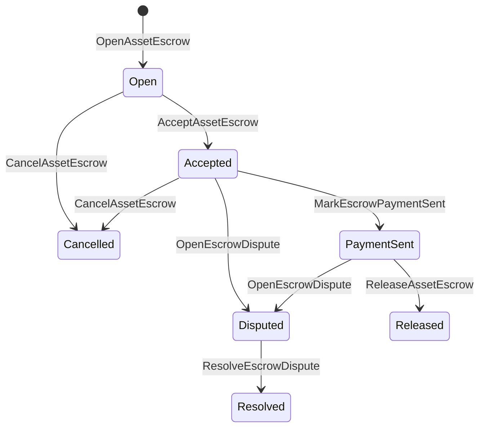

# Asosiy aktivlar eskorovi {#native-asset-escrow}

Native escrow raqamli aktivlar uchun katta qog'oz bilan boshqariladigan saqlov mexanizmi hisoblanadi.
O ' rinlarni arizaga tegishli hisob raqamiga yuborish va
ushbu hisobni himoya qilish uchun ariza kodini, depozit ISIs qiymatni a
Deterministik protokol saqlov hisobini va depozitning hayot davri ro'yxatini
jahon davlat.

Bozorda hisob-kitob qilish uchun mahalliy depozitdan foydalaning, Aitai uslubidagi zaryaddan tashqari to'lov
muvofiqlashtirish, o'zgarishlar va qo'riqlanadigan depozitlar ish oqimlari
kitobdan ko'rinadigan hayot davri holati.

## Konsepsiyalar {#concepts}

| Konsepsiya | Tafsiri |
| --- | --- |
| `EscrowId` | Qo'ng'iroq qiluvchi tomonidan tanlangan identifikator hashni o'rab oladi. U shaffof va nomsiz depozitlar orasida yagona bo'lishi kerak. |
| `AssetEscrowRecord` | Transparent raqamli aktivlar garov yoki qulf yozuvi. |
| `AnonymousAssetEscrowRecord` | Nulllashtiruvchilar, majburiyatlar va dalillar bilan ta'minlangan himoya qilingan depozit qaydnomasi. |
| Xizmat hisob raqami | Zilziladan kelib chiqadigan deterministik protokol hisob ID, garov ID, va aktivlarni aniqlash. |
| Dalillar hashlari | Hisobvaraqlar, hukmlar, xabarlar, saqlash manifestlari yoki boshqa silliqdan tashqari dalillarning hashlari. |

Ochiq yozuvlarda sotuvchi, ixtiyoriy xaridor, aktivlar ta'rifi,
umumiy miqdor, vasiylik hisob raqami, hayot davri holati, xulq-atvor turi, qolgan
miqdori, ixtiyoriy ravishda ozod qilish huquqi, ixtiyoriy muddati tugagan vaqt belgilari, dalillar
hashlar, vaqt belgilari va fakultativ rezolyutsiya tafsilotlari.

Garov summasi ijobiy raqamli aktiv miqdorlari bo ' lishi kerak va
aktivlar ta'rifining raqamli moslamalari. Agar depozit yoki qulf faol bo'lsa,
umumiy aktivlar o'tkazilishi depozit hisobini to'xtatolmaydi; depozitdan chiqish
yoʻllar eshrovdir ISIs quyida tasvirlangan.

## Bozordagi depozit {#marketplace-escrow}

Bozordagi depozitlar zanjir bo'yicha aktivlarni tashqaridagi bilan birlashtiradi
to'lov yoki yetkazib berish ish oqimi.



| ISI | Uni kim taqdim etadi | Ta'sir |
| --- | --- | --- |
| `OpenAssetEscrow` | Sotuvchi | Sotuvchining raqamli aktivini protokol saqlovida qulflaydi va `Open` bozor rekordi. |
| `AcceptAssetEscrow` | Xaridor | Xaridorni yozib olish va harakat qilish `Open` to `Accepted`. Sotuvchi o'z garovini qabul qila olmaydi. |
| `MarkEscrowPaymentSent` | Qabul qilingan xaridor | Harakatlar `Accepted` to `PaymentSent` sotib oluvchi to'lovni ro'yxatdan o'tkazib yuborganidan keyin. |
| `ReleaseAssetEscrow` | Sotuvchi | Harakatlar `PaymentSent` to `Released` va to'liq summani xaridorga o'tkazadi. |
| `CancelAssetEscrow` | Sotuvchi | Harakatlar `Open` yoki `Accepted` to `Cancelled` va to'lov belgilab qo'yilishidan oldin sotuvchiga pulni qaytarib beradi. |
| `OpenEscrowDispute` | Sotuvchi yoki qabul qilingan xaridor | Harakatlar `Accepted` yoki `PaymentSent` to `Disputed` va dalillar hashlarini qo'shadi. |
| `ResolveEscrowDispute` | Hisobvaraq `CanResolveEscrowDispute` | Harakatlar `Disputed` to `Resolved` va summani xaridor va sotuvchi o'rtasida bo'lib oladi. |

nizolarni hal etish miqdorlari salbiy bo'lmasligi kerak va
`buyer_amount + seller_amount` garov miqdoriga teng bo'lishi kerak.
oyoqlarga ruxsat beriladi, lekin butun bo'linish to'liq tuzilgan muvozanatni hisobga olishi kerak.

### Rust Misol {#rust-example}

Ushbu misol sotuvchi va xaridor hisobvaraqlari allaqachon mavjud, aktiv
ma'lumotlar soni sifatida ro'yxatga olingan va sotuvchi etarlicha muvozanatga ega.

```rust
use iroha::{
    client::Client,
    data_model::{
        isi::escrow::{
            AcceptAssetEscrow, MarkEscrowPaymentSent, OpenAssetEscrow,
            ReleaseAssetEscrow,
        },
        prelude::*,
    },
};
use iroha_crypto::Hash;

fn release_marketplace_escrow(
    seller_client: &Client,
    buyer_client: &Client,
    asset_definition_id: AssetDefinitionId,
) -> eyre::Result<()> {
    let escrow_id = EscrowId::new(Hash::new("docs-marketplace-escrow-001"));

    seller_client.submit_blocking(OpenAssetEscrow::with_evidence_hashes(
        escrow_id,
        asset_definition_id,
        Numeric::from(40_u64),
        vec![Hash::new("invoice:2026-001")],
    ))?;

    buyer_client.submit_blocking(AcceptAssetEscrow::new(escrow_id))?;
    buyer_client.submit_blocking(MarkEscrowPaymentSent::new(escrow_id))?;
    seller_client.submit_blocking(ReleaseAssetEscrow::new(escrow_id))?;

    let record = seller_client.query_single(FindAssetEscrowById::new(escrow_id))?;
    assert_eq!(record.status, AssetEscrowStatus::Released);
    assert_eq!(record.remaining_amount, Numeric::zero());

    Ok(())
}
```

## Umumiy aktivlar qulflari {#generic-asset-locks}

Asset locklar bir xil saqlov rekord turi bilan ishlatiladi, ammo ular xaridor-sotuvchi emas
Ular maqsadli hisobvaraq uchun mablag'larni qulflaydilar va tanlov asosida
mablag'larni olib tashlash uchun alohida ruxsat berish organi.

| ISI | Uni kim taqdim etadi | Ta'sir |
| --- | --- | --- |
| `OpenAssetLock` | Manba hisobi | Ijobiy miqdorni qulflaydi, yo'nalishni rekord xaridor sifatida qayd etadi va holatni `Locked`. |
| `DrawdownAssetLock` | Bo'shash to'g'risidagi ruxsatnoma yoki belgilangan joy | Qolgan qo'riqning bir qismini yoki barchasini belgilangan joyga o'tkazadi. |
| `CancelAssetLock` | Qopchiq ochuvchi | Aktiv qulfini bekor qiladi va qolgan miqdorni ochuvchiga qaytarib beradi. |
| `ExpireAssetLock` | Muvofiq muddatdan keyin har qanday tranzaksiya organi | Qutqaruv muddati o ' tadi `expires_at_ms` o'tmishda va qolgan miqdorni ochuvchiga qaytaradi. |

`DrawdownAssetLock` yozuvlarni saqlaydi `Locked` ba'zi miqdor qolsa ham.
Qolgan miqdor nolga yetganda, status `DrawnDown` va
yozuvlar yopildi.

```rust
use iroha::{
    client::Client,
    data_model::{
        isi::escrow::{CancelAssetLock, DrawdownAssetLock, ExpireAssetLock, OpenAssetLock},
        prelude::*,
    },
};
use iroha_crypto::Hash;

fn drawdown_and_close_asset_locks(
    opener_client: &Client,
    destination_client: &Client,
    release_authority_client: &Client,
    asset_definition_id: AssetDefinitionId,
    destination: AccountId,
    release_authority: AccountId,
) -> eyre::Result<()> {
    let trusted_lock_id = EscrowId::new(Hash::new("docs-asset-lock-trusted"));

    opener_client.submit_blocking(OpenAssetLock::with_options(
        trusted_lock_id,
        asset_definition_id.clone(),
        destination.clone(),
        Numeric::from(40_u64),
        Some(release_authority),
        None,
        vec![Hash::new("milestone-plan-v1")],
    ))?;

    release_authority_client.submit_blocking(DrawdownAssetLock::new(
        trusted_lock_id,
        Numeric::from(15_u64),
    ))?;

    let partially_drawn =
        opener_client.query_single(FindAssetEscrowById::new(trusted_lock_id))?;
    assert_eq!(partially_drawn.status, AssetEscrowStatus::Locked);
    assert_eq!(partially_drawn.remaining_amount, Numeric::from(25_u64));

    opener_client.submit_blocking(CancelAssetLock::new(trusted_lock_id))?;
    let cancelled = opener_client.query_single(FindAssetEscrowById::new(trusted_lock_id))?;
    assert_eq!(cancelled.status, AssetEscrowStatus::Cancelled);

    let expiring_lock_id = EscrowId::new(Hash::new("docs-asset-lock-expiring"));
    opener_client.submit_blocking(OpenAssetLock::with_options(
        expiring_lock_id,
        asset_definition_id,
        destination,
        Numeric::from(10_u64),
        None,
        Some(0),
        Vec::new(),
    ))?;

    destination_client.submit_blocking(ExpireAssetLock::new(expiring_lock_id))?;
    let expired = opener_client.query_single(FindAssetEscrowById::new(expiring_lock_id))?;
    assert_eq!(expired.status, AssetEscrowStatus::Expired);

    Ok(())
}
```

Python hozirda generik qulflar uchun yuqori darajadagi yordamchilarni kashf etadi:
`open_asset_lock`, `drawdown_asset_lock`, `cancel_asset_lock`, va
`expire_asset_lock`. Bozor va anonim depozit uchun Python, foydalanish
kanonik `InstructionBox` JSON yo ' li bilan SDK- Bu JSON qo'shish cho'chkasi yoki o'tkazib yuborish
bir SDK bu birinchi darajali depozit quruvchilarni kashf etadi.

## Noto'g'rilik {#disputes}

Bozordagi depozit nizolarga kirishi mumkin `Accepted` yoki `PaymentSent`.
Faqatgina qayd etilgan sotuvchi yoki xaridor nizoni ochishi mumkin.
`CanResolveEscrowDispute`, yoki toʻgʻridan-toʻgʻri resolver hisob raqamiga berilgan
yoki o'yin orqali meros qilib olingan.

```rust
use iroha::{
    client::Client,
    data_model::{
        isi::escrow::{OpenEscrowDispute, ResolveEscrowDispute},
        prelude::*,
    },
};
use iroha_crypto::Hash;
use iroha_executor_data_model::permission::escrow::CanResolveEscrowDispute;

fn resolve_disputed_escrow(
    admin_client: &Client,
    buyer_client: &Client,
    court_client: &Client,
    court: AccountId,
    escrow_id: EscrowId,
) -> eyre::Result<()> {
    admin_client.submit_blocking(Grant::account_permission(
        Permission::from(CanResolveEscrowDispute),
        court,
    ))?;

    buyer_client.submit_blocking(OpenEscrowDispute::with_evidence_hashes(
        escrow_id,
        vec![Hash::new("buyer-payment-receipt")],
    ))?;

    court_client.submit_blocking(ResolveEscrowDispute::with_evidence_hashes(
        escrow_id,
        Numeric::from(30_u64),
        Numeric::from(10_u64),
        vec![Hash::new("court-judgement-001")],
    ))?;

    let record = admin_client.query_single(FindAssetEscrowById::new(escrow_id))?;
    assert_eq!(record.status, AssetEscrowStatus::Resolved);
    assert_eq!(
        record.resolution.as_ref().map(|resolution| resolution.buyer_amount.clone()),
        Some(Numeric::from(30_u64)),
    );

    Ok(())
}
```

## Anonim eskor {#anonymous-escrow}

Anonim depozitlar bozorda bir xil hayot davri bilan ishlaydi, ammo moliyalashtirish va
O'rnatilgan aktivlar harakatlari himoyalangan.
xaridor, status, dalillar hashlari, vaqt belgilari va dalillarga bog'liq harakat
Qadoqlangan qog'ozlar ichidagi miqdorlar va oluvchilar
majburiyatlar, bekor qilish va dalillar.

| Oydinlik ISI | Anonim ISI |
| --- | --- |
| `OpenAssetEscrow` | `OpenAnonymousAssetEscrow` |
| `AcceptAssetEscrow` | `AcceptAnonymousAssetEscrow` |
| `MarkEscrowPaymentSent` | `MarkAnonymousEscrowPaymentSent` |
| `ReleaseAssetEscrow` | `ReleaseAnonymousAssetEscrow` |
| `CancelAssetEscrow` | `CancelAnonymousAssetEscrow` |
| `OpenEscrowDispute` | `OpenAnonymousEscrowDispute` |
| `ResolveEscrowDispute` | `ResolveAnonymousEscrowDispute` |

Pulka yoki prover asboblari isbot qo'shish va ommaviy kirish qismlarini qurishi kerak.
Ochiqlash bir depozit majburiyat yaratadi. ozod, bekor va anonim
nizolarni hal etish uchun bir martalik depozit majburiyatlarini sarflash va
amalda talab etiladigan xaridor, sotuvchi yoki bo'linadigan ishlab chiqarish majburiyatlari.

```rust
use iroha::{
    client::Client,
    data_model::{
        isi::escrow::{
            AcceptAnonymousAssetEscrow, MarkAnonymousEscrowPaymentSent,
            OpenAnonymousAssetEscrow,
        },
        prelude::*,
        proof::ProofAttachment,
    },
};
use iroha_crypto::Hash;

fn open_anonymous_escrow(
    seller_client: &Client,
    buyer_client: &Client,
    escrow_id: EscrowId,
    asset_definition_id: AssetDefinitionId,
    funding_nullifiers: Vec<[u8; 32]>,
    escrow_commitment: [u8; 32],
    proof: ProofAttachment,
    root_hint: Option<[u8; 32]>,
) -> eyre::Result<()> {
    seller_client.submit_blocking(OpenAnonymousAssetEscrow::with_evidence_hashes(
        escrow_id,
        asset_definition_id,
        funding_nullifiers,
        escrow_commitment,
        proof,
        root_hint,
        vec![Hash::new("shielded-invoice")],
    ))?;

    buyer_client.submit_blocking(AcceptAnonymousAssetEscrow::new(escrow_id))?;
    buyer_client.submit_blocking(MarkAnonymousEscrowPaymentSent::new(escrow_id))?;

    Ok(())
}
```

Asosiy to'siqli operatsiya modeli uchun ko'ring
[Anonim bitimlar](/uz/blockchain/anonymous-transactions.md).

## SDK Foydalanish {#sdk-usage}

Garovga ko'maklashadigan mablag'lar SDKs. Rust kanonik
ma'lumotlar modeli. Python hozirda umumiy aktivni blokirovka qilish yordamchilarini kashf etadi.
JavaScript va TypeScript foydalanish Kotodama Uy egasining qo'ng'iroqlarini saqlab turing. Kotlin/JVM va Swift
bozorda va anonim depozit uchun fayzli yukni ishlab chiqaruvchilarni taqdim etish.

| SDK | Ushbu yuzani ishlating | Maqsad |
| --- | --- | --- |
| [Rust](#rust-sdk) | `iroha::data_model::isi::escrow` | Bozordagi depozit, umumiy qulflar, anonim depozit, so'rovlar va tadbirlar. |
| [Python](#python-asset-locks) | `Instruction.open_asset_lock`, `TransactionDraft.open_asset_lock`, va mijoz `*_and_wait` yordamchilar | Bozorlar va nomsiz depozit yordamchilari birinchi darajali emas Python usullari hali. |
| [JavaScript / TypeScript](#javascript-and-typescript-kotodama) | `compileKotodamaProgram` bilan `@iroha/iroha-js/kotodama-compiler` | Xizmatkor uy egasi ichkariga qoʻngʻiroq qiladi Kotodama shartnomalar. |
| [Kotlin / JVM](#kotlin-and-jvm) | `InstructionTemplate` sinflar `org.hyperledger.iroha.sdk.core.model.instructions` | Bozor va anonim depozit qo'riqlash namunalari. |
| [Swift / iOS](#swift-and-ios) | `NativeEscrowInstructionBuilders` va `IrohaSDK.build*Escrow*` yordamchilar | Bozor va anonim depozit Norito JSON yo'l-yo'riq yuklari. |

Quyidagi misollarda ko'rsatmalar qurilishiga e'tibor qaratilmoqda.
imzolarni boshqarish va tranzaksiyalarni taqdim etish
har biri SDK.

### Rust SDK {#rust-sdk}

Foydalanish Rust SDK agar sizga to'liq mahalliy qamrov yoki so'rov / tadbirni qo'llab-quvvatlash kerak bo'lsa.
Yuqoridagi misollar bozorda chiqarilgan, umumiy blokirovkalar cheklangan, nizolarni ko'rsatmoqda
Yechimi va o'zidan-o'zini himoya qilish
`iroha::data_model::isi::escrow`.

```rust
use iroha::{
    client::Client,
    data_model::{isi::escrow::OpenAssetEscrow, prelude::*},
};
use iroha_crypto::Hash;

fn open_and_read(
    client: &Client,
    asset_definition_id: AssetDefinitionId,
) -> eyre::Result<AssetEscrowRecord> {
    let escrow_id = EscrowId::new(Hash::new("docs-rust-sdk-escrow"));

    client.submit_blocking(OpenAssetEscrow::new(
        escrow_id,
        asset_definition_id,
        Numeric::from(10_u64),
    ))?;

    client.query_single(FindAssetEscrowById::new(escrow_id))
}
```

### Python Asset Lock {#python-asset-locks}

O ' zbekiston Respublikasi Python SDK birinchi darajali yordamchilarni umumiy aktivlar qulflari uchun kashf etadi.
Maqsadli to'lovlar uchun, ozod qilish organi tomonidan pul olish,
ochuvchi va muddati tugaydigan qaytarish.

```python
client.open_asset_lock_and_wait(
    chain_id="dev-chain",
    authority="<source-account-id>",
    private_key_hex="<source-private-key-hex>",
    escrow_id="merchant-lock-001",
    asset_definition_id="<asset-definition-base58>",
    destination="<destination-account-id>",
    amount="2500",
    release_authority="<trusted-release-account-id>",
    expires_at_ms=1_704_000_000_000,
)

client.drawdown_asset_lock_and_wait(
    chain_id="dev-chain",
    authority="<trusted-release-account-id>",
    private_key_hex="<trusted-release-private-key-hex>",
    escrow_id="merchant-lock-001",
    amount="1000",
)

client.expire_asset_lock_and_wait(
    chain_id="dev-chain",
    authority="<any-account-id>",
    private_key_hex="<any-private-key-hex>",
    escrow_id="merchant-lock-001",
)
```

Ikki tomonli qulf uchun, uni qoldiring `release_authority`; yo'nalish hisob raqami
soʻngra taqdim etish `drawdown_asset_lock`.

### JavaScript va TypeScript Kotodama {#javascript-and-typescript-kotodama}

O ' zbekiston Respublikasi JavaScript SDK hozirda to'g'ridan-to'g'ri mahalliy depozit tranzaksiyasini oshkor etmaydi
qurilishchilar uchun. JavaScript yoki TypeScript ishga tushiruvchi dasturlar Kotodama
kontraktlar, hisob-kitoblarni o'rnatish va Kotodama tahrirlovchi.

Oʻz navbatida , ushbu qoʻllanmani oʻrnatish uchun
shaffofliksiz depozit uchun eng tor kirish setlarini olish mumkin emas ISIs. Wildcard gʻoyalaridan foydalaning
qo'ng'iroq qiluvchi eksport qilingan kirish punktlari `escrow_*` qurilgan.

```js
import { compileKotodamaProgram } from "@iroha/iroha-js/kotodama-compiler";

const source = `
seiyaku MarketplaceEscrow {
  meta { abi_version: 1; }

  #[access(read="*", write="*")]
  kotoage fn run() permission(Admin) {
    let asset = asset_definition("62Fk4FPcMuLvW5QjDGNF2a4jAmjM");
    let offer = name("aitai_offer");
    let evidence = norito_bytes("00");

    call escrow_open_offer(offer, asset, 10, evidence);
    call escrow_accept(offer);
    call escrow_mark_payment_sent(offer);
    call escrow_release(offer);
  }
}
`;

const compiled = compileKotodamaProgram(source, {
  sourceName: "escrow.ko",
});

if (compiled.diagnostics.length > 0) {
  throw new Error(compiled.diagnostics.map((item) => item.message).join("\n"));
}
```

nizolar uchun foydalanish `escrow_open_dispute(offer, evidence)` va
`escrow_resolve_dispute(offer, buyer_amount, seller_amount, evidence)`.
Anonim eskor uy egasi qoʻngʻiroqlarini qabul qiladi Norito yordamchi yuklangan bytlarni so'rash, masalan
`anonymous_escrow_open_offer(request)`.

### Kotlin va JVM {#kotlin-and-jvm}

O ' zbekiston Respublikasi Kotlin/JVM SDK O'zlashtirilgan ko'rsatma namunalari sifatida nativ escrow modellari.
namuna talab qilingan maydonlarni tasdiqlaydi va qoʻllaniladigan kanonik argumentlar xaritasini koʻrsatadi
Transaksiya tuzishchisi tomonidan.

```kotlin
import org.hyperledger.iroha.sdk.core.model.escrow.NativeEscrowPermissions
import org.hyperledger.iroha.sdk.core.model.instructions.AcceptAssetEscrowInstruction
import org.hyperledger.iroha.sdk.core.model.instructions.MarkEscrowPaymentSentInstruction
import org.hyperledger.iroha.sdk.core.model.instructions.OpenAssetEscrowInstruction
import org.hyperledger.iroha.sdk.core.model.instructions.ReleaseAssetEscrowInstruction
import org.hyperledger.iroha.sdk.core.model.instructions.ResolveEscrowDisputeInstruction

val open = OpenAssetEscrowInstruction(
    escrowId = "escrow-hash",
    assetDefinition = "xor#wonderland",
    amount = "42.5",
    evidenceHashes = listOf("invoice-hash"),
)
val accept = AcceptAssetEscrowInstruction("escrow-hash")
val paid = MarkEscrowPaymentSentInstruction("escrow-hash")
val release = ReleaseAssetEscrowInstruction("escrow-hash")
val resolve = ResolveEscrowDisputeInstruction(
    escrowId = "escrow-hash",
    buyerAmount = "30",
    sellerAmount = "12.5",
    evidenceHashes = listOf("judgement-hash"),
)

println(open.arguments)
println(NativeEscrowPermissions.CAN_RESOLVE_ESCROW_DISPUTE)
```

Anonim namunalar quyidagicha mavjud:
`OpenAnonymousAssetEscrowInstruction`, `AcceptAnonymousAssetEscrowInstruction`,
`MarkAnonymousEscrowPaymentSentInstruction`,
`ReleaseAnonymousAssetEscrowInstruction`,
`CancelAnonymousAssetEscrowInstruction`,
`OpenAnonymousEscrowDisputeInstruction`, va
`ResolveAnonymousEscrowDisputeInstruction`. Android Java qoʻngʻiroqchilar
muvofiqlashtirish `NativeEscrowInstructions.*` qurilish ishchilari Android artefakt.

### Swift va iOS {#swift-and-ios}

O ' zbekiston Respublikasi Swift SDK depozit qo ' riqnomalari sifatida yaratadi Norito JSON Faydalangan yuklar.
`NativeEscrowInstructionBuilders` to'g'ridan-to'g'ri yoki teng
`IrohaSDK.build*Escrow*` ilova allaqachon mavjud boʻlganda yordamchi `IrohaSDK`
Misol uchun.

```swift
import IrohaSwift

let open = try NativeEscrowInstructionBuilders.openAssetEscrow(
    escrowId: "escrow-hash",
    assetDefinition: "xor#wonderland",
    amount: "42.5",
    evidenceHashes: ["invoice-hash"]
)
let accept = try NativeEscrowInstructionBuilders.acceptAssetEscrow(
    escrowId: "escrow-hash"
)
let paid = try NativeEscrowInstructionBuilders.markEscrowPaymentSent(
    escrowId: "escrow-hash"
)
let release = try NativeEscrowInstructionBuilders.releaseAssetEscrow(
    escrowId: "escrow-hash"
)
let resolve = try NativeEscrowInstructionBuilders.resolveEscrowDispute(
    escrowId: "escrow-hash",
    buyerAmount: "30",
    sellerAmount: "12.5",
    evidenceHashes: ["judgement-hash"]
)
```

Anonim Swift quruvchilar bekor qiluvchi ro'yxatlarni, ishlab chiqarish majburiyatlari ro'yxatlarini, dalilni olishadi
kamol va fakultativ `rootHint` Qiymatlar. nizolarni hal etish uchun ruxsatnoma
token sifatida mavjud `NativeEscrowPermissions.canResolveEscrowDispute`.

## Savollar va voqealar {#queries-and-events}

Status sahifalari, kelishuv ishlari va qo'llab-quvvatlash vositalari uchun depozit so'rovlaridan foydalaning:

| Savol | Maqsad |
| --- | --- |
| `FindAssetEscrowById` | O ' rganarli bir depozitni o ' qing yoki u bilan qulflash `EscrowId`. |
| `FindAssetEscrows` | Ochiq depozit va qulf yozuvlarini ro'yxatga oling. |
| `FindAssetEscrowsBySeller` | Sotuvchi yoki qulf ochuvchi tomonidan ochilgan yozuvlarni ro'yxatga oling. |
| `FindAssetEscrowsByBuyer` | Xaridor tomonidan qabul qilingan bozor depozitlarini ro'yxatga oling yoki maqsadga yo'naltirilgan qulflarni kiriting. |
| `FindAssetEscrowsByStatus` | Hisobotlarni roʻyxatga olish `AssetEscrowStatus`. |
| `FindAnonymousAssetEscrowById` | Bir nomsiz depozitni oʻqing `EscrowId`. |
| `FindAnonymousAssetEscrows*` | Barcha yozuvlar, sotuvchi, xaridor yoki maqomiga ko'ra anonim depozitlarni ro'yxatdan o'tkazing. |

`EscrowEventFilter` shaffof mahalliy depozit va qulfga obuna boʻlishi mumkin
depozit orqali sodir bo'ladigan voqealar ID, sotuvchi, xaridor, status va tadbirlar to'plami.
oila oʻz ichiga oladi `Opened`, `Accepted`, `PaymentSent`, `Released`,
`Cancelled`, `Expired`, `Disputed`, va `Resolved`. Anonim depozit
yozuvlar anonim depozit so'rovlari orqali tekshiriladi.

## Operatsiya ma'lumotlari {#operational-notes}

- Katta hisobvaraqlarni, chat loglarini, hukmlarni yoki audit paketlarini
  depozitni yozib olish va ularning hashlarini dalil sifatida qo'shish.
- Oʻzgarmas foydalanish `EscrowId` ilovalarda chiquvchilik, shuning uchun takroriy urinishlar yaratolmaydi
  bir xil taklif uchun ikki martalik depozitlar.
- Grant `CanResolveEscrowDispute` faqat hisobvaraqlarga yoki
  nizo jarayonlari.
- To'lovlarni verifikatsiya qilish uchun to'lovlar zanjiridan tashqarida qo'llash. Iroha yozuvlar
  saqlov va hayot davri o'tishlari; u fiat yoki tashqi tekshiruvlarni amalga oshirmaydi
  to'lov yo'llari o'z-o'zi.
