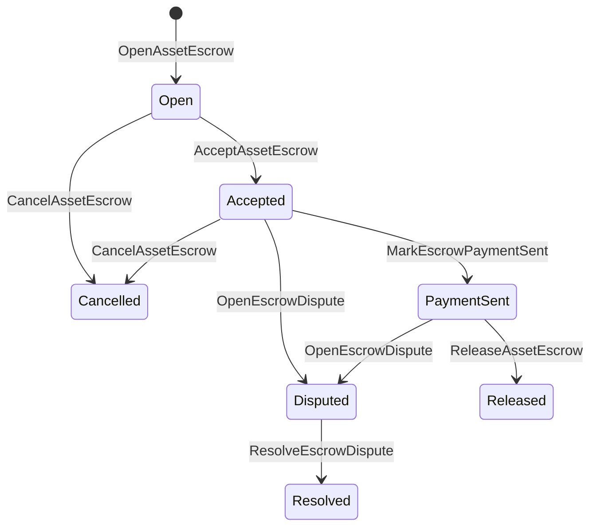

# Native Asset Escrow {#native-asset-escrow}

Native escrow - bu raqamli aktivlar uchun katta qog'oz bilan boshqariladigan saqlov mexanizmi. Dasturga tegishli hisobvaraqqa aktivlarni yuborish va ushbu hisobvaraqni himoya qilish uchun ariza kodini qo'llab-quvvatlash o'rniga, garov ISIs qiymatni deterministik protokol saqlov hisob raqamiga o'tkazadi va garovning hayotiy davrini jahon holatida qayd etadi.

Bozorda to'lash uchun mahalliy depozitdan foydalaning, Aitai uslubidagi zaryaddan tashqari to'lovlarni muvofiqlashtirish, muhim qadamlar qulflari va katta kitobga ko'rinadigan hayot davri holatiga ega bo'lgan himoyalangan depozit ish oqimlaridan foydalanish.

## Fikrlar {#concepts}

|Konsepsiya |Tafsiri |
| --- | --- |
|`EscrowId` |Qo'ng'iroq qiluvchi tomonidan tanlangan identifikator hashni o'rab oladi. U shaffof va nomsiz depozitlar bo'yicha yagona bo'lishi kerak. |
|`AssetEscrowRecord` |Transparent raqamli aktivlar garov yoki qulf yozuvlari. |
|`AnonymousAssetEscrowRecord` |Nulllashtiruvchilar, majburiyatlar va dalillar bilan ta'minlangan himoya qilingan depozit qaydnomasi. |
|Himoya hisobi |Deterministik protokol hisobvarag'i ID, depozit ID va aktivni aniqlashdan kelib chiqdi. |
|Koʻrinib turibdiki , |Dalil hashlari fakturalar, hukmlar, xabarlar, saqlash manifestlari yoki zanjirdan tashqari boshqa dalillarni aniqlashi mumkin. Dalil yukining o'zi depozitda saqlanmaydi. |

Transparent yozuvlarda sotuvchi, ixtiyoriy xaridor, aktivlar ta'rifi, umumiy miqdor, saqlov hisob raqami, hayot davomiyligi holati, xulq-atvor turi, qoldiq miqdori, ixtiyoriy chiqarilish vakolatlari, ixtiyorli muddati tugagan vaqt belgilari, dalillar hashlari, vaqt belgilari va ixtiyoriy yechim ma'lumotlari mavjud.

Garov summasi ijobiy raqamli aktiv miqdorlari bo'lishi kerak va aktiv ta'rifining raqamli tavsiflariga mos kelishi kerak. Garov yoki qulf faol bo'lsa-da, umumiy aktiv o'tkazmalari saqlov hisobini tozalay olmaydi; saqlashdan chiqish yo'llari quyida tasvirlangan garov ISIs hisoblanadi.

## Bozordagi depozit {#marketplace-escrow}

Marketplace escrow sarmoyasi bo'yicha aktivni tashqaridagi to'lov yoki etkazib berish ish oqimi bilan birlashtiradi.



|ISI |Uni kim taqdim etadi ?|Taʼsir|
| --- | --- | --- |
|`OpenAssetEscrow` |Sotuvchi |Sotuvchining raqamli aktivini protokol saqlovida qulflaydi va `Open` bozor rekordini yaratadi. |
|`AcceptAssetEscrow` |Xaridor |Xaridorni yozib oladi va `Open` ni `Accepted` ga o'tkazadi. Sotuvchi o'z garovini qabul qila olmaydi. |
|`MarkEscrowPaymentSent` |Qabul qilingan xaridor |`Accepted` sotib oluvchining ro'yxatdan tashqari to'lovni yuborganidan keyin `PaymentSent` ga o'tadi. |
|`ReleaseAssetEscrow` |Sotuvchi |`PaymentSent` ni `Released` ga o'tkazadi va to'liq hisoblangan summani xaridorga o'tkazib beradi. |
|`CancelAssetEscrow` |Sotuvchi | Harakatlar `Open` yoki `Accepted` to `Cancelled` va to'lov belgilab qo'yilishidan oldin sotuvchiga qaytarish. |
|`OpenEscrowDispute` |Sotuvchi yoki qabul qilingan xaridor |`Accepted` yoki `PaymentSent` ni `Disputed` ga ko'chirib, dalillar hashlarini qo'shadi. |
|`ResolveEscrowDispute` |`CanResolveEscrowDispute` bilan hisob raqami |`Disputed` ni `Resolved` ga ko'chirib, summani sotib oluvchi va sotuvchi o'rtasida bo'linadi. |

nizolarni hal qilish miqdorlari salbiy bo'lmasligi kerak va `buyer_amount + seller_amount` garov miqdoriga teng bo'lishi kerak. nol qiymatli to'siqlarga ruxsat etiladi, ammo butun ajratma bloklangan balansni hisobga olishi kerak.

### Rust Misol {#rust-example}

Ushbu misol, sotuvchi va xaridor hisobvaraqlari allaqachon mavjud bo'lganini, aktivning tavsifi raqamli sifatida ro'yxatdan o'tganini va sotuvchining etarlicha muvozanati borligini nazarda tutadi.

```rust
use iroha::{
    client::Client,
    data_model::{
        isi::escrow::{
            AcceptAssetEscrow, MarkEscrowPaymentSent, OpenAssetEscrow,
            ReleaseAssetEscrow,
        },
        prelude::*,
    },
};
use iroha_crypto::Hash;

fn release_marketplace_escrow(
    seller_client: &Client,
    buyer_client: &Client,
    asset_definition_id: AssetDefinitionId,
) -> eyre::Result<()> {
    let escrow_id = EscrowId::new(Hash::new("docs-marketplace-escrow-001"));

    seller_client.submit_blocking(OpenAssetEscrow::with_evidence_hashes(
        escrow_id,
        asset_definition_id,
        Numeric::from(40_u64),
        vec![Hash::new("invoice:2026-001")],
    ))?;

    buyer_client.submit_blocking(AcceptAssetEscrow::new(escrow_id))?;
    buyer_client.submit_blocking(MarkEscrowPaymentSent::new(escrow_id))?;
    seller_client.submit_blocking(ReleaseAssetEscrow::new(escrow_id))?;

    let record = seller_client.query_single(FindAssetEscrowById::new(escrow_id))?;
    assert_eq!(record.status, AssetEscrowStatus::Released);
    assert_eq!(record.remaining_amount, Numeric::zero());

    Ok(())
}
```

## Umumiy aktivlar qulflari {#generic-asset-locks}

Asset locklar xuddi shu saqlov rekord turidan foydalanadi, ammo ular xaridor-sotuvchi takliflari emas. Ular maqsadli hisob uchun mablag'larni qulflaydilar va mablag'larni olib tashlash uchun alohida ruxsat berish organini talab qilishadi.

|ISI |Uni kim taqdim etadi ?|Taʼsir |
| --- | --- | --- |
|`OpenAssetLock` |Manba hisobi |Ijobiy miqdorni bloklaydi, yo'nalish joyini rekord xaridor sifatida qayd etadi va holatini `Locked` ga o'rnatadi. |
|`DrawdownAssetLock` |Bo ' shatish huquqi yoki belgilangan joy bo ' lmasa , ruxsat berish huquqi |Qolgan qamoqni qisman yoki to'liq belgilangan joyga o'tkazadi. |
|`CancelAssetLock` |Qotib ochuvchi |Aktiv qulfni bekor qiladi va qolgan miqdorni ochuvchiga qaytaradi. |
|`ExpireAssetLock` |So ' nggi muddatdan keyin har qanday bitim hokimiyati |O'tmishda `expires_at_ms` bilan tuzilgan qulf muddati tugadi va qolgan miqdorni ochuvchiga qaytarib beradi. |

`DrawdownAssetLock` hisobni `Locked`da saqlaydi, ammo ba'zi miqdor qoladi. Qolgan miqdori nolga yetganda, status `DrawnDown` bo'ladi va rekord yopiladi.

```rust
use iroha::{
    client::Client,
    data_model::{
        isi::escrow::{CancelAssetLock, DrawdownAssetLock, ExpireAssetLock, OpenAssetLock},
        prelude::*,
    },
};
use iroha_crypto::Hash;

fn drawdown_and_close_asset_locks(
    opener_client: &Client,
    destination_client: &Client,
    release_authority_client: &Client,
    asset_definition_id: AssetDefinitionId,
    destination: AccountId,
    release_authority: AccountId,
) -> eyre::Result<()> {
    let trusted_lock_id = EscrowId::new(Hash::new("docs-asset-lock-trusted"));

    opener_client.submit_blocking(OpenAssetLock::with_options(
        trusted_lock_id,
        asset_definition_id.clone(),
        destination.clone(),
        Numeric::from(40_u64),
        Some(release_authority),
        None,
        vec![Hash::new("milestone-plan-v1")],
    ))?;

    release_authority_client.submit_blocking(DrawdownAssetLock::new(
        trusted_lock_id,
        Numeric::from(15_u64),
    ))?;

    let partially_drawn =
        opener_client.query_single(FindAssetEscrowById::new(trusted_lock_id))?;
    assert_eq!(partially_drawn.status, AssetEscrowStatus::Locked);
    assert_eq!(partially_drawn.remaining_amount, Numeric::from(25_u64));

    opener_client.submit_blocking(CancelAssetLock::new(trusted_lock_id))?;
    let cancelled = opener_client.query_single(FindAssetEscrowById::new(trusted_lock_id))?;
    assert_eq!(cancelled.status, AssetEscrowStatus::Cancelled);

    let expiring_lock_id = EscrowId::new(Hash::new("docs-asset-lock-expiring"));
    opener_client.submit_blocking(OpenAssetLock::with_options(
        expiring_lock_id,
        asset_definition_id,
        destination,
        Numeric::from(10_u64),
        None,
        Some(0),
        Vec::new(),
    ))?;

    destination_client.submit_blocking(ExpireAssetLock::new(expiring_lock_id))?;
    let expired = opener_client.query_single(FindAssetEscrowById::new(expiring_lock_id))?;
    assert_eq!(expired.status, AssetEscrowStatus::Expired);

    Ok(())
}
```

Python hozirda generik qulflar uchun yuqori darajadagi yordamchilarni aniqlaydi: `open_asset_lock`, `drawdown_asset_lock`, `cancel_asset_lock`, va `expire_asset_lock`. Bozor va anonim depozit uchun Python, qo'llash kanonik `InstructionBox` JSON yo ' li bilan SDK Bu ... JSON qo'shish portlasi, yoki bir SDK bu esa birinchi darajali depozit quruvchilarni kashf etadi.

## Toʻqnashish {#disputes}

Bozordagi depozit `Accepted` yoki `PaymentSent` dan nizo kiritishi mumkin. Faqatgina qayd etilgan sotuvchi yoki xaridor nizoni ochishi mumkin. Hal qilish uchun `CanResolveEscrowDispute` talab qilinadi, ya'ni bu to'g'ridan-to'g'ri hal qiluvchining hisob raqamiga beriladi yoki roli orqali meros bo'ladi.

```rust
use iroha::{
    client::Client,
    data_model::{
        isi::escrow::{OpenEscrowDispute, ResolveEscrowDispute},
        prelude::*,
    },
};
use iroha_crypto::Hash;
use iroha_executor_data_model::permission::escrow::CanResolveEscrowDispute;

fn resolve_disputed_escrow(
    admin_client: &Client,
    buyer_client: &Client,
    court_client: &Client,
    court: AccountId,
    escrow_id: EscrowId,
) -> eyre::Result<()> {
    admin_client.submit_blocking(Grant::account_permission(
        Permission::from(CanResolveEscrowDispute),
        court,
    ))?;

    buyer_client.submit_blocking(OpenEscrowDispute::with_evidence_hashes(
        escrow_id,
        vec![Hash::new("buyer-payment-receipt")],
    ))?;

    court_client.submit_blocking(ResolveEscrowDispute::with_evidence_hashes(
        escrow_id,
        Numeric::from(30_u64),
        Numeric::from(10_u64),
        vec![Hash::new("court-judgement-001")],
    ))?;

    let record = admin_client.query_single(FindAssetEscrowById::new(escrow_id))?;
    assert_eq!(record.status, AssetEscrowStatus::Resolved);
    assert_eq!(
        record.resolution.as_ref().map(|resolution| resolution.buyer_amount.clone()),
        Some(Numeric::from(30_u64)),
    );

    Ok(())
}
```

## Anonim eskor {#anonymous-escrow}

Anonim garov bozorda bir xil hayot davri bilan ishlaydi, ammo moliyalashtirish va yopish aktivlari harakatlari himoyalangan. Umumiy yozuvlarda hali ham sotuvchi, xaridor, status, dalillar hashlari, vaqt belgilari va hujjati bilan bog'liq harakatlarni saqlaydi. Qadoqlangan qog'ozlar ichidagi miqdorlar va oluvchilar majburiyatlar, bekor qilish qoidalari va tasdiqlovchi ilovalar bilan tasvirlanadi.

|Ochiq ISI |Anonim ISI |
| --- | --- |
|`OpenAssetEscrow` |`OpenAnonymousAssetEscrow` |
|`AcceptAssetEscrow` |`AcceptAnonymousAssetEscrow` |
|`MarkEscrowPaymentSent` |`MarkAnonymousEscrowPaymentSent` |
|`ReleaseAssetEscrow` |`ReleaseAnonymousAssetEscrow` |
|`CancelAssetEscrow` |`CancelAnonymousAssetEscrow` |
|`OpenEscrowDispute` |`OpenAnonymousEscrowDispute` |
|`ResolveEscrowDispute` |`ResolveAnonymousEscrowDispute` |

Vallet yoki prover vositasi dalillar birikmasini va jamoat ma'lumotlarini yaratishi kerak. ochish bir depozit majburiyatini yaratadi. Bo'shatish, bekor qilish va anonim nizolarni hal etish to'g'ri bitta depozit majburiyatini sarflashi kerak va harakat talab qiladigan xaridor, sotuvchi yoki bo'linadigan mahsulot majburiyatlarini yaratadi.

```rust
use iroha::{
    client::Client,
    data_model::{
        isi::escrow::{
            AcceptAnonymousAssetEscrow, MarkAnonymousEscrowPaymentSent,
            OpenAnonymousAssetEscrow,
        },
        prelude::*,
        proof::ProofAttachment,
    },
};
use iroha_crypto::Hash;

fn open_anonymous_escrow(
    seller_client: &Client,
    buyer_client: &Client,
    escrow_id: EscrowId,
    asset_definition_id: AssetDefinitionId,
    funding_nullifiers: Vec<[u8; 32]>,
    escrow_commitment: [u8; 32],
    proof: ProofAttachment,
    root_hint: Option<[u8; 32]>,
) -> eyre::Result<()> {
    seller_client.submit_blocking(OpenAnonymousAssetEscrow::with_evidence_hashes(
        escrow_id,
        asset_definition_id,
        funding_nullifiers,
        escrow_commitment,
        proof,
        root_hint,
        vec![Hash::new("shielded-invoice")],
    ))?;

    buyer_client.submit_blocking(AcceptAnonymousAssetEscrow::new(escrow_id))?;
    buyer_client.submit_blocking(MarkAnonymousEscrowPaymentSent::new(escrow_id))?;

    Ok(())
}
```

Asosiy himoyalangan tranzaksiya modeli uchun [Anonim tranzaksiyalar ](/uz/blockchain/anonymous-transactions.md)-ni ko'ring.

## SDK Foydalanish {#sdk-usage}

SDKs. Rust kanonik ma'lumotlar modelini o'z ichiga oladi. Python hozirda umumiy aktivlarni qulflash yordamchilarini oshkor qiladi. JavaScript va TypeScript Kotodama escrow hosting qo'ng'iroqlaridan foydalanadi. Kotlin/JVM va Swift bozorda o'rnatilgan foydalanish yukini ishlab chiqaruvchi va anonim depozitni taqdim etadi.

|SDK |Ushbu yuzani ishlating .|Maqsad |
| --- | --- | --- |
| [Rust](#rust-sdk) |`iroha::data_model::isi::escrow` |Bozordagi eskor, umumiy qulflar, anonim eskor, so'rovlar va tadbirlar.|
| [Python](#python-asset-locks) |`Instruction.open_asset_lock`, `TransactionDraft.open_asset_lock` va mijozlarga `*_and_wait` yordamchilar |Jismoniy aktivlar qulflari. Bozor va anonim depozit yordamchilari hali birinchi darajali Python usullar emas. |
| [JavaScript /TypeScript](#javascript-and-typescript-kotodama) |`compileKotodamaProgram` dan `@iroha/iroha-js/kotodama-compiler`|Kotodama shartnomalar ichida eskrov uyasi qo'ng'iroqlari. |
| [Kotlin /JVM](#kotlin-and-jvm) |`InstructionTemplate` sinflarida `org.hyperledger.iroha.sdk.core.model.instructions` |Bozor va anonim depozit qo'riqlamalar namunalari. |
| [Swift / iOS](#swift-and-ios) |`NativeEscrowInstructionBuilders` va `IrohaSDK.build*Escrow*` yordamchilari |Bozor va anonim depozit Norito JSON yo'l-yo'riq yuklamalari. |

Quyidagi misollarda ko'rsatmalar qurilishiga e'tibor qaratilmoqda. Hisob mablag'lari, imzolarni boshqarish va tranzaksiyalarni taqdim etish har bir SDK uchun normal oqimni kuzatadi.

### Rust SDK {#rust-sdk}

To'liq mahalliy qoplama yoki so'rov / tadbirni qo'llab-quvvatlash kerak bo'lganda Rust SDK dan foydalaning. Yuqoridagi misollarda bozorda chiqarilish, umumiy qulflash chegirmasi, nizolarni hal etish va `iroha::data_model::isi::escrow` bilan anonim depozit qurilishi ko'rsatilgan.

```rust
use iroha::{
    client::Client,
    data_model::{isi::escrow::OpenAssetEscrow, prelude::*},
};
use iroha_crypto::Hash;

fn open_and_read(
    client: &Client,
    asset_definition_id: AssetDefinitionId,
) -> eyre::Result<AssetEscrowRecord> {
    let escrow_id = EscrowId::new(Hash::new("docs-rust-sdk-escrow"));

    client.submit_blocking(OpenAssetEscrow::new(
        escrow_id,
        asset_definition_id,
        Numeric::from(10_u64),
    ))?;

    client.query_single(FindAssetEscrowById::new(escrow_id))
}
```

### Python Aktivlar qulflari {#python-asset-locks}

Python SDK umumiy aktivlar qulflari uchun birinchi darajali yordamchilarni kashf etadi. Ulardan maqsadli to'lovlar, ozod qilish organi tomonidan pul olishlar, ochuvchi tomonidan bekor qilish va muddati tugagan qaytarish uchun foydalaning.

```python
client.open_asset_lock_and_wait(
    chain_id="dev-chain",
    authority="<source-account-id>",
    private_key_hex="<source-private-key-hex>",
    escrow_id="merchant-lock-001",
    asset_definition_id="<asset-definition-base58>",
    destination="<destination-account-id>",
    amount="2500",
    release_authority="<trusted-release-account-id>",
    expires_at_ms=1_704_000_000_000,
)

client.drawdown_asset_lock_and_wait(
    chain_id="dev-chain",
    authority="<trusted-release-account-id>",
    private_key_hex="<trusted-release-private-key-hex>",
    escrow_id="merchant-lock-001",
    amount="1000",
)

client.expire_asset_lock_and_wait(
    chain_id="dev-chain",
    authority="<any-account-id>",
    private_key_hex="<any-private-key-hex>",
    escrow_id="merchant-lock-001",
)
```

Ikki tarafli qulf uchun `release_authority` o'chirib tashlang; so'ngra belgilangan hisobvaraq `drawdown_asset_lock`ni taqdim etishi mumkin.

### JavaScript va TypeScript Kotodama {#javascript-and-typescript-kotodama}

JavaScript SDK hozirda to'g'ridan-to'g'ri mahalliy eskrov tranzaksiyalari tuzuvchilarini ochib bermaydi. Kotodama shartnomalarni ishga tushiradigan JavaScript yoki TypeScript dasturlar uchun Kotodama kompilyerida eskrov host qo'ng'iroqlarini yig'ish.

Native escrow host qoʻngʻiroqlari aniq kirish maʼlumotlarini talab qiladi , chunki kompilyer shaffof boʻlmagan escrow uchun torroq kirish setlarini keltira olmaydi ISIs. Eksport qilingan kirish nuqtalarida qoʻllanma kartani ishlatish `escrow_*` qurilgan.

```js
import { compileKotodamaProgram } from "@iroha/iroha-js/kotodama-compiler";

const source = `
seiyaku MarketplaceEscrow {
  meta { abi_version: 1; }

  #[access(read="*", write="*")]
  kotoage fn run() permission(Admin) {
    let asset = asset_definition("62Fk4FPcMuLvW5QjDGNF2a4jAmjM");
    let offer = name("aitai_offer");
    let evidence = norito_bytes("00");

    call escrow_open_offer(offer, asset, 10, evidence);
    call escrow_accept(offer);
    call escrow_mark_payment_sent(offer);
    call escrow_release(offer);
  }
}
`;

const compiled = compileKotodamaProgram(source, {
  sourceName: "escrow.ko",
});

if (compiled.diagnostics.length > 0) {
  throw new Error(compiled.diagnostics.map((item) => item.message).join("\n"));
}
```

nizolar uchun qo'llash `escrow_open_dispute(offer, evidence)` va `escrow_resolve_dispute(offer, buyer_amount, seller_amount, evidence)`. Anonim garovli uy egasining qoʻngʻiroqlari qabul qilinadi Norito yordamchi yukni talab qilish bytlari, masalan `anonymous_escrow_open_offer(request)`.

### Kotlin va JVM {#kotlin-and-jvm}

Kotlin/JVM SDK nativ escrowni maxsus ko'rsatma shablonlari sifatida namunalashtiradi. Har bir shablon talab qilinadigan maydonlarni tasdiqlaydi va tranzaksiya quruvchisi tomonidan ishlatiladigan kanonik argumentlar xaritasini aniqlaydi.

```kotlin
import org.hyperledger.iroha.sdk.core.model.escrow.NativeEscrowPermissions
import org.hyperledger.iroha.sdk.core.model.instructions.AcceptAssetEscrowInstruction
import org.hyperledger.iroha.sdk.core.model.instructions.MarkEscrowPaymentSentInstruction
import org.hyperledger.iroha.sdk.core.model.instructions.OpenAssetEscrowInstruction
import org.hyperledger.iroha.sdk.core.model.instructions.ReleaseAssetEscrowInstruction
import org.hyperledger.iroha.sdk.core.model.instructions.ResolveEscrowDisputeInstruction

val open = OpenAssetEscrowInstruction(
    escrowId = "escrow-hash",
    assetDefinition = "xor#wonderland",
    amount = "42.5",
    evidenceHashes = listOf("invoice-hash"),
)
val accept = AcceptAssetEscrowInstruction("escrow-hash")
val paid = MarkEscrowPaymentSentInstruction("escrow-hash")
val release = ReleaseAssetEscrowInstruction("escrow-hash")
val resolve = ResolveEscrowDisputeInstruction(
    escrowId = "escrow-hash",
    buyerAmount = "30",
    sellerAmount = "12.5",
    evidenceHashes = listOf("judgement-hash"),
)

println(open.arguments)
println(NativeEscrowPermissions.CAN_RESOLVE_ESCROW_DISPUTE)
```

Anonim namunalar quyidagicha mavjud `OpenAnonymousAssetEscrowInstruction`, `AcceptAnonymousAssetEscrowInstruction`, `MarkAnonymousEscrowPaymentSentInstruction`, `ReleaseAnonymousAssetEscrowInstruction`, `CancelAnonymousAssetEscrowInstruction`, `OpenAnonymousEscrowDisputeInstruction`, va `ResolveAnonymousEscrowDisputeInstruction`. Android Java qoʻngʻiroqchilari moslashishni ishlatishlari mumkin `NativeEscrowInstructions.*` qurilish ishchilari Android artefakt.

### Swift va iOS {#swift-and-ios}

Swift SDK eskoring ko'rsatmalarini Norito JSON faydali yuklar sifatida yaratadi. `NativeEscrowInstructionBuilders` dan to'g'ridan-to'g'ri foydalaning yoki dasturingizda allaqachon `IrohaSDK` namunasi mavjud bo'lganda ekvivalent `IrohaSDK.build*Escrow*` yordamchisini chaqiring.

```swift
import IrohaSwift

let open = try NativeEscrowInstructionBuilders.openAssetEscrow(
    escrowId: "escrow-hash",
    assetDefinition: "xor#wonderland",
    amount: "42.5",
    evidenceHashes: ["invoice-hash"]
)
let accept = try NativeEscrowInstructionBuilders.acceptAssetEscrow(
    escrowId: "escrow-hash"
)
let paid = try NativeEscrowInstructionBuilders.markEscrowPaymentSent(
    escrowId: "escrow-hash"
)
let release = try NativeEscrowInstructionBuilders.releaseAssetEscrow(
    escrowId: "escrow-hash"
)
let resolve = try NativeEscrowInstructionBuilders.resolveEscrowDispute(
    escrowId: "escrow-hash",
    buyerAmount: "30",
    sellerAmount: "12.5",
    evidenceHashes: ["judgement-hash"]
)
```

Anonim Swift quruvchilar bekor qiluvchi ro'yxatlarni, ishlab chiqarish majburiyatlari ro'yxatlarini, dalillar lug'atini va ixtiyoriy ravishda `rootHint` Qiymatlar. nizolarni hal etish uchun ruxsatnoma belgisi quyidagicha mavjud: `NativeEscrowPermissions.canResolveEscrowDispute`.

## Savollar va voqealar {#queries-and-events}

Status sahifalari, yarashtirish ishlari va qo'llab-quvvatlash vositalari uchun depozit so'rovlaridan foydalaning:

|Savollar |Maqsad|
| --- | --- |
|`FindAssetEscrowById` |`EscrowId` bilan bitta shaffof depozit yoki qulfni o'qing. |
|`FindAssetEscrows` |Ochiq depozit va qulf yozuvlarini ro'yxatdan o'tkazish. |
|`FindAssetEscrowsBySeller` |Sotuvchi yoki qulfni ochuvchi tomonidan ochilgan yozuvlarni ro'yxatdan o'tkazish. |
|`FindAssetEscrowsByBuyer` |Xaridor tomonidan qabul qilingan bozor depozitlarini ro'yxatga oling yoki maqsadga yo'naltirilgan qulflarni o'qing. |
|`FindAssetEscrowsByStatus` |`AssetEscrowStatus` tomonidan ro'yxatga olingan hujjatlar. |
|`FindAnonymousAssetEscrowById` |`EscrowId` tomonidan bitta anonim depozitni o'qing. |
|`FindAnonymousAssetEscrows*` |Barcha yozuvlar, sotuvchi, xaridor yoki status bo'yicha anonim depozitlarni ro'yxatdan o'tkazing. |

`EscrowEventFilter` o'z navbatida ID, sotuvchi, xaridor, holati va tadbirlar to'g'risidagi maskara orqali shaffof mahalliy depozit va qulf tadbirlariga obuna bo'lishi mumkin. Tadbirlar oilasiga `Opened`, `Accepted`, `PaymentSent`, `Released`, `Cancelled`, `Expired`, `Disputed`, va `Resolved`. Anonim eskoryo yozuvlari anonim eskoryo so'rovlari orqali tekshirilgan.

## Operatsiya ma'lumotlari {#operational-notes}

- Katta fakturalar, chat loglari, hukmlar yoki audit to'plamlarini depozit hisobidan tashqarida saqlang va ularning hashlarini dalil sifatida qo'shing.
- Ilovalarda barqaror `EscrowId` chizig'idan foydalaning, shuning uchun takroriy sinovlar bir xil taklif uchun ikki martalik depozitlarni yaratolmaydi.
- `CanResolveEscrowDispute` nafaqat nizo jarayonini boshqaradigan hisobvaraqlar yoki vazifalarga beriladi.
- To'lovlarni verifikatsiya qilishni ariza siyosati sifatida ko'rib chiqish. Iroha saqlash va hayot davri o'tishlarini qayd etadi; u fiat yoki tashqi to'lov yo'llarini o'zi tekshirmaydi.
