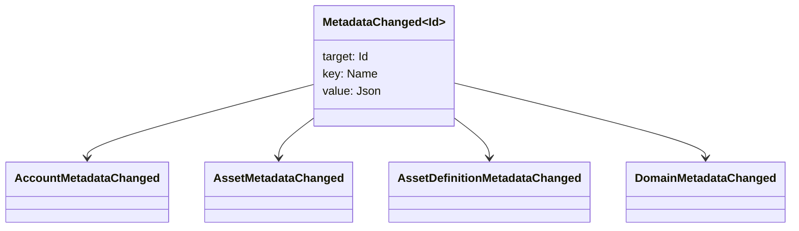

# Metadatalar {#metadata}

Metadatalar - bu kitob ob'ektlariga ilova qilingan aniqlangan kalit qiymat xaritasi. `Name` qiymatlar va qiymatlar JSON (`Json`) yordamchi yuklar.

Quyidagi ob'ektlar metadatalarga ega bo'lishi mumkin:

- domenlar
- hisob raqamlari
- aktivlar
- aktivlarning ta'riflari
- NFTs
- RWAs
- qo'zg'atuvchilar
- operatsiyalar

Katta hisobda bo'lgan kichik tavsif yoki indekslash maydonlari uchun metadatalardan foydalaning. Katta foydali yuklar WSV tashqarisida saqlanishi va URI yoki SoraFS yo'nalishi bilan ko'rsatilishi kerak.

Metadotlar, aktivlar NFTs, RWAs yoki zanjirdan tashqari saqlashni tanlash bo'yicha yo'l-yo'riq olish uchun [Metadotlar va Ledger Storage Options](/uz/guide/configure/metadata-and-store-assets.md) ni ko'ring.

## Taira bilan sinab ko'ring. {#try-it-on-taira}

Metadatalar oddiy resurs o'qish orqali ko'rinadi. Ushbu buyruq Taira aktivlarning hozirda metadatalarga ega bo'lgan ta'riflarini ro'yxatga oladi:

```bash
curl -fsS 'https://taira.sora.org/v1/assets/definitions?limit=100' \
  | jq '.items[]
    | select((.metadata | length) > 0)
    | {id, name, metadata}'
```

Domenlar va hisob-kitoblar uchun bir xil modeldan foydalaning:

```bash
curl -fsS 'https://taira.sora.org/v1/domains?limit=20' \
  | jq '.items[] | select((.metadata // {} | length) > 0)'

curl -fsS 'https://taira.sora.org/v1/accounts?limit=20' \
  | jq '.items[] | select((.metadata // {} | length) > 0)'
```

Bo'sh chiqarishni haqiqiy natija deb hisoblang. Bu Taira ob'ektlarining joriy sahifasida metadotlar yo'qligini anglatadi, bu esa oxirgi nuqta muvaffaqiyatsiz tugadi emas.

## Metadatalarni yangilash {#updating-metadata}

Metadotlar Iroha maxsus yo'l-yo'riqlari bilan o'zgartirilgan:

- [`SetKeyValue`](/uz/blockchain/instructions.md#setkeyvalue-removekeyvalue) kalitni qo'shadi yoki o'rniga qo'yadi
- [`RemoveKeyValue`](/uz/blockchain/instructions.md#setkeyvalue-removekeyvalue) kalitni olib tashlaydi

Transaksiyani taqdim etayotgan organ faol ish vaqti tasdiqlovchi tomonidan talab qilingan ruxsatga ega bo'lishi kerak. Andoza ruxsatlar yuzi uchun koʻring [Ruxsat belgisi](/uz/reference/permissions.md).

## O'zgarishlar {#events}

Ma'lumotlar hodisalari metama'lumotlar o'zgarganda chiqariladi. Umumiy hodisa payload `MetadataChanged<Id>`:



[ma'lumotlar hodisalari filtrlaridan ](/uz/blockchain/filters.md#data-event-filters) foydalanib, integratsiya uchun muhim bo'lgan entitet turi yoki obyekti ID uchun faqat metadata hodisalariga obuna bo'ling.

## Savollar {#queries}

Metama'lumotlar so'ragan ob'ektning bir qismi sifatida qaytariladi. Masalan, [`FindAccountById`](/uz/reference/queries.md#accounts-and-permissions), [`FindDomainById`](/uz/reference/queries.md#domains-and-peers) yoki [`FindAssetDefinitionById`](/uz/reference/queries.md#assets-nfts-and-rwas)dan foydalaning. [`FindNfts`](/uz/reference/queries.md#assets-nfts-and-rwas) yoki [`FindNftsByAccountId`](/uz/reference/queries.md#assets-nfts-and-rwas) NFTs va [`FindRwas` ](/uz/reference/queries.md#assets-nfts-and-rwas) RWA lotlar uchun foydalaning. Keyin ob'ektning metadata maydonini o'qing. NFT so'rov javoblari NFT `content` xaritasini yozuvchi metadata sifatida ko'rsatadi.

Metadata kalitlari katta ma'lumotlar ro'yxatining bir qismi hisoblanadi, shuning uchun ularni barqaror saqlang va JSON qiymati o'sha versiyani aniq olib borishi mumkin bo'lganda dasturga mos versiyalarni kodlashdan qoching.
