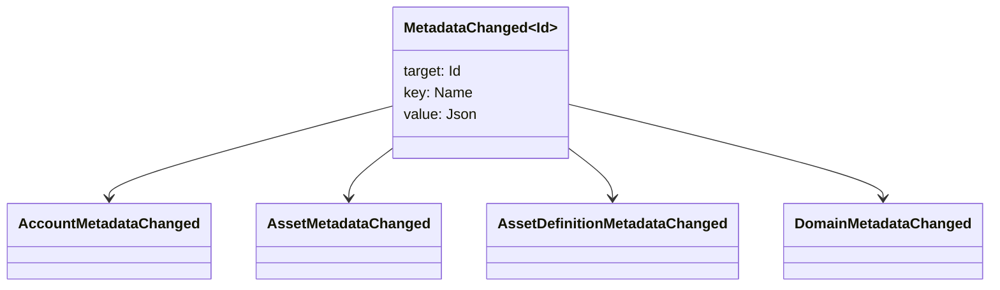

# Metadatalar {#metadata}

Metadatalar - bu katta ma'lumotlar daftaridagi ob'ektlarga qo'shilgan aniqlangan kalit qiymatlari xaritasi.
`Name` qiymati va qiymatlari JSON (`Json`) foydali yuklar.

Quyidagi ob'ektlar metadatalarni olib borishi mumkin:

- domenlar
- hisob raqamlari
- aktivlar
- aktivlar ta'riflari
- NFTs
- RWAs
- qo'zg'atuvchilar
- operatsiyalar

Katta kitobga kiradigan kichik tavsif yoki indekslash maydonlari uchun metadatalardan foydalanish
Katta fayzli yuklar WSV va a
o'simlik, URI, yoki SoraFS yo'l.

Metadatalarni, aktivlarni tanlash bo'yicha ko'rsatmalar uchun; NFTs, RWAs, yoki zanjirdan tashqarida
saqlash, qarang
[Metadata va Ledger saqlash variantlari](/uz/guide/configure/metadata-and-store-assets.md).

## Uni sinab koʻring . Taira {#try-it-on-taira}

Metadatalar odatiy resurs o'qish orqali ko'rinadi. Taira
Ayni paytda metadatalarga ega bo'lgan aktivlar ta'riflari:

```bash
curl -fsS 'https://taira.sora.org/v1/assets/definitions?limit=100' \
  | jq '.items[]
    | select((.metadata | length) > 0)
    | {id, name, metadata}'
```

Domenlar va hisoblar uchun xuddi shu modeldan foydalaning:

```bash
curl -fsS 'https://taira.sora.org/v1/domains?limit=20' \
  | jq '.items[] | select((.metadata // {} | length) > 0)'

curl -fsS 'https://taira.sora.org/v1/accounts?limit=20' \
  | jq '.items[] | select((.metadata // {} | length) > 0)'
```

Bo'sh chiqishni haqiqiy natija deb hisoblang. Taira
ob'ektlarda metadatalar mavjud emas, balki oxirgi nuqta muvaffaqiyatsiz tugadi.

## Metadatalarni yangilash {#updating-metadata}

Metadotlar o ' zgaradi Iroha Maxsus ko'rsatmalar:

- [`SetKeyValue`](/uz/blockchain/instructions.md#setkeyvalue-removekeyvalue)
  kalitni qo'shadi yoki almashtiradi
- [`RemoveKeyValue`](/uz/blockchain/instructions.md#setkeyvalue-removekeyvalue)
  kalitni olib tashlaydi

Transaksiyani taqdim etayotgan organ talab qilingan ruxsatnomaga ega bo'lishi kerak
Aktiv ishga tushirish vaqtini tasdiqlash vositasida.
[Ruxsat toʻgʻriligi](/uz/reference/permissions.md).

## Tadbirlar {#events}

Ma'lumotlar hodisalari metama'lumotlar o'zgarganda chiqarilgan.
`MetadataChanged<Id>`:



Foydalanish [ma'lumotlar hodisasi filtrlari](/uz/blockchain/filters.md#data-event-filters) to
entitet turi yoki obyekti uchun faqat metadata hodisalariga obuna bo'lish ID bu
integratsiya uchun muhimdir.

## Savollar {#queries}

Metadata so'rovlangan ob'ektning bir qismi sifatida qaytariladi.
[`FindAccountById`](/uz/reference/queries.md#accounts-and-permissions),
[`FindDomainById`](/uz/reference/queries.md#domains-and-peers), yoki
[`FindAssetDefinitionById`](/uz/reference/queries.md#assets-nfts-and-rwas).
Foydalanish [`FindNfts`](/uz/reference/queries.md#assets-nfts-and-rwas) yoki
[`FindNftsByAccountId`](/uz/reference/queries.md#assets-nfts-and-rwas) uchun
NFTs, va [`FindRwas`](/uz/reference/queries.md#assets-nfts-and-rwas) uchun RWA
Keyin ob'ektning metadata maydonini o'qing. NFT soʻrov javoblari
NFT `content` xarita rekord metadata sifatida.

Metadata kalitlari katta ma'lumotlar davlatining bir qismi, shuning uchun ularni barqaror saqlang va ulardan qoching
dasturga mos versiyani kodlash kalit nomiga kiritiladi JSON
qiymat ushbu versiyani aniq ko'rsatishi mumkin.
